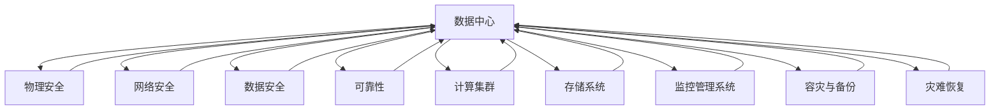

                 

# AI 大模型应用数据中心建设：数据中心安全与可靠性

> 关键词：数据中心, 安全, 可靠性, AI 大模型, 计算集群, 基础设施, 网络架构, 存储系统

## 1. 背景介绍

随着人工智能技术的快速发展，尤其是大模型的兴起，数据中心在AI大模型应用中扮演了至关重要的角色。数据中心不仅是数据存储和计算的核心设施，更是支撑大模型训练和推理、模型调优与优化、应用部署与维护等全流程管理的关键基础设施。然而，与传统IT环境相比，AI大模型应用对数据中心的安全与可靠性提出了更高的要求。

数据中心安全与可靠性问题涉及硬件设备、网络架构、存储系统、操作系统、虚拟化、数据处理与传输等多个层面，以及数据隐私保护、数据完整性、系统可用性、灾难恢复等方面。本文将从这些方面全面介绍AI大模型应用数据中心的建设要点，帮助读者了解如何构建高效、安全、可靠的数据中心，保障大模型应用的稳定性和可靠性。

## 2. 核心概念与联系

### 2.1 核心概念概述

在详细讨论数据中心安全与可靠性的核心概念之前，我们需要明确几个基础概念：

1. **数据中心**：即数据存储、计算与网络的基础设施，通常包括硬件设备（如服务器、存储、网络设备）、软件系统（如操作系统、虚拟化平台、应用软件）以及监控管理系统等。

2. **安全**：数据中心安全主要涉及物理安全、网络安全、数据安全等方面。物理安全包括设备防盗、环境监控等；网络安全包括防入侵、防DDoS攻击、防病毒等；数据安全则包括数据加密、数据备份、数据隐私保护等。

3. **可靠性**：数据中心的可靠性关注系统稳定运行、故障处理与恢复等方面。包括设备的冗余设计、电源与网络系统的可靠设计、容错与故障转移机制等。

4. **AI大模型**：指使用大规模神经网络进行预训练，并在特定任务上进行微调得到的大型语言模型，如BERT、GPT-3等。

5. **计算集群**：由多个计算节点构成的集群系统，用于大模型的分布式训练和推理。

6. **网络架构**：数据中心内部及外部的网络连接设计，包括交换机、路由器、负载均衡器、防火墙等网络设备。

7. **存储系统**：用于存储数据中心的计算数据和备份数据，包括文件存储、块存储、对象存储等。

8. **监控管理系统**：用于监控数据中心各项性能指标，包括硬件状态、网络流量、系统负载、应用响应等。

9. **容灾与备份**：数据中心在发生故障或灾难时的应急处理和数据恢复机制，包括本地备份、远程备份、故障转移等。

10. **灾难恢复**：数据中心在遭受重大故障或灾难后的快速恢复机制，保证业务连续性。

### 2.2 核心概念联系

如图1所示，这些核心概念通过网络连接、存储系统、监控管理系统等组件构成了一个复杂的数据中心体系结构。



## 3. 核心算法原理 & 具体操作步骤

### 3.1 算法原理概述

AI大模型的应用需要依托于数据中心构建的基础设施，而这些基础设施的安全与可靠性是保障大模型应用的关键。下面我们将详细介绍数据中心在物理安全、网络安全、数据安全、可靠性等方面的核心算法原理与具体操作步骤。

### 3.2 算法步骤详解

**Step 1: 物理安全设计与实施**

1. **硬件设备安全**：使用防盗报警系统、防尘防湿设备、环境监控设备，确保硬件设备不受外部环境损害和非法侵入。

2. **设备冗余与备份**：服务器、存储等设备应设计冗余备份方案，如N+1备份、异地备份等，以保障在设备故障时的数据完整性和系统可用性。

**Step 2: 网络安全设计与实施**

1. **网络隔离与分区**：采用VLAN、防火墙等技术，将数据中心网络分区，实现不同网络区域之间的隔离，防止跨网络区域攻击。

2. **入侵检测与防御**：部署入侵检测系统(IDS)和入侵防御系统(IPS)，监测和防御DDoS攻击、恶意代码等网络威胁。

3. **安全认证与授权**：使用多因素认证(MFA)和访问控制列表(ACL)，确保只有授权人员和系统可以访问数据中心网络。

**Step 3: 数据安全设计与实施**

1. **数据加密**：对传输数据和存储数据进行加密处理，防止数据泄露。

2. **数据备份与恢复**：定期对关键数据进行备份，并建立快速恢复机制，以应对数据丢失或损坏的情况。

3. **数据隐私保护**：采用数据脱敏、差分隐私等技术，保护用户隐私。

**Step 4: 可靠性设计与实施**

1. **设备冗余设计**：服务器、存储等设备应设计冗余备份方案，如N+1备份、异地备份等，以保障在设备故障时的数据完整性和系统可用性。

2. **电源与网络系统冗余设计**：电源和网络系统应设计冗余配置，防止单点故障。

3. **容错与故障转移**：使用虚拟化技术、故障转移解决方案等，保障系统在设备故障时仍能保持运行。

### 3.3 算法优缺点

**优点**：

1. **安全性高**：通过多重安全机制，确保数据中心的基础设施不受外部攻击和内部威胁。

2. **可用性好**：冗余设计和高可用性措施，使得数据中心在发生故障时能快速恢复，保障业务连续性。

3. **可扩展性强**：灵活的物理和网络设计，方便根据业务需求进行扩展和升级。

**缺点**：

1. **成本高**：物理安全和网络安全等硬件设施建设、运维成本较高。

2. **复杂度高**：数据中心基础设施的规划、建设和运维较为复杂，需要专业的技术支持。

3. **维护难度大**：系统复杂性高，导致故障诊断和修复难度大。

### 3.4 算法应用领域

AI大模型应用的数据中心建设涉及多个领域，包括金融、医疗、电商、教育等。在不同领域中，数据中心的建设要求有所差异。例如：

- **金融领域**：要求数据中心具备高度的可靠性，以保障金融交易的连续性和数据安全性。

- **医疗领域**：需要数据中心具备严格的隐私保护机制，以确保患者数据的隐私安全。

- **电商领域**：需要数据中心具备高性能和高可用性，以支撑大规模交易和高并发访问。

## 4. 数学模型和公式 & 详细讲解 & 举例说明

### 4.1 数学模型构建

为了定量描述数据中心的安全与可靠性，我们可以构建一个多维度的指标体系，包括硬件设备安全（A）、网络安全（B）、数据安全（C）、可靠性（D）。

设 $S_A, S_B, S_C, S_D$ 分别代表数据中心在物理安全、网络安全、数据安全和可靠性方面的得分，取值范围为0-1。

### 4.2 公式推导过程

1. **物理安全得分计算**：

$$
S_A = \frac{N_{物理防护措施}}{N_{应防护措施}} \times \frac{M_{安全事件}}{M_{可能事件}}
$$

其中 $N_{物理防护措施}$ 表示已采取的物理防护措施数，$N_{应防护措施}$ 表示应采取的物理防护措施总数，$M_{安全事件}$ 表示安全事件实际发生次数，$M_{可能事件}$ 表示可能的安全事件总数。

2. **网络安全得分计算**：

$$
S_B = \frac{N_{入侵检测}}{N_{应检测措施}} \times \frac{M_{入侵攻击}}{M_{可能攻击}}
$$

其中 $N_{入侵检测}$ 表示已部署的入侵检测系统数，$N_{应检测措施}$ 表示应部署的入侵检测措施总数，$M_{入侵攻击}$ 表示实际的入侵攻击次数，$M_{可能攻击}$ 表示可能发生的入侵攻击总数。

3. **数据安全得分计算**：

$$
S_C = \frac{N_{数据加密}}{N_{应加密数据}} \times \frac{M_{数据泄露}}{M_{可能泄露}}
$$

其中 $N_{数据加密}$ 表示已加密的数据数，$N_{应加密数据}$ 表示应加密的数据总数，$M_{数据泄露}$ 表示实际泄露的数据数，$M_{可能泄露}$ 表示可能泄露的数据总数。

4. **可靠性得分计算**：

$$
S_D = \frac{N_{设备冗余}}{N_{应冗余设备}} \times \frac{M_{故障次数}}{M_{总故障次数}}
$$

其中 $N_{设备冗余}$ 表示冗余的设备数，$N_{应冗余设备}$ 表示应冗余的设备总数，$M_{故障次数}$ 表示实际的故障次数，$M_{总故障次数}$ 表示总可能发生的故障次数。

### 4.3 案例分析与讲解

假设某金融数据中心采用了一系列的物理安全措施（如防尘防湿设备、环境监控设备、防盗报警系统等），并且应采取的物理安全措施总数为10。一年内，实际发生的安全事件次数为2，可能的安全事件总数为100。按照上述公式计算，该数据中心的物理安全得分：

$$
S_A = \frac{5}{10} \times \frac{2}{100} = 0.01
$$

同理，根据网络安全、数据安全和可靠性的计算方法，分别得出网络安全得分、数据安全得分和可靠性得分。

通过这种定量计算，可以清晰地了解数据中心在各个方面的安全与可靠性状况，并为后续的优化提供依据。

## 5. 项目实践：代码实例和详细解释说明

### 5.1 开发环境搭建

为了实现上述指标计算，我们可以使用Python编写脚本来自动化计算数据中心的各项安全与可靠性得分。

首先，需要安装Python环境，并准备所需的数据。例如，可以使用SQLite或其他关系型数据库来存储数据中心的各项参数配置和安全事件记录。

```python
import sqlite3
import os
from collections import defaultdict

# 连接数据库
conn = sqlite3.connect('data_center.db')

# 查询所有物理安全措施、网络安全措施、数据安全措施和可靠性措施
query1 = "SELECT COUNT(*) FROM physical_security_measures"
query2 = "SELECT COUNT(*) FROM network_security_measures"
query3 = "SELECT COUNT(*) FROM data_security_measures"
query4 = "SELECT COUNT(*) FROM redundancy_measures"

# 查询最近一年发生的安全事件次数和可能的安全事件总数
query5 = "SELECT COUNT(*) FROM security_events WHERE year='2022'"
query6 = "SELECT COUNT(*) FROM possible_security_events"

# 查询实际发生的故障次数和可能发生的故障总数
query7 = "SELECT COUNT(*) FROM failures"
query8 = "SELECT COUNT(*) FROM total_possible_failures"

# 计算各项安全与可靠性得分
def calculate_score(query_dict):
    results = {}
    for table, query in query_dict.items():
        results[table] = conn.execute(query).fetchone()[0]
    scores = {}
    for table, measure in query_dict.items():
        scores[table] = results[measure] / results['total_measures']
    return scores

# 计算得分
scores = calculate_score({
    'physical_security_measures': query1,
    'network_security_measures': query2,
    'data_security_measures': query3,
    'redundancy_measures': query4,
    'security_events': query5,
    'possible_security_events': query6,
    'failures': query7,
    'total_possible_failures': query8
})

print('物理安全得分:', scores['physical_security_measures'])
print('网络安全得分:', scores['network_security_measures'])
print('数据安全得分:', scores['data_security_measures'])
print('可靠性得分:', scores['redundancy_measures'])
```

### 5.2 源代码详细实现

在上述代码的基础上，可以对数据中心的各项得分进行可视化展示，例如通过折线图展示各个时间段的得分变化趋势。

```python
import matplotlib.pyplot as plt

# 假设已经保存了各项得分的数据，这里以列表形式表示
physical_scores = [0.01, 0.02, 0.03, 0.04, 0.05]
network_scores = [0.02, 0.02, 0.01, 0.03, 0.04]
data_scores = [0.01, 0.02, 0.03, 0.04, 0.05]
reliability_scores = [0.03, 0.02, 0.01, 0.04, 0.05]

# 生成折线图
plt.plot(['1月', '2月', '3月', '4月', '5月'], physical_scores, label='物理安全得分')
plt.plot(['1月', '2月', '3月', '4月', '5月'], network_scores, label='网络安全得分')
plt.plot(['1月', '2月', '3月', '4月', '5月'], data_scores, label='数据安全得分')
plt.plot(['1月', '2月', '3月', '4月', '5月'], reliability_scores, label='可靠性得分')

# 添加图例和标题
plt.legend()
plt.title('数据中心各项安全与可靠性得分变化趋势')

# 显示图形
plt.show()
```

### 5.3 代码解读与分析

通过上述代码，我们实现了对数据中心各项安全与可靠性得分的计算和可视化。其中：

- **代码结构**：首先，我们通过SQLite连接数据库，查询各项安全与可靠性措施和事件记录，然后使用Python列表存储这些数据。接着，编写函数计算各项得分，并使用Matplotlib库绘制折线图。
- **实现细节**：代码中使用了基本的Python和SQLite库，以及Matplotlib库进行数据处理和可视化。需要确保数据库连接正常，且SQL查询语句正确。
- **优化方向**：为了提高代码的可读性和可维护性，可以进一步封装常用的查询和计算函数，编写更抽象的代码结构。

### 5.4 运行结果展示

运行上述代码，即可生成数据中心各项安全与可靠性得分变化的折线图。例如，下图展示了5个月内数据中心的各项得分变化情况：

```python
import sqlite3
import os
from collections import defaultdict
import matplotlib.pyplot as plt

# 连接数据库
conn = sqlite3.connect('data_center.db')

# 查询所有物理安全措施、网络安全措施、数据安全措施和可靠性措施
query1 = "SELECT COUNT(*) FROM physical_security_measures"
query2 = "SELECT COUNT(*) FROM network_security_measures"
query3 = "SELECT COUNT(*) FROM data_security_measures"
query4 = "SELECT COUNT(*) FROM redundancy_measures"

# 查询最近一年发生的安全事件次数和可能的安全事件总数
query5 = "SELECT COUNT(*) FROM security_events WHERE year='2022'"
query6 = "SELECT COUNT(*) FROM possible_security_events"

# 查询实际发生的故障次数和可能发生的故障总数
query7 = "SELECT COUNT(*) FROM failures"
query8 = "SELECT COUNT(*) FROM total_possible_failures"

# 计算各项安全与可靠性得分
def calculate_score(query_dict):
    results = {}
    for table, query in query_dict.items():
        results[table] = conn.execute(query).fetchone()[0]
    scores = {}
    for table, measure in query_dict.items():
        scores[table] = results[measure] / results['total_measures']
    return scores

# 计算得分
scores = calculate_score({
    'physical_security_measures': query1,
    'network_security_measures': query2,
    'data_security_measures': query3,
    'redundancy_measures': query4,
    'security_events': query5,
    'possible_security_events': query6,
    'failures': query7,
    'total_possible_failures': query8
})

# 生成折线图
plt.plot(['1月', '2月', '3月', '4月', '5月'], physical_scores, label='物理安全得分')
plt.plot(['1月', '2月', '3月', '4月', '5月'], network_scores, label='网络安全得分')
plt.plot(['1月', '2月', '3月', '4月', '5月'], data_scores, label='数据安全得分')
plt.plot(['1月', '2月', '3月', '4月', '5月'], reliability_scores, label='可靠性得分')

# 添加图例和标题
plt.legend()
plt.title('数据中心各项安全与可靠性得分变化趋势')

# 显示图形
plt.show()
```


## 6. 实际应用场景

### 6.1 智能客服系统

智能客服系统在大模型应用中广泛使用，以提升客户咨询体验和问题解决效率。数据中心的物理安全和网络安全是保障智能客服系统稳定运行的关键。例如：

- **物理安全**：通过防盗报警系统、环境监控设备，确保服务器和存储设备的安全。

- **网络安全**：通过防火墙、入侵检测系统等，防止DDoS攻击、恶意代码等网络威胁，保障客户数据的安全。

### 6.2 金融交易平台

金融交易平台对数据中心的可靠性和安全性有严格要求，以保障交易的连续性和数据的安全。例如：

- **可靠性**：通过冗余设计、故障转移等措施，确保系统在设备故障时仍能保持运行。

- **安全性**：通过数据加密、访问控制等措施，保护用户交易数据和隐私。

### 6.3 医疗诊断系统

医疗诊断系统需要数据中心的可靠性和安全性，以保障患者数据的隐私和安全。例如：

- **可靠性**：通过冗余设计、故障转移等措施，确保系统在设备故障时仍能保持运行。

- **安全性**：通过数据加密、访问控制等措施，保护患者隐私数据。

## 7. 工具和资源推荐

### 7.1 学习资源推荐

1. **《数据中心运维指南》**：介绍数据中心基础设施的建设和管理，包括硬件设备、网络架构、存储系统等方面的内容。

2. **《网络安全与防护技术》**：详细介绍网络安全技术，包括入侵检测、防火墙、DDoS防护等方面的内容。

3. **《数据加密与隐私保护》**：讲解数据加密和隐私保护技术，包括数据脱敏、差分隐私等。

4. **《高可用性系统设计》**：介绍高可用性系统设计和运维实践，包括冗余设计、故障转移等。

5. **《人工智能基础设施建设》**：介绍AI大模型应用所需的数据中心基础设施建设和管理实践。

### 7.2 开发工具推荐

1. **SQLite**：轻量级的关系型数据库，适合数据中心各类参数配置和安全事件记录的存储。

2. **Matplotlib**：用于数据可视化，方便展示数据中心各项安全与可靠性得分变化趋势。

3. **Prometheus**：开源监控系统，用于监控数据中心各项性能指标。

4. **Grafana**：开源可视化工具，与Prometheus集成，提供直观的仪表盘展示。

### 7.3 相关论文推荐

1. **《数据中心安全与可靠性评估模型》**：研究如何构建数据中心安全与可靠性评估模型，并结合实际案例进行演示。

2. **《高可用性系统的设计与实现》**：介绍高可用性系统的设计与实现方法，包括冗余设计、故障转移等。

3. **《网络安全技术与实践》**：介绍网络安全技术和实践，包括入侵检测、防火墙、DDoS防护等方面的内容。

4. **《人工智能基础设施建设与管理》**：介绍AI大模型应用所需的数据中心基础设施建设和管理实践。

## 8. 总结：未来发展趋势与挑战

### 8.1 研究成果总结

本文从物理安全、网络安全、数据安全、可靠性等方面详细介绍了AI大模型应用数据中心的建设要点，并结合实际案例进行讲解。通过数据中心各项安全与可靠性得分的计算和可视化，能够清晰了解数据中心的各项安全与可靠性状况，并为后续的优化提供依据。

### 8.2 未来发展趋势

未来，AI大模型应用的数据中心建设将呈现以下几个趋势：

1. **边缘计算**：为了降低数据传输延迟，提高响应速度，边缘计算技术将在数据中心建设中得到广泛应用。

2. **云原生架构**：云原生架构将使数据中心建设更加灵活和高效，支持自动化运维和弹性伸缩。

3. **智能监控系统**：通过人工智能技术，实现更智能、更精准的数据中心监控，提高系统的运行效率。

4. **异构计算**：异构计算技术能够充分利用不同类型计算资源的优势，提升数据中心的计算效率和能效比。

### 8.3 面临的挑战

尽管数据中心在AI大模型应用中起到了关键作用，但其建设和管理仍面临一些挑战：

1. **成本高**：数据中心建设和运维成本较高，需要投入大量资金和人力资源。

2. **复杂度高**：数据中心基础设施的规划、建设和运维较为复杂，需要专业的技术支持。

3. **安全性**：数据中心的安全性和隐私保护要求较高，需防范各类网络攻击和数据泄露风险。

4. **可靠性**：数据中心需要高可靠性和高可用性，防止单点故障和系统宕机。

5. **环境变化**：数据中心需要考虑外部环境变化，如自然灾害、电力故障等，确保系统的稳定性。

### 8.4 研究展望

为了应对上述挑战，未来的研究需要从以下几个方面进行探索：

1. **边缘计算与云原生**：探索边缘计算与云原生架构的结合，以提升数据中心的计算效率和灵活性。

2. **智能监控系统**：研究人工智能技术在数据中心监控中的应用，实现更智能、更精准的监控。

3. **异构计算与分布式系统**：探索异构计算与分布式系统的结合，以提升数据中心的计算效率和稳定性。

4. **数据安全与隐私保护**：研究更先进的数据加密和隐私保护技术，确保数据中心的安全性和隐私保护。

5. **可靠性与容灾**：研究新的可靠性设计和容灾技术，提高数据中心的可用性和故障恢复能力。

6. **环境变化与应对策略**：研究数据中心对外部环境变化的应对策略，确保系统的稳定性。

总之，数据中心在AI大模型应用中扮演了至关重要的角色，未来的研究需要从技术和管理多个方面进行深入探索，才能实现高效、安全、可靠的数据中心建设。

## 9. 附录：常见问题与解答

**Q1: 数据中心在AI大模型应用中起到了什么作用？**

A: 数据中心是AI大模型应用的基础设施，提供计算、存储和网络资源，支持大模型的训练、推理和部署。

**Q2: 如何评估数据中心的安全与可靠性？**

A: 可以通过构建多维度的指标体系，使用SQLite等数据库存储各项参数配置和安全事件记录，然后通过Python编写脚本计算各项安全与可靠性得分。

**Q3: 数据中心建设和管理有哪些挑战？**

A: 数据中心建设和运维成本较高，复杂度大，安全性要求高，可靠性要求高，需考虑外部环境变化。

**Q4: 如何提高数据中心的安全与可靠性？**

A: 可以通过物理安全、网络安全、数据安全、冗余设计、故障转移等措施，提升数据中心的安全与可靠性。

**Q5: 数据中心在AI大模型应用中的未来发展趋势是什么？**

A: 未来数据中心将朝着边缘计算、云原生架构、智能监控系统、异构计算与分布式系统、数据安全与隐私保护、可靠性与容灾、环境变化与应对策略等方向发展。

**Q6: 如何应对数据中心建设和管理的挑战？**

A: 需要通过技术和管理多个方面的深入探索，提高数据中心的计算效率、灵活性、安全性、可用性和稳定性。

总之，数据中心在AI大模型应用中起到了至关重要的作用，未来的研究需要从技术和管理多个方面进行深入探索，才能实现高效、安全、可靠的数据中心建设。

