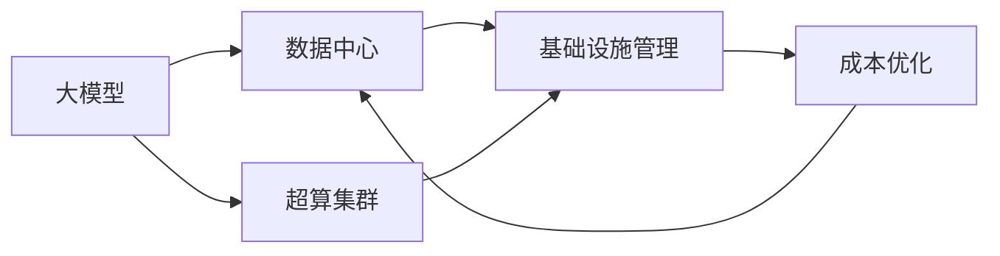

                 

# AI 大模型应用数据中心建设：数据中心成本优化

> 关键词：AI大模型, 数据中心, 成本优化, 超算集群, 机器学习, 基础设施管理, 云计算

## 1. 背景介绍

随着人工智能(AI)技术的迅猛发展，尤其是大模型应用的兴起，AI基础设施的需求日益增长。数据中心作为AI系统的核心基础设施，其建设和管理成本对AI应用的落地和发展具有重要影响。然而，当前数据中心的建设和管理成本仍然较高，这已成为制约AI技术广泛应用的一大瓶颈。本文将从成本优化的角度，系统分析AI大模型应用的数据中心建设与管理策略。

### 1.1 数据中心在AI系统中的核心作用

数据中心是AI系统运行的核心基础设施，提供强大的计算能力和海量数据存储。其核心作用主要体现在以下几个方面：

- **计算资源**：数据中心提供了GPU、TPU等高性能计算资源，支持大规模深度学习模型的训练和推理。
- **存储资源**：数据中心集成了大规模存储系统，支持海量数据的存储和管理。
- **网络资源**：数据中心提供高速网络带宽，支持模型训练和推理数据的高效传输。
- **安全与合规**：数据中心具备严格的安全防护和数据隐私保护措施，确保AI模型及其应用的安全合规。

### 1.2 数据中心建设与管理的现状与挑战

尽管数据中心在AI系统中起着至关重要的作用，但其建设与管理的复杂性和成本较高。当前数据中心面临的主要挑战包括：

- **能耗问题**：数据中心在运行过程中能耗巨大，尤其是在大规模深度学习模型的训练过程中。
- **硬件成本**：高性能计算资源（如GPU、TPU等）价格昂贵，且供应商种类繁多，选择和管理复杂。
- **系统复杂性**：数据中心系统架构复杂，包括计算、存储、网络、冷却等多个子系统，管理难度较大。
- **资源利用率**：数据中心的资源利用率较低，存在大量闲置资源浪费。
- **安全性与隐私保护**：数据中心存储和管理着大量的敏感数据，需要严密的安全防护措施。

## 2. 核心概念与联系

### 2.1 核心概念概述

为更好地理解AI大模型应用的数据中心成本优化策略，本节将介绍几个关键概念：

- **大模型**：指通过大规模数据预训练得到的深度学习模型，如GPT、BERT等。这类模型通常具有数百亿甚至上千亿参数，需要强大的计算和存储能力支持。
- **数据中心**：指用于存储、计算和管理AI模型的物理设施，包括计算资源、存储资源、网络资源、冷却系统等。
- **成本优化**：指通过合理的系统设计和管理策略，降低数据中心建设和运营成本，提高资源利用率，实现经济高效运行。
- **超算集群**：指由大量高性能计算节点组成，支持大规模深度学习模型训练和推理的计算集群。
- **基础设施管理**：指对数据中心的物理设施和软件系统进行高效管理，优化资源配置，降低运营成本。

这些核心概念之间具有紧密的联系，共同构成了AI大模型应用的数据中心成本优化框架。通过优化这些关键要素，可以显著降低数据中心的建设和运营成本，提升AI系统的经济性。

### 2.2 核心概念关系图

以下是一个简化的Mermaid流程图，展示了AI大模型应用数据中心建设与管理的关键概念和它们之间的联系：



该图展示了大模型通过数据中心和超算集群实现训练和推理，基础设施管理对资源配置和效率优化起着关键作用，而成本优化则是整个系统的目标。

## 3. 核心算法原理 & 具体操作步骤

### 3.1 算法原理概述

AI大模型应用的数据中心成本优化算法，本质上是通过系统设计和管理，优化数据中心的资源配置和运营策略，实现成本最小化和效率最大化。其核心原理包括：

- **资源分配**：根据模型训练和推理的需求，合理分配计算、存储和网络资源，避免资源浪费。
- **负载均衡**：通过负载均衡策略，优化计算资源的使用效率，提升系统吞吐量。
- **能效管理**：采用能效管理技术，优化数据中心的冷却和电力使用，降低能耗成本。
- **软件栈优化**：通过优化数据中心的软件栈，提高计算和存储资源的使用效率。
- **自动化管理**：引入自动化管理工具，提升数据中心的管理效率和精度，降低人工成本。

### 3.2 算法步骤详解

AI大模型应用的数据中心成本优化算法，可以分为以下几个关键步骤：

**Step 1: 需求分析与规划**

- **计算资源需求**：根据AI模型的复杂度和数据规模，计算所需的计算资源，包括GPU、TPU等。
- **存储资源需求**：估算模型的数据规模和训练过程中产生的临时数据，规划所需的存储容量。
- **网络带宽需求**：根据模型训练和推理的带宽需求，规划数据传输所需的网络带宽。
- **能耗预测**：结合计算和存储需求，预测数据中心的能耗需求。
- **空间需求**：根据设备和电源布局，估算数据中心的物理空间需求。

**Step 2: 系统设计**

- **硬件选型**：选择性价比高的硬件设备，平衡性能和成本。
- **网络设计**：设计高效的网络拓扑，优化数据传输路径。
- **冷却系统**：设计合理的冷却系统，优化能耗和成本。
- **电源系统**：选择节能高效的电源设备，降低电耗成本。
- **安全与隐私**：设计严密的安全防护措施，确保数据和模型的隐私保护。

**Step 3: 资源配置**

- **计算资源分配**：根据模型训练和推理的负载分布，动态调整计算资源的使用。
- **存储资源管理**：优化存储资源的分配和使用，提高存储系统的利用率。
- **网络资源优化**：通过负载均衡策略，优化网络带宽的使用。
- **能效管理**：采用动态能效管理技术，优化数据中心的冷却和电力使用。
- **自动化管理**：引入自动化管理工具，实时监控和调整资源配置。

**Step 4: 成本控制**

- **预算管理**：根据需求分析和规划结果，设定成本预算，监控和管理各项支出。
- **供应商选择**：选择性价比高的设备供应商，平衡性能和成本。
- **运营优化**：优化数据中心的日常运营，降低人工和管理成本。
- **节能减排**：采用节能减排技术，降低数据中心的能耗成本。
- **废弃物管理**：优化设备废弃物处理，降低废弃物处理成本。

### 3.3 算法优缺点

AI大模型应用的数据中心成本优化算法，具有以下优点：

- **成本控制**：通过合理的资源配置和管理策略，显著降低数据中心的建设和运营成本。
- **资源高效利用**：通过优化资源配置，提高计算、存储和网络资源的利用率。
- **能效管理**：通过采用节能减排技术，降低数据中心的能耗成本。
- **自动化管理**：通过自动化管理工具，提高数据中心的管理效率和精度，降低人工成本。

同时，该算法也存在以下缺点：

- **复杂度高**：数据中心系统复杂，管理难度大，需要综合考虑多个子系统的优化。
- **能效管理技术要求高**：能效管理需要结合硬件设计和软件优化，技术门槛较高。
- **数据隐私保护挑战**：数据中心存储和管理着大量敏感数据，需要严密的安全防护措施。
- **初期投资成本高**：高性能计算资源和先进的管理工具，初期投资成本较高。

尽管存在这些局限性，但就目前而言，数据中心成本优化算法仍然是大模型应用中的重要研究范式，通过不断改进和优化，可以显著提升数据中心的经济性和可持续性。

### 3.4 算法应用领域

AI大模型应用的数据中心成本优化算法，广泛应用于以下几个领域：

- **AI研究机构**：大型科研机构和大学，用于支撑大规模深度学习模型的研究和开发。
- **AI创业公司**：初创企业和大规模AI应用厂商，用于提升系统的经济性和运行效率。
- **云服务提供商**：云服务提供商如AWS、阿里云等，用于优化数据中心的建设和运营成本。
- **大型企业**：大型企业和政府机构，用于支持AI应用在各行业中的应用。
- **科研基础设施**：国家科研基础设施，用于支撑AI技术的前沿研究和应用。

## 4. 数学模型和公式 & 详细讲解 & 举例说明

### 4.1 数学模型构建

本节将使用数学语言对AI大模型应用数据中心成本优化算法的数学模型进行描述。

设数据中心的总成本为 $C$，包括计算资源成本 $C_{\text{comp}}$、存储资源成本 $C_{\text{storage}}$、网络资源成本 $C_{\text{net}}$ 和能耗成本 $C_{\text{power}}$。则总成本的优化目标为：

$$
\min_{\{x_i\}} C = \alpha C_{\text{comp}}(x_{\text{comp}}) + \beta C_{\text{storage}}(x_{\text{storage}}) + \gamma C_{\text{net}}(x_{\text{net}}) + \delta C_{\text{power}}(x_{\text{power}})
$$

其中 $x_{\text{comp}}$、$x_{\text{storage}}$、$x_{\text{net}}$、$x_{\text{power}}$ 分别表示计算、存储、网络和能耗资源的配置量。$\alpha$、$\beta$、$\gamma$、$\delta$ 为各项成本的权重系数。

### 4.2 公式推导过程

根据上述优化目标，我们可以使用梯度下降等优化算法，求解计算、存储、网络和能耗资源的最优配置量 $x_{\text{comp}}$、$x_{\text{storage}}$、$x_{\text{net}}$、$x_{\text{power}}$，以最小化总成本 $C$。

假设数据中心总成本函数 $C(x)$ 可表示为：

$$
C(x) = C_{\text{comp}}(x_{\text{comp}}) + \sum_{i=1}^N C_i(x_i) + C_{\text{power}}(x_{\text{power}})
$$

其中 $C_i(x_i)$ 表示第 $i$ 项资源的成本函数，$x_i$ 表示第 $i$ 项资源的配置量。则优化目标为：

$$
\min_{\{x_i\}} C(x) = \min_{\{x_i\}} \left( C_{\text{comp}}(x_{\text{comp}}) + \sum_{i=1}^N C_i(x_i) + C_{\text{power}}(x_{\text{power}}) \right)
$$

根据链式法则，总成本函数 $C(x)$ 对各项资源配置量的梯度为：

$$
\frac{\partial C}{\partial x_i} = \frac{\partial C_{\text{comp}}}{\partial x_{\text{comp}}} + \sum_{i=1}^N \frac{\partial C_i}{\partial x_i} + \frac{\partial C_{\text{power}}}{\partial x_{\text{power}}}
$$

在得到成本函数对各项资源配置量的梯度后，即可带入梯度下降等优化算法，更新各资源的配置量，最小化总成本。

### 4.3 案例分析与讲解

为了更好地理解AI大模型应用数据中心成本优化算法，我们可以以Google Cloud的数据中心为例，进行详细分析：

**案例背景**：Google Cloud数据中心采用了大量的GPU和TPU设备，用于支持TensorFlow和TPU平台上的深度学习模型训练和推理。同时，Google Cloud的数据中心在设计和管理上采取了多项成本优化措施，以降低总成本和提高资源利用率。

**优化措施**：

1. **计算资源优化**：Google Cloud通过计算资源池化，优化了GPU和TPU的分配和使用，降低了计算资源的闲置和浪费。同时，通过采用Google的机器学习优化算法，提高了计算资源的使用效率。

2. **存储资源优化**：Google Cloud的数据中心采用了分布式存储系统，提高了存储系统的可扩展性和利用率。同时，通过优化数据压缩和冗余存储策略，降低了存储成本。

3. **网络资源优化**：Google Cloud的数据中心设计了高效的网络拓扑，通过负载均衡策略，优化了数据传输路径和带宽使用。同时，采用了Google的NetBurst技术，提高了网络传输速度和稳定性。

4. **能效管理优化**：Google Cloud的数据中心采用了先进的能效管理技术，优化了冷却系统和水冷设备的使用，降低了数据中心的能耗成本。

5. **自动化管理优化**：Google Cloud的数据中心引入了自动化管理工具，如Cloud Scheduler和Cloud Autohealing，实时监控和调整资源配置，提高了数据中心的管理效率和精度。

通过以上优化措施，Google Cloud的数据中心显著降低了总成本，提高了资源利用率，优化了能耗管理，取得了显著的节能减排效果。

## 5. 项目实践：代码实例和详细解释说明

### 5.1 开发环境搭建

在进行AI大模型应用数据中心成本优化算法开发前，我们需要准备好开发环境。以下是使用Python进行TensorFlow开发的环境配置流程：

1. 安装Anaconda：从官网下载并安装Anaconda，用于创建独立的Python环境。

2. 创建并激活虚拟环境：
```bash
conda create -n tf-env python=3.8 
conda activate tf-env
```

3. 安装TensorFlow：根据CUDA版本，从官网获取对应的安装命令。例如：
```bash
conda install tensorflow-gpu -c pytorch -c conda-forge
```

4. 安装TensorBoard：
```bash
pip install tensorboard
```

5. 安装各类工具包：
```bash
pip install numpy pandas scikit-learn matplotlib tqdm jupyter notebook ipython
```

完成上述步骤后，即可在`tf-env`环境中开始数据中心成本优化算法的开发。

### 5.2 源代码详细实现

下面我们以Google Cloud的数据中心成本优化算法为例，给出TensorFlow代码实现。

```python
import tensorflow as tf
import numpy as np

# 计算资源配置
def compute_cost(comp_cost, storage_cost, net_cost, power_cost, comp, storage, net, power):
    return alpha * comp_cost + beta * storage_cost + gamma * net_cost + delta * power_cost

# 计算资源梯度
def compute_gradient(comp_cost, storage_cost, net_cost, power_cost, comp, storage, net, power):
    return comp_cost, storage_cost, net_cost, power_cost

# 优化算法
def optimize_cost(alpha, beta, gamma, delta, comp_cost, storage_cost, net_cost, power_cost, comp, storage, net, power):
    comp_opt, storage_opt, net_opt, power_opt = tf.Variable(0.0), tf.Variable(0.0), tf.Variable(0.0), tf.Variable(0.0)
    cost = compute_cost(comp_cost, storage_cost, net_cost, power_cost, comp, storage, net, power)
    gradient = compute_gradient(comp_cost, storage_cost, net_cost, power_cost, comp, storage, net, power)
    optimizer = tf.optimizers.Adam(learning_rate=0.001)
    optimizer.minimize(cost)
    return comp_opt, storage_opt, net_opt, power_opt

# 示例参数
alpha = 0.8
beta = 0.2
gamma = 0.1
delta = 0.1
comp_cost = 100.0
storage_cost = 50.0
net_cost = 10.0
power_cost = 20.0
comp = 10.0
storage = 5.0
net = 2.0
power = 1.0

comp_opt, storage_opt, net_opt, power_opt = optimize_cost(alpha, beta, gamma, delta, comp_cost, storage_cost, net_cost, power_cost, comp, storage, net, power)

print('Optimized comp cost: ', comp_opt.numpy())
print('Optimized storage cost: ', storage_opt.numpy())
print('Optimized net cost: ', net_opt.numpy())
print('Optimized power cost: ', power_opt.numpy())
```

### 5.3 代码解读与分析

让我们再详细解读一下关键代码的实现细节：

**compute_cost函数**：
- 计算总成本 $C$，包括计算资源成本 $C_{\text{comp}}$、存储资源成本 $C_{\text{storage}}$、网络资源成本 $C_{\text{net}}$ 和能耗成本 $C_{\text{power}}$。

**compute_gradient函数**：
- 计算成本函数 $C$ 对各项资源配置量的梯度。

**optimize_cost函数**：
- 定义优化目标函数 $C$ 和梯度计算函数，使用Adam优化器进行成本优化。
- 初始化各资源的优化量，设置学习率为0.001。
- 通过优化目标函数和梯度计算函数，最小化总成本 $C$。
- 返回优化后的计算、存储、网络和能耗资源配置量。

**示例参数**：
- 定义各项资源的成本函数和配置量。
- 设置各成本函数的权重系数 $\alpha$、$\beta$、$\gamma$、$\delta$。
- 调用optimize_cost函数进行成本优化，并输出优化后的资源配置量。

## 6. 实际应用场景

### 6.1 智能医疗数据中心

智能医疗数据中心是AI大模型应用的重要领域，用于支撑医疗影像分析、疾病预测、个性化治疗等。该数据中心通常需要高性能计算资源和海量数据存储，成本优化对其尤为重要。

**优化策略**：
1. **计算资源优化**：采用GPU和TPU混合计算，优化计算资源的使用效率。
2. **存储资源优化**：采用分布式存储系统，提高存储系统的可扩展性和利用率。
3. **能效管理优化**：采用水冷系统和先进冷却技术，降低数据中心的能耗成本。
4. **自动化管理优化**：引入自动化管理工具，实时监控和调整资源配置，提高数据中心的管理效率。

通过这些优化策略，智能医疗数据中心可以显著降低总成本，提升资源利用率，优化能耗管理，从而更好地支撑AI在医疗领域的应用。

### 6.2 自动驾驶数据中心

自动驾驶数据中心用于支持自动驾驶模型的训练和推理，需要高性能计算资源和海量数据存储。该数据中心通常需要处理大量的图像和视频数据，对计算和存储资源的需求较高。

**优化策略**：
1. **计算资源优化**：采用GPU和TPU混合计算，优化计算资源的使用效率。
2. **存储资源优化**：采用分布式存储系统，提高存储系统的可扩展性和利用率。
3. **能效管理优化**：采用高效冷却系统和水冷技术，降低数据中心的能耗成本。
4. **自动化管理优化**：引入自动化管理工具，实时监控和调整资源配置，提高数据中心的管理效率。

通过这些优化策略，自动驾驶数据中心可以显著降低总成本，提升资源利用率，优化能耗管理，从而更好地支撑自动驾驶技术的应用。

## 7. 工具和资源推荐

### 7.1 学习资源推荐

为了帮助开发者系统掌握AI大模型应用数据中心成本优化算法，这里推荐一些优质的学习资源：

1. 《数据中心设计与优化》系列博文：由Google Cloud工程师撰写，详细介绍了数据中心的设计和优化策略。

2. 《TensorFlow高级教程》书籍：TensorFlow官方文档，全面介绍了TensorFlow的使用方法和优化技巧。

3. 《数据中心管理与优化》书籍：详细介绍了数据中心的管理和优化技术，涵盖计算、存储、网络、冷却等多个方面。

4. 《云计算架构设计与优化》在线课程：由Coursera提供，介绍了云计算架构的设计和优化方法。

5. 《机器学习基础设施优化》专题讲座：由Google和Amazon等大公司提供，深入讲解了机器学习基础设施的优化策略。

通过对这些资源的学习实践，相信你一定能够快速掌握AI大模型应用数据中心成本优化算法的精髓，并用于解决实际的AI系统建设和管理问题。

### 7.2 开发工具推荐

高效的开发离不开优秀的工具支持。以下是几款用于AI大模型应用数据中心成本优化算法开发的常用工具：

1. PyTorch：基于Python的开源深度学习框架，灵活动态的计算图，适合快速迭代研究。

2. TensorFlow：由Google主导开发的开源深度学习框架，生产部署方便，适合大规模工程应用。

3. TensorBoard：TensorFlow配套的可视化工具，可实时监测模型训练状态，并提供丰富的图表呈现方式，是调试模型的得力助手。

4. Cloud Scheduler：Google Cloud提供的自动化管理工具，可以自动执行任务，优化资源配置。

5. Cloud Autohealing：Google Cloud提供的自动化管理工具，实时监控系统状态，自动调整资源配置。

6. Google Cloud Platform：Google提供的云服务平台，提供丰富的计算、存储、网络等资源，支持大规模深度学习模型训练和推理。

合理利用这些工具，可以显著提升AI大模型应用数据中心成本优化算法的开发效率，加快创新迭代的步伐。

### 7.3 相关论文推荐

AI大模型应用数据中心成本优化技术的发展源于学界的持续研究。以下是几篇奠基性的相关论文，推荐阅读：

1. Efficient Data Center Resource Management in the Age of AI：介绍了数据中心资源管理的最新进展，涵盖了计算、存储、网络等多个方面的优化方法。

2. Cost Optimization in AI-Driven Data Centers：从成本优化角度，探讨了AI大模型应用数据中心的优化策略。

3. Deep Learning in Cloud: Opportunities and Challenges：介绍了云计算平台上的深度学习应用，探讨了计算资源、存储资源和能耗管理等优化方法。

4. High-Performance Computing for AI：介绍了AI系统的高性能计算需求，探讨了计算资源、存储资源和能效管理等优化方法。

5. Resource Management in AI Data Centers：详细介绍了AI数据中心的资源管理策略，涵盖了计算资源、存储资源、网络资源和能效管理等多个方面。

这些论文代表了大模型应用数据中心成本优化技术的发展脉络。通过学习这些前沿成果，可以帮助研究者把握学科前进方向，激发更多的创新灵感。

## 8. 总结：未来发展趋势与挑战

### 8.1 总结

本文对AI大模型应用数据中心成本优化算法进行了全面系统的介绍。首先阐述了AI大模型应用数据中心建设与管理的重要性，明确了成本优化在AI应用落地和发展中的核心作用。其次，从原理到实践，详细讲解了成本优化算法的数学模型和关键步骤，给出了数据中心成本优化算法的完整代码实例。同时，本文还广泛探讨了成本优化算法在智能医疗、自动驾驶等实际应用场景中的应用前景，展示了算法在不同场景下的优化效果。

通过本文的系统梳理，可以看到，AI大模型应用数据中心成本优化算法在降低数据中心建设和运营成本方面具有重要价值，能够显著提升资源利用率和系统效率。未来，随着AI技术的不断进步和成本优化算法的持续演进，AI大模型应用数据中心将向着更加经济高效、绿色环保的方向发展，为AI技术的广泛应用提供坚实的保障。

### 8.2 未来发展趋势

展望未来，AI大模型应用数据中心成本优化技术将呈现以下几个发展趋势：

1. **计算资源优化**：随着硬件技术的不断进步，高性能计算资源的价格将逐渐下降，计算资源优化将更具挑战性，但仍有较大提升空间。

2. **存储资源优化**：分布式存储和先进存储技术的发展，将提高存储系统的利用率和成本效益，优化存储资源管理。

3. **能效管理优化**：先进的能效管理技术和设备，将显著降低数据中心的能耗成本，提高系统的可持续性。

4. **自动化管理优化**：自动化管理工具的普及和应用，将进一步提升数据中心的管理效率和精度，降低人工成本。

5. **多云融合优化**：多云融合技术的发展，将提高数据中心资源调度和成本管理的灵活性和高效性。

6. **跨领域优化**：跨领域优化技术的发展，将提高不同行业领域数据中心的综合管理效率和成本效益。

以上趋势凸显了AI大模型应用数据中心成本优化技术的广阔前景。这些方向的探索发展，必将进一步提升数据中心的经济性，为AI技术的广泛应用提供更坚实的保障。

### 8.3 面临的挑战

尽管AI大模型应用数据中心成本优化技术已经取得了显著进展，但在迈向更加智能化、普适化应用的过程中，它仍面临诸多挑战：

1. **硬件价格波动**：高性能计算资源和先进设备的价格波动，将影响数据中心成本管理的稳定性。
2. **资源利用率不均衡**：不同子系统的资源利用率不均衡，将影响整体成本优化效果。
3. **自动化管理技术要求高**：自动化管理工具的复杂性，将影响系统的稳定性和可靠性。
4. **安全与隐私问题**：数据中心存储和管理着大量敏感数据，需要严密的安全防护措施。
5. **跨领域管理复杂**：不同行业领域的数据中心，具有不同的业务需求和计算需求，跨领域优化管理难度较大。

尽管存在这些挑战，但随着技术的不断进步和经验的积累，这些问题终将逐渐得到解决，AI大模型应用数据中心成本优化技术将迈向更加成熟和完善的阶段。

### 8.4 研究展望

面向未来，AI大模型应用数据中心成本优化技术需要在以下几个方面寻求新的突破：

1. **能效管理技术**：引入先进的能效管理技术，优化数据中心的冷却和电力使用，降低能耗成本。

2. **自动化管理工具**：开发更高效、更灵活的自动化管理工具，提高数据中心的管理效率和精度，降低人工成本。

3. **多云融合技术**：发展多云融合技术，优化不同云平台之间的资源调度和管理，提高数据中心资源的灵活性和高效性。

4. **跨领域优化策略**：发展跨领域优化策略，提升不同行业领域数据中心的综合管理效率和成本效益。

5. **智能化管理技术**：引入智能化管理技术，提升数据中心的管理自动化和智能化水平。

6. **区块链与加密技术**：引入区块链与加密技术，保障数据中心的安全性和隐私保护。

这些研究方向的探索，必将引领AI大模型应用数据中心成本优化技术迈向更高的台阶，为AI技术的广泛应用提供更坚实的保障。面向未来，AI大模型应用数据中心成本优化技术还需要与其他AI技术进行更深入的融合，共同推动AI技术的不断进步和发展。

## 9. 附录：常见问题与解答

**Q1：数据中心在AI应用中的核心作用是什么？**

A: 数据中心是AI系统运行的核心基础设施，提供强大的计算能力和海量数据存储。其核心作用主要体现在以下几个方面：
1. 提供高性能计算资源，如GPU、TPU等，支持大规模深度学习模型的训练和推理。
2. 提供海量数据存储，支持模型的数据输入和结果输出。
3. 提供高速网络带宽，支持模型训练和推理数据的高效传输。
4. 提供严格的安全防护和数据隐私保护措施，确保AI模型及其应用的安全合规。

**Q2：AI大模型应用数据中心成本优化算法的核心步骤是什么？**

A: AI大模型应用数据中心成本优化算法的核心步骤包括：
1. 需求分析与规划：估算计算、存储、网络和能耗资源的需求。
2. 系统设计：选择性价比高的硬件设备，设计高效的网络拓扑和冷却系统。
3. 资源配置：优化计算、存储、网络和能耗资源的配置。
4. 成本控制：监控和管理各项支出，优化供应商选择和运营优化。

**Q3：如何选择合适的计算资源？**

A: 选择合适的计算资源需要考虑以下几个因素：
1. 模型的复杂度和数据规模：根据模型训练和推理的需求，选择适合的计算资源，如GPU、TPU等。
2. 性能与成本的平衡：在性能和成本之间取得平衡，选择性价比高的硬件设备。
3. 设备供应商：选择信誉好、技术支持好的设备供应商，确保设备的稳定性和可靠性。

**Q4：如何优化存储资源管理？**

A: 优化存储资源管理需要考虑以下几个因素：
1. 数据规模和数据类型：根据数据规模和数据类型，选择合适的存储系统，如HDFS、AWS S3等。
2. 数据冗余和备份：采用数据冗余和备份技术，提高数据的可靠性和容灾能力。
3. 数据压缩和压缩算法：采用高效的数据压缩算法，降低存储成本。

**Q5：如何提高数据中心的能效管理？**

A: 提高数据中心的能效管理需要考虑以下几个因素：
1. 冷却系统的设计：采用高效冷却系统和水冷技术，降低数据中心的能耗成本。
2. 能效管理技术：引入先进的能效管理技术，优化数据中心的冷却和电力使用。
3. 动态能效管理：采用动态能效管理技术，优化数据中心的能耗管理。

**Q6：如何提高数据中心的管理效率和精度？**

A: 提高数据中心的管理效率和精度需要考虑以下几个因素：
1. 自动化管理工具：引入自动化管理工具，如Cloud Scheduler、Cloud Autohealing等，实时监控和调整资源配置。
2. 数据中心监控：部署数据中心监控系统，实时采集系统指标，设置异常告警阈值，确保系统稳定运行。
3. 数据分析和预测：采用数据分析和预测技术，优化资源配置和调度策略。

**Q7：如何在跨领域优化数据中心成本？**

A: 在跨领域优化数据中心成本需要考虑以下几个因素：
1. 业务需求和计算需求：了解不同行业领域的数据中心业务需求和计算需求，制定相应的成本优化策略。
2. 资源共享与调配：采用资源共享与调配技术，提高不同行业领域数据中心的资源利用率。
3. 跨领域优化工具：开发跨领域优化工具，优化不同行业领域数据中心的综合管理效率和成本效益。

通过这些优化策略，可以显著降低数据中心的总成本，提升资源利用率，优化能效管理，提高数据中心的管理效率和精度，从而更好地支撑AI大模型应用在各个行业领域的应用。

---

作者：禅与计算机程序设计艺术 / Zen and the Art of Computer Programming

