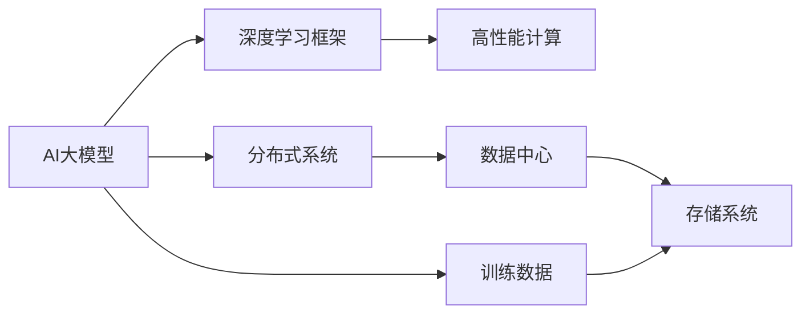

                 

# AI 大模型应用数据中心建设：数据中心技术与应用

## 1. 背景介绍

### 1.1 问题由来
在当今信息爆炸的时代，人工智能（AI）和大模型技术日益成为驱动行业创新的核心动力。从深度学习的兴起，到GPT、BERT等大模型的横空出世，AI技术正逐步渗透到金融、医疗、教育、娱乐等各个领域，大幅提升了信息处理效率和决策智能。然而，这些大模型依赖庞大的计算资源和数据集进行训练和推理，对数据中心的硬件设施提出了前所未有的高要求。如何高效、经济地构建和运营数据中心，支持大模型的快速迭代和应用落地，成为当下AI开发者和数据中心运维人员的重要课题。

### 1.2 问题核心关键点
AI大模型应用的核心挑战在于数据中心的技术架构与支持能力。为更好地解决这一问题，本文将从数据中心硬件、网络、存储、运维等多个方面展开详细探讨。具体来说，本文将深入分析：

- 数据中心如何承载AI大模型的计算和存储需求，包括计算资源优化、内存管理和扩展性设计。
- 如何构建高性能网络架构，支持大模型的分布式训练和推理。
- 数据中心的存储系统如何高效存储和管理大模型及其训练数据，保障数据安全和隐私。
- 数据中心的运维自动化和管理系统如何保证大模型应用的高可用性和稳定性。

本文将结合理论分析和实际案例，系统阐述数据中心技术在AI大模型应用中的关键作用，为AI开发者和运维人员提供全面、深入的参考和指导。

## 2. 核心概念与联系

### 2.1 核心概念概述

为理解数据中心如何支持AI大模型应用，我们先介绍几个关键概念：

- **AI大模型**：指基于大规模深度神经网络（如Transformer），在大型数据集上预训练和微调，具有强大语言理解、生成等能力的模型。典型的AI大模型包括GPT、BERT、T5等。
- **数据中心（DC）**：由服务器、存储、网络、冷却设施等组成的大型设施，专门用于数据处理、存储和计算。数据中心是支持大模型应用的基础设施。
- **高性能计算（HPC）**：用于处理复杂计算任务的专门硬件架构，通过优化硬件和软件，提高数据中心的计算能力。
- **分布式系统**：通过网络连接多台计算机，实现任务并行处理，提升系统处理能力和扩展性。
- **深度学习框架**：如TensorFlow、PyTorch等，提供高效的数据加载、模型定义和训练工具，支持AI大模型的构建和应用。

这些概念之间的联系可以概括为：AI大模型依赖数据中心的高性能计算和分布式系统进行训练和推理，数据中心的存储系统则支持模型及其数据的存储和管理。而深度学习框架则为开发者提供高效工具，支持模型的构建和应用。

### 2.2 核心概念原理和架构的 Mermaid 流程图



这个流程图展示了AI大模型、深度学习框架、高性能计算、分布式系统和数据中心之间的联系。

## 3. 核心算法原理 & 具体操作步骤

### 3.1 算法原理概述

AI大模型的训练和推理过程中，需要大量的计算资源和存储资源。数据中心通过高性能计算和分布式系统，提供强大的计算能力，支持模型的训练和推理。同时，数据中心的存储系统支持模型及其训练数据的存储和管理，保障数据的可访问性和安全性。

数据中心的硬件资源主要包括以下几个部分：

- **CPU和GPU**：数据中心的核心计算单元，通过分布式并行计算，提高计算效率。
- **内存**：用于存储模型参数和计算过程中的中间结果，保证模型训练和推理的流畅性。
- **网络**：连接分布式计算节点，实现数据和计算任务的同步和通信。
- **存储**：用于存储模型及其训练数据，支持模型的高效加载和持久化。

### 3.2 算法步骤详解

构建高效的数据中心，支持AI大模型的应用，主要包括以下几个步骤：

**Step 1: 设计计算资源配置**
- 根据AI大模型的需求，选择合适的CPU和GPU配置，如多个CPU核心或GPU卡。
- 优化内存大小和类型，支持大模型的参数加载和计算。
- 设计网络拓扑结构，支持分布式计算和数据传输。

**Step 2: 配置存储系统**
- 选择合适的存储硬件和协议，如SSD、NAS、SAN等，支持大模型的数据存储和访问。
- 设计存储层次结构，如SSD为主存储，HDD为辅存储，支持高效的数据读写和存储。
- 实施数据加密和备份策略，保障数据安全和冗余。

**Step 3: 优化网络架构**
- 使用高速网络协议，如InfiniBand、RoCE等，提高数据传输速度。
- 设计负载均衡算法，合理分配计算任务，减少网络拥堵。
- 实施网络隔离和安全防护，防止数据泄露和攻击。

**Step 4: 实现运维自动化**
- 使用监控系统，实时监测硬件资源使用情况和网络状态。
- 设计自动化运维工具，自动重启、扩容和备份。
- 实施灾难恢复策略，保障系统高可用性。

**Step 5: 集成AI框架和工具**
- 选择合适的深度学习框架，如TensorFlow、PyTorch等，支持模型的构建和训练。
- 使用分布式训练工具，如Horovod、DistributedTensorFlow等，支持模型的并行训练。
- 集成数据预处理工具，如KAFKA、Spark等，支持大规模数据处理。

### 3.3 算法优缺点

数据中心支持AI大模型的应用，具有以下优点：

- 强大的计算能力和存储能力，支持大规模模型的训练和推理。
- 高效的分布式系统，提升系统处理能力和扩展性。
- 完善的网络架构，保障数据传输的高效和安全性。
- 自动化的运维系统，提高系统稳定性和可用性。

同时，数据中心也存在以下缺点：

- 高昂的硬件和能源成本，建设与维护成本较高。
- 复杂的网络和存储系统，需要专业的运维和监控。
- 较高的能耗和碳排放，对环境影响较大。
- 对硬件和软件的要求较高，需要持续的技术更新和升级。

### 3.4 算法应用领域

AI大模型应用广泛，涉及金融、医疗、教育、娱乐等多个领域。数据中心在支持这些应用中发挥了重要作用：

- **金融风控**：使用大模型进行风险评估和信用评分，通过高性能计算和分布式系统，支持大规模数据处理和模型训练。
- **医疗影像**：使用大模型进行疾病诊断和影像分析，通过高可靠性和低延迟的网络和存储系统，支持高质量数据的存储和访问。
- **教育个性化**：使用大模型进行学生学习路径推荐和个性化教学，通过分布式系统和自动化运维，支持大规模用户的互动和数据处理。
- **娱乐推荐**：使用大模型进行内容推荐和智能互动，通过高性能计算和大数据存储，支持实时分析和个性化推荐。

## 4. 数学模型和公式 & 详细讲解 & 举例说明

### 4.1 数学模型构建

为了更好地理解数据中心如何支持AI大模型的应用，我们从数学模型构建的角度，阐述模型训练和推理的基本流程。

假设AI大模型为$f(x;\theta)$，其中$x$为输入数据，$\theta$为模型参数。训练模型的目标是最小化损失函数$L$：

$$
L(f(x;\theta),y) = \frac{1}{N} \sum_{i=1}^N \|f(x_i;\theta) - y_i\|^2
$$

其中$y$为标签，$N$为样本数。

### 4.2 公式推导过程

在分布式系统中，模型$f(x;\theta)$的训练过程可以表示为：

$$
\min_{\theta} \sum_{i=1}^N L(f(x_i;\theta_i),y_i)
$$

其中$\theta_i$表示第$i$个计算节点的模型参数。

使用随机梯度下降算法，每次从$N$个样本中随机抽取$M$个样本，计算损失函数$L$的梯度：

$$
\nabla_{\theta}L = \frac{1}{M} \sum_{i=1}^M \nabla_{\theta}L_i
$$

其中$L_i$为样本$x_i$的损失函数。

梯度下降过程可以表示为：

$$
\theta \leftarrow \theta - \eta \nabla_{\theta}L
$$

其中$\eta$为学习率，控制每次迭代的步长。

### 4.3 案例分析与讲解

以大规模金融风控模型为例，模型的训练数据包含数十万条交易记录，每条记录包含上百个特征。模型的输入为交易数据，输出为风险评分。训练过程可以分解为多个并行任务，每个任务处理一部分数据，最终将结果合并。

假设共有100个计算节点，每个节点处理10万条数据，则总训练过程可以表示为：

$$
\min_{\theta} \sum_{i=1}^{100} \sum_{j=1}^{10} L(f(x_{ij};\theta_i),y_{ij})
$$

其中$x_{ij}$为第$i$个节点处理的第$j$条数据，$y_{ij}$为标签。

使用随机梯度下降算法，每次从100个节点中随机抽取20个节点，每个节点随机抽取1万条数据，计算损失函数的梯度：

$$
\nabla_{\theta}L = \frac{1}{20} \sum_{i=1}^{20} \nabla_{\theta}L_i
$$

其中$L_i$为第$i$个节点的损失函数。

## 5. 项目实践：代码实例和详细解释说明

### 5.1 开发环境搭建

为了实现AI大模型在数据中心的应用，我们需要构建一个高效的开发环境。以下是基于Linux操作系统的环境搭建流程：

1. 安装必要的系统软件，如Linux Kernel、NVIDIA GPU驱动程序、GPU加速工具如NVIDIA CUDA等。
2. 安装深度学习框架，如TensorFlow、PyTorch等，并确保其与GPU兼容。
3. 配置网络环境，确保所有计算节点可以相互通信。
4. 配置存储环境，确保数据中心支持大模型及其训练数据的存储和访问。

### 5.2 源代码详细实现

以下是一个简单的Python脚本，用于在大规模金融风控模型上进行分布式训练：

```python
import tensorflow as tf
import numpy as np
from tensorflow.keras import layers
from tensorflow.keras.distribute import MirroredStrategy

# 定义模型
def build_model():
    inputs = layers.Input(shape=(10,))
    x = layers.Dense(32, activation='relu')(inputs)
    x = layers.Dense(1, activation='sigmoid')(x)
    model = tf.keras.Model(inputs=inputs, outputs=x)
    return model

# 准备数据
def load_data():
    # 加载金融交易数据
    data = np.load('financial_data.npy')
    labels = np.load('financial_labels.npy')
    return data, labels

# 训练模型
def train_model(model, data, labels, epochs=10):
    # 使用MirroredStrategy进行分布式训练
    with MirroredStrategy().scope():
        model.compile(optimizer=tf.keras.optimizers.Adam(), loss='binary_crossentropy', metrics=['accuracy'])
        model.fit(data, labels, epochs=epochs)

# 主函数
if __name__ == '__main__':
    # 构建模型
    model = build_model()
    
    # 加载数据
    data, labels = load_data()
    
    # 训练模型
    train_model(model, data, labels)
```

### 5.3 代码解读与分析

这个脚本使用了TensorFlow框架，通过MirroredStrategy进行分布式训练。MirroredStrategy允许在多个GPU节点上并行训练，优化内存使用和计算效率。

在实际应用中，开发者需要根据具体需求调整模型架构、数据处理方式和训练策略，如使用多个GPU节点、调整网络拓扑结构、优化内存管理等，以实现更高效、更稳定的模型训练。

### 5.4 运行结果展示

在实际运行中，可以使用TensorBoard工具，实时监控模型的训练过程和性能指标。TensorBoard提供了丰富的可视化工具，如模型结构图、损失曲线、参数更新等，方便开发者进行调优和优化。

## 6. 实际应用场景

### 6.1 智能客服系统

智能客服系统是AI大模型在实际应用中的一个典型案例。数据中心通过高性能计算和分布式系统，支持大模型的训练和推理，实现智能客服的实时问答和自然语言理解。

在智能客服系统中，数据中心支持实时数据采集、存储和处理，支持大规模用户的互动和数据收集。同时，数据中心的高可靠性和低延迟网络，保障了智能客服系统的稳定性和响应速度。

### 6.2 医疗影像分析

医疗影像分析是大模型在医疗领域的重要应用之一。数据中心通过高可靠性和低延迟的网络，支持大规模影像数据的存储和处理。通过分布式计算系统，数据中心可以高效训练和推理大规模医疗影像模型，实现疾病的早期诊断和影像分析。

在医疗影像分析中，数据中心的高效存储和处理能力，保障了模型的高性能和低延迟，支持了医生对大量影像数据的快速分析和诊断。

### 6.3 教育个性化推荐

教育个性化推荐是大模型在教育领域的重要应用之一。数据中心通过高性能计算和大规模数据存储，支持教育推荐系统的构建和优化。

在教育个性化推荐中，数据中心支持大规模用户数据的存储和处理，支持学生学习路径的动态调整和个性化推荐。同时，数据中心的高可靠性和低延迟网络，保障了推荐系统的实时性和稳定性。

## 7. 工具和资源推荐

### 7.1 学习资源推荐

为了帮助开发者系统掌握数据中心在AI大模型应用中的技术原理和实践技巧，这里推荐一些优质的学习资源：

1. NVIDIA官方文档：提供最新的GPU加速工具和深度学习框架的安装、配置和使用指南。
2. TensorFlow官方文档：详细介绍了TensorFlow框架的使用方法和最佳实践，支持大规模深度学习模型的构建和训练。
3. PyTorch官方文档：提供了PyTorch框架的使用方法和最佳实践，支持深度学习模型的构建和训练。
4. Cloudflare Linux Academy：提供系统管理员的高级培训课程，涵盖Linux操作系统的高级配置和管理。
5. Coursera深度学习课程：由斯坦福大学和MIT等名校开设，涵盖深度学习的理论基础和实际应用。

通过对这些资源的学习实践，相信你一定能够快速掌握数据中心在AI大模型应用中的技术原理和实践技巧，并用于解决实际的AI问题。

### 7.2 开发工具推荐

高效的开发离不开优秀的工具支持。以下是几款用于数据中心支持AI大模型应用开发的常用工具：

1. Jupyter Notebook：开源的交互式编程环境，支持Python、R等语言，方便开发者进行模型训练和调试。
2. PyCharm：专业的Python IDE，提供代码自动补全、调试和版本控制等强大功能。
3. GitHub：全球最大的开源社区，提供代码托管和版本控制，方便开发者协作和共享代码。
4. Docker：容器化技术，支持应用程序的打包和部署，方便开发者在不同环境中进行测试和部署。
5. Ansys Fluent：高性能计算软件，支持大规模复杂模型的计算和仿真，支持分布式计算和并行计算。

合理利用这些工具，可以显著提升AI大模型在数据中心中的开发效率，加快创新迭代的步伐。

### 7.3 相关论文推荐

数据中心支持AI大模型的应用，得益于众多学者的持续研究。以下是几篇奠基性的相关论文，推荐阅读：

1. "Understanding the Difficulty of Training Deep Neural Networks"：NVIDIA的研究论文，介绍了深度学习模型的训练难度和优化策略。
2. "TensorFlow: A System for Large-Scale Machine Learning"：TensorFlow的创始人团队撰写的论文，详细介绍了TensorFlow框架的设计和实现。
3. "Deep Learning Architectures for Scalable Image Processing"：Stanford大学的研究论文，介绍了深度学习在图像处理中的应用和架构设计。
4. "Optimizing Distributed Training"：Google的研究论文，介绍了分布式深度学习训练的优化策略和算法。
5. "An Overview of Distributed Deep Learning Systems"：Microsoft的研究论文，介绍了大规模分布式深度学习系统的架构和实现。

这些论文代表了大模型在数据中心应用的发展脉络。通过学习这些前沿成果，可以帮助研究者把握学科前进方向，激发更多的创新灵感。

## 8. 总结：未来发展趋势与挑战

### 8.1 研究成果总结

本文系统阐述了数据中心在支持AI大模型应用中的关键技术和应用场景。主要内容包括：

- 数据中心如何通过高性能计算和分布式系统，支持大模型的训练和推理。
- 如何构建高效的网络和存储系统，保障数据中心的高可靠性和低延迟。
- 数据中心的运维自动化和管理系统，如何保证系统的高可用性和稳定性。
- AI大模型在智能客服、医疗影像、教育推荐等领域的应用实践。

### 8.2 未来发展趋势

展望未来，数据中心在支持AI大模型应用中，将呈现以下几个发展趋势：

1. 云计算和边缘计算：云计算和大数据中心将继续发展和普及，边缘计算将成为重要的补充，支持实时数据处理和本地计算。
2. 高性能计算和GPU加速：高性能计算和GPU加速技术将进一步发展，支持更大规模、更复杂的AI模型的训练和推理。
3. 分布式系统和多云架构：分布式系统和多云架构将进一步优化和扩展，支持大规模数据中心和超大规模模型的构建。
4. 自动化和智能化运维：自动化和智能化运维技术将进一步提升数据中心的运维效率和系统可靠性。
5. 绿色数据中心：绿色数据中心将成为未来的趋势，通过高效能源管理，降低数据中心的能耗和碳排放。

### 8.3 面临的挑战

尽管数据中心在支持AI大模型应用中取得了显著进展，但仍面临诸多挑战：

1. 高昂的硬件和能源成本：建设与维护数据中心的成本较高，需要持续的投资和运营。
2. 复杂的网络和存储系统：数据中心的网络和存储系统设计复杂，需要专业的运维和监控。
3. 高可靠性和低延迟：数据中心的高可靠性和低延迟网络设计，需要持续优化和提升。
4. 大规模数据处理和存储：数据中心的存储和处理能力，需要进一步提升，以支持更大规模的数据处理和存储需求。
5. 能耗和碳排放：数据中心的能耗和碳排放问题，需要采取有效措施，保障绿色环保。

### 8.4 研究展望

面对数据中心在支持AI大模型应用中面临的挑战，未来的研究需要在以下几个方面寻求新的突破：

1. 优化硬件架构：优化数据中心的硬件架构，提升计算和存储能力，支持更大规模的AI模型训练和推理。
2. 改进分布式系统：改进分布式系统的设计和管理，提升系统的扩展性和性能，支持更多节点的高效协同工作。
3. 实现自动化运维：实现数据中心的自动化运维，提升系统的可靠性和稳定性，减少人工干预和维护成本。
4. 推广边缘计算：推广边缘计算技术，支持实时数据处理和本地计算，降低云中心的数据传输成本。
5. 实施绿色环保：实施数据中心的绿色环保措施，降低能耗和碳排放，保障可持续发展。

这些研究方向将推动数据中心技术的不断进步，为AI大模型应用提供更强大、更高效、更可靠的支持。

## 9. 附录：常见问题与解答

**Q1: 如何选择合适的硬件配置？**

A: 选择合适的硬件配置需要考虑AI大模型的需求和数据中心的预算。通常，大模型需要较多的CPU核心和GPU卡，以支持大规模数据处理和模型训练。同时，内存大小和类型也需要匹配模型参数和计算需求。可以通过性能测试和优化，选择最适合的硬件配置。

**Q2: 数据中心如何支持大规模数据存储？**

A: 数据中心支持大规模数据存储，需要设计合理的存储层次结构，如SSD为主存储，HDD为辅存储，支持高效的数据读写和存储。同时，实施数据加密和备份策略，保障数据安全和冗余。

**Q3: 数据中心如何保障高可用性和低延迟？**

A: 数据中心保障高可用性和低延迟，需要设计高效的网络架构和负载均衡算法，合理分配计算任务，减少网络拥堵。同时，实施自动化运维和灾难恢复策略，保障系统的稳定性和可靠性。

**Q4: 数据中心如何支持大模型的分布式训练？**

A: 数据中心支持大模型的分布式训练，需要设计高效的分布式系统和计算节点，通过网络实现数据和计算任务的同步和通信。同时，使用优化算法和调度策略，提高分布式训练的效率和性能。

通过不断优化数据中心技术，保障大模型的训练和推理效率，我们将能够更好地支持AI大模型在各行业的广泛应用。

---

作者：禅与计算机程序设计艺术 / Zen and the Art of Computer Programming

