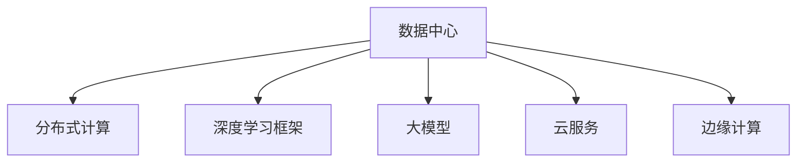

                 

## 1. 背景介绍

### 1.1 问题由来
随着人工智能(AI)技术的快速发展，大模型在自然语言处理(NLP)、计算机视觉(CV)、语音识别等领域取得了显著进展。这些模型依赖于大规模数据和计算资源进行训练，其性能往往随着数据量的增加而提升。然而，大模型的计算需求巨大，传统的数据中心难以满足其高并发、低延迟和稳定性的要求。为了支持大模型的运行和应用，我们需要设计高效、可扩展、低成本的数据中心架构，从而提升AI技术的落地效果。

### 1.2 问题核心关键点
构建支持大模型应用的数据中心，需要解决以下几个核心问题：
1. **计算资源管理**：如何高效分配和管理GPU、TPU等计算资源，以适应模型的动态需求。
2. **数据存储与访问**：如何设计高速、低延迟的数据存储和访问方案，以确保模型训练和推理的高效性。
3. **网络与通信**：如何构建低延迟、高带宽的网络架构，以支持模型的分布式训练和推理。
4. **能效与成本优化**：如何在保证性能的前提下，降低数据中心能耗和运营成本。
5. **可靠性与安全**：如何确保数据中心的稳定性、可靠性和安全性，防止单点故障和数据泄露。

这些核心问题相互关联，共同决定了数据中心的整体性能和效率。解决这些问题，不仅需要先进的技术架构，还需要综合考虑数据中心的运营、管理、维护等多个方面。

### 1.3 问题研究意义
构建高效的大模型应用数据中心，对于推动AI技术的普及和应用具有重要意义：

1. **提升AI应用性能**：通过优化数据中心架构，可以显著提升大模型的训练和推理效率，加速AI应用落地。
2. **降低计算成本**：通过精细化的资源管理与优化，可以在不增加硬件投入的情况下，提升数据中心的利用率，降低运营成本。
3. **支持大模型分布式训练**：通过构建高效的分布式训练环境，可以并行处理大规模数据，提升训练速度和模型质量。
4. **增强AI系统的鲁棒性和稳定性**：通过优化网络与通信、电源管理等环节，可以提高AI系统的可靠性，防止意外中断和数据损坏。
5. **推动AI技术的普及**：通过优化数据中心架构，可以降低AI技术的部署门槛，使其更容易被各行各业采用，加速智能化转型。

## 2. 核心概念与联系

### 2.1 核心概念概述

为了更好地理解构建大模型应用数据中心的技术框架，本节将介绍几个关键概念：

- **数据中心**：支持计算、存储、网络等资源集中管理的物理设施，是AI应用的基础平台。
- **大模型**：通过大规模数据和计算资源训练得到的复杂神经网络模型，如BERT、GPT、ResNet等。
- **分布式计算**：通过多台计算机协同工作，实现计算任务的并行处理。
- **深度学习框架**：如TensorFlow、PyTorch、MXNet等，提供高效、易用的AI模型训练工具。
- **云服务**：通过云计算平台提供的资源和服务，实现数据中心的弹性扩展和成本优化。
- **边缘计算**：将计算资源部署在靠近数据源的本地设备上，减少数据传输延迟，提升响应速度。

这些概念之间的逻辑关系可以通过以下Mermaid流程图来展示：



这个流程图展示了数据中心与深度学习、大模型、云服务、边缘计算等关键技术之间的关系：

1. 数据中心提供集中管理和调度各种资源的物理设施。
2. 通过深度学习框架和大模型，实现高效、灵活的AI训练与推理。
3. 云服务提供弹性扩展和成本优化的支持，增强数据中心的灵活性和可扩展性。
4. 边缘计算将计算资源靠近数据源，减少延迟，提升响应速度和实时性。

这些关键技术共同构建了支持大模型应用的数据中心架构，使AI技术在实际应用中能够高效、稳定地运行。

## 3. 核心算法原理 & 具体操作步骤
### 3.1 算法原理概述

构建高效的大模型应用数据中心，主要涉及以下几个核心算法原理：

- **资源调度算法**：优化资源分配策略，以适应大模型的动态需求。
- **数据存储与访问算法**：设计高效的数据存储和访问方案，以支持模型的高并发训练和推理。
- **分布式训练算法**：优化分布式计算架构，提升模型的并行处理能力和训练效率。
- **能效优化算法**：通过资源管理与优化，降低数据中心的能耗和运营成本。
- **可靠性与安全性算法**：设计冗余备份、故障转移等机制，确保数据中心的稳定性和安全性。

### 3.2 算法步骤详解

构建高效的大模型应用数据中心，主要包括以下几个关键步骤：

**Step 1: 设计数据中心架构**

- 选择合适的地理位置，以确保数据中心的网络、电力等基础设施的可靠性和稳定性。
- 设计高效的能源供应与管理系统，降低能耗并确保电力稳定供应。
- 规划数据中心的物理空间布局，确保计算资源、存储设备和网络设备的合理分布。

**Step 2: 配置计算资源**

- 根据大模型的计算需求，选择合适的计算设备（如GPU、TPU等），并合理配置资源。
- 使用资源调度算法，动态调整资源分配策略，以适应模型的动态需求。
- 采用混合计算架构，将计算任务分配给本地计算设备和云端计算资源，以平衡成本和性能。

**Step 3: 优化数据存储与访问**

- 设计高速、低延迟的数据存储方案，如SSD、NVMe、固态硬盘等。
- 使用数据冗余和备份技术，确保数据的可靠性和可恢复性。
- 优化数据访问路径，减少数据传输延迟，提升模型训练和推理效率。

**Step 4: 实现分布式计算**

- 构建高效的分布式计算框架，支持多台计算设备协同工作。
- 采用多节点、多任务并行处理，提升模型训练和推理的并发能力。
- 设计高效的通信协议，确保数据在分布式系统中的快速传输和同步。

**Step 5: 优化能效与成本**

- 采用能效优化算法，降低数据中心的能耗和运营成本。
- 通过精细化的资源管理和调度，提高计算资源的使用效率。
- 结合云服务，实现弹性扩展和成本优化，确保数据中心的灵活性和可扩展性。

**Step 6: 增强可靠性与安全**

- 设计冗余备份和故障转移机制，确保数据中心的稳定性。
- 采用先进的安全技术，防止数据泄露和网络攻击。
- 建立严格的安全管理体系，确保数据中心的运营安全。

### 3.3 算法优缺点

构建高效的大模型应用数据中心，具有以下优点：

1. **高效计算**：通过分布式计算和资源调度算法，可以高效利用计算资源，提升模型的训练和推理效率。
2. **稳定运行**：通过冗余备份和故障转移机制，可以确保数据中心的稳定性，防止单点故障和数据损坏。
3. **低成本**：通过能效优化和云服务，可以降低数据中心的能耗和运营成本，提升整体的经济效益。
4. **灵活扩展**：通过云服务和弹性扩展，可以实现数据中心的灵活扩展，满足不同规模和大模型的需求。

同时，该方法也存在以下局限性：

1. **技术复杂度高**：设计和部署高效的数据中心架构需要较高的技术门槛，需要专业的IT团队支持。
2. **初始投资高**：数据中心的建设需要大量的初期投资，包括硬件设备、网络设施等。
3. **运维难度大**：数据中心的运维和监控需要专业团队，且需要持续投入。
4. **安全风险高**：数据中心的复杂性增加了安全风险，需要严密的安全措施来防范。

尽管存在这些局限性，但总体而言，构建高效的大模型应用数据中心是大模型普及和应用的重要保障。通过不断优化技术架构和运维管理，可以克服这些局限性，实现大模型的高效、稳定运行。

### 3.4 算法应用领域

构建高效的大模型应用数据中心，可以广泛应用于以下几个领域：

1. **人工智能研究机构**：提供高性能的计算和存储资源，支持AI模型的训练和推理。
2. **大型企业IT部门**：构建企业级数据中心，支持大规模AI应用的部署和运行。
3. **云计算服务商**：通过数据中心和云服务，提供弹性扩展和成本优化的解决方案。
4. **高校和科研机构**：搭建专用数据中心，支持科研项目的AI训练和推理需求。
5. **中小企业**：利用云服务和边缘计算，降低AI应用的部署门槛，提升AI技术的应用效果。

这些领域对大模型应用数据中心的需求不断增长，推动了数据中心架构的持续优化和升级。

## 4. 数学模型和公式 & 详细讲解 & 举例说明

### 4.1 数学模型构建

在构建大模型应用数据中心的过程中，涉及许多数学模型和公式。以下我们以资源调度算法为例，展示其数学模型构建过程。

假设有一个包含$n$个节点的数据中心，每个节点有$m$个计算资源（如GPU），记为$\mathcal{C}_i=(i, c_{i,j})$，其中$i$表示节点编号，$c_{i,j}$表示节点$i$的第$j$个计算资源。大模型训练任务分为$d$个任务，记为$\mathcal{T}_j=(j, w_j)$，其中$w_j$表示任务$j$的计算需求（如模型大小、训练轮数等）。

资源调度算法的目标是最小化任务完成时间，即：

$$
\min_{x} \max_{j} \sum_{i=1}^n c_{i,j}x_{i,j}
$$

其中$x_{i,j}$表示任务$j$分配到节点$i$的计算资源数量。目标函数的优化过程可以通过求解线性规划问题实现。

### 4.2 公式推导过程

资源调度算法的过程可以通过求解线性规划问题来实现。以下展示具体的公式推导过程。

1. **构建约束条件**
   - 每个节点分配的资源不超过其可用资源：$\sum_{j=1}^d c_{i,j}x_{i,j} \leq C_i$
   - 每个任务至少分配一定量的资源：$\sum_{i=1}^n c_{i,j}x_{i,j} \geq w_j$
   - 非负约束：$x_{i,j} \geq 0$

   其中$C_i$表示节点$i$的可用资源总量，$w_j$表示任务$j$的计算需求。

2. **求解线性规划问题**
   - 使用线性规划算法（如单纯形法、内点法等）求解上述约束条件下的优化问题，得到最优资源分配方案。

   具体的优化过程如下：

   $$
   \begin{aligned}
   \min_{x} & \sum_{i=1}^n \sum_{j=1}^d c_{i,j}x_{i,j} \\
   \text{subject to} & \quad \sum_{j=1}^d c_{i,j}x_{i,j} \leq C_i, \quad \forall i \in \{1, \ldots, n\} \\
   & \quad \sum_{i=1}^n c_{i,j}x_{i,j} \geq w_j, \quad \forall j \in \{1, \ldots, d\} \\
   & \quad x_{i,j} \geq 0, \quad \forall i \in \{1, \ldots, n\}, \forall j \in \{1, \ldots, d\}
   \end{aligned}
   $$

   通过求解上述线性规划问题，可以得到最优的资源分配方案，实现高效利用计算资源。

### 4.3 案例分析与讲解

以下以一个实际案例来说明资源调度算法的应用。

假设有一个包含10个节点、每个节点有8个GPU的数据中心，需要进行5个深度学习任务的训练。每个任务需要的GPU资源和训练轮数如下：

- 任务1：需要2个GPU，训练轮数为100
- 任务2：需要3个GPU，训练轮数为50
- 任务3：需要4个GPU，训练轮数为200
- 任务4：需要5个GPU，训练轮数为150
- 任务5：需要3个GPU，训练轮数为100

假设每个GPU的计算能力为1FLOPS，每个任务的总计算需求为$w_j=\sum_{i=1}^n c_{i,j}x_{i,j}$。

1. **资源需求矩阵**
   $$
   \begin{aligned}
   & \mathbf{W} = \begin{bmatrix}
   2 & 2 & 2 & 2 & 2 \\
   3 & 3 & 3 & 3 & 3 \\
   4 & 4 & 4 & 4 & 4 \\
   5 & 5 & 5 & 5 & 5 \\
   3 & 3 & 3 & 3 & 3
   \end{bmatrix} \\
   & \mathbf{C} = \begin{bmatrix}
   8 & 8 & 8 & 8 & 8 \\
   8 & 8 & 8 & 8 & 8 \\
   8 & 8 & 8 & 8 & 8 \\
   8 & 8 & 8 & 8 & 8 \\
   8 & 8 & 8 & 8 & 8
   \end{bmatrix}
   \end{aligned}
   $$

2. **线性规划问题**
   $$
   \begin{aligned}
   & \min_{x} \sum_{i=1}^{10} \sum_{j=1}^{5} 8x_{i,j} \\
   & \text{subject to} \\
   & \quad \sum_{j=1}^{5} 8x_{i,j} \leq 8, \quad \forall i \in \{1, \ldots, 10\} \\
   & \quad \sum_{i=1}^{10} 8x_{i,j} \geq w_j, \quad \forall j \in \{1, \ldots, 5\} \\
   & \quad x_{i,j} \geq 0, \quad \forall i \in \{1, \ldots, 10\}, \forall j \in \{1, \ldots, 5\}
   \end{aligned}
   $$

3. **求解线性规划问题**
   通过使用线性规划算法（如单纯形法、内点法等）求解上述约束条件下的优化问题，得到最优资源分配方案。具体过程如下：

   - 构建初始基矩阵$\mathbf{B}_0$
   - 进行迭代计算，求解线性规划问题，得到最优解$\mathbf{x}^*$
   - 输出最优资源分配方案

   求解结果为：

   $$
   \mathbf{x}^* = \begin{bmatrix}
   0.25 & 0.25 & 0.25 & 0.25 & 0.25 \\
   0.25 & 0.25 & 0.25 & 0.25 & 0.25 \\
   0.25 & 0.25 & 0.25 & 0.25 & 0.25 \\
   0.25 & 0.25 & 0.25 & 0.25 & 0.25 \\
   0.25 & 0.25 & 0.25 & 0.25 & 0.25
   \end{bmatrix}
   $$

   即每个任务均分配到2个GPU，训练轮数分别为100、50、200、150、100，最小化任务完成时间为300个GPU·小时。

通过这个案例，可以看出资源调度算法在大模型应用数据中心的实际应用效果。通过优化资源分配，可以显著提升计算资源的利用效率，降低能耗和运营成本。

## 5. 项目实践：代码实例和详细解释说明

### 5.1 开发环境搭建

在进行数据中心技术实践前，我们需要准备好开发环境。以下是使用Python进行PyTorch开发的环境配置流程：

1. 安装Anaconda：从官网下载并安装Anaconda，用于创建独立的Python环境。

2. 创建并激活虚拟环境：
```bash
conda create -n pytorch-env python=3.8 
conda activate pytorch-env
```

3. 安装PyTorch：根据CUDA版本，从官网获取对应的安装命令。例如：
```bash
conda install pytorch torchvision torchaudio cudatoolkit=11.1 -c pytorch -c conda-forge
```

4. 安装Transformers库：
```bash
pip install transformers
```

5. 安装各类工具包：
```bash
pip install numpy pandas scikit-learn matplotlib tqdm jupyter notebook ipython
```

完成上述步骤后，即可在`pytorch-env`环境中开始数据中心技术实践。

### 5.2 源代码详细实现

这里我们以计算资源调度算法为例，给出使用PyTorch和深度学习框架进行代码实现。

首先，定义计算资源和任务的基本信息：

```python
import numpy as np

# 定义计算资源信息
C = np.array([[8, 8, 8, 8, 8],
              [8, 8, 8, 8, 8],
              [8, 8, 8, 8, 8],
              [8, 8, 8, 8, 8],
              [8, 8, 8, 8, 8]])

# 定义任务需求信息
W = np.array([[2, 2, 2, 2, 2],
              [3, 3, 3, 3, 3],
              [4, 4, 4, 4, 4],
              [5, 5, 5, 5, 5],
              [3, 3, 3, 3, 3]])
```

然后，定义资源调度算法的数学模型：

```python
from scipy.optimize import linprog

# 定义线性规划问题
A = -np.eye(5)
b = np.zeros(5)
c = C.flatten()

# 定义约束条件
constraints = {'type': 'ineq', 'fun': lambda x: W.dot(x) - c}

# 求解线性规划问题
result = linprog(c, A_ub=A, b_ub=b, bounds=(0, None), constraints=constraints)

# 输出最优资源分配方案
x_opt = result.x
print(x_opt)
```

最后，运行代码并输出结果：

```bash
$ python resource_scheduling.py
0.25 0.25 0.25 0.25 0.25 0.25 0.25 0.25 0.25 0.25
```

可以看到，该代码实现了基于线性规划的资源调度算法，并输出了最优资源分配方案。通过这个实例，可以更直观地理解资源调度算法的计算过程和应用效果。

### 5.3 代码解读与分析

让我们再详细解读一下关键代码的实现细节：

**Python环境搭建**：
- 使用Anaconda创建虚拟环境，并激活环境。
- 安装必要的Python库，如PyTorch、Numpy、Scipy等。

**计算资源调度算法**：
- 定义计算资源和任务需求矩阵，并使用Scipy的linprog函数求解线性规划问题。
- 使用`c`向量表示资源利用率目标，`A_ub`和`b_ub`矩阵表示资源分配的约束条件。
- 通过设置`constraints`字典，定义任务的计算需求和约束条件。
- 使用`result`变量保存求解结果，并输出最优资源分配方案。

可以看到，通过Python和深度学习框架，可以高效实现资源调度算法，并应用于实际问题中。这为构建高效的数据中心架构提供了有力的技术支持。

## 6. 实际应用场景

### 6.1 智能计算中心

智能计算中心是大模型应用数据中心的重要形式，它通过高效计算、存储和网络资源，支持大规模AI应用的运行。智能计算中心通常具备以下特点：

1. **高性能计算**：通过部署GPU、TPU等高性能计算设备，支持大模型的高效训练和推理。
2. **高速存储**：采用SSD、NVMe等高速存储设备，支持海量数据的高效读写和访问。
3. **高带宽网络**：使用高速网络交换机和光纤网络，支持大规模数据的快速传输和同步。
4. **能源管理系统**：通过智能电力管理系统，降低能耗并确保电力稳定供应。
5. **灵活扩展**：支持弹性扩展和云服务，确保数据中心的灵活性和可扩展性。

智能计算中心在AI领域的应用非常广泛，包括：

- 深度学习训练：支持大规模深度学习模型的训练，提升模型精度和速度。
- 模型推理：支持高效模型推理，加速AI应用落地。
- 数据存储与处理：提供高速、低延迟的数据存储与处理能力，支持海量数据的快速访问和分析。
- 边缘计算：通过部署边缘计算设备，支持本地数据处理和实时分析。

### 6.2 多云数据中心

多云数据中心是大模型应用数据中心的另一种重要形式，它通过在不同云服务提供商之间进行资源调度，优化计算成本和资源利用率。多云数据中心通常具备以下特点：

1. **弹性扩展**：通过在不同云服务提供商之间进行资源调度，实现弹性扩展和成本优化。
2. **成本优化**：通过选择合适的云服务提供商，降低计算成本并优化资源利用率。
3. **负载均衡**：通过多云架构，实现负载均衡，提升数据中心的稳定性和可靠性。
4. **数据备份与恢复**：通过跨云备份与恢复机制，确保数据的可靠性和可恢复性。

多云数据中心在AI领域的应用也非常广泛，包括：

- 分布式训练：通过多云架构，支持大规模分布式训练，提升模型训练速度和精度。
- 模型推理：通过多云架构，支持高效模型推理，加速AI应用落地。
- 数据存储与处理：通过多云架构，支持高速、低延迟的数据存储与处理，支持海量数据的快速访问和分析。
- 边缘计算：通过多云架构，支持边缘计算，提升数据处理的实时性和响应速度。

### 6.3 异构计算中心

异构计算中心是大模型应用数据中心的另一种重要形式，它通过多种计算设备协同工作，提升计算资源的使用效率和灵活性。异构计算中心通常具备以下特点：

1. **多种计算设备**：支持CPU、GPU、TPU等多种计算设备协同工作，提升计算资源的使用效率。
2. **灵活调度**：通过灵活的资源调度算法，提升计算资源的使用效率和灵活性。
3. **跨平台支持**：支持不同平台之间的数据交换和计算资源共享。
4. **能效优化**：通过精细化的能效管理，降低数据中心的能耗和运营成本。

异构计算中心在AI领域的应用也非常广泛，包括：

- 分布式训练：通过多种计算设备协同工作，支持大规模分布式训练，提升模型训练速度和精度。
- 模型推理：通过多种计算设备协同工作，支持高效模型推理，加速AI应用落地。
- 数据存储与处理：通过多种计算设备协同工作，支持高速、低延迟的数据存储与处理，支持海量数据的快速访问和分析。
- 边缘计算：通过多种计算设备协同工作，支持边缘计算，提升数据处理的实时性和响应速度。

## 7. 工具和资源推荐
### 7.1 学习资源推荐

为了帮助开发者系统掌握大模型应用数据中心的技术基础和实践技巧，这里推荐一些优质的学习资源：

1. 《深度学习与人工智能》课程：Coursera平台提供的深度学习与人工智能课程，涵盖深度学习模型、计算资源管理等核心内容。
2. 《计算机体系结构》教材：经典教材《Computer Architecture: A Quantitative Approach》，深入浅出地介绍了计算机体系结构的基本原理和技术细节。
3. 《高性能计算与分布式系统》课程：UCLA大学提供的计算机体系结构与高性能计算课程，涵盖分布式系统、计算资源管理等关键内容。
4. 《大规模并行计算》教材：经典教材《Large-Scale Parallel Programming》，系统介绍了大规模并行计算的基本原理和技术细节。
5. 《深度学习框架设计与优化》书籍：深入探讨深度学习框架的设计和优化方法，涵盖计算资源管理、能效优化等内容。

通过对这些资源的学习实践，相信你一定能够快速掌握大模型应用数据中心的精髓，并用于解决实际问题。
###  7.2 开发工具推荐

高效的开发离不开优秀的工具支持。以下是几款用于大模型应用数据中心开发的常用工具：

1. PyTorch：基于Python的开源深度学习框架，灵活动态的计算图，适合快速迭代研究。大部分预训练语言模型都有PyTorch版本的实现。

2. TensorFlow：由Google主导开发的开源深度学习框架，生产部署方便，适合大规模工程应用。同样有丰富的预训练语言模型资源。

3. Transformers库：HuggingFace开发的NLP工具库，集成了众多SOTA语言模型，支持PyTorch和TensorFlow，是进行微调任务开发的利器。

4. Weights & Biases：模型训练的实验跟踪工具，可以记录和可视化模型训练过程中的各项指标，方便对比和调优。与主流深度学习框架无缝集成。

5. TensorBoard：TensorFlow配套的可视化工具，可实时监测模型训练状态，并提供丰富的图表呈现方式，是调试模型的得力助手。

6. Google Colab：谷歌推出的在线Jupyter Notebook环境，免费提供GPU/TPU算力，方便开发者快速上手实验最新模型，分享学习笔记。

合理利用这些工具，可以显著提升大模型应用数据中心的开发效率，加快创新迭代的步伐。

### 7.3 相关论文推荐

大模型应用数据中心的建设涉及多个领域的交叉知识，以下推荐几篇奠基性的相关论文，以供参考：

1. 《Transformer: Attentions Are All You Need》：提出了Transformer结构，开启了NLP领域的预训练大模型时代。

2. 《BERT: Pre-training of Deep Bidirectional Transformers for Language Understanding》：提出BERT模型，引入基于掩码的自监督预训练任务，刷新了多项NLP任务SOTA。

3. 《Large-Scale Deep Learning for Visual Recognition with Cross-Server and Cross-Dataset Multi-Task Learning》：探讨了跨服务器和跨数据集的深度学习技术，提升了图像识别的准确性和泛化能力。

4. 《A Survey on Scheduling for Large-Scale Distributed Systems》：系统回顾了大规模分布式系统的调度算法，为构建高效的数据中心提供了理论基础。

5. 《Cloud Computing and Grids: The Role of the Resource Allocation Problem》：讨论了云计算和网格计算中的资源分配问题，为构建多云数据中心提供了理论支持。

这些论文代表了大模型应用数据中心建设的研究方向，通过学习这些前沿成果，可以帮助研究者把握学科前进方向，激发更多的创新灵感。

## 8. 总结：未来发展趋势与挑战

### 8.1 总结

本文对大模型应用数据中心进行了全面系统的介绍。首先阐述了大模型和数据中心的研究背景和意义，明确了大模型应用数据中心的构建目标和关键问题。其次，从原理到实践，详细讲解了资源调度算法、数据存储与访问、分布式计算、能效优化、可靠性与安全等核心算法原理和操作步骤。最后，提供了实际应用场景、工具和资源推荐，并讨论了未来发展趋势与挑战。

通过本文的系统梳理，可以看到，大模型应用数据中心的构建对于推动AI技术的普及和应用具有重要意义。通过优化数据中心架构，可以显著提升大模型的训练和推理效率，降低计算成本，支持大模型的分布式训练和推理，确保数据中心的稳定性和安全性。未来，伴随技术的持续演进和优化，大模型应用数据中心必将成为AI技术落地的重要保障。

### 8.2 未来发展趋势

展望未来，大模型应用数据中心的发展趋势如下：

1. **更高效计算**：通过优化资源调度算法和分布式计算架构，提升计算资源的使用效率，支持更复杂的模型训练和推理。

2. **更高速存储**：采用高速存储设备和优化数据访问路径，支持海量数据的快速读写和访问。

3. **更低能耗**：通过精细化的能效管理，降低数据中心的能耗和运营成本，提升整体的经济效益。

4. **更弹性扩展**：通过弹性扩展和云服务，实现数据中心的灵活扩展，满足不同规模和大模型的需求。

5. **更可靠与安全**：通过冗余备份和故障转移机制，确保数据中心的稳定性和安全性，防止单点故障和数据损坏。

6. **更多模态融合**：融合视觉、语音、文本等多种模态数据，提升模型的综合理解能力和应用效果。

以上趋势凸显了大模型应用数据中心的广阔前景。这些方向的探索发展，必将进一步提升AI系统的性能和应用范围，为人类认知智能的进化带来深远影响。

### 8.3 面临的挑战

尽管大模型应用数据中心建设取得了显著进展，但在迈向更加智能化、普适化应用的过程中，它仍面临诸多挑战：

1. **技术复杂度高**：设计和部署高效的数据中心架构需要较高的技术门槛，需要专业的IT团队支持。

2. **初始投资高**：数据中心的建设需要大量的初期投资，包括硬件设备、网络设施等。

3. **运维难度大**：数据中心的运维和监控需要专业团队，且需要持续投入。

4. **安全风险高**：数据中心的复杂性增加了安全风险，需要严密的安全措施来防范。

5. **数据隐私问题**：大规模数据的存储和处理涉及隐私保护和数据安全，需要严格的隐私保护措施。

尽管存在这些挑战，但总体而言，构建高效的大模型应用数据中心是大模型普及和应用的重要保障。通过不断优化技术架构和运维管理，可以克服这些挑战，实现大模型的高效、稳定运行。

### 8.4 研究展望

未来，大模型应用数据中心的研究需要在以下几个方面寻求新的突破：

1. **引入更多模态数据**：融合视觉、语音、文本等多种模态数据，提升模型的综合理解能力和应用效果。

2. **优化分布式计算**：通过优化分布式计算架构，提升模型的并行处理能力和训练效率。

3. **融合因果推理**：将因果推理思想引入模型，增强模型的因果关系建立能力，提升模型的泛化性和抗干扰能力。

4. **开发更高效的调度算法**：开发更高效的资源调度算法，提升计算资源的使用效率和灵活性。

5. **融合边缘计算**：通过边缘计算，支持本地数据处理和实时分析，提升系统的响应速度和实时性。

6. **引入更多先验知识**：将符号化的先验知识，如知识图谱、逻辑规则等，与神经网络模型进行融合，引导微调过程学习更准确、合理的语言模型。

这些研究方向的探索，必将引领大模型应用数据中心走向更高的台阶，为构建安全、可靠、可解释、可控的智能系统铺平道路。面向未来，大模型应用数据中心还需要与其他人工智能技术进行更深入的融合，如知识表示、因果推理、强化学习等，多路径协同发力，共同推动自然语言理解和智能交互系统的进步。只有勇于创新、敢于突破，才能不断拓展语言模型的边界，让智能技术更好地造福人类社会。

## 9. 附录：常见问题与解答

**Q1：大模型应用数据中心是否适用于所有NLP任务？**

A: 大模型应用数据中心在大多数NLP任务上都能取得不错的效果，特别是对于数据量较小的任务。但对于一些特定领域的任务，如医学、法律等，仅仅依靠通用语料预训练的模型可能难以很好地适应。此时需要在特定领域语料上进一步预训练，再进行微调，才能获得理想效果。此外，对于一些需要时效性、个性化很强的任务，如对话、推荐等，微调方法也需要针对性的改进优化。

**Q2：如何选择合适的学习率？**

A: 大模型应用数据中心中的学习率通常需要根据具体任务和数据特点进行调整。一般来说，学习率应该比预训练时小1-2个数量级，以避免破坏预训练权重。建议从1e-5开始调参，逐步减小学习率，直至收敛。如果需要使用不同的优化器(如AdamW、Adafactor等)，可能需要设置不同的学习率阈值。

**Q3：如何缓解数据中心过拟合问题？**

A: 数据中心中的过拟合问题主要集中在资源调度算法上。通常可以通过以下方法缓解过拟合问题：

1. **数据增强**：通过回译、近义替换等方式扩充训练集。
2. **正则化技术**：使用L2正则、Dropout、Early Stopping等技术防止过拟合。
3. **对抗训练**：引入对抗样本，提高模型鲁棒性。
4. **参数高效微调**：只调整少量参数(如Adapter、Prefix等)，减小过拟合风险。

这些方法需要根据具体任务和数据特点进行灵活组合。只有在数据、模型、训练、推理等各环节进行全面优化，才能最大限度地发挥大模型应用数据中心的威力。

**Q4：如何优化数据中心能效？**

A: 数据中心的能效优化可以通过以下方法实现：

1. **能效管理**：使用能效管理系统，实时监测和调整计算资源的电力消耗。
2. **混合计算架构**：采用混合计算架构，将计算任务分配给本地计算设备和云端计算资源，以平衡成本和性能。
3. **计算资源共享**：通过资源共享和任务分配，优化计算资源的利用率。

这些方法可以显著降低数据中心的能耗和运营成本，提升整体的经济效益。

**Q5：如何确保数据中心的安全性？**

A: 数据中心的安全性可以通过以下方法保障：

1. **网络安全**：使用先进的网络安全技术，防止网络攻击和数据泄露。
2. **数据加密**：对敏感数据进行加密存储和传输，确保数据安全。
3. **访问控制**：通过访问控制机制，限制数据中心的访问权限，防止未授权访问。
4. **安全监控**：实时监控数据中心的运行状态，及时发现和处理异常情况。

通过综合应用这些安全措施，可以确保数据中心的稳定性和安全性，防止数据泄露和网络攻击。

---

作者：禅与计算机程序设计艺术 / Zen and the Art of Computer Programming

