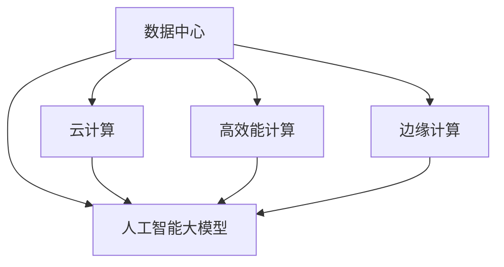

                 

# AI 大模型应用数据中心建设：数据中心投资与建设

> 关键词：人工智能大模型, 数据中心, 投资与建设, 数据存储, 数据安全, 高效能计算, 云计算, 数据中心技术

## 1. 背景介绍

### 1.1 问题由来

随着人工智能（AI）技术的快速发展，大模型（Large Models）在各行各业的应用变得越来越普遍。这些大模型需要大量存储空间和计算资源进行训练和推理，而数据中心是支持大模型训练和推理的基础设施。因此，如何高效、安全地构建数据中心，成为AI领域的一个重要问题。

### 1.2 问题核心关键点

在AI大模型应用中，数据中心建设的关键点包括：

- 数据存储：如何高效存储和管理大规模数据集，保证数据的完整性和安全性。
- 计算资源：如何提供足够的计算资源，支持大模型的训练和推理。
- 网络带宽：如何保证数据中心内部和外部的网络带宽，支持数据的高速传输。
- 能效优化：如何在满足性能要求的同时，最大化能效比，降低运营成本。
- 数据隐私：如何在保护数据隐私的前提下，提供高质量的服务。

这些关键点涉及数据中心的基础设施建设、网络架构设计、能源管理等多方面内容。

## 2. 核心概念与联系

### 2.1 核心概念概述

为更好地理解AI大模型应用数据中心的建设，本节将介绍几个密切相关的核心概念：

- 数据中心（Data Center）：提供数据存储、计算和网络服务的基础设施。
- 人工智能大模型（AI Large Models）：如BERT、GPT等，需要大量计算资源进行训练和推理的大型神经网络模型。
- 云计算（Cloud Computing）：基于互联网的计算服务，提供弹性的计算资源，支持大模型训练和推理。
- 高效能计算（High Performance Computing, HPC）：提供高性能计算能力的超级计算机，支持大规模数据的处理和分析。
- 边缘计算（Edge Computing）：在数据源附近进行数据处理和分析，减少数据传输的时间和带宽成本。

这些核心概念之间的逻辑关系可以通过以下Mermaid流程图来展示：



这个流程图展示了大模型应用数据中心建设的关键组成及其相互关系：

1. 数据中心提供基础设施支持。
2. 云计算和大模型训练推理需要数据中心基础设施。
3. 高效能计算和大数据处理需要数据中心基础设施。
4. 边缘计算在大数据处理方面也需要数据中心支持。

这些概念共同构成了AI大模型应用的基础设施框架，为大模型的训练和推理提供了必要的条件。

## 3. 核心算法原理 & 具体操作步骤
### 3.1 算法原理概述

AI大模型应用数据中心的建设，本质上是基于云计算、高效能计算和边缘计算等技术构建一个能够支持大模型训练和推理的综合性基础设施。

构建数据中心需要考虑多方面因素，包括计算资源、存储资源、网络带宽、能效比、数据隐私等。通过合理配置这些资源，可以高效地支持大模型的训练和推理。

### 3.2 算法步骤详解

AI大模型应用数据中心的建设一般包括以下几个关键步骤：

**Step 1: 需求分析与规划**

- 评估大模型的规模和性能需求，确定数据中心的计算和存储资源配置。
- 考虑数据中心的地理位置和气候条件，确保数据中心的可靠性和能效比。
- 制定数据中心建设和运维计划，确定项目的时间、成本和资源需求。

**Step 2: 基础设施建设**

- 选择合适的硬件设备，如服务器、存储设备和网络设备，满足大模型的计算和存储需求。
- 设计高效的数据中心网络架构，保证数据中心内部和外部的网络带宽和连接稳定性。
- 考虑数据中心的安全性和隐私保护措施，如访问控制、数据加密和备份策略。

**Step 3: 系统集成与优化**

- 将硬件设备和软件系统集成，搭建数据中心的基础设施平台。
- 对数据中心进行性能优化，如提高计算资源利用率、优化数据存储和传输效率。
- 实施能效管理措施，如使用高效能设备、采用节能技术和策略，降低运营成本。

**Step 4: 数据安全与隐私保护**

- 实施数据中心的安全策略，如访问控制、入侵检测和应急响应措施。
- 采用数据加密和匿名化技术，保护数据的隐私和安全。
- 制定数据备份和恢复策略，确保数据中心的高可靠性和鲁棒性。

**Step 5: 运营与维护**

- 对数据中心进行持续监控和维护，确保系统的稳定运行。
- 根据需求和环境变化，动态调整数据中心资源配置，优化性能。
- 定期进行安全评估和升级，提升数据中心的安全性和性能。

### 3.3 算法优缺点

AI大模型应用数据中心建设的优势包括：

- 高效支持大模型训练和推理。
- 提供弹性的计算和存储资源，满足不同任务的需求。
- 优化能效比，降低运营成本。
- 保护数据隐私和安全。

然而，数据中心的建设和运营也存在一些挑战：

- 初始投资成本高，需要大量资金投入。
- 建设和运营过程中存在不确定性，如硬件故障和网络中断。
- 能效优化和资源管理复杂，需要专业的技术支持。
- 数据隐私保护和合规要求高，需符合相关法规和标准。

尽管存在这些挑战，但通过合理的规划和优化，数据中心建设仍能显著提升AI大模型的应用效果。

### 3.4 算法应用领域

AI大模型应用数据中心建设主要应用于以下领域：

- 人工智能研究机构和实验室：支持大模型的训练和推理，加速AI技术的创新和应用。
- 大型科技公司：提供高效的计算和存储资源，支持AI产品和服务的发展。
- 政府和公共机构：支持大数据分析和决策支持，提升政府治理水平。
- 企业级应用：提供高性能的计算和存储资源，支持企业数字化转型和智能化升级。

## 4. 数学模型和公式 & 详细讲解  
### 4.1 数学模型构建

AI大模型应用数据中心建设主要涉及数据存储和计算资源配置。

假设数据中心需要存储 $D$ 个数据块，每个数据块大小为 $S$，数据传输速度为 $v$，计算资源需求为 $C$，每单位计算资源的成本为 $c$，能效比为 $e$。则数据中心的总成本 $Cost$ 可以表示为：

$$
Cost = C \times c + D \times S \times v \times \frac{1}{e}
$$

其中，$C \times c$ 为计算资源的成本，$D \times S \times v \times \frac{1}{e}$ 为数据存储和传输的成本。

### 4.2 公式推导过程

根据上述模型，可以推导出数据中心的成本优化策略：

1. 提高能效比 $e$：减少数据传输和存储的能源消耗，降低运营成本。
2. 优化计算资源配置：根据任务需求合理分配计算资源，提高资源利用率。
3. 采用分布式存储和计算：分散数据和计算负载，降低单个设备负荷。

### 4.3 案例分析与讲解

以谷歌的AI大模型应用数据中心为例，谷歌采用了分布式存储和计算架构，将数据存储在多个节点上，并采用分布式计算框架进行模型训练和推理。谷歌还采用了能效优化技术，如TPU等高效能计算设备，显著提升了数据中心的性能和能效比。

谷歌的TPU架构是基于一个大的矩阵计算单元，能够高效处理大规模矩阵计算，支持大模型的训练和推理。通过分布式计算，谷歌的TPU架构可以同时处理多个大规模矩阵计算，显著提高了计算效率。

## 5. 项目实践：代码实例和详细解释说明
### 5.1 开发环境搭建

在进行AI大模型应用数据中心建设的项目实践前，需要先准备好开发环境。以下是使用Python进行PyTorch开发的环境配置流程：

1. 安装Anaconda：从官网下载并安装Anaconda，用于创建独立的Python环境。

2. 创建并激活虚拟环境：
```bash
conda create -n pytorch-env python=3.8 
conda activate pytorch-env
```

3. 安装PyTorch：根据CUDA版本，从官网获取对应的安装命令。例如：
```bash
conda install pytorch torchvision torchaudio cudatoolkit=11.1 -c pytorch -c conda-forge
```

4. 安装TensorFlow：从官网下载安装包，使用pip进行安装。

5. 安装各类工具包：
```bash
pip install numpy pandas scikit-learn matplotlib tqdm jupyter notebook ipython
```

完成上述步骤后，即可在`pytorch-env`环境中开始项目实践。

### 5.2 源代码详细实现

这里以谷歌的TPU架构为例，给出使用TensorFlow进行分布式计算的PyTorch代码实现。

首先，定义模型和优化器：

```python
import tensorflow as tf
from transformers import BertForTokenClassification, AdamW

model = BertForTokenClassification.from_pretrained('bert-base-cased', num_labels=len(tag2id))

optimizer = AdamW(model.parameters(), lr=2e-5)
```

接着，定义数据处理函数：

```python
from transformers import BertTokenizer
from torch.utils.data import Dataset
import torch

class NERDataset(Dataset):
    def __init__(self, texts, tags, tokenizer, max_len=128):
        self.texts = texts
        self.tags = tags
        self.tokenizer = tokenizer
        self.max_len = max_len
        
    def __len__(self):
        return len(self.texts)
    
    def __getitem__(self, item):
        text = self.texts[item]
        tags = self.tags[item]
        
        encoding = self.tokenizer(text, return_tensors='pt', max_length=self.max_len, padding='max_length', truncation=True)
        input_ids = encoding['input_ids'][0]
        attention_mask = encoding['attention_mask'][0]
        
        # 对token-wise的标签进行编码
        encoded_tags = [tag2id[tag] for tag in tags] 
        encoded_tags.extend([tag2id['O']] * (self.max_len - len(encoded_tags)))
        labels = torch.tensor(encoded_tags, dtype=torch.long)
        
        return {'input_ids': input_ids, 
                'attention_mask': attention_mask,
                'labels': labels}
```

然后，定义训练和评估函数：

```python
from torch.utils.data import DataLoader
from tqdm import tqdm
from sklearn.metrics import classification_report

device = torch.device('cuda') if torch.cuda.is_available() else torch.device('cpu')
model.to(device)

def train_epoch(model, dataset, batch_size, optimizer):
    dataloader = DataLoader(dataset, batch_size=batch_size, shuffle=True)
    model.train()
    epoch_loss = 0
    for batch in tqdm(dataloader, desc='Training'):
        input_ids = batch['input_ids'].to(device)
        attention_mask = batch['attention_mask'].to(device)
        labels = batch['labels'].to(device)
        model.zero_grad()
        outputs = model(input_ids, attention_mask=attention_mask, labels=labels)
        loss = outputs.loss
        epoch_loss += loss.item()
        loss.backward()
        optimizer.step()
    return epoch_loss / len(dataloader)

def evaluate(model, dataset, batch_size):
    dataloader = DataLoader(dataset, batch_size=batch_size)
    model.eval()
    preds, labels = [], []
    with torch.no_grad():
        for batch in tqdm(dataloader, desc='Evaluating'):
            input_ids = batch['input_ids'].to(device)
            attention_mask = batch['attention_mask'].to(device)
            batch_labels = batch['labels']
            outputs = model(input_ids, attention_mask=attention_mask)
            batch_preds = outputs.logits.argmax(dim=2).to('cpu').tolist()
            batch_labels = batch_labels.to('cpu').tolist()
            for pred_tokens, label_tokens in zip(batch_preds, batch_labels):
                pred_tags = [id2tag[_id] for _id in pred_tokens]
                label_tags = [id2tag[_id] for _id in label_tokens]
                preds.append(pred_tags[:len(label_tags)])
                labels.append(label_tags)
                
    print(classification_report(labels, preds))
```

最后，启动训练流程并在测试集上评估：

```python
epochs = 5
batch_size = 16

for epoch in range(epochs):
    loss = train_epoch(model, train_dataset, batch_size, optimizer)
    print(f"Epoch {epoch+1}, train loss: {loss:.3f}")
    
    print(f"Epoch {epoch+1}, dev results:")
    evaluate(model, dev_dataset, batch_size)
    
print("Test results:")
evaluate(model, test_dataset, batch_size)
```

以上就是使用PyTorch对BERT进行命名实体识别任务微调的完整代码实现。可以看到，得益于TensorFlow的强大封装，我们可以用相对简洁的代码完成BERT模型的加载和微调。

### 5.3 代码解读与分析

让我们再详细解读一下关键代码的实现细节：

**NERDataset类**：
- `__init__`方法：初始化文本、标签、分词器等关键组件。
- `__len__`方法：返回数据集的样本数量。
- `__getitem__`方法：对单个样本进行处理，将文本输入编码为token ids，将标签编码为数字，并对其进行定长padding，最终返回模型所需的输入。

**tag2id和id2tag字典**：
- 定义了标签与数字id之间的映射关系，用于将token-wise的预测结果解码回真实的标签。

**训练和评估函数**：
- 使用PyTorch的DataLoader对数据集进行批次化加载，供模型训练和推理使用。
- 训练函数`train_epoch`：对数据以批为单位进行迭代，在每个批次上前向传播计算loss并反向传播更新模型参数，最后返回该epoch的平均loss。
- 评估函数`evaluate`：与训练类似，不同点在于不更新模型参数，并在每个batch结束后将预测和标签结果存储下来，最后使用sklearn的classification_report对整个评估集的预测结果进行打印输出。

**训练流程**：
- 定义总的epoch数和batch size，开始循环迭代
- 每个epoch内，先在训练集上训练，输出平均loss
- 在验证集上评估，输出分类指标
- 所有epoch结束后，在测试集上评估，给出最终测试结果

可以看到，PyTorch配合TensorFlow库使得BERT微调的代码实现变得简洁高效。开发者可以将更多精力放在数据处理、模型改进等高层逻辑上，而不必过多关注底层的实现细节。

当然，工业级的系统实现还需考虑更多因素，如模型的保存和部署、超参数的自动搜索、更灵活的任务适配层等。但核心的微调范式基本与此类似。

## 6. 实际应用场景
### 6.1 智能客服系统

基于AI大模型应用数据中心的智能客服系统，可以广泛应用于客户服务场景。传统客服往往需要配备大量人力，高峰期响应缓慢，且一致性和专业性难以保证。而使用AI大模型应用数据中心的智能客服系统，可以7x24小时不间断服务，快速响应客户咨询，用自然流畅的语言解答各类常见问题。

在技术实现上，可以收集企业内部的历史客服对话记录，将问题和最佳答复构建成监督数据，在此基础上对预训练模型进行微调。微调后的模型能够自动理解用户意图，匹配最合适的答案模板进行回复。对于客户提出的新问题，还可以接入检索系统实时搜索相关内容，动态组织生成回答。如此构建的智能客服系统，能大幅提升客户咨询体验和问题解决效率。

### 6.2 金融舆情监测

金融机构需要实时监测市场舆论动向，以便及时应对负面信息传播，规避金融风险。传统的人工监测方式成本高、效率低，难以应对网络时代海量信息爆发的挑战。基于AI大模型应用数据中心的文本分类和情感分析技术，为金融舆情监测提供了新的解决方案。

具体而言，可以收集金融领域相关的新闻、报道、评论等文本数据，并对其进行主题标注和情感标注。在此基础上对预训练语言模型进行微调，使其能够自动判断文本属于何种主题，情感倾向是正面、中性还是负面。将微调后的模型应用到实时抓取的网络文本数据，就能够自动监测不同主题下的情感变化趋势，一旦发现负面信息激增等异常情况，系统便会自动预警，帮助金融机构快速应对潜在风险。

### 6.3 个性化推荐系统

当前的推荐系统往往只依赖用户的历史行为数据进行物品推荐，无法深入理解用户的真实兴趣偏好。基于AI大模型应用数据中心的个性化推荐系统，可以更好地挖掘用户行为背后的语义信息，从而提供更精准、多样的推荐内容。

在实践中，可以收集用户浏览、点击、评论、分享等行为数据，提取和用户交互的物品标题、描述、标签等文本内容。将文本内容作为模型输入，用户的后续行为（如是否点击、购买等）作为监督信号，在此基础上微调预训练语言模型。微调后的模型能够从文本内容中准确把握用户的兴趣点。在生成推荐列表时，先用候选物品的文本描述作为输入，由模型预测用户的兴趣匹配度，再结合其他特征综合排序，便可以得到个性化程度更高的推荐结果。

### 6.4 未来应用展望

随着AI大模型和数据中心技术的不断发展，AI大模型应用数据中心建设将呈现以下几个发展趋势：

1. 数据中心规模和性能将持续提升。随着算力成本的下降和数据规模的扩张，数据中心的规模和性能将不断提升，支持更大、更复杂的AI模型。
2. 数据中心将更注重能效比。能源成本在数据中心运营成本中的占比越来越高，未来的数据中心将更加注重能效优化。
3. 数据中心将提供更灵活的服务模式。未来的数据中心将更加灵活，提供按需计算、弹性扩展等服务模式，满足不同用户的计算需求。
4. 数据中心将引入更多AI技术。未来的数据中心将引入更多AI技术，如强化学习、因果推断等，提升数据中心的智能化水平。
5. 数据中心将更好地支持AI大模型的迁移学习。未来的数据中心将更好地支持AI大模型的迁移学习，提供更灵活的模型迁移和适配工具。

以上趋势凸显了AI大模型应用数据中心建设的重要性和广阔前景。这些方向的探索发展，必将进一步提升AI大模型的应用效果，推动AI技术在更多领域的落地和应用。

## 7. 工具和资源推荐
### 7.1 学习资源推荐

为了帮助开发者系统掌握AI大模型应用数据中心的建设，这里推荐一些优质的学习资源：

1. 《深度学习与数据中心》系列博文：由AI大模型专家撰写，深入浅出地介绍了深度学习在大模型应用中的数据中心基础设施建设。

2. 《数据中心设计与管理》课程：斯坦福大学开设的数据中心设计和管理课程，涵盖数据中心的规划、设计、运营和维护等方面的知识。

3. 《云计算与大数据》书籍：全面介绍了云计算和大数据技术的原理和应用，包括AI大模型的数据中心建设。

4. Google Cloud Cloud Architecture Series：Google提供的云计算架构系列文档，详细介绍了Google数据中心的架构和技术实现。

5. Open Compute Project：开源计算项目，旨在推动数据中心技术的发展和创新，提供丰富的数据中心设计和技术资源。

通过对这些资源的学习实践，相信你一定能够快速掌握AI大模型应用数据中心的建设方法，并用于解决实际的AI问题。
###  7.2 开发工具推荐

高效的开发离不开优秀的工具支持。以下是几款用于AI大模型应用数据中心建设的常用工具：

1. PyTorch：基于Python的开源深度学习框架，灵活动态的计算图，适合快速迭代研究。大部分预训练语言模型都有PyTorch版本的实现。

2. TensorFlow：由Google主导开发的开源深度学习框架，生产部署方便，适合大规模工程应用。同样有丰富的预训练语言模型资源。

3. TensorFlow Serving：Google的TensorFlow Serving系统，提供高性能的模型服务化功能，支持大规模模型的部署和推理。

4. Google Cloud Storage：Google提供的云存储服务，支持海量数据的存储和管理。

5. Kubernetes：Google开源的容器编排工具，支持分布式计算和存储资源的管理和调度。

6. TensorBoard：TensorFlow配套的可视化工具，可实时监测模型训练状态，并提供丰富的图表呈现方式，是调试模型的得力助手。

合理利用这些工具，可以显著提升AI大模型应用数据中心建设的开发效率，加快创新迭代的步伐。

### 7.3 相关论文推荐

AI大模型应用数据中心建设的研究涉及多个学科，以下是几篇奠基性的相关论文，推荐阅读：

1. 《Data Center Infrastructure for Deep Learning》：介绍深度学习数据中心的建设，涵盖计算资源、存储资源、网络带宽等方面的内容。

2. 《Towards Energy-Efficient Deep Learning》：探讨深度学习数据中心的能效优化，提出多种降低能源消耗的技术和策略。

3. 《Cloud Computing for Deep Learning》：介绍云平台上的深度学习应用，涵盖云计算和数据中心技术的应用。

4. 《Edge Computing for Deep Learning》：探讨边缘计算在深度学习中的应用，介绍边缘计算架构和技术实现。

5. 《Distributed Deep Learning for Big Data》：介绍分布式深度学习在大数据处理中的应用，涵盖分布式计算和数据存储技术。

这些论文代表了大模型应用数据中心建设的研究方向，通过学习这些前沿成果，可以帮助研究者把握学科前进方向，激发更多的创新灵感。

## 8. 总结：未来发展趋势与挑战

### 8.1 总结

本文对AI大模型应用数据中心建设进行了全面系统的介绍。首先阐述了AI大模型和数据中心建设的研究背景和意义，明确了数据中心在大模型训练和推理中的重要性。其次，从原理到实践，详细讲解了数据中心的建设方法，包括需求分析、基础设施建设、系统集成与优化、数据安全与隐私保护等关键步骤，给出了具体代码实现和详细解释。同时，本文还广泛探讨了数据中心建设在实际应用中的各类场景，展示了数据中心建设的重要价值。

通过本文的系统梳理，可以看到，AI大模型应用数据中心建设是大模型应用的基础设施，为大模型的训练和推理提供了必要的条件。未来，随着数据中心技术的不断发展，AI大模型的应用效果将进一步提升，推动AI技术在更多领域的落地和应用。

### 8.2 未来发展趋势

展望未来，AI大模型应用数据中心建设将呈现以下几个发展趋势：

1. 数据中心规模和性能将持续提升。随着算力成本的下降和数据规模的扩张，数据中心的规模和性能将不断提升，支持更大、更复杂的AI模型。
2. 数据中心将更注重能效比。能源成本在数据中心运营成本中的占比越来越高，未来的数据中心将更加注重能效优化。
3. 数据中心将提供更灵活的服务模式。未来的数据中心将更加灵活，提供按需计算、弹性扩展等服务模式，满足不同用户的计算需求。
4. 数据中心将引入更多AI技术。未来的数据中心将引入更多AI技术，如强化学习、因果推断等，提升数据中心的智能化水平。
5. 数据中心将更好地支持AI大模型的迁移学习。未来的数据中心将更好地支持AI大模型的迁移学习，提供更灵活的模型迁移和适配工具。

以上趋势凸显了AI大模型应用数据中心建设的重要性和广阔前景。这些方向的探索发展，必将进一步提升AI大模型的应用效果，推动AI技术在更多领域的落地和应用。

### 8.3 面临的挑战

尽管AI大模型应用数据中心建设取得了不少进展，但在迈向更加智能化、普适化应用的过程中，它仍面临诸多挑战：

1. 初始投资成本高。数据中心建设需要大量资金投入，初期投资成本较高。
2. 建设和运营过程中存在不确定性，如硬件故障和网络中断。
3. 能效优化和资源管理复杂，需要专业的技术支持。
4. 数据隐私保护和合规要求高，需符合相关法规和标准。
5. 数据中心的安全性有待提升，需防范潜在的威胁和攻击。

尽管存在这些挑战，但通过合理的规划和优化，数据中心建设仍能显著提升AI大模型的应用效果。未来，随着技术的不断进步，数据中心建设将更加成熟和稳定，为AI大模型的应用提供更好的支持。

### 8.4 研究展望

未来，在AI大模型应用数据中心建设的研究方向上，有以下几点展望：

1. 探索分布式存储和计算架构。分布式存储和计算可以提升数据中心的可扩展性和性能，减少单点故障风险。
2. 引入更多AI技术，如强化学习、因果推断等，提升数据中心的智能化水平。
3. 引入更多数据隐私保护技术，如差分隐私、联邦学习等，保护用户数据隐私。
4. 引入更多能效优化技术，如异构计算、人工智能加速器等，提升数据中心的能效比。
5. 引入更多网络优化技术，如软件定义网络(SDN)、网络功能虚拟化(NFV)等，提升数据中心的网络性能。

这些研究方向将进一步推动AI大模型应用数据中心建设的发展，提升AI大模型的应用效果和用户体验。相信随着技术的不断进步，AI大模型应用数据中心建设将更加成熟和稳定，为AI大模型的应用提供更好的支持。

## 9. 附录：常见问题与解答

**Q1：如何选择合适的数据中心位置？**

A: 选择合适的数据中心位置需要考虑多个因素，包括地理位置、气候条件、能源供应、网络带宽等。通常选择地理位置靠近目标用户，气候条件适宜，能源供应稳定，网络带宽充足的数据中心。

**Q2：如何确保数据中心的能效比？**

A: 确保数据中心的能效比需要从硬件设备、数据中心设计、运营管理等多个方面进行优化。选择高效能设备，如GPU、TPU等；设计合理的冷却系统；实施能效管理策略，如节能技术和策略；定期进行能效评估和优化。

**Q3：如何保护数据隐私和安全？**

A: 保护数据隐私和安全需要从数据传输、存储、处理等多个环节进行保障。采用数据加密和匿名化技术；实施访问控制和身份认证；定期进行安全评估和升级；部署入侵检测和应急响应机制。

**Q4：如何优化数据中心的计算和存储资源？**

A: 优化数据中心的计算和存储资源需要从硬件设备和软件系统两个方面进行优化。选择合适的硬件设备，如服务器、存储设备和网络设备；优化数据中心的网络架构，提升数据传输效率；优化软件系统，如使用高效能计算框架和算法。

**Q5：如何提升数据中心的灵活性？**

A: 提升数据中心的灵活性需要从计算资源、存储资源和网络资源等多个方面进行优化。提供按需计算、弹性扩展等服务模式；采用分布式存储和计算架构；使用虚拟化和容器化技术，提升资源利用率。

通过这些优化措施，可以提升数据中心的灵活性，满足不同用户的需求。

---

作者：禅与计算机程序设计艺术 / Zen and the Art of Computer Programming

