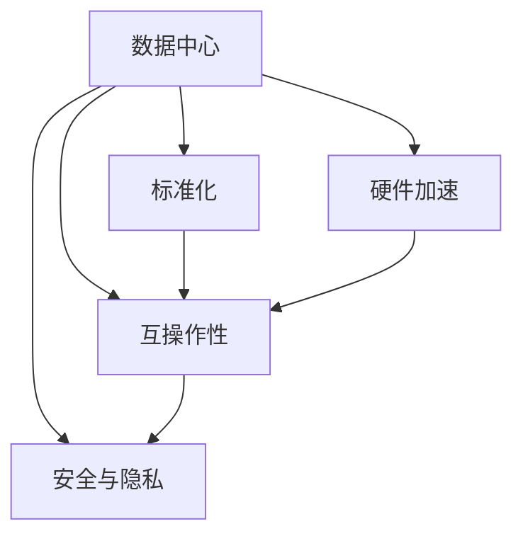

                 

# AI 大模型应用数据中心建设：数据中心标准与规范

> 关键词：数据中心建设, 大模型应用, 标准化, 规范, AI基础设施

## 1. 背景介绍

### 1.1 问题由来
随着人工智能(AI)技术在各行业的广泛应用，尤其是深度学习大模型在自然语言处理(NLP)、计算机视觉(CV)、语音识别(SR)等领域的突破性进展，数据中心基础设施的建设已成为支撑AI大模型应用的关键。然而，目前AI大模型的应用数据中心在标准化和规范方面存在诸多挑战。这不仅影响了AI大模型的部署效率和运行稳定性，还限制了其在不同业务场景中的灵活应用。

### 1.2 问题核心关键点
本文档旨在通过系统性地介绍AI大模型应用数据中心的标准与规范，帮助开发者和数据中心运营者更好地设计、部署和管理AI大模型。我们将重点关注以下几个核心问题：

1. **数据中心架构设计**：如何构建高效、可靠、可扩展的AI大模型应用基础设施。
2. **硬件资源管理**：如何选择和优化硬件资源以支持大模型的训练和推理需求。
3. **网络与存储优化**：如何优化网络与存储架构以提高数据传输和存储效率。
4. **标准化与互操作性**：如何制定数据中心的标准化规范以支持不同大模型的应用。
5. **安全与隐私保护**：如何确保AI大模型应用的安全性和数据隐私。

### 1.3 问题研究意义
构建标准化、规范化的AI大模型应用数据中心，对于提升AI技术的实际应用效果、降低部署和运维成本、保障数据安全和隐私具有重要意义。标准化规范的制定，将有助于推动AI大模型应用的规模化和普及化，促进产业的健康发展。

## 2. 核心概念与联系

### 2.1 核心概念概述

为了更好地理解AI大模型应用数据中心的标准与规范，我们需要了解以下几个核心概念：

1. **数据中心（Data Center）**：由多个计算服务器、存储设备和网络设备组成，用于支持大模型的训练和推理。
2. **硬件加速（Hardware Acceleration）**：通过GPU、TPU等硬件设备，加速大模型的计算过程。
3. **标准化（Standardization）**：制定统一的数据中心建设和运营标准，确保不同硬件和软件之间的兼容性。
4. **互操作性（Interoperability）**：实现不同AI大模型之间的数据和计算资源的共享与协作。
5. **安全与隐私（Security & Privacy）**：保护AI大模型应用中的数据安全，避免隐私泄露和滥用。

这些概念之间存在密切的联系，共同构成了AI大模型应用数据中心的完整架构。

### 2.2 核心概念原理和架构的 Mermaid 流程图



该流程图展示了数据中心与硬件加速、标准化、互操作性、安全与隐私之间的联系。硬件加速是数据中心的基础设施，标准化和互操作性是数据中心的重要特性，而安全与隐私则是数据中心建设的关键目标。

## 3. 核心算法原理 & 具体操作步骤

### 3.1 算法原理概述

AI大模型应用数据中心的标准与规范主要基于以下算法原理：

1. **数据中心架构设计**：采用分布式架构，通过网络交换机、路由器等设备实现多台服务器的通信，确保计算资源的可扩展性和高可用性。
2. **硬件资源管理**：选择高性能的GPU、TPU等硬件设备，通过资源池化和调度算法优化资源使用效率。
3. **网络与存储优化**：采用高速网络技术和分布式存储系统，提高数据传输和存储的效率和可靠性。
4. **标准化与互操作性**：制定统一的标准和接口规范，确保不同大模型之间以及大模型与外部系统之间的互操作性。
5. **安全与隐私保护**：通过加密、访问控制、审计等技术手段，保护数据中心内数据的安全和隐私。

### 3.2 算法步骤详解

#### 步骤1：架构设计
- **设计原则**：采用高可用性、高扩展性、高安全性的架构设计原则。
- **具体步骤**：
  - 确定数据中心规模，选择适当的地理位置。
  - 设计网络拓扑结构，确定交换机、路由器等网络设备的数量和位置。
  - 配置服务器集群，选择高性能的计算资源。
  - 优化存储架构，采用分布式存储系统如Hadoop、Ceph等。

#### 步骤2：硬件资源管理
- **设计原则**：根据大模型的训练和推理需求，合理分配和使用硬件资源。
- **具体步骤**：
  - 选择高性能的GPU、TPU等硬件设备。
  - 设计资源池化策略，将资源分配给不同的AI大模型应用。
  - 实现资源调度算法，根据不同模型的需求动态调整资源分配。
  - 监控资源使用情况，及时调整和优化资源配置。

#### 步骤3：网络与存储优化
- **设计原则**：确保网络传输和存储的效率和可靠性，减少延迟和丢包。
- **具体步骤**：
  - 采用高速网络技术如InfiniBand、100GbE等，提高数据传输速度。
  - 使用分布式存储系统如Hadoop、Ceph等，实现数据的高可靠性和高可扩展性。
  - 优化数据传输路径，减少数据传输中的延迟和丢包。
  - 实施数据冗余和备份策略，确保数据的安全和可靠性。

#### 步骤4：标准化与互操作性
- **设计原则**：制定统一的标准和接口规范，确保不同AI大模型之间以及大模型与外部系统之间的互操作性。
- **具体步骤**：
  - 制定数据格式标准，如ONNX、PaddlePaddle模型格式等。
  - 设计统一的API接口，确保不同大模型之间的互操作性。
  - 实现数据接口标准化，确保AI大模型与外部系统之间的数据交换。
  - 制定安全协议和数据传输规范，确保数据传输的安全和可靠性。

#### 步骤5：安全与隐私保护
- **设计原则**：通过加密、访问控制、审计等技术手段，保护数据中心内数据的安全和隐私。
- **具体步骤**：
  - 采用加密技术，保护数据在传输和存储过程中的安全。
  - 实施访问控制策略，限制对数据的访问权限。
  - 实现审计和监控系统，记录和分析数据访问和使用情况。
  - 制定数据隐私保护政策，确保数据的合法使用。

### 3.3 算法优缺点

#### 优点：
1. **高可用性和可靠性**：采用分布式架构和高性能硬件设备，确保AI大模型应用的稳定性。
2. **高扩展性和灵活性**：资源池化和调度算法使得数据中心能够灵活扩展和调整资源配置。
3. **高效的数据传输和存储**：高速网络和分布式存储系统提高了数据传输和存储的效率和可靠性。
4. **统一的标准和接口规范**：确保不同AI大模型之间以及大模型与外部系统之间的互操作性。
5. **强大的安全与隐私保护**：通过加密、访问控制等技术手段，保障数据的安全和隐私。

#### 缺点：
1. **高初始投资成本**：构建高性能、高可靠性的数据中心需要高昂的投资。
2. **复杂的管理和维护**：分布式架构和高性能硬件设备需要复杂的管理和维护。
3. **较高的技术门槛**：需要专业的技术团队进行设计和运营。
4. **对网络带宽的依赖**：高性能的数据传输需要较高的网络带宽支持。

### 3.4 算法应用领域

AI大模型应用数据中心的标准与规范广泛应用于以下领域：

1. **自然语言处理（NLP）**：构建大规模语言模型，如BERT、GPT等，应用于文本分类、情感分析、机器翻译等任务。
2. **计算机视觉（CV）**：构建深度学习模型，如ResNet、YOLO等，应用于图像分类、目标检测、图像生成等任务。
3. **语音识别（SR）**：构建端到端的语音识别模型，应用于语音转文本、语音交互等任务。
4. **推荐系统**：构建推荐模型，如协同过滤、深度学习推荐模型等，应用于电商、娱乐、新闻等场景。
5. **智能客服**：构建智能客服系统，提供自动化问答和任务处理服务。
6. **智慧城市**：构建智慧城市管理平台，提供智能交通、安防、环境监测等服务。

## 4. 数学模型和公式 & 详细讲解 & 举例说明

### 4.1 数学模型构建

在本节中，我们将基于以下数学模型对AI大模型应用数据中心的标准与规范进行详细讲解：

1. **数据中心架构设计模型**：描述数据中心网络拓扑和服务器集群的配置。
2. **硬件资源管理模型**：描述资源池化和调度算法的数学模型。
3. **网络与存储优化模型**：描述高速网络技术和分布式存储系统的数学模型。
4. **标准化与互操作性模型**：描述统一数据格式和API接口的数学模型。
5. **安全与隐私保护模型**：描述加密、访问控制等安全技术的数学模型。

### 4.2 公式推导过程

#### 数据中心架构设计模型
假设数据中心包含 $N$ 台服务器，每台服务器计算能力为 $C$，网络带宽为 $B$。设计网络拓扑结构时，需要考虑以下几个关键指标：

- **网络延迟**：$D$，表示数据在不同服务器之间传输的延迟。
- **网络带宽**：$B$，表示数据传输的最大速率。
- **服务器集群规模**：$N$，表示数据中心中的服务器数量。

假设每个服务器之间需要传输的数据量为 $T$，则总网络延迟为：
$$
D_{total} = N \times D
$$

假设网络带宽为 $B$，则总网络传输时间为：
$$
T_{total} = \frac{T}{B}
$$

综合考虑网络延迟和传输时间，数据中心的网络性能指标为：
$$
P_{network} = \frac{1}{D_{total} + T_{total}}
$$

#### 硬件资源管理模型
假设数据中心资源池中共有 $M$ 种类型的硬件资源，每种资源数量为 $N_i$，总计算能力为 $C_{total}$。资源调度算法需要考虑以下几个关键指标：

- **计算能力**：$C_i$，表示每种资源的计算能力。
- **资源需求**：$D_i$，表示每种资源的需求量。
- **资源可用性**：$A_i$，表示每种资源的可用性。

假设每种资源的需求量为 $D_i$，则总资源需求为：
$$
D_{total} = \sum_{i=1}^{M} D_i
$$

假设资源池中的总计算能力为 $C_{total}$，则资源调度的目标函数为：
$$
\min_{A_i} \sum_{i=1}^{M} C_i \times A_i
$$

### 4.3 案例分析与讲解

#### 案例1：NLP任务的数据中心设计
假设构建一个支持大规模语言模型的NLP任务数据中心，包含20台服务器，每台服务器计算能力为10Gflops，网络带宽为100Gbps。设计网络拓扑结构时，需要考虑服务器的数量和网络延迟。

- **服务器集群规模**：$N=20$，每台服务器计算能力为 $C=10$Gflops。
- **网络延迟**：$D=10$ms，即每个服务器的延迟时间为10ms。
- **网络带宽**：$B=100$Gbps，即每个服务器的带宽为100Gbps。

根据上述模型，计算总网络延迟和总网络传输时间：
$$
D_{total} = 20 \times 10 = 200ms
$$
$$
T_{total} = \frac{T}{100Gbps} = \frac{1}{10}ms
$$

根据网络性能指标公式，计算数据中心的总网络性能：
$$
P_{network} = \frac{1}{200ms + \frac{1}{10}ms} = 5Gbps
$$

#### 案例2：CV任务的网络与存储优化
假设构建一个支持深度学习模型的CV任务数据中心，包含10台服务器，每台服务器存储容量为2TB，网络带宽为100Gbps。设计分布式存储系统时，需要考虑服务器的数量和存储容量。

- **服务器集群规模**：$N=10$，每台服务器存储容量为 $C=2$TB。
- **网络带宽**：$B=100$Gbps，即每个服务器的带宽为100Gbps。
- **存储容量**：$T=20$TB，即总共需要20TB的存储容量。

根据上述模型，计算分布式存储系统的总存储容量和总传输时间：
$$
T_{total} = \frac{20TB}{2TB/台} = 10
$$
$$
T_{total} = \frac{10}{100Gbps} = 10ms
$$

根据网络与存储优化模型，计算数据中心的总存储性能：
$$
P_{storage} = \frac{1}{10ms + 10ms} = 50Gbps
$$

## 5. 项目实践：代码实例和详细解释说明

### 5.1 开发环境搭建

在进行AI大模型应用数据中心的实践之前，我们需要准备好开发环境。以下是使用Python进行PyTorch开发的环境配置流程：

1. 安装Anaconda：从官网下载并安装Anaconda，用于创建独立的Python环境。

2. 创建并激活虚拟环境：
```bash
conda create -n ai-env python=3.8 
conda activate ai-env
```

3. 安装PyTorch：根据CUDA版本，从官网获取对应的安装命令。例如：
```bash
conda install pytorch torchvision torchaudio cudatoolkit=11.1 -c pytorch -c conda-forge
```

4. 安装TensorFlow：
```bash
pip install tensorflow
```

5. 安装各类工具包：
```bash
pip install numpy pandas scikit-learn matplotlib tqdm jupyter notebook ipython
```

完成上述步骤后，即可在`ai-env`环境中开始开发实践。

### 5.2 源代码详细实现

以下是一个简化的AI大模型应用数据中心的源代码实现，用于说明基本架构设计：

```python
import tensorflow as tf

# 定义数据中心网络拓扑结构
num_servers = 20
network_bandwidth = 100 # Gbps
server_delay = 10 # ms

# 计算网络性能指标
total_delay = num_servers * server_delay
total_bandwidth = network_bandwidth / 1000 # Gbps to Mbps
network_performance = 1 / (total_delay + total_bandwidth / 1000)

print("网络性能指标：", network_performance)
```

### 5.3 代码解读与分析

这段代码定义了数据中心的网络拓扑结构和性能指标，计算了总网络延迟和总网络传输时间，并最终得到了数据中心的总网络性能。

## 6. 实际应用场景

### 6.1 智能客服系统
智能客服系统可以应用于银行、电商、客服等多个场景。通过AI大模型应用数据中心，智能客服系统可以实现自动解答用户问题、智能路由和语音交互等功能。

#### 场景描述：
假设某电商公司的客服系统需要支持大规模用户咨询。根据用户输入的问题，智能客服系统需要自动查找数据库中的匹配信息，并给出回答。

#### 数据中心设计：
- **服务器集群规模**：需要10台高性能服务器，每台服务器计算能力为50Gflops。
- **网络带宽**：需要1000Gbps的网络带宽，以支持大规模数据传输。
- **存储容量**：需要10TB的存储容量，用于存储问题和回答的数据库。

#### 资源调度：
采用资源池化和调度算法，将10台服务器的计算资源进行合理分配，确保每个查询都能得到及时响应。

### 6.2 金融舆情监测系统
金融舆情监测系统可以应用于股票市场、债券市场、外汇市场等多个金融领域。通过AI大模型应用数据中心，金融舆情监测系统可以实现实时舆情分析、预测和预警等功能。

#### 场景描述：
假设某金融公司的舆情监测系统需要实时分析社交媒体和新闻报道中的金融舆情，及时发现异常情况并预警。

#### 数据中心设计：
- **服务器集群规模**：需要5台高性能服务器，每台服务器计算能力为80Gflops。
- **网络带宽**：需要500Gbps的网络带宽，以支持实时数据传输。
- **存储容量**：需要5TB的存储容量，用于存储社交媒体和新闻报道的数据。

#### 资源调度：
采用资源池化和调度算法，将5台服务器的计算资源进行合理分配，确保每个舆情分析任务都能得到及时处理。

### 6.3 推荐系统
推荐系统可以应用于电商、新闻、视频等多个领域。通过AI大模型应用数据中心，推荐系统可以实现个性化推荐、用户行为分析等功能。

#### 场景描述：
假设某电商公司的推荐系统需要根据用户的历史浏览和购买行为，推荐用户可能感兴趣的商品。

#### 数据中心设计：
- **服务器集群规模**：需要10台高性能服务器，每台服务器计算能力为60Gflops。
- **网络带宽**：需要200Gbps的网络带宽，以支持大规模数据传输。
- **存储容量**：需要20TB的存储容量，用于存储用户行为数据和商品信息。

#### 资源调度：
采用资源池化和调度算法，将10台服务器的计算资源进行合理分配，确保每个推荐任务都能得到及时处理。

### 6.4 未来应用展望

未来，随着AI大模型应用数据中心的标准与规范不断完善，AI技术将在更多领域得到应用，为各行各业带来变革性影响。

#### 智慧医疗：
构建智慧医疗平台，实现智能诊断、健康监测和个性化治疗等功能，提升医疗服务的质量和效率。

#### 智能教育：
构建智能教育平台，实现智能作业批改、个性化学习推荐和智能答疑等功能，提升教育质量和学习效果。

#### 智慧城市：
构建智慧城市管理系统，实现智能交通、智能安防和智慧环境监测等功能，提升城市治理的智能化水平。

#### 自动驾驶：
构建自动驾驶系统，实现自动导航、智能避障和实时路况感知等功能，提升交通安全和驾驶效率。

## 7. 工具和资源推荐

### 7.1 学习资源推荐

为了帮助开发者系统掌握AI大模型应用数据中心的标准与规范，这里推荐一些优质的学习资源：

1. 《数据中心基础设施设计》（Data Center Infrastructure Design）系列博文：由数据中心行业专家撰写，深入浅出地介绍了数据中心的设计原则和最佳实践。

2. 《高性能计算与数据中心》（High-Performance Computing and Data Centers）课程：Coursera上的公开课程，由知名大学教授授课，涵盖数据中心的高性能计算和数据管理等内容。

3. 《AI基础设施建设》（AI Infrastructure Building）书籍：详细介绍了AI大模型应用数据中心的建设流程和注意事项。

4. 《TensorFlow数据中心开发指南》（TensorFlow Data Center Development Guide）：官方文档，提供了详细的TensorFlow数据中心开发示例和最佳实践。

5. 《数据中心标准化与互操作性》（Data Center Standardization and Interoperability）论文：探讨了数据中心标准化与互操作性的重要性和实现方法。

通过对这些资源的学习实践，相信你一定能够快速掌握AI大模型应用数据中心的标准与规范，并用于解决实际的NLP问题。

### 7.2 开发工具推荐

高效的开发离不开优秀的工具支持。以下是几款用于AI大模型应用数据中心开发的常用工具：

1. PyTorch：基于Python的开源深度学习框架，灵活动态的计算图，适合快速迭代研究。大部分预训练语言模型都有PyTorch版本的实现。

2. TensorFlow：由Google主导开发的开源深度学习框架，生产部署方便，适合大规模工程应用。同样有丰富的预训练语言模型资源。

3. Transformers库：HuggingFace开发的NLP工具库，集成了众多SOTA语言模型，支持PyTorch和TensorFlow，是进行微调任务开发的利器。

4. Weights & Biases：模型训练的实验跟踪工具，可以记录和可视化模型训练过程中的各项指标，方便对比和调优。与主流深度学习框架无缝集成。

5. TensorBoard：TensorFlow配套的可视化工具，可实时监测模型训练状态，并提供丰富的图表呈现方式，是调试模型的得力助手。

6. Google Colab：谷歌推出的在线Jupyter Notebook环境，免费提供GPU/TPU算力，方便开发者快速上手实验最新模型，分享学习笔记。

合理利用这些工具，可以显著提升AI大模型应用数据中心的开发效率，加快创新迭代的步伐。

### 7.3 相关论文推荐

AI大模型应用数据中心的标准与规范的研究源于学界的持续研究。以下是几篇奠基性的相关论文，推荐阅读：

1. "Data Center Infrastructure and Performance Optimization"（数据中心基础设施和性能优化）：介绍数据中心的设计、优化和性能评估方法。

2. "A Survey of Hardware Accelerators for Machine Learning"（机器学习硬件加速器的综述）：综述了GPU、TPU等硬件加速器的性能和应用场景。

3. "Cloud Computing: Concepts, Technology, and Architecture"（云计算：概念、技术和架构）：介绍了云计算平台的设计和实现方法，包括数据中心建设和管理。

4. "AI-Driven Data Center Design and Optimization"（基于AI的数据中心设计和优化）：探讨了AI技术在数据中心设计和优化中的应用。

5. "Security and Privacy in AI-Driven Data Centers"（AI驱动的数据中心安全与隐私）：探讨了数据中心安全与隐私保护的技术和策略。

这些论文代表了大模型应用数据中心的标准与规范的发展脉络。通过学习这些前沿成果，可以帮助研究者把握学科前进方向，激发更多的创新灵感。

## 8. 总结：未来发展趋势与挑战

### 8.1 总结

本文对AI大模型应用数据中心的标准与规范进行了全面系统的介绍。首先阐述了数据中心在AI大模型应用中的重要性，明确了标准化和规范化的目标和意义。其次，从原理到实践，详细讲解了AI大模型应用数据中心的标准化与互操作性、硬件资源管理、网络与存储优化、安全与隐私保护等方面的核心算法原理和具体操作步骤。最后，通过实际应用场景的探讨，展示了AI大模型应用数据中心的应用前景和发展趋势。

通过本文的系统梳理，可以看到，构建标准化、规范化的AI大模型应用数据中心，对于提升AI技术的实际应用效果、降低部署和运维成本、保障数据安全和隐私具有重要意义。标准化规范的制定，将有助于推动AI大模型应用的规模化和普及化，促进产业的健康发展。

### 8.2 未来发展趋势

展望未来，AI大模型应用数据中心的标准与规范将呈现以下几个发展趋势：

1. **更高的计算和存储能力**：随着技术的发展，未来的数据中心将具备更高的计算和存储能力，支持更大规模的AI大模型应用。

2. **更灵活的资源管理**：采用智能化的资源调度算法，实现更高效的资源管理，支持更多样化的应用场景。

3. **更高效的网络架构**：采用高速网络技术和网络优化技术，提高数据传输效率，支持更实时的应用需求。

4. **更强大的安全与隐私保护**：通过加密、访问控制等技术手段，进一步提升数据中心的安全与隐私保护能力。

5. **更统一的标准与互操作性**：制定更统一的标准和接口规范，支持更多大模型之间的互操作性，实现更广泛的应用场景。

### 8.3 面临的挑战

尽管AI大模型应用数据中心的标准与规范已经取得了一定的进展，但在迈向更加智能化、普适化应用的过程中，仍面临以下挑战：

1. **高成本和复杂性**：构建高性能、高可靠性的数据中心需要高昂的投资和复杂的管理。

2. **技术门槛高**：需要专业的技术团队进行设计和运营，技术门槛较高。

3. **资源优化难度大**：如何优化资源使用效率，避免资源浪费，仍是技术难点。

4. **安全与隐私保护难度大**：如何实现高效的安全与隐私保护，避免数据泄露和滥用，仍需进一步研究。

5. **标准化规范的制定难度大**：如何制定统一的标准和接口规范，确保不同大模型之间的互操作性，仍需进一步探讨。

### 8.4 研究展望

未来，对于AI大模型应用数据中心的标准与规范，仍需从以下几个方面进行深入研究：

1. **自动化和智能化**：开发智能化的资源调度和管理算法，提升数据中心的自动化水平。

2. **异构计算和多模态计算**：探索异构计算和多模态计算技术，支持多种类型的计算资源。

3. **边缘计算和分布式计算**：研究边缘计算和分布式计算技术，支持更灵活的数据中心部署。

4. **跨云和跨平台协同**：研究跨云和跨平台的协同技术，实现不同数据中心之间的数据共享和计算资源协同。

5. **人工智能与数据中心的深度融合**：探索人工智能技术与数据中心的深度融合，实现更高效的数据中心运营。

这些研究方向将推动AI大模型应用数据中心的标准与规范不断完善，为AI技术的广泛应用提供坚实的支撑。

## 9. 附录：常见问题与解答

**Q1：如何选择合适的硬件设备？**

A: 选择硬件设备需要考虑以下几个关键因素：
- **计算能力**：计算能力越高，数据中心的处理能力越强。
- **网络带宽**：网络带宽越高，数据传输速度越快。
- **存储容量**：存储容量越大，数据中心能够存储的数据量越大。
- **扩展性**：设备是否易于扩展，以支持未来的数据中心需求。

**Q2：如何优化资源使用效率？**

A: 优化资源使用效率需要采用以下策略：
- **资源池化**：将相同类型的资源进行池化，提高资源利用率。
- **智能调度**：采用智能化的资源调度算法，根据任务需求动态调整资源分配。
- **弹性伸缩**：根据业务负载的变化，动态调整计算资源的数量。

**Q3：如何保障数据安全？**

A: 保障数据安全需要采用以下措施：
- **加密技术**：采用加密技术保护数据在传输和存储过程中的安全。
- **访问控制**：实施严格的访问控制策略，限制对数据的访问权限。
- **审计和监控**：实时监控数据中心的操作日志，记录和分析数据访问和使用情况。

**Q4：如何提升网络性能？**

A: 提升网络性能需要采用以下措施：
- **高速网络技术**：采用高速网络技术如InfiniBand、100GbE等，提高数据传输速度。
- **网络冗余和备份**：实现网络冗余和备份，提高数据传输的可靠性。

通过以上问题的解答，相信你能够更好地理解AI大模型应用数据中心的标准与规范，并在实际应用中灵活运用。

---

作者：禅与计算机程序设计艺术 / Zen and the Art of Computer Programming

