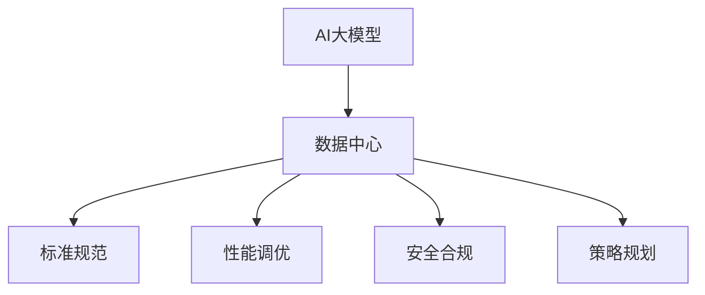

                 

# AI 大模型应用数据中心建设：数据中心标准与规范

> 关键词：AI大模型,数据中心,标准规范,部署运维,优化加速,安全合规,性能调优,策略规划

## 1. 背景介绍

### 1.1 问题由来
随着人工智能(AI)技术的飞速发展，特别是深度学习大模型在自然语言处理(NLP)、计算机视觉(CV)、语音识别等领域取得了显著的突破。大模型通常具有数亿甚至数十亿参数，需要强大的计算资源进行训练和推理，数据中心的建设成为了AI应用落地的重要前提。然而，现有的数据中心架构往往难以满足大模型的需求，性能、成本、安全等方面都存在诸多挑战。

### 1.2 问题核心关键点
- **性能瓶颈**：大模型需要海量计算资源，现有的数据中心基础设施可能无法支持。
- **成本控制**：大模型的训练和推理成本高昂，需要合理的资源分配和优化策略。
- **安全合规**：大模型涉及大量敏感数据，数据中心的物理和网络安全需要高标准。
- **运维复杂度**：大模型的高复杂性带来运维的巨大挑战，需要精细化的管理手段。
- **性能调优**：大模型的训练和推理效率需要优化，以最大化计算资源利用率。

### 1.3 问题研究意义
构建高效率、低成本、安全可靠的大模型数据中心，对于推动AI技术的广泛应用和产业化具有重要意义：

1. **降低应用开发成本**：合理配置数据中心资源，加速模型训练和推理，减少人力物力投入。
2. **提升模型效果**：通过性能调优和资源优化，提升模型在大规模数据上的训练和推理效率，加速模型迭代。
3. **保障数据安全**：确保大模型训练和推理过程中数据的安全性和隐私性，防止数据泄露和滥用。
4. **提高运维效率**：通过标准化的运维流程和工具，减少人力投入，提升运维效率。
5. **增强业务价值**：构建高性能、低成本、安全可靠的数据中心，为AI应用提供坚实的技术保障，提升企业竞争力。

## 2. 核心概念与联系

### 2.1 核心概念概述

为更好地理解AI大模型数据中心的建设标准与规范，本节将介绍几个关键概念：

- **AI大模型**：指通过大规模数据预训练获得高性能的语言模型，如BERT、GPT系列、ViT等。
- **数据中心**：指由计算、存储、网络、安全等基础设施组成的物理实体，是AI应用的硬件基础。
- **标准规范**：指对数据中心建设和运维的一系列技术和管理规范，确保其高效、安全、合规。
- **性能调优**：指通过算法和架构优化，提升AI模型在数据中心上的训练和推理效率。
- **安全合规**：指确保数据中心在物理和网络层面的安全防护措施，符合法律法规要求。
- **策略规划**：指对数据中心资源配置和优化策略的长期规划和设计。

这些核心概念之间的逻辑关系可以通过以下Mermaid流程图来展示：



这个流程图展示了大模型应用与数据中心的逻辑关系：

1. 大模型通过预训练获得基础能力。
2. 数据中心提供基础设施，支持大模型的训练和推理。
3. 标准规范指导数据中心的建设和管理，确保其高效、安全、合规。
4. 性能调优提升大模型在数据中心上的运行效率。
5. 安全合规确保数据中心的安全防护措施符合法律法规要求。
6. 策略规划设计长期资源配置和优化策略，优化数据中心运营。

## 3. 核心算法原理 & 具体操作步骤
### 3.1 算法原理概述

AI大模型在数据中心的训练和推理过程，本质上是高性能计算与复杂算法结合的工程实践。其核心思想是：通过优化算法和架构设计，最大化计算资源的利用效率，同时保证模型的性能和稳定性。

### 3.2 算法步骤详解

基于高性能计算和深度学习算法，AI大模型在数据中心的训练和推理可以分为以下关键步骤：

**Step 1: 数据准备与预处理**
- 收集并清洗数据，进行数据增强、标准化等预处理，确保数据质量。
- 对数据进行分批次处理，准备GPU/TPU等硬件设备需要的数据格式。

**Step 2: 选择合适的硬件设备**
- 根据模型需求，选择适合的计算资源，如GPU、TPU、FPGA等。
- 考虑设备间的互连带宽和延迟，优化数据传输效率。

**Step 3: 设计高效的算法框架**
- 选择合适的深度学习框架，如TensorFlow、PyTorch、MXNet等。
- 优化模型的网络结构、损失函数、优化器等算法参数。

**Step 4: 配置数据中心环境**
- 搭建高性能计算集群，优化网络拓扑和带宽配置。
- 部署安全防护措施，确保数据中心物理和网络安全。

**Step 5: 进行模型训练和推理**
- 将数据分批次输入模型，前向传播计算损失函数。
- 反向传播更新模型参数，通过优化算法迭代训练模型。
- 进行模型推理，得到计算结果。

**Step 6: 性能调优和监控**
- 使用性能调优工具，分析训练和推理过程中的瓶颈。
- 根据分析结果，调整模型参数、算法框架或硬件设备。
- 实时监控数据中心性能指标，确保系统稳定运行。

### 3.3 算法优缺点

AI大模型数据中心的高性能计算与深度学习算法，具有以下优点：

- **高效训练**：通过优化算法和架构设计，大模型能够在短时间内完成训练，缩短迭代周期。
- **高精度**：深度学习算法能够处理复杂非线性问题，提升模型预测精度。
- **广泛应用**：大模型适用于NLP、CV、语音识别等众多AI应用领域，具有广泛的应用前景。

同时，该算法也存在一定的局限性：

- **资源消耗大**：大模型需要大量计算资源，可能带来高昂的成本。
- **数据依赖性强**：大模型的性能依赖于高质量的数据，数据准备和清洗工作复杂。
- **模型复杂度高**：大模型的网络结构复杂，训练和推理过程需要精心设计。

尽管存在这些局限性，但就目前而言，基于高性能计算和深度学习算法的AI大模型应用数据中心，仍然是大规模AI应用不可或缺的基础设施。

### 3.4 算法应用领域

AI大模型数据中心在诸多领域都得到了广泛应用，包括但不限于：

- **自然语言处理(NLP)**：如文本分类、命名实体识别、机器翻译等。
- **计算机视觉(CV)**：如图像识别、目标检测、图像分割等。
- **语音识别**：如语音转文本、情感分析、说话人识别等。
- **推荐系统**：如商品推荐、新闻推荐、广告推荐等。
- **医疗健康**：如疾病诊断、基因组学分析、药物研发等。
- **金融科技**：如信用评分、欺诈检测、风险管理等。
- **智能制造**：如质量检测、故障诊断、优化生产流程等。

这些领域的大模型应用，不仅推动了人工智能技术的产业化进程，也促进了相关行业的数字化转型升级。

## 4. 数学模型和公式 & 详细讲解  
### 4.1 数学模型构建

本节将使用数学语言对AI大模型在数据中心上的训练和推理过程进行更加严格的刻画。

记AI大模型为 $M_{\theta}:\mathcal{X} \rightarrow \mathcal{Y}$，其中 $\mathcal{X}$ 为输入空间，$\mathcal{Y}$ 为输出空间，$\theta \in \mathbb{R}^d$ 为模型参数。

定义损失函数 $\ell$ 为：

$$
\ell(\mathbf{x}, \mathbf{y}; M_{\theta}) = \frac{1}{N}\sum_{i=1}^N \ell_i(\mathbf{x}_i, M_{\theta}(\mathbf{x}_i))
$$

其中 $\ell_i$ 为单个样本的损失函数，$\mathbf{x}_i$ 为输入数据，$M_{\theta}(\mathbf{x}_i)$ 为模型输出，$y_i$ 为真实标签。

大模型在数据中心上的训练过程，通过优化算法最小化损失函数，更新模型参数：

$$
\theta \leftarrow \theta - \eta \nabla_{\theta} \ell(\mathbf{x}, \mathbf{y}; M_{\theta})
$$

其中 $\eta$ 为学习率。

### 4.2 公式推导过程

以下我们以一个简单的二分类问题为例，推导损失函数和梯度计算公式。

假设模型 $M_{\theta}$ 在输入 $\mathbf{x}$ 上的输出为 $\hat{y}=M_{\theta}(\mathbf{x}) \in [0,1]$，表示样本属于正类的概率。真实标签 $y \in \{0,1\}$。则二分类交叉熵损失函数定义为：

$$
\ell(\mathbf{x}, \mathbf{y}; M_{\theta}) = -[y\log \hat{y} + (1-y)\log(1-\hat{y})]
$$

将其代入损失函数，得：

$$
\ell(\mathbf{x}, \mathbf{y}; M_{\theta}) = -\frac{1}{N}\sum_{i=1}^N [y_i\log M_{\theta}(\mathbf{x}_i)+(1-y_i)\log(1-M_{\theta}(\mathbf{x}_i))]
$$

根据链式法则，损失函数对参数 $\theta_k$ 的梯度为：

$$
\frac{\partial \ell}{\partial \theta_k} = -\frac{1}{N}\sum_{i=1}^N \left(\frac{y_i}{M_{\theta}(\mathbf{x}_i)}-\frac{1-y_i}{1-M_{\theta}(\mathbf{x}_i)}\right) \frac{\partial M_{\theta}(\mathbf{x}_i)}{\partial \theta_k}
$$

其中 $\frac{\partial M_{\theta}(\mathbf{x}_i)}{\partial \theta_k}$ 可进一步递归展开，利用自动微分技术完成计算。

### 4.3 案例分析与讲解

**案例分析：医疗影像分类**

在医疗影像分类任务中，大模型 $M_{\theta}$ 接收CT、MRI等医学影像作为输入，输出对应疾病的分类结果。假设模型在图像 $\mathbf{x}_i$ 上的输出为 $\hat{y}=M_{\theta}(\mathbf{x}_i) \in [0,1]$，其中 $\hat{y} \in [0,1]$ 表示模型预测该影像属于该疾病的概率。

定义损失函数 $\ell_i(\mathbf{x}_i, M_{\theta}(\mathbf{x}_i)) = -[y_i\log \hat{y} + (1-y_i)\log(1-\hat{y})]$，则该任务的总损失函数为：

$$
\ell(\mathbf{x}, \mathbf{y}; M_{\theta}) = -\frac{1}{N}\sum_{i=1}^N [y_i\log M_{\theta}(\mathbf{x}_i)+(1-y_i)\log(1-M_{\theta}(\mathbf{x}_i))]
$$

在得到损失函数的梯度后，即可带入参数更新公式，完成模型的迭代优化。

## 5. 项目实践：代码实例和详细解释说明
### 5.1 开发环境搭建

在进行AI大模型数据中心的应用实践前，我们需要准备好开发环境。以下是使用Python进行TensorFlow开发的环境配置流程：

1. 安装Anaconda：从官网下载并安装Anaconda，用于创建独立的Python环境。

2. 创建并激活虚拟环境：
```bash
conda create -n tf-env python=3.8 
conda activate tf-env
```

3. 安装TensorFlow：根据CUDA版本，从官网获取对应的安装命令。例如：
```bash
conda install tensorflow -c tensorflow -c conda-forge
```

4. 安装各类工具包：
```bash
pip install numpy pandas scikit-learn matplotlib tqdm jupyter notebook ipython
```

完成上述步骤后，即可在`tf-env`环境中开始数据中心的应用实践。

### 5.2 源代码详细实现

下面我们以一个简单的医疗影像分类任务为例，给出使用TensorFlow对大模型进行训练和推理的PyTorch代码实现。

首先，定义医疗影像分类任务的数据处理函数：

```python
import tensorflow as tf
from tensorflow.keras.preprocessing.image import ImageDataGenerator

def load_and_preprocess_data(path, batch_size):
    datagen = ImageDataGenerator(
        rescale=1./255,
        shear_range=0.2,
        zoom_range=0.2,
        horizontal_flip=True,
        validation_split=0.2)
    
    train_data = datagen.flow_from_directory(
        path,
        target_size=(224, 224),
        batch_size=batch_size,
        class_mode='binary',
        subset='training')
    val_data = datagen.flow_from_directory(
        path,
        target_size=(224, 224),
        batch_size=batch_size,
        class_mode='binary',
        subset='validation')
    
    return train_data, val_data
```

然后，定义模型和优化器：

```python
from tensorflow.keras import models, layers

model = models.Sequential([
    layers.Conv2D(32, (3, 3), activation='relu', input_shape=(224, 224, 3)),
    layers.MaxPooling2D((2, 2)),
    layers.Conv2D(64, (3, 3), activation='relu'),
    layers.MaxPooling2D((2, 2)),
    layers.Flatten(),
    layers.Dense(64, activation='relu'),
    layers.Dense(1, activation='sigmoid')
])

optimizer = tf.keras.optimizers.Adam(learning_rate=0.001)
```

接着，定义训练和评估函数：

```python
def compile_model(model, optimizer, loss, metrics):
    model.compile(optimizer=optimizer, loss=loss, metrics=metrics)

def train_model(model, train_data, val_data, epochs, batch_size):
    model.fit(
        train_data,
        validation_data=val_data,
        epochs=epochs,
        batch_size=batch_size)
    
def evaluate_model(model, val_data, batch_size):
    model.evaluate(
        val_data,
        batch_size=batch_size)
```

最后，启动训练流程并在验证集上评估：

```python
epochs = 10
batch_size = 32

train_data, val_data = load_and_preprocess_data('path/to/data', batch_size)

compile_model(model, optimizer, 'binary_crossentropy', 'accuracy')
train_model(model, train_data, val_data, epochs, batch_size)
evaluate_model(model, val_data, batch_size)
```

以上就是使用TensorFlow对医疗影像分类任务进行训练和推理的完整代码实现。可以看到，得益于TensorFlow的强大封装，我们可以用相对简洁的代码完成大模型的训练和推理。

### 5.3 代码解读与分析

让我们再详细解读一下关键代码的实现细节：

**load_and_preprocess_data函数**：
- `ImageDataGenerator`：用于数据增强和预处理，包括随机裁剪、缩放、翻转等操作，以及数据标准化。
- `flow_from_directory`：从文件夹中读取图片数据，自动进行分类。
- `target_size`：指定输入图片的大小。
- `class_mode`：指定输出为二分类。

**compile_model函数**：
- `compile`：配置模型，指定优化器、损失函数、评估指标。

**train_model函数**：
- `fit`：启动模型训练，指定训练数据、验证数据、训练轮数、批次大小等参数。

**evaluate_model函数**：
- `evaluate`：在验证集上评估模型性能。

**训练流程**：
- 定义训练轮数和批次大小。
- 加载数据集，进行数据增强和预处理。
- 配置模型和优化器。
- 启动训练流程，并在验证集上评估模型性能。

可以看到，TensorFlow的强大功能和封装，使得大模型的训练和推理变得简单易行。开发者可以集中精力在业务逻辑的实现上，而不必过多关注底层的计算图操作。

当然，工业级的系统实现还需考虑更多因素，如模型的保存和部署、超参数的自动搜索、更灵活的任务适配层等。但核心的训练和推理流程基本与此类似。

## 6. 实际应用场景
### 6.1 智能医疗诊断

基于AI大模型数据中心的智能医疗诊断系统，可以显著提升医生的诊断效率和准确性。系统接收患者的医学影像、病历等数据，通过大模型进行自动诊断和推荐，辅助医生进行决策。

在技术实现上，可以收集大量医疗影像数据和专家标注，将影像和诊断结果作为监督数据，在此基础上对预训练大模型进行微调。微调后的模型能够学习到影像特征和诊断逻辑，快速进行影像分类和诊断结果预测。对于复杂病例，还可以接入医学专家库进行进一步分析，生成综合诊断报告。

### 6.2 自动驾驶

自动驾驶系统需要实时处理大量传感器数据，并做出精确的决策和控制。大模型在数据中心的训练和推理，可以显著提升自动驾驶的智能程度，使其能够应对复杂的道路环境。

在技术实现上，可以收集大量驾驶数据和事故案例，将数据输入大模型进行训练，生成高精度的感知和决策模型。训练后的模型可以部署到车辆上，实现实时感知和路径规划，辅助驾驶员进行驾驶决策。

### 6.3 金融风险管理

金融风险管理依赖于对海量数据的实时分析和预测。AI大模型在数据中心的训练和推理，可以显著提升金融风险管理的精准度和效率。

在技术实现上，可以收集市场交易数据、新闻报道、社交媒体等信息，将其输入大模型进行训练，生成市场分析和风险预测模型。训练后的模型可以实时处理新的市场数据，预测市场变化趋势，辅助投资者进行风险管理。

### 6.4 未来应用展望

随着AI大模型数据中心技术的不断发展，AI应用场景将更加广泛，带来更多的创新应用。

在智慧城市管理中，AI大模型可以用于交通监控、环境监测、应急管理等，提升城市治理的智能化水平。

在智能制造中，AI大模型可以用于质量检测、故障诊断、设备优化等，推动制造业的数字化转型。

在教育领域，AI大模型可以用于智能辅导、自动评估、学习推荐等，提升教育公平性和教学效果。

此外，在农业、物流、能源等多个领域，AI大模型也具备广阔的应用前景。未来，随着技术的不断进步，AI大模型将深入各行各业，推动产业数字化升级。

## 7. 工具和资源推荐
### 7.1 学习资源推荐

为了帮助开发者系统掌握AI大模型数据中心的建设标准与规范，这里推荐一些优质的学习资源：

1. 《深度学习与TensorFlow》系列博文：由TensorFlow官方博客团队撰写，介绍了深度学习的基本概念和TensorFlow的使用方法。

2. 《TensorFlow实战》书籍：由Google TensorFlow团队编写，全面介绍了TensorFlow的使用技巧和最佳实践。

3. 《TensorFlow for Deep Learning》书籍：由Google TensorFlow团队编写，适合深度学习初学者，从入门到实战。

4. CS231n《卷积神经网络》课程：斯坦福大学开设的深度学习课程，介绍了卷积神经网络的基本原理和TensorFlow实现。

5. 《Deep Learning Specialization》系列课程：由Andrew Ng教授讲授，涵盖深度学习的基础理论和TensorFlow的应用实践。

通过对这些资源的学习实践，相信你一定能够快速掌握AI大模型数据中心的建设标准与规范，并用于解决实际的AI问题。
###  7.2 开发工具推荐

高效的开发离不开优秀的工具支持。以下是几款用于AI大模型数据中心开发的工具：

1. TensorFlow：由Google主导开发的深度学习框架，支持分布式计算和大规模数据处理，适合大模型训练和推理。

2. PyTorch：Facebook主导的深度学习框架，支持动态计算图，适合灵活的模型设计和调试。

3. MXNet：由亚马逊开发的深度学习框架，支持多语言、多平台、大规模分布式训练，适合跨领域AI应用。

4. Jupyter Notebook：免费的交互式开发环境，支持Python、R等多种语言，适合原型开发和模型调试。

5. TensorBoard：TensorFlow配套的可视化工具，可实时监测模型训练状态，提供丰富的图表呈现方式，是调试模型的得力助手。

6. Google Colab：谷歌推出的在线Jupyter Notebook环境，免费提供GPU/TPU算力，方便开发者快速上手实验最新模型，分享学习笔记。

合理利用这些工具，可以显著提升AI大模型数据中心开发的效率，加快创新迭代的步伐。

### 7.3 相关论文推荐

AI大模型数据中心技术的发展源于学界的持续研究。以下是几篇奠基性的相关论文，推荐阅读：

1. Deep Image Patch Matching for Efficient Learning of Real-Time Image Classification Models：提出了一种基于数据匹配的图像分类方法，显著提升了模型的训练效率。

2. Towards Optimal Large-Scale Learning for Large-Scale Image Classification：提出了大规模数据学习的新算法，显著提升了模型在大规模数据上的训练速度和精度。

3. Improving Deep Neural Network Coding Efficiency through Architecture Search：提出了一种基于架构搜索的方法，通过优化网络结构，显著减少了模型的参数量和计算量。

4. Optimizing Distributed Deep Neural Networks using Quantum Annealing：提出了一种量子优化方法，通过量子退火算法优化分布式深度神经网络，提升了模型的训练效率。

5. Dynamic Neural Network Framework for Large-Scale Machine Learning：提出了一种动态神经网络框架，适用于大规模机器学习任务，支持灵活的模型设计和优化。

这些论文代表了大模型数据中心技术的发展脉络。通过学习这些前沿成果，可以帮助研究者把握学科前进方向，激发更多的创新灵感。

## 8. 总结：未来发展趋势与挑战

### 8.1 总结

本文对AI大模型在数据中心的训练和推理过程进行了全面系统的介绍。首先阐述了AI大模型和数据中心的背景和意义，明确了大模型在AI应用中的重要地位。其次，从原理到实践，详细讲解了深度学习算法在大模型数据中心上的应用流程，给出了完整的代码实现和详细解读。同时，本文还广泛探讨了AI大模型数据中心在智能医疗、自动驾驶、金融风险管理等领域的实际应用场景，展示了数据中心技术的广泛前景。此外，本文精选了数据中心技术的各类学习资源，力求为读者提供全方位的技术指引。

通过本文的系统梳理，可以看到，AI大模型数据中心技术正在成为AI应用落地的重要基础设施，极大地拓展了AI技术的应用边界，催生了更多的落地场景。未来，随着预训练语言模型和微调方法的持续演进，AI大模型数据中心必将在构建人机协同的智能时代中扮演越来越重要的角色。

### 8.2 未来发展趋势

展望未来，AI大模型数据中心技术将呈现以下几个发展趋势：

1. **资源优化**：随着算力成本的下降和数据规模的扩张，大模型的参数量还将持续增长。未来的数据中心需要进一步优化硬件配置和算法设计，以最大化计算资源的利用效率。

2. **异构融合**：大模型往往需要多种计算资源的协同工作，未来的数据中心需要支持CPU、GPU、TPU等异构硬件的融合，以提升系统的整体性能。

3. **分布式训练**：大模型的训练往往需要海量数据和计算资源，未来的数据中心需要支持分布式训练和推理，以应对大规模计算任务。

4. **智能调优**：未来的数据中心需要支持自动化的超参数优化、模型压缩、模型剪枝等技术，以提高模型的训练和推理效率。

5. **安全和隐私**：数据中心的物理和网络安全需要高标准，未来的数据中心需要引入区块链、联邦学习等技术，保护数据安全和隐私。

6. **智能运维**：未来的数据中心需要支持智能运维工具，通过自动化和智能化的手段，提高运维效率，降低人工成本。

7. **云平台整合**：未来的数据中心需要支持云平台的整合和优化，以提供更加灵活、高效、安全的AI服务。

以上趋势凸显了AI大模型数据中心技术的广阔前景。这些方向的探索发展，必将进一步提升AI大模型的训练和推理效率，为AI应用提供坚实的技术保障。

### 8.3 面临的挑战

尽管AI大模型数据中心技术已经取得了瞩目成就，但在迈向更加智能化、普适化应用的过程中，它仍面临着诸多挑战：

1. **资源瓶颈**：大模型需要大量计算资源，可能带来高昂的成本。如何优化资源配置，降低计算成本，仍需持续探索。

2. **数据依赖性强**：大模型的性能依赖于高质量的数据，数据准备和清洗工作复杂。如何降低数据获取成本，提升数据质量，仍需深入研究。

3. **模型复杂度高**：大模型的网络结构复杂，训练和推理过程需要精心设计。如何设计高效、鲁棒的模型架构，提升模型性能，仍需不断优化。

4. **安全性和隐私保护**：大模型涉及大量敏感数据，数据中心的物理和网络安全需要高标准。如何加强安全防护措施，保护数据隐私，仍需持续加强。

5. **性能调优**：大模型的训练和推理效率需要优化，以最大化计算资源利用率。如何优化算法和架构设计，提高模型性能，仍需深入研究。

6. **智能运维**：大模型的训练和推理过程复杂，需要精细化的运维手段。如何实现智能化的运维管理和监控，提高系统稳定性，仍需深入探索。

7. **云平台集成**：如何将大模型数据中心与云平台无缝集成，提供灵活、高效、安全的AI服务，仍需深入研究。

这些挑战需要在技术、管理、运营等多方面进行综合考虑和解决，才能真正实现AI大模型数据中心的高效、安全、可靠的建设。

### 8.4 研究展望

面对AI大模型数据中心所面临的种种挑战，未来的研究需要在以下几个方面寻求新的突破：

1. **多模态融合**：将文本、图像、语音等多模态数据进行融合，提升模型的多模态处理能力，推动AI技术的全面发展。

2. **迁移学习**：将已有模型的知识和经验迁移到新任务上，提升模型的泛化能力和迁移能力，降低数据获取成本。

3. **自监督学习**：通过自监督学习的方法，利用无标签数据进行模型训练，提升模型的自适应能力和鲁棒性。

4. **量子计算**：利用量子计算的强大计算能力，加速大模型的训练和推理，提升模型的效率和精度。

5. **联邦学习**：通过联邦学习的方法，保护数据隐私的同时，利用分布式数据进行模型训练，提升模型的安全性和隐私保护。

6. **分布式优化**：通过分布式优化的方法，提升大模型训练和推理的效率，支持大规模数据处理和计算。

7. **边缘计算**：通过边缘计算的方法，将计算任务分散到边缘设备上进行，降低网络延迟和计算成本，提升系统的实时性和可扩展性。

这些研究方向将引领AI大模型数据中心技术的进一步发展，推动AI技术的广泛应用和产业化进程。唯有不断创新、勇于探索，才能真正实现AI技术的智能化、普适化和安全性，为人类社会的数字化转型升级贡献力量。

## 9. 附录：常见问题与解答

**Q1：AI大模型在数据中心训练和推理时，如何优化性能？**

A: AI大模型在数据中心的训练和推理过程中，性能优化是关键。以下是一些常见的优化方法：

1. **数据增强**：通过数据增强技术，如随机裁剪、缩放、翻转等，增加训练数据的丰富度，提升模型的泛化能力。

2. **模型剪枝**：通过剪枝技术，移除模型中不必要的参数，减少计算量，提升模型的推理速度。

3. **量化优化**：将浮点模型转为定点模型，压缩存储空间，提高计算效率。

4. **分布式训练**：通过分布式训练技术，将计算任务分散到多个设备上，提升训练速度。

5. **模型压缩**：通过模型压缩技术，如知识蒸馏、权重共享等，减少模型参数量，提升模型推理速度。

6. **混合精度训练**：使用混合精度训练技术，降低计算精度，提高计算效率。

7. **异构融合**：通过异构硬件的融合，提升系统的整体性能，如CPU-GPU-Tensor Core的协同工作。

8. **自动调优**：通过自动调优工具，如Hyperopt、Optuna等，搜索最优超参数组合，提升模型性能。

9. **网络优化**：通过网络优化技术，如深度可分网络、卷积蒸馏等，提升模型的推理效率。

这些优化方法可以结合使用，根据具体任务和数据特点进行灵活选择，以实现最佳的性能提升。

**Q2：AI大模型数据中心的资源配置和优化策略有哪些？**

A: AI大模型数据中心的资源配置和优化策略，包括以下几个方面：

1. **计算资源配置**：根据模型需求，合理配置CPU、GPU、TPU等计算资源，确保计算资源充足。

2. **存储资源配置**：配置足够的存储空间，支持大规模数据集的处理和存储。

3. **网络资源配置**：优化网络拓扑和带宽配置，确保数据传输的效率和稳定性。

4. **资源管理工具**：使用资源管理工具，如Kubernetes、Docker Swarm等，实现资源的动态分配和调度。

5. **分布式训练**：通过分布式训练技术，将计算任务分散到多个设备上，提升训练速度和效率。

6. **混合精度训练**：使用混合精度训练技术，降低计算精度，提高计算效率。

7. **智能调优**：使用智能调优工具，如Hyperopt、Optuna等，搜索最优超参数组合，提升模型性能。

8. **模型压缩**：通过模型压缩技术，如知识蒸馏、权重共享等，减少模型参数量，提升模型推理速度。

9. **模型剪枝**：通过剪枝技术，移除模型中不必要的参数，减少计算量，提升模型的推理速度。

10. **量化优化**：将浮点模型转为定点模型，压缩存储空间，提高计算效率。

11. **异构融合**：通过异构硬件的融合，提升系统的整体性能，如CPU-GPU-Tensor Core的协同工作。

通过合理的资源配置和优化策略，可以显著提升AI大模型数据中心的性能，降低计算成本，提高系统的稳定性。

**Q3：如何构建安全的AI大模型数据中心？**

A: 构建安全的AI大模型数据中心，需要考虑以下几个方面：

1. **物理安全**：确保数据中心的安全防护措施，包括围墙、门禁、监控等，防止未授权人员进入。

2. **网络安全**：使用防火墙、入侵检测等技术，保护数据中心的网络安全，防止外部攻击。

3. **数据加密**：对敏感数据进行加密处理，防止数据泄露和滥用。

4. **身份认证**：对用户和设备进行身份认证，确保系统的安全性和隐私保护。

5. **访问控制**：限制对敏感数据的访问权限，确保只有授权人员可以访问数据。

6. **审计记录**：记录数据中心的访问日志和操作记录，便于审计和追溯。

7. **灾难恢复**：建立灾难恢复机制，确保数据中心的稳定性和可靠性，防止数据丢失。

8. **安全培训**：对运维人员进行安全培训，提高安全意识，防止内部泄露和误操作。

通过合理的安全措施和技术手段，可以构建安全的AI大模型数据中心，确保数据和模型的安全性和隐私保护。

**Q4：AI大模型数据中心如何实现高效运维？**

A: 实现高效的AI大模型数据中心运维，需要考虑以下几个方面：

1. **自动化工具**：使用自动化运维工具，如Ansible、SaltStack等，实现自动化部署、配置、监控等操作。

2. **实时监控**：使用实时监控工具，如Nagios、Zabbix等，实时监测系统性能和资源状态，及时发现和解决问题。

3. **异常检测**：使用异常检测工具，如Prometheus、Grafana等，监测系统异常行为，及时预警和处理。

4. **日志管理**：使用日志管理工具，如ELK Stack、Graylog等，集中管理日志数据，便于审计和排查问题。

5. **故障诊断**：使用故障诊断工具，如Kibana、ELK Stack等，分析系统故障原因，快速定位和解决问题。

6. **智能运维**：使用智能运维工具，如IBM Watson、Google AI等，实现自动化运维和智能决策。

7. **灾备机制**：建立灾备机制，确保数据中心的稳定性和可靠性，防止数据丢失。

8. **备份和恢复**：定期备份数据和系统配置，确保数据和系统的可恢复性。

通过合理的运维工具和策略，可以显著提升AI大模型数据中心的运维效率，减少人工投入，提高系统的稳定性和可靠性。

**Q5：如何设计高效的AI大模型数据中心？**

A: 设计高效的AI大模型数据中心，需要考虑以下几个方面：

1. **硬件选择**：根据模型需求，选择适合的计算资源，如CPU、GPU、TPU等。

2. **网络配置**：优化网络拓扑和带宽配置，确保数据传输的效率和稳定性。

3. **存储设计**：配置足够的存储空间，支持大规模数据集的处理和存储。

4. **能源管理**：优化能源管理，降低能耗，提高系统的效率。

5. **散热设计**：合理设计散热系统，确保系统的稳定性和可靠性。

6. **布线设计**：优化布线设计，降低网络延迟，提升系统的响应速度。

7. **安全防护**：加强物理和网络安全防护措施，防止数据泄露和系统攻击。

8. **备份和恢复**：建立备份和恢复机制，确保数据和系统的可恢复性。

9. **自动化运维**：引入自动化运维工具，提高运维效率，降低人工成本。

10. **性能调优**：通过性能调优工具，优化模型的训练和推理效率。

通过合理的设计和配置，可以构建高效的AI大模型数据中心，满足模型训练和推理的需求，提高系统的性能和稳定性。

---

作者：禅与计算机程序设计艺术 / Zen and the Art of Computer Programming

