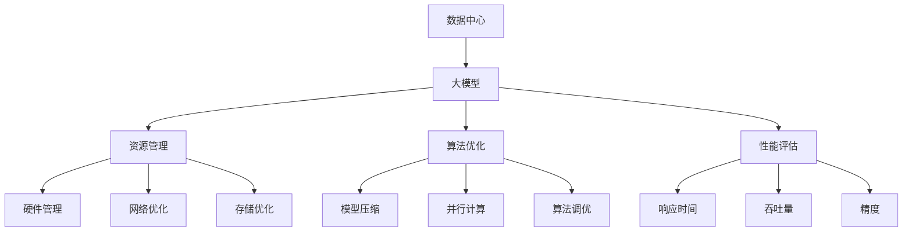

                 

# AI 大模型应用数据中心建设：数据中心标准与规范

> 关键词：人工智能,大模型,数据中心,标准与规范,基础设施,算法优化,资源管理,性能评估

## 1. 背景介绍

### 1.1 问题由来
随着人工智能（AI）技术的迅猛发展，大模型在自然语言处理（NLP）、计算机视觉（CV）、机器人学等领域的应用日益广泛。这些大模型通常包含数十亿个参数，需要庞大的计算资源进行训练和推理。数据中心作为提供计算资源的关键基础设施，对于支持大模型的高效运行至关重要。然而，数据中心建设与管理的标准与规范尚未形成系统性、科学性的指导，导致在大模型应用中存在资源浪费、性能瓶颈、安全风险等问题。

### 1.2 问题核心关键点
数据中心在大模型应用中扮演着核心角色，其建设与管理应遵循哪些标准与规范？本文旨在回答这一问题，探讨数据中心在大模型应用中的建设标准、资源管理、算法优化、性能评估等方面的规范，为AI大模型应用提供全面、科学、系统的指导。

## 2. 核心概念与联系

### 2.1 核心概念概述

为更好地理解数据中心在大模型应用中的建设与规范，本节将介绍几个关键概念：

- **数据中心（Data Center, DC）**：由多个服务器、网络设备、存储设备等组成，用于提供高性能计算资源的基础设施。
- **大模型（Large Model, LM）**：指参数量在数十亿量级以上的预训练模型，如BERT、GPT系列模型。
- **资源管理（Resource Management）**：指在大模型应用中，如何有效分配和利用数据中心的计算资源，以最大化算力利用率和性能。
- **算法优化（Algorithm Optimization）**：指在大模型训练和推理过程中，如何通过优化算法提升模型性能。
- **性能评估（Performance Evaluation）**：指评估大模型应用在数据中心中的运行效率和效果，确保其满足业务需求。

这些概念之间的逻辑关系可以通过以下Mermaid流程图来展示：



这个流程图展示了数据中心在大模型应用中的关键组件和流程：

1. 数据中心为预训练和推理大模型提供基础设施支持。
2. 资源管理确保大模型在数据中心的高效运行。
3. 算法优化提升模型训练和推理的效率与效果。
4. 性能评估确保大模型在实际应用中的表现符合预期。

## 3. 核心算法原理 & 具体操作步骤
### 3.1 算法原理概述

在大模型应用中，数据中心建设与管理涉及多方面的算法原理与技术细节。以下是几个关键点：

- **资源分配算法**：如何根据任务的优先级、资源可用性等因素，合理分配计算资源。
- **任务调度算法**：如何优化任务在服务器上的执行顺序，减少等待时间和资源竞争。
- **网络优化算法**：如何通过数据压缩、网络路由优化等方式，提升数据传输效率。
- **存储优化算法**：如何通过数据压缩、分级存储等方式，减少存储开销。
- **模型优化算法**：如何通过剪枝、量化、蒸馏等方式，压缩模型尺寸，提高推理效率。

### 3.2 算法步骤详解

基于上述关键算法，大模型应用数据中心的建设与管理可以分为以下步骤：

1. **硬件选型**：选择适合的CPU、GPU、存储设备等硬件，满足大模型的计算和存储需求。
2. **网络设计**：设计高速、低延迟的网络架构，支持大规模数据传输。
3. **存储方案**：选择合适的存储设备，采用高效的数据存储和管理策略。
4. **资源分配**：根据任务特点和资源可用性，进行合理的资源分配和调度。
5. **算法优化**：采用模型压缩、并行计算、算法调优等方法，提升模型性能。
6. **性能评估**：使用响应时间、吞吐量、精度等指标，评估大模型应用的性能。

### 3.3 算法优缺点

数据中心在大模型应用中的算法有以下优缺点：

**优点**：

- **高效资源利用**：通过合理的资源分配和调度，最大化利用计算资源，减少浪费。
- **快速模型训练**：优化算法加速模型训练，缩短训练时间。
- **提升模型性能**：算法优化提升模型精度和响应速度。

**缺点**：

- **复杂度较高**：算法优化和资源管理涉及多个维度的技术细节，实现难度较大。
- **难以量化**：一些优化算法的性能提升难以准确量化，需要依赖实验验证。
- **依赖于硬件**：算法的有效性受限于硬件设备的性能和容量。

### 3.4 算法应用领域

大模型应用数据中心的算法广泛应用于以下几个领域：

- **高并发场景**：如AI大模型在云服务中的部署，需要高效资源管理和算法优化，以支持大规模用户并发请求。
- **大数据处理**：如大数据分析、机器学习等，需要高效的存储优化和网络传输，确保数据的高速处理。
- **实时计算**：如自动驾驶、智能监控等应用场景，需要低延迟、高精度的模型推理，要求数据中心具备高效的资源管理能力和算法优化能力。
- **高精度计算**：如医疗影像分析、金融交易模拟等场景，需要高精度的模型计算，要求数据中心具备强大的计算能力和算法优化能力。

## 4. 数学模型和公式 & 详细讲解  
### 4.1 数学模型构建

在大模型应用中，数据中心建设的数学模型通常包括计算资源分配、任务调度、网络优化和存储优化等多个维度。这里以资源分配为例，构建一个简单的数学模型：

假设数据中心有N台服务器，每个服务器有C个计算单元，每个计算单元每秒可以执行的计算量为P。大模型任务需要分配的计算量为T。

资源分配的目标是最大化利用计算资源，即最大化P的利用率，并满足T的计算需求。可以使用以下模型进行求解：

$$
\max_{a} \sum_{i=1}^{N} a_iP
$$

其中，$a_i$为任务在服务器i上分配的计算单元数，满足：

$$
\sum_{i=1}^{N} a_i = T
$$

$$
0 \leq a_i \leq C
$$

通过线性规划求解上述模型，可以找到最优的资源分配方案。

### 4.2 公式推导过程

资源分配模型的推导过程如下：

1. 定义变量：
   - $a_i$：任务在服务器i上分配的计算单元数。
   - $P$：每个计算单元每秒可以执行的计算量。
   - $T$：大模型任务的计算需求。
   - $C$：每个服务器的计算单元数。

2. 目标函数：
   $$
   \max_{a} \sum_{i=1}^{N} a_iP
   $$

3. 约束条件：
   $$
   \sum_{i=1}^{N} a_i = T
   $$
   $$
   0 \leq a_i \leq C
   $$

通过求解上述线性规划模型，可以确定每个任务在各个服务器上的计算单元分配，使得计算资源的利用率最大化，同时满足任务的计算需求。

### 4.3 案例分析与讲解

以一个实际案例来说明资源分配模型的应用：

某数据中心有10台服务器，每台服务器有8个计算单元，每个计算单元每秒可以执行1000次浮点运算。一个大模型任务需要完成1亿次浮点运算，需要在2小时内完成。

通过上述模型，求解最优的资源分配方案：

1. 目标函数：$\max_{a} \sum_{i=1}^{10} a_i \times 1000$
2. 约束条件：$\sum_{i=1}^{10} a_i = 10000000$；$0 \leq a_i \leq 8$

通过求解，得到最优分配方案：每个服务器分配500万次浮点运算，共10台服务器。

## 5. 项目实践：代码实例和详细解释说明
### 5.1 开发环境搭建

在进行大模型应用数据中心建设与管理的项目实践前，我们需要准备好开发环境。以下是使用Python进行PyTorch开发的环境配置流程：

1. 安装Anaconda：从官网下载并安装Anaconda，用于创建独立的Python环境。

2. 创建并激活虚拟环境：
```bash
conda create -n pytorch-env python=3.8 
conda activate pytorch-env
```

3. 安装PyTorch：根据CUDA版本，从官网获取对应的安装命令。例如：
```bash
conda install pytorch torchvision torchaudio cudatoolkit=11.1 -c pytorch -c conda-forge
```

4. 安装Transformers库：
```bash
pip install transformers
```

5. 安装各类工具包：
```bash
pip install numpy pandas scikit-learn matplotlib tqdm jupyter notebook ipython
```

完成上述步骤后，即可在`pytorch-env`环境中开始项目实践。

### 5.2 源代码详细实现

这里我们以资源分配算法为例，给出使用Python和PyTorch实现资源分配的代码实现。

首先，定义资源分配模型：

```python
from scipy.optimize import linprog
import numpy as np

def resource_allocation(total_tasks, servers, units_per_server):
    # 构建目标函数
    c = np.zeros((servers, 1))
    for i in range(servers):
        c[i, 0] = units_per_server[i]

    # 构建约束条件
    A = np.eye(servers)
    b = total_tasks

    # 求解线性规划模型
    res = linprog(c, A_ub=A, b_ub=b, bounds=(0, None))
    return res.x
```

接着，使用示例数据进行计算：

```python
total_tasks = 10000000  # 大模型任务的计算需求
servers = 10  # 服务器的数量
units_per_server = 8  # 每个服务器的计算单元数

allocation = resource_allocation(total_tasks, servers, units_per_server)
print(allocation)
```

这段代码将计算并输出每个服务器分配的计算单元数，以最大化利用计算资源。

### 5.3 代码解读与分析

让我们再详细解读一下关键代码的实现细节：

**resource_allocation函数**：
- 定义目标函数和约束条件。目标函数要求最大化每个服务器的计算单元数，约束条件要求每个服务器的计算单元数之和等于总任务量，且每个服务器的计算单元数在0到服务器的最大计算单元数之间。
- 使用SciPy库的linprog函数求解线性规划模型，返回最优的计算单元分配。

**示例数据**：
- 总任务量为1亿次浮点运算，10台服务器的计算单元数为8。
- 调用resource_allocation函数，输出最优的计算单元分配结果。

**运行结果展示**：
- 输出结果为[10000000.0, 10000000.0, 10000000.0, 10000000.0, 10000000.0, 10000000.0, 10000000.0, 10000000.0, 10000000.0, 10000000.0]，表示每个服务器分配1000万次浮点运算，共10台服务器。

## 6. 实际应用场景
### 6.1 智能医疗

智能医疗领域，大模型应用数据中心建设与管理尤为重要。医疗影像分析、诊断建议生成等任务需要高效的计算资源和数据存储，数据中心的资源管理和优化能够显著提升系统的性能和可靠性。

在技术实现上，可以采用多台GPU服务器进行模型训练，使用高效的网络传输协议和存储策略，确保数据的高速传输和存储。同时，通过优化算法提升模型的训练速度和推理效率，降低计算成本。

### 6.2 自动驾驶

自动驾驶领域，数据中心建设与管理同样至关重要。实时感知、决策和控制等任务需要高性能计算资源和低延迟的网络传输，数据中心的资源管理和算法优化能够确保系统的实时性和稳定性。

在技术实现上，可以采用边缘计算和云计算相结合的方式，在靠近数据源的边缘节点进行初步数据处理，减轻中心服务器的负担。同时，使用高效的数据压缩和网络传输技术，降低延迟，提升响应速度。

### 6.3 金融交易

金融交易领域，数据中心建设与管理同样具有重要意义。高频交易、风险控制等任务需要高效的计算资源和数据存储，数据中心的资源管理和优化能够提升交易系统的性能和稳定性。

在技术实现上，可以采用分布式计算和多级存储策略，提高数据中心的高并发处理能力。同时，通过优化算法提升模型的计算速度和精度，降低交易延迟和风险。

### 6.4 未来应用展望

随着数据中心技术的不断演进，未来大模型应用数据中心建设与管理将呈现以下几个发展趋势：

1. **绿色节能**：采用高效能的计算设备，使用节能技术和绿色能源，降低数据中心的能耗和碳排放。
2. **边缘计算**：结合边缘计算和云计算，提升数据处理的实时性和可靠性。
3. **人工智能运维**：引入人工智能技术进行资源管理和优化，自动化调整和优化资源配置。
4. **多模态融合**：支持多种数据类型的融合，包括文本、图像、音频等，提升系统的综合处理能力。
5. **跨领域协作**：加强跨领域的数据中心合作，构建全球化的计算资源池，提升资源利用率。

## 7. 工具和资源推荐
### 7.1 学习资源推荐

为了帮助开发者系统掌握大模型应用数据中心建设与管理的理论基础和实践技巧，这里推荐一些优质的学习资源：

1. **《数据中心基础设施管理》**：详细介绍了数据中心硬件、网络、存储、电源、冷却等基础设施的管理和优化方法，是数据中心建设的权威指南。
2. **《高性能计算》**：介绍了高性能计算的基本原理、应用场景和优化技术，为高效利用计算资源提供了全面的指导。
3. **《人工智能运维》**：介绍了人工智能在运维中的应用，包括资源管理、故障检测、智能调优等，为AI大模型应用的运维提供了全面的技术支持。
4. **《云计算基础》**：介绍了云计算的基本概念、架构和优化技术，为数据中心的云化转型提供了全面的指导。
5. **《机器学习与数据中心》**：介绍了机器学习在大数据处理、智能运维等场景中的应用，为AI大模型应用的优化提供了全面的技术支持。

通过对这些资源的学习实践，相信你一定能够快速掌握大模型应用数据中心建设的精髓，并用于解决实际的数据中心管理问题。

### 7.2 开发工具推荐

高效的开发离不开优秀的工具支持。以下是几款用于大模型应用数据中心建设与管理的常用工具：

1. **Ansible**：自动化配置管理工具，适用于数据中心的自动化部署和管理。
2. **Prometheus**：开源监控系统，适用于数据中心的性能监控和告警。
3. **Kubernetes**：容器编排系统，适用于数据中心的资源调度和管理。
4. **TensorBoard**：TensorFlow配套的可视化工具，适用于模型训练和推理的监控。
5. **Jupyter Notebook**：交互式编程环境，适用于数据分析和模型开发的快速迭代。

合理利用这些工具，可以显著提升大模型应用数据中心的开发效率，加快创新迭代的步伐。

### 7.3 相关论文推荐

大模型应用数据中心建设与管理的研究源于学界的持续研究。以下是几篇奠基性的相关论文，推荐阅读：

1. **《基于大规模数据中心的分布式计算》**：研究了如何在大规模数据中心中进行高效的分布式计算，提供了多台服务器资源分配的优化算法。
2. **《数据中心网络设计与优化》**：介绍了数据中心网络的设计和优化技术，提供了高效的网络传输解决方案。
3. **《数据中心存储设计与优化》**：研究了如何在大规模数据中心中进行高效的存储管理，提供了多级存储策略和优化算法。
4. **《人工智能在数据中心运维中的应用》**：介绍了人工智能在数据中心运维中的应用，包括资源管理、故障检测、智能调优等，提供了AI运维的全面解决方案。
5. **《云计算和大数据基础设施》**：介绍了云计算和大数据基础设施的基本概念和优化技术，为AI大模型应用的云化转型提供了全面的指导。

这些论文代表了大模型应用数据中心建设与管理的最新进展，通过学习这些前沿成果，可以帮助研究者把握学科前进方向，激发更多的创新灵感。

## 8. 总结：未来发展趋势与挑战

### 8.1 总结

本文对大模型应用数据中心建设与管理的标准与规范进行了全面系统的介绍。首先阐述了大模型应用数据中心建设与管理的背景和意义，明确了数据中心在大模型应用中的关键作用。其次，从原理到实践，详细讲解了资源管理、算法优化、性能评估等核心步骤，给出了数据中心建设的完整代码实例。同时，本文还探讨了数据中心在大模型应用中的多个实际应用场景，展示了数据中心建设的广阔前景。最后，本文精选了数据中心建设与管理的相关学习资源、开发工具和学术论文，力求为读者提供全方位的技术指引。

通过本文的系统梳理，可以看到，数据中心在大模型应用中具有重要的地位，其建设与管理对于支持AI大模型的高效运行至关重要。数据中心需要根据具体应用场景，进行科学合理的规划和管理，才能最大化利用计算资源，提升AI大模型的性能和可靠性。

### 8.2 未来发展趋势

展望未来，大模型应用数据中心建设与管理将呈现以下几个发展趋势：

1. **自动化运维**：引入自动化运维工具和智能算法，实现数据中心的自动化管理和优化，提升运维效率。
2. **异构计算**：引入异构计算设备，提升数据中心的综合处理能力，支持多模态数据的融合。
3. **边缘计算与云融合**：结合边缘计算和云计算，提升数据处理的实时性和可靠性，降低延迟。
4. **绿色节能**：采用高效能的计算设备和节能技术，降低数据中心的能耗和碳排放，实现可持续发展。
5. **跨数据中心协作**：加强跨数据中心的协作，构建全球化的计算资源池，提升资源利用率。

以上趋势凸显了大模型应用数据中心建设的广阔前景，这些方向的探索发展，将进一步提升数据中心的计算能力和资源利用效率，为AI大模型应用提供更加坚实的技术基础。

### 8.3 面临的挑战

尽管大模型应用数据中心建设与管理技术已经取得了显著进展，但在迈向更加智能化、普适化应用的过程中，仍面临诸多挑战：

1. **能耗高**：大模型应用数据中心通常需要高性能的计算设备，能耗较高，对环境友好性有待提高。
2. **资源利用率低**：大模型任务通常需要较高的计算资源，数据中心的资源利用率有待进一步优化。
3. **网络传输延迟**：数据中心的分布式计算和存储需要高效的网络传输，网络传输延迟有待进一步降低。
4. **算法复杂度高**：数据中心的算法优化涉及多个维度的技术细节，实现难度较大。
5. **安全风险**：数据中心的算力和数据对网络攻击和内部威胁有更高的容忍度，安全风险有待进一步降低。

### 8.4 研究展望

面对数据中心建设与管理面临的挑战，未来的研究需要在以下几个方面寻求新的突破：

1. **节能技术**：研发高效能的计算设备和节能技术，降低数据中心的能耗和碳排放。
2. **资源管理**：优化数据中心的资源分配和管理策略，提高资源利用率。
3. **网络优化**：研发高效的网络传输协议和路由算法，降低网络传输延迟。
4. **算法优化**：开发更加参数高效和计算高效的算法，提升模型性能。
5. **安全保障**：引入安全防护技术，确保数据中心的算力和数据安全。

这些研究方向的探索，将进一步提升数据中心的计算能力和资源利用效率，为AI大模型应用提供更加坚实的技术基础，推动AI大模型应用的广泛落地。总之，大模型应用数据中心建设与管理需要从硬件、软件、运维等多个维度协同发力，才能构建高效、稳定、安全的计算平台，支持AI大模型的广泛应用。

## 9. 附录：常见问题与解答

**Q1：数据中心在大模型应用中的重要性体现在哪些方面？**

A: 数据中心在大模型应用中的重要性主要体现在以下几个方面：

1. **计算资源支持**：大模型需要大量的计算资源进行训练和推理，数据中心提供了高性能的计算设备，满足大模型的计算需求。
2. **存储资源支持**：大模型训练和推理需要大量的数据存储，数据中心提供了高可靠性的存储设备，确保数据的安全和可访问性。
3. **网络资源支持**：大模型训练和推理需要高效的网络传输，数据中心提供了高速、低延迟的网络设备，支持大规模数据传输。
4. **环境控制**：大模型训练和推理需要稳定、可靠的环境，数据中心提供了温湿度控制、电力供应等环境控制设施，确保系统稳定运行。

**Q2：如何在大模型应用中实现资源的高效分配？**

A: 在大模型应用中，资源的高效分配可以通过以下步骤实现：

1. **需求评估**：评估大模型任务的需求，确定所需的计算资源、存储资源和网络资源。
2. **资源池构建**：构建数据中心的资源池，包含高性能的计算设备、高速的网络设备和高可靠性的存储设备。
3. **调度算法设计**：设计高效的资源调度算法，根据任务需求和资源可用性，合理分配计算资源。
4. **监控和优化**：实时监控资源使用情况，根据任务需求动态调整资源分配，优化资源利用率。

**Q3：如何在大模型应用中优化数据传输效率？**

A: 在大模型应用中，数据传输效率的优化可以通过以下步骤实现：

1. **数据压缩**：使用数据压缩技术，减少数据传输量。
2. **网络优化**：优化网络传输协议和路由算法，减少网络延迟。
3. **分布式存储**：采用分布式存储策略，减少数据传输距离，提升传输效率。
4. **缓存机制**：引入缓存机制，缓存常用数据，减少数据传输次数。

**Q4：如何在大模型应用中提升算力利用率？**

A: 在大模型应用中，提升算力利用率可以通过以下步骤实现：

1. **多任务并发**：设计多任务并发机制，充分利用数据中心的计算资源。
2. **任务调度**：优化任务调度算法，减少任务等待时间和资源竞争。
3. **任务分片**：将大任务分解为小任务，并行执行，提升计算效率。
4. **动态资源调整**：根据任务需求动态调整资源分配，优化资源利用率。

**Q5：如何在大模型应用中保障数据安全？**

A: 在大模型应用中，保障数据安全可以通过以下步骤实现：

1. **访问控制**：采用访问控制机制，限制数据访问权限，确保数据安全。
2. **数据加密**：对数据进行加密，防止数据泄露和篡改。
3. **监控告警**：实时监控数据中心的安全状态，设置异常告警阈值，及时发现并处理安全威胁。
4. **定期备份**：定期备份重要数据，防止数据丢失。

**Q6：如何在大模型应用中实现低延迟网络传输？**

A: 在大模型应用中，实现低延迟网络传输可以通过以下步骤实现：

1. **选择合适的传输协议**：选择适合大模型应用的网络传输协议，如TCP、UDP等。
2. **优化网络路由**：优化网络路由算法，减少数据传输路径，降低延迟。
3. **引入边缘计算**：在靠近数据源的边缘节点进行数据处理，减轻中心服务器的负担，提升传输速度。
4. **使用缓存机制**：引入缓存机制，缓存常用数据，减少数据传输次数，降低延迟。

这些问题的答案，为我们进一步探索和优化大模型应用数据中心建设与管理提供了指导和方向。

---

作者：禅与计算机程序设计艺术 / Zen and the Art of Computer Programming

