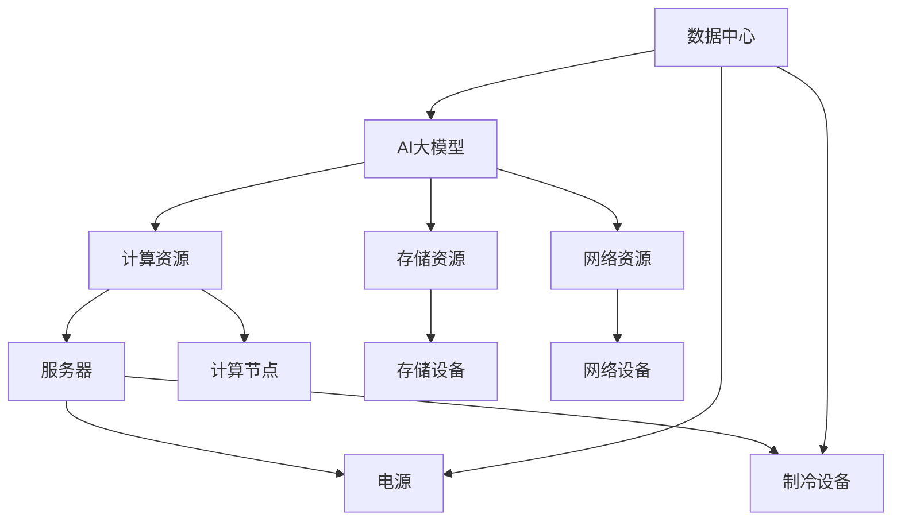

                 

# AI 大模型应用数据中心建设：数据中心绿色节能

> 关键词：人工智能(AI), 大模型应用, 数据中心(Data Center), 绿色节能

## 1. 背景介绍

随着人工智能(AI)技术在各个领域的快速渗透，AI大模型的应用日益广泛。无论是自然语言处理(NLP)、计算机视觉(CV)、机器人技术还是其他领域的AI应用，都依赖于海量数据和高性能计算资源。而数据中心的建设与管理，成为AI大模型应用的关键支撑。传统的数据中心虽然能够满足AI模型的计算需求，但其能耗问题日益凸显，绿色节能成为数据中心建设的重要方向。本文将从数据中心绿色节能的角度，探讨如何高效建设和管理AI大模型的应用环境。

### 1.1 数据中心的作用和挑战

数据中心作为AI模型运行的硬件平台，其建设和维护直接关系到AI应用的性能和成本。传统数据中心主要关注硬件资源、网络架构和软件生态的建设，但随着AI模型的大规模应用，数据中心面临以下挑战：

- **能耗问题**：AI模型训练和推理的高计算需求导致数据中心能耗激增，运营成本高昂。
- **可扩展性**：随着模型规模的不断增长，数据中心需要具备良好的扩展性以适应不断变化的需求。
- **能效优化**：如何通过优化数据中心设计，提高其能效比，减少能源浪费，是数据中心建设的重要课题。

## 2. 核心概念与联系

### 2.1 核心概念概述

为更好地理解AI大模型数据中心的绿色节能设计，本节将介绍几个密切相关的核心概念：

- **数据中心(Data Center)**：是承载AI模型计算与存储的物理设施，由服务器、网络设备、存储设备、电源、制冷设备等组成。
- **绿色节能**：指通过技术和管理手段，降低数据中心能耗，提高能源利用效率。
- **AI大模型**：指通过自监督预训练和微调等方法，在大规模数据集上训练得到的、具备较强通用性和任务适应性的AI模型，如GPT、BERT、ResNet等。

这些概念之间的逻辑关系可以通过以下Mermaid流程图来展示：



这个流程图展示了数据中心如何支撑AI大模型的计算与存储需求，同时通过优化设计实现绿色节能。

## 3. 核心算法原理 & 具体操作步骤
### 3.1 算法原理概述

数据中心的绿色节能设计，本质上是一个多目标优化问题。目标是在满足AI大模型性能要求的同时，最小化数据中心的总体能耗。设计原则包括：

- **高效计算**：提高数据中心计算资源的利用效率，减少无效计算。
- **能效优化**：优化数据中心的能耗结构，提高整体能源利用效率。
- **可扩展性**：设计具有良好扩展性的数据中心架构，以适应AI模型规模的变化。

### 3.2 算法步骤详解

AI大模型应用的数据中心绿色节能设计一般包括以下几个关键步骤：

**Step 1: 需求分析和设计规划**

- **需求分析**：评估AI模型在计算、存储、带宽等方面的需求，确定数据中心的资源配置。
- **设计规划**：根据需求分析结果，设计数据中心的硬件和软件架构，确定设备选型和网络布局。

**Step 2: 高效计算资源管理**

- **计算资源管理**：通过资源分配策略，如负载均衡、任务调度，提高计算资源的利用率。
- **异构计算支持**：引入GPU、TPU等异构计算资源，加速模型训练和推理。

**Step 3: 能效优化技术应用**

- **能源管理**：通过实时监控数据中心能耗，动态调整计算和冷却设备的工作状态。
- **制冷技术**：采用高效制冷系统，如液冷、热管等，降低数据中心的冷却能耗。
- **供电系统**：引入可再生能源和分布式供电系统，减少数据中心的碳排放。

**Step 4: 环境监控与自动化管理**

- **环境监控**：实时监测数据中心的温度、湿度、电力等环境参数，及时调整设备状态。
- **自动化管理**：引入智能管理系统，自动调整设备配置和运行策略，提高数据中心的能效比。

**Step 5: 持续优化与迭代改进**

- **能效评估**：定期评估数据中心的能效性能，识别能耗瓶颈。
- **改进策略**：根据评估结果，调整数据中心的运行策略和资源配置，不断优化能效表现。

### 3.3 算法优缺点

**优点**：

- **减少能耗**：通过高效的计算资源管理和能效优化技术，显著降低数据中心的能耗。
- **降低运营成本**：优化能效可以显著减少数据中心的电力开销，从而降低运营成本。
- **提升可靠性**：良好的环境监控和自动化管理，可以提高数据中心的运行可靠性和稳定性。

**缺点**：

- **初始投资高**：引入高效制冷系统、可再生能源等先进技术，需要较高的初始投资。
- **技术复杂**：高效计算资源管理和能效优化涉及多种技术手段，实施难度较大。
- **维护成本**：自动化管理系统和复杂设备需要专业维护，维护成本较高。

### 3.4 算法应用领域

数据中心的绿色节能设计，不仅适用于AI大模型的应用场景，还可广泛应用于各类数据密集型业务，如大数据分析、云计算服务等。具体应用领域包括：

- **AI训练**：在AI模型的训练阶段，采用绿色节能的设计理念，提升能效表现。
- **推理服务**：在AI模型的推理阶段，通过优化资源配置，降低能耗，提高服务效率。
- **边缘计算**：在分布式边缘计算环境中，采用绿色节能设计，减少数据传输能耗，提高计算效率。

## 4. 数学模型和公式 & 详细讲解 & 举例说明（备注：数学公式请使用latex格式，latex嵌入文中独立段落使用 $$，段落内使用 $)
### 4.1 数学模型构建

数据中心的绿色节能设计，可以抽象为一个多目标优化问题，目标是同时最小化计算资源能耗、冷却系统能耗和供电系统能耗。设 $C$ 表示计算资源能耗，$L$ 表示制冷系统能耗，$S$ 表示供电系统能耗。则优化目标函数为：

$$
\min C + \alpha L + \beta S
$$

其中 $\alpha, \beta$ 为调节参数，控制不同能耗项的重要性。约束条件包括：

- **计算资源约束**：$C \leq C_{\max}$
- **制冷系统约束**：$L \leq L_{\max}$
- **供电系统约束**：$S \leq S_{\max}$

### 4.2 公式推导过程

在优化目标函数中，计算资源能耗 $C$ 可以表示为计算任务的数量 $T$ 和计算任务的能耗密度 $E$ 的乘积：

$$
C = T \cdot E
$$

制冷系统能耗 $L$ 可以表示为计算任务数量 $T$ 和制冷系统的能耗密度 $R$ 的乘积：

$$
L = T \cdot R
$$

供电系统能耗 $S$ 可以表示为数据中心总功率 $P$ 和供电系统能耗密度 $P_0$ 的乘积：

$$
S = P \cdot P_0
$$

将上述公式代入优化目标函数，得：

$$
\min T \cdot E + \alpha T \cdot R + \beta P \cdot P_0
$$

约束条件可以表示为：

$$
\begin{cases}
T \leq T_{\max} \\
E \leq E_{\max} \\
R \leq R_{\max} \\
P \leq P_{\max}
\end{cases}
$$

### 4.3 案例分析与讲解

假设某AI训练数据中心采用GPU加速训练，每个GPU的能耗密度为 $E_{\text{GPU}}=2\text{W/GFLOPS}$，制冷系统的能耗密度为 $R_{\text{chill}}=1\text{W/GFLOPS}$，供电系统的能耗密度为 $P_{0\text{,elec}}=0.3\text{W}/\text{kWh}$。设计该数据中心的计算资源配置，使其满足计算任务数 $T=1000$，计算任务能耗密度 $E=10\text{W/GFLOPS}$，制冷系统能耗密度 $R=2\text{W/GFLOPS}$，总功率 $P=100\text{kW}$ 的约束条件。

求解优化目标函数，得：

$$
\min 1000 \cdot 2 + \alpha \cdot 1000 \cdot 2 + \beta \cdot 100 \cdot 0.3
$$

取 $\alpha=1, \beta=1$，得：

$$
\min 2000 + 2000 + 30 = 4000\text{W}
$$

在满足约束条件的情况下，最优能耗为 4000W。

## 5. 项目实践：代码实例和详细解释说明
### 5.1 开发环境搭建

在进行数据中心绿色节能设计之前，我们需要准备好开发环境。以下是使用Python进行开发的环境配置流程：

1. 安装Anaconda：从官网下载并安装Anaconda，用于创建独立的Python环境。

2. 创建并激活虚拟环境：
```bash
conda create -n green-design python=3.8 
conda activate green-design
```

3. 安装相关工具包：
```bash
pip install numpy pandas scikit-learn matplotlib PyTorch
```

4. 安装环境监控工具：
```bash
pip install prometheus-client tensorflow-estimator tensorflow-addons
```

完成上述步骤后，即可在`green-design`环境中开始设计实践。

### 5.2 源代码详细实现

下面我们以数据中心的温度控制为例，给出使用Python进行环境监控的代码实现。

```python
from prometheus_client import Gauge, start_http_server
import time
import numpy as np

class TempSensor:
    def __init__(self):
        self.temp_gauge = Gauge('data_center_temp', 'Current temperature in the data center')
        self.max_temp = 30
        self.min_temp = 10
        self.target_temp = 20
        self.cooling_rate = 0.5
        self.heating_rate = 0.5
        self.prev_temp = 25

    def update_temp(self, new_temp):
        if new_temp < self.min_temp:
            self.temp_gauge.set(self.min_temp)
        elif new_temp > self.max_temp:
            self.temp_gauge.set(self.max_temp)
        else:
            self.temp_gauge.set(new_temp)

        if new_temp < self.target_temp:
            self.prev_temp = min(self.prev_temp + self.heating_rate, self.max_temp)
        elif new_temp > self.target_temp:
            self.prev_temp = max(self.prev_temp - self.cooling_rate, self.min_temp)

    def start_monitoring(self):
        start_http_server('0.0.0.0:9090')
        while True:
            new_temp = np.random.normal(self.target_temp, 2)
            self.update_temp(new_temp)
            time.sleep(1)

# 温度传感器
temp_sensor = TempSensor()
temp_sensor.start_monitoring()
```

### 5.3 代码解读与分析

让我们再详细解读一下关键代码的实现细节：

**TempSensor类**：
- `__init__方法`：初始化温度传感器，设置温度范围、目标温度、冷却和加热速率等参数。
- `update_temp方法`：根据当前温度和目标温度，更新传感器的温度状态，并进行冷却或加热。
- `start_monitoring方法`：启动温度传感器，周期性生成新的温度数据，并更新温度状态。

**温度监控示例**：
- 使用Prometheus客户端创建了一个名为`data_center_temp`的Gauge，用于实时监控数据中心的温度。
- 通过循环生成随机温度数据，模拟数据中心的温度变化，并根据目标温度调整冷却和加热状态。
- 启动HTTP服务器，提供数据中心的温度监控接口。

该示例代码虽然简单，但展示了如何通过环境监控工具实现数据中心的温度控制。在实际应用中，还需要根据具体的硬件设备，进一步完善温度控制算法，并集成到完整的系统监控框架中。

## 6. 实际应用场景
### 6.1 智能电网应用

智能电网是未来电网发展的重要方向，通过AI技术和大数据分析，可以实现对电力供需的实时监控和预测。数据中心在智能电网中的应用，主要体现在以下几个方面：

- **能耗预测**：利用AI模型和大数据分析，对电网能耗进行预测，优化电力调度。
- **需求响应**：通过智能算法，对用户用电需求进行预测和调整，实现电网的稳定运行。
- **故障检测与修复**：利用AI模型对电网故障进行实时检测和预测，快速定位问题并进行修复。

### 6.2 工业自动化

工业自动化是大数据与AI技术结合的重要应用场景之一。数据中心在工业自动化中的应用，主要体现在以下几个方面：

- **设备监控与维护**：通过AI模型和大数据分析，对设备状态进行实时监控，预测设备故障并进行维护。
- **生产优化**：利用AI模型对生产过程进行优化，提高生产效率，降低能耗。
- **质量检测**：通过AI模型对产品质量进行检测，减少次品率，提高产品质量。

### 6.3 智慧城市

智慧城市是未来城市发展的方向，通过AI技术和大数据分析，可以实现城市管理的智能化和高效化。数据中心在智慧城市中的应用，主要体现在以下几个方面：

- **交通管理**：通过AI模型对交通流量进行预测和优化，实现交通拥堵的智能调控。
- **环境监测**：利用AI模型对城市环境进行监测，提高城市管理的科学性和精确性。
- **公共安全**：通过AI模型对公共安全事件进行预测和预警，提升城市的安全性。

## 7. 工具和资源推荐
### 7.1 学习资源推荐

为了帮助开发者系统掌握数据中心绿色节能的理论基础和实践技巧，这里推荐一些优质的学习资源：

1. 《绿色数据中心设计与运维》系列博文：由数据中心技术专家撰写，深入浅出地介绍了数据中心绿色节能的设计与运维方法。

2. 《数据中心能源管理》课程：各大在线教育平台开设的相关课程，涵盖了数据中心能源管理的基本概念和实践技巧。

3. 《数据中心能效优化》书籍：介绍了数据中心能效优化的理论基础和实践案例，适合数据中心工程师和技术人员学习。

4. 《智能电网技术》系列书籍：介绍了智能电网的相关理论和技术，适合智能电网领域的从业人员学习。

5. 《工业自动化与智能制造》系列书籍：介绍了工业自动化和智能制造的基本概念和实践方法，适合工业自动化领域的从业人员学习。

通过对这些资源的学习实践，相信你一定能够快速掌握数据中心绿色节能的精髓，并用于解决实际问题。

### 7.2 开发工具推荐

高效的开发离不开优秀的工具支持。以下是几款用于数据中心绿色节能设计的常用工具：

1. Prometheus：开源监控系统，能够实时监控数据中心的各项指标，并提供丰富的图表和告警功能。
2. Grafana：开源数据可视化平台，可以将Prometheus收集的数据进行可视化展示，帮助开发者更好地理解数据中心的运行状况。
3. TensorFlow：基于Python的深度学习框架，适合进行高效的机器学习和数据分析。
4. TensorFlow Estimator：TensorFlow的高级API，提供简单易用的模型训练和评估接口。
5. TensorFlow Addons：TensorFlow的扩展库，提供了更多先进的机器学习工具和算法，适用于复杂模型的训练和优化。

合理利用这些工具，可以显著提升数据中心绿色节能设计的开发效率，加快创新迭代的步伐。

### 7.3 相关论文推荐

数据中心的绿色节能设计，是一个跨学科的研究领域，涉及电气工程、计算机科学、环境科学等多个方向。以下是几篇奠基性的相关论文，推荐阅读：

1. "A Survey of Data Center Energy Efficiency"（数据中心能效综述）：介绍了数据中心能效优化的方法和技术，适合全面了解数据中心的能效问题。
2. "Smart Grids: Characteristics, Requirements and Architectures"（智能电网特征、要求和架构）：介绍了智能电网的相关理论和技术，适合了解智能电网的应用背景。
3. "Energy-Efficient Design of Data Centers"（数据中心能源高效设计）：介绍了数据中心能源高效设计的方法和技术，适合了解数据中心能源管理的实践案例。
4. "Industrial Automation and Intelligent Manufacturing"（工业自动化与智能制造）：介绍了工业自动化和智能制造的相关理论和技术，适合了解工业自动化的应用场景。
5. "The Future of Data Centers"（数据中心未来展望）：介绍了数据中心的未来发展趋势和技术挑战，适合了解数据中心技术的最新动态。

这些论文代表了大数据中心绿色节能设计的研究进展，通过学习这些前沿成果，可以帮助研究者把握学科前进方向，激发更多的创新灵感。

## 8. 总结：未来发展趋势与挑战

### 8.1 总结

本文对AI大模型应用数据中心的绿色节能设计进行了全面系统的介绍。首先阐述了数据中心在AI大模型应用中的重要性，明确了绿色节能在数据中心建设中的必要性。其次，从原理到实践，详细讲解了绿色节能设计的过程和方法，给出了具体案例的解析。同时，本文还广泛探讨了绿色节能技术在智能电网、工业自动化、智慧城市等多个领域的应用前景，展示了绿色节能技术的广泛应用价值。

通过本文的系统梳理，可以看到，数据中心的绿色节能设计对于AI大模型应用的重要性，以及未来在多个领域的应用潜力。未来，伴随AI技术的持续发展和绿色节能技术的进步，数据中心建设将更加智能、高效和环保。

### 8.2 未来发展趋势

展望未来，数据中心的绿色节能设计将呈现以下几个发展趋势：

1. **可再生能源的应用**：随着可再生能源技术的成熟和成本的下降，越来越多的数据中心将采用太阳能、风能等可再生能源，减少对化石燃料的依赖。
2. **高效制冷技术的发展**：液冷、热管等高效制冷技术将得到广泛应用，进一步降低数据中心的冷却能耗。
3. **智能控制系统**：通过引入智能控制系统，实现数据中心环境参数的自动化管理和优化。
4. **边缘计算的普及**：边缘计算将进一步普及，数据中心将与边缘节点协同工作，优化计算和存储资源的分布。
5. **能效标准和认证**：数据中心能效标准和认证体系将逐步完善，促进绿色节能技术的普及和应用。

以上趋势凸显了数据中心绿色节能设计的广阔前景。这些方向的探索发展，必将进一步提升数据中心的能效表现，减少能源浪费，降低运营成本，同时为AI技术的发展提供更加坚实的硬件基础。

### 8.3 面临的挑战

尽管数据中心的绿色节能设计已经取得了一定的进展，但在迈向更加智能化、普适化应用的过程中，它仍面临着诸多挑战：

1. **技术复杂度**：数据中心绿色节能设计涉及多种技术手段，实施难度较大，需要跨学科的协同合作。
2. **初始投资高**：引入高效制冷系统、可再生能源等先进技术，需要较高的初始投资。
3. **设备兼容性**：不同品牌和型号的设备可能需要不同的管理和优化策略，增加了系统集成的复杂性。
4. **数据管理**：海量数据的采集、存储和分析需要强大的数据管理和处理能力。
5. **系统可靠性**：数据中心的高效运行依赖于多种硬件和软件的协同工作，任何环节的故障都可能导致整体系统瘫痪。

正视数据中心绿色节能设计面临的这些挑战，积极应对并寻求突破，将是大规模AI模型应用的重要保障。相信随着技术的发展和产业的成熟，数据中心绿色节能设计的瓶颈将逐步被克服，AI技术的应用将更加广泛和高效。

### 8.4 研究展望

未来，数据中心的绿色节能设计需要从以下几个方面进行深入研究：

1. **多源异构系统的集成**：如何高效集成多种异构设备和系统，实现统一管理和优化。
2. **智能算法的研究**：如何设计高效的智能算法，实时优化数据中心的能效表现。
3. **边缘计算与云端的协同**：如何实现边缘计算与云端的协同工作，优化计算和存储资源的分布。
4. **环境智能感知**：如何实现对数据中心环境的智能感知，及时调整设备和系统的工作状态。
5. **能效标准和认证**：如何制定和完善数据中心的能效标准和认证体系，促进绿色节能技术的普及和应用。

这些研究方向将进一步推动数据中心绿色节能设计的发展，提升数据中心的能效表现和运营效率，为AI技术的应用提供更加坚实的硬件基础。

## 9. 附录：常见问题与解答

**Q1：数据中心绿色节能设计的关键点有哪些？**

A: 数据中心绿色节能设计的关键点包括：

- **高效计算资源管理**：通过资源分配策略，提高计算资源的利用率。
- **能效优化技术应用**：采用高效制冷系统、可再生能源等技术，降低数据中心的能耗。
- **环境监控与自动化管理**：实时监测数据中心环境参数，动态调整设备状态。

**Q2：如何设计高效的数据中心制冷系统？**

A: 高效的数据中心制冷系统设计包括：

- **液冷技术**：使用液冷技术，降低制冷系统的能耗。
- **热管技术**：利用热管技术，将制冷剂从热源输送到冷源，实现高效冷却。
- **风扇和冷却塔**：优化风扇和冷却塔的配置，提高制冷效率。

**Q3：如何实现数据中心环境参数的实时监测？**

A: 实现数据中心环境参数的实时监测，需要：

- **传感器部署**：在数据中心的关键位置部署温度、湿度、电力等传感器，实时采集环境参数。
- **数据采集系统**：利用数据采集系统，将传感器采集的数据传输到监控中心。
- **监控平台**：使用数据可视化平台，如Grafana，实时展示环境参数，并设置告警阈值。

**Q4：如何降低数据中心的电力成本？**

A: 降低数据中心的电力成本，需要：

- **优化计算资源配置**：通过资源分配策略，提高计算资源的利用率，减少无效计算。
- **引入可再生能源**：利用太阳能、风能等可再生能源，降低数据中心的碳排放和电力成本。
- **优化冷却系统**：采用高效制冷系统，如液冷、热管等，降低数据中心的冷却能耗。

**Q5：数据中心绿色节能设计的未来趋势是什么？**

A: 数据中心绿色节能设计的未来趋势包括：

- **可再生能源的应用**：越来越多的数据中心将采用太阳能、风能等可再生能源，减少对化石燃料的依赖。
- **高效制冷技术的发展**：液冷、热管等高效制冷技术将得到广泛应用，进一步降低数据中心的冷却能耗。
- **智能控制系统**：通过引入智能控制系统，实现数据中心环境参数的自动化管理和优化。
- **边缘计算的普及**：边缘计算将进一步普及，数据中心将与边缘节点协同工作，优化计算和存储资源的分布。
- **能效标准和认证**：数据中心能效标准和认证体系将逐步完善，促进绿色节能技术的普及和应用。

通过不断创新和优化，数据中心绿色节能设计必将在未来发挥更大的作用，为AI技术的应用提供更加坚实的硬件基础，推动数据中心向着智能化、高效化和环保化的方向发展。

