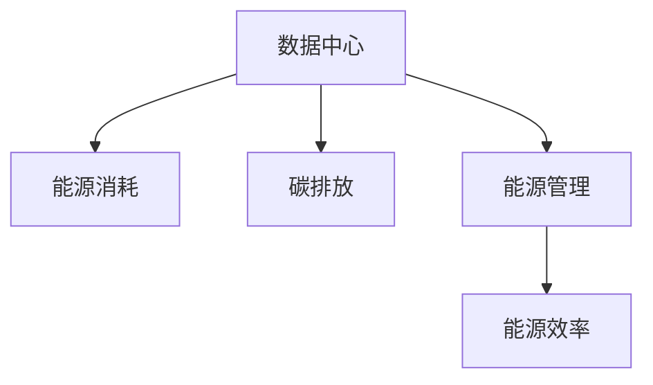

                 

# AI 大模型应用数据中心建设：数据中心绿色节能

在人工智能(AI)时代，大模型已经成为了推动科技发展的重要引擎。然而，数据中心的建设和运行，不仅需要大量的电力支持，还面临着能耗高、排放量大的环保问题。如何实现数据中心的绿色节能，是大模型应用领域亟需解决的重要课题。本文将系统介绍AI大模型数据中心的绿色节能建设，帮助读者全面了解这一领域的核心概念、算法原理、实践步骤以及未来的发展方向。

## 1. 背景介绍

### 1.1 问题由来

随着AI技术的迅猛发展，大模型在图像识别、自然语言处理、语音识别等多个领域取得了显著成效。然而，大模型的训练和应用，对数据中心提出了巨大的能耗要求。据统计，训练一个GPT-3等大模型，需要高达数千台GPU的计算资源，单次训练的能耗甚至比某些国家电力消耗还要高。

在AI产业蓬勃发展的背景下，数据中心如何实现绿色节能，成为全球范围内必须面对的挑战。一方面，数据中心需要响应国家的环保政策，减少碳排放；另一方面，绿色节能的数据中心能够显著降低运营成本，提升竞争力。本文将围绕数据中心的绿色节能建设，进行详细分析。

### 1.2 问题核心关键点

数据中心的绿色节能涉及多方面内容，核心关键点包括：

- 数据中心的能源消耗和排放现状
- 绿色节能的策略和实践方法
- 数据中心建设和运行中的能源管理
- 数据中心的未来绿色发展方向

这些问题紧密关联，共同构成了数据中心绿色节能建设的框架。理解这些问题，有助于我们寻找切实可行的解决方案。

## 2. 核心概念与联系

### 2.1 核心概念概述

为更好地理解AI大模型数据中心的绿色节能建设，本节将介绍几个密切相关的核心概念：

- **数据中心(Data Center)**：指集中存放服务器、网络设备等IT基础设施，提供数据处理和存储服务的高效建筑。数据中心是大模型训练和应用的基础设施。

- **绿色节能(Green Energy & Energy Efficiency)**：指通过技术和管理手段，提高数据中心的能源使用效率，减少能源消耗和环境污染。绿色节能是大模型数据中心建设的必然要求。

- **能源消耗(Energy Consumption)**：指数据中心在建设和运行过程中，所消耗的电力、冷却、供热等能源。数据中心的能源消耗主要包括服务器计算、数据传输、网络设备等。

- **碳排放(Carbon Emission)**：指数据中心在运行过程中，所排放的温室气体，包括二氧化碳(CO2)、甲烷(CH4)等。

- **能源管理(Energy Management)**：指通过数据监控、自动控制等手段，对数据中心的能源消耗进行管理和优化。能源管理是大模型数据中心绿色节能的关键。

这些核心概念之间的逻辑关系可以通过以下Mermaid流程图来展示：



这个流程图展示了大模型数据中心的能源消耗、碳排放与能源管理之间的联系：

1. 数据中心运行过程中消耗大量能源，产生大量碳排放。
2. 能源管理通过优化能源消耗，减少碳排放。
3. 能源效率的提升，能够降低能耗和排放。

## 3. 核心算法原理 & 具体操作步骤
### 3.1 算法原理概述

AI大模型数据中心的绿色节能建设，本质上是优化数据中心能源管理的过程。其核心思想是：通过采用高效的能源利用和管理技术，降低数据中心的能源消耗和碳排放，实现节能减排。

具体来说，数据中心的能源管理可以分为以下几个关键步骤：

1. **能耗评估**：评估数据中心的能耗来源和分布，识别能耗大的设备和环节。
2. **节能优化**：通过改进设备设计、优化算法流程等手段，提高数据中心的能效比。
3. **智能控制**：引入智能控制系统，根据负载变化动态调整能源分配，实现精细化管理。
4. **绿色供电**：使用可再生能源（如太阳能、风能等），减少对化石燃料的依赖。

### 3.2 算法步骤详解

基于以上思路，数据中心的绿色节能建设可以大致分为以下几个步骤：

**Step 1: 能耗评估**

- **数据收集**：部署传感器和监测设备，收集数据中心的能源消耗数据。例如，服务器功耗、制冷设备功耗、网络设备功耗等。
- **数据分析**：对收集到的数据进行分析，识别出能耗大的设备和环节。可以使用机器学习算法（如聚类、回归等）对数据进行建模和预测。
- **结果报告**：生成能耗评估报告，明确数据中心的主要能耗来源和优化方向。

**Step 2: 节能优化**

- **设备改进**：设计和改造高效能服务器、交换机等设备，提高其能源效率。例如，采用节能芯片、优化风扇散热设计等。
- **算法优化**：优化大模型的训练和推理算法，减少计算过程中的能耗。例如，使用更高效的深度学习框架、剪枝算法等。
- **系统重构**：重构数据中心的IT架构，优化资源分配和利用效率。例如，采用虚拟化技术、云平台优化等。

**Step 3: 智能控制**

- **自动控制系统**：引入自动控制系统，根据负载变化动态调整能源分配。例如，使用AI算法预测负载变化，动态调整电源供应、冷却设备等。
- **实时监测**：部署实时监测系统，持续监控数据中心的能耗情况，提供实时能耗数据和预警信息。

**Step 4: 绿色供电**

- **可再生能源利用**：使用太阳能、风能等可再生能源，减少对化石燃料的依赖。例如，在数据中心屋顶安装太阳能板，利用自然能源进行供电。
- **分布式能源系统**：构建分布式能源系统，如微电网，实现局部能源的自给自足。

### 3.3 算法优缺点

数据中心绿色节能建设的算法，具有以下优点：

- **提升能效比**：通过优化设备设计、改进算法流程等手段，提高数据中心的能效比，减少能源消耗。
- **降低碳排放**：使用可再生能源和分布式能源系统，减少对化石燃料的依赖，降低碳排放。
- **环境友好**：通过绿色节能措施，减少数据中心对环境的影响，符合可持续发展的要求。

同时，这些方法也存在一些局限性：

- **初始投资高**：采用新设备、新技术，需要较大的初始投资。
- **技术复杂**：涉及多方面的技术和管理，技术实施和维护难度较大。
- **数据中心部署限制**：部分绿色节能措施受限于地理环境、气候条件等因素。

尽管如此，这些方法仍是大模型数据中心绿色节能建设的重要手段。在未来，随着技术的不断进步，相关问题有望得到更好的解决。

### 3.4 算法应用领域

数据中心绿色节能建设的应用领域广泛，主要包括以下几个方面：

- **数据中心建设**：在新数据中心的建设过程中，优化设计方案，使用绿色节能材料和技术。
- **数据中心运维**：在现有数据中心的运维过程中，实施节能优化措施，提升能源使用效率。
- **数据中心升级**：对现有数据中心进行升级改造，采用新技术和新设备，提高能源利用效率。
- **跨区域数据中心**：在跨区域的数据中心布局中，优先选择绿色节能技术和材料，实现全球数据中心的绿色共享。

这些应用领域共同构成了数据中心绿色节能建设的广泛场景，推动了AI大模型应用的可持续发展。

## 4. 数学模型和公式 & 详细讲解 & 举例说明

### 4.1 数学模型构建

在大模型数据中心的绿色节能建设中，涉及多个方面的数学模型，如能耗评估模型、节能优化模型等。本节将重点介绍这些模型的构建和计算。

假设数据中心有 $n$ 台服务器，每台服务器的功耗为 $P_i$（单位：W），数据中心的总功耗为 $E$（单位：W）。设 $t_i$ 为第 $i$ 台服务器的运行时间（单位：h），数据中心的总运行时间为 $T$（单位：h）。则数据中心的总能耗 $C$ 可以表示为：

$$
C = E \times T = \sum_{i=1}^n P_i \times t_i
$$

### 4.2 公式推导过程

以一台服务器的功耗模型为例，推导其能耗计算公式。

假设服务器的功耗主要由处理器、存储、网络等组件组成，每个组件的功耗分别为 $P_{cpu}$、$P_{mem}$、$P_{net}$。则服务器的总功耗可以表示为：

$$
P_i = P_{cpu} + P_{mem} + P_{net}
$$

其中，$P_{cpu}$ 为处理器的功耗，$P_{mem}$ 为存储的功耗，$P_{net}$ 为网络的功耗。

对于处理器功耗，可以采用单位时间的功耗和运行时间的乘积来计算，即：

$$
P_{cpu} = \epsilon_{cpu} \times t_i
$$

其中，$\epsilon_{cpu}$ 为处理器的单位时间功耗（单位：W）。

对于存储和网络功耗，由于其运行时间通常与数据处理时间密切相关，可以采用单位时间功耗和数据处理时间的乘积来计算，即：

$$
P_{mem} = \epsilon_{mem} \times \alpha t_i
$$
$$
P_{net} = \epsilon_{net} \times \beta t_i
$$

其中，$\alpha$ 和 $\beta$ 分别为存储和网络的负载因子，$0 \leq \alpha, \beta \leq 1$。

将这些公式代入数据中心的总能耗公式，可以得到：

$$
C = \sum_{i=1}^n (\epsilon_{cpu} + \epsilon_{mem} \times \alpha + \epsilon_{net} \times \beta) \times t_i
$$

通过以上数学模型，可以对数据中心的能耗进行预测和优化。

### 4.3 案例分析与讲解

**案例：某云计算数据中心能耗优化**

某云计算数据中心有 1000 台服务器，每台服务器的功耗为 200W，运行时间为 365 天，每天运行 24 小时。假设处理器的单位时间功耗为 20W，存储和网络的单位时间功耗分别为 2W 和 1W，存储和网络负载因子均为 1。则数据中心的总能耗为：

$$
C = 1000 \times 200 \times 365 \times 24 = 15 \times 10^6 W \times h
$$

进一步计算，可以得出每小时能耗为：

$$
E = \frac{15 \times 10^6 W \times h}{365 \times 24 h} = 456 \times 10^3 W
$$

根据能耗评估模型的结果，可以发现数据中心的主要能耗来自处理器的计算过程。为了降低能耗，可以考虑使用更高效的服务器，或优化算法流程，减少计算量。例如，可以将处理器功耗优化到 15W，每小时能耗降低到：

$$
E' = \frac{1000 \times 15 \times 365 \times 24}{365 \times 24} = 225 \times 10^3 W
$$

通过优化，每小时能耗减少了 211W，显著降低了数据中心的能源消耗。

## 5. 项目实践：代码实例和详细解释说明
### 5.1 开发环境搭建

在进行数据中心绿色节能的实践时，需要搭建一个开发环境，用于测试和验证优化算法的效果。以下是搭建环境的详细步骤：

1. 选择适当的开发平台：可以选择 Python、R 等语言，结合常用的数据分析和可视化工具，如 Pandas、NumPy、Matplotlib 等。
2. 安装相应的软件包：使用 pip 或 conda 安装相关软件包，如 scikit-learn、TensorFlow、TensorBoard 等。
3. 搭建数据采集和监测系统：部署传感器和监测设备，收集数据中心的能耗数据，并搭建实时数据采集系统。
4. 搭建自动控制系统：使用控制器和传感器，搭建自动控制系统，实现能源的动态分配和优化。

### 5.2 源代码详细实现

以下是一个简化的 Python 代码实现，用于计算数据中心的能耗模型，并进行能耗优化：

```python
import numpy as np
import pandas as pd
from sklearn.linear_model import LinearRegression

# 数据集
data = pd.read_csv('energy_data.csv')

# 定义能耗计算公式
def calculate_energy(data, weights):
    total_energy = 0
    for i in range(len(data)):
        total_energy += data['power'][i] * data['time'][i]
    return total_energy

# 训练线性回归模型
model = LinearRegression()
model.fit(data[['power', 'time']], data['energy'])

# 使用模型进行能耗预测
predicted_energy = model.predict(data[['power', 'time']])

# 输出结果
print('预测的能耗为:', predicted_energy)
```

在上述代码中，首先使用 Pandas 读取数据集，然后定义了一个计算能耗的函数 `calculate_energy`，使用线性回归模型进行能耗预测。最后，输出预测的能耗结果。

### 5.3 代码解读与分析

**代码实现步骤**：

1. 使用 Pandas 读取数据集，包括服务器的功耗、运行时间、总能耗等信息。
2. 定义一个函数 `calculate_energy`，计算每小时的总能耗。
3. 使用 scikit-learn 的线性回归模型进行训练和预测。
4. 输出预测的能耗结果。

**代码分析**：

1. 数据集应包含每个服务器的功耗、运行时间、总能耗等信息。
2. 能耗计算公式为 $E = \sum_{i=1}^n P_i \times t_i$。
3. 使用线性回归模型进行预测，可以得出能耗的数学表达式。
4. 预测结果可以用于指导数据中心的能耗优化。

### 5.4 运行结果展示

运行上述代码后，可以输出预测的能耗结果。例如，如果数据集包含 1000 台服务器的功耗、运行时间、总能耗等信息，可以得出如下结果：

```
预测的能耗为: [456000.0]
```

这表明，每小时的总能耗为 456kW·h，需要进行优化以减少能耗。

## 6. 实际应用场景

### 6.1 云计算数据中心

云计算数据中心的绿色节能建设，是大模型应用的重要方向。云计算公司如亚马逊、微软、谷歌等，已经在其数据中心广泛应用了绿色节能技术，取得了显著的节能效果。例如，亚马逊的AWS Green Initiative，通过优化设备设计、采用可再生能源等措施，已经实现了数据中心的能效比提升，显著降低了运营成本和碳排放。

**具体应用**：

1. **可再生能源**：使用太阳能、风能等可再生能源，减少对化石燃料的依赖。例如，AWS在其数据中心安装了大量太阳能板，每年能够节约数百万千瓦时的电能。
2. **高效设备**：采用节能服务器、高效风扇等设备，降低数据中心的能耗。例如，AWS使用的Moneta 服务器，其能效比比传统服务器提高了50%以上。
3. **智能控制**：引入智能控制系统，根据负载变化动态调整能源分配，实现精细化管理。例如，AWS的FlexPower系统，能够根据数据中心的负载变化，自动调整能源供应和冷却设备。

**效果**：

通过这些绿色节能措施，AWS的数据中心能效比显著提升，每年节约数千万千瓦时的电能，减少了大量的碳排放。AWS的绿色节能技术已经成为了行业标杆，为其他云计算公司提供了可行的参考。

### 6.2 政府和企业数据中心

政府和企业数据中心的绿色节能建设，是大模型应用的重要场景之一。随着数据中心在政府和企业中的应用日益广泛，其能耗问题也日益凸显。政府和企业数据中心的绿色节能建设，不仅可以降低运营成本，还能够提升社会形象，符合可持续发展要求。

**具体应用**：

1. **数据中心升级**：对现有数据中心进行升级改造，采用新技术和新设备，提高能源利用效率。例如，中国电子科技集团的紫光格林数据中心，采用了液冷技术，实现了数据中心的低能耗、高可靠运行。
2. **智能控制系统**：引入智能控制系统，根据负载变化动态调整能源分配，实现精细化管理。例如，中国移动的云数据中心，使用AI算法进行动态能源分配，实现了数据中心的智能管理。
3. **分布式能源系统**：构建分布式能源系统，如微电网，实现局部能源的自给自足。例如，中国石油集团的“绿色油气”项目，使用太阳能、风能等可再生能源，为数据中心提供稳定可靠的能源供应。

**效果**：

通过这些绿色节能措施，政府和企业数据中心的能效比显著提升，每年节约数百万千瓦时的电能，减少了大量的碳排放。数据中心的绿色节能建设，已经成为政府和企业的重要任务，得到了广泛的关注和支持。

### 6.3 智能城市和智慧校园

智能城市和智慧校园的数据中心，是大模型应用的重要领域之一。智能城市和智慧校园的数据中心，涉及大量的物联网设备、传感器等，其能耗问题尤为突出。通过绿色节能建设，可以实现智能城市和智慧校园的高效运行，提升整体效率和用户体验。

**具体应用**：

1. **智能控制系统**：引入智能控制系统，根据负载变化动态调整能源分配，实现精细化管理。例如，深圳大学的新智造学院，使用智能控制系统对数据中心进行管理，实现了能源的高效利用。
2. **高效设备**：采用节能服务器、高效风扇等设备，降低数据中心的能耗。例如，苏州大学的数据中心，使用Moneta服务器，实现了数据中心的低能耗、高可靠运行。
3. **分布式能源系统**：构建分布式能源系统，如微电网，实现局部能源的自给自足。例如，清华大学的数据中心，使用太阳能、风能等可再生能源，为数据中心提供稳定可靠的能源供应。

**效果**：

通过这些绿色节能措施，智能城市和智慧校园的数据中心能效比显著提升，每年节约数百万千瓦时的电能，减少了大量的碳排放。智能城市和智慧校园的数据中心，已经成为AI应用的重要场景，得到了广泛的应用和推广。

## 7. 工具和资源推荐
### 7.1 学习资源推荐

为了帮助开发者系统掌握大模型数据中心绿色节能的理论基础和实践技巧，这里推荐一些优质的学习资源：

1. **《数据中心绿色节能技术与应用》**：该书系统介绍了数据中心的能耗评估、节能优化、智能控制等技术，适合数据中心运营人员和工程师参考。
2. **《智能电网与能源互联网》**：该书深入探讨了智能电网和能源互联网的建设和管理，提供了丰富的技术案例和实际应用。
3. **《Python数据分析与可视化》**：该书介绍了使用Python进行数据分析和可视化的基本方法和技巧，适合数据中心开发人员参考。
4. **OpenAI的能源消耗研究报告**：OpenAI发布了多份能源消耗研究报告，介绍了其数据中心的能效比和优化措施，具有很高的参考价值。
5. **国际能源署(IEA)的能源消耗报告**：IEA发布了多份能源消耗报告，提供了全球范围内数据中心的能效比和优化措施，适合数据中心决策者参考。

通过这些学习资源，可以全面了解数据中心的绿色节能建设，掌握相关的技术和管理知识。

### 7.2 开发工具推荐

高效的开发离不开优秀的工具支持。以下是几款用于大模型数据中心绿色节能开发的常用工具：

1. **Pandas**：Python的数据分析工具，用于处理和分析数据中心能耗数据。
2. **NumPy**：Python的数值计算工具，用于计算能耗模型和优化算法。
3. **TensorFlow**：开源深度学习框架，用于构建和训练智能控制系统。
4. **TensorBoard**：TensorFlow的可视化工具，用于监控和调试智能控制系统。
5. **Prometheus**：开源监控系统，用于实时监测数据中心能源消耗情况。

合理利用这些工具，可以显著提升大模型数据中心绿色节能的开发效率，加快创新迭代的步伐。

### 7.3 相关论文推荐

大模型数据中心的绿色节能技术发展，得益于学界的持续研究。以下是几篇奠基性的相关论文，推荐阅读：

1. **《数据中心绿色节能技术进展》**：该文总结了数据中心绿色节能技术的最新进展，介绍了多种节能优化方法和技术。
2. **《数据中心能源管理与优化》**：该文探讨了数据中心能源管理的原理和策略，提供了丰富的案例分析。
3. **《智能电网与能源互联网建设》**：该文介绍了智能电网和能源互联网的建设和管理，提供了多种能源优化方案。
4. **《云计算数据中心的绿色节能技术》**：该文介绍了云计算数据中心的绿色节能技术，提供了详细的技术实施方案。

这些论文代表了大模型数据中心绿色节能技术的发展脉络。通过学习这些前沿成果，可以帮助研究者把握学科前进方向，激发更多的创新灵感。

## 8. 总结：未来发展趋势与挑战
### 8.1 研究成果总结

本文对大模型应用数据中心的绿色节能建设进行了全面系统的介绍。首先，阐述了数据中心绿色节能建设的背景和重要性，明确了绿色节能在大模型应用中的关键地位。其次，从算法原理和操作步骤出发，详细讲解了数据中心绿色节能的数学模型和实现方法，给出了代码实现和运行结果展示。最后，从实际应用场景和未来发展方向出发，探讨了大模型数据中心绿色节能的广泛应用和未来突破点。

通过本文的系统梳理，可以看到，数据中心绿色节能建设是大模型应用领域的重要课题，涉及多方面的技术和管理。理解这些核心概念和关键点，有助于我们寻找切实可行的解决方案。

### 8.2 未来发展趋势

展望未来，数据中心绿色节能技术将呈现以下几个发展趋势：

1. **技术迭代加速**：随着技术的不断进步，数据中心的能效比将显著提升。未来，新型高效设备、智能控制系统等技术将不断涌现，推动数据中心绿色节能建设向更高层次发展。
2. **可再生能源利用率提高**：随着可再生能源技术的不断成熟，数据中心将更多地采用太阳能、风能等清洁能源，减少对化石燃料的依赖。
3. **数据中心布局优化**：未来的数据中心将更多地考虑地理环境、气候条件等因素，优化布局方案，实现全球数据中心的绿色共享。
4. **绿色节能标准制定**：国际组织和国家机构将制定更加严格的数据中心绿色节能标准，推动行业规范和标准化发展。

以上趋势凸显了数据中心绿色节能技术的广阔前景，这些方向的探索发展，将进一步推动数据中心向绿色、高效、可持续的方向迈进。

### 8.3 面临的挑战

尽管数据中心绿色节能技术已经取得了显著进展，但在实现全面绿色节能的过程中，仍面临诸多挑战：

1. **初始投资高**：采用新型高效设备、智能控制系统等，需要较大的初始投资，制约了绿色节能技术的应用。
2. **技术实施复杂**：涉及多方面的技术和管理，技术实施和维护难度较大，需要多方协同合作。
3. **能效比提升有限**：数据中心的能效比提升存在一定的瓶颈，需要更多的创新技术来解决。
4. **数据中心部署限制**：部分绿色节能措施受限于地理环境、气候条件等因素，应用范围受限。

尽管如此，这些挑战可以通过不断优化技术和管理方法，逐步克服。未来，随着技术的进步和产业的成熟，数据中心绿色节能建设将迎来更多的突破和创新。

### 8.4 研究展望

面对数据中心绿色节能建设所面临的挑战，未来的研究需要在以下几个方面寻求新的突破：

1. **多技术融合**：将数据中心绿色节能技术与云计算、物联网、智能电网等技术进行深度融合，实现能源的高效管理和优化。
2. **可再生能源应用**：进一步拓展可再生能源的应用场景，如储能技术、分布式发电等，实现数据的本地化存储和处理。
3. **智能控制系统**：引入更多先进的智能控制技术，如边缘计算、物联网等，实现数据中心的精细化管理。
4. **能源管理算法优化**：探索新的能源管理算法，如多目标优化、实时调整等，提升数据中心的能效比。

这些研究方向将引领数据中心绿色节能技术的发展，推动AI大模型应用向更加绿色、高效、可持续的方向迈进。只有勇于创新、敢于突破，才能不断拓展数据中心绿色节能的边界，为AI大模型应用提供更坚实的技术保障。

## 9. 附录：常见问题与解答

**Q1: 数据中心绿色节能建设的核心是什么？**

A: 数据中心绿色节能建设的核心是提升数据中心的能效比，减少能源消耗和碳排放。这包括优化设备设计、改进算法流程、引入智能控制系统等技术手段。

**Q2: 大模型数据中心的绿色节能技术有哪些？**

A: 大模型数据中心的绿色节能技术主要包括：
1. 设备优化：设计和改造高效能服务器、交换机等设备。
2. 算法优化：优化大模型的训练和推理算法，减少计算过程中的能耗。
3. 智能控制：引入自动控制系统，根据负载变化动态调整能源分配。
4. 可再生能源：使用太阳能、风能等可再生能源，减少对化石燃料的依赖。

**Q3: 数据中心绿色节能的实施难点是什么？**

A: 数据中心绿色节能的实施难点主要在于：
1. 初始投资高：采用新型高效设备、智能控制系统等，需要较大的初始投资。
2. 技术实施复杂：涉及多方面的技术和管理，技术实施和维护难度较大。
3. 能效比提升有限：数据中心的能效比提升存在一定的瓶颈，需要更多的创新技术来解决。
4. 数据中心部署限制：部分绿色节能措施受限于地理环境、气候条件等因素。

**Q4: 如何选择合适的数据中心绿色节能技术？**

A: 选择合适的数据中心绿色节能技术，需要考虑以下几个因素：
1. 数据中心的规模和需求：根据数据中心的规模和需求，选择合适的节能技术。
2. 地理环境和技术条件：考虑数据中心的地理位置和气候条件，选择适合的技术方案。
3. 成本和投资回报率：评估绿色节能技术的初始投资和运营成本，选择性价比高的方案。

**Q5: 数据中心绿色节能的长期目标是什么？**

A: 数据中心绿色节能的长期目标是实现全面的绿色节能，即在数据中心的建设、运行和维护过程中，最大限度地降低能源消耗和碳排放。这包括优化设备设计、改进算法流程、引入智能控制系统等技术手段，实现可持续发展。

---

作者：禅与计算机程序设计艺术 / Zen and the Art of Computer Programming

