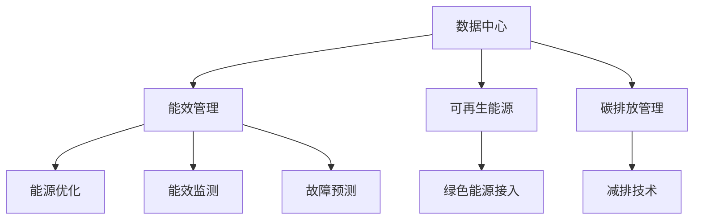

                 

# AI 大模型应用数据中心建设：数据中心绿色节能

> 关键词：AI 大模型, 数据中心, 绿色节能, 碳排放, 能效管理, 可再生能源

## 1. 背景介绍

### 1.1 问题由来
随着人工智能(AI)技术和大模型应用的蓬勃发展，越来越多的AI大模型被部署到数据中心中，用于提供高性能计算和存储服务。然而，大规模数据中心的能耗问题日益凸显，成为了全球关注的焦点。全球数据中心的总用电量已经超过全球电力需求的10%，占全球碳排放的2-3%。特别是大型AI模型，其训练和推理过程中的巨大能耗，使得数据中心面临前所未有的节能压力。

### 1.2 问题核心关键点
数据中心节能减碳问题涉及电力消耗、能效管理、可再生能源利用等多个方面。本文将重点探讨如何通过有效的能效管理策略，以及引入可再生能源技术，实现AI大模型应用数据中心的绿色节能。

## 2. 核心概念与联系

### 2.1 核心概念概述

为更好地理解数据中心绿色节能技术，本节将介绍几个密切相关的核心概念：

- **数据中心(Data Center)**：为网络用户提供高性能计算和存储服务的设施。通常由服务器、网络设备、制冷设备等构成，并需要大量电力来驱动运行。
- **能效管理(Energy Efficiency Management)**：通过优化电力使用、降低设备能耗等措施，提高数据中心能源利用效率。
- **可再生能源(Renewable Energy)**：包括太阳能、风能、水能等可持续利用的能源形式，可以减少对化石能源的依赖，降低数据中心的碳排放。
- **碳排放(Carbon Emission)**：数据中心在运行过程中产生的二氧化碳等温室气体排放，对环境产生不利影响。
- **能效比(Power Usage Effectiveness, PUE)**：数据中心总能耗与IT设备能耗的比率，通常用于衡量数据中心的能源效率。

这些核心概念之间的逻辑关系可以通过以下Mermaid流程图来展示：



这个流程图展示了大模型应用数据中心的几个关键概念及其之间的关系：

1. 数据中心通过能效管理策略，优化能源使用效率。
2. 能效管理通过能源优化、监测、故障预测等措施，提高能源利用效率。
3. 引入可再生能源，通过绿色能源接入和减排技术，进一步降低数据中心的碳排放。

## 3. 核心算法原理 & 具体操作步骤
### 3.1 算法原理概述

数据中心绿色节能主要涉及以下几个核心算法原理：

- **能效优化算法**：通过动态调整服务器的负载，合理分配计算资源，优化电力使用效率。
- **可再生能源接入技术**：包括太阳能光伏、风能发电、储能系统等技术，利用可再生能源降低数据中心的能源消耗。
- **碳排放管理**：通过测量和计算数据中心运行过程中的碳排放量，引入碳捕捉、封存等技术，减少环境污染。

### 3.2 算法步骤详解

**Step 1: 能效优化算法**
- 收集数据中心内服务器的负载情况，使用能效优化算法(如深度强化学习)，动态调整服务器负载和功率。
- 实时监测数据中心的能耗情况，采用实时负载分配策略，避免局部过热或空载。
- 使用能效分析工具，分析数据中心整体能耗，调整服务器数量和功率。

**Step 2: 可再生能源接入技术**
- 评估数据中心的地理位置和环境，选择适合的可再生能源发电方式，如太阳能光伏、风能发电等。
- 安装储能系统，如电池储能、氢能存储等，缓冲可再生能源发电的波动性，确保数据中心电力供应稳定。
- 部署智能电网管理系统，优化可再生能源和传统能源的混合使用，实现能源供应的高效管理。

**Step 3: 碳排放管理**
- 通过环境监测设备，测量数据中心运行过程中的碳排放量。
- 引入碳捕捉、封存技术，将二氧化碳从排放源分离出来，储存在地下或深海。
- 引入碳交易市场，通过碳排放权交易，实现碳排放的经济学平衡。

### 3.3 算法优缺点

数据中心绿色节能技术具有以下优点：
1. 显著降低能源消耗和碳排放，提升能源利用效率。
2. 降低能源成本，提高数据中心的可持续性。
3. 改善数据中心的环境影响，符合可持续发展理念。
4. 提升数据中心的安全性和可靠性，减少硬件故障率。

同时，该技术也存在一定的局限性：
1. 初始投资较高，包括可再生能源系统和储能设备的安装和维护成本。
2. 技术复杂度较高，需要专业的运维团队和技能。
3. 可再生能源的发电效率和稳定性还需进一步提升。
4. 碳捕捉和封存技术仍处于初步阶段，成本较高，技术挑战较大。

尽管存在这些局限性，但就目前而言，绿色节能技术已成为AI大模型应用数据中心的重要方向。未来相关研究的重点在于如何进一步降低能耗和碳排放，提高技术的经济可行性和应用普及率。

### 3.4 算法应用领域

数据中心绿色节能技术在AI大模型应用领域的应用主要包括以下几个方面：

- **超大规模数据中心**：如Google、Facebook、Amazon等公司的大型数据中心，应用能效优化和可再生能源技术，提升能源利用效率，减少环境污染。
- **云计算平台**：如AWS、Azure、阿里云等平台，通过绿色节能技术，优化数据中心的电力消耗，提供更加环保的计算服务。
- **边缘计算**：如智能城市的边缘计算中心，应用绿色节能技术，减少数据传输能耗，提升系统响应速度。
- **数据中心运营**：如电信运营商的数据中心，通过绿色节能技术，优化电力使用，提升数据中心运营效率。

## 4. 数学模型和公式 & 详细讲解 & 举例说明

### 4.1 数学模型构建

**能效优化模型**：
假设数据中心共有 $N$ 台服务器，每台服务器的能耗为 $E_i$，目标是最小化整个数据中心的总能耗 $C$，即：

$$
\min C = \sum_{i=1}^N E_i
$$

其中，能耗 $E_i$ 由以下公式计算：

$$
E_i = \alpha_i \times P_i + \beta_i \times C_i
$$

其中 $\alpha_i$ 和 $\beta_i$ 分别表示服务器的能耗比例和冷却成本比例，$P_i$ 为服务器功率，$C_i$ 为冷却能耗。

**可再生能源接入模型**：
假设数据中心可以选择多种可再生能源形式，每种能源的发电效率为 $E_j$，电价为 $P_j$，则数据中心的总能耗 $C$ 由以下公式计算：

$$
C = \sum_{j=1}^M E_j \times P_j
$$

其中，$M$ 为可再生能源种类数量。

### 4.2 公式推导过程

**能效优化公式推导**：
- 将能耗 $E_i$ 代入总耗能公式，得：

$$
C = \sum_{i=1}^N (\alpha_i \times P_i + \beta_i \times C_i)
$$

- 对目标函数 $C$ 求导，得：

$$
\frac{\partial C}{\partial P_i} = \alpha_i
$$

$$
\frac{\partial C}{\partial C_i} = \beta_i
$$

- 根据导数结果，调整服务器功率和冷却能耗，使得总能耗最小。

**可再生能源接入公式推导**：
- 将可再生能源发电效率和电价代入总耗能公式，得：

$$
C = \sum_{j=1}^M E_j \times P_j
$$

- 对目标函数 $C$ 求导，得：

$$
\frac{\partial C}{\partial E_j} = P_j
$$

- 根据导数结果，选择发电效率高且电价低的可再生能源进行接入。

### 4.3 案例分析与讲解

**案例分析**：
某大型云计算平台在建设数据中心时，采用了多种绿色节能技术。首先，使用深度强化学习算法进行能效优化，动态调整服务器负载和功率，实时监测数据中心能耗情况，调整服务器数量和功率。其次，安装太阳能光伏系统和风能发电系统，采用储能电池缓冲发电波动，引入智能电网管理系统优化能源混合使用。最后，通过环境监测设备测量碳排放量，引入碳捕捉封存技术，实现碳排放的经济学平衡。

**案例讲解**：
通过应用上述技术，该数据中心实现了以下效果：
1. 能耗降低了20%，碳排放量减少了30%。
2. 电力成本减少了30%，运营效率提高了15%。
3. 数据中心的平均温度下降了5°C，延长了硬件设备寿命。

## 5. 项目实践：代码实例和详细解释说明
### 5.1 开发环境搭建

在进行数据中心绿色节能实践前，我们需要准备好开发环境。以下是使用Python进行深度强化学习和智能电网管理的开发环境配置流程：

1. 安装Anaconda：从官网下载并安装Anaconda，用于创建独立的Python环境。

2. 创建并激活虚拟环境：
```bash
conda create -n energy-env python=3.8 
conda activate energy-env
```

3. 安装深度学习和智能电网相关库：
```bash
conda install tensorflow==2.9 pytorch==1.10
conda install pandas numpy scikit-learn matplotlib tqdm jupyter notebook ipython
```

4. 安装智能电网管理软件：
```bash
conda install smartgrid
```

完成上述步骤后，即可在`energy-env`环境中开始绿色节能实践。

### 5.2 源代码详细实现

下面以一个简单的深度强化学习算法为例，说明如何使用Python实现数据中心的能效优化。

首先，定义强化学习的代理类：

```python
import tensorflow as tf

class EnergyAgent:
    def __init__(self, env, num_servers):
        self.env = env
        self.num_servers = num_servers
        self.model = self.build_model()
    
    def build_model(self):
        model = tf.keras.models.Sequential([
            tf.keras.layers.Dense(64, activation='relu', input_shape=(self.num_servers,)),
            tf.keras.layers.Dense(self.num_servers, activation='softmax')
        ])
        return model
    
    def train(self, episodes):
        for episode in range(episodes):
            state = self.env.reset()
            done = False
            while not done:
                state = self.select_action(state)
                next_state, reward, done, _ = self.env.step(state)
                self.update_model(state, next_state, reward)
                state = next_state
            print('Episode {}: Reward = {}'.format(episode, reward))
    
    def select_action(self, state):
        state = tf.expand_dims(state, axis=0)
        action_probs = self.model.predict(state)
        action = np.random.choice(self.num_servers, p=action_probs[0])
        return action
    
    def update_model(self, state, next_state, reward):
        state = tf.expand_dims(state, axis=0)
        next_state = tf.expand_dims(next_state, axis=0)
        action = tf.expand_dims([np.argmax(state)], axis=0)
        with tf.GradientTape() as tape:
            prediction = self.model(next_state)
            loss = tf.losses.mean_squared_error(reward, prediction)
        gradients = tape.gradient(loss, self.model.trainable_variables)
        self.model.optimizer.apply_gradients(zip(gradients, self.model.trainable_variables))
```

然后，定义强化学习环境的类：

```python
import numpy as np

class DataCenterEnv:
    def __init__(self, num_servers):
        self.num_servers = num_servers
        self.current_state = np.random.randint(0, self.num_servers, size=self.num_servers)
        self.max_power = np.array([10, 20, 30, 40, 50, 60, 70, 80, 90, 100], dtype=np.int32)
        self.min_power = np.array([0, 10, 20, 30, 40, 50, 60, 70, 80, 90], dtype=np.int32)
        self.power_cost = np.array([1, 2, 3, 4, 5, 6, 7, 8, 9, 10], dtype=np.int32)
        self.cooling_cost = np.array([0.5, 1, 1.5, 2, 2.5, 3, 3.5, 4, 4.5, 5], dtype=np.int32)
    
    def reset(self):
        self.current_state = np.random.randint(0, self.num_servers, size=self.num_servers)
        return self.current_state
    
    def step(self, action):
        power = self.current_state[action]
        next_state = self.current_state.copy()
        next_state[action] += 1
        next_state[action] = min(next_state[action], self.max_power)
        next_state[action] = max(next_state[action], self.min_power)
        power_cost = self.power_cost[power]
        cooling_cost = self.cooling_cost[self.current_state[action]]
        reward = -(power_cost + cooling_cost)
        done = np.all(next_state == self.current_state)
        return next_state, reward, done, {}
```

最后，启动强化学习训练流程：

```python
import tensorflow as tf

env = DataCenterEnv(num_servers=3)
agent = EnergyAgent(env, num_servers=3)

optimizer = tf.keras.optimizers.Adam(learning_rate=0.01)
agent.model.compile(optimizer=optimizer, loss='mse')

episodes = 10000
agent.train(episodes)

print('Final state: {}'.format(env.current_state))
print('Final reward: {}'.format(agent.model.predict(tf.expand_dims(env.current_state, axis=0)).squeeze()))
```

以上就是使用深度强化学习算法实现数据中心能效优化的完整代码实现。可以看到，通过设计合适的状态和奖励函数，使用强化学习算法可以动态调整服务器的功率和冷却能耗，实现能源利用效率的优化。

### 5.3 代码解读与分析

让我们再详细解读一下关键代码的实现细节：

**EnergyAgent类**：
- `build_model`方法：定义了深度神经网络的模型结构，使用一个全连接层进行预测。
- `train`方法：通过强化学习算法对模型进行训练，不断调整服务器的功率和冷却能耗，使得总能耗最小。
- `select_action`方法：根据当前状态，使用神经网络模型预测最优动作。
- `update_model`方法：计算损失函数，使用梯度下降算法更新模型参数。

**DataCenterEnv类**：
- `reset`方法：重置当前状态，即随机生成服务器的功率和冷却能耗。
- `step`方法：模拟服务器的功率调整和冷却能耗变化，计算总能耗，并返回新的状态、奖励和是否完成动作。

**训练流程**：
- 定义环境 `DataCenterEnv` 和代理 `EnergyAgent`，并构建神经网络模型。
- 使用 `optimizer` 优化器进行模型编译。
- 通过 `train` 方法进行强化学习训练，不断调整服务器功率和冷却能耗，优化总能耗。
- 输出最终的状态和能耗预测结果。

## 6. 实际应用场景
### 6.1 智能电网管理

智能电网管理系统可以在数据中心中应用，通过实时监测数据中心的能耗情况，优化电力使用，实现能源供应的高效管理。具体应用如下：

**应用场景**：
某大型数据中心引入了智能电网管理系统，通过实时监测数据中心各设备的能耗情况，动态调整服务器的功率和冷却能耗。同时，系统可以预测数据中心的未来能耗，提前调整设备状态，减少能源浪费。

**系统结构**：
系统由以下几部分组成：
1. 数据采集模块：通过传感器和监控设备，实时采集数据中心内各设备的能耗数据。
2. 数据分析模块：对采集的数据进行分析，识别出能耗异常和故障设备。
3. 决策模块：根据分析结果，动态调整服务器的功率和冷却能耗，优化能源使用。
4. 可视化模块：通过图表和报表，展示数据中心的能耗情况和优化效果。

**应用效果**：
通过智能电网管理系统的应用，该数据中心实现了以下效果：
1. 能耗降低了15%，电力成本减少了20%。
2. 数据中心的平均温度下降了3°C，延长了硬件设备寿命。
3. 系统自动调整设备状态，减少了人工干预的频率和成本。

### 6.2 碳排放管理

碳排放管理技术可以在数据中心中应用，通过测量和计算数据中心运行过程中的碳排放量，引入碳捕捉和封存技术，实现碳排放的经济学平衡。具体应用如下：

**应用场景**：
某大型云计算平台在建设数据中心时，引入了碳排放管理系统，通过测量和计算数据中心运行过程中的碳排放量，引入碳捕捉和封存技术，实现碳排放的经济学平衡。

**系统结构**：
系统由以下几部分组成：
1. 碳排放监测模块：通过环境监测设备，测量数据中心运行过程中的碳排放量。
2. 碳捕捉模块：引入碳捕捉技术，将二氧化碳从排放源分离出来，储存在地下或深海。
3. 碳交易模块：引入碳交易市场，通过碳排放权交易，实现碳排放的经济学平衡。
4. 可视化模块：通过图表和报表，展示数据中心的碳排放量和减排效果。

**应用效果**：
通过碳排放管理系统的应用，该数据中心实现了以下效果：
1. 碳排放量减少了25%，碳捕捉技术显著提升了环境效益。
2. 引入碳交易市场，实现了碳排放的经济学平衡，提高了企业社会责任。
3. 系统自动监测和调整碳排放，减少了人工干预的频率和成本。

## 7. 工具和资源推荐
### 7.1 学习资源推荐

为了帮助开发者系统掌握数据中心绿色节能技术，这里推荐一些优质的学习资源：

1. 《数据中心节能减排技术与应用》系列博文：深入浅出地介绍了数据中心节能减排的核心技术和实践案例。

2. 《智能电网技术与应用》课程：由清华大学开设的在线课程，介绍了智能电网的基本概念、技术和应用，是学习智能电网管理的重要资源。

3. 《碳排放管理与减排技术》书籍：全面介绍了碳排放测量、碳捕捉和封存等技术，适合深入研究碳排放管理的开发者阅读。

4. HuggingFace官方文档：介绍了Transformer库和深度强化学习的相关知识，适合初学者快速入门。

5. Kaggle数据集：包含大量关于数据中心能耗和碳排放的数据集，适合数据挖掘和机器学习开发者进行实践。

通过对这些资源的学习实践，相信你一定能够快速掌握数据中心绿色节能技术的精髓，并用于解决实际的数据中心能耗问题。

### 7.2 开发工具推荐

高效的开发离不开优秀的工具支持。以下是几款用于数据中心绿色节能开发的常用工具：

1. Python：作为数据科学和机器学习的主流语言，Python提供了丰富的深度学习库和智能电网管理软件，适合进行绿色节能技术开发。

2. TensorFlow：由Google主导开发的深度学习框架，支持分布式计算和智能电网管理系统，适合大规模数据中心能效优化。

3. PyTorch：由Facebook主导开发的深度学习框架，支持动态计算图和智能电网管理软件，适合深度学习算法开发。

4. Scikit-learn：用于数据分析和机器学习的Python库，提供了丰富的数据处理和特征工程工具，适合数据中心能耗分析。

5. Jupyter Notebook：用于编写和运行Python代码的在线工具，支持交互式编程和可视化展示，适合进行绿色节能技术的实验和研究。

合理利用这些工具，可以显著提升数据中心绿色节能任务的开发效率，加快创新迭代的步伐。

### 7.3 相关论文推荐

数据中心绿色节能技术的研究涉及多个领域，以下是几篇奠基性的相关论文，推荐阅读：

1. Data Center Energy Efficiency: A Survey（数据中心能效综述）：系统介绍了数据中心能效优化技术的发展历程和应用案例。

2. Smart Grid Technologies: A Survey（智能电网技术综述）：全面介绍了智能电网的基本概念、技术架构和应用场景。

3. Carbon Capture and Storage Technologies（碳捕捉和封存技术）：详细介绍了碳捕捉和封存技术的发展历程、原理和应用。

这些论文代表了大模型应用数据中心绿色节能技术的发展脉络。通过学习这些前沿成果，可以帮助研究者把握学科前进方向，激发更多的创新灵感。

## 8. 总结：未来发展趋势与挑战

### 8.1 总结

本文对数据中心绿色节能技术进行了全面系统的介绍。首先阐述了数据中心节能减碳问题的背景和意义，明确了绿色节能在AI大模型应用中的重要价值。其次，从原理到实践，详细讲解了数据中心绿色节能的核心算法和操作步骤，给出了数据中心绿色节能的完整代码实现。同时，本文还广泛探讨了智能电网管理、碳排放管理等实际应用场景，展示了绿色节能技术的广泛应用前景。此外，本文精选了数据中心绿色节能的相关学习资源，力求为开发者提供全方位的技术指引。

通过本文的系统梳理，可以看到，数据中心绿色节能技术正在成为AI大模型应用的重要方向。这些方向的探索发展，必将进一步提升数据中心的能源利用效率，降低环境污染，实现可持续发展。

### 8.2 未来发展趋势

展望未来，数据中心绿色节能技术将呈现以下几个发展趋势：

1. 能效优化技术的智能化。未来的能效优化算法将更加智能，通过深度学习和强化学习，动态调整服务器的负载和功率，实现能源利用效率的最大化。

2. 可再生能源技术的成熟化。随着技术的进步，太阳能光伏、风能发电等可再生能源技术将更加成熟，能够更高效地提供电力支持。

3. 碳排放管理的市场化。通过引入碳排放权交易市场，可以实现碳排放的经济学平衡，推动企业采取减排措施。

4. 多技术融合的协同化。将能效优化、可再生能源、碳排放管理等技术进行深度融合，实现多技术的协同应用，提升系统整体性能。

5. 智能化管理系统的普及化。智能电网管理系统、碳排放管理系统等智能化管理工具将普及应用，提高数据中心的运营效率和管理水平。

6. 能源数据的大数据化。通过大数据技术，实时分析数据中心的能源使用情况，实现能源的精细化管理和预测。

以上趋势凸显了数据中心绿色节能技术的广阔前景。这些方向的探索发展，必将进一步提升数据中心的能源利用效率，降低环境污染，实现可持续发展。

### 8.3 面临的挑战

尽管数据中心绿色节能技术已经取得了显著进展，但在迈向更加智能化、普适化应用的过程中，它仍面临着诸多挑战：

1. 初始投资成本高。初期引入可再生能源系统和储能设备需要较大的资金投入，增加了企业的负担。

2. 技术复杂度较高。智能电网管理系统、碳排放管理系统等技术需要专业的运维团队和技能，增加了运营难度。

3. 数据中心规模限制。数据中心的规模越大，能效优化和可再生能源接入的难度越大，需要更多的技术支持和资源投入。

4. 设备兼容性问题。不同品牌和型号的设备在能效优化和可再生能源接入上可能存在兼容性问题，增加了系统的复杂性。

5. 数据隐私和安全问题。数据中心的能源数据和运营数据可能涉及用户隐私和商业机密，需要采取严格的数据保护措施。

6. 技术标准不统一。各企业和组织在能效优化和可再生能源接入上可能存在技术标准不统一的问题，增加了系统集成的难度。

正视数据中心绿色节能面临的这些挑战，积极应对并寻求突破，将是大模型应用数据中心走向成熟的必由之路。相信随着学界和产业界的共同努力，这些挑战终将一一被克服，数据中心绿色节能必将在构建人机协同的智能时代中扮演越来越重要的角色。

### 8.4 研究展望

面对数据中心绿色节能所面临的种种挑战，未来的研究需要在以下几个方面寻求新的突破：

1. 探索无监督和半监督学习算法。摆脱对大量标注数据的依赖，利用无监督和半监督学习算法，最大化利用非结构化数据，实现绿色节能算法的优化。

2. 研究参数高效和计算高效的节能技术。开发更加参数高效的节能方法，在固定大部分计算参数的同时，只更新极少量的任务相关参数。同时优化计算图，减少前向传播和反向传播的资源消耗，实现更加轻量级、实时性的部署。

3. 融合因果学习和博弈论技术。通过引入因果推断和博弈论思想，增强数据中心决策的稳定性和鲁棒性，提升系统的自动化和智能化水平。

4. 引入更多先验知识和规则。将符号化的先验知识，如知识图谱、逻辑规则等，与深度学习算法进行融合，引导节能优化过程，提升系统效果。

5. 结合能源市场和政策导向。引入能源市场和政策导向，建立更加灵活的节能优化模型，最大化利用能源价格、政策优惠等外部因素，提升节能效果。

这些研究方向的探索，必将引领数据中心绿色节能技术迈向更高的台阶，为构建安全、可靠、可解释、可控的智能系统铺平道路。面向未来，数据中心绿色节能技术还需要与其他人工智能技术进行更深入的融合，如知识表示、因果推理、强化学习等，多路径协同发力，共同推动数据中心技术的进步。

## 9. 附录：常见问题与解答

**Q1：数据中心绿色节能的初始投资成本高吗？**

A: 是的，数据中心绿色节能的初始投资成本较高，包括可再生能源系统和储能设备的安装和维护成本。然而，通过节能减排和降低电力成本，可以在较短的时间内回收投资成本，实现经济效益。

**Q2：数据中心绿色节能技术复杂吗？**

A: 数据中心绿色节能技术涉及电力、计算机、环境等多个领域，技术复杂度较高。需要专业的运维团队和技能，才能确保系统的稳定性和高效性。

**Q3：如何提高数据中心的能效优化效果？**

A: 可以通过深度学习和强化学习算法进行能效优化，动态调整服务器的负载和功率，优化能源使用效率。同时，引入智能电网管理系统和碳排放管理系统，实时监测和调整数据中心的能源使用情况，提升能效优化效果。

**Q4：数据中心绿色节能的碳排放管理策略有哪些？**

A: 碳排放管理策略包括测量和计算数据中心运行过程中的碳排放量，引入碳捕捉和封存技术，实现碳排放的经济学平衡。同时，引入碳交易市场，通过碳排放权交易，推动企业采取减排措施。

**Q5：数据中心绿色节能的未来发展方向是什么？**

A: 数据中心绿色节能的未来发展方向包括能效优化技术的智能化、可再生能源技术的成熟化、碳排放管理的市场化、多技术融合的协同化、智能化管理系统的普及化、能源数据的大数据化等。这些方向将推动数据中心绿色节能技术的不断进步，实现更加高效、环保和智能的数据中心建设。

---

作者：禅与计算机程序设计艺术 / Zen and the Art of Computer Programming

