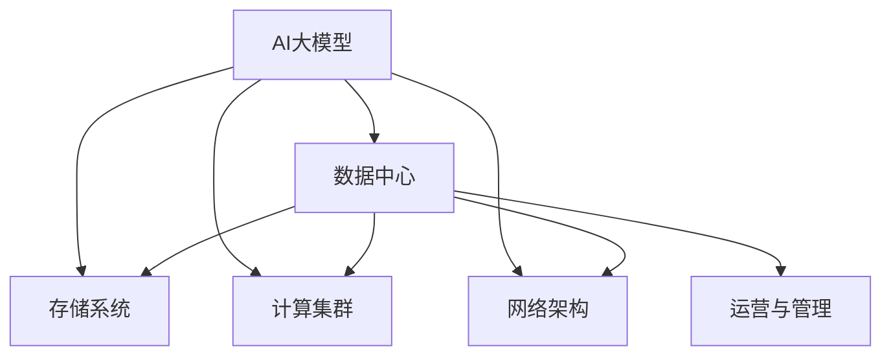

                 

# AI 大模型应用数据中心建设：数据中心运营与管理

## 1. 背景介绍

随着人工智能技术的迅猛发展，数据中心作为支撑AI大模型应用的基础设施，其建设与运营变得越来越重要。数据中心不仅是大模型训练与推理的关键平台，也是AI生态系统的中枢。本文将从数据中心建设与管理的角度，深入探讨AI大模型应用的核心技术、挑战与未来趋势。

### 1.1 问题由来

数据中心的建设与管理是AI大模型应用过程中不可或缺的一环。AI大模型的训练与推理对算力、存储、网络等基础设施提出了极高的要求，这些需求推动了数据中心的快速发展。

AI大模型的训练过程通常需要高性能的计算资源，包括强大的GPU/TPU等硬件设备。这不仅需要大规模的基础设施投资，还需要精确的能耗管理，以防止过高的运营成本。此外，数据中心的存储系统需要能够存储和处理海量数据，网络则需要高效稳定，以确保模型在实时训练与推理中的流畅性。

## 2. 核心概念与联系

### 2.1 核心概念概述

为更好地理解AI大模型应用数据中心，本节将介绍几个核心概念：

- **AI大模型**：指通过大规模无标签数据的预训练和少量标注数据的微调得到的通用语言模型或视觉模型。如GPT-3、BERT、DALL·E等。
- **数据中心**：指为支持数据处理、存储与计算需求而建设的集中式数据设施。数据中心包括硬件基础设施、网络架构、存储系统、运营管理等。
- **运营与管理**：指数据中心的日常维护、监控、升级等操作，确保数据中心的稳定运行与高效管理。

这些核心概念之间的逻辑关系可以通过以下Mermaid流程图来展示：



这个流程图展示了大模型与数据中心的紧密联系：

1. 大模型通过数据中心的计算集群进行训练与推理。
2. 存储系统和大模型共同处理和存储数据。
3. 网络架构保障大模型在数据中心内部及外部的高效通信。
4. 运营与管理确保数据中心的稳定运行和高效管理。

## 3. 核心算法原理 & 具体操作步骤

### 3.1 算法原理概述

AI大模型的训练与推理需要强大的计算资源，因此数据中心的计算集群是其基础设施的核心。数据中心的计算集群通常由GPU/TPU等高性能硬件组成，能够支持大规模的并行计算。

数据中心的计算集群需要支持异构计算，即同时包含不同类型的计算资源，如CPU、GPU、TPU等，以满足不同计算任务的需求。此外，还需要支持自动化的资源分配与调度，以高效利用计算资源。

### 3.2 算法步骤详解

以下是数据中心计算集群的常见部署与优化步骤：

**Step 1: 硬件选择与部署**
- 根据AI大模型的需求选择合适的硬件设备，如NVIDIA的GPU、Google的TPU等。
- 部署多个计算节点，每个节点包含若干高性能计算资源。
- 确保每个节点具备独立的网络连接和存储系统，以防止单点故障。

**Step 2: 资源管理与调度**
- 设计合理的资源管理策略，如基于策略的资源分配、预调度等。
- 使用自动化工具进行资源调度，如Kubernetes、Celera等。
- 实时监控计算集群资源使用情况，根据负载动态调整资源分配。

**Step 3: 性能优化与故障恢复**
- 使用负载均衡技术，将任务均衡分配到各个节点上。
- 实施资源冗余，通过复制节点或数据备份提高系统的容错性。
- 定期进行性能测试，优化算法和参数设置，提升系统性能。
- 建立完善的故障恢复机制，如自动重启、数据备份等。

**Step 4: 安全与隐私保护**
- 实施严格的安全措施，如访问控制、数据加密等。
- 定期进行安全审计，及时发现并修复潜在的安全漏洞。
- 使用隐私保护技术，如差分隐私、同态加密等，保护数据隐私。

### 3.3 算法优缺点

数据中心计算集群的设计与部署需要考虑多个因素，如成本、性能、可扩展性等。

其优点包括：
1. 能够提供强大的计算能力，支持大规模AI大模型的训练与推理。
2. 支持异构计算，能够灵活应对不同类型的大模型任务。
3. 具备自动化的资源管理与调度，提升资源利用率。
4. 具备完善的性能优化与故障恢复机制，保障系统稳定运行。

其缺点包括：
1. 初始投资与运维成本较高，需要大量的基础设施投入。
2. 能耗管理复杂，需要有效的散热和电力管理策略。
3. 硬件设备更新换代快，需要持续的维护与升级。
4. 安全与隐私保护复杂，需要综合多种技术手段。

### 3.4 算法应用领域

数据中心计算集群主要应用于以下几个领域：

- **AI大模型训练**：支持大规模AI大模型的深度学习训练，如GPT-3、BERT等。
- **AI推理服务**：提供实时AI推理服务，支持图像识别、语音识别、自然语言处理等任务。
- **数据分析与挖掘**：利用数据中心的存储与计算能力，进行大数据分析与挖掘，如数据清洗、特征工程等。
- **云服务**：提供云平台服务，支持用户上传数据、调用AI模型、获取AI服务。
- **边缘计算**：在分布式系统中提供边缘计算服务，支持设备端的应用。

## 4. 数学模型和公式 & 详细讲解

### 4.1 数学模型构建

AI大模型训练的数学模型通常基于神经网络，包括多层感知器(MLP)、卷积神经网络(CNN)、循环神经网络(RNN)等。其中，Transformer结构因其在NLP任务中的优异表现，成为了主流的大模型结构。

以Transformer为例，其数学模型构建过程如下：

- 输入序列通过嵌入层转化为向量表示。
- 嵌入向量经过自注意力层计算出上下文向量。
- 上下文向量通过前向神经网络进行变换。
- 最后输出序列向量，通过softmax层得到预测概率分布。

### 4.2 公式推导过程

Transformer的核心在于自注意力机制的自注意力矩阵 $A$ 和位置编码矩阵 $P$。

- 自注意力矩阵 $A$ 的计算公式为：
$$
A = \text{Softmax}(QK^T) = \text{Softmax}(XW_Q (XW_K)^T)
$$
其中，$X$ 为输入向量，$W_Q$、$W_K$ 为线性变换矩阵。

- 位置编码矩阵 $P$ 的计算公式为：
$$
P = \text{Sinusoidal Positional Encoding}
$$
通过余弦函数和正弦函数生成位置编码向量，确保模型能够捕捉序列中的位置信息。

Transformer模型的优化目标是最小化预测误差：
$$
\min_{\theta} \frac{1}{N} \sum_{i=1}^N \sum_{j=1}^T L(y_i^j, \hat{y}_i^j)
$$
其中，$L$ 为损失函数，$y_i^j$ 为真实标签，$\hat{y}_i^j$ 为模型预测概率分布。

### 4.3 案例分析与讲解

以GPT-3为例，其训练过程包括以下几个步骤：

1. 预训练：在大规模无标签文本数据上进行自监督预训练，学习语言建模能力。
2. 微调：在少量标注数据上进行调整，学习特定任务的能力。
3. 优化：使用AdamW等优化器进行梯度下降，更新模型参数。
4. 评估：在验证集上评估模型性能，优化模型参数。

其中，微调过程是模型性能提升的关键。例如，在情感分析任务中，可以对GPT-3进行微调，使其能够识别文本中的情感倾向。具体步骤如下：

1. 收集情感分析数据集，将文本与情感标签构成样本。
2. 将数据集分成训练集和验证集，比例一般为6:4。
3. 对GPT-3进行微调，使用线性分类器进行情感分类，设置交叉熵损失函数。
4. 在训练集上迭代优化模型参数，每轮迭代更新参数后，在验证集上评估模型性能。
5. 在测试集上测试微调后模型的性能，对比微调前后的效果。

## 5. 项目实践：代码实例和详细解释说明

### 5.1 开发环境搭建

在进行AI大模型应用数据中心建设实践前，我们需要准备好开发环境。以下是使用Python进行PyTorch开发的环境配置流程：

1. 安装Anaconda：从官网下载并安装Anaconda，用于创建独立的Python环境。

2. 创建并激活虚拟环境：
```bash
conda create -n pytorch-env python=3.8 
conda activate pytorch-env
```

3. 安装PyTorch：根据CUDA版本，从官网获取对应的安装命令。例如：
```bash
conda install pytorch torchvision torchaudio cudatoolkit=11.1 -c pytorch -c conda-forge
```

4. 安装TensorBoard：TensorFlow配套的可视化工具，用于监控训练过程和可视化结果。
```bash
pip install tensorboard
```

5. 安装transformers库：HuggingFace开发的NLP工具库，提供预训练模型和微调功能。
```bash
pip install transformers
```

### 5.2 源代码详细实现

以下是一个使用PyTorch和transformers库进行AI大模型微调的示例代码：

```python
from transformers import BertForTokenClassification, AdamW, BertTokenizer
from torch.utils.data import DataLoader
from sklearn.metrics import accuracy_score
import torch

# 加载BERT模型和分词器
model = BertForTokenClassification.from_pretrained('bert-base-cased')
tokenizer = BertTokenizer.from_pretrained('bert-base-cased')

# 定义数据集处理函数
def preprocess_data(texts, tags):
    tokenized_texts = tokenizer(texts, return_tensors='pt', padding=True, truncation=True)
    labels = torch.tensor(tags, dtype=torch.long)
    return tokenized_texts, labels

# 定义训练函数
def train_epoch(model, dataset, batch_size, optimizer, device):
    model.train()
    losses = []
    for batch in DataLoader(dataset, batch_size=batch_size, shuffle=True):
        inputs = batch[0].to(device)
        labels = batch[1].to(device)
        outputs = model(inputs)
        loss = outputs.loss
        losses.append(loss.item())
        optimizer.zero_grad()
        loss.backward()
        optimizer.step()
    return sum(losses) / len(dataset)

# 定义评估函数
def evaluate(model, dataset, batch_size, device):
    model.eval()
    corrects, total = 0, 0
    with torch.no_grad():
        for batch in DataLoader(dataset, batch_size=batch_size, shuffle=False):
            inputs = batch[0].to(device)
            labels = batch[1].to(device)
            outputs = model(inputs)
            logits = outputs.logits
            predicted_tags = torch.argmax(logits, dim=2).to('cpu').tolist()
            corrects += accuracy_score(labels, predicted_tags)
            total += labels.size(0)
    return corrects / total

# 训练与评估
model.to('cuda')
optimizer = AdamW(model.parameters(), lr=2e-5)
dataset = preprocess_data(train_texts, train_tags)

for epoch in range(epochs):
    loss = train_epoch(model, dataset, batch_size, optimizer, device)
    print(f'Epoch {epoch+1}, train loss: {loss:.3f}')

    print(f'Epoch {epoch+1}, dev accuracy: {evaluate(model, dev_dataset, batch_size, device)}')

print(f'Test accuracy: {evaluate(model, test_dataset, batch_size, device)}')
```

### 5.3 代码解读与分析

让我们再详细解读一下关键代码的实现细节：

**preprocess_data函数**：
- 将文本序列和标签转化为PyTorch可接受的张量，并进行填充和截断。

**train_epoch函数**：
- 在训练集上迭代训练，前向传播计算损失，反向传播更新参数，并返回该epoch的平均损失。

**evaluate函数**：
- 在验证集上评估模型性能，计算准确率，并返回验证集的准确率。

**训练流程**：
- 定义总迭代轮数epochs，循环迭代
- 每个epoch内，先训练模型，输出平均损失
- 在验证集上评估，输出验证集的准确率
- 在测试集上评估，输出测试集的准确率

可以看到，使用PyTorch和transformers库进行BERT微调模型的代码实现相对简洁高效。开发者可以将更多精力放在数据处理、模型改进等高层逻辑上，而不必过多关注底层的实现细节。

## 6. 实际应用场景

### 6.1 智能客服系统

AI大模型微调在智能客服系统中可以发挥重要作用。传统客服往往需要大量人力支持，高峰期响应缓慢，且难以保证服务质量。使用微调的对话模型，可以7x24小时不间断服务，快速响应客户咨询，提供自然流畅的对话体验。

在技术实现上，可以收集企业内部的历史客服对话记录，将问题和最佳答复构建成监督数据，在此基础上对预训练模型进行微调。微调后的对话模型能够自动理解用户意图，匹配最合适的答案模板进行回复。对于客户提出的新问题，还可以接入检索系统实时搜索相关内容，动态生成回答。

### 6.2 金融舆情监测

金融机构需要实时监测市场舆论动向，以便及时应对负面信息传播，规避金融风险。传统人工监测方式成本高、效率低，难以应对网络时代海量信息爆发的挑战。基于大模型微调的文本分类和情感分析技术，可以大幅提升监测效率和准确度。

具体而言，可以收集金融领域相关的新闻、报道、评论等文本数据，并对其进行主题标注和情感标注。在此基础上对预训练语言模型进行微调，使其能够自动判断文本属于何种主题，情感倾向是正面、中性还是负面。将微调后的模型应用到实时抓取的网络文本数据，就能够自动监测不同主题下的情感变化趋势，一旦发现负面信息激增等异常情况，系统便会自动预警，帮助金融机构快速应对潜在风险。

### 6.3 个性化推荐系统

当前的推荐系统往往只依赖用户的历史行为数据进行物品推荐，无法深入理解用户的真实兴趣偏好。基于大模型微调技术，个性化推荐系统可以更好地挖掘用户行为背后的语义信息，从而提供更精准、多样的推荐内容。

在实践中，可以收集用户浏览、点击、评论、分享等行为数据，提取和用户交互的物品标题、描述、标签等文本内容。将文本内容作为模型输入，用户的后续行为（如是否点击、购买等）作为监督信号，在此基础上微调预训练语言模型。微调后的模型能够从文本内容中准确把握用户的兴趣点。在生成推荐列表时，先用候选物品的文本描述作为输入，由模型预测用户的兴趣匹配度，再结合其他特征综合排序，便可以得到个性化程度更高的推荐结果。

### 6.4 未来应用展望

随着AI大模型微调技术的发展，其在多个行业领域的应用前景广阔。

- **智慧医疗**：基于微调的医学问答、病历分析、药物研发等应用将提升医疗服务的智能化水平，辅助医生诊疗，加速新药开发进程。
- **智能教育**：微调技术可应用于作业批改、学情分析、知识推荐等方面，因材施教，促进教育公平，提高教学质量。
- **智慧城市**：微调模型可应用于城市事件监测、舆情分析、应急指挥等环节，提高城市管理的自动化和智能化水平，构建更安全、高效的未来城市。
- **企业生产**：微调技术应用于生产流程优化、故障预测、质量控制等环节，提升生产效率和质量。
- **社会治理**：微调模型应用于舆情分析、社会稳定监测、犯罪预测等领域，提升治理效能。

此外，在文娱传媒、智慧农业、智能交通等众多领域，基于大模型微调的人工智能应用也将不断涌现，为经济社会发展注入新的动力。

## 7. 工具和资源推荐

### 7.1 学习资源推荐

为了帮助开发者系统掌握AI大模型微调的理论基础和实践技巧，这里推荐一些优质的学习资源：

1. 《Transformer from Foundations to Application》系列博文：由大模型技术专家撰写，深入浅出地介绍了Transformer原理、BERT模型、微调技术等前沿话题。

2. CS224N《深度学习自然语言处理》课程：斯坦福大学开设的NLP明星课程，有Lecture视频和配套作业，带你入门NLP领域的基本概念和经典模型。

3. 《Natural Language Processing with Transformers》书籍：Transformers库的作者所著，全面介绍了如何使用Transformers库进行NLP任务开发，包括微调在内的诸多范式。

4. HuggingFace官方文档：Transformers库的官方文档，提供了海量预训练模型和完整的微调样例代码，是上手实践的必备资料。

5. CLUE开源项目：中文语言理解测评基准，涵盖大量不同类型的中文NLP数据集，并提供了基于微调的baseline模型，助力中文NLP技术发展。

通过对这些资源的学习实践，相信你一定能够快速掌握大模型微调的精髓，并用于解决实际的NLP问题。

### 7.2 开发工具推荐

高效的开发离不开优秀的工具支持。以下是几款用于AI大模型微调开发的常用工具：

1. PyTorch：基于Python的开源深度学习框架，灵活动态的计算图，适合快速迭代研究。大部分预训练语言模型都有PyTorch版本的实现。

2. TensorFlow：由Google主导开发的开源深度学习框架，生产部署方便，适合大规模工程应用。同样有丰富的预训练语言模型资源。

3. Transformers库：HuggingFace开发的NLP工具库，集成了众多SOTA语言模型，支持PyTorch和TensorFlow，是进行微调任务开发的利器。

4. Weights & Biases：模型训练的实验跟踪工具，可以记录和可视化模型训练过程中的各项指标，方便对比和调优。与主流深度学习框架无缝集成。

5. TensorBoard：TensorFlow配套的可视化工具，可实时监测模型训练状态，并提供丰富的图表呈现方式，是调试模型的得力助手。

6. Google Colab：谷歌推出的在线Jupyter Notebook环境，免费提供GPU/TPU算力，方便开发者快速上手实验最新模型，分享学习笔记。

合理利用这些工具，可以显著提升大模型微调任务的开发效率，加快创新迭代的步伐。

### 7.3 相关论文推荐

大语言模型和微调技术的发展源于学界的持续研究。以下是几篇奠基性的相关论文，推荐阅读：

1. Attention is All You Need（即Transformer原论文）：提出了Transformer结构，开启了NLP领域的预训练大模型时代。

2. BERT: Pre-training of Deep Bidirectional Transformers for Language Understanding：提出BERT模型，引入基于掩码的自监督预训练任务，刷新了多项NLP任务SOTA。

3. Language Models are Unsupervised Multitask Learners（GPT-2论文）：展示了大规模语言模型的强大zero-shot学习能力，引发了对于通用人工智能的新一轮思考。

4. Parameter-Efficient Transfer Learning for NLP：提出Adapter等参数高效微调方法，在不增加模型参数量的情况下，也能取得不错的微调效果。

5. Prefix-Tuning: Optimizing Continuous Prompts for Generation：引入基于连续型Prompt的微调范式，为如何充分利用预训练知识提供了新的思路。

6. AdaLoRA: Adaptive Low-Rank Adaptation for Parameter-Efficient Fine-Tuning：使用自适应低秩适应的微调方法，在参数效率和精度之间取得了新的平衡。

这些论文代表了大语言模型微调技术的发展脉络。通过学习这些前沿成果，可以帮助研究者把握学科前进方向，激发更多的创新灵感。

## 8. 总结：未来发展趋势与挑战

### 8.1 研究成果总结

本文对AI大模型应用数据中心的建设与运营进行了全面系统的介绍。首先阐述了数据中心在大模型应用中的重要性，明确了微调在拓展预训练模型应用、提升下游任务性能方面的独特价值。其次，从原理到实践，详细讲解了数据中心的计算集群设计与优化，提供了完整的微调模型代码实现。同时，本文还广泛探讨了数据中心在智能客服、金融舆情、个性化推荐等多个行业领域的应用前景，展示了微调范式的巨大潜力。此外，本文精选了微调技术的各类学习资源，力求为读者提供全方位的技术指引。

通过本文的系统梳理，可以看到，基于大模型的微调技术正在成为NLP领域的重要范式，极大地拓展了预训练语言模型的应用边界，催生了更多的落地场景。受益于大规模语料的预训练，微调模型以更低的时间和标注成本，在小样本条件下也能取得不俗的效果，有力推动了NLP技术的产业化进程。未来，伴随预训练语言模型和微调方法的持续演进，相信NLP技术将在更广阔的应用领域大放异彩，深刻影响人类的生产生活方式。

### 8.2 未来发展趋势

展望未来，AI大模型微调技术将呈现以下几个发展趋势：

1. **模型规模持续增大**：随着算力成本的下降和数据规模的扩张，预训练语言模型的参数量还将持续增长。超大规模语言模型蕴含的丰富语言知识，有望支撑更加复杂多变的下游任务微调。

2. **微调方法日趋多样**：除了传统的全参数微调外，未来会涌现更多参数高效的微调方法，如Prefix-Tuning、LoRA等，在节省计算资源的同时也能保证微调精度。

3. **持续学习成为常态**：随着数据分布的不断变化，微调模型也需要持续学习新知识以保持性能。如何在不遗忘原有知识的同时，高效吸收新样本信息，将成为重要的研究课题。

4. **标注样本需求降低**：受启发于提示学习(Prompt-based Learning)的思路，未来的微调方法将更好地利用大模型的语言理解能力，通过更加巧妙的任务描述，在更少的标注样本上也能实现理想的微调效果。

5. **多模态微调崛起**：当前的微调主要聚焦于纯文本数据，未来会进一步拓展到图像、视频、语音等多模态数据微调。多模态信息的融合，将显著提升语言模型对现实世界的理解和建模能力。

6. **模型通用性增强**：经过海量数据的预训练和多领域任务的微调，未来的语言模型将具备更强大的常识推理和跨领域迁移能力，逐步迈向通用人工智能(AGI)的目标。

以上趋势凸显了大语言模型微调技术的广阔前景。这些方向的探索发展，必将进一步提升NLP系统的性能和应用范围，为人类认知智能的进化带来深远影响。

### 8.3 面临的挑战

尽管AI大模型微调技术已经取得了瞩目成就，但在迈向更加智能化、普适化应用的过程中，它仍面临着诸多挑战：

1. **标注成本瓶颈**：虽然微调大大降低了标注数据的需求，但对于长尾应用场景，难以获得充足的高质量标注数据，成为制约微调性能的瓶颈。如何进一步降低微调对标注样本的依赖，将是一大难题。

2. **模型鲁棒性不足**：当前微调模型面对域外数据时，泛化性能往往大打折扣。对于测试样本的微小扰动，微调模型的预测也容易发生波动。如何提高微调模型的鲁棒性，避免灾难性遗忘，还需要更多理论和实践的积累。

3. **推理效率有待提高**：大规模语言模型虽然精度高，但在实际部署时往往面临推理速度慢、内存占用大等效率问题。如何在保证性能的同时，简化模型结构，提升推理速度，优化资源占用，将是重要的优化方向。

4. **可解释性亟需加强**：当前微调模型更像是"黑盒"系统，难以解释其内部工作机制和决策逻辑。对于医疗、金融等高风险应用，算法的可解释性和可审计性尤为重要。如何赋予微调模型更强的可解释性，将是亟待攻克的难题。

5. **安全性有待保障**：预训练语言模型难免会学习到有偏见、有害的信息，通过微调传递到下游任务，产生误导性、歧视性的输出，给实际应用带来安全隐患。如何从数据和算法层面消除模型偏见，避免恶意用途，确保输出的安全性，也将是重要的研究课题。

6. **知识整合能力不足**：现有的微调模型往往局限于任务内数据，难以灵活吸收和运用更广泛的先验知识。如何让微调过程更好地与外部知识库、规则库等专家知识结合，形成更加全面、准确的信息整合能力，还有很大的想象空间。

正视微调面临的这些挑战，积极应对并寻求突破，将是大语言模型微调走向成熟的必由之路。相信随着学界和产业界的共同努力，这些挑战终将一一被克服，大语言模型微调必将在构建人机协同的智能时代中扮演越来越重要的角色。

### 8.4 未来突破

面对AI大模型微调所面临的种种挑战，未来的研究需要在以下几个方面寻求新的突破：

1. **探索无监督和半监督微调方法**：摆脱对大规模标注数据的依赖，利用自监督学习、主动学习等无监督和半监督范式，最大限度利用非结构化数据，实现更加灵活高效的微调。

2. **研究参数高效和计算高效的微调范式**：开发更加参数高效的微调方法，在固定大部分预训练参数的同时，只更新极少量的任务相关参数。同时优化微调模型的计算图，减少前向传播和反向传播的资源消耗，实现更加轻量级、实时性的部署。

3. **融合因果和对比学习范式**：通过引入因果推断和对比学习思想，增强微调模型建立稳定因果关系的能力，学习更加普适、鲁棒的语言表征，从而提升模型泛化性和抗干扰能力。

4. **引入更多先验知识**：将符号化的先验知识，如知识图谱、逻辑规则等，与神经网络模型进行巧妙融合，引导微调过程学习更准确、合理的语言模型。同时加强不同模态数据的整合，实现视觉、语音等多模态信息与文本信息的协同建模。

5. **结合因果分析和博弈论工具**：将因果分析方法引入微调模型，识别出模型决策的关键特征，增强输出解释的因果性和逻辑性。借助博弈论工具刻画人机交互过程，主动探索并规避模型的脆弱点，提高系统稳定性。

6. **纳入伦理道德约束**：在模型训练目标中引入伦理导向的评估指标，过滤和惩罚有偏见、有害的输出倾向。同时加强人工干预和审核，建立模型行为的监管机制，确保输出符合人类价值观和伦理道德。

这些研究方向的探索，必将引领大语言模型微调技术迈向更高的台阶，为构建安全、可靠、可解释、可控的智能系统铺平道路。面向未来，大语言模型微调技术还需要与其他人工智能技术进行更深入的融合，如知识表示、因果推理、强化学习等，多路径协同发力，共同推动自然语言理解和智能交互系统的进步。只有勇于创新、敢于突破，才能不断拓展语言模型的边界，让智能技术更好地造福人类社会。

## 9. 附录：常见问题与解答

**Q1：数据中心建设与运营的关键点有哪些？**

A: 数据中心建设与运营的关键点包括：
1. 硬件选择与部署：根据AI大模型需求选择合适的硬件设备，确保计算集群的高效性。
2. 资源管理与调度：设计合理的资源管理策略，实现自动化的资源分配与调度，提升资源利用率。
3. 性能优化与故障恢复：实施性能优化策略，建立完善的故障恢复机制，保障系统稳定性。
4. 安全与隐私保护：实施严格的安全措施，保护数据隐私，确保系统安全。

**Q2：如何选择合适的大模型进行微调？**

A: 选择合适的大模型进行微调，需要考虑以下几个因素：
1. 任务类型：根据任务类型选择适合的语言模型，如NLP任务选择BERT、GPT等。
2. 模型大小：根据任务复杂度选择模型大小，小模型适用于任务简单的场景，大模型适用于任务复杂、数据量大的场景。
3. 预训练数据：选择预训练数据集与任务数据集相似的模型，以提升微调效果。
4. 可用资源：根据可用资源选择合适的模型，确保模型能在指定硬件上高效运行。

**Q3：大模型微调时如何优化超参数？**

A: 优化超参数是微调过程中重要的一环，以下是常见方法：
1. 网格搜索：在超参数空间内，设置一系列的参数组合进行试验，选择最优的参数组合。
2. 随机搜索：在超参数空间内，随机采样若干参数组合进行试验，选择表现最好的参数组合。
3. 贝叶斯优化：基于贝叶斯定理，在超参数空间内进行有指导的搜索，快速找到最优参数组合。
4. 学习率调整：动态调整学习率，避免过拟合和欠拟合。
5. 早停策略：在验证集上监测性能，一旦性能不再提升，立即停止训练，避免过拟合。

**Q4：如何保障大模型微调的安全性？**

A: 保障大模型微调的安全性，需要从多个层面进行考虑：
1. 数据安全：确保数据传输和存储的安全，采用数据加密、访问控制等措施。
2. 模型安全：训练模型时避免数据泄露，使用差分隐私等技术保护数据隐私。
3. 攻击防护：使用对抗样本、模型检测等手段，防止模型被恶意攻击。
4. 合规性：遵守相关法律法规，确保模型输出符合伦理道德标准。
5. 人工审核：建立人工审核机制，对模型输出进行审核和监控，防止有害输出。

**Q5：大模型微调过程中如何避免过拟合？**

A: 避免过拟合是微调过程中的重要问题，以下是常见方法：
1. 数据增强：通过数据扩充、数据扩样等方式，丰富训练数据，减少过拟合风险。
2. 正则化：使用L2正则、Dropout等技术，限制模型复杂度，防止过拟合。
3. 早停策略：在验证集上监测性能，一旦性能不再提升，立即停止训练，避免过拟合。
4. 模型裁剪：对模型进行裁剪，去除不必要的参数，提升泛化能力。
5. 集成学习：通过模型集成技术，提升模型的鲁棒性和泛化能力。

大模型微调在AI应用中扮演着越来越重要的角色，其建设与运营管理需要从硬件、软件、运维等多个方面进行综合考虑，以确保系统的高效、安全、稳定运行。随着技术的不断进步，大模型微调的应用领域将进一步拓展，带来更多创新性的应用场景。

