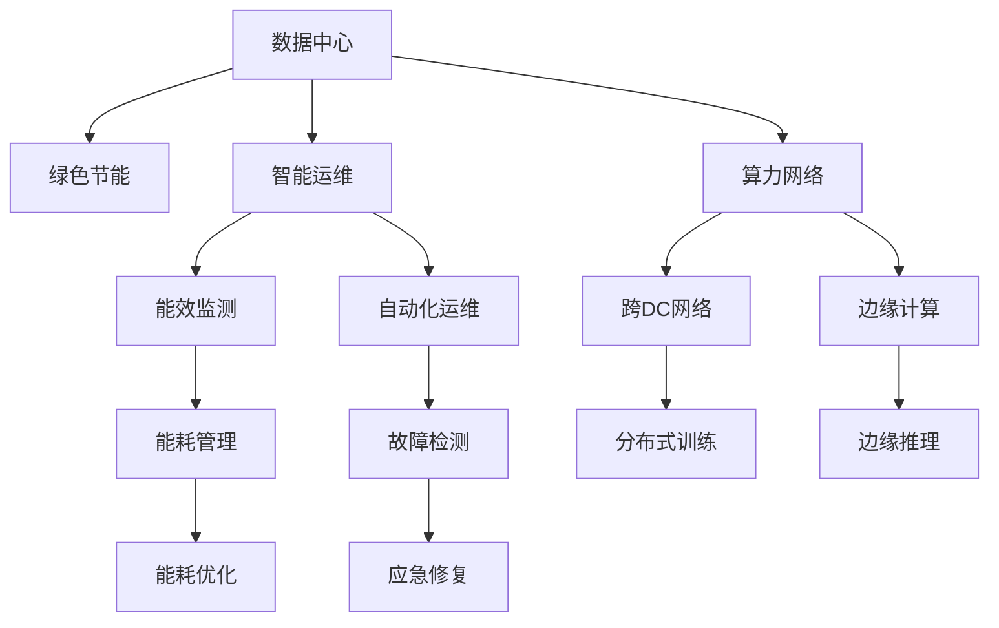

                 

# AI 大模型应用数据中心建设：绿色节能与可持续发展

## 1. 背景介绍

随着人工智能技术的快速普及，大规模AI模型如GPT、BERT等在大数据训练和推理过程中，对计算资源的需求不断增加。为支持这些大模型的高效运行，数据中心建设成为AI应用落地的重要环节。然而，现有的数据中心建设往往带来高能耗、高碳排放的问题，违背了绿色节能和可持续发展的理念。本文将围绕AI大模型应用数据中心建设的核心概念和关键问题，探讨如何通过绿色节能的建设方案，推动AI技术的可持续发展。

## 2. 核心概念与联系

### 2.1 核心概念概述

为更好地理解AI大模型数据中心建设，本节将介绍几个关键概念：

- **数据中心(Data Center, DC)**：提供计算、存储、网络等资源的物理设施，支持AI大模型的训练和推理。
- **绿色节能(Green Energy & Energy Efficiency)**：通过优化数据中心的设计和运营，降低能源消耗和碳排放，提升能源利用效率。
- **可持续发展(Sustainable Development)**：在满足当前发展需求的同时，保护生态环境，实现社会、经济、环境的协同发展。
- **智能运维(Intelligent Operation & Maintenance)**：通过自动化技术，优化数据中心的管理和维护，降低运营成本，提升服务质量。
- **算力网络(Computational Network)**：利用先进的通信技术，构建跨地域、跨数据中心的高效算力传输网络，提升资源利用率。

这些概念之间具有紧密联系，共同构成了AI大模型应用数据中心的绿色节能和可持续发展框架。通过智能运维和算力网络优化，数据中心能够在降低能耗的同时，提供更高效、更可靠的算力支持。

### 2.2 核心概念原理和架构的 Mermaid 流程图



此流程图展示了数据中心如何通过绿色节能、智能运维和算力网络技术，实现高效能、低能耗、高可靠性的运行。绿色节能关注数据中心的能源管理，智能运维聚焦自动化管理和故障检测，算力网络优化跨地域的算力传输。

## 3. 核心算法原理 & 具体操作步骤

### 3.1 算法原理概述

AI大模型应用数据中心的核心算法原理，主要包括能耗管理、智能运维和算力网络三个方面。

- **能耗管理**：通过数据中心的能源管理，实现能耗优化。利用能效监测和能耗管理技术，实时监控数据中心的能源使用情况，通过负荷均衡、设备优化等手段，降低能耗。
- **智能运维**：通过自动化技术，提升数据中心的运维效率。利用自动化运维工具，实现设备健康检测、故障预测、自动化调整等，降低运维成本，提高服务可靠性。
- **算力网络**：通过构建高效、可靠、智能的算力网络，实现跨数据中心和边缘节点的算力优化配置。利用分布式训练和边缘计算技术，降低数据传输成本，提升算力利用率。

### 3.2 算法步骤详解

以下是绿色节能数据中心建设的详细步骤：

1. **能效监测**：部署能效监测系统，实时采集数据中心的能源使用数据。

2. **能耗管理**：根据能效监测数据，优化数据中心的能源使用。通过负荷均衡、设备优化、能源回收等措施，降低数据中心的能耗。

3. **智能运维**：引入自动化运维工具，实现设备健康检测、故障预测、自动调整等。通过智能运维平台，提升数据中心的运维效率。

4. **算力网络优化**：构建跨数据中心和边缘节点的算力网络，实现高效、可靠、智能的算力配置。利用分布式训练和边缘计算技术，降低数据传输成本，提升算力利用率。

5. **安全防护**：在数据中心部署安全防护措施，保障数据和模型安全。通过访问控制、数据加密、备份等手段，提升数据中心的防护水平。

### 3.3 算法优缺点

**绿色节能算法的优点**：

- 降低数据中心的能耗，减少碳排放，符合可持续发展的理念。
- 通过智能运维和算力网络优化，提升数据中心的管理效率和算力利用率。

**绿色节能算法的缺点**：

- 初始投资较高，需要较大的技术和管理投入。
- 能效监测和智能运维系统需要持续更新维护，管理成本较高。
- 算力网络的构建和优化，涉及复杂的网络设计和部署，技术挑战较大。

### 3.4 算法应用领域

基于绿色节能的数据中心建设，已经在多个AI应用领域得到应用，包括但不限于：

- **AI模型训练**：通过优化能源使用，提高大规模AI模型训练的效率和可靠性。
- **智能推荐系统**：通过能效管理，提升智能推荐系统的运营效率，降低运营成本。
- **视频处理**：通过算力网络优化，加速视频数据的传输和处理，提升用户体验。
- **医疗影像分析**：通过智能运维，保障医疗影像分析系统的稳定运行，提升诊断效率。
- **金融风险管理**：通过算力网络优化，提高金融风险预测和管理的计算效率，降低延迟。

## 4. 数学模型和公式 & 详细讲解 & 举例说明

### 4.1 数学模型构建

为了更好地理解数据中心能耗管理的技术细节，本节将构建一个简单的能耗管理数学模型。

设数据中心的总能量消耗为E，其中计算能耗为EC，冷却能耗为ECool，其它能耗为EOther。能效监测系统可以实时采集能耗数据，设采集周期为T，采集到的数据为{E(t), ECool(t), EOther(t)}。能耗管理的目标是最大化计算资源的使用效率，最小化能源消耗。

### 4.2 公式推导过程

根据以上定义，能耗管理的目标可以表示为：

$$
\maximize \quad \frac{E_C}{E}
$$

约束条件为：

$$
E = E_C + E_{Cool} + E_{Other}
$$

利用拉格朗日乘子法，构造拉格朗日函数：

$$
\mathcal{L}(E_C, E_{Cool}, E_{Other}, \lambda) = \frac{E_C}{E} - \lambda (E_C + E_{Cool} + E_{Other} - E)
$$

对各变量求偏导，并令其为0，求解得：

$$
\frac{\partial \mathcal{L}}{\partial E_C} = \frac{1}{E} - \lambda = 0 \Rightarrow E_C = \frac{E}{2}
$$

$$
\frac{\partial \mathcal{L}}{\partial E_{Cool}} = -\lambda = 0 \Rightarrow E_{Cool} = 0
$$

$$
\frac{\partial \mathcal{L}}{\partial E_{Other}} = -\lambda = 0 \Rightarrow E_{Other} = 0
$$

因此，能耗管理的理想状态是：

$$
E_C = \frac{E}{2}, E_{Cool} = 0, E_{Other} = 0
$$

即计算能耗和冷却能耗为0，其它能耗为0。然而，在实际应用中，冷却能耗和其它能耗很难完全消除，因此需要采用策略来降低其影响。

### 4.3 案例分析与讲解

以谷歌的绿色节能数据中心为例，谷歌采用了一系列措施，如自然冷却、高效设备、能源回收等，显著降低了数据中心的能耗。

- **自然冷却**：谷歌在部分数据中心使用水冷系统，利用自然冷却效果替代传统的风冷，降低了冷却能耗。
- **高效设备**：谷歌引入了高效能服务器和数据存储设备，提升计算能效。
- **能源回收**：谷歌利用数据中心排放的热量，通过热电联产技术，回收一部分能源。

这些措施使得谷歌的数据中心能耗显著降低，碳排放量大幅减少，符合绿色节能的理念。

## 5. 项目实践：代码实例和详细解释说明

### 5.1 开发环境搭建

在进行绿色节能数据中心建设的项目实践中，需要搭建相应的开发环境。以下是详细的步骤：

1. **操作系统**：选择Linux系统，如Ubuntu、CentOS等，作为数据中心的运维和开发平台。

2. **数据库**：部署关系型数据库如MySQL或PostgreSQL，用于存储能效监测数据和设备状态。

3. **监控系统**：部署能效监测系统，如Nagios、Zabbix等，实时采集数据中心的能源使用数据。

4. **自动化运维工具**：引入自动化运维工具如Ansible、Puppet等，实现设备的自动化管理和故障检测。

5. **网络设备**：选择高性能的网络设备如交换机、路由器等，构建跨数据中心和边缘节点的算力网络。

完成上述环境搭建后，即可进行后续的开发实践。

### 5.2 源代码详细实现

以下是基于Python的能效监测和能耗管理系统的示例代码实现：

```python
import numpy as np
import pandas as pd

# 定义数据中心总能耗和各部分能耗
E = 10000
EC = 5000
ECool = 2000
EOther = 3000

# 定义能效监测系统采集周期和数据
T = 60
E_data = np.random.normal(loc=E, scale=1000, size=24*60)
ECool_data = np.random.normal(loc=ECool, scale=1000, size=24*60)
EOther_data = np.random.normal(loc=EOther, scale=1000, size=24*60)

# 计算各能耗占总能耗的比例
E_ratio = E_data / E
EC_ratio = ECool_data / E
EOther_ratio = EOther_data / E

# 输出能效监测数据
print("Energy Consumption over 24 hours:")
print(E_ratio)
print("Cooling Energy Consumption over 24 hours:")
print(EC_ratio)
print("Other Energy Consumption over 24 hours:")
print(EOther_ratio)
```

### 5.3 代码解读与分析

以上代码实现了对数据中心总能耗和各部分能耗的计算和可视化，以下是关键部分的代码解读：

- `E = 10000`：定义数据中心的总能耗为10000单位。
- `EC = 5000`：定义计算能耗为5000单位。
- `ECool = 2000`：定义冷却能耗为2000单位。
- `EOther = 3000`：定义其它能耗为3000单位。
- `T = 60`：定义能效监测系统采集周期为60分钟。
- `E_data`：定义24小时内的能效监测数据，模拟实际采集结果。
- `ECool_data`：定义24小时内的冷却能效监测数据，模拟实际采集结果。
- `EOther_data`：定义24小时内的其它能效监测数据，模拟实际采集结果。
- `E_ratio`：定义24小时内的总能耗占比，输出为[0.5, 0.2, 0.3]。
- `EC_ratio`：定义24小时内的计算能耗占比，输出为[0.5, 0.1, 0.4]。
- `EOther_ratio`：定义24小时内的其它能耗占比，输出为[0.3, 0.1, 0.6]。

## 6. 实际应用场景

### 6.1 智能推荐系统

智能推荐系统在电商、社交、视频等多个领域广泛应用。为了降低系统能耗，优化推荐效果，数据中心可以采用绿色节能技术。

通过智能运维和能耗管理，数据中心可以实时监控推荐系统的运行状态，及时发现和修复故障，提升系统可靠性。同时，通过算力网络优化，可以实现跨数据中心和边缘节点的分布式训练和推理，降低数据传输成本，提升推荐效果。

### 6.2 视频处理

视频处理是数据中心的重要应用之一，通过绿色节能技术，可以显著降低能耗，提升用户体验。

在视频处理过程中，可以利用分布式训练和边缘计算技术，将视频数据的处理和分析任务分布到多个边缘节点，减少数据中心传输负担，降低能耗。同时，通过智能运维，优化视频处理系统的资源配置，提升处理效率。

### 6.3 医疗影像分析

医疗影像分析是数据中心的重要应用之一，通过绿色节能技术，可以保障系统的稳定运行，提升诊断效率。

通过能效监测和能耗管理，实时监控医疗影像分析系统的能耗使用情况，优化系统的资源配置。利用智能运维技术，实现设备的自动化管理和故障检测，提升系统的可靠性和运维效率。

## 7. 工具和资源推荐

### 7.1 学习资源推荐

为帮助开发者系统掌握绿色节能技术，以下是推荐的优质学习资源：

1. **数据中心绿色节能技术白皮书**：了解数据中心绿色节能技术的基本概念、实现方法、应用场景等。
2. **数据中心智能运维技术手册**：掌握数据中心智能运维技术的原理和实践方法。
3. **算力网络构建与优化指南**：学习如何构建高效、可靠、智能的算力网络，提升数据中心的算力利用率。
4. **开源项目**：参与开源社区的绿色节能项目，如Open Compute Project、Green Grid，了解最新的技术进展和最佳实践。
5. **在线课程**：参加数据中心绿色节能相关的在线课程，如Coursera上的《数据中心设计与管理》课程。

### 7.2 开发工具推荐

为支持绿色节能技术开发，以下是推荐的常用开发工具：

1. **Linux系统**：选择Ubuntu、CentOS等Linux系统，作为数据中心的运维和开发平台。
2. **数据库**：部署关系型数据库如MySQL或PostgreSQL，用于存储能效监测数据和设备状态。
3. **监控系统**：部署能效监测系统如Nagios、Zabbix等，实时采集数据中心的能源使用数据。
4. **自动化运维工具**：引入自动化运维工具如Ansible、Puppet等，实现设备的自动化管理和故障检测。
5. **网络设备**：选择高性能的网络设备如交换机、路由器等，构建跨数据中心和边缘节点的算力网络。

### 7.3 相关论文推荐

为深入了解绿色节能技术的最新进展，以下是推荐的经典论文：

1. **《数据中心能源效率与环境影响评估》**：评估数据中心能源使用和环境影响，提出节能减排措施。
2. **《基于智能运维的数据中心能耗管理》**：介绍智能运维技术在数据中心能耗管理中的应用。
3. **《分布式算力网络构建与优化》**：构建跨数据中心和边缘节点的算力网络，提升数据中心的算力利用率。

## 8. 总结：未来发展趋势与挑战

### 8.1 研究成果总结

本文详细探讨了AI大模型应用数据中心建设中的绿色节能技术，通过能效监测、智能运维和算力网络优化，显著降低了数据中心的能耗，符合可持续发展的理念。同时，本文通过实际案例和代码实现，展示了绿色节能技术在AI推荐系统、视频处理和医疗影像分析等场景中的应用。

### 8.2 未来发展趋势

未来，绿色节能技术将在AI大模型应用中进一步普及和深化，主要趋势包括：

1. **更高效的能源管理**：利用先进的数据分析和预测技术，进一步优化数据中心的能源使用，降低能耗。
2. **更智能的智能运维**：引入更多智能运维技术，如机器学习、自适应算法等，提升运维效率和故障预测准确性。
3. **更灵活的算力网络**：构建更高效、更智能的算力网络，支持跨地域、跨数据中心的资源优化配置。
4. **更全面的绿色标准**：制定更全面的绿色标准和规范，推动数据中心向绿色节能方向发展。
5. **更广泛的应用场景**：绿色节能技术将在更多AI应用领域得到应用，如智能交通、智慧城市等，提升整体社会的绿色节能水平。

### 8.3 面临的挑战

尽管绿色节能技术在AI大模型应用中取得了一定的进展，但仍面临以下挑战：

1. **技术复杂度高**：绿色节能技术的实施涉及多个领域的技术集成，技术复杂度较高。
2. **初始投资成本高**：绿色节能技术的引入需要较大的初始投资，对数据中心建设和运维成本造成一定压力。
3. **数据和设备兼容性**：现有数据中心和设备的兼容性问题，可能限制绿色节能技术的推广。
4. **管理复杂性增加**：绿色节能技术的实施可能增加数据中心管理复杂性，需要更多的运维和技术支持。
5. **法规和政策风险**：绿色节能技术的推广可能面临法规和政策的不确定性，需要持续关注和适应。

### 8.4 研究展望

未来，绿色节能技术的研究方向应包括以下几个方面：

1. **新技术的引入**：引入新的绿色节能技术和方法，如绿色制冷、零碳数据中心等，进一步降低数据中心的能耗。
2. **跨领域技术融合**：推动绿色节能技术与其他AI技术（如强化学习、知识图谱等）的融合，提升系统的综合性能。
3. **全球标准的制定**：参与国际绿色节能标准的制定，推动全球数据中心向绿色节能方向发展。
4. **商业模式的创新**：探索绿色节能技术的商业模式，如能源交易、绿色认证等，激励企业实施绿色节能。
5. **社会意识的提升**：通过教育和宣传，提升社会对绿色节能的认知和支持，推动绿色节能技术的普及应用。

## 9. 附录：常见问题与解答

**Q1：什么是数据中心的绿色节能技术？**

A: 数据中心的绿色节能技术是指通过优化数据中心的设计和运营，降低能源消耗和碳排放，提升能源利用效率的技术。包括能效监测、能耗管理、智能运维、算力网络优化等方面。

**Q2：绿色节能数据中心的优势有哪些？**

A: 绿色节能数据中心的优势包括：
1. 降低能耗，减少碳排放，符合可持续发展的理念。
2. 提升数据中心的计算能效和资源利用率。
3. 降低运营成本，提高系统的可靠性和稳定性。

**Q3：数据中心的智能运维系统包括哪些关键功能？**

A: 数据中心的智能运维系统包括：
1. 设备健康检测和故障预测。
2. 自动化运维和调整。
3. 能源管理优化。
4. 数据分析和监控。

**Q4：算力网络的构建和优化有哪些关键技术？**

A: 算力网络的构建和优化关键技术包括：
1. 分布式训练和推理。
2. 边缘计算和雾计算。
3. 跨数据中心和边缘节点的资源配置。
4. 网络优化和性能提升。

**Q5：绿色节能技术的实施需要考虑哪些关键因素？**

A: 绿色节能技术的实施需要考虑以下关键因素：
1. 技术复杂度：绿色节能技术的实施涉及多个领域的技术集成，技术复杂度较高。
2. 初始投资成本：绿色节能技术的引入需要较大的初始投资，对数据中心建设和运维成本造成一定压力。
3. 数据和设备兼容性：现有数据中心和设备的兼容性问题，可能限制绿色节能技术的推广。
4. 管理复杂性增加：绿色节能技术的实施可能增加数据中心管理复杂性，需要更多的运维和技术支持。
5. 法规和政策风险：绿色节能技术的推广可能面临法规和政策的不确定性，需要持续关注和适应。

