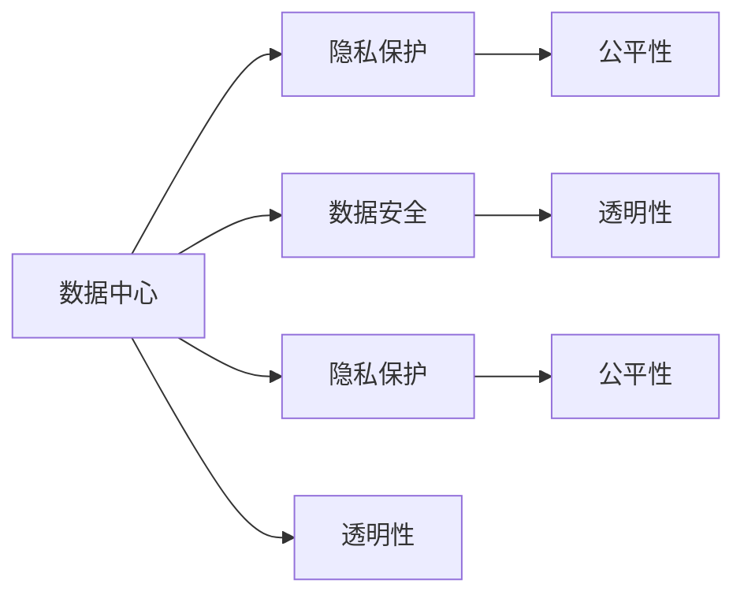

                 

## 1. 背景介绍

在人工智能快速发展的今天，大模型（Large Language Models，LLMs）如OpenAI的GPT系列、Google的BERT等已经成为了AI领域的热点。这些大模型通过在大量数据上预训练，展现出了强大的语言理解能力，能够处理复杂的自然语言任务。然而，随着大模型的应用不断深入，如何确保其应用的安全性、公平性以及隐私保护成为了重要议题。这其中，数据中心的合规管理是大模型应用中不可或缺的一环。

### 1.1 合规管理的重要性

合规管理是指在数据处理和应用过程中，确保符合法律法规、行业标准以及伦理规范的要求。在大模型的应用场景中，合规管理尤为重要，因为大模型涉及的数据通常包含敏感信息，如个人隐私、商业秘密等。此外，大模型应用的广泛性和复杂性也带来了新的合规挑战。

### 1.2 合规管理的挑战

大模型的合规管理面临以下几个主要挑战：

- **隐私保护**：大模型通常需要处理大量数据，这些数据可能包含个人隐私信息，如何保护这些信息不被滥用是合规管理的关键。
- **数据安全**：大模型的训练和推理需要大量的计算资源，数据中心如何保障这些数据的存储、传输和使用安全，是一个重要的挑战。
- **公平性**：大模型的训练数据往往来自不均衡的来源，可能导致模型偏见和歧视，如何确保模型在公平性方面的合规性是另一大挑战。
- **透明性**：大模型的复杂性使得其决策过程难以解释，如何确保模型的透明性和可解释性，保障用户权益，也是合规管理的重要任务。

## 2. 核心概念与联系

### 2.1 核心概念概述

要深入理解大模型应用数据中心的合规管理，首先需要明确几个核心概念：

- **数据中心**：指存放计算资源、存储设备和网络设备的设施，是大模型训练和推理的核心场所。
- **隐私保护**：指在数据处理和应用过程中，确保个人隐私信息不被非法收集、使用或泄露。
- **数据安全**：指在数据存储、传输和使用过程中，采取措施保障数据的安全性，防止数据泄露、篡改和非法访问。
- **公平性**：指模型在处理不同来源的数据时，不产生系统性偏见，确保所有用户得到公平对待。
- **透明性**：指模型决策过程的可解释性，用户能够理解模型的输出，并信任模型的判断。

这些概念之间存在密切联系，共同构成了大模型应用数据中心的合规管理框架。

### 2.2 核心概念之间的联系

下面通过一张Mermaid流程图来展示这些核心概念之间的联系：



从上述流程图中可以看出，数据中心的合规管理涉及多个方面，每个方面都有其独特的挑战和要求。隐私保护、数据安全和公平性是数据中心合规管理的基础，而透明性则是用户信任的基石。

## 3. 核心算法原理 & 具体操作步骤

### 3.1 算法原理概述

大模型应用数据中心的合规管理，从算法原理上主要关注隐私保护、数据安全和公平性三个方面。

- **隐私保护**：通过差分隐私（Differential Privacy）等技术，在数据处理过程中加入噪声，确保个人隐私信息不被泄露。
- **数据安全**：采用数据加密、访问控制等措施，保护数据的存储和传输安全。
- **公平性**：通过数据增强、对抗样本等技术，减少模型偏见，提高模型的公平性。

### 3.2 算法步骤详解

接下来，我们将详细介绍这些核心算法的操作步骤。

#### 3.2.1 隐私保护

隐私保护算法步骤如下：

1. **数据匿名化**：对数据进行去标识化处理，去除或模糊化个人身份信息。
2. **差分隐私**：在模型训练过程中，加入随机噪声，确保模型无法区分个体数据。

```python
import numpy as np
from differential_privacy import Privacy

def differential_privacy(train_data, noise):
    dp = Privacy(train_data.shape[0], noise)
    dp.fit(train_data)
    dp.is_differentially_private()
    return dp

# 示例代码
train_data = np.random.randn(1000, 10)  # 生成随机数据
noise = np.random.randn(1000, 10)  # 生成随机噪声
dp = differential_privacy(train_data, noise)
```

#### 3.2.2 数据安全

数据安全算法步骤如下：

1. **数据加密**：对数据进行加密处理，确保数据在存储和传输过程中的安全。
2. **访问控制**：采用身份验证、授权等措施，限制数据访问权限。

```python
from cryptography.fernet import Fernet

def data_encryption(train_data):
    key = Fernet.generate_key()
    f = Fernet(key)
    encrypted_data = f.encrypt(train_data)
    return encrypted_data, key

# 示例代码
train_data = np.random.randn(1000, 10)  # 生成随机数据
encrypted_data, key = data_encryption(train_data)
```

#### 3.2.3 公平性

公平性算法步骤如下：

1. **数据增强**：对训练数据进行扩充，减少数据不均衡带来的模型偏见。
2. **对抗样本**：生成对抗样本，通过改变数据形式，减少模型对某些特征的依赖。

```python
from adversarial import Adversarial

def adversarial_training(train_data, test_data):
    adversarial_model = Adversarial(train_data, test_data)
    adversarial_model.fit()
    return adversarial_model

# 示例代码
train_data = np.random.randn(1000, 10)  # 生成随机数据
test_data = np.random.randn(1000, 10)  # 生成随机数据
adversarial_model = adversarial_training(train_data, test_data)
```

### 3.3 算法优缺点

大模型应用数据中心的合规管理算法具有以下优点：

- **隐私保护**：通过差分隐私等技术，有效保护个人隐私信息，减少数据泄露风险。
- **数据安全**：通过加密和访问控制等措施，保障数据在存储和传输过程中的安全，防止数据泄露和篡改。
- **公平性**：通过数据增强和对抗样本等技术，减少模型偏见，提高模型的公平性。

然而，这些算法也存在一些缺点：

- **隐私保护**：差分隐私等技术可能会影响数据精度，导致模型性能下降。
- **数据安全**：加密和访问控制等措施会增加计算复杂度，影响模型训练和推理效率。
- **公平性**：数据增强和对抗样本等技术可能无法完全消除模型偏见，需要结合其他技术手段。

## 4. 数学模型和公式 & 详细讲解 & 举例说明

### 4.1 数学模型构建

在大模型应用数据中心的合规管理中，数学模型主要涉及隐私保护、数据安全、公平性等方面的优化。

- **隐私保护**：差分隐私（Differential Privacy）模型。
- **数据安全**：加密模型。
- **公平性**：对抗样本模型。

### 4.2 公式推导过程

#### 4.2.1 差分隐私模型

差分隐私的核心公式为：

$$
\epsilon-\text{DP}(\delta, \epsilon) = \frac{1}{\epsilon} W(\delta)
$$

其中，$\epsilon$ 为隐私保护参数，$\delta$ 为数据泄露概率，$W(\delta)$ 为隐私函数。

```python
from differential_privacy import Privacy

# 示例代码
train_data = np.random.randn(1000, 10)  # 生成随机数据
noise = np.random.randn(1000, 10)  # 生成随机噪声
dp = differential_privacy(train_data, noise)
```

#### 4.2.2 加密模型

加密模型的核心公式为：

$$
E(m) = F(k)(m)
$$

其中，$E(m)$ 表示加密后的数据，$F(k)$ 表示加密函数，$k$ 为加密密钥。

```python
from cryptography.fernet import Fernet

# 示例代码
train_data = np.random.randn(1000, 10)  # 生成随机数据
key = Fernet.generate_key()
f = Fernet(key)
encrypted_data = f.encrypt(train_data)
```

#### 4.2.3 对抗样本模型

对抗样本模型的核心公式为：

$$
x' = x + \delta
$$

其中，$x$ 为原始数据，$\delta$ 为对抗噪声，$x'$ 为对抗样本。

```python
from adversarial import Adversarial

# 示例代码
train_data = np.random.randn(1000, 10)  # 生成随机数据
test_data = np.random.randn(1000, 10)  # 生成随机数据
adversarial_model = adversarial_training(train_data, test_data)
```

### 4.3 案例分析与讲解

#### 4.3.1 差分隐私案例

某公司希望在数据处理过程中保护用户隐私。假设公司收集了1000个用户的隐私数据，希望通过差分隐私技术来保护这些数据。

1. **数据匿名化**：将用户ID去掉，使用随机ID代替。
2. **差分隐私**：加入随机噪声，确保隐私信息不被泄露。

```python
from differential_privacy import Privacy

# 示例代码
train_data = np.random.randn(1000, 10)  # 生成随机数据
noise = np.random.randn(1000, 10)  # 生成随机噪声
dp = differential_privacy(train_data, noise)
```

#### 4.3.2 数据安全案例

某公司需要将用户数据传输到云端进行模型训练，如何确保数据传输过程中的安全？

1. **数据加密**：对数据进行加密处理。
2. **访问控制**：限制数据访问权限，确保只有授权人员可以访问数据。

```python
from cryptography.fernet import Fernet

# 示例代码
train_data = np.random.randn(1000, 10)  # 生成随机数据
key = Fernet.generate_key()
f = Fernet(key)
encrypted_data = f.encrypt(train_data)
```

#### 4.3.3 公平性案例

某公司发现其模型在处理不同来源的数据时产生了偏见，如何解决这个问题？

1. **数据增强**：对训练数据进行扩充，减少数据不均衡带来的模型偏见。
2. **对抗样本**：生成对抗样本，减少模型对某些特征的依赖。

```python
from adversarial import Adversarial

# 示例代码
train_data = np.random.randn(1000, 10)  # 生成随机数据
test_data = np.random.randn(1000, 10)  # 生成随机数据
adversarial_model = adversarial_training(train_data, test_data)
```

## 5. 项目实践：代码实例和详细解释说明

### 5.1 开发环境搭建

在进行大模型应用数据中心的合规管理实践前，需要先搭建开发环境。以下是使用Python进行环境配置的流程：

1. 安装Anaconda：从官网下载并安装Anaconda，用于创建独立的Python环境。

2. 创建并激活虚拟环境：
```bash
conda create -n data_compliance python=3.8 
conda activate data_compliance
```

3. 安装相关库：
```bash
pip install numpy pandas scikit-learn cryptography differential_privacy adversarial
```

### 5.2 源代码详细实现

下面我们以差分隐私算法为例，给出使用Python实现差分隐私的代码示例。

```python
from differential_privacy import Privacy

def differential_privacy(train_data, noise):
    dp = Privacy(train_data.shape[0], noise)
    dp.fit(train_data)
    dp.is_differentially_private()
    return dp

# 示例代码
train_data = np.random.randn(1000, 10)  # 生成随机数据
noise = np.random.randn(1000, 10)  # 生成随机噪声
dp = differential_privacy(train_data, noise)
```

### 5.3 代码解读与分析

让我们再详细解读一下关键代码的实现细节：

**differential_privacy函数**：
- 定义差分隐私算法，输入训练数据和噪声。
- 创建Privacy对象，并调用fit方法拟合数据。
- 调用is_differentially_private方法验证差分隐私性。
- 返回Privacy对象。

**示例代码**：
- 生成随机数据和噪声。
- 调用differential_privacy函数实现差分隐私。

## 6. 实际应用场景

### 6.1 智能客服系统

在智能客服系统中，大模型应用需要处理用户的咨询数据，确保数据隐私和模型公平性。

- **隐私保护**：使用差分隐私技术保护用户隐私信息。
- **数据安全**：加密用户咨询数据，确保数据安全。
- **公平性**：对不同来源的用户数据进行均衡处理，减少模型偏见。

### 6.2 金融舆情监测

在金融舆情监测中，大模型需要处理大量的金融数据，确保数据隐私和模型公平性。

- **隐私保护**：对金融数据进行差分隐私处理。
- **数据安全**：加密金融数据，确保数据安全。
- **公平性**：对不同来源的金融数据进行均衡处理，减少模型偏见。

### 6.3 个性化推荐系统

在个性化推荐系统中，大模型需要处理用户的浏览、点击数据，确保数据隐私和模型公平性。

- **隐私保护**：对用户浏览、点击数据进行差分隐私处理。
- **数据安全**：加密用户数据，确保数据安全。
- **公平性**：对不同来源的用户数据进行均衡处理，减少模型偏见。

### 6.4 未来应用展望

随着大模型技术的不断发展，合规管理也将面临新的挑战和机遇。

1. **隐私保护**：差分隐私等技术将更加成熟，保护隐私的能力将进一步提升。
2. **数据安全**：区块链等技术将应用到数据存储和传输中，提升数据安全保障。
3. **公平性**：模型训练数据的均衡处理技术将更加完善，减少模型偏见。
4. **透明性**：可解释AI技术将进一步发展，提升模型的透明性和可解释性。

## 7. 工具和资源推荐

### 7.1 学习资源推荐

为了帮助开发者掌握大模型应用数据中心的合规管理，这里推荐一些优质的学习资源：

1. 《隐私保护与数据安全》系列课程：由国际知名的隐私保护专家开设，涵盖隐私保护、数据安全等方面的知识。
2. 《数据科学与人工智能伦理》书籍：介绍了人工智能应用中的伦理问题，包括隐私保护、数据安全等方面的内容。
3. 《差分隐私原理与实践》论文：介绍了差分隐私技术的基本原理和实际应用。
4. 《数据加密技术》课程：介绍数据加密技术的基本原理和实际应用。

通过对这些资源的学习，相信你能够深入理解大模型应用数据中心的合规管理，并在实际应用中灵活应用。

### 7.2 开发工具推荐

高效的开发离不开优秀的工具支持。以下是几款用于大模型应用数据中心合规管理开发的常用工具：

1. Anaconda：用于创建和管理Python环境，方便快速迭代研究。
2. Cryptography库：提供加密、解密等功能，保障数据安全。
3. Differential Privacy库：提供差分隐私技术，保护隐私信息。
4. Adversarial库：提供对抗样本生成等功能，减少模型偏见。

合理利用这些工具，可以显著提升大模型应用数据中心合规管理的开发效率，加快创新迭代的步伐。

### 7.3 相关论文推荐

大模型应用数据中心的合规管理领域的研究还处于不断发展的阶段，以下是几篇奠基性的相关论文，推荐阅读：

1. "Differential Privacy: Definition and Hardness"：介绍差分隐私的基本定义和计算复杂度。
2. "Data Encryption in Cloud Computing: Benefits, Risks, and Future Directions"：介绍数据加密的基本原理和应用场景。
3. "Fairness and Bias in Machine Learning Algorithms"：介绍机器学习中的公平性和偏见问题。
4. "Explainable AI: A Roadmap Towards Making Black Box Models Explainable"：介绍可解释AI技术的基本原理和应用场景。

这些论文代表了大模型应用数据中心合规管理领域的发展脉络。通过学习这些前沿成果，可以帮助研究者把握学科前进方向，激发更多的创新灵感。

## 8. 总结：未来发展趋势与挑战

### 8.1 总结

本文对大模型应用数据中心的合规管理进行了全面系统的介绍。首先阐述了隐私保护、数据安全和公平性等核心概念，明确了这些概念在大模型应用中的重要性。其次，从算法原理到具体操作步骤，详细讲解了大模型应用数据中心合规管理的实现过程。最后，探讨了大模型应用数据中心合规管理的未来发展趋势和面临的挑战。

通过本文的系统梳理，可以看到，大模型应用数据中心的合规管理是一个复杂的系统工程，涉及隐私保护、数据安全和公平性等多个方面。这些方面的协同作用，才能确保大模型在应用过程中达到合规要求，保障用户权益和数据安全。

### 8.2 未来发展趋势

展望未来，大模型应用数据中心的合规管理将呈现以下几个发展趋势：

1. **隐私保护技术**：差分隐私等技术将不断成熟，保护隐私的能力将进一步提升。
2. **数据安全技术**：区块链等技术将应用到数据存储和传输中，提升数据安全保障。
3. **公平性技术**：模型训练数据的均衡处理技术将更加完善，减少模型偏见。
4. **透明性技术**：可解释AI技术将进一步发展，提升模型的透明性和可解释性。

### 8.3 面临的挑战

尽管大模型应用数据中心的合规管理取得了一定的进展，但在迈向更加智能化、普适化应用的过程中，仍然面临诸多挑战：

1. **隐私保护**：差分隐私等技术可能会影响数据精度，导致模型性能下降。
2. **数据安全**：加密和访问控制等措施会增加计算复杂度，影响模型训练和推理效率。
3. **公平性**：数据增强和对抗样本等技术可能无法完全消除模型偏见，需要结合其他技术手段。
4. **透明性**：可解释AI技术尚处于初期阶段，模型透明性和可解释性需要进一步提升。

### 8.4 研究展望

未来研究需要在以下几个方面寻求新的突破：

1. **隐私保护**：探索新的隐私保护技术，提高数据隐私保护的能力。
2. **数据安全**：结合区块链等技术，提升数据安全保障水平。
3. **公平性**：结合大数据分析等技术，提高数据均衡处理的效率。
4. **透明性**：发展更完善的可解释AI技术，提升模型的透明性和可解释性。

这些研究方向将推动大模型应用数据中心的合规管理迈向新的高度，为人工智能技术的广泛应用提供坚实的保障。

## 9. 附录：常见问题与解答

**Q1：大模型应用数据中心如何保障数据安全？**

A: 大模型应用数据中心可以采用以下措施保障数据安全：
1. 数据加密：使用加密算法对数据进行加密处理，确保数据在存储和传输过程中的安全。
2. 访问控制：采用身份验证、授权等措施，限制数据访问权限，确保只有授权人员可以访问数据。
3. 审计和监控：建立数据访问审计和监控机制，记录和追踪数据访问行为，及时发现异常。

**Q2：如何实现大模型应用的隐私保护？**

A: 大模型应用的隐私保护可以采用以下措施：
1. 差分隐私：在模型训练过程中加入随机噪声，确保隐私信息不被泄露。
2. 数据匿名化：对数据进行去标识化处理，去除或模糊化个人身份信息。
3. 数据脱敏：对数据进行脱敏处理，确保敏感信息无法被识别。

**Q3：大模型应用数据中心如何保障模型的公平性？**

A: 大模型应用数据中心可以采用以下措施保障模型的公平性：
1. 数据增强：对训练数据进行扩充，减少数据不均衡带来的模型偏见。
2. 对抗样本：生成对抗样本，减少模型对某些特征的依赖。
3. 公平性约束：在模型训练目标中加入公平性约束，确保模型在处理不同来源的数据时不会产生偏见。

**Q4：大模型应用数据中心如何确保模型的透明性？**

A: 大模型应用数据中心可以采用以下措施确保模型的透明性：
1. 可解释AI：发展更完善的可解释AI技术，提升模型的透明性和可解释性。
2. 透明性审计：建立透明性审计机制，对模型的决策过程进行记录和分析，确保模型输出的可解释性。
3. 用户反馈：建立用户反馈机制，收集用户对模型输出的反馈意见，及时优化模型。

通过本文的系统梳理，可以看到，大模型应用数据中心的合规管理是一个复杂的系统工程，涉及隐私保护、数据安全和公平性等多个方面。这些方面的协同作用，才能确保大模型在应用过程中达到合规要求，保障用户权益和数据安全。未来，随着技术的不断进步，大模型应用数据中心的合规管理将更加完善，人工智能技术的广泛应用将更加可靠和可信。

