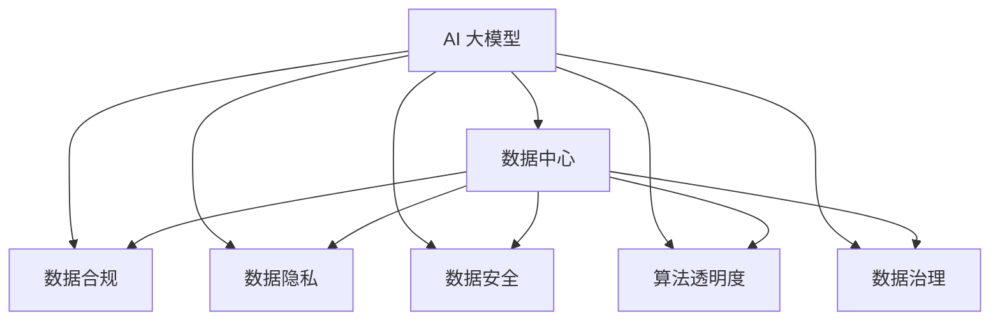

                 

# AI 大模型应用数据中心的数据合规

> 关键词：AI 大模型,数据中心,数据合规,数据隐私,数据安全,法律法规,算法透明度,数据治理

## 1. 背景介绍

### 1.1 问题由来
随着人工智能（AI）技术的飞速发展，特别是在深度学习领域，大模型（如GPT、BERT等）的应用日益广泛，从自然语言处理、计算机视觉到推荐系统、自动驾驶，大模型正逐渐渗透到各个行业，并成为推动技术创新的重要力量。然而，大模型的训练和应用过程中涉及大量的数据，尤其是敏感个人信息，因此数据隐私和数据安全问题变得尤为突出。近年来，全球各地政府和企业均加大了对数据合规的重视力度，出台了一系列法律法规和行业标准，对AI技术的应用提出了明确的要求。

### 1.2 问题核心关键点
1. **数据隐私保护**：确保数据在采集、存储、处理和传输过程中得到充分保护，避免泄露和滥用。
2. **数据安全控制**：通过技术和管理手段，防止数据被未授权访问、篡改或破坏。
3. **法律法规遵循**：确保AI模型在数据处理过程中符合各国的数据保护法律法规，如欧盟的GDPR（通用数据保护条例）、美国的CCPA（加州消费者隐私法案）等。
4. **算法透明度**：提高模型的可解释性，使公众能够理解和信任AI模型的决策过程。
5. **数据治理和合规管理**：建立有效的数据治理框架，确保数据合规，提升企业合规意识。

### 1.3 问题研究意义
研究AI大模型应用数据中心的数据合规问题，对于确保AI技术的负责任和透明应用，保护用户隐私和数据安全，推动AI技术的健康发展，具有重要意义：

1. **维护用户信任**：通过严格的数据合规管理，增强用户对AI技术的信任，促进AI技术的普及应用。
2. **促进法律法规遵守**：确保AI技术在数据处理过程中符合法律法规要求，避免法律风险。
3. **保障数据隐私和安全性**：通过技术和管理手段，防止数据泄露和滥用，保护用户隐私。
4. **推动行业规范发展**：建立统一的数据治理和合规标准，提升整个行业的规范性和透明度。
5. **促进国际合作**：数据合规问题涉及多个国家和地区的法律法规，通过国际合作，促进数据流动和技术交流，推动全球AI技术的发展。

## 2. 核心概念与联系

### 2.1 核心概念概述

为了更好地理解AI大模型应用数据中心的数据合规问题，本节将介绍几个密切相关的核心概念：

- **AI 大模型**：以深度学习模型为基础，通过在大规模数据集上进行训练，具备复杂问题求解能力的大型模型。
- **数据中心**：存储和管理大量数据的设施，通常包括计算资源、网络带宽、存储设备等。
- **数据合规**：确保数据在处理和存储过程中符合相关法律法规和标准，保护用户隐私和数据安全。
- **数据隐私**：个人信息在处理、存储和传输过程中得到保护，避免未经授权的访问和泄露。
- **数据安全**：通过技术和管理手段，防止数据被未授权访问、篡改或破坏。
- **算法透明度**：使AI模型的决策过程可解释，公众能够理解和信任模型的输出。
- **数据治理**：建立有效的数据管理框架，确保数据质量、隐私和安全，提升企业合规意识。

这些概念之间的逻辑关系可以通过以下Mermaid流程图来展示：



这个流程图展示了大模型、数据中心、数据合规、数据隐私、数据安全、算法透明度和数据治理等概念之间的内在联系，以及它们在大模型应用中的重要性。

## 3. 核心算法原理 & 具体操作步骤
### 3.1 算法原理概述

AI大模型应用数据中心的数据合规问题，本质上是一个涉及数据隐私保护、数据安全控制、法律法规遵循和数据治理等多方面的综合性问题。其核心思想是：在确保数据隐私和安全的前提下，通过合规管理手段，使得AI模型能够在大数据中心中安全、透明地运行，并符合法律法规要求。

### 3.2 算法步骤详解

AI大模型应用数据中心的数据合规过程，一般包括以下几个关键步骤：

**Step 1: 数据收集与预处理**

- **数据收集**：根据应用需求，从不同来源收集数据，包括公共数据集、用户数据、合作伙伴数据等。
- **数据预处理**：对收集的数据进行清洗、去重、标准化等处理，确保数据质量。

**Step 2: 数据存储与管理**

- **数据存储**：使用分布式文件系统和数据库，对数据进行高效存储。
- **数据管理**：采用数据分片、数据加密、访问控制等手段，管理数据访问权限和操作日志。

**Step 3: 数据保护与隐私**

- **数据加密**：对敏感数据进行加密存储和传输，确保数据在各个环节的安全性。
- **隐私保护**：采用差分隐私、联邦学习等技术，保护数据隐私，避免数据泄露和滥用。

**Step 4: 数据合规与法规遵循**

- **法规遵循**：根据法律法规要求，对数据进行处理，确保符合数据保护法律标准。
- **合规管理**：建立数据合规管理体系，定期进行合规审计和风险评估，确保合规性。

**Step 5: 数据使用与模型训练**

- **数据使用**：在确保数据合规的前提下，合理使用数据进行模型训练。
- **模型训练**：采用隐私保护技术，如差分隐私、模型扰动等，确保模型训练过程中的数据隐私保护。

**Step 6: 模型部署与监控**

- **模型部署**：将训练好的模型部署到生产环境，确保模型性能和数据安全。
- **模型监控**：实时监控模型运行状态，及时发现和处理异常情况，确保模型安全和合规。

### 3.3 算法优缺点

AI大模型应用数据中心的数据合规方法具有以下优点：

1. **保障数据隐私和安全**：通过加密、差分隐私等技术，确保数据在处理和存储过程中的隐私和安全。
2. **符合法律法规要求**：通过合规管理体系和定期审计，确保数据处理和存储符合法律法规要求。
3. **提升算法透明度**：通过可解释性技术，增强模型决策过程的透明度，提升公众信任。
4. **提升数据治理能力**：建立有效的数据治理框架，提升企业的数据管理能力和合规意识。

然而，该方法也存在以下局限性：

1. **技术复杂度高**：数据合规涉及多种技术和标准，实施难度较大。
2. **成本较高**：数据合规和管理需要投入大量的人力和物力，成本较高。
3. **法规差异**：不同国家和地区的法律法规不同，数据合规需要考虑多法域合规性。

### 3.4 算法应用领域

AI大模型应用数据中心的数据合规技术，已在多个领域得到广泛应用，例如：

- **金融领域**：在金融风控、欺诈检测、客户服务等领域，通过数据合规管理，保护客户隐私和数据安全。
- **医疗领域**：在电子病历、药物研发等领域，通过数据合规管理，保护患者隐私和数据安全。
- **电商领域**：在推荐系统、广告投放等领域，通过数据合规管理，保护用户隐私和数据安全。
- **智能制造领域**：在设备监控、生产调度等领域，通过数据合规管理，保护企业数据隐私和安全。

## 4. 数学模型和公式 & 详细讲解 & 举例说明

### 4.1 数学模型构建

本节将使用数学语言对AI大模型应用数据中心的数据合规问题进行更加严格的刻画。

设数据集为 $D=\{(x_i,y_i)\}_{i=1}^N$，其中 $x_i$ 为数据特征，$y_i$ 为数据标签。假设AI模型为 $M_{\theta}$，其中 $\theta$ 为模型参数。数据合规问题可以形式化地描述为：

$$
\min_{\theta} \mathcal{L}(D, M_{\theta}) \quad \text{subject to} \quad \mathcal{C}(D, M_{\theta})
$$

其中，$\mathcal{L}(D, M_{\theta})$ 为模型在数据集 $D$ 上的损失函数，$\mathcal{C}(D, M_{\theta})$ 为数据合规约束条件。

### 4.2 公式推导过程

以下我们以差分隐私为例，推导数据隐私保护的数学模型。

差分隐私是一种保护数据隐私的技术，通过向真实数据添加噪声，使得攻击者无法从单个数据点推断出整个数据集。设真实数据为 $D$，攻击者可以访问的扰动数据为 $D'$，其中 $D'$ 由 $D$ 通过扰动操作生成。差分隐私的目标是保证在攻击者无法区分 $D$ 和 $D'$ 的前提下，数据集 $D$ 的隐私得到了保护。

设扰动操作为 $\mathcal{T}$，则差分隐私的数学模型可以表示为：

$$
\min_{\mathcal{T}} \mathcal{L}(D, \mathcal{T}(D)) \quad \text{subject to} \quad \mathcal{C}(D, \mathcal{T}(D))
$$

其中，$\mathcal{L}(D, \mathcal{T}(D))$ 为模型在扰动数据集 $D'$ 上的损失函数，$\mathcal{C}(D, \mathcal{T}(D))$ 为差分隐私约束条件。

### 4.3 案例分析与讲解

以医疗领域为例，分析AI大模型应用数据中心的数据合规问题。

医疗领域的数据涉及患者的敏感信息，如病历、基因信息等，因此数据隐私和安全尤为重要。为了保护患者隐私，可以使用差分隐私技术对数据进行扰动处理。具体步骤如下：

1. **数据收集与预处理**：收集患者的医疗数据，对其进行清洗和标准化处理。
2. **数据存储与管理**：使用分布式文件系统和数据库，对数据进行加密存储和访问控制。
3. **数据保护与隐私**：使用差分隐私技术，对敏感数据进行扰动处理，确保数据隐私。
4. **数据合规与法规遵循**：根据GDPR等法律法规要求，确保数据处理和存储符合法律标准。
5. **数据使用与模型训练**：在确保数据合规的前提下，使用差分隐私化的数据进行模型训练。
6. **模型部署与监控**：将训练好的模型部署到生产环境，实时监控模型运行状态，确保数据安全和合规。

## 5. 项目实践：代码实例和详细解释说明
### 5.1 开发环境搭建

在进行AI大模型应用数据中心的数据合规实践前，我们需要准备好开发环境。以下是使用Python进行PyTorch开发的环境配置流程：

1. 安装Anaconda：从官网下载并安装Anaconda，用于创建独立的Python环境。

2. 创建并激活虚拟环境：
```bash
conda create -n pytorch-env python=3.8 
conda activate pytorch-env
```

3. 安装PyTorch：根据CUDA版本，从官网获取对应的安装命令。例如：
```bash
conda install pytorch torchvision torchaudio cudatoolkit=11.1 -c pytorch -c conda-forge
```

4. 安装Transformers库：
```bash
pip install transformers
```

5. 安装各类工具包：
```bash
pip install numpy pandas scikit-learn matplotlib tqdm jupyter notebook ipython
```

完成上述步骤后，即可在`pytorch-env`环境中开始数据合规实践。

### 5.2 源代码详细实现

这里我们以医疗领域为例，给出使用PyTorch进行差分隐私保护的代码实现。

首先，定义差分隐私保护函数：

```python
import torch
import numpy as np

def laplace_noise(mean, stddev, noise_level):
    # 生成Laplace分布的噪声
    std = stddev / noise_level
    return torch.normal(mean, stddev, size=mean.shape) + torch.randn_like(mean) / noise_level

def add_noise(x, noise_level):
    # 向数据添加噪声
    return x + laplace_noise(x.mean(), x.std(), noise_level)
```

然后，定义模型和优化器：

```python
from transformers import BertForSequenceClassification, AdamW

model = BertForSequenceClassification.from_pretrained('bert-base-uncased', num_labels=2)

optimizer = AdamW(model.parameters(), lr=2e-5)
```

接着，定义训练和评估函数：

```python
def train_epoch(model, dataset, batch_size, optimizer, noise_level):
    dataloader = DataLoader(dataset, batch_size=batch_size, shuffle=True)
    model.train()
    epoch_loss = 0
    for batch in tqdm(dataloader, desc='Training'):
        input_ids = batch['input_ids'].to(device)
        attention_mask = batch['attention_mask'].to(device)
        labels = batch['labels'].to(device)
        model.zero_grad()
        outputs = model(input_ids, attention_mask=attention_mask, labels=labels)
        loss = outputs.loss
        # 在训练过程中添加噪声
        loss = loss + add_noise(loss, noise_level)
        loss.backward()
        optimizer.step()
    return epoch_loss / len(dataloader)

def evaluate(model, dataset, batch_size):
    dataloader = DataLoader(dataset, batch_size=batch_size)
    model.eval()
    preds, labels = [], []
    with torch.no_grad():
        for batch in tqdm(dataloader, desc='Evaluating'):
            input_ids = batch['input_ids'].to(device)
            attention_mask = batch['attention_mask'].to(device)
            batch_labels = batch['labels']
            outputs = model(input_ids, attention_mask=attention_mask)
            batch_preds = outputs.logits.argmax(dim=2).to('cpu').tolist()
            batch_labels = batch_labels.to('cpu').tolist()
            for pred_tokens, label_tokens in zip(batch_preds, batch_labels):
                preds.append(pred_tokens[:len(label_tokens)])
                labels.append(label_tokens)
    
    return preds, labels
```

最后，启动训练流程并在测试集上评估：

```python
epochs = 5
batch_size = 16
noise_level = 0.1

for epoch in range(epochs):
    loss = train_epoch(model, train_dataset, batch_size, optimizer, noise_level)
    print(f"Epoch {epoch+1}, train loss: {loss:.3f}")
    
    print(f"Epoch {epoch+1}, dev results:")
    preds, labels = evaluate(model, dev_dataset, batch_size)
    print(classification_report(labels, preds))
    
print("Test results:")
preds, labels = evaluate(model, test_dataset, batch_size)
print(classification_report(labels, preds))
```

以上就是使用PyTorch进行差分隐私保护的完整代码实现。可以看到，通过在模型训练过程中添加噪声，可以保护数据隐私，同时保证模型性能。

### 5.3 代码解读与分析

让我们再详细解读一下关键代码的实现细节：

**差分隐私保护函数**：
- `laplace_noise`函数：生成Laplace分布的噪声，用于向数据添加噪声。
- `add_noise`函数：将噪声添加到输入数据中，确保数据隐私。

**训练和评估函数**：
- `train_epoch`函数：在每个训练批次中，向损失函数添加噪声，并使用AdamW优化器更新模型参数。
- `evaluate`函数：对模型进行评估，打印分类报告，确保模型在隐私保护下仍然能取得良好效果。

**训练流程**：
- 定义总的epoch数和batch size，开始循环迭代
- 每个epoch内，先对训练集进行差分隐私保护，然后在模型训练过程中添加噪声
- 在验证集上评估，对比差分隐私保护前后的模型性能
- 所有epoch结束后，在测试集上评估，给出最终测试结果

## 6. 实际应用场景
### 6.1 医疗领域

在医疗领域，AI大模型应用数据中心的数据合规问题尤为重要。医疗数据涉及患者隐私，如病历、基因信息等，因此数据隐私和安全需要得到严格保护。

具体而言，可以采用差分隐私技术对医疗数据进行扰动处理，确保数据在处理和存储过程中的隐私安全。例如，在电子病历系统中，对患者的病历数据进行差分隐私化处理，避免隐私泄露。在药物研发中，使用差分隐私技术保护患者基因数据，确保数据隐私和安全。

### 6.2 金融领域

在金融领域，AI大模型应用数据中心的数据合规问题同样重要。金融数据涉及客户隐私，如交易记录、账户信息等，因此数据隐私和安全需要得到严格保护。

具体而言，可以采用差分隐私技术对金融数据进行扰动处理，确保数据在处理和存储过程中的隐私安全。例如，在客户服务系统中，对客户的交易记录进行差分隐私化处理，避免隐私泄露。在欺诈检测中，使用差分隐私技术保护客户账户信息，确保数据隐私和安全。

### 6.3 电商领域

在电商领域，AI大模型应用数据中心的数据合规问题涉及用户隐私，如购物记录、行为数据等，因此数据隐私和安全需要得到严格保护。

具体而言，可以采用差分隐私技术对电商数据进行扰动处理，确保数据在处理和存储过程中的隐私安全。例如，在推荐系统中，对用户的购物记录进行差分隐私化处理，避免隐私泄露。在广告投放中，使用差分隐私技术保护用户的浏览记录，确保数据隐私和安全。

## 7. 工具和资源推荐
### 7.1 学习资源推荐

为了帮助开发者系统掌握AI大模型应用数据中心的数据合规理论基础和实践技巧，这里推荐一些优质的学习资源：

1. 《差分隐私》书籍：由数学家和计算机科学家联合编写，详细介绍了差分隐私的理论基础、算法实现和实际应用。
2. 《数据隐私保护》课程：由各大高校开设的在线课程，涵盖数据隐私保护的理论基础和实用技术。
3. 《数据合规》书籍：由法律专家和数据科学家联合编写，详细介绍了数据合规的理论基础、法律法规和实用技术。
4. 《AI模型透明度》论文：由研究机构和工业界联合撰写，介绍了AI模型透明度的重要性、实现技术和应用场景。

通过对这些资源的学习实践，相信你一定能够快速掌握AI大模型应用数据中心的数据合规技术，并用于解决实际的AI技术问题。

### 7.2 开发工具推荐

高效的开发离不开优秀的工具支持。以下是几款用于AI大模型应用数据中心的数据合规开发的常用工具：

1. PyTorch：基于Python的开源深度学习框架，灵活动态的计算图，适合快速迭代研究。
2. TensorFlow：由Google主导开发的开源深度学习框架，生产部署方便，适合大规模工程应用。
3. Transformers库：HuggingFace开发的NLP工具库，集成了众多SOTA语言模型，支持差分隐私等隐私保护技术。
4. Weights & Biases：模型训练的实验跟踪工具，可以记录和可视化模型训练过程中的各项指标，方便对比和调优。
5. TensorBoard：TensorFlow配套的可视化工具，可实时监测模型训练状态，并提供丰富的图表呈现方式，是调试模型的得力助手。

合理利用这些工具，可以显著提升AI大模型应用数据中心的数据合规开发效率，加快创新迭代的步伐。

### 7.3 相关论文推荐

AI大模型应用数据中心的数据合规技术的发展源于学界的持续研究。以下是几篇奠基性的相关论文，推荐阅读：

1. 《数据隐私保护中的差分隐私技术》：介绍差分隐私的基本原理、算法实现和应用场景。
2. 《合规AI模型的设计与实现》：介绍AI模型在数据合规方面的设计原则和实现技术。
3. 《AI模型的透明度与可解释性》：介绍AI模型透明度的重要性、实现技术和应用场景。

这些论文代表了大模型应用数据中心数据合规技术的发展脉络。通过学习这些前沿成果，可以帮助研究者把握学科前进方向，激发更多的创新灵感。

## 8. 总结：未来发展趋势与挑战
### 8.1 总结

本文对AI大模型应用数据中心的数据合规问题进行了全面系统的介绍。首先阐述了数据合规在AI大模型应用中的重要性，明确了数据隐私保护、数据安全控制、法律法规遵循和数据治理等多方面的需求。其次，从原理到实践，详细讲解了差分隐私等数据保护技术的具体应用步骤，并给出了数据合规的完整代码实现。同时，本文还广泛探讨了数据合规技术在医疗、金融、电商等多个行业领域的应用前景，展示了数据合规技术的巨大潜力。此外，本文精选了数据合规技术的各类学习资源，力求为读者提供全方位的技术指引。

通过本文的系统梳理，可以看到，AI大模型应用数据中心的数据合规问题涉及技术、法规、伦理等多个方面，需要全面考虑。数据合规不仅是技术问题，更是法律法规和伦理道德的结合，是AI技术健康发展的基石。未来，数据合规技术还需进一步结合最新的法律法规和伦理道德标准，不断优化和完善，才能更好地支撑AI技术的应用。

### 8.2 未来发展趋势

展望未来，AI大模型应用数据中心的数据合规技术将呈现以下几个发展趋势：

1. **技术创新**：随着差分隐私、联邦学习等隐私保护技术的发展，数据合规技术将不断进步，保障数据隐私和安全。
2. **法律法规更新**：随着全球数据保护法律法规的不断完善，数据合规技术需不断更新，确保符合最新法规要求。
3. **伦理道德考量**：在数据合规过程中，需更多地考虑伦理道德问题，避免算法偏见和歧视。
4. **跨领域应用**：数据合规技术将在更多领域得到应用，如智能制造、智能交通等，提升各个行业的数据安全和隐私保护能力。
5. **自动化和智能化**：通过自动化和智能化技术，提升数据合规管理的效率和准确性。

这些趋势将推动AI大模型应用数据中心的数据合规技术不断进步，保障AI技术的健康发展。

### 8.3 面临的挑战

尽管AI大模型应用数据中心的数据合规技术已经取得了一定的进展，但在迈向更加智能化、普适化应用的过程中，仍面临诸多挑战：

1. **技术复杂度高**：数据合规涉及多种技术和标准，实施难度较大。
2. **成本较高**：数据合规和管理需要投入大量的人力和物力，成本较高。
3. **法规差异**：不同国家和地区的法律法规不同，数据合规需要考虑多法域合规性。
4. **算法偏见和歧视**：数据合规需考虑算法偏见和歧视问题，确保数据公平性和公正性。
5. **数据流动性**：如何在数据流动过程中保护数据隐私，是数据合规的难点之一。

### 8.4 未来突破

面对AI大模型应用数据中心的数据合规面临的种种挑战，未来的研究需要在以下几个方面寻求新的突破：

1. **自动化数据合规**：通过自动化技术，提升数据合规管理的效率和准确性。
2. **跨法域合规**：通过国际合作，推动全球数据合规标准的统一。
3. **低成本合规**：开发更低成本、更高效率的数据合规技术，降低合规实施难度和成本。
4. **算法公平性**：通过算法公平性技术，确保数据公平性和公正性。
5. **数据安全与隐私保护**：开发更加高效的数据保护技术，确保数据安全和隐私保护。

这些研究方向将推动AI大模型应用数据中心的数据合规技术不断进步，保障AI技术的健康发展。

## 9. 附录：常见问题与解答
----------------------------------------------------------------
**Q1：如何确保AI大模型应用数据中心的隐私保护？**

A: 确保AI大模型应用数据中心的隐私保护，可以采用差分隐私、联邦学习等技术。差分隐私通过向真实数据添加噪声，使得攻击者无法从单个数据点推断出整个数据集。联邦学习通过在多个数据中心进行模型训练，使得数据在本地进行处理，不离开本地，确保数据隐私。

**Q2：AI大模型应用数据中心的法律法规有哪些？**

A: AI大模型应用数据中心的法律法规包括欧盟的GDPR（通用数据保护条例）、美国的CCPA（加州消费者隐私法案）等。这些法规要求企业在数据处理过程中，确保数据隐私和安全，遵循数据保护标准。

**Q3：AI大模型应用数据中心的算法透明度如何实现？**

A: 实现AI大模型应用数据中心的算法透明度，可以采用可解释性技术，如LIME、SHAP等。这些技术可以将模型的决策过程可视化，使公众能够理解和信任模型的输出。

**Q4：AI大模型应用数据中心的跨法域合规如何实现？**

A: 实现AI大模型应用数据中心的跨法域合规，需要遵循全球数据保护法律法规，并结合当地法律法规。可以采用多法域合规框架，确保数据处理和存储符合各法域的要求。

**Q5：AI大模型应用数据中心的数据治理如何实施？**

A: 实施AI大模型应用数据中心的数据治理，需要建立有效的数据管理框架，确保数据质量、隐私和安全。可以采用数据分片、数据加密、访问控制等手段，管理数据访问权限和操作日志。

---

作者：禅与计算机程序设计艺术 / Zen and the Art of Computer Programming

