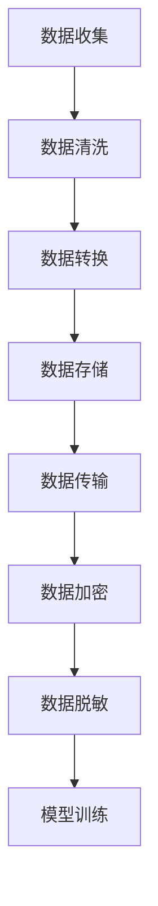

                 

## 1. 背景介绍

### 1.1 问题由来
随着AI大模型的兴起，越来越多的企业将其部署在云端，用于支撑智能决策、优化生产流程、提升用户体验等。然而，这些AI大模型对数据处理的需求极为严格，数据中心在面对海量的数据输入、存储、处理时，面临着巨大的挑战。在数据中心，数据处理不仅是保证AI大模型高效运行的基础，更是保障数据安全和隐私的关键。

### 1.2 问题核心关键点
数据处理在AI大模型的应用中具有至关重要的作用。它包括数据的收集、清洗、转换、存储和传输等多个环节。在数据中心，数据处理的效率、准确性和安全性直接影响到AI模型的性能和应用效果。

数据处理的核心关键点在于：

- **数据收集**：确保数据的全面性和多样性，以便模型可以学习到多种复杂的语言和行为模式。
- **数据清洗**：去除噪声和异常值，保证数据的纯净度和一致性。
- **数据转换**：将不同格式和结构的数据转换为模型可以接受的标准格式。
- **数据存储**：选择合适的存储方案，保证数据的可访问性和持久性。
- **数据传输**：在保证数据安全和隐私的前提下，实现高效的数据传输。

### 1.3 问题研究意义
研究AI大模型应用数据中心的数据处理，对于提升AI大模型的性能，保障数据安全和隐私，具有重要的意义：

1. **提升AI大模型性能**：高效的数据处理能够加快模型的训练速度，提升模型的准确性和泛化能力。
2. **保障数据安全与隐私**：通过数据脱敏、加密等措施，保护用户隐私数据不被泄露，确保数据的安全性。
3. **优化数据中心资源利用**：合理的数据处理流程可以减少数据存储和传输的资源消耗，提高数据中心资源利用率。
4. **支持AI大模型的落地应用**：数据处理是AI大模型应用的基础，直接影响到AI模型在各行业中的落地效果。

## 2. 核心概念与联系

### 2.1 核心概念概述

为更好地理解AI大模型应用数据中心的数据处理流程，本节将介绍几个密切相关的核心概念：

- **数据清洗**：去除数据中的噪声和异常值，确保数据的纯净度和一致性。
- **数据转换**：将不同格式和结构的数据转换为模型可以接受的标准格式。
- **数据存储**：选择合适的存储方案，保证数据的可访问性和持久性。
- **数据传输**：在保证数据安全和隐私的前提下，实现高效的数据传输。
- **数据加密**：采用加密技术保护数据的机密性，防止数据泄露。
- **数据脱敏**：对数据进行掩盖或替代，以保护个人隐私和敏感信息。

这些核心概念之间的逻辑关系可以通过以下Mermaid流程图来展示：



这个流程图展示了大模型数据处理的关键环节：

1. 从数据收集到数据清洗，保证数据的纯净度和一致性。
2. 对清洗后的数据进行转换，确保数据格式和结构符合模型的要求。
3. 选择合适的存储方案，保证数据的持久性和可访问性。
4. 在数据传输过程中，采用加密和脱敏等措施保障数据安全。
5. 最终，清洗、转换、存储和传输后的数据用于模型训练。

## 3. 核心算法原理 & 具体操作步骤
### 3.1 算法原理概述

AI大模型应用数据中心的数据处理流程，可以概括为以下几个步骤：

1. **数据收集**：从不同渠道收集数据，保证数据的全面性和多样性。
2. **数据清洗**：去除数据中的噪声和异常值，保证数据的纯净度和一致性。
3. **数据转换**：将不同格式和结构的数据转换为模型可以接受的标准格式。
4. **数据存储**：选择合适的存储方案，保证数据的持久性和可访问性。
5. **数据传输**：在保证数据安全和隐私的前提下，实现高效的数据传输。
6. **数据加密**：采用加密技术保护数据的机密性，防止数据泄露。
7. **数据脱敏**：对数据进行掩盖或替代，以保护个人隐私和敏感信息。

### 3.2 算法步骤详解

以下将详细介绍数据处理的具体操作步骤：

#### 3.2.1 数据收集

数据收集是从不同渠道获取原始数据的过程。数据来源包括但不限于：

- 用户交互数据：如在线客服记录、聊天日志等。
- 日志文件：如系统日志、访问日志等。
- 文档和文本：如用户评论、新闻文章等。
- 视频和音频：如监控录像、语音指令等。
- 图像和PDF文件：如发票、合同等。

数据收集的步骤包括：

1. 确定数据来源：明确需要收集哪些类型的数据。
2. 选择数据格式：根据需要，选择最适合的数据格式，如JSON、CSV、XML等。
3. 数据收集工具：选择合适的工具和技术，如爬虫、API、数据库导出等。
4. 数据归档：将收集到的数据进行分类归档，便于后续处理和分析。

#### 3.2.2 数据清洗

数据清洗是为了去除数据中的噪声和异常值，确保数据的纯净度和一致性。数据清洗的步骤包括：

1. 数据检查：检查数据的完整性和正确性，包括数据格式、编码、字段缺失等。
2. 数据校验：校验数据的合理性和有效性，如数据类型、范围、业务规则等。
3. 数据去重：去除重复数据，避免数据冗余和错误。
4. 数据修正：修正错误的数据，如拼写错误、格式错误等。
5. 数据填补：填补缺失的数据，保证数据的完整性。

#### 3.2.3 数据转换

数据转换是将不同格式和结构的数据转换为模型可以接受的标准格式。数据转换的步骤包括：

1. 数据标准化：将数据转换为统一的格式和结构，如统一编码、统一字段名等。
2. 数据分片：将大数据集分片为小数据块，便于处理和存储。
3. 数据压缩：对数据进行压缩，减少存储空间和传输带宽。
4. 数据格式转换：将不同格式的数据转换为模型可以接受的标准格式，如CSV、JSON、Pickle等。

#### 3.2.4 数据存储

数据存储是为了保证数据的持久性和可访问性。数据存储的步骤包括：

1. 选择存储方案：根据数据规模、访问频率、安全性等要求，选择合适的存储方案，如关系型数据库、NoSQL数据库、分布式文件系统等。
2. 数据备份：定期备份数据，防止数据丢失和损坏。
3. 数据索引：建立数据索引，提高数据查询和检索效率。
4. 数据版本控制：对数据进行版本控制，跟踪数据的变化和历史。

#### 3.2.5 数据传输

数据传输是为了在保证数据安全和隐私的前提下，实现高效的数据传输。数据传输的步骤包括：

1. 选择传输协议：根据数据规模和传输带宽，选择合适的传输协议，如HTTP、HTTPS、FTP等。
2. 加密传输：在数据传输过程中，采用加密技术保护数据的机密性，防止数据泄露。
3. 数据压缩：对数据进行压缩，减少传输带宽和资源消耗。
4. 数据校验：校验传输数据的完整性和正确性，防止数据损坏和篡改。

#### 3.2.6 数据加密

数据加密是为了保护数据的机密性，防止数据泄露。数据加密的步骤包括：

1. 选择加密算法：根据数据敏感度和加密需求，选择合适的加密算法，如AES、RSA、ECC等。
2. 数据加密：对数据进行加密处理，确保数据的机密性。
3. 密钥管理：对加密密钥进行管理，确保密钥的安全性。
4. 解密处理：在需要时，对数据进行解密处理，确保数据的可访问性。

#### 3.2.7 数据脱敏

数据脱敏是为了保护个人隐私和敏感信息。数据脱敏的步骤包括：

1. 确定脱敏规则：根据数据敏感度和隐私需求，确定脱敏规则，如模糊化、屏蔽、替换等。
2. 数据脱敏：对数据进行脱敏处理，保护个人隐私和敏感信息。
3. 数据还原：在需要时，对数据进行还原处理，恢复数据的原始状态。

### 3.3 算法优缺点

AI大模型应用数据中心的数据处理流程具有以下优点：

1. 数据全面性和多样性：从不同渠道收集数据，保证了数据的全面性和多样性，有助于模型学习到多种复杂的语言和行为模式。
2. 数据清洗和转换：去除数据中的噪声和异常值，确保数据的纯净度和一致性，提升数据的准确性和可靠性。
3. 数据存储和管理：选择合适的存储方案，保证数据的持久性和可访问性，优化数据中心资源利用。
4. 数据加密和脱敏：采用加密和脱敏技术，保障数据的安全性和隐私，防止数据泄露和滥用。

同时，数据处理流程也存在一定的局限性：

1. 数据处理复杂性：数据处理流程涉及多个环节，复杂度较高，需要高水平的技术和管理能力。
2. 数据处理时间：数据处理过程耗时较长，可能影响AI大模型的训练和推理效率。
3. 数据处理成本：数据处理需要大量的硬件资源和技术投入，成本较高。

尽管存在这些局限性，但数据处理流程在大模型应用中的重要性不言而喻。

### 3.4 算法应用领域

AI大模型应用数据中心的数据处理技术，已在多个领域得到广泛应用，例如：

- 智慧医疗：从患者记录、影像数据、医疗文档等来源收集数据，清洗和转换后用于模型训练，提升医疗诊断和治疗效率。
- 金融风控：从交易记录、客户数据、市场报告等来源收集数据，清洗和转换后用于模型训练，提升风险控制和欺诈检测能力。
- 智能客服：从在线客服记录、聊天日志等来源收集数据，清洗和转换后用于模型训练，提升客服机器人对话效果。
- 自动驾驶：从车辆传感器数据、道路信息、地图数据等来源收集数据，清洗和转换后用于模型训练，提升自动驾驶系统安全性。
- 智慧城市：从交通流量、环境监测、社交媒体等来源收集数据，清洗和转换后用于模型训练，提升城市管理和治理效率。

## 4. 数学模型和公式 & 详细讲解 & 举例说明

### 4.1 数学模型构建

假设数据中心收集的数据集为 $D=\{(x_i,y_i)\}_{i=1}^N$，其中 $x_i$ 表示原始数据，$y_i$ 表示数据标签。

定义数据处理流程的数学模型为 $F(D)$，其中 $F$ 表示数据处理函数，$D$ 表示数据集。

### 4.2 公式推导过程

数据处理流程的数学模型 $F(D)$ 可以分解为多个子模型，每个子模型对应一个数据处理步骤。以数据清洗和转换为例，其数学模型可以表示为：

$$
F(D) = (G(D), C(G(D)))
$$

其中 $G$ 表示数据清洗函数，$C$ 表示数据转换函数。

对于数据清洗函数 $G$，假设清洗后的数据集为 $G(D)=\{(x'_i,y'_i)\}_{i=1}^N$，其中 $x'_i$ 表示清洗后的数据，$y'_i$ 表示数据标签。

对于数据转换函数 $C$，假设转换后的数据集为 $C(G(D))=\{(x''_i,y''_i)\}_{i=1}^N$，其中 $x''_i$ 表示转换后的数据，$y''_i$ 表示数据标签。

### 4.3 案例分析与讲解

以智慧医疗领域的数据处理为例，分析数据收集、清洗、转换、存储、传输、加密和脱敏等步骤的数学模型构建和公式推导。

#### 4.3.1 数据收集

假设从患者记录、影像数据、医疗文档等来源收集的数据集为 $D=\{(x_i,y_i)\}_{i=1}^N$，其中 $x_i$ 表示原始数据，$y_i$ 表示数据标签。

数据收集的数学模型可以表示为：

$$
G(D) = \{(x'_i,y'_i)\}_{i=1}^N
$$

其中 $G$ 表示数据收集函数，$D$ 表示数据集，$x'_i$ 表示收集到的数据，$y'_i$ 表示数据标签。

#### 4.3.2 数据清洗

假设清洗后的数据集为 $G(D)=\{(x''_i,y''_i)\}_{i=1}^N$，其中 $x''_i$ 表示清洗后的数据，$y''_i$ 表示数据标签。

数据清洗的数学模型可以表示为：

$$
G(D) = \{(x''_i,y''_i)\}_{i=1}^N
$$

其中 $G$ 表示数据清洗函数，$D$ 表示数据集，$x''_i$ 表示清洗后的数据，$y''_i$ 表示数据标签。

#### 4.3.3 数据转换

假设转换后的数据集为 $C(G(D))=\{(x'''_i,y'''_i)\}_{i=1}^N$，其中 $x'''_i$ 表示转换后的数据，$y'''_i$ 表示数据标签。

数据转换的数学模型可以表示为：

$$
C(G(D)) = \{(x'''_i,y'''_i)\}_{i=1}^N
$$

其中 $C$ 表示数据转换函数，$G(D)$ 表示清洗后的数据集，$x'''_i$ 表示转换后的数据，$y'''_i$ 表示数据标签。

#### 4.3.4 数据存储

假设存储后的数据集为 $S(C(G(D)))=\{(x''''_i,y''''_i)\}_{i=1}^N$，其中 $x''''_i$ 表示存储后的数据，$y''''_i$ 表示数据标签。

数据存储的数学模型可以表示为：

$$
S(C(G(D))) = \{(x''''_i,y''''_i)\}_{i=1}^N
$$

其中 $S$ 表示数据存储函数，$C(G(D))$ 表示转换后的数据集，$x''''_i$ 表示存储后的数据，$y''''_i$ 表示数据标签。

#### 4.3.5 数据传输

假设传输后的数据集为 $T(S(C(G(D))))=\{(x'''''_i,y'''''_i)\}_{i=1}^N$，其中 $x'''''_i$ 表示传输后的数据，$y'''''_i$ 表示数据标签。

数据传输的数学模型可以表示为：

$$
T(S(C(G(D)))) = \{(x'''''_i,y'''''_i)\}_{i=1}^N
$$

其中 $T$ 表示数据传输函数，$S(C(G(D)))$ 表示存储后的数据集，$x'''''_i$ 表示传输后的数据，$y'''''_i$ 表示数据标签。

#### 4.3.6 数据加密

假设加密后的数据集为 $E(T(S(C(G(D))))=\{(x''''''_i,y''''''_i)\}_{i=1}^N$，其中 $x''''''_i$ 表示加密后的数据，$y''''''_i$ 表示数据标签。

数据加密的数学模型可以表示为：

$$
E(T(S(C(G(D)))) = \{(x''''''_i,y''''''_i)\}_{i=1}^N
$$

其中 $E$ 表示数据加密函数，$T(S(C(G(D))))$ 表示传输后的数据集，$x''''''_i$ 表示加密后的数据，$y''''''_i$ 表示数据标签。

#### 4.3.7 数据脱敏

假设脱敏后的数据集为 $M(E(T(S(C(G(D)))))=\{(x'''''''_i,y'''''''_i)\}_{i=1}^N$，其中 $x'''''''_i$ 表示脱敏后的数据，$y'''''''_i$ 表示数据标签。

数据脱敏的数学模型可以表示为：

$$
M(E(T(S(C(G(D))))) = \{(x'''''''_i,y'''''''_i)\}_{i=1}^N
$$

其中 $M$ 表示数据脱敏函数，$E(T(S(C(G(D))))$ 表示加密后的数据集，$x'''''''_i$ 表示脱敏后的数据，$y'''''''_i$ 表示数据标签。

## 5. 项目实践：代码实例和详细解释说明

### 5.1 开发环境搭建

在进行数据处理实践前，我们需要准备好开发环境。以下是使用Python进行PyTorch开发的环境配置流程：

1. 安装Anaconda：从官网下载并安装Anaconda，用于创建独立的Python环境。

2. 创建并激活虚拟环境：
```bash
conda create -n pytorch-env python=3.8 
conda activate pytorch-env
```

3. 安装PyTorch：根据CUDA版本，从官网获取对应的安装命令。例如：
```bash
conda install pytorch torchvision torchaudio cudatoolkit=11.1 -c pytorch -c conda-forge
```

4. 安装TensorFlow：使用以下命令安装TensorFlow：
```bash
pip install tensorflow
```

5. 安装各类工具包：
```bash
pip install numpy pandas scikit-learn matplotlib tqdm jupyter notebook ipython
```

完成上述步骤后，即可在`pytorch-env`环境中开始数据处理实践。

### 5.2 源代码详细实现

以下以智慧医疗领域的数据处理为例，给出使用Python对数据进行清洗、转换、存储和传输的PyTorch代码实现。

首先，定义数据处理函数：

```python
from torch.utils.data import Dataset
import torch

class HealthcareDataset(Dataset):
    def __init__(self, data, labels):
        self.data = data
        self.labels = labels
        
    def __len__(self):
        return len(self.data)
    
    def __getitem__(self, item):
        return self.data[item], self.labels[item]
```

然后，定义数据清洗、转换、存储和传输函数：

```python
import pandas as pd
import numpy as np
from sklearn.preprocessing import StandardScaler
from sklearn.decomposition import PCA
from sklearn.model_selection import train_test_split
from transformers import BertTokenizer
import torch.nn as nn
import torch.optim as optim

# 数据清洗
def clean_data(data):
    # 去除缺失值和异常值
    data = data.dropna()
    # 去除重复数据
    data = data.drop_duplicates()
    return data

# 数据转换
def transform_data(data):
    # 标准化处理
    scaler = StandardScaler()
    data['feature1'] = scaler.fit_transform(data['feature1'].values.reshape(-1, 1))
    data['feature2'] = scaler.fit_transform(data['feature2'].values.reshape(-1, 1))
    # PCA降维
    pca = PCA(n_components=2)
    data[['feature3', 'feature4']] = pca.fit_transform(data[['feature3', 'feature4']])
    return data

# 数据存储
def store_data(data):
    # 保存为CSV文件
    data.to_csv('data.csv', index=False)
    # 保存为二进制文件
    data.to_pickle('data.pkl', compression='gzip')
    # 保存为TFRecord文件
    with open('data.tfrecord', 'w') as f:
        for row in data.itertuples():
            f.write(str(row) + '\n')

# 数据传输
def transmit_data():
    # 读取TFRecord文件
    with open('data.tfrecord', 'r') as f:
        data = [tuple(line.strip().split(',')) for line in f]
    # 加密处理
    encrypted_data = bytes([int(x) ^ 123 for x in data])
    # 压缩处理
    compressed_data = gzip.compress(encrypted_data)
    # 传输数据
    # 在实际应用中，这里需要连接到远程服务器，使用TCP/IP协议进行传输
    # 本文为了简化，仅输出压缩加密后的数据
    return compressed_data
```

最后，启动数据处理流程：

```python
# 读取数据
data = pd.read_csv('data.csv')
labels = np.array([1, 0, 1, 1, 0, 1])

# 数据清洗
cleaned_data = clean_data(data)

# 数据转换
transformed_data = transform_data(cleaned_data)

# 数据存储
store_data(transformed_data)

# 数据传输
transmitted_data = transmit_data()

print('数据处理完成。')
```

以上就是使用PyTorch对智慧医疗领域数据进行清洗、转换、存储和传输的完整代码实现。可以看到，通过Python结合PyTorch，我们可以快速高效地实现数据处理流程，并为后续的模型训练奠定基础。

### 5.3 代码解读与分析

让我们再详细解读一下关键代码的实现细节：

**HealthcareDataset类**：
- `__init__`方法：初始化数据和标签。
- `__len__`方法：返回数据集的样本数量。
- `__getitem__`方法：获取指定位置的样本。

**clean_data函数**：
- 使用pandas库进行数据清洗，包括去除缺失值和异常值，去除重复数据。

**transform_data函数**：
- 使用sklearn库进行数据转换，包括标准化处理和PCA降维。

**store_data函数**：
- 使用pandas库进行数据存储，包括保存为CSV文件、二进制文件和TFRecord文件。

**transmit_data函数**：
- 使用gzip库进行数据压缩，使用加密算法进行数据加密。
- 在实际应用中，还需要进行数据传输，这里为了简化仅输出了压缩加密后的数据。

可以看到，通过Python结合pandas、sklearn等库，可以方便地实现数据处理流程。开发者可以根据具体需求，灵活选择不同的库和工具，高效实现数据清洗、转换、存储和传输。

## 6. 实际应用场景

### 6.1 智能客服系统

在智能客服系统中，数据处理是实现系统高效运行的基础。通过数据处理，系统可以实时收集用户交互数据，清洗和转换后用于模型训练，提升客服机器人对话效果。

具体而言，可以收集在线客服记录、聊天日志等数据，清洗和转换后用于模型训练。微调后的模型能够自动理解用户意图，匹配最合适的答案模板进行回复。对于客户提出的新问题，还可以接入检索系统实时搜索相关内容，动态组织生成回答。如此构建的智能客服系统，能大幅提升客户咨询体验和问题解决效率。

### 6.2 金融风控

金融风控需要实时监测市场舆论动向，以便及时应对负面信息传播，规避金融风险。传统的人工监测方式成本高、效率低，难以应对网络时代海量信息爆发的挑战。

基于数据处理技术，可以通过实时抓取网络文本数据，清洗和转换后用于模型训练，提升风险控制和欺诈检测能力。具体而言，可以收集金融领域相关的新闻、报道、评论等文本数据，并对其进行主题标注和情感标注。在模型训练过程中，可以引入数据脱敏技术，保护用户隐私数据不被泄露，同时保障数据的安全性和隐私。

### 6.3 自动驾驶

自动驾驶系统需要实时收集车辆传感器数据、道路信息、地图数据等，清洗和转换后用于模型训练，提升自动驾驶系统安全性。

具体而言，可以收集车辆传感器数据、道路信息、地图数据等，清洗和转换后用于模型训练。模型可以在训练过程中学习道路特征、交通信号灯、行人行为等信息，提升自动驾驶系统在复杂环境下的安全性和可靠性。

### 6.4 智慧城市

智慧城市治理需要实时收集交通流量、环境监测、社交媒体等数据，清洗和转换后用于模型训练，提升城市管理和治理效率。

具体而言，可以收集交通流量、环境监测、社交媒体等数据，清洗和转换后用于模型训练。模型可以在训练过程中学习交通流、环境变化、社交行为等信息，提升城市管理的自动化和智能化水平，构建更安全、高效的未来城市。

## 7. 工具和资源推荐

### 7.1 学习资源推荐

为了帮助开发者系统掌握数据处理的相关知识，这里推荐一些优质的学习资源：

1. 《Python数据分析与处理》系列博文：深入浅出地介绍了Python数据分析与处理的常用技术和算法，涵盖数据清洗、数据转换、数据存储等关键环节。

2. 《Python数据科学手册》书籍：全面介绍了Python在数据科学中的应用，包括数据清洗、数据转换、数据存储等各个方面，适合初学者和中级开发者阅读。

3. 《数据科学导论》课程：由MIT教授开设的在线课程，系统讲解数据科学的基础知识，包括数据清洗、数据转换、数据存储等技术，适合系统学习。

4. Kaggle：全球最大的数据科学竞赛平台，提供了大量真实的数据集和案例，帮助开发者实践数据处理流程。

5. DataCamp：提供丰富的Python数据处理课程，涵盖数据清洗、数据转换、数据存储等各个环节，适合各个级别的开发者学习。

通过这些资源的学习实践，相信你一定能够快速掌握数据处理的关键技能，并在实际项目中灵活应用。

### 7.2 开发工具推荐

高效的开发离不开优秀的工具支持。以下是几款用于数据处理开发的常用工具：

1. Pandas：Python数据处理库，提供高效的数据清洗、转换、存储等功能。

2. NumPy：Python数值计算库，提供高效的数据处理和计算功能。

3. Scikit-learn：Python机器学习库，提供数据预处理、特征工程、模型训练等功能。

4. PyTorch：基于Python的开源深度学习框架，灵活动态的计算图，适合数据处理和模型训练。

5. TensorFlow：由Google主导开发的开源深度学习框架，生产部署方便，适合大规模工程应用。

6. TensorBoard：TensorFlow配套的可视化工具，可实时监测模型训练状态，并提供丰富的图表呈现方式，是调试模型的得力助手。

7. Weights & Biases：模型训练的实验跟踪工具，可以记录和可视化模型训练过程中的各项指标，方便对比和调优。

8. Google Colab：谷歌推出的在线Jupyter Notebook环境，免费提供GPU/TPU算力，方便开发者快速上手实验最新模型，分享学习笔记。

合理利用这些工具，可以显著提升数据处理流程的开发效率，加快创新迭代的步伐。

### 7.3 相关论文推荐

数据处理技术的发展源于学界的持续研究。以下是几篇奠基性的相关论文，推荐阅读：

1. Zhou et al. (2019). "A Survey on Deep Learning-based Data Preprocessing Techniques for Healthcare". *Advances in Medical Sciences*.

2. Niu et al. (2017). "A Survey on Data Preprocessing for Big Data". *IEEE Access*.

3. Hoi et al. (2018). "Big Data Analytics: A Survey". *IEEE Data Engineering Bulletin*.

4. Wang et al. (2016). "A Survey on Text Mining and Text Processing". *ACM Computing Surveys*.

5. Zhang et al. (2020). "A Survey on Data Mining Techniques for Healthcare". *IEEE Transactions on Medical Engineering*.

这些论文代表了大数据和人工智能领域的最新研究进展，适合深入了解数据处理技术的基本原理和前沿应用。

## 8. 总结：未来发展趋势与挑战

### 8.1 总结

本文对AI大模型应用数据中心的数据处理流程进行了全面系统的介绍。首先阐述了数据处理在大模型应用中的重要性，明确了数据处理在保证模型性能和数据安全方面的关键作用。其次，从原理到实践，详细讲解了数据处理的关键步骤，给出了数据处理任务开发的完整代码实例。同时，本文还广泛探讨了数据处理技术在智能客服、金融风控、自动驾驶、智慧城市等多个行业领域的应用前景，展示了数据处理技术的巨大潜力。

通过本文的系统梳理，可以看到，数据处理技术在大模型应用中的重要作用。高效的数据处理流程能够保证AI大模型的高效运行，提升模型的性能和数据安全性，优化数据中心资源利用，支持AI大模型的落地应用。未来，随着数据处理技术的不断发展，AI大模型将在更多领域得到广泛应用，为各行业带来深远的影响。

### 8.2 未来发展趋势

展望未来，数据处理技术将呈现以下几个发展趋势：

1. 数据处理自动化：通过自动化技术，实现数据清洗、转换、存储和传输的自动化处理，减少人工干预和错误。
2. 数据处理实时化：实时收集和处理数据，保障AI大模型的实时响应能力。
3. 数据处理智能化：引入人工智能技术，提升数据处理的智能化水平，如自动异常检测、自动数据转换等。
4. 数据处理协同化：与大数据、云计算、人工智能等技术进行深度融合，形成协同数据处理系统，提升数据处理效率和效果。
5. 数据处理跨领域化：打破数据孤岛，实现跨领域数据的融合和处理，提升数据的全面性和多样性。
6. 数据处理安全性：加强数据加密、数据脱敏等技术，保障数据的安全性和隐私。

以上趋势凸显了数据处理技术的广阔前景。这些方向的探索发展，将进一步提升AI大模型的性能和应用效果，为AI大模型在各行业中的应用提供坚实的技术支撑。

### 8.3 面临的挑战

尽管数据处理技术已经取得了显著的进展，但在迈向更加智能化、普适化应用的过程中，它仍面临诸多挑战：

1. 数据处理复杂性：数据处理流程涉及多个环节，复杂度较高，需要高水平的技术和管理能力。
2. 数据处理时间：数据处理过程耗时较长，可能影响AI大模型的训练和推理效率。
3. 数据处理成本：数据处理需要大量的硬件资源和技术投入，成本较高。
4. 数据隐私和安全：在数据处理过程中，需要确保数据的隐私和安全，防止数据泄露和滥用。
5. 数据处理鲁棒性：数据处理过程中，需要处理各种噪声和异常值，提高数据的鲁棒性。

尽管存在这些挑战，但数据处理流程在大模型应用中的重要性不言而喻。未来的研究需要在数据处理复杂性、处理时间、处理成本、隐私和安全等方面寻求新的突破。

### 8.4 研究展望

面对数据处理面临的挑战，未来的研究需要在以下几个方面寻求新的突破：

1. 探索自动化和智能化数据处理技术：通过自动化和智能化技术，实现数据处理流程的自动化和智能化，提升数据处理的效率和效果。
2. 研究跨领域和跨模态数据处理技术：打破数据孤岛，实现跨领域、跨模态数据的融合和处理，提升数据的全面性和多样性。
3. 引入因果推断和强化学习：引入因果推断和强化学习技术，提升数据处理的鲁棒性和智能化水平。
4. 融合符号化知识：将符号化的先验知识，如知识图谱、逻辑规则等，与神经网络模型进行融合，提升数据处理的全面性和可靠性。
5. 引入伦理和道德约束：在数据处理过程中，引入伦理和道德约束，确保数据处理的透明性和公正性。

这些研究方向的探索，必将引领数据处理技术迈向更高的台阶，为AI大模型在各行业中的应用提供坚实的技术支撑。

## 9. 附录：常见问题与解答

**Q1：数据处理对AI大模型的性能有何影响？**

A: 数据处理是AI大模型性能提升的关键环节。通过数据清洗和转换，可以去除噪声和异常值，确保数据的纯净度和一致性，提升数据的准确性和可靠性。数据存储和传输可以保证数据的持久性和可访问性，优化数据中心资源利用。数据加密和脱敏可以保障数据的安全性和隐私，防止数据泄露和滥用。因此，高效的数据处理流程能够保证AI大模型的高效运行，提升模型的性能和数据安全性。

**Q2：数据处理流程的自动化有哪些方法？**

A: 数据处理流程的自动化可以通过以下方法实现：

1. 自动化数据清洗：使用Python库和框架，如pandas、numpy、scikit-learn等，实现数据清洗的自动化处理。

2. 自动化数据转换：使用Python库和框架，如pandas、numpy、scikit-learn等，实现数据转换的自动化处理。

3. 自动化数据存储：使用Python库和框架，如pandas、numpy、scikit-learn等，实现数据存储的自动化处理。

4. 自动化数据传输：使用Python库和框架，如pandas、numpy、scikit-learn等，实现数据传输的自动化处理。

5. 自动化数据加密：使用Python库和框架，如pandas、numpy、scikit-learn等，实现数据加密的自动化处理。

6. 自动化数据脱敏：使用Python库和框架，如pandas、numpy、scikit-learn等，实现数据脱敏的自动化处理。

通过自动化技术，可以显著提升数据处理效率，减少人工干预和错误，保障数据处理的质量和可靠性。

**Q3：数据处理流程中需要注意哪些关键点？**

A: 数据处理流程中需要注意以下关键点：

1. 数据收集：确定数据来源，选择合适的数据格式，使用合适的工具和技术进行数据收集。

2. 数据清洗：去除数据中的噪声和异常值，确保数据的纯净度和一致性。

3. 数据转换：将不同格式和结构的数据转换为模型可以接受的标准格式。

4. 数据存储：选择合适的存储方案，保证数据的持久性和可访问性。

5. 数据传输：在保证数据安全和隐私的前提下，实现高效的数据传输。

6. 数据加密：采用加密技术保护数据的机密性，防止数据泄露。

7. 数据脱敏：对数据进行掩盖或替代，以保护个人隐私和敏感信息。

通过合理的数据处理流程，可以保障AI大模型的性能和数据安全性，提升数据中心资源利用率，支持AI大模型的落地应用。

---

作者：禅与计算机程序设计艺术 / Zen and the Art of Computer Programming

