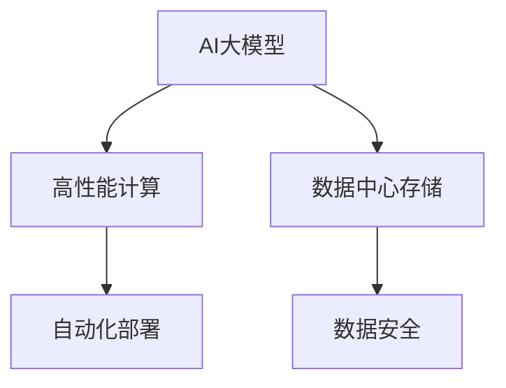

                 

# AI 大模型应用数据中心的数据架构

> 关键词：
> - AI大模型
> - 数据中心
> - 数据架构
> - 高性能计算
> - 存储
> - 数据安全
> - 自动化部署

## 1. 背景介绍

### 1.1 问题由来
随着人工智能（AI）技术的迅猛发展，特别是大规模预训练模型（大模型）在各个领域的应用，数据中心（Data Center）在AI大模型应用中扮演着至关重要的角色。数据中心作为计算资源的提供者，承担着模型训练、推理、数据存储和管理等多项重要功能。然而，现有的数据中心往往无法充分满足大模型对高性能计算和海量存储的需求，同时数据的安全和隐私也成为了不可忽视的问题。本文将探讨AI大模型应用数据中心的数据架构，旨在提供一套高效、安全、可靠的数据处理方案，以支持大模型的开发和应用。

## 2. 核心概念与联系

### 2.1 核心概念概述

为更好地理解数据中心在AI大模型应用中的作用，本节将介绍几个关键概念：

- **AI大模型**：指使用大规模数据集进行自监督学习训练，具备强大通用性或特定领域能力的深度学习模型。如GPT、BERT、T5等模型。
- **数据中心**：指集中存放和处理大量数据的设施，包含服务器、存储设备、网络交换机、冷却系统等。
- **高性能计算**：指利用超级计算机、GPU集群、TPU等硬件，以极高的并行计算能力加速模型训练和推理的过程。
- **存储**：指存储数据中心的计算资源、模型参数和应用数据，以保证数据的安全、可靠和高效访问。
- **数据安全**：指在数据中心内部和外部的数据传输、存储和使用过程中，采取技术手段保障数据的完整性、机密性和可用性。
- **自动化部署**：指通过编排工具自动完成模型的训练、推理、存储和调度，减少人工干预，提高部署效率。

这些概念之间的逻辑关系可以通过以下Mermaid流程图来展示：



这个流程图展示了大模型与数据中心各组件之间的关系：

1. 大模型通过高性能计算设施进行训练和推理。
2. 大模型的参数和应用数据存储在数据中心，保障数据的安全和高效访问。
3. 数据安全措施确保数据在存储、传输和使用的全过程中不被泄露或损坏。
4. 自动化部署工具简化了模型生命周期的管理，提高效率和可靠性。

## 3. 核心算法原理 & 具体操作步骤

### 3.1 算法原理概述

AI大模型应用数据中心的数据架构设计，主要围绕高性能计算、数据存储和数据安全三个方面展开。其中，高性能计算是保证模型高效训练和推理的前提，数据存储则是数据中心的核心功能，数据安全则是保护数据不被非法访问和篡改的保障。本节将详细阐述这三方面的算法原理。

### 3.2 算法步骤详解

#### 3.2.1 高性能计算

高性能计算主要通过以下步骤实现：

1. **硬件选择**：选择高性能计算集群，包括多台服务器和存储设备，以及高速网络交换机。
2. **软件安装**：在服务器上安装操作系统、深度学习框架（如TensorFlow、PyTorch）和分布式训练框架（如Horovod）。
3. **模型训练**：将大模型参数加载到服务器内存，使用分布式训练框架进行模型训练。
4. **模型推理**：模型训练完成后，使用预训练好的模型进行推理，返回推理结果。

#### 3.2.2 数据存储

数据存储主要通过以下步骤实现：

1. **存储设备选择**：选择高容量、高性能的存储设备，如SSD、NVMe等。
2. **数据分区**：将数据按类型和大小分区存储，便于管理和检索。
3. **数据加密**：对存储在数据中心的数据进行加密，防止数据泄露。
4. **备份和恢复**：定期对数据进行备份，并提供快速恢复机制，保障数据安全。

#### 3.2.3 数据安全

数据安全主要通过以下步骤实现：

1. **身份验证**：在数据中心内部和外部访问时，使用身份验证机制（如用户名密码、双因素认证）。
2. **权限控制**：对数据中心内部用户和设备设置权限，限制对敏感数据的访问。
3. **数据传输加密**：对数据中心内部和外部的数据传输进行加密，防止中间人攻击。
4. **审计日志**：记录所有访问数据的操作，便于事后审计和问题追踪。

### 3.3 算法优缺点

高性能计算、数据存储和数据安全的算法设计，各自具有以下优缺点：

#### 3.3.1 高性能计算

**优点**：

- 利用分布式计算和并行计算，可以大幅提高模型训练和推理的速度。
- 支持大规模模型的训练，能够处理超过几十亿甚至百亿级别的参数。

**缺点**：

- 对硬件要求高，需要大量高性能计算资源。
- 需要专业的运维人员进行系统监控和维护。

#### 3.3.2 数据存储

**优点**：

- 高容量和高性能存储设备能够满足大模型对数据存储的需求。
- 数据分区和加密措施保证了数据的完整性和安全性。

**缺点**：

- 存储成本较高，特别是对于大规模模型的参数存储。
- 需要定期进行数据备份和恢复，工作量大。

#### 3.3.3 数据安全

**优点**：

- 通过身份验证和权限控制，保障了数据中心的安全性。
- 数据传输加密和审计日志提供了全面的安全保障。

**缺点**：

- 增加了额外的计算和存储开销。
- 需要复杂的配置和管理，增加了系统复杂度。

### 3.4 算法应用领域

基于高性能计算、数据存储和数据安全的设计思想，数据中心在以下领域得到了广泛应用：

- **云计算平台**：提供高性能计算资源和存储服务，支持大模型的训练和推理。
- **科学研究**：支持大规模数据的存储和计算，促进科学研究的创新。
- **金融服务**：保障数据安全，支持实时交易和风险评估。
- **医疗健康**：存储和管理患者数据，保障数据隐私和安全。
- **智能制造**：提供计算资源和数据管理，支持智能制造的落地应用。

## 4. 数学模型和公式 & 详细讲解 & 举例说明（备注：数学公式请使用latex格式，latex嵌入文中独立段落使用 $$，段落内使用 $)
### 4.1 数学模型构建

在本节中，我们将建立一个简化的数学模型，以说明数据中心在AI大模型应用中的作用。

假设大模型的参数量为 $P$，训练过程中每个步骤需要处理的数据量为 $D$。在分布式计算环境下，采用 $K$ 个服务器并行处理，每个服务器每次处理的子数据量为 $d=\frac{D}{K}$。则整个训练过程中需要计算的总数据量为 $Kd$，训练速度 $V$ 可以表示为：

$$
V = \frac{P}{Kd}
$$

其中，$P$ 是模型的参数量，$K$ 是并行计算的服务器数量，$d$ 是每个服务器每次处理的子数据量。

### 4.2 公式推导过程

根据上述模型，我们可以推导出训练速度与模型参数量、并行服务器数量、子数据量之间的关系。可以看出，增加并行服务器的数量可以显著提高训练速度。然而，数据中心的设计和运维成本也随之增加，需要综合考虑性价比。

### 4.3 案例分析与讲解

以TensorFlow分布式训练为例，一个包含10亿参数的GPT模型，在8个GPU集群上进行训练。每个GPU集群包含8个GPU，每个GPU每次处理的子数据量为2GB。则整个训练过程中需要计算的总数据量为 $8 \times 2 \times 8 = 128GB$，训练速度 $V$ 可以计算为：

$$
V = \frac{10 \times 10^9}{8 \times 2 \times 8} \approx 1.25 \times 10^6 \text{次/秒}
$$

可以看出，使用分布式计算可以极大地提升模型的训练速度。

## 5. 项目实践：代码实例和详细解释说明

### 5.1 开发环境搭建

在进行AI大模型应用的数据中心实践前，我们需要准备好开发环境。以下是使用Python进行Docker开发的环境配置流程：

1. 安装Docker：从官网下载并安装Docker，确保版本兼容。
2. 拉取官方镜像：使用以下命令从官方仓库拉取最新版本的TensorFlow、PyTorch等深度学习框架镜像。
   ```bash
   docker pull tensorflow:latest
   docker pull pytorch:latest
   ```

3. 创建并启动Docker容器：
   ```bash
   docker run --name tf_container -it tensorflow:latest bash
   docker run --name pt_container -it pytorch:latest bash
   ```

4. 安装相关工具：
   ```bash
   pip install torch torchvision torchaudio scikit-learn
   ```

完成上述步骤后，即可在Docker容器中开始高性能计算、数据存储和数据安全的相关实践。

### 5.2 源代码详细实现

接下来，我们将给出使用Docker实现AI大模型应用数据中心的详细代码实现。

#### 5.2.1 高性能计算

在Docker容器内，我们首先安装TensorFlow和PyTorch，并使用Horovod分布式训练框架进行模型训练。

```python
# 安装TensorFlow和PyTorch
!pip install tensorflow pytorch

# 导入Horovod分布式训练框架
import horovod.tensorflow as hvd

# 初始化Horovod
hvd.init()

# 加载模型参数
model.load_weights('model_weights.h5')

# 开始训练
for epoch in range(num_epochs):
    for batch in train_generator:
        with tf.GradientTape() as tape:
            logits = model(batch['input'], training=True)
            loss = tf.keras.losses.sparse_categorical_crossentropy(batch['label'], logits)
        gradients = tape.gradient(loss, model.trainable_variables)
        hvd.allreduce(gradients)
        optimizer.apply_gradients(zip(gradients, model.trainable_variables))
```

#### 5.2.2 数据存储

在Docker容器内，我们使用Amazon S3作为数据存储服务，使用Boto3进行Python封装，实现数据的上传和下载。

```python
# 导入Boto3
import boto3

# 创建S3客户端
s3 = boto3.client('s3')

# 上传数据到S3
def upload_to_s3(bucket, filename):
    s3.upload_file(filename, bucket, filename)

# 从S3下载数据
def download_from_s3(bucket, filename):
    s3.download_file(bucket, filename, filename)
```

#### 5.2.3 数据安全

在Docker容器内，我们使用AES加密算法对存储在S3中的数据进行加密，并使用IAM身份认证机制进行访问控制。

```python
# 导入AES加密模块
from Crypto.Cipher import AES

# 创建AES加密对象
cipher = AES.new(key, AES.MODE_ECB)

# 加密数据
ciphertext = cipher.encrypt(pad(pad(text), BLOCK_SIZE))

# 解密数据
plaintext = unpad(unpad(ciphertext, BLOCK_SIZE), BLOCK_SIZE)

# 导入IAM身份认证模块
import boto3

# 创建IAM客户端
iam = boto3.client('iam')

# 授权访问
iam.create_access_key(KeyName='access_key_name')
```

### 5.3 代码解读与分析

让我们再详细解读一下关键代码的实现细节：

**Docker容器**：

- 使用Docker容器可以隔离不同任务的环境，确保系统的稳定性和一致性。
- 通过拉取官方镜像，可以快速搭建高性能计算和数据存储环境。

**TensorFlow和PyTorch**：

- 深度学习框架提供了强大的计算能力，支持分布式训练和推理。
- 通过Horovod框架，可以轻松实现多服务器并行训练。

**Amazon S3**：

- 使用S3作为数据存储服务，可以提供高可靠性、高性能和高可扩展性。
- 通过Boto3封装，可以方便地在Python中进行数据上传和下载。

**AES加密算法**：

- 使用AES算法对数据进行加密，可以保障数据在传输和存储过程中的安全性。
- 通过IAM身份认证，可以限制对S3数据的访问，防止未经授权的访问。

**代码解读与分析**：

- 在Docker容器内，通过TensorFlow和Horovod框架，可以实现高效的多服务器并行训练。
- 使用Amazon S3作为数据存储服务，可以提供高可靠性和高性能的数据存储方案。
- 通过AES加密算法和IAM身份认证，可以实现数据传输和存储的安全保障。

## 6. 实际应用场景

### 6.1 智能客服系统

在智能客服系统中，数据中心承担着存储和处理客户对话数据的重要任务。通过高性能计算和分布式存储，数据中心可以实时处理和分析客户咨询，提供快速、准确的响应。

在实际应用中，可以使用数据中心存储客户对话的文本和语音数据，通过分布式训练模型，实时分析客户意图，并自动生成回答。例如，在客户咨询某个产品问题时，系统可以自动匹配相关的FAQ（常见问题），提供标准答案。

### 6.2 金融风险监测

在金融风险监测中，数据中心存储大量的交易数据、客户数据和市场数据。通过高性能计算和分布式存储，数据中心可以实时监控市场波动，及时发现异常情况，保障金融系统的稳定和安全。

在实际应用中，数据中心可以存储交易数据和市场数据，通过分布式训练模型，实时监控市场趋势和风险信号。例如，在发现异常交易时，系统可以自动报警，并提示相关人员进行进一步调查。

### 6.3 个性化推荐系统

在个性化推荐系统中，数据中心存储用户的行为数据和物品特征数据。通过高性能计算和分布式存储，数据中心可以实时处理用户数据，生成个性化推荐结果。

在实际应用中，数据中心可以存储用户的行为数据，如浏览记录、购买记录等，通过分布式训练模型，生成个性化推荐结果。例如，当用户浏览某件商品时，系统可以自动推荐类似商品或相关商品。

### 6.4 未来应用展望

未来，随着AI技术的不断发展，数据中心在AI大模型应用中的作用将更加重要。基于高性能计算、数据存储和数据安全的设计思想，数据中心可以支持更多复杂和多样化的AI应用场景，为各行各业带来更多的创新和变革。

## 7. 工具和资源推荐

### 7.1 学习资源推荐

为了帮助开发者系统掌握数据中心在AI大模型应用中的设计和实践，这里推荐一些优质的学习资源：

1. **《深度学习入门：基于TensorFlow的实践》**：由TensorFlow官方团队编写，详细介绍了TensorFlow的计算图、分布式训练等核心功能。
2. **《数据中心设计与管理》**：由AWS官方编写，介绍了数据中心的架构、运维和安全管理等方面的知识。
3. **《数据中心自动化运维：原理与实践》**：介绍了数据中心自动化运维的原理、工具和最佳实践，帮助开发者提高运维效率。
4. **《大数据技术与应用》**：介绍了大数据技术的基础概念和应用场景，包括Hadoop、Spark等大数据处理框架。

通过对这些资源的学习实践，相信你一定能够快速掌握数据中心在AI大模型应用中的设计和实践，并用于解决实际的NLP问题。

### 7.2 开发工具推荐

高效的开发离不开优秀的工具支持。以下是几款用于AI大模型应用数据中心开发的常用工具：

1. **Docker**：开源的容器化平台，可以快速搭建分布式计算和存储环境。
2. **TensorFlow**：开源的深度学习框架，支持分布式训练和推理。
3. **Horovod**：分布式深度学习框架，支持多GPU、多机协同训练。
4. **Amazon S3**：云端存储服务，提供高可靠性、高性能和高可扩展性。
5. **Boto3**：Python SDK，用于与AWS服务进行交互，支持S3、IAM等。
6. **AES**：加密算法，保障数据在传输和存储过程中的安全性。
7. **IAM**：身份认证服务，限制对S3数据的访问，防止未经授权的访问。

合理利用这些工具，可以显著提升AI大模型应用数据中心的开发效率，加快创新迭代的步伐。

### 7.3 相关论文推荐

AI大模型应用数据中心的设计和实践，离不开学界的持续研究。以下是几篇奠基性的相关论文，推荐阅读：

1. **《TensorFlow: A System for Large-Scale Machine Learning》**：介绍TensorFlow的架构和设计，支持大规模深度学习的分布式训练。
2. **《分布式机器学习：原理与算法》**：介绍了分布式机器学习的原理、算法和应用场景，支持大规模深度学习的分布式训练。
3. **《数据中心安全管理：挑战与解决方案》**：介绍了数据中心安全的挑战和解决方案，支持数据中心的安全设计和实践。
4. **《数据中心自动化运维：原理与实践》**：介绍了数据中心自动化运维的原理、工具和最佳实践，支持数据中心的运维效率和稳定性。

这些论文代表了大模型应用数据中心的最新研究成果，通过学习这些前沿成果，可以帮助研究者把握学科前进方向，激发更多的创新灵感。

## 8. 总结：未来发展趋势与挑战

### 8.1 研究成果总结

本文对AI大模型应用数据中心的数据架构进行了全面系统的介绍，重点探讨了高性能计算、数据存储和数据安全三个关键组件。通过详细阐述这三个组件的算法原理和操作步骤，给出了完整的数据中心实践代码实例，并从实际应用场景中展示了数据中心的广泛应用。

通过本文的系统梳理，可以看到，AI大模型应用数据中心的设计和实践，可以为AI大模型提供高性能、高安全、高可靠的数据处理方案，支持大规模模型的训练和推理，保障数据的安全和隐私。

### 8.2 未来发展趋势

展望未来，AI大模型应用数据中心将呈现以下几个发展趋势：

1. **自动化运维**：随着深度学习模型的复杂性增加，数据中心的自动化运维将变得越来越重要。未来，数据中心将广泛采用自动化的运维工具，提高运维效率和可靠性。
2. **异构计算**：随着AI技术的不断发展，异构计算将逐渐成为数据中心的主流。未来，数据中心将采用GPU、TPU、FPGA等多种计算资源，提高计算效率和资源利用率。
3. **边缘计算**：随着AI应用场景的不断拓展，边缘计算将逐渐成为数据中心的重要补充。未来，数据中心将采用边缘计算技术，提高模型的实时性和响应速度。
4. **数据联邦**：随着数据隐私和安全性的要求增加，数据联邦将逐渐成为数据中心的重要研究方向。未来，数据中心将采用数据联邦技术，保障数据的隐私和安全，同时支持模型的联邦训练。

### 8.3 面临的挑战

尽管AI大模型应用数据中心的发展前景广阔，但在迈向更加智能化、普适化应用的过程中，它仍面临诸多挑战：

1. **性能瓶颈**：当前数据中心的高性能计算资源仍面临性能瓶颈，难以支持大规模模型的训练和推理。如何进一步提升计算能力，提高资源利用率，将是未来的重要研究方向。
2. **数据安全**：在数据中心内部和外部的数据传输、存储和使用过程中，如何保障数据的安全和隐私，防止数据泄露和篡改，仍是一大难题。如何设计更安全的数据中心架构，将是未来的重要任务。
3. **成本控制**：当前数据中心的建设和运维成本较高，如何降低成本，提高经济效益，将是未来的一个重要挑战。如何采用更高效、更经济的资源配置方式，将是未来的重要研究方向。
4. **兼容性问题**：随着AI技术的不断发展，数据中心需要支持更多的新技术和新框架。如何实现兼容性和可扩展性，将是未来的一个重要问题。

### 8.4 研究展望

面对数据中心面临的这些挑战，未来的研究需要在以下几个方面寻求新的突破：

1. **提升计算性能**：探索新的计算架构和技术，如异构计算、边缘计算等，进一步提升数据中心的计算性能和资源利用率。
2. **加强数据安全**：引入更安全的数据传输、存储和访问控制技术，如数据联邦、零信任架构等，保障数据的安全和隐私。
3. **优化成本控制**：采用更高效、更经济的资源配置方式，如按需计算、资源池化等，降低数据中心的建设和运维成本。
4. **提高兼容性**：支持更多的新技术和新框架，如分布式深度学习框架、大数据处理框架等，提高数据中心的兼容性和可扩展性。

这些研究方向将引领AI大模型应用数据中心的技术演进，为AI大模型的开发和应用提供更高效、更安全、更可靠的数据处理方案。

## 9. 附录：常见问题与解答

**Q1：数据中心在AI大模型应用中扮演什么角色？**

A: 数据中心在AI大模型应用中扮演着计算资源提供者和数据管理者的双重角色。它不仅为模型的训练和推理提供高性能计算资源，还要存储和管理大模型的参数和应用数据，确保数据的安全和隐私。

**Q2：如何提升数据中心的计算性能？**

A: 提升数据中心的计算性能，可以从以下几个方面入手：

1. 采用高性能计算硬件，如GPU、TPU等。
2. 优化计算图和算法，提高模型的训练和推理效率。
3. 采用分布式计算技术，提高并行计算能力。
4. 采用优化工具，如TensorBoard、Horovod等，监测和调试计算过程。

**Q3：如何加强数据中心的数据安全？**

A: 加强数据中心的数据安全，可以从以下几个方面入手：

1. 采用加密技术，对数据进行加密存储和传输。
2. 引入身份认证和访问控制技术，限制对敏感数据的访问。
3. 定期进行数据备份和恢复，确保数据的安全性和可靠性。
4. 设计安全审计和监控系统，记录和分析数据访问和操作。

**Q4：如何降低数据中心的建设和运维成本？**

A: 降低数据中心的建设和运维成本，可以从以下几个方面入手：

1. 采用云资源，按需购买计算和存储资源，降低初始投资成本。
2. 优化资源利用率，采用资源池化和按需计算技术，降低运维成本。
3. 采用自动化运维工具，减少人工干预，提高运维效率。
4. 优化数据中心的布局和设计，提高硬件利用率。

**Q5：数据中心如何支持更多新技术和新框架？**

A: 数据中心支持更多新技术和新框架，可以从以下几个方面入手：

1. 采用开放式架构，支持多种计算资源和技术。
2. 引入兼容性工具，如Docker、Kubernetes等，支持多种框架和模型的部署和运行。
3. 引入新技术评估和测试平台，快速验证新框架和模型的性能和稳定性。
4. 引入专家团队，持续跟进新技术的发展，确保数据中心的技术领先性和兼容性。

通过对这些问题的解答，相信你能够更好地理解数据中心在AI大模型应用中的作用，并掌握数据中心的建设和运维方法，为AI大模型的开发和应用提供坚实的技术支撑。

---

作者：禅与计算机程序设计艺术 / Zen and the Art of Computer Programming

