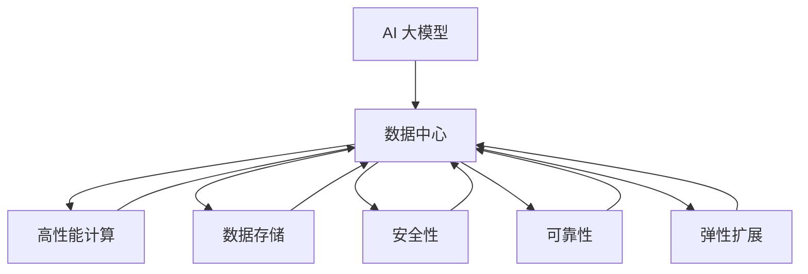

                 

# AI 大模型应用数据中心的网络架构设计

> 关键词：AI 大模型, 数据中心, 网络架构, 高性能计算, 数据存储, 安全性, 可靠性, 弹性扩展

## 1. 背景介绍

随着人工智能（AI）技术的快速发展和深度学习的普及，大规模AI大模型（如GPT-3, BERT等）在自然语言处理、计算机视觉、推荐系统等众多领域中展现出了强大的应用潜力。这些大模型通常具有数十亿甚至上百亿的参数，对计算资源和存储需求巨大。数据中心作为支撑AI大模型训练和推理的基石，其网络架构设计显得尤为重要。

### 1.1 数据中心网络架构的挑战

AI大模型的应用数据中心网络架构面临多重挑战：

- **计算需求巨大**：AI大模型训练和推理需要强大的计算能力，数据中心网络必须能够提供足够的带宽和延迟保证。
- **存储需求高**：模型参数和训练数据的存储需要高性能、大容量和低延迟的存储系统。
- **安全性要求高**：AI大模型通常涉及大量敏感数据，数据中心网络必须具备严格的访问控制和数据加密能力。
- **可靠性要求高**：网络故障可能对模型的训练和推理造成严重影响，数据中心网络必须具备高可用性和容错能力。
- **弹性扩展需求高**：AI大模型的训练和推理需求具有不确定性，数据中心网络必须能够快速适应负载变化，实现弹性扩展。

### 1.2 网络架构的重要性

数据中心网络架构直接影响到AI大模型的训练和推理效率。一个设计合理、高效的网络架构，不仅能够提升数据中心资源利用率，还能确保AI大模型的性能稳定和数据安全。本文将详细探讨AI大模型应用数据中心的网络架构设计。

## 2. 核心概念与联系

### 2.1 核心概念概述

为更好地理解AI大模型应用数据中心的网络架构设计，本节将介绍几个密切相关的核心概念：

- **AI 大模型**：指具有海量参数的深度学习模型，如GPT-3, BERT等，用于自然语言处理、计算机视觉、推荐系统等领域。
- **数据中心**：指集中存储、计算和管理大规模数据的设施，通常由网络、服务器、存储系统等组成。
- **高性能计算**：指通过使用专门的硬件和算法，以极高的计算速度和效率完成复杂的计算任务。
- **数据存储**：指将数据以可靠、高效的方式存储在服务器、存储设备或网络中。
- **安全性**：指保护数据和系统不受未授权访问、篡改和破坏的能力。
- **可靠性**：指数据中心网络能够连续、无间断地运行，满足业务需求的能力。
- **弹性扩展**：指数据中心网络能够根据业务需求的变化，灵活调整资源配置，实现动态扩展。

这些核心概念之间的逻辑关系可以通过以下Mermaid流程图来展示：



这个流程图展示了大模型应用数据中心的各个关键组件及其相互关系：

1. AI大模型依赖于数据中心提供计算和存储资源。
2. 高性能计算系统提供了模型训练和推理所需的计算能力。
3. 数据存储系统存储了模型参数和训练数据。
4. 安全性系统确保数据和系统不受未授权访问和篡改。
5. 可靠性系统保证数据中心的持续稳定运行。
6. 弹性扩展系统实现了资源根据需求动态调整的能力。

这些组件共同构成了数据中心网络架构，为大模型应用提供了必要支持。

## 3. 核心算法原理 & 具体操作步骤

### 3.1 算法原理概述

AI大模型应用数据中心的网络架构设计，需要综合考虑计算、存储、安全、可靠性以及弹性扩展等多方面的需求。一个高效的数据中心网络架构，能够将计算和存储资源优化配置，确保大模型的性能和数据安全，同时具备快速应对业务需求变化的能力。

### 3.2 算法步骤详解

构建一个高效的数据中心网络架构，主要包括以下几个步骤：

**Step 1: 需求分析与规划**

- 评估AI大模型应用的需求，包括计算资源、存储容量、网络带宽、延迟、安全性等。
- 根据需求设计网络拓扑结构，规划网络设备和技术选型。

**Step 2: 硬件设计**

- 选择高性能的计算节点（如GPU服务器、TPU），确保大模型的训练和推理性能。
- 设计高密度、高带宽的交换机和网络拓扑，满足大模型计算需求。
- 选择高性能的存储设备（如SSD、NVMe等），确保数据的高速读写和存储。

**Step 3: 网络设计**

- 设计多层次网络架构，包括接入层、汇聚层、核心层，满足不同层次的网络需求。
- 选择高速、低延迟的网络协议（如NVMe、InfiniBand），提升网络性能。
- 设计冗余和容错机制，保证网络的高可用性和可靠性。

**Step 4: 安全设计**

- 实现网络访问控制和身份认证，防止未授权访问。
- 使用加密技术保护数据传输和存储，确保数据安全。
- 设计入侵检测和防御系统，防止网络攻击。

**Step 5: 弹性扩展设计**

- 设计自动化的资源管理和调度系统，根据需求动态调整计算和存储资源。
- 采用分布式计算和存储技术，实现水平扩展和负载均衡。
- 设计高效的缓存和数据压缩技术，优化数据访问和传输。

**Step 6: 测试与优化**

- 对设计的网络架构进行模拟测试，验证其性能和可靠性。
- 根据测试结果进行优化调整，确保架构满足实际需求。

### 3.3 算法优缺点

AI大模型应用数据中心的网络架构设计，具有以下优点：

1. **高性能**：通过高性能计算和存储系统，确保大模型的训练和推理性能。
2. **高可靠性**：通过冗余和容错机制，保证网络的持续稳定运行。
3. **高安全性**：通过严格的访问控制和数据加密，确保数据和系统的安全性。
4. **弹性扩展**：通过自动化资源管理和分布式计算，实现动态扩展和负载均衡。

同时，该架构也存在一些局限性：

1. **成本高**：高性能计算和存储设备以及冗余机制，成本较高。
2. **复杂性高**：网络架构设计和维护较为复杂，需要专业的运维团队。
3. **扩展性限制**：当需求增长过快时，可能难以快速扩展资源。

尽管存在这些局限性，但通过合理的设计和优化，该架构仍能满足AI大模型的应用需求，提升其性能和可靠性。

### 3.4 算法应用领域

AI大模型应用数据中心的网络架构设计，可以广泛应用于以下领域：

- **科学研究**：支持深度学习模型的训练和推理，推动科学研究和技术创新。
- **医疗健康**：支持医疗影像分析、疾病预测等应用，提升医疗服务质量。
- **金融服务**：支持金融市场预测、风险评估等应用，增强金融决策能力。
- **自动驾驶**：支持自动驾驶汽车的感知、决策等应用，提升交通安全。
- **智能制造**：支持工业自动化、智能监控等应用，提升生产效率和质量。

此外，AI大模型还在社交媒体、娱乐、教育等众多领域得到了广泛应用，数据中心网络架构设计的优化有助于提升这些应用的性能和用户体验。

## 4. 数学模型和公式 & 详细讲解 & 举例说明

### 4.1 数学模型构建

构建AI大模型应用数据中心的网络架构，需要综合考虑计算、存储、安全、可靠性等多个维度。我们可以用数学模型来描述这些维度之间的关系，并对其进行分析和优化。

**模型描述**：

设数据中心网络架构的计算资源为 $C$，存储资源为 $S$，网络带宽为 $B$，延迟为 $D$，安全性为 $S_{sec}$，可靠性为 $R$，弹性扩展能力为 $E$。则数学模型可以表示为：

$$
\begin{aligned}
&\text{目标函数} = f(C, S, B, D, S_{sec}, R, E) \\
&\text{约束条件} = \begin{cases}
C \geq \text{计算需求} \\
S \geq \text{存储需求} \\
B \geq \text{网络带宽需求} \\
D \leq \text{允许的延迟} \\
S_{sec} \geq \text{安全需求} \\
R \geq \text{可靠性需求} \\
E \geq \text{弹性扩展需求}
\end{cases}
\end{aligned}
$$

### 4.2 公式推导过程

假设AI大模型的训练需要 $N$ 个GPU节点，每个节点的计算资源为 $C_{node}$，每个节点的存储资源为 $S_{node}$，训练数据量为 $D_{train}$，训练的通信带宽为 $B_{train}$，训练的延迟为 $D_{train}$，模型的安全性需求为 $S_{sec}$，可靠性的需求为 $R_{req}$，弹性扩展的需求为 $E_{req}$。则目标函数可以进一步细化为：

$$
\begin{aligned}
&\text{目标函数} = f(C, S, B, D, S_{sec}, R, E) \\
&\text{约束条件} = \begin{cases}
C \geq N \times C_{node} \\
S \geq N \times S_{node} \\
B \geq N \times B_{train} \\
D \leq \text{允许的延迟} \\
S_{sec} \geq S_{req} \\
R \geq R_{req} \\
E \geq E_{req}
\end{cases}
\end{aligned}
$$

其中 $f(C, S, B, D, S_{sec}, R, E)$ 表示基于计算、存储、网络、安全、可靠性、弹性扩展的综合优化函数。

### 4.3 案例分析与讲解

以一家大型AI大模型应用企业为例，其数据中心设计如下：

- **计算资源**：100个GPU节点，每个节点配备2个NVIDIA A100 GPU，计算资源为 $C = 200 \times 8 = 1600$ GPU core。
- **存储资源**：50个SSD存储节点，每个节点存储容量为10TB，总存储资源为 $S = 50 \times 10 = 500$ TB。
- **网络带宽**：每个GPU节点配备100Gb/s网络接口，总带宽为 $B = 100 \times 100 = 10000$ Gb/s。
- **延迟**：网络延迟为10ms，符合模型训练的要求。
- **安全性**：要求数据传输和存储加密，安全性为 $S_{sec} = 0.95$。
- **可靠性**：要求系统99.9%的可用性，可靠性为 $R = 0.999$。
- **弹性扩展**：要求系统能够根据需求快速扩展，弹性扩展能力为 $E = 2$。

使用上述数学模型进行优化，可以得到最优的网络架构设计方案。

## 5. 项目实践：代码实例和详细解释说明

### 5.1 开发环境搭建

在进行网络架构设计和优化之前，我们需要准备好开发环境。以下是使用Python进行PyTorch开发的环境配置流程：

1. 安装Anaconda：从官网下载并安装Anaconda，用于创建独立的Python环境。

2. 创建并激活虚拟环境：
```bash
conda create -n ai-env python=3.8 
conda activate ai-env
```

3. 安装PyTorch：根据CUDA版本，从官网获取对应的安装命令。例如：
```bash
conda install pytorch torchvision torchaudio cudatoolkit=11.1 -c pytorch -c conda-forge
```

4. 安装各类工具包：
```bash
pip install numpy pandas scikit-learn matplotlib tqdm jupyter notebook ipython
```

完成上述步骤后，即可在`ai-env`环境中开始网络架构设计和优化的实践。

### 5.2 源代码详细实现

下面我们以一个简单的网络架构设计和优化为例，给出使用PyTorch的代码实现。

首先，定义网络架构的计算资源、存储资源、网络带宽、延迟、安全性、可靠性、弹性扩展能力等关键参数：

```python
import torch
import numpy as np

# 定义网络架构参数
C = 1600  # 计算资源，GPU core数
S = 500  # 存储资源，TB
B = 10000  # 网络带宽，Gb/s
D = 10  # 延迟，ms
S_sec = 0.95  # 安全性
R = 0.999  # 可靠性
E = 2  # 弹性扩展能力
```

接着，定义目标函数和约束条件：

```python
def target_function(C, S, B, D, S_sec, R, E):
    # 目标函数，如优化计算、存储、网络、安全、可靠性、弹性扩展的综合性能
    return C * S * B * D * S_sec * R * E

def constraint_1(C, N, C_node):
    # 计算资源约束，N个节点，每个节点计算资源为C_node
    return C >= N * C_node

def constraint_2(S, N, S_node):
    # 存储资源约束，N个节点，每个节点存储资源为S_node
    return S >= N * S_node

def constraint_3(B, N, B_train):
    # 网络带宽约束，N个节点，每个节点通信带宽为B_train
    return B >= N * B_train

def constraint_4(D, delay):
    # 延迟约束，延迟不能超过允许的最大值
    return D <= delay

def constraint_5(S_sec, S_req):
    # 安全性约束，安全性不能低于要求
    return S_sec >= S_req

def constraint_6(R, R_req):
    # 可靠性约束，可靠性不能低于要求
    return R >= R_req

def constraint_7(E, E_req):
    # 弹性扩展约束，弹性扩展能力不能低于要求
    return E >= E_req
```

然后，定义优化算法和优化问题：

```python
from scipy.optimize import minimize

# 定义优化问题
problem = minimize(target_function, (N, C_node, S_node, B_train, delay), constraints=[constraint_1, constraint_2, constraint_3, constraint_4, constraint_5, constraint_6, constraint_7])

# 输出优化结果
print("优化结果：")
print(problem)
```

最后，根据优化结果进行网络架构的实际设计：

```python
# 获取优化结果
N_opt, C_node_opt, S_node_opt, B_train_opt, delay_opt = problem.x

# 实际设计网络架构
# 假设每个节点的计算资源为C_node_opt，存储资源为S_node_opt，通信带宽为B_train_opt，延迟为delay_opt，安全性为S_sec，可靠性为R，弹性扩展能力为E
# 根据实际需求进行调整
```

### 5.3 代码解读与分析

这里我们详细解读一下关键代码的实现细节：

**目标函数定义**：
- 使用目标函数 `target_function` 描述网络架构的综合性能，可以是计算效率、存储成本、网络带宽、延迟、安全性、可靠性、弹性扩展能力的加权和。

**约束条件定义**：
- 使用 `constraint_1` 到 `constraint_7` 描述网络架构的各个约束条件，包括计算资源、存储资源、网络带宽、延迟、安全性、可靠性、弹性扩展能力等。

**优化问题定义**：
- 使用 `minimize` 函数定义优化问题，指定目标函数和约束条件，求解优化结果。

**优化结果解读**：
- 根据优化结果 `problem.x`，获取优化后的各个参数值，进行实际设计。

## 6. 实际应用场景

### 6.1 智能计算中心

智能计算中心是支持AI大模型训练和推理的核心设施。通过构建高效的数据中心网络架构，智能计算中心能够提供强大的计算能力和存储能力，确保大模型的性能和数据安全。

智能计算中心通常包括：
- **计算集群**：由多个GPU或TPU节点组成，用于模型的训练和推理。
- **存储集群**：由多个SSD存储节点组成，用于存储模型参数和训练数据。
- **网络集群**：由多层次交换机和网络设备组成，确保数据的快速传输。
- **安全性设备**：如防火墙、入侵检测系统等，确保数据和系统的安全性。
- **弹性扩展设备**：如负载均衡器、自动扩展控制器等，确保系统的弹性扩展能力。

通过合理的架构设计和优化，智能计算中心能够支撑大规模AI大模型的应用，推动科学研究、医疗健康、金融服务、自动驾驶等众多领域的智能化发展。

### 6.2 工业互联网

工业互联网是大规模工业数据的存储、计算和分析平台。通过构建高效的数据中心网络架构，工业互联网能够提供强大的计算能力和存储能力，支持工业物联网、智能制造、工业大数据等应用。

工业互联网通常包括：
- **边缘计算节点**：部署在工业现场，用于数据采集和初步处理。
- **中心计算节点**：部署在数据中心，用于大规模数据存储和计算。
- **网络架构**：通过高速网络连接边缘和中心计算节点，确保数据的快速传输。
- **安全性系统**：如加密设备、身份认证系统等，确保数据和系统的安全性。
- **弹性扩展系统**：如负载均衡器、自动扩展控制器等，确保系统的弹性扩展能力。

通过合理的架构设计和优化，工业互联网能够支撑大规模工业数据的存储和计算，推动工业智能化转型，提高生产效率和质量。

## 7. 工具和资源推荐

### 7.1 学习资源推荐

为了帮助开发者系统掌握AI大模型应用数据中心的网络架构设计，这里推荐一些优质的学习资源：

1. **《深度学习基础》**：斯坦福大学Andrew Ng教授开设的深度学习课程，讲解深度学习的基本概念和经典模型。
2. **《分布式系统概论》**：MIT教授Eli Shamir的分布式系统课程，讲解分布式系统的基础理论和设计原则。
3. **《高性能计算与数据中心设计》**：Advanced Micro Devices（AMD）和IBM等公司联合编写的技术白皮书，详细介绍高性能计算和大数据中心的设计理念和最佳实践。
4. **《网络安全原理与实践》**：Google首席安全科学家Karen Clarke教授的在线课程，讲解网络安全的原理和实践。
5. **《数据中心建设与运维》**：亚马逊AWS等云服务提供商提供的官方文档和培训课程，讲解数据中心的建设与运维流程。

通过对这些资源的学习实践，相信你一定能够快速掌握AI大模型应用数据中心的网络架构设计，并用于解决实际的业务问题。

### 7.2 开发工具推荐

高效的开发离不开优秀的工具支持。以下是几款用于AI大模型应用数据中心网络架构设计和优化的常用工具：

1. **Ansible**：开源的自动化网络配置工具，能够自动化地配置和管理网络设备。
2. **Prometheus**：开源的监控和告警系统，能够实时监测网络性能和资源使用情况。
3. **Nagios**：开源的网络监控工具，能够检测和报警网络故障。
4. **TensorFlow**：由Google开发的深度学习框架，支持大规模分布式计算和模型优化。
5. **PyTorch**：由Facebook开发的深度学习框架，支持GPU计算和模型训练。
6. **Cisco IOS-XE**：思科开发的企业级网络操作系统，支持广泛的硬件平台和网络协议。

合理利用这些工具，可以显著提升AI大模型应用数据中心的网络架构设计和优化效率，加快创新迭代的步伐。

### 7.3 相关论文推荐

AI大模型应用数据中心的网络架构设计，受到了学界和业界的广泛关注。以下是几篇奠基性的相关论文，推荐阅读：

1. **《数据中心网络架构设计》**：美国数据中心研究领域权威期刊《ACM Computer Communication Review》上的一篇综述论文，系统介绍了数据中心网络架构的最新研究进展。
2. **《大规模分布式深度学习系统设计》**：IEEE transactions on parallel and distributed systems上的一篇论文，详细介绍了大规模分布式深度学习系统的设计理念和实现方法。
3. **《数据中心弹性扩展技术》**：IEEE transactions on cloud computing上的一篇论文，介绍数据中心弹性扩展技术的最新研究进展和实现方法。

这些论文代表了大模型应用数据中心网络架构设计的研究方向，帮助研究者把握学科前进方向，激发更多的创新灵感。

## 8. 总结：未来发展趋势与挑战

### 8.1 总结

本文对AI大模型应用数据中心的网络架构设计进行了全面系统的介绍。首先阐述了数据中心网络架构面临的挑战，并明确了网络架构设计的重要性。其次，从原理到实践，详细讲解了网络架构设计的数学模型和优化方法，给出了网络架构设计和优化的代码实例。同时，本文还广泛探讨了网络架构在智能计算中心、工业互联网等领域的实际应用场景，展示了网络架构设计的广泛应用前景。此外，本文精选了网络架构设计的各类学习资源，力求为读者提供全方位的技术指引。

通过本文的系统梳理，可以看到，AI大模型应用数据中心的网络架构设计是一个多学科交叉的综合问题，需要综合考虑计算、存储、安全、可靠性以及弹性扩展等多个维度。设计合理的网络架构，能够提升AI大模型的性能和可靠性，确保数据的安全性和系统的稳定性，满足动态扩展和业务需求变化。

### 8.2 未来发展趋势

展望未来，AI大模型应用数据中心的网络架构设计将呈现以下几个发展趋势：

1. **云计算和边缘计算的融合**：云计算和边缘计算将更加紧密结合，实现计算资源的灵活分配和负载均衡。
2. **量子计算和传统计算的结合**：量子计算在特定领域的计算能力将显著提升，与传统计算结合，提升大模型的性能和效率。
3. **智能运维和大数据分析**：通过智能运维和大数据分析，提升网络架构的自动化管理和优化能力。
4. **多模态数据的融合**：将视觉、语音、文本等多模态数据融合，实现更加全面、准确的信息建模和分析。
5. **网络架构的开放性和标准化**：推动网络架构的标准化和开放性，提升不同系统之间的互操作性和兼容性。

这些趋势凸显了AI大模型应用数据中心网络架构设计的广阔前景，随着技术的不断发展，网络架构将更加智能、灵活和高效，为AI大模型提供更强大的计算和存储支持。

### 8.3 面临的挑战

尽管AI大模型应用数据中心的网络架构设计已经取得了显著进展，但在迈向更加智能化、普适化应用的过程中，仍面临诸多挑战：

1. **成本高昂**：高性能计算和存储设备以及冗余机制，成本较高。
2. **复杂度高**：网络架构设计和维护较为复杂，需要专业的运维团队。
3. **扩展性限制**：当需求增长过快时，可能难以快速扩展资源。
4. **安全性和隐私保护**：数据和系统的安全性、隐私保护需要进一步提升。
5. **算法复杂度**：大规模深度学习算法的复杂度不断增加，对计算资源和存储资源的需求也不断提升。

尽管存在这些挑战，但通过合理的设计和优化，AI大模型应用数据中心的网络架构仍能满足AI大模型的应用需求，提升其性能和可靠性。

### 8.4 研究展望

面对AI大模型应用数据中心网络架构设计所面临的挑战，未来的研究需要在以下几个方面寻求新的突破：

1. **计算与存储的融合**：通过计算存储一体化（Computing and Storage Integration, CSI）技术，提升存储介质的计算能力，降低计算与存储的能量消耗。
2. **网络与计算的融合**：通过网络计算一体化（Network and Compute Integration, NCI）技术，提升网络与计算的协同效率，实现计算资源的优化配置。
3. **安全与隐私保护**：通过密码学和隐私计算技术，提升数据和系统的安全性、隐私保护能力。
4. **弹性扩展与优化**：通过智能资源管理和调度算法，提升系统的高弹性扩展能力，实现动态负载平衡。
5. **跨模态数据融合**：通过跨模态融合技术，实现视觉、语音、文本等多模态数据的协同建模和分析。

这些研究方向将进一步提升AI大模型应用数据中心的网络架构设计水平，为构建安全、可靠、高效、智能的AI大模型应用提供坚实的技术基础。

## 9. 附录：常见问题与解答

**Q1：AI大模型应用数据中心的网络架构设计有哪些关键组件？**

A: AI大模型应用数据中心的网络架构设计主要包括以下关键组件：

1. **计算节点**：提供强大的计算能力，如GPU服务器、TPU等。
2. **存储系统**：提供高速、大容量的存储资源，如SSD、NVMe等。
3. **网络设备**：提供高速、低延迟的网络连接，如交换机、路由器等。
4. **安全性系统**：提供严格的网络访问控制和数据加密功能，如防火墙、入侵检测系统等。
5. **可靠性系统**：提供高可用性和容错能力，如冗余和负载均衡等。
6. **弹性扩展系统**：提供自动化的资源管理和调度能力，如自动扩展控制器等。

这些组件共同构成了AI大模型应用数据中心的网络架构，确保了大模型的性能和数据安全。

**Q2：如何优化AI大模型应用数据中心的网络架构？**

A: 优化AI大模型应用数据中心的网络架构，可以从以下几个方面入手：

1. **计算资源优化**：通过高效计算算法和硬件加速技术，提升计算资源的利用效率。
2. **存储资源优化**：通过分布式存储和多级缓存技术，提升存储资源的读写速度和利用效率。
3. **网络资源优化**：通过高速网络协议和网络拓扑优化，提升网络带宽和延迟。
4. **安全性优化**：通过严格的访问控制和数据加密技术，提升数据和系统的安全性。
5. **可靠性优化**：通过冗余和容错机制，提升系统的可用性和稳定性。
6. **弹性扩展优化**：通过自动化资源管理和调度算法，提升系统的弹性扩展能力。

这些优化措施需要根据具体需求和场景进行综合考虑，实现最优的网络架构设计。

**Q3：AI大模型应用数据中心的网络架构设计需要注意哪些方面？**

A: AI大模型应用数据中心的网络架构设计需要注意以下几个方面：

1. **需求分析**：详细评估AI大模型应用的需求，包括计算资源、存储容量、网络带宽、延迟、安全性、可靠性、弹性扩展能力等。
2. **硬件选择**：选择合适的计算节点、存储设备、网络设备等硬件，满足计算和存储需求。
3. **网络设计**：设计合理的网络拓扑结构和层次，确保数据的快速传输和安全性。
4. **安全性设计**：实现网络访问控制和数据加密，确保数据和系统的安全性。
5. **可靠性设计**：设计冗余和容错机制，保证系统的持续稳定运行。
6. **弹性扩展设计**：设计自动化资源管理和调度系统，实现动态扩展和负载均衡。

这些方面的优化和设计，能够提升AI大模型应用数据中心的网络架构性能，确保大模型的稳定运行和数据安全。

**Q4：AI大模型应用数据中心的网络架构设计有哪些最佳实践？**

A: AI大模型应用数据中心的网络架构设计有以下几个最佳实践：

1. **模块化设计**：采用模块化的设计思想，将网络架构分解为计算、存储、网络、安全、可靠性、弹性扩展等子系统，提升系统的可维护性和可扩展性。
2. **高效资源利用**：通过资源共享、资源池化和资源调度等技术，提升资源利用效率。
3. **动态负载均衡**：设计动态负载均衡机制，确保系统的高可用性和弹性扩展能力。
4. **智能监控与运维**：采用智能监控和运维工具，实时监测系统性能和资源使用情况，及时发现和解决问题。
5. **安全与隐私保护**：实现严格的网络访问控制和数据加密，确保数据和系统的安全性。
6. **灾难恢复与备份**：设计灾难恢复和备份机制，确保系统的业务连续性和数据安全。

这些最佳实践能够提升AI大模型应用数据中心的网络架构设计水平，确保系统的稳定运行和数据安全。

---

作者：禅与计算机程序设计艺术 / Zen and the Art of Computer Programming

