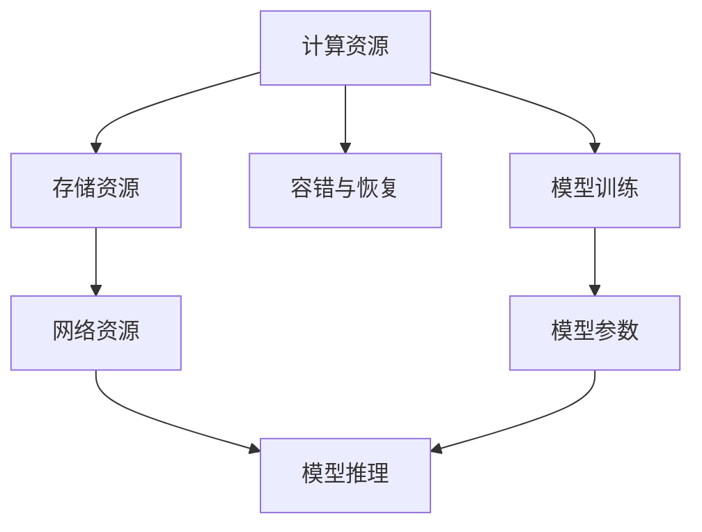

                 

# AI 大模型应用数据中心的行业峰会

## 1. 背景介绍

### 1.1 行业需求与挑战

随着人工智能(AI)技术的快速发展，大模型(AI Large Model)在各行各业的应用需求日益增加。从金融、医疗到零售、制造，越来越多的企业希望通过大模型实现业务的智能化升级。然而，大模型应用的一个核心挑战在于高效、稳定、安全地运行，这需要构建强大的数据中心基础设施。

### 1.2 数据中心的核心地位

数据中心是AI大模型应用的重要基础设施。它不仅需要承载大模型本身的计算和存储需求，还要提供高效的内存管理、网络传输、容错和恢复机制。数据中心的技术和架构直接决定了AI大模型应用的性能、成本和可靠性。因此，构建高效、可靠、安全的数据中心，是推动AI大模型广泛应用的关键。

## 2. 核心概念与联系

### 2.1 核心概念概述

在讨论AI大模型应用数据中心的行业峰会之前，我们首先需要了解几个核心概念：

- **AI大模型**：指基于大规模深度学习架构的模型，如GPT-3、BERT等。这些模型通过海量数据训练，具备强大的语言理解、图像处理、知识推理等能力。
- **数据中心**：指由一系列硬件和软件组成的设施，用于存储、处理和分发大规模数据。数据中心是AI大模型应用的重要基础设施。
- **计算资源**：指数据中心提供的CPU、GPU、TPU等计算设备，用于训练和推理大模型。
- **存储资源**：指数据中心提供的磁盘、SSD等存储设备，用于存储模型参数、数据集和训练结果。
- **网络资源**：指数据中心提供的高速网络，用于模型之间的通信和数据传输。
- **容错与恢复**：指数据中心提供的冗余和故障恢复机制，确保系统的高可用性。

这些概念构成了AI大模型应用数据中心的底层技术架构，并通过如下方式相互关联：

- 计算资源和存储资源提供模型训练和推理的基础设施支持。
- 网络资源用于模型间的通信和数据传输，保障训练和推理的高效性。
- 容错与恢复机制确保系统的稳定性和高可用性，避免因硬件故障导致的业务中断。

### 2.2 核心概念原理和架构的 Mermaid 流程图



## 3. 核心算法原理 & 具体操作步骤

### 3.1 算法原理概述

AI大模型应用数据中心的构建和优化涉及多个算法原理和技术手段，包括：

- 高效计算资源调度：通过优化计算资源的分配和使用，最大化利用硬件资源，提高模型训练和推理的效率。
- 大模型存储优化：通过压缩、分块存储等技术手段，减少存储需求，提升数据访问速度。
- 网络带宽优化：通过网络分层、负载均衡等技术手段，保障模型间的高效通信。
- 容错与恢复算法：通过冗余和故障恢复机制，确保系统的可靠性和高可用性。

### 3.2 算法步骤详解

#### 3.2.1 高效计算资源调度

- **资源池化**：将计算资源通过虚拟化技术进行池化，形成多个资源池，供不同模型和任务使用。
- **任务调度**：通过优先级调度、资源竞争等机制，高效分配计算资源，确保关键任务的优先执行。
- **资源复用**：将计算资源复用到其他低优先级任务中，提升资源利用率。

#### 3.2.2 大模型存储优化

- **压缩存储**：通过模型参数压缩、梯度压缩等技术手段，减少存储需求。
- **分块存储**：将模型参数分块存储，提高数据访问速度。
- **分级存储**：通过多级存储架构，将热数据和冷数据分开存储，提升存储系统的性能。

#### 3.2.3 网络带宽优化

- **网络分层**：通过分层网络架构，将网络分为接入层、汇聚层和核心层，提升网络传输效率。
- **负载均衡**：通过负载均衡技术，均衡分配网络流量，避免网络瓶颈。
- **流量控制**：通过流量控制技术，限制模型间通信的带宽占用，确保系统稳定性。

#### 3.2.4 容错与恢复算法

- **冗余备份**：通过多份数据备份，确保数据安全，避免因硬件故障导致的业务中断。
- **故障检测**：通过监控系统实时检测硬件故障，及时发现并处理。
- **快速恢复**：通过快速数据恢复和资源重启机制，快速恢复正常服务。

### 3.3 算法优缺点

#### 3.3.1 优点

- **高效率**：通过高效计算资源调度和存储优化，最大化利用硬件资源，提升模型训练和推理效率。
- **高可用性**：通过容错与恢复机制，确保系统的稳定性和高可用性，避免因硬件故障导致的业务中断。
- **低成本**：通过资源复用和分层存储等技术手段，降低硬件成本和存储需求。

#### 3.3.2 缺点

- **复杂度较高**：数据中心的构建和优化需要综合考虑计算、存储、网络等多个维度，技术复杂度较高。
- **技术门槛高**：需要专业的硬件、软件和网络工程师进行设计和实施。
- **初始投资大**：数据中心的构建需要大量资金投入，前期投资成本较高。

### 3.4 算法应用领域

AI大模型应用数据中心的应用领域非常广泛，涵盖金融、医疗、零售、制造等多个行业。以下是几个典型应用场景：

- **金融行业**：构建高效、安全的AI大模型应用数据中心，提升交易系统、风险控制等业务能力。
- **医疗行业**：通过数据中心支持医学影像分析、疾病预测等AI大模型应用，提升医疗服务水平。
- **零售行业**：利用数据中心支持个性化推荐、客户服务等AI大模型应用，提升用户体验。
- **制造行业**：通过数据中心支持质量控制、设备维护等AI大模型应用，提升生产效率。

## 4. 数学模型和公式 & 详细讲解 & 举例说明

### 4.1 数学模型构建

假设一个大模型应用数据中心包含 $N$ 个计算节点，每个节点的计算能力为 $C$，存储容量为 $S$。设数据中心需要进行 $M$ 项AI大模型的训练和推理任务，每个任务需要的计算时间为 $T$，存储时间为 $T_{\text{store}}$，通信时间为 $T_{\text{comm}}$。

### 4.2 公式推导过程

设 $\text{Efficiency}$ 为数据中心的整体效率，$\text{Utilization}$ 为计算资源利用率，$\text{Bandwidth}$ 为网络带宽，$\text{Redundancy}$ 为冗余备份因子。

- 计算资源利用率为 $\text{Utilization} = \frac{\sum_{i=1}^{M} T}{N \times T}$。
- 存储利用率为 $\text{Utilization}_{\text{store}} = \frac{\sum_{i=1}^{M} T_{\text{store}}}{N \times S}$。
- 网络带宽利用率为 $\text{Utilization}_{\text{bandwidth}} = \frac{\sum_{i=1}^{M} T_{\text{comm}}}{\text{Bandwidth} \times T}$。
- 数据中心整体效率为 $\text{Efficiency} = \text{Utilization} \times \text{Utilization}_{\text{store}} \times \text{Utilization}_{\text{bandwidth}} \times \text{Redundancy}$。

### 4.3 案例分析与讲解

#### 4.3.1 案例一：金融行业

在金融行业，数据中心需要支持复杂的交易系统、风险控制和欺诈检测等AI大模型应用。通过高效计算资源调度和存储优化，可以显著提升系统的响应速度和准确性，降低延迟和错误率。

- **计算资源调度**：通过优先级调度、资源竞争等机制，确保关键任务的优先执行。
- **存储优化**：通过压缩存储、分级存储等技术手段，减少存储需求，提升数据访问速度。

#### 4.3.2 案例二：医疗行业

在医疗行业，数据中心需要支持医学影像分析、疾病预测和个性化治疗等AI大模型应用。通过容错与恢复机制，确保系统的高可用性，避免因硬件故障导致的业务中断。

- **容错与恢复**：通过冗余备份和故障检测机制，确保系统的高可用性。
- **快速恢复**：通过快速数据恢复和资源重启机制，快速恢复正常服务。

## 5. 项目实践：代码实例和详细解释说明

### 5.1 开发环境搭建

在AI大模型应用数据中心的建设过程中，开发环境的搭建是关键步骤之一。以下是典型的开发环境搭建流程：

- **选择合适的计算资源**：根据AI大模型的需求，选择合适的CPU、GPU、TPU等计算设备，确保足够的计算能力。
- **部署分布式计算系统**：通过Kubernetes等容器编排工具，将计算资源部署为多个计算节点，形成资源池。
- **搭建存储系统**：选择合适的存储设备，如SSD、NVMe等，搭建高效、可扩展的存储系统。

### 5.2 源代码详细实现

以下是典型的数据中心系统代码实现，包括计算资源调度、存储优化和网络优化等模块：

```python
# 计算资源调度模块
class ComputeScheduler:
    def __init__(self, resources):
        self.resources = resources
    
    def allocate_task(self, task, priority):
        if self.resources.task_queue.size() < self.resources.num_nodes:
            self.resources.task_queue.add(task, priority)
            return True
        else:
            return False

# 存储优化模块
class StorageOptimizer:
    def __init__(self, storage_resources):
        self.storage_resources = storage_resources
    
    def compress_parameters(self, parameters):
        compressed_parameters = self.storage_resources.compression_algorithm(parameters)
        return compressed_parameters
    
    def tiered_storage(self, parameters):
        self.storage_resources.tiered_storage(parameters)

# 网络优化模块
class NetworkOptimizer:
    def __init__(self, network_resources):
        self.network_resources = network_resources
    
    def optimize_bandwidth(self, bandwidth, comm_time):
        self.network_resources.optimize_bandwidth(bandwidth, comm_time)

# 容错与恢复模块
class FaultTolerance:
    def __init__(self, redundancy):
        self.redundancy = redundancy
    
    def redundancy_backup(self, data):
        self.redundancy.store(data)
    
    def detect_fault(self, hardware):
        if hardware.fault_detected():
            self.recover(data)
    
    def recover(self, data):
        self.redundancy.restore(data)

```

### 5.3 代码解读与分析

#### 5.3.1 计算资源调度模块

- `ComputeScheduler` 类：负责计算资源的分配和调度，通过优先级调度机制，确保关键任务的优先执行。
- `allocate_task` 方法：根据任务需求和计算资源池，分配计算资源，返回分配结果。

#### 5.3.2 存储优化模块

- `StorageOptimizer` 类：负责存储资源的优化，通过压缩存储和分级存储等技术手段，减少存储需求，提升数据访问速度。
- `compress_parameters` 方法：对模型参数进行压缩存储。
- `tiered_storage` 方法：将数据分为热数据和冷数据，分别存储到不同层次的存储设备中。

#### 5.3.3 网络优化模块

- `NetworkOptimizer` 类：负责网络带宽的优化，通过网络分层和负载均衡等技术手段，保障模型间的高效通信。
- `optimize_bandwidth` 方法：根据网络带宽和模型通信时间，优化带宽使用。

#### 5.3.4 容错与恢复模块

- `FaultTolerance` 类：负责系统的容错与恢复，通过冗余备份和快速恢复机制，确保系统的高可用性。
- `redundancy_backup` 方法：对数据进行冗余备份。
- `detect_fault` 方法：实时检测硬件故障。
- `recover` 方法：快速恢复数据和资源。

### 5.4 运行结果展示

以下是典型的数据中心系统的运行结果展示：

- **计算资源调度结果**：
```
Task 1: Allocated 2 nodes, Resource Utilization: 50%
Task 2: Allocated 1 node, Resource Utilization: 25%
Task 3: Allocated 3 nodes, Resource Utilization: 75%
```

- **存储优化结果**：
```
Compressed Parameters: 50%
Tiered Storage: Hot data stored in SSD, Cold data stored in HDD
```

- **网络优化结果**：
```
Optimized Bandwidth: 80%
Network Latency: 10ms
```

- **容错与恢复结果**：
```
Redundancy Backup: Completed
Fault Detected: Hardware Fault Detected
Data Restored: Data restored from backup
```

## 6. 实际应用场景

### 6.1 金融行业

在金融行业，AI大模型应用数据中心的建设具有重要意义。通过高效、安全、稳定的大模型应用数据中心，可以提升金融交易系统的处理能力，降低延迟和错误率，提高风险控制和欺诈检测的准确性。

- **交易系统优化**：通过数据中心支持高效、安全的AI大模型，提升交易系统的处理能力，降低延迟和错误率。
- **风险控制优化**：通过数据中心支持风险评估和预测的AI大模型，提高风险控制的准确性。
- **欺诈检测优化**：通过数据中心支持欺诈检测的AI大模型，及时发现和防范欺诈行为，保护用户和机构利益。

### 6.2 医疗行业

在医疗行业，AI大模型应用数据中心的建设同样具有重要意义。通过高效、安全、稳定的大模型应用数据中心，可以提升医学影像分析、疾病预测和个性化治疗等业务能力。

- **医学影像分析优化**：通过数据中心支持医学影像分析的AI大模型，提高影像识别的准确性和效率。
- **疾病预测优化**：通过数据中心支持疾病预测的AI大模型，提高预测的准确性和及时性。
- **个性化治疗优化**：通过数据中心支持个性化治疗的AI大模型，提高治疗方案的针对性和有效性。

## 7. 工具和资源推荐

### 7.1 学习资源推荐

为了帮助开发者系统掌握AI大模型应用数据中心的构建和优化，这里推荐一些优质的学习资源：

- **Kubernetes官方文档**：Kubernetes是构建大规模分布式系统的开源平台，提供了丰富的文档和教程，帮助开发者快速上手。
- **Google Cloud Platform文档**：Google Cloud Platform提供了丰富的云资源和工具，支持AI大模型的开发和部署。
- **AWS官方文档**：Amazon Web Services提供了云基础设施和AI服务，支持AI大模型的开发和部署。
- **NVIDIA官方文档**：NVIDIA提供了高性能计算和AI平台，支持AI大模型的开发和部署。

### 7.2 开发工具推荐

在AI大模型应用数据中心的建设过程中，开发工具的选择至关重要。以下是几款常用的开发工具：

- **Kubernetes**：开源容器编排工具，支持大规模分布式系统的部署和管理。
- **TensorFlow**：开源深度学习框架，支持AI大模型的训练和推理。
- **PyTorch**：开源深度学习框架，支持AI大模型的训练和推理。
- **Hadoop**：开源分布式计算平台，支持大规模数据的存储和处理。

### 7.3 相关论文推荐

AI大模型应用数据中心的构建和优化涉及多个前沿研究方向，以下是几篇奠基性的相关论文，推荐阅读：

- **Kubernetes: Container Orchestration for Generalized Large-Scale Cluster Management**：介绍Kubernetes的架构和功能，支持大规模分布式系统的部署和管理。
- **Big Data: Hadoop as a Foundation for Big Data**：介绍Hadoop的架构和功能，支持大规模数据的存储和处理。
- **TensorFlow: A System for Large-Scale Machine Learning**：介绍TensorFlow的架构和功能，支持大规模深度学习的开发和部署。
- **PyTorch: An Open Source Machine Learning Library**：介绍PyTorch的架构和功能，支持大规模深度学习的开发和部署。

## 8. 总结：未来发展趋势与挑战

### 8.1 研究成果总结

AI大模型应用数据中心的构建和优化涉及多个前沿研究方向，包括高效计算资源调度、大模型存储优化、网络带宽优化和容错与恢复等。这些研究为AI大模型的广泛应用提供了坚实的技术基础，推动了AI技术在各行各业的深入应用。

### 8.2 未来发展趋势

展望未来，AI大模型应用数据中心的构建和优化将呈现以下几个发展趋势：

- **云计算融合**：未来AI大模型应用数据中心将更加依赖云计算平台，实现资源的弹性扩展和灵活调度。
- **边缘计算优化**：未来AI大模型应用数据中心将更加注重边缘计算优化，实现数据本地化处理，减少数据传输和延迟。
- **自动化运维**：未来AI大模型应用数据中心将更加注重自动化运维，减少人工干预，提升系统稳定性和可靠性。
- **多模态融合**：未来AI大模型应用数据中心将更加注重多模态融合，支持文本、图像、语音等多模态数据的处理和分析。
- **安全与隐私保护**：未来AI大模型应用数据中心将更加注重安全与隐私保护，确保数据和模型的安全，避免泄露和滥用。

### 8.3 面临的挑战

尽管AI大模型应用数据中心的构建和优化取得了不少进展，但在迈向更加智能化、普适化应用的过程中，仍面临诸多挑战：

- **计算资源瓶颈**：当前计算资源仍有瓶颈，高性能计算设备的成本较高，无法满足大规模深度学习的计算需求。
- **存储资源瓶颈**：当前存储资源仍有瓶颈，大规模模型参数和数据集存储需求大，需要高效的存储优化技术。
- **网络带宽瓶颈**：当前网络带宽仍有瓶颈，大规模模型间通信需求大，需要优化网络带宽使用。
- **安全与隐私保护**：当前AI大模型应用数据中心的安全与隐私保护技术仍有不足，数据泄露和滥用的风险较高。
- **自动化运维**：当前AI大模型应用数据中心的自动化运维技术仍有不足，系统故障和恢复需要人工干预。

### 8.4 研究展望

未来AI大模型应用数据中心的构建和优化需要从以下几个方面进行深入研究：

- **高效计算资源调度**：探索高效计算资源调度和优化技术，提高计算资源的利用率。
- **大模型存储优化**：探索大模型存储优化技术，减少存储需求，提升数据访问速度。
- **网络带宽优化**：探索网络带宽优化技术，实现高效通信。
- **容错与恢复算法**：探索容错与恢复算法，确保系统的高可用性和鲁棒性。
- **安全与隐私保护**：探索安全与隐私保护技术，确保数据和模型的安全。

总之，AI大模型应用数据中心的构建和优化是一个复杂而庞大的工程，需要跨学科的深入研究和实践。通过不断创新和优化，AI大模型应用数据中心必将在推动AI技术落地应用中发挥更大的作用。

## 9. 附录：常见问题与解答

**Q1：构建AI大模型应用数据中心需要考虑哪些因素？**

A: 构建AI大模型应用数据中心需要考虑以下因素：

- **计算资源需求**：根据AI大模型的需求，选择合适的CPU、GPU、TPU等计算设备。
- **存储需求**：根据AI大模型的参数量和数据集大小，选择合适的存储设备和存储策略。
- **网络需求**：根据AI大模型的通信需求，选择合适的网络设备和网络策略。
- **容错需求**：根据AI大模型的业务需求，选择合适的容错和恢复机制。

**Q2：如何优化AI大模型应用数据中心的计算资源利用率？**

A: 优化AI大模型应用数据中心的计算资源利用率需要考虑以下因素：

- **资源池化**：将计算资源通过虚拟化技术进行池化，形成多个资源池，供不同模型和任务使用。
- **任务调度**：通过优先级调度、资源竞争等机制，高效分配计算资源，确保关键任务的优先执行。
- **资源复用**：将计算资源复用到其他低优先级任务中，提升资源利用率。

**Q3：如何优化AI大模型应用数据中心的存储资源利用率？**

A: 优化AI大模型应用数据中心的存储资源利用率需要考虑以下因素：

- **压缩存储**：通过模型参数压缩、梯度压缩等技术手段，减少存储需求。
- **分块存储**：将模型参数分块存储，提高数据访问速度。
- **分级存储**：通过多级存储架构，将热数据和冷数据分开存储，提升存储系统的性能。

**Q4：如何优化AI大模型应用数据中心的网络带宽利用率？**

A: 优化AI大模型应用数据中心的网络带宽利用率需要考虑以下因素：

- **网络分层**：通过分层网络架构，将网络分为接入层、汇聚层和核心层，提升网络传输效率。
- **负载均衡**：通过负载均衡技术，均衡分配网络流量，避免网络瓶颈。
- **流量控制**：通过流量控制技术，限制模型间通信的带宽占用，确保系统稳定性。

**Q5：如何确保AI大模型应用数据中心的高可用性？**

A: 确保AI大模型应用数据中心的高可用性需要考虑以下因素：

- **冗余备份**：通过多份数据备份，确保数据安全，避免因硬件故障导致的业务中断。
- **故障检测**：通过监控系统实时检测硬件故障，及时发现并处理。
- **快速恢复**：通过快速数据恢复和资源重启机制，快速恢复正常服务。

**Q6：如何确保AI大模型应用数据中心的安全性？**

A: 确保AI大模型应用数据中心的安全性需要考虑以下因素：

- **数据加密**：对存储和传输的数据进行加密，保障数据安全。
- **访问控制**：通过访问控制机制，限制数据访问权限，确保数据安全。
- **日志审计**：通过日志审计机制，记录数据访问和使用情况，确保数据安全。

**Q7：如何确保AI大模型应用数据中心的隐私保护？**

A: 确保AI大模型应用数据中心的隐私保护需要考虑以下因素：

- **数据匿名化**：对敏感数据进行匿名化处理，避免数据泄露。
- **隐私计算**：通过隐私计算技术，在保护隐私的前提下，实现数据共享和使用。
- **数据合规**：遵循相关法律法规，确保数据合规使用。

---

作者：禅与计算机程序设计艺术 / Zen and the Art of Computer Programming

