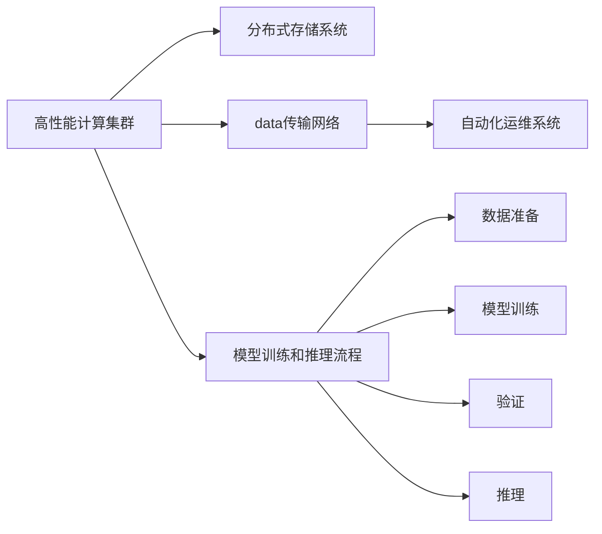

                 

## 1. 背景介绍

### 1.1 问题由来
在人工智能(AI)领域，特别是在深度学习和自然语言处理(NLP)等方向，大规模预训练模型（如BERT、GPT-3等）已经成为推动技术进步的关键因素。这些模型在处理大规模文本数据时表现出卓越的性能，但它们通常需要在高性能计算集群上进行训练和推理。为支持这些模型的应用，数据中心的基础设施和项目管理变得至关重要。本文将探讨如何构建和管理一个高效、可扩展的数据中心，以支持AI大模型的部署和运行。

### 1.2 问题核心关键点
构建AI大模型应用数据中心的核心挑战包括：
1. **高性能计算**：大模型需要大量的GPU和TPU资源，如何高效利用硬件资源是关键。
2. **数据存储和管理**：大模型涉及海量数据的存储和处理，如何高效、可靠地管理数据是另一大挑战。
3. **系统架构**：如何设计一个能够支持大规模并行计算和高效数据传输的系统架构。
4. **模型训练和推理**：如何优化模型训练流程，提高推理速度，降低延迟。
5. **可扩展性**：如何构建一个可以随着模型规模和业务需求增长的数据中心。

### 1.3 问题研究意义
构建和管理AI大模型应用数据中心对于推动AI技术的发展和落地具有重要意义：
1. **提升AI技术性能**：高质量的数据中心可以显著提升AI模型的训练和推理速度，加速技术进步。
2. **支持多样化的AI应用**：高性能的数据中心支持多种AI应用，包括语音识别、图像处理、自然语言处理等。
3. **加速AI产业化**：通过优化数据中心的性能，可以更快地将AI技术转化为实际应用，推动AI在各行各业的广泛应用。
4. **降低成本**：通过优化资源利用率和能效，降低运营成本，提高数据中心的可持续性。

## 2. 核心概念与联系

### 2.1 核心概念概述

在AI大模型应用数据中心的构建中，涉及多个核心概念，它们之间的联系紧密：

- **高性能计算集群**：指使用大量GPU或TPU组成的计算集群，支持AI模型的训练和推理。
- **分布式存储系统**：用于存储和处理大规模数据，包括文本、图像、视频等。
- **数据传输网络**：用于高速、可靠的数据传输，连接计算集群与存储系统。
- **自动化运维系统**：用于监控和管理计算资源、存储系统和数据传输网络。
- **模型训练和推理流程**：包括数据准备、模型训练、验证、推理等步骤。

这些概念之间的联系通过以下Mermaid流程图来展示：



这个流程图展示了各个核心概念如何协同工作，以支持AI大模型的应用。

## 3. 核心算法原理 & 具体操作步骤

### 3.1 算法原理概述

AI大模型应用数据中心的构建和管理，涉及多个复杂的算法原理和操作步骤。这些步骤包括但不限于：

- **资源规划和调度**：根据模型需求和资源可用性，动态规划和调度计算资源。
- **数据管理和传输**：设计高效的数据存储和传输机制，确保数据在集群中的可靠传输。
- **模型训练优化**：采用分布式训练、模型并行、梯度压缩等技术，优化训练过程，提高效率。
- **系统监控和管理**：实时监控系统性能和资源使用情况，自动调整和优化系统配置。

### 3.2 算法步骤详解

构建和管理AI大模型应用数据中心的详细步骤包括：

1. **需求分析**：评估模型规模、计算需求、数据量等，确定硬件和软件需求。
2. **系统设计**：设计计算集群、存储系统、网络架构等，确保其能够支持AI模型的高效运行。
3. **资源部署**：安装和配置计算节点、存储系统、网络设备等，确保硬件资源可用。
4. **系统调优**：对系统进行调优，包括资源分配、网络优化、缓存策略等。
5. **模型训练和推理**：进行模型训练和推理，确保其在数据中心的高效运行。
6. **系统监控和管理**：使用自动化工具监控系统性能，及时发现和解决潜在问题。

### 3.3 算法优缺点

AI大模型应用数据中心的构建和管理具有以下优点：

- **高可扩展性**：能够随着模型规模和业务需求增长，动态调整资源和系统配置。
- **高效性能**：通过优化资源利用率和算法设计，提高模型训练和推理速度。
- **自动化运维**：通过自动化工具进行系统监控和管理，降低人工操作和误操作的风险。

同时，也存在一些缺点：

- **初始投资高**：构建高性能计算集群和分布式存储系统需要高昂的投资成本。
- **复杂度高**：系统设计和运维涉及多个复杂环节，需要专业的技术团队支持。
- **维护成本高**：随着系统规模的增长，维护和升级的难度和成本也会增加。

### 3.4 算法应用领域

AI大模型应用数据中心主要应用于以下领域：

- **AI研究机构**：支持科学家进行AI基础研究和前沿技术开发。
- **大型科技公司**：在自动驾驶、语音识别、图像处理、自然语言处理等领域进行大规模模型训练和推理。
- **医疗健康**：支持AI在疾病诊断、医疗影像分析、个性化治疗等方面的应用。
- **金融服务**：支持AI在风险评估、金融预测、智能投顾等方面的应用。
- **零售电商**：支持AI在客户推荐、库存管理、供应链优化等方面的应用。

## 4. 数学模型和公式 & 详细讲解 & 举例说明

### 4.1 数学模型构建

在AI大模型应用数据中心的设计中，数学模型构建是核心环节之一。构建数学模型的目的在于优化资源利用率和提高系统性能。以高性能计算集群为例，可以使用以下数学模型：

- **资源分配模型**：根据任务需求和资源可用性，分配计算资源。模型可表示为：

$$
\max \sum_{i=1}^{n} \text{Utilization}_i
$$

约束条件包括：

$$
\sum_{j=1}^{m} x_{ij} \leq r_i, \quad \forall i \in N
$$

其中，$x_{ij}$表示任务$i$在计算节点$j$上分配的资源量，$r_i$表示节点$i$的资源限制。

- **数据传输模型**：设计数据传输路径，最小化数据传输时间。模型可表示为：

$$
\min \sum_{i,j} d_{ij} \cdot \text{Time}_{ij}
$$

约束条件包括：

$$
x_{ij} \leq c_{ij}, \quad \forall i,j
$$

其中，$d_{ij}$表示节点$i$和节点$j$之间的距离，$x_{ij}$表示节点$i$和节点$j$之间的数据传输量，$c_{ij}$表示节点$i$和节点$j$之间的带宽限制。

### 4.2 公式推导过程

上述数学模型的推导过程如下：

1. **资源分配模型**：

   目标函数：

   $$
   \max \sum_{i=1}^{n} \text{Utilization}_i
   $$

   约束条件：

   $$
   \sum_{j=1}^{m} x_{ij} \leq r_i, \quad \forall i \in N
   $$

   该模型通过最大化所有计算节点的利用率，提高资源利用效率。

2. **数据传输模型**：

   目标函数：

   $$
   \min \sum_{i,j} d_{ij} \cdot \text{Time}_{ij}
   $$

   约束条件：

   $$
   x_{ij} \leq c_{ij}, \quad \forall i,j
   $$

   该模型通过最小化数据传输时间，提高数据传输效率。

### 4.3 案例分析与讲解

以谷歌云平台(GCP)为例，谷歌在其数据中心中采用了Kubernetes容器编排技术，支持AI模型的部署和运行。谷歌云平台的高性能计算集群和分布式存储系统，通过优化资源分配和数据传输，实现了高效、可靠的AI模型应用。

具体来说，谷歌使用TensorFlow框架进行模型训练和推理，通过Kubernetes进行资源调度和自动化运维。在计算节点上，谷歌使用了TPU硬件，以支持大规模并行计算。在数据传输上，谷歌设计了高速、可靠的分布式存储系统，支持大规模数据的存储和处理。

## 5. 项目实践：代码实例和详细解释说明

### 5.1 开发环境搭建

构建AI大模型应用数据中心需要高昂的投资和专业的技术支持。以下是构建高性能计算集群和分布式存储系统的基本流程：

1. **计算节点配置**：选择合适的硬件设备，如GPU或TPU，并对其进行配置和调试。
2. **存储系统配置**：配置分布式文件系统，如Hadoop、HDFS等，支持大规模数据的存储和处理。
3. **网络设备配置**：配置高性能网络设备，支持高速、可靠的数据传输。

### 5.2 源代码详细实现

以使用TensorFlow框架进行模型训练和推理为例，以下是详细的代码实现：

```python
import tensorflow as tf
from tensorflow.keras import layers

# 定义模型
model = tf.keras.Sequential([
    layers.Dense(256, activation='relu'),
    layers.Dense(128, activation='relu'),
    layers.Dense(10, activation='softmax')
])

# 编译模型
model.compile(optimizer='adam',
              loss='categorical_crossentropy',
              metrics=['accuracy'])

# 训练模型
model.fit(x_train, y_train, epochs=10, batch_size=32)

# 推理模型
y_pred = model.predict(x_test)
```

### 5.3 代码解读与分析

上述代码实现了使用TensorFlow进行模型训练和推理的基本流程。具体来说：

- `Sequential`：定义了一个线性堆叠的模型，包含多个全连接层。
- `Dense`：定义了全连接层，其中包含256个神经元，使用ReLU激活函数。
- `compile`：编译模型，指定优化器、损失函数和评估指标。
- `fit`：训练模型，使用训练数据集进行训练。
- `predict`：推理模型，使用测试数据集进行推理。

## 6. 实际应用场景

### 6.1 智能客服系统

在智能客服系统中，AI大模型应用数据中心发挥着关键作用。智能客服系统通过AI模型进行自然语言理解和对话生成，能够快速响应客户咨询，提供智能化的客户服务。

在实践中，智能客服系统需要处理海量客户数据，进行自然语言处理和对话生成。AI大模型应用数据中心通过高性能计算集群和分布式存储系统，支持大规模数据处理和模型训练，确保智能客服系统的高效运行。

### 6.2 金融风险管理

在金融风险管理中，AI大模型应用数据中心同样发挥着重要作用。金融风险管理需要处理大量的金融数据，进行风险评估和预测。AI大模型应用数据中心通过高性能计算集群和分布式存储系统，支持大规模数据处理和模型训练，确保金融风险管理的及时性和准确性。

在实践中，金融风险管理需要处理大量的交易数据、市场数据等，进行风险评估和预测。AI大模型应用数据中心通过高性能计算集群和分布式存储系统，支持大规模数据处理和模型训练，确保金融风险管理的及时性和准确性。

### 6.3 医疗健康

在医疗健康领域，AI大模型应用数据中心同样具有重要意义。医疗健康需要处理大量的医疗数据，进行疾病诊断、治疗方案生成等。AI大模型应用数据中心通过高性能计算集群和分布式存储系统，支持大规模数据处理和模型训练，确保医疗健康的高效运行。

在实践中，医疗健康需要处理大量的医疗影像、病历数据等，进行疾病诊断、治疗方案生成等。AI大模型应用数据中心通过高性能计算集群和分布式存储系统，支持大规模数据处理和模型训练，确保医疗健康的高效运行。

### 6.4 未来应用展望

未来，AI大模型应用数据中心将向以下几个方向发展：

1. **边缘计算**：将计算任务分布到边缘设备，减少数据传输延迟，提高响应速度。
2. **云-边协同**：结合云和边缘计算，实现更高效、更灵活的数据处理和模型训练。
3. **模型压缩和优化**：通过模型压缩和优化技术，提高模型推理速度，降低计算资源需求。
4. **自动化运维**：通过自动化运维系统，实现系统监控和管理，降低人工操作和误操作的风险。
5. **跨模态融合**：将图像、视频、音频等多模态数据与文本数据进行融合，实现更全面、更准确的数据处理和模型训练。

## 7. 工具和资源推荐

### 7.1 学习资源推荐

为了帮助开发者系统掌握AI大模型应用数据中心的构建和管理，这里推荐一些优质的学习资源：

1. **Google Cloud AI DevOps 手册**：详细介绍了如何构建和管理AI大模型应用数据中心，包括计算资源规划、数据管理、模型训练和推理等。
2. **Kubernetes官方文档**：详细介绍了如何使用Kubernetes进行AI模型的部署和管理，包括容器编排、资源调度和自动化运维等。
3. **TensorFlow官方文档**：详细介绍了如何使用TensorFlow进行模型训练和推理，包括分布式训练、模型并行等。
4. **PyTorch官方文档**：详细介绍了如何使用PyTorch进行模型训练和推理，包括分布式训练、模型并行等。

### 7.2 开发工具推荐

高效的开发离不开优秀的工具支持。以下是几款用于AI大模型应用数据中心开发的常用工具：

1. **Kubernetes**：用于容器编排，支持AI模型的部署和管理。
2. **Hadoop**：用于分布式文件系统，支持大规模数据的存储和处理。
3. **TensorFlow**：用于模型训练和推理，支持分布式训练和模型并行。
4. **PyTorch**：用于模型训练和推理，支持分布式训练和模型并行。
5. **Prometheus**：用于系统监控，支持实时监控和报警。

### 7.3 相关论文推荐

AI大模型应用数据中心的构建和管理涉及多个前沿研究方向。以下是几篇奠基性的相关论文，推荐阅读：

1. **GPU in the Cloud**：谷歌的研究论文，详细介绍了谷歌云平台的高性能计算集群和分布式存储系统的设计和管理。
2. **Kubernetes: A Container Orchestration System for Generalized Large-Scale Cluster Management**：谷歌的研究论文，详细介绍了Kubernetes的容器编排技术。
3. **TensorFlow: A System for Large-Scale Machine Learning**：谷歌的研究论文，详细介绍了TensorFlow的分布式训练和模型并行技术。
4. **PyTorch: An Open Source Machine Learning Library**：Facebook的研究论文，详细介绍了PyTorch的分布式训练和模型并行技术。

## 8. 总结：未来发展趋势与挑战

### 8.1 总结

本文对构建和管理AI大模型应用数据中心的方法进行了全面系统的介绍。首先阐述了AI大模型应用数据中心的构建背景和意义，明确了数据中心在支持AI大模型应用中的关键作用。其次，从原理到实践，详细讲解了AI大模型应用数据中心的构建和管理方法，包括高性能计算集群、分布式存储系统、数据传输网络、自动化运维系统等。

### 8.2 未来发展趋势

未来，AI大模型应用数据中心将呈现以下几个发展趋势：

1. **边缘计算的普及**：随着5G和物联网技术的普及，边缘计算设备将越来越普及，AI大模型应用数据中心将向边缘延伸。
2. **云-边协同**：云和边缘计算的融合将带来更高效、更灵活的数据处理和模型训练。
3. **模型压缩和优化**：通过模型压缩和优化技术，提高模型推理速度，降低计算资源需求。
4. **自动化运维**：通过自动化运维系统，实现系统监控和管理，降低人工操作和误操作的风险。
5. **跨模态融合**：将图像、视频、音频等多模态数据与文本数据进行融合，实现更全面、更准确的数据处理和模型训练。

### 8.3 面临的挑战

尽管AI大模型应用数据中心已经取得了显著进展，但在迈向更加智能化、普适化应用的过程中，它仍面临着诸多挑战：

1. **初始投资高**：构建高性能计算集群和分布式存储系统需要高昂的投资成本。
2. **复杂度高**：系统设计和运维涉及多个复杂环节，需要专业的技术团队支持。
3. **维护成本高**：随着系统规模的增长，维护和升级的难度和成本也会增加。
4. **数据安全和隐私**：处理大规模敏感数据，需要严格的数据安全和隐私保护措施。
5. **算力供需平衡**：随着模型规模和业务需求的增长，如何平衡算力供需，优化资源利用率，仍是一大挑战。

### 8.4 研究展望

未来，需要在以下几个方向进行更多的研究：

1. **多模态数据融合**：将图像、视频、音频等多模态数据与文本数据进行融合，实现更全面、更准确的数据处理和模型训练。
2. **模型压缩和优化**：通过模型压缩和优化技术，提高模型推理速度，降低计算资源需求。
3. **边缘计算和云-边协同**：结合边缘计算和云服务，实现更高效、更灵活的数据处理和模型训练。
4. **自动化运维和监控**：通过自动化运维系统，实现系统监控和管理，降低人工操作和误操作的风险。
5. **数据安全和隐私保护**：严格的数据安全和隐私保护措施，确保数据处理和存储的安全性。

## 9. 附录：常见问题与解答

**Q1：构建AI大模型应用数据中心需要哪些关键技术和工具？**

A: 构建AI大模型应用数据中心需要以下关键技术和工具：

1. **高性能计算集群**：使用大量GPU或TPU组成的计算集群，支持AI模型的训练和推理。
2. **分布式存储系统**：用于存储和处理大规模数据，包括文本、图像、视频等。
3. **数据传输网络**：用于高速、可靠的数据传输，连接计算集群与存储系统。
4. **自动化运维系统**：用于监控和管理计算资源、存储系统和数据传输网络。
5. **模型训练和推理工具**：如TensorFlow、PyTorch等，支持模型的训练和推理。

**Q2：如何优化计算资源的使用效率？**

A: 优化计算资源的使用效率可以从以下几个方面入手：

1. **资源规划和调度**：根据模型需求和资源可用性，动态规划和调度计算资源。
2. **模型并行和分布式训练**：采用模型并行和分布式训练技术，提高计算效率。
3. **梯度压缩和混合精度训练**：使用梯度压缩和混合精度训练技术，减少计算资源需求。
4. **边缘计算**：将计算任务分布到边缘设备，减少数据传输延迟，提高响应速度。

**Q3：如何确保数据的安全和隐私保护？**

A: 确保数据的安全和隐私保护可以从以下几个方面入手：

1. **数据加密**：对存储和传输的数据进行加密处理，防止数据泄露。
2. **访问控制**：通过身份验证和访问控制技术，限制数据访问权限，防止未授权访问。
3. **数据匿名化**：对敏感数据进行匿名化处理，防止数据关联攻击。
4. **监控和审计**：实时监控数据访问和处理情况，记录和审计数据操作，确保数据操作的可追溯性和可审查性。

**Q4：如何选择合适的高性能计算集群和分布式存储系统？**

A: 选择合适的高性能计算集群和分布式存储系统可以从以下几个方面入手：

1. **计算资源需求**：根据模型规模和计算需求，选择合适的计算集群和存储系统。
2. **性能和可靠性**：选择高性能、高可靠性的计算集群和存储系统，确保系统稳定运行。
3. **扩展性和可维护性**：选择易于扩展和维护的系统架构，确保系统能够随着业务需求增长而增长。
4. **成本效益**：综合考虑系统投资和运营成本，选择性价比最高的系统方案。

总之，构建和管理AI大模型应用数据中心是一个复杂而系统的工程，需要从多个方面进行全面优化和考虑。通过不断探索和实践，相信我们能构建出高效、可扩展、高性能的AI大模型应用数据中心，为AI技术的发展和落地提供坚实的基础。

