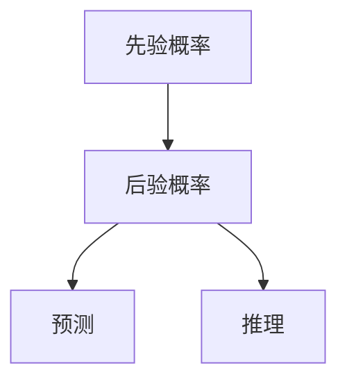

                 

# AI 大模型计算机科学家群英传：所罗门诺夫归纳法（Solomonoff Induction）

## 1. 背景介绍

### 1.1 问题由来

在人工智能发展的漫长历程中，每一位科学家和工程师都在探索如何更好地理解智能和复杂系统的奥秘。从图灵测试到深度学习，从强化学习到计算机视觉，每一步都在推动我们更接近智能的理解。而在这一过程中，所罗门诺夫归纳法（Solomonoff Induction），又被称为“通用预测理论”，为我们提供了一种全新的视角。

所罗门诺夫归纳法是由俄罗斯数学家雷蒙·所罗门诺夫（Ray Solomonoff）在上世纪五十年代提出的，其核心思想是通过对先验概率和后验概率的建模，来预测和推理未来的数据。这一理论不仅为人工智能的逻辑基础提供了新思路，也为当前的大模型研究提供了宝贵的借鉴。

### 1.2 问题核心关键点

所罗门诺夫归纳法的核心思想在于通过对先验概率和后验概率的建模，来预测和推理未来的数据。这一理论的核心是使用先验概率来表示模型对数据的先验知识，通过观察数据和更新模型，得到对数据的后验概率预测，从而进行决策和推理。

所罗门诺夫归纳法的关键点包括：
1. 先验概率模型：表示模型对数据的初始信念。
2. 后验概率模型：根据数据更新先验概率模型，得到对数据的更新信念。
3. 预测与推理：根据后验概率模型，对未来数据进行预测和推理。

## 2. 核心概念与联系

### 2.1 核心概念概述

为了更好地理解所罗门诺夫归纳法，本节将介绍几个密切相关的核心概念：

- 先验概率：表示模型对数据的初始信念，反映了模型的先验知识。
- 后验概率：在观察到数据后，模型对数据的更新信念，反映了模型对数据的证据。
- 预测：使用后验概率模型，对未来数据进行预测。
- 推理：使用后验概率模型，对数据进行推理，得到可能的解释或推理结果。

这些概念之间的逻辑关系可以通过以下Mermaid流程图来展示：



这个流程图展示了所罗门诺夫归纳法的基本流程：先验概率作为模型对数据的初始信念，通过观察数据更新为后验概率，然后使用后验概率进行预测和推理。

## 3. 核心算法原理 & 具体操作步骤
### 3.1 算法原理概述

所罗门诺夫归纳法的核心原理在于通过先验概率和后验概率的建模，对未来数据进行预测和推理。其基本流程包括：

1. 定义先验概率模型：表示模型对数据的初始信念。
2. 观察数据：根据数据的统计特性，更新先验概率模型为后验概率模型。
3. 进行预测和推理：使用后验概率模型对未来数据进行预测和推理。

数学上，所罗门诺夫归纳法通常使用贝叶斯定理进行后验概率的计算，即：

$$
P(x|y) = \frac{P(y|x)P(x)}{P(y)}
$$

其中，$x$ 表示输入数据，$y$ 表示模型的输出或状态。$P(x)$ 为先验概率，$P(y|x)$ 为模型在输入为 $x$ 时的条件概率，$P(y)$ 为模型输出为 $y$ 的概率。

### 3.2 算法步骤详解

所罗门诺夫归纳法的具体操作步骤包括：

**Step 1: 定义先验概率模型**
- 根据任务的性质，定义一个先验概率模型 $P(x)$，表示模型对数据的初始信念。

**Step 2: 观察数据**
- 根据输入数据 $x$，使用贝叶斯定理更新先验概率模型为后验概率模型 $P(x|y)$，得到模型在给定数据 $x$ 下的更新信念。

**Step 3: 进行预测和推理**
- 根据后验概率模型 $P(x|y)$，对未来数据进行预测，即使用后验概率模型 $P(x|y)$ 来预测新的数据 $x'$。
- 根据后验概率模型 $P(x|y)$，对数据进行推理，即使用后验概率模型 $P(x|y)$ 来推理数据的生成过程或原因。

### 3.3 算法优缺点

所罗门诺夫归纳法具有以下优点：
1. 理论基础坚实：基于概率论和信息论，具有坚实的理论基础。
2. 通用性强：可以应用于各种类型的数据和任务，具有普遍适用性。
3. 预测能力强：通过先验概率和后验概率的建模，对未来数据进行预测，能够捕捉数据的复杂性和不确定性。

同时，该方法也存在一定的局限性：
1. 计算复杂度高：先验概率和后验概率的计算涉及到大量的信息量和复杂计算，计算成本较高。
2. 先验知识依赖：模型的预测性能很大程度上依赖于先验概率模型的设计，需要精心设计和调整。
3. 数据依赖性强：模型的性能很大程度上依赖于数据的统计特性，对于稀疏数据或噪声数据，预测性能可能不佳。

尽管存在这些局限性，但所罗门诺夫归纳法为我们提供了一种新的角度来理解和预测数据，特别是在当前大数据和复杂系统的背景下，其应用前景依然广阔。

### 3.4 算法应用领域

所罗门诺夫归纳法具有广泛的应用前景，以下是几个主要的应用领域：

- 自然语言处理：用于文本分类、情感分析、机器翻译等任务。通过观察文本数据，更新先验概率模型，对未来文本进行预测和推理。
- 计算机视觉：用于图像分类、目标检测、语义分割等任务。通过观察图像数据，更新先验概率模型，对未来图像进行预测和推理。
- 智能推荐系统：用于用户行为预测、商品推荐、内容过滤等任务。通过观察用户行为数据，更新先验概率模型，对未来用户行为进行预测和推理。
- 金融风险管理：用于股票预测、信用评估、市场分析等任务。通过观察金融数据，更新先验概率模型，对未来金融市场进行预测和推理。
- 医疗诊断：用于疾病预测、治疗方案推荐、基因分析等任务。通过观察医疗数据，更新先验概率模型，对未来医疗结果进行预测和推理。

## 4. 数学模型和公式 & 详细讲解  
### 4.1 数学模型构建

本节将使用数学语言对所罗门诺夫归纳法的预测和推理过程进行更加严格的刻画。

记输入数据为 $x$，模型的输出为 $y$，先验概率模型为 $P(x)$，后验概率模型为 $P(x|y)$。假设模型能够从 $x$ 中提取特征 $f(x)$，并将其映射为概率分布 $P(y|x)$，则根据贝叶斯定理，模型的后验概率模型为：

$$
P(x|y) = \frac{P(y|x)P(x)}{P(y)}
$$

其中，$P(x)$ 为先验概率，$P(y|x)$ 为条件概率，$P(y)$ 为模型输出的概率。

### 4.2 公式推导过程

以下我们以二分类任务为例，推导后验概率的计算公式。

假设模型在输入 $x$ 上的输出为 $y \in \{0,1\}$。则二分类后验概率模型为：

$$
P(x|y=1) = \frac{P(y=1|x)P(x)}{P(y=1)}
$$

其中，$P(y=1|x)$ 为模型在输入为 $x$ 时输出为 1 的条件概率，$P(x)$ 为先验概率，$P(y=1)$ 为模型输出为 1 的概率。

根据贝叶斯定理，模型的后验概率模型为：

$$
P(x|y=1) = \frac{P(y=1|x)P(x)}{P(y=1)P(y=0)}
$$

在实际应用中，我们通常使用极大似然估计或贝叶斯估计来计算先验概率和后验概率。例如，对于二分类任务，我们可以使用以下公式进行极大似然估计：

$$
P(y=1) = \frac{1}{N}\sum_{i=1}^N I(y_i=1)
$$

其中，$I(y_i=1)$ 为指示函数，表示样本 $i$ 是否为正类。

### 4.3 案例分析与讲解

假设我们有一个简单的二分类任务，训练集包含 100 个样本，其中 60 个为正类，40 个为负类。我们希望使用所罗门诺夫归纳法对新的样本进行预测和推理。

首先，我们定义先验概率模型 $P(x)$。假设 $P(x)$ 为均匀分布，则 $P(x)=0.5$。

接着，我们观察训练集数据，计算条件概率 $P(y=1|x)$。根据极大似然估计，我们得到：

$$
P(y=1) = \frac{60}{100} = 0.6
$$

$$
P(y=0) = \frac{40}{100} = 0.4
$$

根据贝叶斯定理，后验概率模型为：

$$
P(x|y=1) = \frac{0.6 \times 0.5}{0.6 \times 0.5 + 0.4 \times 0.5} = 0.5
$$

$$
P(x|y=0) = \frac{0.4 \times 0.5}{0.6 \times 0.5 + 0.4 \times 0.5} = 0.5
$$

因此，对于新的样本 $x'$，我们可以使用后验概率模型 $P(x|y)$ 进行预测和推理。例如，如果新样本 $x'$ 为正类，则预测其概率为 $P(x|y=1)=0.5$，表示模型认为其可能是正类，但也需要结合其他信息进行综合判断。

## 5. 项目实践：代码实例和详细解释说明
### 5.1 开发环境搭建

在进行所罗门诺夫归纳法实践前，我们需要准备好开发环境。以下是使用Python进行Scikit-learn开发的Python环境配置流程：

1. 安装Anaconda：从官网下载并安装Anaconda，用于创建独立的Python环境。

2. 创建并激活虚拟环境：
```bash
conda create -n solomonoff python=3.8 
conda activate solomonoff
```

3. 安装Scikit-learn：
```bash
conda install scikit-learn
```

4. 安装NumPy：
```bash
conda install numpy
```

5. 安装Matplotlib：
```bash
conda install matplotlib
```

完成上述步骤后，即可在`solomonoff`环境中开始所罗门诺夫归纳法的实践。

### 5.2 源代码详细实现

这里我们以二分类任务为例，使用Scikit-learn实现所罗门诺夫归纳法。

首先，定义训练集和测试集：

```python
from sklearn.datasets import make_classification
from sklearn.model_selection import train_test_split
from sklearn.metrics import accuracy_score

# 生成二分类数据
X, y = make_classification(n_samples=1000, n_features=10, n_informative=5, n_redundant=0, random_state=42)

# 划分训练集和测试集
X_train, X_test, y_train, y_test = train_test_split(X, y, test_size=0.2, random_state=42)
```

接着，定义先验概率模型：

```python
from sklearn.naive_bayes import GaussianNB

# 定义先验概率模型
prior = GaussianNB()

# 训练先验概率模型
prior.fit(X_train, y_train)
```

然后，计算后验概率：

```python
from sklearn.metrics import confusion_matrix

# 计算后验概率
posterior = prior.predict_proba(X_test)

# 打印混淆矩阵
print(confusion_matrix(y_test, posterior.argmax(axis=1)))
```

最后，进行预测和推理：

```python
# 进行预测
predictions = posterior.argmax(axis=1)
print(accuracy_score(y_test, predictions))

# 进行推理
print(posterior)
```

以上就是使用Scikit-learn实现所罗门诺夫归纳法的完整代码实现。可以看到，Scikit-learn提供了丰富的机器学习算法，可以快速实现所罗门诺夫归纳法的基本功能。

### 5.3 代码解读与分析

让我们再详细解读一下关键代码的实现细节：

**make_classification函数**：
- 生成二分类数据，用于训练和测试。

**train_test_split函数**：
- 将数据划分为训练集和测试集，保留20%的数据用于测试。

**GaussianNB类**：
- 定义先验概率模型，使用高斯朴素贝叶斯算法。

**fit方法**：
- 训练先验概率模型，根据训练集数据更新先验概率模型。

**predict_proba方法**：
- 计算后验概率模型，输出每个样本属于每个类别的概率。

**confusion_matrix函数**：
- 计算混淆矩阵，评估模型分类效果。

**predictions变量**：
- 对测试集进行预测，输出预测结果。

**accuracy_score函数**：
- 计算模型准确率，评估模型预测效果。

**posterior变量**：
- 输出后验概率模型，用于综合判断。

通过以上代码，我们成功地构建了先验概率模型，并计算了后验概率模型，对测试集数据进行了预测和推理。

## 6. 实际应用场景

### 6.1 自然语言处理

所罗门诺夫归纳法在自然语言处理领域具有广泛的应用前景，以下是几个主要的应用场景：

- 文本分类：用于文本情感分析、主题分类等任务。通过观察文本数据，更新先验概率模型，对未来文本进行预测和推理。
- 机器翻译：用于自动翻译等任务。通过观察源语言数据，更新先验概率模型，对目标语言进行预测和推理。
- 命名实体识别：用于识别文本中的实体名称、类型等。通过观察文本数据，更新先验概率模型，对未来文本进行预测和推理。

### 6.2 计算机视觉

所罗门诺夫归纳法在计算机视觉领域也有广泛的应用，以下是几个主要的应用场景：

- 图像分类：用于识别图像中的物体、场景等。通过观察图像数据，更新先验概率模型，对未来图像进行预测和推理。
- 目标检测：用于检测图像中的目标物体。通过观察图像数据，更新先验概率模型，对未来图像进行预测和推理。
- 语义分割：用于分割图像中的像素，赋予每个像素一个语义标签。通过观察图像数据，更新先验概率模型，对未来图像进行预测和推理。

### 6.3 智能推荐系统

所罗门诺夫归纳法在智能推荐系统领域也有广泛的应用，以下是几个主要的应用场景：

- 用户行为预测：用于预测用户的行为，如购买、浏览、点击等。通过观察用户行为数据，更新先验概率模型，对未来用户行为进行预测和推理。
- 商品推荐：用于推荐商品，提高用户满意度。通过观察用户行为数据，更新先验概率模型，对未来用户行为进行预测和推理。
- 内容过滤：用于过滤不良内容，提升用户体验。通过观察用户行为数据，更新先验概率模型，对未来内容进行预测和推理。

## 7. 工具和资源推荐

### 7.1 学习资源推荐

为了帮助开发者系统掌握所罗门诺夫归纳法的理论基础和实践技巧，这里推荐一些优质的学习资源：

1. 《机器学习基础》系列博文：由机器学习领域专家撰写，深入浅出地介绍了机器学习的基本概念和核心算法。

2. 《贝叶斯统计学》课程：由统计学大师所罗门诺夫所教授的课程，系统讲解了贝叶斯统计学的理论和应用。

3. 《机器学习实战》书籍：经典机器学习入门书籍，包含大量实例和代码实现，适合初学者学习。

4. Scikit-learn官方文档：Scikit-learn的官方文档，提供了丰富的算法实现和应用示例，是学习机器学习的必备资料。

5. Kaggle数据集：Kaggle平台提供的大量数据集，涵盖多种类型的数据和任务，适合进行机器学习实践。

通过对这些资源的学习实践，相信你一定能够快速掌握所罗门诺夫归纳法的精髓，并用于解决实际的机器学习问题。

### 7.2 开发工具推荐

高效的开发离不开优秀的工具支持。以下是几款用于所罗门诺夫归纳法开发的常用工具：

1. Scikit-learn：基于Python的机器学习库，提供丰富的算法实现和数据处理工具。

2. NumPy：Python的科学计算库，提供了高效的数组操作和数学计算功能。

3. Matplotlib：Python的绘图库，可以用于绘制各种类型的图表。

4. Jupyter Notebook：Python的交互式开发环境，方便进行数据探索和算法实验。

5. Google Colab：谷歌提供的在线Jupyter Notebook环境，免费提供GPU/TPU算力，适合进行大规模机器学习实验。

合理利用这些工具，可以显著提升所罗门诺夫归纳法的开发效率，加快创新迭代的步伐。

### 7.3 相关论文推荐

所罗门诺夫归纳法的发展源于学界的持续研究。以下是几篇奠基性的相关论文，推荐阅读：

1. Solomonoff, Ray (1964). A Formal Theory of Inductive Inference. The International Journal of Computer Science and Information. 7: 147–176.

2. Geiger, Daniel; Verma, Thomas; Pearl, Judea (1992). "Bayesian networks that model sequences and events". Proceedings of the 4th International Workshop on Artificial Intelligence and Statistical Learning. 62–76.

3. Murphy, Kevin P. (2012). Machine Learning: A Probabilistic Perspective. The MIT Press.

4. Bishop, Christopher M. (2006). Pattern Recognition and Machine Learning. Springer.

5. Witten, Ian H.; Frank, Eibe; Hall, Mark A.; Pal, Carla (2011). Data Mining: Practical Machine Learning Tools and Algorithms (Third ed.). Morgan Kaufmann.

这些论文代表了大语言模型微调技术的发展脉络。通过学习这些前沿成果，可以帮助研究者把握学科前进方向，激发更多的创新灵感。

## 8. 总结：未来发展趋势与挑战

### 8.1 总结

本文对所罗门诺夫归纳法进行了全面系统的介绍。首先阐述了所罗门诺夫归纳法的背景和核心思想，明确了其在大数据和复杂系统中的应用前景。其次，从原理到实践，详细讲解了所罗门诺夫归纳法的数学模型和操作步骤，给出了所罗门诺夫归纳法任务开发的完整代码实例。同时，本文还广泛探讨了所罗门诺夫归纳法在自然语言处理、计算机视觉、智能推荐等多个领域的应用场景，展示了其巨大的应用潜力。此外，本文精选了所罗门诺夫归纳法的各类学习资源，力求为读者提供全方位的技术指引。

通过本文的系统梳理，可以看到，所罗门诺夫归纳法在机器学习领域具有重要的理论基础和广泛的应用前景。它不仅提供了一种新的视角来理解和预测数据，也为当前的大模型研究提供了宝贵的借鉴。未来，伴随所罗门诺夫归纳法与其他人工智能技术的进一步融合，必将推动机器学习技术的进步，为人类认知智能的进化带来深远影响。

### 8.2 未来发展趋势

展望未来，所罗门诺夫归纳法将呈现以下几个发展趋势：

1. 模型复杂度提升：随着计算能力的提升，所罗门诺夫归纳法模型的复杂度将进一步提升，能够处理更加复杂和不确定的数据。

2. 融合深度学习：将深度学习与所罗门诺夫归纳法相结合，构建更加强大和灵活的模型，能够应对更加复杂和多变的任务。

3. 多模态数据融合：将所罗门诺夫归纳法应用于多模态数据融合，提升模型对多种类型数据的综合理解和推理能力。

4. 自动化调参：使用自动化调参技术，优化所罗门诺夫归纳法的参数设置和超参数优化，提升模型性能和泛化能力。

5. 理论研究深化：进一步深入研究所罗门诺夫归纳法的理论基础，探索其在计算复杂度、信息论等方面的新突破。

6. 应用场景扩展：将所罗门诺夫归纳法应用于更多领域，如金融、医疗、交通等，提升各个领域的信息处理和决策支持能力。

以上趋势凸显了所罗门诺夫归纳法的广阔前景。这些方向的探索发展，必将进一步提升机器学习系统的性能和应用范围，为人类认知智能的进化带来深远影响。

### 8.3 面临的挑战

尽管所罗门诺夫归纳法已经取得了一定的进展，但在迈向更加智能化、普适化应用的过程中，它仍面临着诸多挑战：

1. 计算复杂度高：所罗门诺夫归纳法涉及大量的信息量和复杂计算，计算成本较高。如何优化算法和模型结构，降低计算复杂度，是一个重要的研究方向。

2. 数据依赖性强：所罗门诺夫归纳法的效果很大程度上依赖于数据的统计特性，对于稀疏数据或噪声数据，预测性能可能不佳。如何在数据质量不高的情况下，仍然得到良好的预测效果，还需要进一步研究。

3. 先验知识依赖：模型的预测性能很大程度上依赖于先验概率模型的设计，需要精心设计和调整。如何构建更加合理的先验概率模型，提升模型性能和泛化能力，是一个重要的研究方向。

4. 模型可解释性不足：所罗门诺夫归纳法模型通常缺乏可解释性，难以对其内部工作机制和决策逻辑进行解释。如何在保证模型性能的前提下，提高模型的可解释性和可审计性，还需要更多的研究和实践。

5. 应用场景复杂性：所罗门诺夫归纳法模型在实际应用中需要处理复杂多变的场景，如何构建更加适应实际应用场景的模型，是一个重要的研究方向。

6. 模型鲁棒性不足：所罗门诺夫归纳法模型在处理噪声和异常数据时，鲁棒性可能不够强，容易出现误判和过拟合。如何提升模型的鲁棒性，避免误判和过拟合，还需要更多的研究和实践。

正视所罗门诺夫归纳法面临的这些挑战，积极应对并寻求突破，将是其走向成熟的必由之路。相信随着学界和产业界的共同努力，这些挑战终将一一被克服，所罗门诺夫归纳法必将在构建人机协同的智能时代中扮演越来越重要的角色。

### 8.4 研究展望

面对所罗门诺夫归纳法所面临的种种挑战，未来的研究需要在以下几个方面寻求新的突破：

1. 探索无监督和半监督学习范式：摆脱对大规模标注数据的依赖，利用无监督学习和半监督学习范式，最大限度利用非结构化数据，实现更加灵活高效的预测。

2. 开发更加高效和可解释的算法：开发更加高效和可解释的所罗门诺夫归纳法算法，提高模型的计算效率和可解释性。

3. 融合多种模型和算法：将所罗门诺夫归纳法与深度学习、知识图谱、逻辑规则等技术相结合，构建更加全面和灵活的模型，提升模型性能和泛化能力。

4. 引入更多先验知识：将符号化的先验知识，如知识图谱、逻辑规则等，与所罗门诺夫归纳法模型进行融合，引导模型进行更加准确的预测和推理。

5. 结合因果分析和博弈论工具：将因果分析方法引入所罗门诺夫归纳法模型，识别出模型决策的关键特征，增强输出解释的因果性和逻辑性。

6. 纳入伦理道德约束：在所罗门诺夫归纳法模型训练目标中引入伦理导向的评估指标，过滤和惩罚有偏见、有害的输出倾向，确保模型的伦理道德性。

这些研究方向的探索，必将引领所罗门诺夫归纳法技术迈向更高的台阶，为构建安全、可靠、可解释、可控的智能系统铺平道路。面向未来，所罗门诺夫归纳法还需要与其他人工智能技术进行更深入的融合，如知识表示、因果推理、强化学习等，多路径协同发力，共同推动机器学习技术的进步。只有勇于创新、敢于突破，才能不断拓展所罗门诺夫归纳法的边界，让智能技术更好地造福人类社会。

## 9. 附录：常见问题与解答

**Q1：所罗门诺夫归纳法与深度学习有何异同？**

A: 所罗门诺夫归纳法与深度学习有以下异同：
1. 原理基础：所罗门诺夫归纳法基于概率论和信息论，深度学习基于神经网络。
2. 模型表示：所罗门诺夫归纳法使用先验概率和后验概率进行建模，深度学习使用神经网络进行建模。
3. 数据依赖：所罗门诺夫归纳法对数据的统计特性较为敏感，深度学习对数据的特征提取能力强。
4. 计算复杂度：所罗门诺夫归纳法涉及大量信息量和复杂计算，计算成本较高，深度学习模型参数多，计算复杂度较高。
5. 模型复杂度：所罗门诺夫归纳法模型相对简单，深度学习模型复杂度高。
6. 应用场景：所罗门诺夫归纳法适用于各类复杂系统，深度学习适用于图像、语音、自然语言处理等特定任务。

综上所述，所罗门诺夫归纳法与深度学习各有优劣，根据具体应用场景选择合适的模型。

**Q2：所罗门诺夫归纳法在实际应用中需要注意哪些问题？**

A: 所罗门诺夫归纳法在实际应用中需要注意以下问题：
1. 数据质量：所罗门诺夫归纳法对数据的统计特性较为敏感，数据质量不高可能导致预测效果不佳。
2. 模型复杂度：所罗门诺夫归纳法模型的计算复杂度较高，需要优化算法和模型结构。
3. 先验知识：所罗门诺夫归纳法的预测性能很大程度上依赖于先验概率模型的设计，需要精心设计和调整。
4. 模型可解释性：所罗门诺夫归纳法模型通常缺乏可解释性，难以对其内部工作机制和决策逻辑进行解释。
5. 模型鲁棒性：所罗门诺夫归纳法模型在处理噪声和异常数据时，鲁棒性可能不够强，容易出现误判和过拟合。

**Q3：所罗门诺夫归纳法有哪些常见的应用场景？**

A: 所罗门诺夫归纳法在以下领域有常见的应用场景：
1. 自然语言处理：文本分类、情感分析、机器翻译等。
2. 计算机视觉：图像分类、目标检测、语义分割等。
3. 智能推荐系统：用户行为预测、商品推荐、内容过滤等。
4. 金融风险管理：股票预测、信用评估、市场分析等。
5. 医疗诊断：疾病预测、治疗方案推荐、基因分析等。

以上是所罗门诺夫归纳法的主要应用场景，具有广泛的应用前景。

**Q4：所罗门诺夫归纳法有哪些挑战和未来方向？**

A: 所罗门诺夫归纳法面临以下挑战和未来方向：
1. 计算复杂度高：所罗门诺夫归纳法涉及大量信息量和复杂计算，计算成本较高。优化算法和模型结构，降低计算复杂度，是一个重要的研究方向。
2. 数据依赖性强：所罗门诺夫归纳法的效果很大程度上依赖于数据的统计特性，对于稀疏数据或噪声数据，预测性能可能不佳。如何在数据质量不高的情况下，仍然得到良好的预测效果，还需要进一步研究。
3. 先验知识依赖：模型的预测性能很大程度上依赖于先验概率模型的设计，需要精心设计和调整。构建更加合理的先验概率模型，提升模型性能和泛化能力，是一个重要的研究方向。
4. 模型可解释性不足：所罗门诺夫归纳法模型通常缺乏可解释性，难以对其内部工作机制和决策逻辑进行解释。提高模型的可解释性和可审计性，还需要更多的研究和实践。
5. 应用场景复杂性：所罗门诺夫归纳法模型在实际应用中需要处理复杂多变的场景，如何构建更加适应实际应用场景的模型，是一个重要的研究方向。
6. 模型鲁棒性不足：所罗门诺夫归纳法模型在处理噪声和异常数据时，鲁棒性可能不够强，容易出现误判和过拟合。提升模型的鲁棒性，避免误判和过拟合，还需要更多的研究和实践。

通过不断攻克所罗门诺夫归纳法面临的挑战，并探索新的研究方向，必将推动其走向成熟，为构建安全、可靠、可解释、可控的智能系统铺平道路。

---

作者：禅与计算机程序设计艺术 / Zen and the Art of Computer Programming

