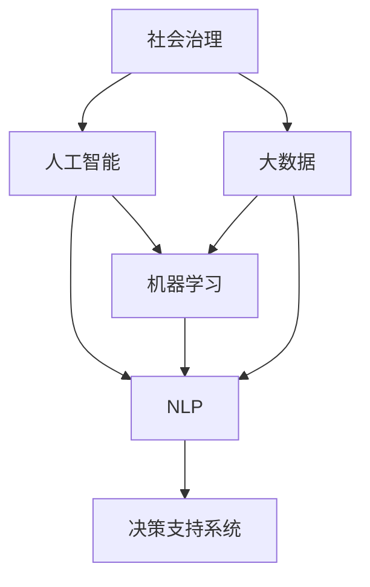

                 

# AI 对社会治理的变革：提升治理效率

## 1. 背景介绍

### 1.1 问题由来

当前，社会治理面临诸多挑战，如城市化进程加快带来的管理复杂性、老龄化社会带来的公共服务需求激增、环境污染治理的持续压力等。传统的社会治理模式，主要依靠人力、经验和规则，难以应对快速变化的社会环境和海量数据。人工智能（AI）技术，特别是大数据、机器学习和自然语言处理（NLP）技术的引入，为社会治理带来了新的视角和方法。

### 1.2 问题核心关键点

AI在社会治理中的应用，关键在于通过数据驱动和智能算法，提高治理效率，优化资源配置，提升决策科学性和公共服务质量。核心点包括：

- 数据融合与分析：整合多源数据，提供综合治理的决策支持。
- 智能算法应用：基于AI算法进行问题识别、风险预测、服务推荐等。
- 自动化流程优化：通过AI自动化社会治理的某些环节，减少人工干预，提高效率。
- 实时监控与反馈：利用AI进行实时数据分析和可视化，及时发现并反馈问题。

这些关键点共同构成了AI在社会治理中发挥作用的基础。

## 2. 核心概念与联系

### 2.1 核心概念概述

为了更好地理解AI在社会治理中的应用，本节将介绍几个关键概念：

- 社会治理(Social Governance)：指政府、企业、社会组织和个人在社会生活中，通过法律法规、政策措施等手段，对公共事务进行规范和管理的过程。

- 人工智能(Artificial Intelligence, AI)：模拟人类智能行为的技术，包括机器学习、自然语言处理、计算机视觉等。

- 大数据(Big Data)：规模庞大、复杂多样、速度快、价值密度低的数据集合。

- 机器学习(Machine Learning)：使机器通过学习算法，自动改进性能，适应新数据的任务。

- 自然语言处理(Natural Language Processing, NLP)：使计算机能够理解、处理和生成人类语言的技术。

- 决策支持系统(Decision Support System, DSS)：利用AI和数据分析技术，辅助决策者进行决策的系统。

这些核心概念之间的联系可以通过以下Mermaid流程图来展示：



这个流程图展示了大数据、人工智能、机器学习和自然语言处理之间的逻辑关系：

1. 社会治理需要处理大量的数据，因此离不开大数据技术。
2. 人工智能通过学习算法，可以从大数据中提取有价值的信息。
3. 机器学习和自然语言处理是人工智能的核心技术，分别处理数值数据和文本数据。
4. 决策支持系统利用AI和数据分析技术，辅助决策者进行科学决策。

这些概念共同构成了AI在社会治理中的应用框架。

## 3. 核心算法原理 & 具体操作步骤

### 3.1 算法原理概述

AI在社会治理中的应用，主要是通过数据分析和智能算法，辅助决策者进行高效、科学的决策。核心算法包括：

- 数据预处理：清洗、归一化、特征工程等，准备适合模型训练的数据。
- 特征选择与提取：从原始数据中提取有用的特征，进行模型训练。
- 模型训练与评估：选择合适算法，训练模型，并进行性能评估。
- 模型部署与优化：将训练好的模型应用到实际场景中，并根据反馈进行优化。

这些步骤共同构成了AI在社会治理中发挥作用的技术流程。

### 3.2 算法步骤详解

以下是一个社会治理应用中的AI系统开发流程，包括具体步骤和算法实现：

**Step 1: 数据收集与预处理**

1. 收集各类社会治理数据，如人口统计、环境监测、交通流量等。
2. 清洗数据，去除无效和重复数据，填补缺失值。
3. 进行数据归一化，保证数据在同一尺度上进行比较和处理。
4. 进行特征工程，提取和构造有用的特征，如人口密度、交通流量等。

**Step 2: 模型选择与训练**

1. 根据问题类型选择合适算法，如分类、回归、聚类等。
2. 划分训练集、验证集和测试集，进行模型训练。
3. 选择适当的损失函数和优化算法，如交叉熵损失、随机梯度下降等。
4. 设置模型参数，如学习率、批大小等，进行模型训练。

**Step 3: 模型评估与优化**

1. 在测试集上评估模型性能，如精度、召回率、F1分数等。
2. 根据评估结果，调整模型参数和算法选择，进行模型优化。
3. 引入正则化、Dropout、Early Stopping等技术，防止过拟合。

**Step 4: 模型部署与监控**

1. 将训练好的模型部署到生产环境中，提供实时决策支持。
2. 集成数据可视化工具，实时监控模型性能和数据变化。
3. 根据反馈和问题，及时调整和优化模型。

### 3.3 算法优缺点

AI在社会治理中的应用具有以下优点：

- 提升决策科学性：通过数据驱动，提供科学、客观的决策支持。
- 提高治理效率：自动化某些决策环节，减少人工干预，提高效率。
- 优化资源配置：基于数据分析，合理分配资源，提升公共服务质量。
- 实时监控与反馈：利用AI进行实时数据分析和可视化，及时发现并反馈问题。

同时，AI在社会治理中也有一些局限性：

- 数据隐私和安全：涉及个人隐私和敏感数据，需要严格的隐私保护措施。
- 算法透明性和可解释性：AI模型的决策过程难以解释，存在"黑箱"问题。
- 模型鲁棒性和泛化能力：面对未知和异常数据，模型的鲁棒性有待提高。
- 技术复杂性和成本：AI系统的开发和维护成本较高，需要专业技术支持。

尽管存在这些局限性，但AI在社会治理中的应用前景广阔，有望在未来带来更深远的影响。

### 3.4 算法应用领域

AI在社会治理中的应用领域包括但不限于：

- 城市管理：通过智能交通、智能安防、智慧城市等项目，提升城市运行效率和管理水平。
- 公共卫生：利用AI进行疾病预测、疫情监测、健康管理等，提升公共卫生服务质量。
- 环境保护：通过AI进行环境监测、污染治理、资源管理等，保护生态环境。
- 教育治理：利用AI进行学生评估、课程推荐、教育资源优化等，提升教育公平和质量。
- 社会服务：利用AI进行社会保障、社会救助、社区管理等，提升社会服务水平。

## 4. 数学模型和公式 & 详细讲解 & 举例说明

### 4.1 数学模型构建

假设有一项社会治理任务，目标是通过数据分析，预测某地区的犯罪率。我们采用线性回归模型进行建模，模型的输入特征为历史犯罪数据和相关环境因素，输出为预测的犯罪率。模型表示为：

$$
y = \theta_0 + \sum_{i=1}^n \theta_i x_i + \epsilon
$$

其中，$y$为预测的犯罪率，$x_i$为历史犯罪数据和环境因素，$\theta_i$为模型参数，$\epsilon$为随机误差。

### 4.2 公式推导过程

通过最小二乘法，我们求解模型参数$\theta$，使其最小化预测误差：

$$
\theta = (X^T X)^{-1} X^T y
$$

其中，$X$为模型输入特征的矩阵。

### 4.3 案例分析与讲解

以某城市的交通流量预测为例，假设我们有历史交通数据和天气数据，可以构建如下模型：

$$
y = \theta_0 + \sum_{i=1}^n \theta_i x_i + \epsilon
$$

其中，$y$为预测的交通流量，$x_i$为历史交通流量和天气数据，$\theta_i$为模型参数，$\epsilon$为随机误差。

通过训练模型，可以得到最优参数$\theta$，并利用该模型预测未来交通流量。例如，预测某天的交通流量为10000辆/小时。

## 5. 项目实践：代码实例和详细解释说明

### 5.1 开发环境搭建

在进行AI社会治理应用开发前，我们需要准备好开发环境。以下是使用Python进行Scikit-learn开发的Python环境配置流程：

1. 安装Anaconda：从官网下载并安装Anaconda，用于创建独立的Python环境。

2. 创建并激活虚拟环境：
```bash
conda create -n pyenv python=3.8 
conda activate pyenv
```

3. 安装Scikit-learn：
```bash
pip install scikit-learn
```

4. 安装各类工具包：
```bash
pip install numpy pandas matplotlib seaborn jupyter notebook
```

完成上述步骤后，即可在`pyenv`环境中开始开发。

### 5.2 源代码详细实现

我们以某城市的交通流量预测为例，给出使用Scikit-learn进行模型训练的Python代码实现。

```python
import pandas as pd
from sklearn.linear_model import LinearRegression
from sklearn.model_selection import train_test_split
from sklearn.metrics import mean_squared_error
import matplotlib.pyplot as plt

# 读取数据
data = pd.read_csv('traffic_data.csv')

# 准备数据
X = data[['temperature', 'humidity', 'wind_speed']]
y = data['traffic_flow']

# 划分训练集和测试集
X_train, X_test, y_train, y_test = train_test_split(X, y, test_size=0.2, random_state=42)

# 建立模型
model = LinearRegression()

# 训练模型
model.fit(X_train, y_train)

# 预测结果
y_pred = model.predict(X_test)

# 评估模型
rmse = mean_squared_error(y_test, y_pred, squared=False)
print(f"RMSE: {rmse:.2f}")

# 可视化结果
plt.scatter(y_test, y_pred)
plt.xlabel('Actual Traffic Flow')
plt.ylabel('Predicted Traffic Flow')
plt.show()
```

### 5.3 代码解读与分析

让我们再详细解读一下关键代码的实现细节：

**读取数据**：
- `pd.read_csv('traffic_data.csv')`：使用Pandas库读取CSV格式的数据文件。

**准备数据**：
- `X = data[['temperature', 'humidity', 'wind_speed']]`：提取输入特征，包括温度、湿度和风速。
- `y = data['traffic_flow']`：提取输出标签，即交通流量。

**划分数据集**：
- `X_train, X_test, y_train, y_test = train_test_split(X, y, test_size=0.2, random_state=42)`：将数据划分为训练集和测试集，其中80%用于训练，20%用于测试。

**建立模型**：
- `model = LinearRegression()`：使用线性回归模型，准备进行训练。

**训练模型**：
- `model.fit(X_train, y_train)`：在训练集上训练模型。

**预测结果**：
- `y_pred = model.predict(X_test)`：在测试集上预测交通流量。

**评估模型**：
- `rmse = mean_squared_error(y_test, y_pred, squared=False)`：计算预测结果与实际结果的RMSE（均方根误差），评估模型性能。
- `print(f"RMSE: {rmse:.2f}")`：打印RMSE值。

**可视化结果**：
- `plt.scatter(y_test, y_pred)`：绘制实际值与预测值的关系图。
- `plt.xlabel('Actual Traffic Flow')`：设置x轴标签为"Actual Traffic Flow"。
- `plt.ylabel('Predicted Traffic Flow')`：设置y轴标签为"Predicted Traffic Flow"。
- `plt.show()`：显示图形。

通过以上代码，我们可以看到，使用Scikit-learn进行线性回归模型的开发和训练过程，是相对简洁高效的。开发者可以根据具体任务，灵活调整模型参数和训练方式。

### 5.4 运行结果展示

运行上述代码后，会得到一个散点图，展示实际交通流量与预测交通流量的对比关系。通常，模型预测值会围绕实际值分布，误差较小的情况下，点分布会比较密集，表明模型具有较好的预测能力。

## 6. 实际应用场景

### 6.1 城市管理

AI在城市管理中的应用，主要通过智能交通、智能安防、智慧城市等项目，提升城市运行效率和管理水平。例如：

- 智能交通：利用AI进行交通流量预测、交通信号优化、交通事故预警等，提高交通管理效率。
- 智能安防：利用AI进行视频监控、异常行为检测、智能报警等，提升公共安全水平。
- 智慧城市：利用AI进行城市数据整合、公共服务优化、居民需求响应等，实现智慧城市建设。

### 6.2 公共卫生

AI在公共卫生中的应用，主要通过疾病预测、疫情监测、健康管理等项目，提升公共卫生服务质量。例如：

- 疾病预测：利用AI进行传染病疫情预测、慢性病风险评估等，提前采取预防措施。
- 疫情监测：利用AI进行疫情动态监测、病例追踪、资源调度等，提升疫情应急响应能力。
- 健康管理：利用AI进行健康数据监测、个性化健康推荐、疾病诊断等，提升医疗服务水平。

### 6.3 环境保护

AI在环境保护中的应用，主要通过环境监测、污染治理、资源管理等项目，保护生态环境。例如：

- 环境监测：利用AI进行空气质量监测、水质监测、土壤监测等，及时发现环境问题。
- 污染治理：利用AI进行污染物源头识别、治理方案优化等，提升污染治理效率。
- 资源管理：利用AI进行资源调度、环境影响评估等，优化资源利用。

### 6.4 教育治理

AI在教育治理中的应用，主要通过学生评估、课程推荐、教育资源优化等项目，提升教育公平和质量。例如：

- 学生评估：利用AI进行学生行为分析、学习效果评估等，提供个性化学习建议。
- 课程推荐：利用AI进行课程推荐、学习路径优化等，提升教育效果。
- 教育资源优化：利用AI进行教师资源调配、教育资源优化等，提升教育资源利用效率。

## 7. 工具和资源推荐

### 7.1 学习资源推荐

为了帮助开发者系统掌握AI在社会治理中的应用理论基础和实践技巧，这里推荐一些优质的学习资源：

1. 《深度学习》系列博文：由深度学习专家撰写，深入浅出地介绍了深度学习原理和算法。

2. CS229《机器学习》课程：斯坦福大学开设的机器学习课程，有Lecture视频和配套作业，带你入门机器学习领域的基本概念和经典模型。

3. 《机器学习实战》书籍：通俗易懂地介绍了机器学习算法和应用场景，适合初学者入门。

4. TensorFlow官方文档：TensorFlow的官方文档，提供了海量API和样例代码，是学习深度学习的基础资料。

5. Scikit-learn官方文档：Scikit-learn的官方文档，提供了各种机器学习算法和工具，是实现社会治理应用的重要工具库。

通过对这些资源的学习实践，相信你一定能够快速掌握AI在社会治理中的应用精髓，并用于解决实际的治理问题。

### 7.2 开发工具推荐

高效的开发离不开优秀的工具支持。以下是几款用于AI社会治理应用开发的常用工具：

1. TensorFlow：由Google主导开发的开源深度学习框架，生产部署方便，适合大规模工程应用。

2. Scikit-learn：基于Python的机器学习库，提供了各种经典算法和工具，适合快速迭代研究。

3. Jupyter Notebook：交互式的开发环境，支持Python和R语言，适合数据处理和模型训练。

4. PyTorch：基于Python的开源深度学习框架，灵活动态的计算图，适合快速迭代研究。

5. Weights & Biases：模型训练的实验跟踪工具，可以记录和可视化模型训练过程中的各项指标，方便对比和调优。

6. Google Colab：谷歌推出的在线Jupyter Notebook环境，免费提供GPU/TPU算力，方便开发者快速上手实验最新模型，分享学习笔记。

合理利用这些工具，可以显著提升AI在社会治理中的应用开发效率，加快创新迭代的步伐。

### 7.3 相关论文推荐

AI在社会治理中的应用源于学界的持续研究。以下是几篇奠基性的相关论文，推荐阅读：

1. Deep Learning for Adaptive Scheduling in Smart Grids：利用深度学习进行智能电网调度，提升电力系统效率。

2. A Survey on Machine Learning for Healthcare：利用机器学习进行医疗数据分析和诊断，提升医疗服务质量。

3. Machine Learning for Environmental Monitoring and Management：利用机器学习进行环境监测和管理，保护生态环境。

4. AI in Education: Opportunities and Challenges：利用AI进行教育数据分析和推荐，提升教育公平和质量。

这些论文代表了大数据、机器学习和AI在社会治理中应用的最新研究进展。通过学习这些前沿成果，可以帮助研究者把握学科前进方向，激发更多的创新灵感。

## 8. 总结：未来发展趋势与挑战

### 8.1 总结

本文对AI在社会治理中的应用进行了全面系统的介绍。首先阐述了AI在社会治理中的重要性和应用前景，明确了AI在提升治理效率、优化资源配置等方面的独特价值。其次，从原理到实践，详细讲解了AI在社会治理中的核心算法和操作步骤，给出了社会治理应用开发的完整代码实例。同时，本文还广泛探讨了AI在城市管理、公共卫生、环境保护、教育治理等多个领域的应用前景，展示了AI在社会治理中的广泛潜力。此外，本文精选了AI应用的各类学习资源，力求为读者提供全方位的技术指引。

通过本文的系统梳理，可以看到，AI在社会治理中的应用前景广阔，有望在未来带来更深远的影响。AI的引入将使社会治理更加智能化、精准化和高效化，提升公共服务质量和治理效率。

### 8.2 未来发展趋势

展望未来，AI在社会治理中的应用将呈现以下几个发展趋势：

1. 数据融合与分析能力提升：随着大数据技术的进步，AI在数据融合和分析方面的能力将进一步提升，提供更加全面、准确的社会治理支持。

2. 算法多样化：AI将发展出更多高效、鲁棒的算法，用于解决复杂多样的社会治理问题，如多目标优化、强化学习等。

3. 多模态融合：AI将实现多源数据和多模态数据的融合，提供更加全面、实时的社会治理支持。

4. 实时监控与反馈系统：AI将构建实时监控与反馈系统，及时发现并解决社会治理中的问题，提升治理效率。

5. 自适应学习：AI将具备自适应学习能力，根据环境和数据的变化，动态调整和优化模型，提升治理效果。

6. 数据隐私保护：AI将加强数据隐私保护，确保数据安全和用户隐私，建立可信的社会治理环境。

以上趋势凸显了AI在社会治理中的广阔前景。这些方向的探索发展，必将进一步提升社会治理的科学性和精准性，为构建智慧社会奠定坚实基础。

### 8.3 面临的挑战

尽管AI在社会治理中的应用前景广阔，但在迈向更加智能化、普适化应用的过程中，它仍面临着诸多挑战：

1. 数据质量和隐私保护：涉及大量敏感数据，需要严格的数据治理和隐私保护措施。

2. 算法透明性和可解释性：AI模型的决策过程难以解释，存在"黑箱"问题，影响信任度。

3. 模型鲁棒性和泛化能力：面对未知和异常数据，模型的鲁棒性有待提高。

4. 技术复杂性和成本：AI系统的开发和维护成本较高，需要专业技术支持。

5. 伦理和道德问题：AI应用可能引发伦理和道德问题，如偏见、歧视、隐私泄露等，需要加强监管和规范。

尽管存在这些挑战，但通过技术创新和规范引导，相信AI在社会治理中的应用将逐步克服这些问题，成为推动社会进步的重要力量。

### 8.4 研究展望

面对AI在社会治理中面临的挑战，未来的研究需要在以下几个方面寻求新的突破：

1. 数据治理与隐私保护：构建数据治理框架，制定数据隐私保护标准，提升数据质量和安全。

2. 算法透明性和可解释性：研究可解释的AI算法，提升AI决策的透明性和可信度。

3. 模型鲁棒性和泛化能力：研究鲁棒性算法，提高AI模型在未知和异常数据上的表现。

4. 技术标准化与规范：制定AI应用的标准和规范，确保技术应用的安全性和合理性。

5. 伦理与道德研究：研究AI应用的伦理和道德问题，建立伦理导向的AI治理框架。

这些研究方向的探索，必将引领AI在社会治理中的应用走向更加成熟和规范，为构建安全、公正、可信的社会治理体系铺平道路。面向未来，AI在社会治理中的应用还需与其他人工智能技术进行更深入的融合，如知识表示、因果推理、强化学习等，多路径协同发力，共同推动社会治理的进步。

## 9. 附录：常见问题与解答

**Q1：AI在社会治理中的应用是否会引发伦理和道德问题？**

A: AI在社会治理中的应用，如智能安防、智能交通等，确实可能引发伦理和道德问题，如隐私泄露、决策透明度不足等。因此，需要在技术应用中加强伦理和道德审查，确保技术应用的安全性和公正性。

**Q2：AI在社会治理中应用的技术难度是否过高？**

A: AI在社会治理中的应用涉及多源数据的融合、模型的训练和优化等技术环节，确实存在一定的技术难度。但随着AI技术的不断进步，相关工具和资源的丰富，开发难度已经有所降低。开发者可以根据具体任务，灵活应用各类工具和算法，逐步解决技术难题。

**Q3：AI在社会治理中的应用是否可以完全替代人工决策？**

A: 在当前阶段，AI在社会治理中的应用还不能完全替代人工决策。AI更多地是辅助决策者进行科学决策，提高决策效率和质量，但最终决策仍需结合人工经验和人情关怀。因此，AI和人工决策应有机结合，形成协同决策机制。

**Q4：AI在社会治理中的应用是否会带来新的社会问题？**

A: AI在社会治理中的应用，如智能安防、智能交通等，确实可能带来新的社会问题，如就业冲击、隐私泄露等。因此，需要在技术应用中加强监管和管理，确保技术应用的安全性和公平性。

**Q5：AI在社会治理中的应用是否可以提升公共服务质量？**

A: 是的，AI在社会治理中的应用，如智能安防、智能交通等，确实可以提升公共服务质量，提高社会治理效率。但需要合理应用，确保技术应用的安全性和公正性。

综上所述，AI在社会治理中的应用前景广阔，有望在未来带来更深远的影响。但需要在技术应用中加强伦理和道德审查，确保技术应用的安全性和公正性。通过技术创新和规范引导，相信AI在社会治理中的应用将逐步克服这些问题，成为推动社会进步的重要力量。

