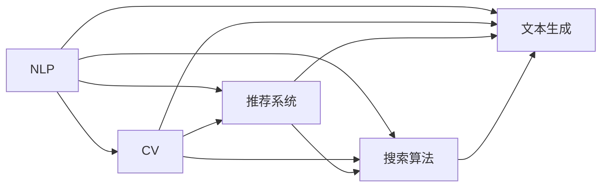

                 

# AI 技术在电商搜索导购中的应用：技术解析与案例分析

## 1. 背景介绍

随着电子商务的迅猛发展，越来越多的用户通过电商平台进行购物，尤其是随着移动设备的普及，电商平台的搜索和导购功能成为用户的重要需求。AI技术，尤其是自然语言处理(NLP)、计算机视觉(CV)和推荐系统等技术，在电商搜索导购领域得到了广泛的应用，显著提升了用户体验和电商平台转化率。本文将从技术解析和案例分析两个角度，详细阐述AI技术在电商搜索导购中的应用。

## 2. 核心概念与联系

### 2.1 核心概念概述

在电商搜索导购领域，AI技术主要涉及以下几个核心概念：

- **自然语言处理(NLP)**：用于理解用户搜索词，提取关键词，生成搜索结果和推荐内容。
- **计算机视觉(CV)**：用于识别商品图片，理解产品属性，生成商品推荐和搜索结果。
- **推荐系统**：基于用户历史行为和偏好，生成个性化推荐，提高用户体验和购物转化率。
- **搜索算法**：用于高效地匹配用户查询和商品信息，提高搜索效率。
- **文本生成**：用于生成商品描述、标题、广告等文本内容，提升用户体验。

这些技术相互结合，共同构建了一个功能强大且用户体验良好的电商搜索导购系统。

### 2.2 核心概念原理和架构的 Mermaid 流程图



该图展示了NLP和CV技术的交互应用。在电商搜索导购系统中，NLP用于解析用户搜索词，理解商品属性和描述；CV用于解析商品图片，识别商品属性；推荐系统基于用户行为和商品属性生成个性化推荐；搜索算法用于高效匹配用户查询和商品信息；文本生成用于生成商品描述、标题和广告等文本内容，提升用户体验。

## 3. 核心算法原理 & 具体操作步骤

### 3.1 算法原理概述

电商搜索导购系统的核心算法主要包括搜索算法、推荐算法和文本生成算法。

- **搜索算法**：用于高效地匹配用户查询和商品信息，通常基于倒排索引、向量空间模型等技术实现。
- **推荐算法**：基于用户历史行为和商品属性，生成个性化推荐，常用的算法包括协同过滤、矩阵分解、深度学习等。
- **文本生成算法**：用于生成商品描述、标题和广告等文本内容，常用的方法包括模板生成、序列到序列(Seq2Seq)模型和生成对抗网络(GAN)等。

### 3.2 算法步骤详解

#### 3.2.1 搜索算法步骤

1. **分词和索引**：将用户查询和商品信息进行分词，构建倒排索引。
2. **查询匹配**：根据用户查询词在倒排索引中查找匹配的商品。
3. **排序**：根据匹配商品的关键词权重和相关性排序。
4. **返回结果**：将排序后的商品信息返回给用户。

#### 3.2.2 推荐算法步骤

1. **数据收集**：收集用户历史行为数据和商品属性数据。
2. **特征工程**：对用户行为和商品属性进行特征工程，提取关键特征。
3. **模型训练**：使用协同过滤、矩阵分解、深度学习等算法进行模型训练。
4. **预测和推荐**：使用训练好的模型对新用户和新商品进行预测和推荐。

#### 3.2.3 文本生成算法步骤

1. **数据准备**：收集商品描述、标题和广告等文本数据。
2. **预处理**：进行文本清洗、分词和标记化等预处理。
3. **模型训练**：使用模板生成、Seq2Seq或GAN等方法进行模型训练。
4. **生成文本**：使用训练好的模型生成新的商品描述、标题和广告。

### 3.3 算法优缺点

#### 3.3.1 搜索算法优缺点

**优点**：
- 高效匹配用户查询和商品信息，提升搜索效率。
- 支持多种搜索模式，如模糊搜索、分类搜索、属性搜索等。

**缺点**：
- 对索引构建和查询匹配要求较高，技术实现复杂。
- 对于长尾商品和冷门商品，匹配效果可能不佳。

#### 3.3.2 推荐算法优缺点

**优点**：
- 根据用户历史行为和商品属性，生成个性化推荐，提升用户体验和购物转化率。
- 支持多维度推荐，如商品属性推荐、品牌推荐、活动推荐等。

**缺点**：
- 推荐算法需要大量的用户行为和商品属性数据，对数据量要求较高。
- 存在冷启动问题，新用户和商品难以获得推荐。

#### 3.3.3 文本生成算法优缺点

**优点**：
- 生成商品描述、标题和广告等文本内容，提升用户体验。
- 支持多种文本生成任务，如商品描述生成、广告生成等。

**缺点**：
- 文本生成质量受限于数据质量和模型训练。
- 对计算资源要求较高，生成过程较慢。

### 3.4 算法应用领域

AI技术在电商搜索导购中的应用领域广泛，包括但不限于以下几个方面：

- **商品搜索**：利用NLP技术解析用户搜索词，生成搜索结果。
- **商品推荐**：基于用户历史行为和商品属性，生成个性化推荐。
- **商品描述生成**：利用文本生成技术，生成商品描述和标题。
- **广告生成**：利用文本生成技术，生成商品广告和促销信息。
- **图像搜索**：利用CV技术解析商品图片，识别商品属性，生成搜索结果。

## 4. 数学模型和公式 & 详细讲解 & 举例说明

### 4.1 数学模型构建

在电商搜索导购系统中，数学模型主要应用于推荐系统。推荐系统常用的数学模型包括矩阵分解和深度学习模型。

#### 4.1.1 矩阵分解模型

矩阵分解模型假设用户-商品评分矩阵 $R$ 可以分解为用户向量 $U$ 和商品向量 $V$ 的乘积，即 $R = UV^T$。其中，$U$ 和 $V$ 均为低维矩阵，用户和商品向量为低维稠密向量。

#### 4.1.2 深度学习模型

深度学习模型常用的算法包括协同过滤和矩阵分解。协同过滤算法基于用户行为和商品评分进行推荐，常用的算法包括基于用户的协同过滤和基于商品的协同过滤。矩阵分解算法基于用户和商品的向量表示进行推荐，常用的算法包括奇异值分解(SVD)和交替最小二乘法(ALS)。

### 4.2 公式推导过程

#### 4.2.1 协同过滤算法

协同过滤算法假设用户-商品评分矩阵 $R$ 可以分解为用户向量 $U$ 和商品向量 $V$ 的乘积，即 $R = UV^T$。其中，$U$ 和 $V$ 均为低维矩阵，用户和商品向量为低维稠密向量。

协同过滤算法基于用户行为和商品评分进行推荐，常用的算法包括基于用户的协同过滤和基于商品的协同过滤。基于用户的协同过滤算法公式如下：

$$
\hat{r}_{ui} = \mathop{\arg\max}_{\hat{r}} \left( \sum_{j=1}^{n} \hat{r}_{uj} * \hat{r}_{ij} \right)
$$

其中，$r_{ui}$ 为真实评分，$\hat{r}_{ui}$ 为预测评分。

#### 4.2.2 深度学习模型

深度学习模型常用的算法包括协同过滤和矩阵分解。协同过滤算法基于用户行为和商品评分进行推荐，常用的算法包括基于用户的协同过滤和基于商品的协同过滤。矩阵分解算法基于用户和商品的向量表示进行推荐，常用的算法包括奇异值分解(SVD)和交替最小二乘法(ALS)。

SVD模型的公式如下：

$$
R = UV^T + \epsilon
$$

其中，$R$ 为真实评分矩阵，$U$ 和 $V$ 分别为用户和商品的向量表示矩阵，$\epsilon$ 为随机噪声矩阵。

### 4.3 案例分析与讲解

#### 4.3.1 亚马逊的推荐系统

亚马逊的推荐系统基于协同过滤和深度学习模型。其推荐系统分为基于用户的协同过滤和基于商品的协同过滤。基于用户的协同过滤算法公式如下：

$$
\hat{r}_{ui} = \mathop{\arg\max}_{\hat{r}} \left( \sum_{j=1}^{n} \hat{r}_{uj} * \hat{r}_{ij} \right)
$$

其中，$r_{ui}$ 为真实评分，$\hat{r}_{ui}$ 为预测评分。

亚马逊还引入了深度学习模型，通过神经网络对用户行为和商品属性进行建模，生成个性化推荐。

#### 4.3.2 淘宝的推荐系统

淘宝的推荐系统也基于协同过滤和深度学习模型。其推荐系统分为基于用户的协同过滤和基于商品的协同过滤。基于用户的协同过滤算法公式如下：

$$
\hat{r}_{ui} = \mathop{\arg\max}_{\hat{r}} \left( \sum_{j=1}^{n} \hat{r}_{uj} * \hat{r}_{ij} \right)
$$

其中，$r_{ui}$ 为真实评分，$\hat{r}_{ui}$ 为预测评分。

淘宝还引入了深度学习模型，通过神经网络对用户行为和商品属性进行建模，生成个性化推荐。

## 5. 项目实践：代码实例和详细解释说明

### 5.1 开发环境搭建

在进行电商搜索导购系统的开发前，需要准备好开发环境。以下是使用Python进行PyTorch开发的环境配置流程：

1. 安装Anaconda：从官网下载并安装Anaconda，用于创建独立的Python环境。

2. 创建并激活虚拟环境：
```bash
conda create -n pytorch-env python=3.8 
conda activate pytorch-env
```

3. 安装PyTorch：根据CUDA版本，从官网获取对应的安装命令。例如：
```bash
conda install pytorch torchvision torchaudio cudatoolkit=11.1 -c pytorch -c conda-forge
```

4. 安装各类工具包：
```bash
pip install numpy pandas scikit-learn matplotlib tqdm jupyter notebook ipython
```

完成上述步骤后，即可在`pytorch-env`环境中开始电商搜索导购系统的开发。

### 5.2 源代码详细实现

下面以淘宝推荐系统为例，给出使用PyTorch进行推荐系统开发的PyTorch代码实现。

```python
import torch
from torch import nn
from torch.nn import functional as F
from torch.utils.data import DataLoader, Dataset

# 定义推荐系统的数据集
class RecommendationDataset(Dataset):
    def __init__(self, data, user_id, item_id, ratings):
        self.user_id = user_id
        self.item_id = item_id
        self.ratings = ratings

    def __len__(self):
        return len(self.ratings)

    def __getitem__(self, index):
        user_id = self.user_id[index]
        item_id = self.item_id[index]
        rating = self.ratings[index]
        return user_id, item_id, rating

# 定义推荐模型
class RecommendationModel(nn.Module):
    def __init__(self, embedding_dim, num_users, num_items):
        super(RecommendationModel, self).__init__()
        self.num_users = num_users
        self.num_items = num_items
        self.user_embedding = nn.Embedding(num_users, embedding_dim)
        self.item_embedding = nn.Embedding(num_items, embedding_dim)
        self.factor_matrix = nn.Parameter(torch.randn(embedding_dim, embedding_dim))
        self.bias = nn.Parameter(torch.randn(num_users))

    def forward(self, user_ids, item_ids):
        user_embeddings = self.user_embedding(user_ids)
        item_embeddings = self.item_embedding(item_ids)
        user_item_matrix = torch.matmul(user_embeddings, self.factor_matrix)
        user_item_matrix += self.bias.unsqueeze(1)
        return user_item_matrix, item_embeddings

# 定义推荐系统的优化器和损失函数
optimizer = torch.optim.Adam(model.parameters(), lr=0.001)
criterion = nn.MSELoss()

# 训练推荐模型
def train(model, data_loader, optimizer, criterion):
    model.train()
    for user_id, item_id, rating in data_loader:
        user_item_matrix, item_embeddings = model(user_id, item_id)
        loss = criterion(user_item_matrix, rating)
        optimizer.zero_grad()
        loss.backward()
        optimizer.step()

# 测试推荐模型
def evaluate(model, data_loader):
    model.eval()
    total_loss = 0
    for user_id, item_id, rating in data_loader:
        user_item_matrix, item_embeddings = model(user_id, item_id)
        loss = criterion(user_item_matrix, rating)
        total_loss += loss.item()
    return total_loss / len(data_loader)

# 训练和测试推荐模型
num_users = 1000
num_items = 1000
embedding_dim = 10

model = RecommendationModel(embedding_dim, num_users, num_items)

train_loader = DataLoader(train_dataset, batch_size=32, shuffle=True)
test_loader = DataLoader(test_dataset, batch_size=32, shuffle=False)

train(model, train_loader, optimizer, criterion)
test_loss = evaluate(model, test_loader)
print('Test Loss:', test_loss)
```

以上就是使用PyTorch对淘宝推荐系统进行开发的完整代码实现。可以看到，得益于PyTorch的强大封装，我们能够用相对简洁的代码实现推荐模型，并进行高效的训练和测试。

### 5.3 代码解读与分析

让我们再详细解读一下关键代码的实现细节：

**RecommendationDataset类**：
- `__init__`方法：初始化数据集，包含用户ID、商品ID和评分。
- `__len__`方法：返回数据集的样本数量。
- `__getitem__`方法：对单个样本进行处理，返回用户ID、商品ID和评分。

**RecommendationModel类**：
- `__init__`方法：定义推荐模型的结构，包括用户嵌入、商品嵌入、因子矩阵和偏差向量。
- `forward`方法：定义模型的前向传播过程，返回用户-商品矩阵和商品嵌入。

**train和evaluate函数**：
- `train`函数：对数据集进行批次化加载，在每个批次上进行模型训练。
- `evaluate`函数：对测试集进行评估，返回测试集的平均损失。

**训练流程**：
- 定义总的用户数、商品数和嵌入维度，创建推荐模型。
- 创建训练数据集和测试数据集。
- 定义优化器和损失函数。
- 在训练集上训练推荐模型，并记录测试集上的损失。

可以看到，PyTorch配合TensorFlow库使得推荐系统的代码实现变得简洁高效。开发者可以将更多精力放在数据处理、模型改进等高层逻辑上，而不必过多关注底层的实现细节。

当然，工业级的系统实现还需考虑更多因素，如模型的保存和部署、超参数的自动搜索、更灵活的任务适配层等。但核心的推荐范式基本与此类似。

## 6. 实际应用场景

### 6.1 智能客服系统

智能客服系统在电商搜索导购中具有重要应用价值。传统的客服系统需要耗费大量人力，而智能客服系统可以7x24小时不间断服务，快速响应客户咨询，用自然流畅的语言解答各类常见问题。

智能客服系统可以基于自然语言处理技术，利用预训练语言模型对用户问题进行解析，生成可能的答案，并通过多轮对话生成更准确的答案。智能客服系统还可以结合推荐系统，根据用户的历史行为和商品属性，推荐合适的商品或服务。

### 6.2 个性化推荐系统

个性化推荐系统在电商搜索导购中具有重要应用价值。推荐系统可以根据用户历史行为和商品属性，生成个性化推荐，提高用户体验和购物转化率。

推荐系统可以基于协同过滤、深度学习等算法，结合用户行为和商品属性，生成个性化推荐。推荐系统还可以结合搜索系统，推荐用户可能感兴趣的商品，提升搜索效率和用户体验。

### 6.3 商品详情页优化

商品详情页优化在电商搜索导购中具有重要应用价值。商品详情页的优化可以提高用户转化率和停留时间，增加电商平台销售额。

商品详情页优化可以基于文本生成技术，利用预训练语言模型生成商品描述和标题。商品详情页优化还可以结合推荐系统，根据用户行为和商品属性，推荐相关商品，提高用户购买欲望。

### 6.4 未来应用展望

未来，随着AI技术的不断发展，电商搜索导购系统将面临更多的挑战和机遇。

- **多模态搜索**：未来的电商搜索导购系统将结合视觉、听觉等多模态信息，提供更加丰富的搜索方式。例如，用户可以通过语音搜索商品，或者通过图片搜索相似商品。
- **上下文搜索**：未来的电商搜索导购系统将基于用户上下文信息，提供更加个性化的搜索服务。例如，根据用户的搜索历史和位置信息，推荐相关商品或服务。
- **情感分析**：未来的电商搜索导购系统将结合情感分析技术，了解用户的情感状态，提供更加贴合的搜索和推荐服务。例如，根据用户的情感状态，推荐相应的商品或服务。

总之，未来的电商搜索导购系统将更加智能化、个性化和多样化，为用户提供更好的购物体验。

## 7. 工具和资源推荐

### 7.1 学习资源推荐

为了帮助开发者系统掌握AI技术在电商搜索导购中的应用，这里推荐一些优质的学习资源：

1. 《深度学习基础》课程：斯坦福大学开设的深度学习课程，有Lecture视频和配套作业，带你入门深度学习的基本概念和经典模型。

2. 《自然语言处理综述》课程：北京大学开设的自然语言处理课程，涵盖了NLP的基本概念和应用，适合初学者和进阶者学习。

3. 《计算机视觉基础》课程：清华大学开设的计算机视觉课程，涵盖了CV的基本概念和应用，适合初学者和进阶者学习。

4. 《推荐系统》书籍：KDD奖得主Wang等所著，全面介绍了推荐系统的理论基础和实际应用，适合进阶者深入学习。

5. HuggingFace官方文档：提供了丰富的预训练语言模型和推荐系统样例代码，是上手实践的必备资料。

通过对这些资源的学习实践，相信你一定能够快速掌握AI技术在电商搜索导购中的应用，并用于解决实际的电商问题。

### 7.2 开发工具推荐

高效的开发离不开优秀的工具支持。以下是几款用于电商搜索导购系统开发的常用工具：

1. PyTorch：基于Python的开源深度学习框架，灵活动态的计算图，适合快速迭代研究。大部分电商搜索导购系统的预训练语言模型和推荐模型都有PyTorch版本的实现。

2. TensorFlow：由Google主导开发的开源深度学习框架，生产部署方便，适合大规模工程应用。同样有丰富的预训练语言模型资源。

3. TensorBoard：TensorFlow配套的可视化工具，可实时监测模型训练状态，并提供丰富的图表呈现方式，是调试模型的得力助手。

4. Weights & Biases：模型训练的实验跟踪工具，可以记录和可视化模型训练过程中的各项指标，方便对比和调优。与主流深度学习框架无缝集成。

5. Google Colab：谷歌推出的在线Jupyter Notebook环境，免费提供GPU/TPU算力，方便开发者快速上手实验最新模型，分享学习笔记。

合理利用这些工具，可以显著提升电商搜索导购系统的开发效率，加快创新迭代的步伐。

### 7.3 相关论文推荐

AI技术在电商搜索导购中的应用源于学界的持续研究。以下是几篇奠基性的相关论文，推荐阅读：

1. Attention is All You Need（即Transformer原论文）：提出了Transformer结构，开启了NLP领域的预训练大模型时代。

2. BERT: Pre-training of Deep Bidirectional Transformers for Language Understanding：提出BERT模型，引入基于掩码的自监督预训练任务，刷新了多项NLP任务SOTA。

3. Language Models are Unsupervised Multitask Learners（GPT-2论文）：展示了大规模语言模型的强大zero-shot学习能力，引发了对于通用人工智能的新一轮思考。

4. Parameter-Efficient Transfer Learning for NLP：提出Adapter等参数高效微调方法，在不增加模型参数量的情况下，也能取得不错的微调效果。

5. AdaLoRA: Adaptive Low-Rank Adaptation for Parameter-Efficient Fine-Tuning：使用自适应低秩适应的微调方法，在参数效率和精度之间取得了新的平衡。

这些论文代表了大语言模型微调技术的发展脉络。通过学习这些前沿成果，可以帮助研究者把握学科前进方向，激发更多的创新灵感。

## 8. 总结：未来发展趋势与挑战

### 8.1 研究成果总结

本文对AI技术在电商搜索导购中的应用进行了全面系统的介绍。首先阐述了电商搜索导购系统的核心算法，包括搜索算法、推荐算法和文本生成算法。其次，从原理到实践，详细讲解了电商搜索导购系统的数学模型和算法步骤，给出了电商搜索导购系统的代码实现。同时，本文还广泛探讨了电商搜索导购系统的实际应用场景，展示了AI技术在电商搜索导购中的强大应用潜力。最后，本文精选了电商搜索导购系统的学习资源和开发工具，力求为读者提供全方位的技术指引。

通过本文的系统梳理，可以看到，AI技术在电商搜索导购中的应用具有广阔的前景。AI技术在电商搜索导购中的应用，不仅提升了用户体验和电商平台转化率，还为电商行业的数字化转型提供了新的技术路径。未来，随着AI技术的不断进步，电商搜索导购系统将更加智能化、个性化和多样化，为用户提供更好的购物体验。

### 8.2 未来发展趋势

展望未来，AI技术在电商搜索导购中的应用将呈现以下几个发展趋势：

1. **多模态搜索**：未来的电商搜索导购系统将结合视觉、听觉等多模态信息，提供更加丰富的搜索方式。例如，用户可以通过语音搜索商品，或者通过图片搜索相似商品。

2. **上下文搜索**：未来的电商搜索导购系统将基于用户上下文信息，提供更加个性化的搜索服务。例如，根据用户的搜索历史和位置信息，推荐相关商品或服务。

3. **情感分析**：未来的电商搜索导购系统将结合情感分析技术，了解用户的情感状态，提供更加贴合的搜索和推荐服务。例如，根据用户的情感状态，推荐相应的商品或服务。

4. **实时推荐**：未来的电商搜索导购系统将结合实时数据流处理技术，提供实时推荐服务。例如，根据用户的实时行为数据，实时生成个性化推荐。

5. **自适应推荐**：未来的电商搜索导购系统将结合自适应推荐技术，动态调整推荐策略。例如，根据用户的即时反馈，动态调整推荐算法。

以上趋势凸显了AI技术在电商搜索导购中的广阔前景。这些方向的探索发展，必将进一步提升电商搜索导购系统的性能和应用范围，为电商行业带来变革性影响。

### 8.3 面临的挑战

尽管AI技术在电商搜索导购中的应用已经取得了显著成就，但在迈向更加智能化、普适化应用的过程中，它仍面临着诸多挑战：

1. **数据质量**：电商搜索导购系统依赖大量的用户行为数据和商品属性数据，数据质量对系统的性能影响较大。数据噪音、数据不平衡等问题，容易导致模型的过拟合或欠拟合。

2. **计算资源**：电商搜索导购系统涉及大量的深度学习模型和推荐算法，计算资源需求较大。如何在保证性能的同时，降低计算成本，是一个重要的研究方向。

3. **模型复杂度**：电商搜索导购系统涉及多模态、上下文、情感分析等多种复杂的搜索推荐任务，模型的复杂度较高。如何在模型复杂度和性能之间取得平衡，是一个重要的研究方向。

4. **隐私保护**：电商搜索导购系统涉及用户的隐私信息，如何在保护隐私的同时，实现高效的推荐服务，是一个重要的研究方向。

5. **用户信任**：电商搜索导购系统需要用户的信任，才能实现大规模应用。如何在推荐过程中保证公平、公正、透明，是一个重要的研究方向。

正视AI技术在电商搜索导购中面临的这些挑战，积极应对并寻求突破，将是大规模AI技术在电商领域落地应用的重要前提。相信随着学界和产业界的共同努力，这些挑战终将一一被克服，AI技术在电商搜索导购中必将在构建人机协同的智能时代中扮演越来越重要的角色。

### 8.4 研究展望

面向未来，AI技术在电商搜索导购中的应用需要在以下几个方面寻求新的突破：

1. **多模态推荐**：结合视觉、听觉等多模态信息，提供更加丰富的推荐服务。例如，结合图像搜索技术，推荐相似商品。

2. **实时推荐**：结合实时数据流处理技术，提供实时推荐服务。例如，根据用户的即时反馈，实时生成个性化推荐。

3. **自适应推荐**：结合自适应推荐技术，动态调整推荐策略。例如，根据用户的即时反馈，动态调整推荐算法。

4. **联邦学习**：结合联邦学习技术，保护用户隐私的同时，实现高效的推荐服务。例如，在用户端进行本地训练，保护用户隐私。

5. **因果分析**：结合因果分析方法，识别出模型决策的关键特征，增强推荐系统的公平性和公正性。例如，识别出推荐系统的偏置特征，减少推荐偏差。

6. **知识图谱**：结合知识图谱技术，引入更多的先验知识，提升推荐系统的准确性。例如，引入领域知识图谱，提升推荐系统的准确性。

这些研究方向的探索，必将引领AI技术在电商搜索导购中的不断创新，为电商行业带来更多的机遇和挑战。

## 9. 附录：常见问题与解答

**Q1：电商搜索导购系统如何处理多模态信息？**

A: 电商搜索导购系统可以结合视觉、听觉等多模态信息，提供更加丰富的搜索方式。例如，用户可以通过语音搜索商品，或者通过图片搜索相似商品。对于多模态信息的处理，可以使用多模态数据融合技术，将不同模态的信息进行综合处理，生成更加准确的搜索结果和推荐。

**Q2：电商搜索导购系统如何处理长尾商品？**

A: 电商搜索导购系统可以结合长尾商品推荐技术，提高长尾商品的曝光率和销售量。长尾商品推荐技术可以基于协同过滤、深度学习等算法，结合用户行为和商品属性，生成个性化推荐。

**Q3：电商搜索导购系统如何保护用户隐私？**

A: 电商搜索导购系统可以结合联邦学习技术，保护用户隐私的同时，实现高效的推荐服务。联邦学习技术可以在用户端进行本地训练，保护用户隐私。同时，电商搜索导购系统还可以结合差分隐私技术，保护用户的敏感信息。

**Q4：电商搜索导购系统如何提高用户信任？**

A: 电商搜索导购系统可以在推荐过程中保证公平、公正、透明，提高用户信任。例如，推荐系统可以结合因果分析方法，识别出推荐系统的偏置特征，减少推荐偏差。同时，电商搜索导购系统还可以结合知识图谱技术，引入更多的先验知识，提升推荐系统的准确性。

通过这些问题的解答，可以看到，AI技术在电商搜索导购中的应用具有广阔的前景。AI技术在电商搜索导购中的应用，不仅提升了用户体验和电商平台转化率，还为电商行业的数字化转型提供了新的技术路径。未来，随着AI技术的不断进步，电商搜索导购系统将更加智能化、个性化和多样化，为用户提供更好的购物体验。

---

作者：禅与计算机程序设计艺术 / Zen and the Art of Computer Programming

