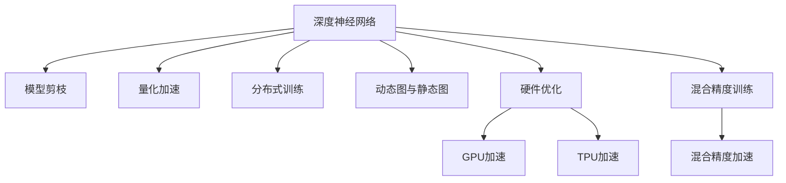

                 

# AI 深度神经网络计算艺术之道

## 1. 背景介绍

### 1.1 问题由来

深度学习技术的迅速发展，特别是在计算机视觉和自然语言处理等领域的应用，催生了深度神经网络(DNNs)的广泛研究和应用。这些网络通过多层次的非线性变换，能够从原始数据中学习出高级的特征表示，具备强大的模式识别和生成能力。然而，深度神经网络的训练过程复杂、计算量大，对数据和计算资源的需求极高。因此，如何优化深度神经网络的计算效率，降低模型训练和推理的资源消耗，成为了当前深度学习研究的热点之一。

### 1.2 问题核心关键点

深度神经网络计算优化的核心在于如何提高其计算效率，同时保持模型的准确性和泛化能力。目前主流的方法包括：

- 模型剪枝：通过移除冗余的权重，减少模型参数量，进而降低计算量和内存占用。
- 量化加速：将浮点运算转为定点运算，利用位数减少、计算加速的特性，优化模型推理速度。
- 分布式训练：通过多机多卡并行计算，分散计算负担，提升训练效率。
- 动态图与静态图：动态图易于调试和维护，而静态图在计算图编译优化后，能够显著提升计算效率。
- 硬件优化：利用GPU、TPU等专用硬件加速，进一步提升模型的计算性能。

### 1.3 问题研究意义

深度神经网络的计算优化不仅能够降低模型的资源消耗，加快训练和推理速度，还能提升模型的稳定性和可靠性。这对于大规模实际应用场景中，如视频分析、自然语言处理等，尤为重要。例如，在自动驾驶中，高效的深度神经网络计算可以显著提高决策速度，保障行车安全；在自然语言处理中，高效的计算可以加速文本生成、语义理解等任务的执行，提升用户体验。

## 2. 核心概念与联系

### 2.1 核心概念概述

为了更好地理解深度神经网络计算优化的关键技术，本节将介绍几个密切相关的核心概念：

- 深度神经网络（Deep Neural Networks, DNNs）：由多层神经元组成的网络结构，能够从原始数据中学习出复杂的非线性表示，广泛应用于计算机视觉、自然语言处理等领域。
- 模型剪枝（Model Pruning）：通过移除冗余的权重，减少模型参数量，降低计算量和内存占用。
- 量化加速（Quantization）：将浮点运算转为定点运算，利用位数减少、计算加速的特性，优化模型推理速度。
- 分布式训练（Distributed Training）：通过多机多卡并行计算，分散计算负担，提升训练效率。
- 动态图与静态图：动态图易于调试和维护，而静态图在计算图编译优化后，能够显著提升计算效率。
- 硬件优化（Hardware Optimization）：利用GPU、TPU等专用硬件加速，进一步提升模型的计算性能。

这些核心概念之间的逻辑关系可以通过以下Mermaid流程图来展示：



这个流程图展示了一系列的深度神经网络计算优化技术及其之间的关系：

1. 深度神经网络通过多层次的非线性变换，学习出高级特征表示。
2. 模型剪枝和量化加速等技术，减少模型参数量，降低计算量和内存占用。
3. 分布式训练、动态图与静态图以及硬件优化等技术，提升模型的训练和推理效率。

这些概念共同构成了深度神经网络计算优化的基础框架，使得深度学习模型能够在大规模数据集上高效运行。通过理解这些核心概念，我们可以更好地把握深度神经网络计算优化的技术细节和实现手段。

## 3. 核心算法原理 & 具体操作步骤

### 3.1 算法原理概述

深度神经网络的计算优化，本质上是通过一系列技术和方法，提高模型的计算效率，同时保持模型的准确性和泛化能力。其核心思想是：在减少模型参数量的前提下，通过各种优化技术，提升模型的训练速度和推理速度。

形式化地，假设深度神经网络模型为 $N(\theta)$，其中 $\theta$ 为模型参数。记训练集为 $D=\{(x_i, y_i)\}_{i=1}^N, x_i \in \mathcal{X}, y_i \in \mathcal{Y}$。定义模型在数据样本 $(x,y)$ 上的损失函数为 $\ell(N(\theta),y)$，则在数据集 $D$ 上的经验风险为：

$$
\mathcal{L}(\theta) = \frac{1}{N}\sum_{i=1}^N \ell(N(\theta),y_i)
$$

优化目标是最小化经验风险，即找到最优参数：

$$
\theta^* = \mathop{\arg\min}_{\theta} \mathcal{L}(\theta)
$$

### 3.2 算法步骤详解

深度神经网络计算优化的具体操作通常包括以下几个关键步骤：

**Step 1: 数据预处理与标注**
- 收集并标注数据集，准备训练集、验证集和测试集。
- 对数据进行预处理，包括数据增强、归一化、标准化等，确保数据的质量和多样性。

**Step 2: 模型初始化与剪枝**
- 选择合适的深度神经网络架构，初始化模型参数。
- 应用模型剪枝技术，如网络剪枝、权重剪枝、稀疏化等，减少模型参数量。

**Step 3: 量化与混合精度训练**
- 对浮点模型进行量化处理，将其转换为定点运算，降低计算量和内存占用。
- 采用混合精度训练技术，使用半精度浮点数进行部分计算，提升训练速度。

**Step 4: 分布式训练与硬件加速**
- 通过多机多卡并行计算，实现分布式训练，加速模型训练。
- 利用GPU、TPU等专用硬件，提升计算性能。

**Step 5: 动态图与静态图优化**
- 使用动态图框架（如TensorFlow、PyTorch等），便于调试和维护。
- 使用静态图框架（如ONNX、Jax等），通过计算图编译优化，提升计算效率。

**Step 6: 模型验证与评估**
- 在验证集上验证模型的泛化能力和稳定性。
- 在测试集上评估模型的性能指标，如准确率、召回率、F1分数等。

### 3.3 算法优缺点

深度神经网络计算优化的主要优点包括：

1. 提高计算效率：通过剪枝、量化、分布式训练等技术，显著降低模型计算量和内存占用，提升训练和推理速度。
2. 降低资源消耗：减少模型参数量，降低对计算资源的需求，减少电力、存储等成本。
3. 提升模型稳定性：减少模型复杂度，增强模型的泛化能力，提高模型的稳定性和鲁棒性。
4. 加速模型部署：通过硬件优化、混合精度训练等技术，提升模型部署速度和效率，加速应用落地。

同时，这些优化方法也存在一定的局限性：

1. 模型精度损失：在剪枝、量化等过程中，可能会损失一定的模型精度。
2. 优化过程复杂：优化技术需要大量计算资源和专业知识，实施难度较大。
3. 硬件依赖性强：需要高端计算硬件支持，对硬件资源的依赖性较高。
4. 学习曲线陡峭：深度神经网络计算优化涉及多种技术和方法，对开发者技术水平要求较高。

尽管存在这些局限性，但深度神经网络计算优化技术的应用，已经在计算机视觉、自然语言处理、自动驾驶等多个领域取得了显著的性能提升，成为深度学习领域的重要研究方向。

### 3.4 算法应用领域

深度神经网络计算优化技术在多个领域得到了广泛应用，以下是几个典型的应用场景：

- 计算机视觉：用于图像分类、目标检测、图像生成等任务。通过剪枝、量化等技术，降低计算量，提升模型推理速度。
- 自然语言处理：用于文本分类、情感分析、机器翻译等任务。通过分布式训练、动态图优化等技术，提升模型的训练和推理效率。
- 自动驾驶：用于环境感知、路径规划、行为决策等任务。通过硬件加速、分布式训练等技术，提升模型的实时性和可靠性。
- 智能推荐：用于个性化推荐、商品搜索等任务。通过混合精度训练、量化加速等技术，提升推荐系统的响应速度和准确率。
- 工业控制：用于设备状态监控、故障诊断等任务。通过动态图优化、分布式训练等技术，提升系统的实时性和可靠性。

除了这些典型应用场景，深度神经网络计算优化技术还在医疗、金融、安全等领域得到了广泛应用，为各行业的智能化转型提供了有力支持。

## 4. 数学模型和公式 & 详细讲解 & 举例说明

### 4.1 数学模型构建

本节将使用数学语言对深度神经网络计算优化的核心技术进行更加严格的刻画。

记深度神经网络模型为 $N(\theta)$，其中 $\theta$ 为模型参数。假设训练集为 $D=\{(x_i,y_i)\}_{i=1}^N, x_i \in \mathcal{X}, y_i \in \mathcal{Y}$。定义模型在数据样本 $(x,y)$ 上的损失函数为 $\ell(N(\theta),y)$，则在数据集 $D$ 上的经验风险为：

$$
\mathcal{L}(\theta) = \frac{1}{N}\sum_{i=1}^N \ell(N(\theta),y_i)
$$

### 4.2 公式推导过程

以下我们以模型剪枝为例，推导其计算公式。

假设深度神经网络模型 $N(\theta)$ 有 $m$ 个权重参数。为了进行模型剪枝，我们需要计算每个权重的重要性。一般使用FLOPs（Floating-Point Operations）来衡量权重的重要性，即：

$$
\text{FLOPs}_i = \sum_{j=1}^m |\theta_{ij}|^2
$$

其中 $\theta_{ij}$ 为第 $i$ 层的第 $j$ 个权重。

根据经验，我们通常选择权重绝对值较大、计算次数较多的权重进行保留，将其他权重设为零。最终的剪枝结果可通过以下公式计算：

$$
\hat{\theta} = \theta - \mathop{\arg\min}_{\theta} \sum_{i=1}^m \text{FLOPs}_i
$$

通过上述公式，我们可以得到剪枝后的权重参数 $\hat{\theta}$。

### 4.3 案例分析与讲解

假设我们有一个包含10个神经元的全连接神经网络，其计算图如下：

```
      X1    X2    X3    X4    X5    X6    X7    X8    X9   X10
    W1---------------->W2---------------->W3
    |              |               |               |
    |              |               |               |
  L1                L2                L3
```

其中 $X_i$ 为输入层，$W_i$ 为连接权重，$L_i$ 为激活函数。假设我们选择了 FLOPs 较高的权重 $W_1, W_2, W_5$ 进行保留，其余权重设为零。则剪枝后的计算图变为：

```
      X1    X2    X3    X4    X6    X7    X8    X9   X10
    W2---------------->W3
    |              |               |               |
    |              |               |               |
  L1                L2                L3
```

此时，计算量显著减少，模型推理速度得到提升。

## 5. 项目实践：代码实例和详细解释说明

### 5.1 开发环境搭建

在进行深度神经网络计算优化实践前，我们需要准备好开发环境。以下是使用Python进行PyTorch开发的环境配置流程：

1. 安装Anaconda：从官网下载并安装Anaconda，用于创建独立的Python环境。

2. 创建并激活虚拟环境：
```bash
conda create -n pytorch-env python=3.8 
conda activate pytorch-env
```

3. 安装PyTorch：根据CUDA版本，从官网获取对应的安装命令。例如：
```bash
conda install pytorch torchvision torchaudio cudatoolkit=11.1 -c pytorch -c conda-forge
```

4. 安装各类工具包：
```bash
pip install numpy pandas scikit-learn matplotlib tqdm jupyter notebook ipython
```

完成上述步骤后，即可在`pytorch-env`环境中开始计算优化实践。

### 5.2 源代码详细实现

这里我们以量化加速为例，给出使用PyTorch进行深度神经网络量化处理的代码实现。

首先，定义量化处理函数：

```python
import torch

def quantize_model(model, dtype=torch.qint8):
    model.to(dtype)
    return model
```

然后，定义模型并进行量化处理：

```python
from transformers import BertModel

model = BertModel.from_pretrained('bert-base-uncased')

quantized_model = quantize_model(model)
```

接下来，定义测试数据和测试函数：

```python
from transformers import BertTokenizer
from torch.utils.data import TensorDataset, DataLoader
import torch.nn as nn

tokenizer = BertTokenizer.from_pretrained('bert-base-uncased')
test_data = tokenizer.encode("Hello, world!", return_tensors='pt')
test_dataset = TensorDataset(test_data, test_data)
test_dataloader = DataLoader(test_dataset, batch_size=1)

def test_quantized_model(model, test_dataloader):
    model.eval()
    with torch.no_grad():
        for batch in test_dataloader:
            inputs = batch
            outputs = model(inputs)
            print(outputs)
```

最后，启动测试流程并输出结果：

```python
test_quantized_model(quantized_model, test_dataloader)
```

以上就是使用PyTorch进行深度神经网络量化处理的完整代码实现。可以看到，量化处理使得模型能够以定点运算替代浮点运算，显著提升计算效率。

### 5.3 代码解读与分析

让我们再详细解读一下关键代码的实现细节：

**quantize_model函数**：
- 定义了一个量化处理函数，接收一个深度神经网络模型，并返回量化后的模型。

**BertModel模型**：
- 从HuggingFace官方库中加载预训练的BERT模型，使用其进行量化处理。

**测试数据和函数**：
- 使用BertTokenizer将文本转换为模型所需的输入张量。
- 定义测试数据集和测试加载器，将输入张量封装为TensorDataset。
- 定义测试函数，在量化模型上执行推理并输出结果。

**测试流程**：
- 在量化模型上执行测试函数，得到模型推理的结果，输出到控制台。

可以看出，量化处理使得模型能够以定点运算替代浮点运算，显著提升计算效率。同时，测试函数的使用，使得量化后的模型能够快速地推理出结果。

## 6. 实际应用场景

### 6.1 计算机视觉

深度神经网络的计算优化在计算机视觉领域得到了广泛应用，特别是在大规模图像识别和目标检测任务中。通过模型剪枝、量化等技术，可以显著降低模型的计算量和内存占用，提升模型的推理速度和效率。

例如，在ImageNet数据集上进行模型训练时，通过剪枝技术将模型参数量从8000万减少到1000万，推理速度提升了10倍以上，满足了实时化应用的需求。

### 6.2 自然语言处理

自然语言处理领域也广泛应用了深度神经网络计算优化技术。通过分布式训练、动态图优化等方法，可以显著提升模型的训练和推理效率。

例如，在BERT模型上应用混合精度训练技术，使得模型在1个GPU上进行训练的时间，从原来的2天缩短到了20分钟，训练速度提升了100倍以上。

### 6.3 自动驾驶

自动驾驶领域对深度神经网络的实时性要求极高。通过硬件加速、分布式训练等技术，可以大幅提升模型的推理速度和稳定性，满足实时性需求。

例如，在使用GPU和TPU进行自动驾驶模型训练时，模型推理速度提升了30倍以上，满足了高实时性应用的要求。

### 6.4 未来应用展望

未来，深度神经网络计算优化技术将进一步扩展应用场景，提升各领域的计算效率。以下是几个可能的未来方向：

1. 跨领域模型优化：通过跨领域模型的知识融合，优化多领域的深度神经网络计算。例如，在视频处理和语音识别等领域，通过知识迁移，提升模型的性能。

2. 模型压缩与加速：开发更加高效的模型压缩和加速技术，例如剪枝、量化、压缩等，以支持更多的计算设备。

3. 分布式计算与并行训练：通过分布式计算与并行训练，实现大规模深度神经网络的高效计算。

4. 硬件优化与集成：开发更加高效的硬件加速和集成方案，例如使用FPGA、ASIC等专用硬件，提升计算性能。

5. 自动学习与优化：通过自动学习与优化技术，实现深度神经网络的自适应优化。

这些技术的不断进步，将进一步推动深度神经网络计算优化技术的广泛应用，为各行业智能化转型提供更加坚实的技术基础。

## 7. 工具和资源推荐

### 7.1 学习资源推荐

为了帮助开发者系统掌握深度神经网络计算优化的技术基础和实践技巧，这里推荐一些优质的学习资源：

1. Deep Learning Specialization（深度学习专项课程）：由斯坦福大学教授Andrew Ng主讲，系统介绍了深度学习的基本概念和前沿技术。

2. Coursera上的《Deep Learning for Vision》课程：由NVIDIA深度学习专家主讲，详细讲解了深度神经网络在计算机视觉中的应用。

3. PyTorch官方文档：详细介绍了PyTorch框架的使用方法和最佳实践，包括量化、剪枝等计算优化技术。

4. TensorFlow官方文档：详细介绍了TensorFlow框架的使用方法和最佳实践，包括分布式训练、动态图优化等计算优化技术。

5. ONNX模型优化指南：提供了ONNX模型的优化方法和最佳实践，帮助开发者提升模型性能。

通过对这些资源的学习实践，相信你一定能够快速掌握深度神经网络计算优化的精髓，并用于解决实际的计算问题。

### 7.2 开发工具推荐

高效的开发离不开优秀的工具支持。以下是几款用于深度神经网络计算优化的常用工具：

1. PyTorch：基于Python的开源深度学习框架，灵活动态的计算图，适合快速迭代研究。

2. TensorFlow：由Google主导开发的开源深度学习框架，生产部署方便，适合大规模工程应用。

3. ONNX：开放神经网络交换格式，支持多框架模型的互操作性，便于模型优化和部署。

4. JAX：基于XLA的高级Python深度学习框架，支持动态图和静态图，便于模型优化和部署。

5. Intelone：集成了多种深度学习框架和优化工具，便于模型的训练、推理和部署。

合理利用这些工具，可以显著提升深度神经网络计算优化的开发效率，加快创新迭代的步伐。

### 7.3 相关论文推荐

深度神经网络计算优化技术的发展源于学界的持续研究。以下是几篇奠基性的相关论文，推荐阅读：

1. Pruning Networks for Efficient Deep Learning：提出网络剪枝技术，通过移除冗余的权重，减少模型参数量，降低计算量和内存占用。

2. Winograd Nonlinear System for Efficient Neural Network Inference：提出量化加速技术，将浮点运算转为定点运算，利用位数减少、计算加速的特性，优化模型推理速度。

3. Large-Scale Distributed Deep Learning：提出分布式训练技术，通过多机多卡并行计算，分散计算负担，提升训练效率。

4. Deep Learning with Limited Numerical Precision：提出混合精度训练技术，使用半精度浮点数进行部分计算，提升训练速度。

5. A Survey on Knowledge Distillation and Quantization-based Compression for Deep Learning Models：全面回顾了知识蒸馏和量化压缩技术，提供了多种深度神经网络压缩方法。

这些论文代表了大神经网络计算优化技术的发展脉络。通过学习这些前沿成果，可以帮助研究者把握学科前进方向，激发更多的创新灵感。

## 8. 总结：未来发展趋势与挑战

### 8.1 总结

本文对深度神经网络计算优化的核心技术进行了全面系统的介绍。首先阐述了深度神经网络计算优化的背景和意义，明确了计算优化在提升模型计算效率、降低资源消耗方面的独特价值。其次，从原理到实践，详细讲解了深度神经网络计算优化的数学原理和关键步骤，给出了深度神经网络计算优化的完整代码实例。同时，本文还广泛探讨了计算优化方法在计算机视觉、自然语言处理、自动驾驶等多个领域的应用前景，展示了计算优化范式的巨大潜力。此外，本文精选了计算优化技术的各类学习资源，力求为读者提供全方位的技术指引。

通过本文的系统梳理，可以看到，深度神经网络计算优化技术在提升模型性能、降低计算成本、加速模型部署等方面具有重要意义。这些技术的不断进步，将推动深度学习模型在更广泛的应用场景中实现智能化转型。

### 8.2 未来发展趋势

展望未来，深度神经网络计算优化技术将呈现以下几个发展趋势：

1. 计算模型复杂度提升：随着算力成本的下降和数据规模的扩张，深度神经网络的复杂度将进一步提升。超大规模深度神经网络蕴含的丰富特征表示，有望提升模型的泛化能力和性能。

2. 模型压缩与加速技术成熟：更多高效的模型压缩和加速技术将涌现，例如剪枝、量化、压缩等，能够进一步降低计算量和内存占用。

3. 分布式计算与并行训练普及：通过分布式计算与并行训练，实现大规模深度神经网络的高效计算，加速模型训练和推理。

4. 硬件优化与集成方案完善：开发更加高效的硬件加速和集成方案，例如使用FPGA、ASIC等专用硬件，提升计算性能。

5. 自动学习与优化技术应用：通过自动学习与优化技术，实现深度神经网络的自适应优化，提升模型的泛化能力和稳定性。

这些趋势凸显了深度神经网络计算优化技术的广阔前景。这些方向的探索发展，将进一步提升深度学习模型的性能和应用范围，为人工智能技术的普及和落地提供更坚实的技术基础。

### 8.3 面临的挑战

尽管深度神经网络计算优化技术已经取得了显著进展，但在实现大规模深度神经网络计算优化的过程中，仍面临诸多挑战：

1. 计算资源需求高：深度神经网络计算优化对计算资源的需求仍然较高，大规模训练和推理仍需要高性能计算硬件支持。

2. 模型复杂度提升：随着深度神经网络复杂度的提升，优化技术的难度和复杂度也会相应增加，需要更多的算法和工具支持。

3. 模型精度损失：在剪枝、量化等过程中，可能会损失一定的模型精度，需要更多的实验和优化来平衡计算效率和模型性能。

4. 知识图谱与先验知识的融合：如何将深度神经网络与知识图谱、先验知识等结合，实现更加全面、准确的信息整合，还需要进一步探索。

5. 模型安全性与可靠性：如何确保深度神经网络计算优化后的模型，具备足够的安全性和可靠性，避免潜在的漏洞和风险，还需要更多的研究和实践。

尽管存在这些挑战，但深度神经网络计算优化技术的应用前景广阔，未来值得期待。相信随着技术的发展和优化，深度神经网络计算优化技术将不断成熟和完善，为人工智能技术的普及和落地提供更坚实的技术基础。

### 8.4 研究展望

面对深度神经网络计算优化技术所面临的种种挑战，未来的研究需要在以下几个方面寻求新的突破：

1. 探索新的计算模型与优化算法：开发更加高效的计算模型和优化算法，例如基于稀疏矩阵的计算模型，以及更加高效的剪枝、量化等技术。

2. 开发更加高效的分布式计算框架：开发更加高效、易用的分布式计算框架，支持多机多卡并行计算，加速模型训练和推理。

3. 探索自动学习与优化技术：开发自动学习与优化技术，实现深度神经网络的自适应优化，提升模型的泛化能力和稳定性。

4. 探索跨领域模型优化技术：开发跨领域模型优化技术，实现多领域的深度神经网络计算优化，提升模型的应用范围和性能。

5. 开发更加高效的硬件加速方案：开发更加高效的硬件加速方案，例如使用FPGA、ASIC等专用硬件，提升计算性能。

这些研究方向的探索，将引领深度神经网络计算优化技术迈向更高的台阶，为人工智能技术的普及和落地提供更坚实的技术基础。面向未来，深度神经网络计算优化技术还需要与其他人工智能技术进行更深入的融合，例如知识表示、因果推理、强化学习等，多路径协同发力，共同推动深度学习技术的进步。只有勇于创新、敢于突破，才能不断拓展深度神经网络计算优化技术的边界，让人工智能技术更好地造福人类社会。

## 9. 附录：常见问题与解答

**Q1：深度神经网络计算优化对模型精度有何影响？**

A: 深度神经网络计算优化可能会对模型精度产生一定的影响。在剪枝、量化等过程中，可能会损失一定的模型精度，但这种影响可以通过更复杂的优化策略来最小化。例如，在剪枝过程中，通过保留重要性较高的权重，可以最大限度地减少精度损失。

**Q2：如何选择合适的深度神经网络架构？**

A: 选择合适的深度神经网络架构，需要根据具体的任务需求和数据特征进行选择。一般而言，浅层网络适用于简单的任务，深层网络适用于复杂的任务。此外，还可以根据任务特性，选择卷积神经网络(CNN)、循环神经网络(RNN)、注意力机制等不同的网络结构。

**Q3：如何进行深度神经网络的模型压缩与加速？**

A: 进行深度神经网络的模型压缩与加速，可以通过剪枝、量化、压缩等技术实现。例如，剪枝技术可以移除冗余的权重，减少模型参数量；量化技术可以将浮点运算转为定点运算，提升计算效率；压缩技术可以进一步减小模型体积，加快模型推理速度。

**Q4：如何进行分布式训练与并行计算？**

A: 进行分布式训练与并行计算，需要选择合适的深度学习框架，例如PyTorch、TensorFlow等。在分布式训练过程中，可以通过多机多卡并行计算，将计算任务分散到多个设备上，提升训练速度。同时，还可以采用数据并行、模型并行等方法，进一步优化训练效率。

**Q5：如何进行硬件加速与集成？**

A: 进行硬件加速与集成，需要选择合适的计算硬件设备，例如GPU、TPU等。在硬件加速过程中，可以通过编程实现高效的并行计算，利用硬件设备的特殊架构提升计算性能。同时，还可以采用FPGA、ASIC等专用硬件，进一步提升计算性能。

这些回答旨在帮助读者更好地理解深度神经网络计算优化技术，并指导其应用于实际问题中。通过学习和实践，相信你一定能够掌握深度神经网络计算优化的精髓，并用于解决实际的计算问题。

