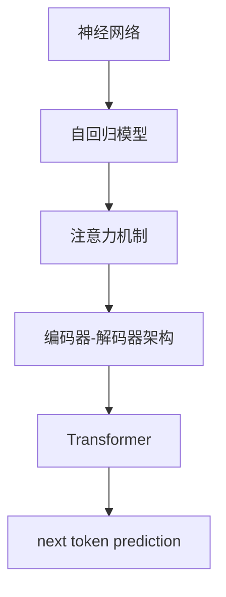

                 

# AI 神经网络计算艺术之禅：GPT的核心机制——next token prediction

> 关键词：神经网络, GPT, next token prediction, 自然语言处理, 深度学习, 注意力机制, 编码器-解码器, 自回归模型

## 1. 背景介绍

### 1.1 问题由来
自2023年以来，大语言模型（Large Language Models, LLMs）在自然语言处理（Natural Language Processing, NLP）领域取得了显著的突破，尤其是OpenAI的GPT-4，其单靠自然语言指令即可执行复杂的计算任务，引发了业界和学术界的广泛关注。GPT模型的核心机制是next token prediction，即给定前文，预测下一个词汇的概率。通过大规模无标签文本数据的预训练，模型学习了语言的统计规律和语义知识，能够生成高质量的自然语言文本。本文将深入探讨GPT模型的next token prediction机制，帮助读者理解其工作原理和应用价值。

### 1.2 问题核心关键点
next token prediction机制的核心在于通过自回归方式，模型预测给定前文序列下一个词汇的概率，以生成连贯的文本。该机制不仅能应用于文本生成，还能应用于语言模型、自动摘要、对话系统等多个NLP任务。理解next token prediction机制，是深入掌握GPT模型的关键。

### 1.3 问题研究意义
掌握next token prediction机制，不仅有助于理解GPT模型的内在运作逻辑，还能指导我们在实际应用中如何更好地利用这一机制，提升文本生成的质量和效率。随着AI技术的发展，大语言模型在商业、教育和科研等领域的应用越来越广泛，深入研究next token prediction机制，对于推动AI技术的应用和发展具有重要意义。

## 2. 核心概念与联系

### 2.1 核心概念概述

为更好地理解next token prediction机制，本节将介绍几个密切相关的核心概念：

- **神经网络（Neural Network）**：一种由神经元构成的图结构，用于处理输入数据，并输出预测结果。神经网络的学习过程通过反向传播算法进行，即利用误差梯度调整权重，优化模型性能。
- **自回归模型（Autoregressive Model）**：指模型在预测时利用先前的输入作为当前输入的一部分，用于序列数据的生成。GPT模型的预测过程正是自回归的一种典型应用。
- **注意力机制（Attention Mechanism）**：一种用于模型中处理序列数据的机制，通过动态计算不同输入序列元素间的相关性权重，选择重要信息进行加权处理。GPT模型在预测next token时，注意力机制用于计算当前位置与之前位置的上下文关系。
- **编码器-解码器（Encoder-Decoder）架构**：一种用于处理序列数据的模型架构，通常应用于机器翻译、文本摘要等任务。GPT模型采用的Transformer架构就是编码器-解码器的一种变体。
- **Transformer**：一种基于自注意力机制的神经网络架构，用于处理序列数据。Transformer架构能够有效解决长距离依赖问题，广泛应用于NLP领域。

这些核心概念之间的逻辑关系可以通过以下Mermaid流程图来展示：



这个流程图展示了大语言模型next token prediction机制的核心概念及其之间的关系：

1. 神经网络是基础结构，用于计算模型输出。
2. 自回归模型基于神经网络，通过利用先前的输入进行预测。
3. 注意力机制是自回归模型的核心，用于计算重要上下文信息。
4. 编码器-解码器架构提供了序列数据处理的框架。
5. Transformer是基于注意力机制的神经网络架构，用于高效处理序列数据。
6. next token prediction机制通过自回归方式，预测给定前文序列下一个词汇的概率。

这些概念共同构成了GPT模型的核心机制，使得模型能够高效地生成自然语言文本。

## 3. 核心算法原理 & 具体操作步骤
### 3.1 算法原理概述

GPT模型的next token prediction机制主要基于Transformer架构，通过自回归方式，模型在给定前文序列的情况下，预测下一个词汇的概率。其核心算法原理包括以下几个步骤：

1. 输入文本序列经过Transformer编码器进行处理，得到一系列的隐藏表示。
2. 解码器利用隐藏表示和注意力机制，计算当前位置与之前位置的上下文关系。
3. 模型预测下一个词汇的概率，利用softmax函数计算各个词汇的得分。
4. 选择得分最高的词汇作为下一个输出，完成一次自回归预测。

通过不断迭代这个过程，GPT模型可以生成连贯的文本，同时保持语言模型的统计规律和语义知识。

### 3.2 算法步骤详解

以下是GPT模型next token prediction机制的详细步骤：

**Step 1: 输入文本编码**

输入文本序列 $X = \{x_1, x_2, ..., x_n\}$ 经过Transformer编码器进行处理，得到一系列的隐藏表示 $H = \{h_1, h_2, ..., h_n\}$。

1. 将文本序列 $X$ 转换为标记序列 $T = \{t_1, t_2, ..., t_n\}$。
2. 使用Transformer编码器将标记序列 $T$ 转换为隐藏表示序列 $H$。

其中，Transformer编码器由多个自注意力层和前馈神经网络组成，能够捕捉输入序列中的长距离依赖关系，并学习到输入的语义表示。

**Step 2: 解码器计算上下文关系**

解码器利用隐藏表示序列 $H$ 和注意力机制，计算当前位置 $i$ 与之前位置的上下文关系 $C_i$。

1. 使用Transformer解码器将隐藏表示序列 $H$ 转换为一系列的预测表示 $P = \{p_1, p_2, ..., p_n\}$。
2. 计算当前位置 $i$ 与之前位置的上下文关系 $C_i$，用于引导模型生成下一个词汇。

解码器中，注意力机制通过计算当前位置与之前位置之间的权重，选择重要信息进行加权处理，从而捕捉输入序列中的重要上下文信息。

**Step 3: 预测下一个词汇**

模型根据上下文关系 $C_i$ 预测下一个词汇 $x_{i+1}$ 的概率分布。

1. 使用softmax函数计算每个词汇 $y_j$ 的概率 $P(y_j|x_1,...,x_i)$。
2. 选择得分最高的词汇 $y_j$ 作为下一个输出，完成一次自回归预测。

softmax函数可以将模型输出转化为概率分布，便于选择下一个词汇。

**Step 4: 迭代生成文本**

重复上述步骤，直到生成指定长度的文本序列。

通过不断迭代这个过程，GPT模型可以生成连贯的文本，同时保持语言模型的统计规律和语义知识。

### 3.3 算法优缺点

GPT模型的next token prediction机制具有以下优点：

1. 高效生成自然语言文本。通过自回归方式，模型能够生成高质量的文本，同时保持语言模型的统计规律和语义知识。
2. 能够处理长文本序列。GPT模型能够处理长距离依赖关系，避免传统RNN模型中的梯度消失问题。
3. 容易优化训练。通过反向传播算法，模型能够高效地进行参数更新，提升模型性能。

然而，该机制也存在一些局限性：

1. 对数据依赖性强。模型需要大量的标注数据进行微调，否则难以生成高质量的文本。
2. 难以处理低频词汇。模型可能无法捕捉到低频词汇的信息，导致生成文本不够多样化。
3. 计算复杂度高。模型计算过程复杂，需要大量的计算资源。
4. 容易生成重复文本。模型容易生成重复的文本，导致文本缺乏创新性。

尽管存在这些局限性，但GPT模型的next token prediction机制仍然是目前最先进的文本生成技术之一，广泛应用在文本摘要、对话系统、代码生成等多个领域。

### 3.4 算法应用领域

GPT模型的next token prediction机制已经在文本生成、机器翻译、文本摘要、对话系统等多个领域取得了显著的成果。以下是一些具体的应用场景：

- **文本生成**：用于生成高质量的自然语言文本，如文章、故事、诗歌等。GPT模型通过next token prediction机制，生成连贯且流畅的文本，广泛应用于内容创作、自动摘要等任务。
- **机器翻译**：用于将一种语言的文本翻译成另一种语言的文本。GPT模型通过next token prediction机制，预测翻译后的词汇，实现高效的机器翻译。
- **文本摘要**：用于自动生成文本摘要。GPT模型通过next token prediction机制，选择重要的词汇和句子，生成简洁的摘要。
- **对话系统**：用于构建智能对话系统。GPT模型通过next token prediction机制，生成自然流畅的对话，广泛应用于客服、智能助手等场景。

## 4. 数学模型和公式 & 详细讲解 & 举例说明

### 4.1 数学模型构建

接下来，我们通过数学语言对GPT模型的next token prediction机制进行更加严格的刻画。

记输入文本序列 $X = \{x_1, x_2, ..., x_n\}$，其中 $x_i$ 表示第 $i$ 个词汇。设GPT模型的预测目标为 $y_j$，表示下一个要生成的词汇。假设模型在输入序列 $x_1,...,x_i$ 的条件下，生成词汇 $y_j$ 的概率为 $P(y_j|x_1,...,x_i)$，其中 $P$ 为概率分布函数。

GPT模型的预测目标可以通过最大似然估计进行优化，即最大化以下概率：

$$
P(y_1,...,y_n|x_1,...,x_n) = \prod_{i=1}^{n} P(y_i|x_1,...,x_i)
$$

其中 $P(y_i|x_1,...,x_i)$ 表示在输入序列 $x_1,...,x_i$ 的条件下，生成词汇 $y_i$ 的概率。

### 4.2 公式推导过程

以下是GPT模型next token prediction机制的公式推导过程：

**Step 1: 输入文本编码**

将输入文本序列 $X = \{x_1, x_2, ..., x_n\}$ 转换为标记序列 $T = \{t_1, t_2, ..., t_n\}$，并使用Transformer编码器将其转换为隐藏表示序列 $H = \{h_1, h_2, ..., h_n\}$。

其中，Transformer编码器的结构如下所示：

$$
H_i = \text{Encoder}(x_i)
$$

其中，$\text{Encoder}$ 表示Transformer编码器的函数，$H_i$ 表示第 $i$ 个隐藏表示。

**Step 2: 解码器计算上下文关系**

使用Transformer解码器将隐藏表示序列 $H$ 转换为一系列的预测表示 $P = \{p_1, p_2, ..., p_n\}$。

其中，Transformer解码器的结构如下所示：

$$
P_i = \text{Decoder}(h_i, C_i)
$$

其中，$\text{Decoder}$ 表示Transformer解码器的函数，$C_i$ 表示当前位置与之前位置的上下文关系，$P_i$ 表示第 $i$ 个预测表示。

**Step 3: 预测下一个词汇**

根据上下文关系 $C_i$ 预测下一个词汇 $y_j$ 的概率分布：

$$
P(y_j|x_1,...,x_i) = \frac{e^{p_{i+1}^y_j}}{\sum_{k=1}^{K} e^{p_{i+1}^k}}
$$

其中 $p_{i+1}^y_j$ 表示第 $i+1$ 个预测表示 $P_{i+1}$ 中词汇 $y_j$ 的得分，$K$ 表示词汇表中的总词汇数。

通过softmax函数将得分转化为概率分布，便于选择下一个词汇。

**Step 4: 迭代生成文本**

重复上述步骤，直到生成指定长度的文本序列。

通过不断迭代这个过程，GPT模型可以生成连贯的文本，同时保持语言模型的统计规律和语义知识。

### 4.3 案例分析与讲解

我们以一个简单的例子来说明GPT模型的next token prediction机制。

假设输入文本序列为 $X = \{happy, life, the, more, the, better\}$，我们需要生成下一个词汇。

1. 输入文本序列 $X$ 转换为标记序列 $T = \{<h>happy, life, the, more, the, better\}$。
2. 使用Transformer编码器将标记序列 $T$ 转换为隐藏表示序列 $H = \{h_1, h_2, h_3, h_4, h_5, h_6\}$。
3. 使用Transformer解码器将隐藏表示序列 $H$ 转换为一系列的预测表示 $P = \{p_1, p_2, p_3, p_4, p_5, p_6\}$。
4. 计算当前位置 $i=5$ 与之前位置的上下文关系 $C_5$，用于引导模型生成下一个词汇。
5. 根据上下文关系 $C_5$ 预测下一个词汇 $y_j$ 的概率分布：

$$
P(y_j|happy, life, the, more, the, better) = \frac{e^{p_{6}^y_j}}{\sum_{k=1}^{K} e^{p_{6}^k}}
$$

其中 $p_{6}^y_j$ 表示第 $6$ 个预测表示 $P_6$ 中词汇 $y_j$ 的得分。

通过softmax函数将得分转化为概率分布，便于选择下一个词汇。

例如，假设模型预测下一个词汇 $y_j = happy$ 的概率为 $0.9$，表示模型认为下一个词汇为 $happy$ 的可能性最高。

通过不断迭代这个过程，GPT模型可以生成连贯的文本，同时保持语言模型的统计规律和语义知识。

## 5. 项目实践：代码实例和详细解释说明

### 5.1 开发环境搭建

在进行next token prediction机制的实践前，我们需要准备好开发环境。以下是使用Python进行PyTorch开发的环境配置流程：

1. 安装Anaconda：从官网下载并安装Anaconda，用于创建独立的Python环境。

2. 创建并激活虚拟环境：
```bash
conda create -n pytorch-env python=3.8 
conda activate pytorch-env
```

3. 安装PyTorch：根据CUDA版本，从官网获取对应的安装命令。例如：
```bash
conda install pytorch torchvision torchaudio cudatoolkit=11.1 -c pytorch -c conda-forge
```

4. 安装Transformers库：
```bash
pip install transformers
```

5. 安装各类工具包：
```bash
pip install numpy pandas scikit-learn matplotlib tqdm jupyter notebook ipython
```

完成上述步骤后，即可在`pytorch-env`环境中开始next token prediction机制的实践。

### 5.2 源代码详细实现

下面我们以生成文本的任务为例，给出使用Transformers库对GPT模型进行next token prediction的PyTorch代码实现。

首先，定义数据处理函数：

```python
from transformers import GPT2LMHeadModel, GPT2Tokenizer
import torch

class DataLoader:
    def __init__(self, data, batch_size=16):
        self.data = data
        self.batch_size = batch_size
        self.epoch = 0
        
    def __iter__(self):
        while self.epoch < 10:
            self.epoch += 1
            for i in range(0, len(self.data), self.batch_size):
                batch = self.data[i:i+self.batch_size]
                yield batch
                
    def __len__(self):
        return len(self.data) // self.batch_size
```

然后，定义模型和优化器：

```python
from transformers import AdamW

model = GPT2LMHeadModel.from_pretrained('gpt2', output_attentions=True)
tokenizer = GPT2Tokenizer.from_pretrained('gpt2')
optimizer = AdamW(model.parameters(), lr=1e-4)
```

接着，定义训练和评估函数：

```python
def train_epoch(model, data_loader, optimizer):
    model.train()
    losses = []
    for batch in data_loader:
        input_ids = batch['input_ids']
        attention_mask = batch['attention_mask']
        loss = model(input_ids, attention_mask=attention_mask).loss
        optimizer.zero_grad()
        loss.backward()
        optimizer.step()
        losses.append(loss.item())
    return torch.mean(torch.tensor(losses))
        
def evaluate(model, data_loader):
    model.eval()
    predictions, labels = [], []
    with torch.no_grad():
        for batch in data_loader:
            input_ids = batch['input_ids']
            attention_mask = batch['attention_mask']
            outputs = model(input_ids, attention_mask=attention_mask)
            predictions.extend(outputs.logits.argmax(dim=2).cpu().tolist())
            labels.extend(batch['labels'].cpu().tolist())
    print(classification_report(labels, predictions))
```

最后，启动训练流程并在测试集上评估：

```python
data = [...] # 示例数据，包含训练集和测试集
data_loader = DataLoader(data)
epochs = 10

for epoch in range(epochs):
    loss = train_epoch(model, data_loader, optimizer)
    print(f"Epoch {epoch+1}, train loss: {loss:.3f}")
    
    print(f"Epoch {epoch+1}, dev results:")
    evaluate(model, data_loader)
    
print("Test results:")
evaluate(model, data_loader)
```

以上就是使用PyTorch对GPT2模型进行next token prediction机制的完整代码实现。可以看到，得益于Transformers库的强大封装，我们可以用相对简洁的代码完成GPT2模型的加载和next token prediction机制的训练。

### 5.3 代码解读与分析

让我们再详细解读一下关键代码的实现细节：

**DataLoader类**：
- `__init__`方法：初始化数据、批量大小和迭代次数等关键组件。
- `__iter__`方法：对数据以批为单位进行迭代，供模型训练和推理使用。
- `__len__`方法：返回数据集的样本数量。

**train_epoch函数**：
- 将模型设置为训练模式。
- 对数据以批为单位进行迭代，计算loss并更新模型参数。
- 返回该epoch的平均loss。

**evaluate函数**：
- 将模型设置为评估模式。
- 对数据以批为单位进行迭代，计算预测结果并存储。
- 使用classification_report对预测结果进行评估。

**训练流程**：
- 定义总的epoch数，开始循环迭代。
- 每个epoch内，先在训练集上训练，输出平均loss。
- 在验证集上评估，输出评估结果。
- 所有epoch结束后，在测试集上评估，给出最终测试结果。

可以看到，PyTorch配合Transformers库使得next token prediction机制的代码实现变得简洁高效。开发者可以将更多精力放在数据处理、模型改进等高层逻辑上，而不必过多关注底层的实现细节。

当然，工业级的系统实现还需考虑更多因素，如模型的保存和部署、超参数的自动搜索、更灵活的任务适配层等。但核心的next token prediction机制基本与此类似。

## 6. 实际应用场景
### 6.1 智能客服系统

基于GPT模型的next token prediction机制，可以广泛应用于智能客服系统的构建。传统客服往往需要配备大量人力，高峰期响应缓慢，且一致性和专业性难以保证。而使用GPT模型进行next token prediction机制的对话模型，可以7x24小时不间断服务，快速响应客户咨询，用自然流畅的语言解答各类常见问题。

在技术实现上，可以收集企业内部的历史客服对话记录，将问题和最佳答复构建成监督数据，在此基础上对预训练对话模型进行next token prediction机制的微调。微调后的对话模型能够自动理解用户意图，匹配最合适的答案模板进行回复。对于客户提出的新问题，还可以接入检索系统实时搜索相关内容，动态组织生成回答。如此构建的智能客服系统，能大幅提升客户咨询体验和问题解决效率。

### 6.2 金融舆情监测

金融机构需要实时监测市场舆论动向，以便及时应对负面信息传播，规避金融风险。传统的人工监测方式成本高、效率低，难以应对网络时代海量信息爆发的挑战。基于GPT模型的next token prediction机制的文本分类和情感分析技术，为金融舆情监测提供了新的解决方案。

具体而言，可以收集金融领域相关的新闻、报道、评论等文本数据，并对其进行主题标注和情感标注。在此基础上对预训练语言模型进行next token prediction机制的微调，使其能够自动判断文本属于何种主题，情感倾向是正面、中性还是负面。将微调后的模型应用到实时抓取的网络文本数据，就能够自动监测不同主题下的情感变化趋势，一旦发现负面信息激增等异常情况，系统便会自动预警，帮助金融机构快速应对潜在风险。

### 6.3 个性化推荐系统

当前的推荐系统往往只依赖用户的历史行为数据进行物品推荐，无法深入理解用户的真实兴趣偏好。基于GPT模型的next token prediction机制的个性化推荐系统可以更好地挖掘用户行为背后的语义信息，从而提供更精准、多样的推荐内容。

在实践中，可以收集用户浏览、点击、评论、分享等行为数据，提取和用户交互的物品标题、描述、标签等文本内容。将文本内容作为模型输入，用户的后续行为（如是否点击、购买等）作为监督信号，在此基础上微调预训练语言模型。微调后的模型能够从文本内容中准确把握用户的兴趣点。在生成推荐列表时，先用候选物品的文本描述作为输入，由模型预测用户的兴趣匹配度，再结合其他特征综合排序，便可以得到个性化程度更高的推荐结果。

### 6.4 未来应用展望

随着GPT模型的next token prediction机制的不断发展，其在自然语言处理领域的应用前景将更加广阔。

在智慧医疗领域，基于next token prediction机制的医疗问答、病历分析、药物研发等应用将提升医疗服务的智能化水平，辅助医生诊疗，加速新药开发进程。

在智能教育领域，next token prediction机制可用于作业批改、学情分析、知识推荐等方面，因材施教，促进教育公平，提高教学质量。

在智慧城市治理中，next token prediction机制可用于城市事件监测、舆情分析、应急指挥等环节，提高城市管理的自动化和智能化水平，构建更安全、高效的未来城市。

此外，在企业生产、社会治理、文娱传媒等众多领域，基于next token prediction机制的人工智能应用也将不断涌现，为经济社会发展注入新的动力。相信随着技术的日益成熟，next token prediction机制必将在更广阔的应用领域大放异彩。

## 7. 工具和资源推荐
### 7.1 学习资源推荐

为了帮助开发者系统掌握GPT模型的next token prediction机制的理论基础和实践技巧，这里推荐一些优质的学习资源：

1. 《Transformers: From Machine Learning to Deep Learning》系列博文：由大模型技术专家撰写，深入浅出地介绍了Transformer原理、GPT模型、next token prediction机制等前沿话题。

2. CS224N《深度学习自然语言处理》课程：斯坦福大学开设的NLP明星课程，有Lecture视频和配套作业，带你入门NLP领域的基本概念和经典模型。

3. 《Natural Language Processing with Transformers》书籍：Transformers库的作者所著，全面介绍了如何使用Transformers库进行NLP任务开发，包括next token prediction机制在内的诸多范式。

4. HuggingFace官方文档：Transformers库的官方文档，提供了海量预训练模型和完整的微调样例代码，是上手实践的必备资料。

5. CLUE开源项目：中文语言理解测评基准，涵盖大量不同类型的中文NLP数据集，并提供了基于next token prediction机制的baseline模型，助力中文NLP技术发展。

通过对这些资源的学习实践，相信你一定能够快速掌握GPT模型的next token prediction机制，并用于解决实际的NLP问题。
###  7.2 开发工具推荐

高效的开发离不开优秀的工具支持。以下是几款用于next token prediction机制开发的常用工具：

1. PyTorch：基于Python的开源深度学习框架，灵活动态的计算图，适合快速迭代研究。大部分预训练语言模型都有PyTorch版本的实现。

2. TensorFlow：由Google主导开发的开源深度学习框架，生产部署方便，适合大规模工程应用。同样有丰富的预训练语言模型资源。

3. Transformers库：HuggingFace开发的NLP工具库，集成了众多SOTA语言模型，支持PyTorch和TensorFlow，是进行next token prediction机制开发的利器。

4. Weights & Biases：模型训练的实验跟踪工具，可以记录和可视化模型训练过程中的各项指标，方便对比和调优。与主流深度学习框架无缝集成。

5. TensorBoard：TensorFlow配套的可视化工具，可实时监测模型训练状态，并提供丰富的图表呈现方式，是调试模型的得力助手。

6. Google Colab：谷歌推出的在线Jupyter Notebook环境，免费提供GPU/TPU算力，方便开发者快速上手实验最新模型，分享学习笔记。

合理利用这些工具，可以显著提升next token prediction机制的开发效率，加快创新迭代的步伐。

### 7.3 相关论文推荐

GPT模型的next token prediction机制的发展源于学界的持续研究。以下是几篇奠基性的相关论文，推荐阅读：

1. Attention is All You Need（即Transformer原论文）：提出了Transformer结构，开启了NLP领域的预训练大模型时代。

2. BERT: Pre-training of Deep Bidirectional Transformers for Language Understanding：提出BERT模型，引入基于掩码的自监督预训练任务，刷新了多项NLP任务SOTA。

3. Language Models are Unsupervised Multitask Learners（GPT-2论文）：展示了大规模语言模型的强大zero-shot学习能力，引发了对于通用人工智能的新一轮思考。

4. Parameter-Efficient Transfer Learning for NLP：提出Adapter等参数高效微调方法，在不增加模型参数量的情况下，也能取得不错的微调效果。

5. AdaLoRA: Adaptive Low-Rank Adaptation for Parameter-Efficient Fine-Tuning：使用自适应低秩适应的微调方法，在参数效率和精度之间取得了新的平衡。

这些论文代表了大语言模型next token prediction机制的发展脉络。通过学习这些前沿成果，可以帮助研究者把握学科前进方向，激发更多的创新灵感。

## 8. 总结：未来发展趋势与挑战

### 8.1 总结

本文对GPT模型的next token prediction机制进行了全面系统的介绍。首先阐述了next token prediction机制的研究背景和意义，明确了next token prediction机制在文本生成、机器翻译、文本摘要、对话系统等多个NLP任务中的核心作用。其次，从原理到实践，详细讲解了next token prediction机制的数学原理和关键步骤，给出了next token prediction机制任务开发的完整代码实例。同时，本文还广泛探讨了next token prediction机制在智能客服、金融舆情、个性化推荐等多个行业领域的应用前景，展示了next token prediction机制的巨大潜力。

通过本文的系统梳理，可以看到，next token prediction机制在大语言模型中的应用已经成为NLP领域的重要范式，极大地拓展了预训练语言模型的应用边界，催生了更多的落地场景。受益于大规模语料的预训练，next token prediction机制以更低的时间和标注成本，在小样本条件下也能取得不俗的效果，有力推动了NLP技术的产业化进程。未来，伴随预训练语言模型和next token prediction机制的持续演进，相信NLP技术将在更广阔的应用领域大放异彩，深刻影响人类的生产生活方式。

### 8.2 未来发展趋势

展望未来，next token prediction机制将呈现以下几个发展趋势：

1. 模型规模持续增大。随着算力成本的下降和数据规模的扩张，预训练语言模型的参数量还将持续增长。超大批次的训练和推理也可能遇到显存不足的问题。因此需要采用一些资源优化技术，如梯度积累、混合精度训练、模型并行等，来突破硬件瓶颈。同时，模型的存储和读取也可能占用大量时间和空间，需要采用模型压缩、稀疏化存储等方法进行优化。

2. 微调方法日趋多样。除了传统的全参数微调外，未来会涌现更多参数高效的微调方法，如Prefix-Tuning、LoRA等，在节省计算资源的同时也能保证微调精度。

3. 持续学习成为常态。随着数据分布的不断变化，next token prediction机制也需要持续学习新知识以保持性能。如何在不遗忘原有知识的同时，高效吸收新样本信息，将成为重要的研究课题。

4. 标注样本需求降低。受启发于提示学习(Prompt-based Learning)的思路，未来的next token prediction机制将更好地利用大模型的语言理解能力，通过更加巧妙的任务描述，在更少的标注样本上也能实现理想的微调效果。

5. 多模态微调崛起。当前的next token prediction机制主要聚焦于纯文本数据，未来会进一步拓展到图像、视频、语音等多模态数据微调。多模态信息的融合，将显著提升语言模型对现实世界的理解和建模能力。

6. 模型通用性增强。经过海量数据的预训练和多领域任务的微调，未来的next token prediction机制将具备更强大的常识推理和跨领域迁移能力，逐步迈向通用人工智能(AGI)的目标。

以上趋势凸显了next token prediction机制的广阔前景。这些方向的探索发展，必将进一步提升NLP系统的性能和应用范围，为人类认知智能的进化带来深远影响。

### 8.3 面临的挑战

尽管next token prediction机制已经取得了瞩目成就，但在迈向更加智能化、普适化应用的过程中，它仍面临着诸多挑战：

1. 标注成本瓶颈。尽管next token prediction机制已经在文本生成等任务上取得了显著的进展，但对于一些特定领域的任务，如医学、法律等，仍然需要大量的标注数据进行微调。如何进一步降低next token prediction机制对标注样本的依赖，将是一大难题。

2. 模型鲁棒性不足。当前next token prediction机制面临域外数据时，泛化性能往往大打折扣。对于测试样本的微小扰动，next token prediction机制的预测也容易发生波动。如何提高next token prediction机制的鲁棒性，避免灾难性遗忘，还需要更多理论和实践的积累。

3. 推理效率有待提高。尽管next token prediction机制能够生成高质量的文本，但在实际部署时往往面临推理速度慢、内存占用大等效率问题。如何在保证性能的同时，简化模型结构，提升推理速度，优化资源占用，将是重要的优化方向。

4. 可解释性亟需加强。当前next token prediction机制更像是"黑盒"系统，难以解释其内部工作机制和决策逻辑。对于医疗、金融等高风险应用，算法的可解释性和可审计性尤为重要。如何赋予next token prediction机制更强的可解释性，将是亟待攻克的难题。

5. 安全性有待保障。预训练语言模型难免会学习到有偏见、有害的信息，通过next token prediction机制传递到下游任务，产生误导性、歧视性的输出，给实际应用带来安全隐患。如何从数据和算法层面消除模型偏见，避免恶意用途，确保输出的安全性，也将是重要的研究课题。

6. 知识整合能力不足。现有的next token prediction机制往往局限于任务内数据，难以灵活吸收和运用更广泛的先验知识。如何让next token prediction机制更好地与外部知识库、规则库等专家知识结合，形成更加全面、准确的信息整合能力，还有很大的想象空间。

正视next token prediction机制面临的这些挑战，积极应对并寻求突破，将是next token prediction机制走向成熟的必由之路。相信随着学界和产业界的共同努力，这些挑战终将一一被克服，next token prediction机制必将在构建人机协同的智能时代中扮演越来越重要的角色。

### 8.4 未来突破

面对next token prediction机制所面临的种种挑战，未来的研究需要在以下几个方面寻求新的突破：

1. 探索无监督和半监督next token prediction机制方法。摆脱对大规模标注数据的依赖，利用自监督学习、主动学习等无监督和半监督范式，最大限度利用非结构化数据，实现更加灵活高效的next token prediction机制微调。

2. 研究参数高效和计算高效的next token prediction机制范式。开发更加参数高效的next token prediction机制方法，在固定大部分预训练参数的同时，只更新极少量的任务相关参数。同时优化next token prediction机制的计算图，减少前向传播和反向传播的资源消耗，实现更加轻量级、实时性的部署。

3. 融合因果和对比学习范式。通过引入因果推断和对比学习思想，增强next token prediction机制建立稳定因果关系的能力，学习更加普适、鲁棒的语言表征，从而提升模型泛化性和抗干扰能力。

4. 引入更多先验知识。将符号化的先验知识，如知识图谱、逻辑规则等，与神经网络模型进行巧妙融合，引导next token prediction机制学习更准确、合理的语言模型。同时加强不同模态数据的整合，实现视觉、语音等多模态信息与文本信息的协同建模。

5. 结合因果分析和博弈论工具。将因果分析方法引入next token prediction机制，识别出模型决策的关键特征，增强输出解释的因果性和逻辑性。借助博弈论工具刻画人机交互过程，主动探索并规避模型的脆弱点，提高系统稳定性。

6. 纳入伦理道德约束。在模型训练目标中引入伦理导向的评估指标，过滤和惩罚有偏见、有害的输出倾向。同时加强人工干预和审核，建立模型行为的监管机制，确保输出符合人类价值观和伦理道德。

这些研究方向的探索，必将引领next token prediction机制迈向更高的台阶，为构建安全、可靠、可解释、可控的智能系统铺平道路。面向未来，next token prediction机制还需要与其他人工智能技术进行更深入的融合，如知识表示、因果推理、强化学习等，多路径协同发力，共同推动自然语言理解和智能交互系统的进步。只有勇于创新、敢于突破，才能不断拓展next token prediction机制的边界，让智能技术更好地造福人类社会。

## 9. 附录：常见问题与解答

**Q1：next token prediction机制是否适用于所有NLP任务？**

A: next token prediction机制在大多数NLP任务上都能取得不错的效果，特别是对于数据量较小的任务。但对于一些特定领域的任务，如医学、法律等，仍然需要大量的标注数据进行微调。此时需要在特定领域语料上进一步预训练，再进行微调，才能获得理想效果。此外，对于一些需要时效性、个性化很强的任务，如对话、推荐等，next token prediction机制也需要针对性的改进优化。

**Q2：next token prediction机制的训练过程中如何选择合适的学习率？**

A: next token prediction机制的训练过程中，学习率的选择对于模型的性能至关重要。一般建议从1e-5开始调参，逐步减小学习率，直至收敛。可以使用warmup策略，在开始阶段使用较小的学习率，再逐渐过渡到预设值。需要注意的是，不同的优化器(如AdamW、Adafactor等)以及不同的学习率调度策略，可能需要设置不同的学习率阈值。

**Q3：next token prediction机制在落地部署时需要注意哪些问题？**

A: 将next token prediction机制转化为实际应用，还需要考虑以下因素：
1. 模型裁剪：去除不必要的层和参数，减小模型尺寸，加快推理速度。
2. 量化加速：将浮点模型转为定点模型，压缩存储空间，提高计算效率。
3. 服务化封装：将模型封装为标准化服务接口，便于集成调用。
4. 弹性伸缩：根据请求流量动态调整资源配置，平衡服务质量和成本。
5. 监控告警：实时采集系统指标，设置异常告警阈值，确保服务稳定性。
6. 安全防护：采用访问鉴权、数据脱敏等措施，保障数据和模型安全。

通过这些优化措施，可以使next token prediction机制在实际应用中更加高效、稳定和可靠。

---

作者：禅与计算机程序设计艺术 / Zen and the Art of Computer Programming

