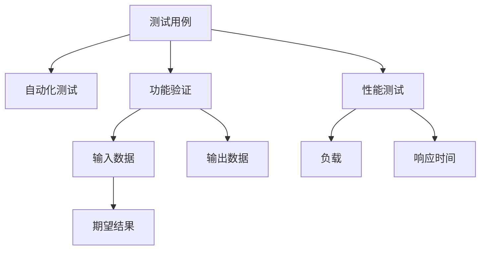

                 

# AI 设计产品测试用例

> 关键词：人工智能，测试用例设计，自动化测试，产品功能验证，性能测试

## 1. 背景介绍

### 1.1 问题由来

在AI产品的开发过程中，测试用例的设计和执行是确保产品质量的重要环节。传统的手工测试不仅耗时耗力，且存在较高的错误率，难以覆盖所有的场景和边界条件。随着AI技术的发展，如何高效、全面地进行AI产品的测试，成为了一个亟待解决的问题。

### 1.2 问题核心关键点

AI产品的测试不仅需要测试其算法和模型的准确性，还需要验证其在实际应用中的性能和可靠性。测试用例的设计和执行需要涵盖算法模型、输入输出、系统稳定性等多个方面，以确保产品的稳定性和可靠性。

### 1.3 问题研究意义

设计科学合理的AI产品测试用例，能够有效提升产品质量，减少开发成本，缩短产品上市时间。通过测试用例的反复验证，可以有效发现并修复潜在的bug和问题，保障产品的稳定性和可靠性。

## 2. 核心概念与联系

### 2.1 核心概念概述

为更好地理解AI产品测试用例的设计，本节将介绍几个密切相关的核心概念：

- **测试用例**：在软件测试中，测试用例是指一组输入数据和对应的期望输出，用于验证系统的功能、性能、稳定性等特性。
- **自动化测试**：指通过工具和脚本，自动执行测试用例，减少人工干预，提高测试效率和覆盖率。
- **人工智能**：涉及机器学习、深度学习、自然语言处理、计算机视觉等技术，通过算法模型实现各种智能功能。
- **性能测试**：指评估系统在负载、压力等条件下的表现，包括响应时间、吞吐量、稳定性和资源利用率等。
- **功能验证**：指通过测试用例验证系统是否实现了预期功能，包括数据处理、算法输出、用户交互等。

这些核心概念之间的逻辑关系可以通过以下Mermaid流程图来展示：



这个流程图展示了一些关键概念之间的逻辑关系：

1. 测试用例是自动化测试和功能验证的基础。
2. 功能验证主要关注输入数据和期望输出的一致性，确保系统按预期工作。
3. 性能测试关注系统在负载和压力条件下的表现，确保系统稳定可靠。

## 3. 核心算法原理 & 具体操作步骤
### 3.1 算法原理概述

AI产品的测试用例设计遵循“覆盖全场景，确保系统稳定”的原则。其核心思想是通过设计全面覆盖各种场景和边界条件的测试用例，验证系统的功能、性能和稳定性。

具体而言，测试用例设计包括以下几个关键步骤：

1. **需求分析**：明确产品需求和功能点，梳理出需要测试的核心功能和边界条件。
2. **设计测试用例**：根据需求和功能点设计测试用例，涵盖不同的输入数据、期望输出和执行路径。
3. **执行测试用例**：通过自动化测试工具，自动执行测试用例，记录测试结果和问题。
4. **分析测试结果**：对测试结果进行分析，发现并修复问题，确保系统稳定和可靠。
5. **持续改进**：根据测试结果和问题反馈，持续改进产品设计和测试方法。

### 3.2 算法步骤详解

下面是AI产品测试用例设计的详细步骤：

**Step 1: 需求分析**

- **梳理需求**：与产品开发团队沟通，梳理出产品的核心需求和功能点。
- **分解功能**：将核心需求拆解为多个子功能，明确每个子功能的具体实现。
- **确定边界条件**：根据功能点，确定各种边界条件和异常情况，如极端输入、异常数据、系统负载等。

**Step 2: 设计测试用例**

- **确定测试目标**：明确每个测试用例的目标，如验证某个功能点、测试系统稳定性、评估性能等。
- **设计测试场景**：根据测试目标，设计不同的测试场景，涵盖各种输入数据和执行路径。
- **编写测试步骤**：对每个测试场景编写详细的测试步骤，明确输入数据、执行路径和期望输出。
- **编写用例文档**：将测试用例和步骤整理成文档，方便后续执行和分析。

**Step 3: 执行测试用例**

- **自动化测试工具**：选择适合的自动化测试工具，如Selenium、JUnit、Robot Framework等。
- **执行测试用例**：根据用例文档，自动执行测试用例，记录测试结果和问题。
- **生成报告**：生成测试报告，记录测试结果、通过率、失败用例等信息。

**Step 4: 分析测试结果**

- **分析测试结果**：对测试结果进行分析，找出失败用例和问题原因。
- **修复问题**：根据问题原因，进行代码修改和功能优化，确保系统稳定和可靠。
- **重复执行**：重复执行测试用例，验证问题是否修复，确保系统稳定性。

**Step 5: 持续改进**

- **反馈和改进**：根据测试结果和问题反馈，持续改进产品设计和测试方法。
- **更新测试用例**：根据产品迭代和新需求，更新和完善测试用例，确保测试覆盖率。
- **优化测试流程**：优化测试流程和方法，提升测试效率和覆盖率。

### 3.3 算法优缺点

AI产品测试用例设计具有以下优点：

1. **全面覆盖**：通过设计全面覆盖各种场景和边界条件的测试用例，确保系统的稳定性和可靠性。
2. **高效执行**：通过自动化测试工具，自动执行测试用例，减少人工干预，提高测试效率和覆盖率。
3. **易于分析**：通过生成详细的测试报告，方便对测试结果进行分析和问题修复。
4. **持续改进**：通过持续改进测试方法和用例，提升测试覆盖率和系统稳定性。

同时，该方法也存在一些局限性：

1. **需求分析难度高**：需求分析和功能点梳理可能面临复杂的沟通和协作问题。
2. **测试场景设计复杂**：设计全面的测试场景和边界条件需要大量的经验和实践。
3. **自动化测试成本高**：选择合适的自动化测试工具和编写测试脚本需要投入大量的时间和资源。
4. **问题定位难度大**：复杂的测试场景和多种执行路径可能导致问题定位困难。

尽管存在这些局限性，但就目前而言，AI产品测试用例设计仍然是最主流和有效的测试方法。未来相关研究的重点在于如何进一步降低测试用例设计和执行的难度，提高测试覆盖率和效率，同时兼顾系统的稳定性和可靠性。

### 3.4 算法应用领域

AI产品测试用例设计广泛应用于各种产品开发场景，如：

- **AI算法模型测试**：测试算法模型的准确性和鲁棒性，验证其在各种数据分布下的性能。
- **智能应用功能验证**：测试智能应用的功能实现，验证其在不同输入数据和场景下的表现。
- **系统稳定性测试**：测试系统的稳定性，验证其在负载和压力条件下的表现。
- **性能测试**：测试系统的性能，验证其在各种负载和压力条件下的表现。
- **安全测试**：测试系统的安全性，验证其在各种攻击和异常情况下的表现。

除了上述这些经典应用外，AI产品测试用例设计还被创新性地应用到更多场景中，如可解释性测试、公平性测试、对抗性测试等，为AI技术的落地应用提供了新的解决方案。

## 4. 数学模型和公式 & 详细讲解 & 举例说明

### 4.1 数学模型构建

本节将使用数学语言对AI产品测试用例的设计进行更加严格的刻画。

记产品功能为 $F$，输入数据为 $X$，输出结果为 $Y$。假设存在一组测试用例 $\{(X_i,Y_i)\}_{i=1}^N$，其中 $X_i$ 为第 $i$ 个测试用例的输入数据，$Y_i$ 为期望输出。

定义测试用例的覆盖率 $C$ 为：

$$
C = \frac{\text{覆盖的输入数据量}}{\text{总输入数据量}}
$$

定义测试用例的通过率 $P$ 为：

$$
P = \frac{\text{通过测试的用例数}}{\text{总测试用例数}}
$$

通过测试用例 $X_i$ 的代价 $C_i$ 为：

$$
C_i = \text{执行时间} \times \text{测试成本}
$$

测试用例集的总代价 $C_{\text{total}}$ 为：

$$
C_{\text{total}} = \sum_{i=1}^N C_i
$$

通过以上模型，可以定量分析测试用例设计的全面性和效率。

### 4.2 公式推导过程

以下我们以AI产品功能验证为例，推导测试用例设计的数学模型。

假设产品功能 $F$ 接受输入数据 $X$，输出结果 $Y$。用例 $U_i$ 包括输入数据 $X_i$、期望输出 $Y_i$ 和执行步骤 $S_i$。测试用例 $T$ 包括多个用例 $U_i$，涵盖不同的输入数据和执行路径。

用例 $U_i$ 的执行代价为 $C_i$，包含测试工具的执行时间 $t_i$ 和测试成本 $c_i$。测试用例 $T$ 的执行代价为：

$$
C_T = \sum_{i=1}^N C_i = \sum_{i=1}^N (t_i \times c_i)
$$

用例 $U_i$ 的覆盖率 $C_i$ 为：

$$
C_i = \frac{\text{覆盖的输入数据量}}{\text{总输入数据量}}
$$

测试用例 $T$ 的覆盖率 $C_T$ 为：

$$
C_T = \sum_{i=1}^N C_i
$$

测试用例 $T$ 的通过率 $P_T$ 为：

$$
P_T = \frac{\text{通过测试的用例数}}{\text{总测试用例数}}
$$

### 4.3 案例分析与讲解

**案例一：图像识别测试用例设计**

假设开发一个图像识别系统，用于识别不同种类的水果。测试用例可以设计为：

- **输入数据**：包含不同种类水果的图像数据。
- **期望输出**：系统能够正确识别不同种类水果的类别。
- **执行步骤**：系统接受输入图像，运行图像识别算法，输出识别结果。

测试用例的覆盖率 $C$ 和通过率 $P$ 可以通过输入数据量和系统识别的正确率来计算。测试用例的执行代价 $C_i$ 可以通过测试工具的执行时间和测试成本来计算。

通过上述模型，可以对测试用例的全面性和效率进行定量分析，从而优化测试用例设计。

## 5. 项目实践：代码实例和详细解释说明

### 5.1 开发环境搭建

在进行测试用例设计前，我们需要准备好开发环境。以下是使用Python进行自动化测试开发的环境配置流程：

1. 安装Anaconda：从官网下载并安装Anaconda，用于创建独立的Python环境。

2. 创建并激活虚拟环境：
```bash
conda create -n pytest-env python=3.8 
conda activate pytest-env
```

3. 安装Pytest：从官网下载并安装Pytest，用于自动化测试用例的编写和执行。
```bash
conda install pytest
```

4. 安装Python的Selenium库和Chrome浏览器：
```bash
pip install selenium
```
```bash
pip install selenium webdriver
```
```bash
pip install chromedriver
```

5. 安装JUnit：从官网下载并安装JUnit，用于编写和执行Java测试用例。
```bash
wget https://junit.org/download/JUnit5.x.x-stable.zip
unzip JUnit5.x.x-stable.zip
mv JUnit5.x.x-stable junit
cd junit
mv lib/*.jar src/test/
mv src/test/resources src/
mv src/test/java src/
```

完成上述步骤后，即可在`pytest-env`环境中开始测试用例开发。

### 5.2 源代码详细实现

下面我们以AI算法模型测试为例，给出使用Pytest进行测试用例开发的PyTorch代码实现。

首先，定义测试用例的基类：

```python
import torch
from torchvision import models

class TestModel:
    def __init__(self, model):
        self.model = model

    def test_model(self):
        # 测试模型的准确性
        pass
```

然后，定义具体的测试用例：

```python
class TestModelAccuracy(TestModel):
    def test_model(self):
        # 加载测试数据
        test_data = ...

        # 计算模型在测试数据上的准确性
        accuracy = ...

        # 断言模型准确性
        assert accuracy > 0.9, "模型准确性未达标"
```

最后，使用Pytest进行测试用例的执行：

```python
if __name__ == '__main__':
    pytest.main(['-v', '-t', 'test_model.py'])
```

以上就是一个完整的基于Pytest的AI算法模型测试用例开发的代码实现。可以看到，Pytest提供了简单的测试用例编写和执行方式，方便开发者进行自动化测试。

### 5.3 代码解读与分析

让我们再详细解读一下关键代码的实现细节：

**TestModel类**：
- `__init__`方法：初始化测试模型，保存测试用例的模型实例。
- `test_model`方法：定义具体的测试步骤，加载测试数据，计算模型在测试数据上的性能，并进行断言验证。

**TestModelAccuracy类**：
- `test_model`方法：具体实现算法模型在测试数据上的准确性测试。

**if __name__ == '__main__'语句**：
- 判断当前文件是否为模块文件，如果是，则执行测试用例的执行命令，启动测试。

## 6. 实际应用场景

### 6.1 智能客服系统

智能客服系统是AI产品在实际应用中的重要场景之一。通过设计科学合理的测试用例，可以全面验证系统在各种场景下的稳定性和可靠性。

具体而言，可以设计如下测试用例：

- **用户咨询场景测试**：测试系统在用户提出不同类型咨询时的表现，验证系统的响应速度和准确性。
- **多轮对话测试**：测试系统在多轮对话中的表现，验证系统的连贯性和上下文理解能力。
- **异常输入测试**：测试系统在面对异常输入（如错误格式、非语言文本）时的表现，验证系统的鲁棒性。
- **系统稳定性测试**：测试系统在高负载和高并发情况下的表现，验证系统的稳定性和性能。

### 6.2 智能推荐系统

智能推荐系统是AI产品的重要应用领域之一，通过设计科学合理的测试用例，可以全面验证系统的推荐效果和稳定性。

具体而言，可以设计如下测试用例：

- **用户行为测试**：测试系统对不同用户行为的推荐效果，验证系统的个性化推荐能力。
- **数据多样性测试**：测试系统对不同数据分布的推荐效果，验证系统的泛化能力。
- **系统稳定性测试**：测试系统在高负载和高并发情况下的表现，验证系统的稳定性和性能。
- **推荐效果评估**：测试系统推荐结果与实际用户行为的一致性，验证系统的推荐效果。

### 6.3 医疗诊断系统

医疗诊断系统是AI产品的重要应用领域之一，通过设计科学合理的测试用例，可以全面验证系统的诊断效果和稳定性。

具体而言，可以设计如下测试用例：

- **病例数据测试**：测试系统对不同病例数据的诊断效果，验证系统的诊断准确性。
- **病历文本测试**：测试系统对病历文本的解析效果，验证系统的文本处理能力。
- **系统稳定性测试**：测试系统在高负载和高并发情况下的表现，验证系统的稳定性和性能。
- **诊断效果评估**：测试系统诊断结果与实际医生诊断的一致性，验证系统的诊断效果。

### 6.4 未来应用展望

随着AI产品测试用例设计的不断完善，未来将在更多领域得到应用，为各行各业带来变革性影响。

在智慧医疗领域，通过设计科学合理的测试用例，可以全面验证医疗诊断系统的诊断效果和稳定性，提高医疗诊断的准确性和可靠性。

在智能教育领域，通过设计科学合理的测试用例，可以全面验证智能教育系统的教学效果和稳定性，提高教学的个性化和精准度。

在智慧城市治理中，通过设计科学合理的测试用例，可以全面验证智慧城市治理系统的运行效果和稳定性，提高城市管理的智能化水平。

此外，在企业生产、社会治理、文娱传媒等众多领域，AI产品测试用例设计也将不断涌现，为经济社会发展注入新的动力。相信随着测试用例设计的不断进步，将全面推动AI技术在各个行业的应用和发展。

## 7. 工具和资源推荐

### 7.1 学习资源推荐

为了帮助开发者系统掌握AI产品测试用例设计的理论基础和实践技巧，这里推荐一些优质的学习资源：

1. **《软件测试用例设计基础》**：详细介绍了测试用例设计的原理和步骤，适合初学者入门。
2. **《测试用例设计与分析》**：讲解了测试用例设计的实际案例和技巧，适合进阶学习。
3. **《自动化测试：Selenium实战》**：详细介绍了Selenium工具的使用方法和实际案例，适合自动化测试的开发者。
4. **《JUnit测试框架教程》**：详细介绍了JUnit的使用方法和实际案例，适合Java开发者。
5. **《Pytest用户手册》**：详细介绍了Pytest的使用方法和实际案例，适合Python开发者。

通过对这些资源的学习实践，相信你一定能够快速掌握AI产品测试用例设计的精髓，并用于解决实际的NLP问题。

### 7.2 开发工具推荐

高效的开发离不开优秀的工具支持。以下是几款用于AI产品测试用例开发的常用工具：

1. **Pytest**：基于Python的开源自动化测试框架，灵活、易用，适合各种规模的测试任务。
2. **JUnit**：Java程序员的自动化测试框架，提供了丰富的断言和测试运行功能。
3. **Selenium**：用于Web应用程序的自动化测试工具，支持多种浏览器和操作系统。
4. **Robot Framework**：开源的自动化测试框架，支持多种测试脚本语言和工具集成。
5. **Jenkins**：开源的持续集成和持续部署工具，支持各种自动化测试和部署流程。

合理利用这些工具，可以显著提升AI产品测试用例开发的效率，加快创新迭代的步伐。

### 7.3 相关论文推荐

AI产品测试用例设计源于学界的持续研究。以下是几篇奠基性的相关论文，推荐阅读：

1. **《软件测试用例设计技术》**：系统介绍了测试用例设计的原理和步骤，提供了丰富的案例和实际应用。
2. **《基于统计模型的测试用例设计方法》**：提出了基于统计模型的测试用例设计方法，提高了测试用例设计的效率和覆盖率。
3. **《自动化测试用例设计》**：详细介绍了自动化测试用例的设计方法，提供了丰富的实际案例和实践技巧。
4. **《基于AI的测试用例生成技术》**：提出了基于AI的测试用例生成技术，通过机器学习生成测试用例，提高了测试用例设计的效率和覆盖率。

这些论文代表了大语言模型微调技术的发展脉络。通过学习这些前沿成果，可以帮助研究者把握学科前进方向，激发更多的创新灵感。

## 8. 总结：未来发展趋势与挑战

### 8.1 总结

本文对AI产品测试用例设计进行了全面系统的介绍。首先阐述了测试用例设计的重要性，明确了测试用例设计的目标和步骤。其次，从原理到实践，详细讲解了测试用例设计的数学模型和实际案例。同时，本文还广泛探讨了测试用例设计在智能客服、智能推荐、医疗诊断等领域的实际应用，展示了测试用例设计的巨大潜力。

通过本文的系统梳理，可以看到，AI产品测试用例设计正在成为AI产品开发的重要环节，极大地提升产品质量和开发效率。未来，伴随AI技术的不断发展，测试用例设计也将更加全面和深入，为AI产品的落地应用提供更坚实的保障。

### 8.2 未来发展趋势

展望未来，AI产品测试用例设计将呈现以下几个发展趋势：

1. **自动化测试水平提升**：随着自动化测试工具的不断发展，测试用例的设计和执行将更加高效和自动化。
2. **测试用例覆盖率提升**：通过引入机器学习和智能推荐技术，测试用例的设计将更加全面和高效。
3. **测试用例设计多样化**：根据不同的应用场景和需求，测试用例的设计将更加灵活和多样化。
4. **测试用例设计智能化**：通过引入AI技术，测试用例的设计将更加智能化和自动化。
5. **测试用例设计可扩展性增强**：测试用例的设计将更加模块化和可扩展，适应不同的测试需求。

这些趋势将进一步提升AI产品的测试覆盖率和测试效率，确保产品的稳定性和可靠性，推动AI技术在各个领域的应用和发展。

### 8.3 面临的挑战

尽管AI产品测试用例设计已经取得了一定的进展，但在迈向更加智能化、普适化应用的过程中，它仍面临着诸多挑战：

1. **测试用例设计复杂度增加**：随着AI产品的复杂度增加，测试用例的设计将变得更加复杂和困难。
2. **自动化测试工具局限性**：现有的自动化测试工具可能无法完全满足AI产品的测试需求，需要开发新的测试工具和框架。
3. **测试用例设计成本高**：设计全面的测试用例需要投入大量的时间和资源，测试成本较高。
4. **测试用例设计难度大**：设计科学合理的测试用例需要丰富的经验和实践，存在一定的难度和挑战。
5. **测试用例设计一致性差**：不同的开发人员可能对测试用例的设计标准和执行方法存在不同的理解和执行，导致测试用例设计的一致性较差。

这些挑战需要通过持续的技术创新和实践积累，不断优化测试用例设计方法和工具，提升测试覆盖率和效率，确保产品的稳定性和可靠性。

### 8.4 研究展望

未来的研究需要在以下几个方面寻求新的突破：

1. **引入AI技术**：通过引入AI技术，实现测试用例的自动化设计和执行，提升测试效率和覆盖率。
2. **引入智能推荐技术**：通过引入智能推荐技术，生成科学合理的测试用例，提高测试用例设计的效率和覆盖率。
3. **引入机器学习技术**：通过引入机器学习技术，实现测试用例的智能化生成和优化，提高测试用例设计的效率和覆盖率。
4. **引入可扩展性设计**：设计模块化和可扩展的测试用例框架，适应不同的测试需求和场景。
5. **引入自动化测试工具**：开发新的自动化测试工具和框架，满足不同类型和规模的AI产品的测试需求。

这些研究方向将引领AI产品测试用例设计的不断进步，为AI技术的落地应用提供更坚实的保障。总之，AI产品测试用例设计需要持续的技术创新和实践积累，不断优化测试用例设计方法和工具，提升测试覆盖率和效率，确保产品的稳定性和可靠性。面向未来，AI产品测试用例设计将面临更多的挑战和机遇，需要更多的技术创新和实践积累，才能更好地推动AI技术在各个领域的应用和发展。

## 9. 附录：常见问题与解答

**Q1：测试用例设计的核心原则是什么？**

A: 测试用例设计的核心原则是“全面覆盖，确保系统稳定”。具体而言，需要涵盖不同的输入数据、执行路径和期望输出，确保测试用例能够全面覆盖系统的各种场景和边界条件，从而验证系统的功能、性能和稳定性。

**Q2：如何设计高效且全面的测试用例？**

A: 设计高效且全面的测试用例需要遵循以下几个步骤：
1. 梳理需求和功能点，明确测试目标。
2. 设计涵盖各种输入数据和执行路径的测试场景。
3. 编写详细的测试步骤，明确输入数据、执行路径和期望输出。
4. 生成测试报告，记录测试结果和问题。
5. 根据测试结果和问题反馈，持续改进测试用例。

**Q3：测试用例设计对AI产品的影响是什么？**

A: 科学合理的测试用例设计能够全面验证AI产品的功能和稳定性，确保其符合预期，提高产品质量和用户满意度。同时，测试用例设计还能发现和修复潜在问题，避免不良后果，提升系统的可靠性和安全性。

**Q4：如何选择适合的测试用例设计工具？**

A: 选择适合的测试用例设计工具需要考虑以下几个因素：
1. 工具的易用性和灵活性，是否支持多种测试框架和语言。
2. 工具的执行效率和覆盖率，是否能满足实际测试需求。
3. 工具的可扩展性和可维护性，是否能适应不同规模和类型的测试任务。
4. 工具的自动化程度，是否能自动化设计和执行测试用例。

通过综合考虑以上因素，选择适合的测试用例设计工具，可以有效提升测试效率和覆盖率，确保产品的稳定性和可靠性。

---

作者：禅与计算机程序设计艺术 / Zen and the Art of Computer Programming

