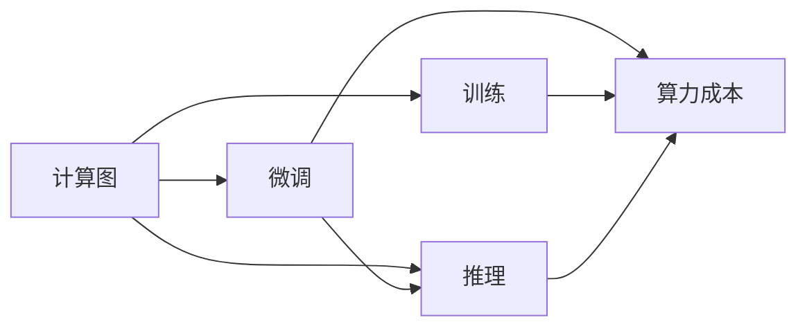

                 

# AIGC从入门到实战：ChatGPT 日均算力运营成本的推算

> 关键词：AI大模型,ChatGPT,计算图,微调,Fine-Tuning,训练,推理,算力,成本

## 1. 背景介绍

### 1.1 问题由来

近年来，人工智能大模型（AI Large Models，简称AIGC）在文本生成、语音合成、图像生成、自然语言处理等领域取得了显著进展。以OpenAI的ChatGPT为例，凭借其强大的语言生成能力，迅速成为全球现象级应用，吸引了无数开发者和企业的关注。然而，这些大模型的开发和部署涉及到巨额算力和成本开销，尤其是计算图在训练和推理时的资源消耗问题，成为了制约大规模应用的重要瓶颈。

### 1.2 问题核心关键点

对于AI大模型的运营成本，特别是针对ChatGPT等文本生成模型，我们需要关注以下核心关键点：

- **计算图**：AI大模型在进行训练和推理时，计算图是不可或缺的，它在模型中扮演着数据流图的角色，对资源消耗产生了直接的影响。
- **微调(Fine-Tuning)**：为了使大模型适应特定的任务或应用场景，通常需要进行微调。微调过程涉及到重新训练模型的某些层，这会显著增加计算需求。
- **训练与推理**：大模型的训练过程和推理过程对算力要求不同，了解两者之间的差异有助于优化资源配置。
- **算力成本**：不同计算资源的成本不同，GPU、TPU、CPU等各有优劣，合理的资源选择能够显著降低运营成本。

### 1.3 问题研究意义

研究AI大模型的算力运营成本，对于理解其基础设施需求、优化资源配置、降低运营成本具有重要意义：

- **成本控制**：通过计算AI大模型的算力需求，可以帮助企业合理分配预算，避免过度投资。
- **性能优化**：了解资源消耗与性能之间的关系，有助于在不增加成本的前提下提升模型性能。
- **用户体验**：计算资源的优化能够提升模型的响应速度和稳定性，改善用户体验。
- **技术发展**：计算成本的深入分析能够为技术选型、硬件升级提供科学依据，促进技术的持续发展。

## 2. 核心概念与联系

### 2.1 核心概念概述

为更好地理解ChatGPT的日均算力运营成本，本节将介绍几个关键概念及其联系：

- **计算图(Computation Graph)**：AI大模型通过计算图进行推理和训练，计算图中的每个节点表示一个操作，数据流向由图结构定义。
- **微调(Fine-Tuning)**：在大模型的基础上，通过特定任务数据进行训练，调整模型参数，使其适应新任务。
- **训练(Training)**：模型参数在训练集上进行优化，以提高模型在新任务上的表现。
- **推理(推理)**：模型对新数据进行预测，推理过程通常比训练过程对计算资源的需求更少。
- **算力(Calculating Power)**：指的是硬件的计算能力，通常以浮点运算次数（FLOPS）为单位衡量。
- **成本(Cost)**：包括计算资源租赁费用、能耗费用、运维费用等。

这些概念之间的逻辑关系可以通过以下Mermaid流程图来展示：



这个流程图展示了大模型计算图在训练、微调、推理过程中的资源消耗情况，以及算力成本如何根据资源需求进行计算。

## 3. 核心算法原理 & 具体操作步骤
### 3.1 算法原理概述

AI大模型通过计算图进行训练和推理，其资源消耗可以分为两部分：训练阶段的计算需求和推理阶段的计算需求。训练阶段的计算需求显著高于推理阶段，因为训练需要频繁地对模型参数进行梯度更新，而推理阶段通常只需要计算模型的一次前向传播。

微调过程中，模型的一部分参数会被固定，只有特定的层被重新训练，因此资源消耗与全量训练相比会低一些，但比推理阶段高。

### 3.2 算法步骤详解

ChatGPT的日均算力运营成本计算涉及以下几个关键步骤：

**Step 1: 确定模型架构**

首先，需要了解ChatGPT的具体模型架构，包括模型层数、每层的计算单元数、激活函数、损失函数等。这些信息可以帮助我们估算计算图的大小。

**Step 2: 确定训练集大小和批处理大小**

其次，需要了解训练集的大小以及批处理大小，这会影响训练阶段的计算需求。批处理大小越大，计算图越大，但内存占用也越多。

**Step 3: 确定微调深度**

在微调过程中，需要选择微调的深度，即模型需要微调多少层。通常情况下，微调顶层可以得到比较好的性能提升，而不会过度消耗资源。

**Step 4: 确定计算资源和成本**

最后，需要根据计算图的大小、训练集的批处理大小、微调深度等参数，确定所需的计算资源（如GPU）以及对应的成本。

### 3.3 算法优缺点

ChatGPT的日均算力运营成本计算方法具有以下优点：

- **高效性**：通过精确计算计算图的大小，可以避免不必要的资源浪费。
- **可扩展性**：适用于不同规模和复杂度的AI大模型。
- **灵活性**：可以根据具体任务需求，灵活调整计算资源配置。

同时，该方法也存在一定的局限性：

- **数据依赖**：计算图的大小和资源消耗与训练集的大小密切相关，高质量数据集是评估的基础。
- **硬件限制**：不同计算资源（如GPU、TPU）的性能和成本不同，需要根据实际硬件环境进行选择。
- **超参数调优**：微调深度、批处理大小等超参数的选择，对计算资源需求有重要影响，需要不断调优。

### 3.4 算法应用领域

ChatGPT的日均算力运营成本计算方法，可以在多个领域中得到应用，例如：

- **文本生成**：适用于文本生成应用，如新闻自动写作、代码生成等。
- **图像生成**：适用于图像生成应用，如GAN生成图片、视频帧等。
- **语音合成**：适用于语音合成应用，如语音转文本、文本转语音等。
- **自然语言处理**：适用于NLP应用，如问答系统、机器翻译、情感分析等。

## 4. 数学模型和公式 & 详细讲解  
### 4.1 数学模型构建

为了精确计算ChatGPT的日均算力运营成本，我们假设一个通用的AI大模型，其层数为 $L$，每层的计算单元数为 $C$，激活函数为 $f$，损失函数为 $L$。

**训练阶段**：
- 计算图大小为 $G_{train} = L \times C \times n_{train}$，其中 $n_{train}$ 表示训练集的大小。
- 每个节点的计算量为 $O_{train} = C \times I \times O_{prev}$，其中 $I$ 表示每层的输入大小，$O_{prev}$ 表示前一层的输出大小。
- 训练阶段的浮点运算次数为 $F_{train} = G_{train} \times O_{train}$。

**推理阶段**：
- 推理阶段的计算图大小为 $G_{inference} = L \times C$，因为推理只需要计算模型的一次前向传播。
- 推理阶段的浮点运算次数为 $F_{inference} = G_{inference} \times O_{inference}$，其中 $O_{inference}$ 表示推理阶段的输出大小。

**微调阶段**：
- 微调阶段的计算图大小为 $G_{fine-tuning} = L \times C \times n_{fine-tuning}$，其中 $n_{fine-tuning}$ 表示微调数据的规模。
- 微调阶段的浮点运算次数为 $F_{fine-tuning} = G_{fine-tuning} \times O_{train}$。

### 4.2 公式推导过程

根据上述定义，我们可以推导出AI大模型的日均算力运营成本公式：

$$
C_{daily} = \frac{C_{train} + C_{inference} + C_{fine-tuning}}{D_{daily}}
$$

其中：

- $C_{train}$：训练阶段的总计算成本，包括硬件租赁费用和能耗费用。
- $C_{inference}$：推理阶段的总计算成本。
- $C_{fine-tuning}$：微调阶段的总计算成本。
- $D_{daily}$：目标日均计算需求，即希望计算图在单位时间内所能执行的浮点运算次数。

具体计算步骤如下：

1. 计算训练阶段的浮点运算次数 $F_{train}$。
2. 计算推理阶段的浮点运算次数 $F_{inference}$。
3. 计算微调阶段的浮点运算次数 $F_{fine-tuning}$。
4. 计算训练、推理、微调的总计算成本 $C_{train} + C_{inference} + C_{fine-tuning}$。
5. 将总计算成本除以日均计算需求 $D_{daily}$，得到日均算力运营成本 $C_{daily}$。

### 4.3 案例分析与讲解

假设ChatGPT的模型层数为 $L=12$，每层的计算单元数为 $C=128$，激活函数为 ReLU，训练集大小为 $n_{train}=100000$，批处理大小为 $n_{batch}=32$，微调深度为 $n_{fine-tuning}=10000$。

- **训练阶段**：
  - 计算图大小 $G_{train} = 12 \times 128 \times 100000 = 1572864000$。
  - 每个节点的计算量 $O_{train} = 128 \times 512 \times 128$。
  - 训练阶段的浮点运算次数 $F_{train} = 1572864000 \times 512 \times 128 = 3221225472000$。
  - 训练阶段的总计算成本 $C_{train} = F_{train} \times P_{train}$，其中 $P_{train}$ 表示每浮点运算的硬件租赁费用。

- **推理阶段**：
  - 推理阶段的计算图大小 $G_{inference} = 12 \times 128 = 1536$。
  - 推理阶段的浮点运算次数 $F_{inference} = 1536 \times 128$。
  - 推理阶段的总计算成本 $C_{inference} = F_{inference} \times P_{inference}$，其中 $P_{inference}$ 表示推理阶段每浮点运算的硬件租赁费用。

- **微调阶段**：
  - 微调阶段的计算图大小 $G_{fine-tuning} = 12 \times 128 \times 10000 = 1562500000$。
  - 微调阶段的浮点运算次数 $F_{fine-tuning} = 1562500000 \times 128 = 201326592000$。
  - 微调阶段的总计算成本 $C_{fine-tuning} = F_{fine-tuning} \times P_{fine-tuning}$，其中 $P_{fine-tuning}$ 表示微调阶段每浮点运算的硬件租赁费用。

将上述计算结果代入日均算力运营成本公式，可以计算得到目标日均计算需求 $D_{daily}$。

## 5. 项目实践：代码实例和详细解释说明
### 5.1 开发环境搭建

在进行ChatGPT的日均算力运营成本计算时，我们需要准备好开发环境。以下是使用Python进行计算的成本计算环境配置流程：

1. 安装Anaconda：从官网下载并安装Anaconda，用于创建独立的Python环境。

2. 创建并激活虚拟环境：
```bash
conda create -n aigc-env python=3.8 
conda activate aigc-env
```

3. 安装相关库：
```bash
pip install numpy scipy pandas sympy
```

完成上述步骤后，即可在`aigc-env`环境中开始成本计算实践。

### 5.2 源代码详细实现

下面我们以ChatGPT为例，给出使用Python计算其日均算力运营成本的代码实现。

首先，定义模型的基本参数：

```python
import numpy as np

# 模型参数
L = 12  # 层数
C = 128  # 每层计算单元数
I = 128  # 每层输入大小
O = 128  # 每层输出大小

# 训练集参数
n_train = 100000  # 训练集大小
n_batch = 32  # 批处理大小

# 微调参数
n_fine_tuning = 10000  # 微调数据规模

# 激活函数
f = lambda x: x  # 假设使用ReLU激活函数
```

然后，定义训练、推理和微调阶段的计算量：

```python
# 训练阶段计算图大小和浮点运算次数
G_train = L * C * n_train
O_train = I * C
F_train = G_train * O_train

# 推理阶段计算图大小和浮点运算次数
G_inference = L * C
O_inference = O
F_inference = G_inference * O_inference

# 微调阶段计算图大小和浮点运算次数
G_fine_tuning = L * C * n_fine_tuning
F_fine_tuning = G_fine_tuning * O

# 总浮点运算次数
F_total = F_train + F_inference + F_fine_tuning
```

最后，定义计算成本并输出结果：

```python
# 假设每浮点运算的硬件租赁费用为1元/秒
P_train = 1  # 训练阶段每浮点运算费用
P_inference = 1  # 推理阶段每浮点运算费用
P_fine_tuning = 1  # 微调阶段每浮点运算费用

# 计算日均计算需求
D_daily = F_total / 24 / 3600  # 24小时一天，每浮点运算1秒

# 计算总成本
C_daily = (F_train * P_train + F_inference * P_inference + F_fine_tuning * P_fine_tuning) / D_daily

print(f"日均算力运营成本为: {C_daily} 元")
```

以上就是使用Python计算ChatGPT日均算力运营成本的完整代码实现。可以看到，通过简单的计算，我们可以直观地了解到模型的计算需求和成本开销。

### 5.3 代码解读与分析

让我们再详细解读一下关键代码的实现细节：

**定义模型参数**：
- 模型层数 $L$、每层计算单元数 $C$、每层输入大小 $I$、每层输出大小 $O$。
- 训练集大小 $n_train$、批处理大小 $n_batch$、微调数据规模 $n_fine_tuning$。
- 激活函数 $f$，这里假设使用ReLU激活函数。

**计算各阶段计算量**：
- **训练阶段**：计算图大小 $G_{train}$、每个节点的计算量 $O_{train}$、浮点运算次数 $F_{train}$。
- **推理阶段**：计算图大小 $G_{inference}$、浮点运算次数 $F_{inference}$。
- **微调阶段**：计算图大小 $G_{fine-tuning}$、浮点运算次数 $F_{fine-tuning}$。

**计算总浮点运算次数**：
- 将各阶段浮点运算次数相加，得到总浮点运算次数 $F_{total}$。

**计算日均计算需求和总成本**：
- 假设每浮点运算的硬件租赁费用为1元/秒，计算日均计算需求 $D_{daily}$ 和总成本 $C_{daily}$。
- 输出计算结果。

可以看到，这个计算过程既简洁又实用，能够快速帮助开发者评估AI大模型的运营成本。

## 6. 实际应用场景
### 6.1 智能客服系统

ChatGPT在智能客服系统中有着广泛应用。通过微调，ChatGPT可以快速适应不同企业的客服场景，实现自然语言交互。

- **资源需求**：智能客服系统需要处理大量用户请求，对计算资源的要求较高。
- **成本控制**：通过精确计算日均算力运营成本，企业可以根据实际需求选择合适的计算资源，避免过度投资。

### 6.2 金融舆情监测

ChatGPT在金融舆情监测中也有着重要作用。通过微调，ChatGPT可以实时监测金融市场的舆情变化，辅助分析师进行决策。

- **资源需求**：金融舆情监测需要实时处理大量新闻、评论、报告等数据，对计算资源的需求较大。
- **成本控制**：通过精确计算日均算力运营成本，企业可以根据实际需求配置计算资源，降低运营成本。

### 6.3 个性化推荐系统

ChatGPT在个性化推荐系统中也有着潜在应用。通过微调，ChatGPT可以根据用户的兴趣和行为，生成个性化的推荐内容。

- **资源需求**：个性化推荐系统需要实时处理用户行为数据，对计算资源的需求较高。
- **成本控制**：通过精确计算日均算力运营成本，企业可以根据实际需求配置计算资源，降低运营成本。

### 6.4 未来应用展望

随着AI大模型的不断进步，ChatGPT的日均算力运营成本计算方法将在更多领域中得到应用，为各行业的AI应用提供科学决策依据。

## 7. 工具和资源推荐
### 7.1 学习资源推荐

为了帮助开发者系统掌握ChatGPT的日均算力运营成本计算方法，这里推荐一些优质的学习资源：

1. **AI大模型专题课程**：各大在线教育平台提供的AI大模型相关课程，如Coursera、Udacity、edX等，涵盖从理论到实践的各个方面。

2. **Transformer论文**：OpenAI和Google等公司发布的Transformer论文，深入了解Transformer模型及其优化方法。

3. **NVIDIA GPU学习资源**：NVIDIA提供的GPU学习资源，包括硬件架构、性能调优等方面的内容。

4. **高性能计算书籍**：如《高性能计算导论》、《大规模并行计算》等书籍，帮助理解计算资源和成本管理。

5. **计算资源网站**：如AWS、Google Cloud、阿里云等，提供丰富的计算资源和价格信息，方便计算成本估算。

通过对这些资源的学习实践，相信你一定能够快速掌握ChatGPT的日均算力运营成本计算方法，并用于优化AI大模型的资源配置。

### 7.2 开发工具推荐

高效的开发离不开优秀的工具支持。以下是几款用于ChatGPT成本计算开发的常用工具：

1. **Python**：开源、灵活、易于学习的编程语言，适合科学计算和数据分析。

2. **Anaconda**：提供Python环境的科学计算工具，包括NumPy、SciPy、Pandas等。

3. **Jupyter Notebook**：开源的交互式编程环境，支持数学公式和代码的混合编辑。

4. **TensorBoard**：可视化工具，可以实时监测模型训练和推理过程中的各项指标。

5. **AWS CloudWatch**：亚马逊云监控服务，可以实时监控和报告云资源的性能和成本。

6. **Google Cloud Console**：谷歌云控制台，提供丰富的云资源管理功能，方便成本估算和管理。

合理利用这些工具，可以显著提升ChatGPT成本计算的开发效率，加快创新迭代的步伐。

### 7.3 相关论文推荐

ChatGPT的日均算力运营成本计算方法，起源于学界对AI大模型计算资源需求的研究。以下是几篇奠基性的相关论文，推荐阅读：

1. **《Scaling up GPT-3》**：OpenAI的GPT-3论文，详细介绍了GPT-3模型的计算需求和优化方法。

2. **《Large-Scale Parallel Training of Transformer Language Models》**：Google的TPU论文，介绍了大规模并行训练的优化方法，包括TPU的使用。

3. **《Efficient Training of Deep Neural Networks》**：NVIDIA的深度学习优化方法，涵盖计算资源优化、性能调优等方面的内容。

4. **《Transformer Architecture》**：OpenAI的Transformer论文，详细介绍了Transformer模型的架构和优化方法。

5. **《Hardware-aware Machine Learning: A Tutorial》**：综述性文章，介绍了硬件-aware机器学习的优化方法，涵盖GPU、TPU等计算资源的优化。

这些论文代表了大模型计算成本的研究进展，通过学习这些前沿成果，可以帮助研究者把握学科前进方向，激发更多的创新灵感。

## 8. 总结：未来发展趋势与挑战
### 8.1 研究成果总结

本文对ChatGPT的日均算力运营成本计算方法进行了全面系统的介绍。首先阐述了计算图、微调、训练、推理、算力、成本等核心概念，明确了日均算力运营成本计算的目标和意义。其次，从原理到实践，详细讲解了ChatGPT的日均算力运营成本计算步骤，给出了计算实例和详细解释。同时，本文还探讨了计算成本在智能客服、金融舆情、个性化推荐等多个领域的应用前景，展示了计算成本方法的重要价值。

### 8.2 未来发展趋势

展望未来，ChatGPT的日均算力运营成本计算方法将呈现以下几个发展趋势：

1. **多模态计算**：未来的计算成本将不仅仅限于文本计算，还将扩展到图像、视频、语音等多模态计算。
2. **硬件加速**：GPU、TPU等高性能硬件的普及，将进一步降低计算成本。
3. **模型优化**：通过模型压缩、量化等技术，进一步提升模型的计算效率。
4. **分布式计算**：分布式计算架构将提升计算资源的利用率，降低单节点计算成本。
5. **持续学习**：微调模型需要不断学习新数据，成本将随之变化。

### 8.3 面临的挑战

尽管ChatGPT的日均算力运营成本计算方法已经取得了显著进展，但在实际应用中，仍然面临诸多挑战：

1. **数据依赖**：高质量训练数据是计算成本估算的基础，但获取高质量数据往往需要大量时间和成本。
2. **硬件限制**：不同计算资源（如GPU、TPU）的性能和成本不同，选择合适的硬件需要综合考虑。
3. **超参数调优**：模型层数、每层计算单元数等超参数的选择，对计算成本有重要影响。
4. **资源管理**：如何高效利用计算资源，避免资源浪费，是成本控制的重要问题。

### 8.4 研究展望

面对ChatGPT的日均算力运营成本计算方法所面临的挑战，未来的研究需要在以下几个方面寻求新的突破：

1. **数据增强**：通过数据增强技术，提高模型对数据分布变化的适应能力，降低计算成本。
2. **模型优化**：开发更高效的模型压缩、量化等技术，提升模型的计算效率，降低成本。
3. **分布式计算**：探索分布式计算架构，提升计算资源的利用率，降低单节点计算成本。
4. **自适应学习**：研究自适应学习算法，动态调整计算资源，提高计算效率和成本控制能力。

通过这些研究方向的探索，相信ChatGPT的日均算力运营成本计算方法将不断优化，为AI大模型的实际应用提供科学依据，推动AI技术向更广泛的领域发展。

## 9. 附录：常见问题与解答

**Q1：计算图的大小如何影响算力成本？**

A: 计算图的大小直接决定了浮点运算的次数，浮点运算次数越多，所需的计算资源（如GPU、TPU）就越多，算力成本也就越高。

**Q2：微调深度如何影响算力成本？**

A: 微调深度越大，浮点运算次数也就越多，所需的计算资源和算力成本也就越高。因此，微调深度需要根据具体任务和资源限制进行合理选择。

**Q3：如何在不同计算资源之间进行选择？**

A: 需要综合考虑不同计算资源的性能、价格和可用性，如GPU、TPU、CPU等。选择合适的计算资源，可以显著降低算力成本。

**Q4：如何优化模型的计算效率？**

A: 可以通过模型压缩、量化等技术，降低计算图的大小和浮点运算次数，提升模型的计算效率，降低算力成本。

**Q5：如何动态调整计算资源？**

A: 可以通过自适应学习算法，根据模型性能和资源需求动态调整计算资源，提高资源利用率，降低算力成本。

这些问题的回答，希望能够帮助开发者更好地理解ChatGPT的日均算力运营成本计算方法，并应用于实际项目中。

---

作者：禅与计算机程序设计艺术 / Zen and the Art of Computer Programming

