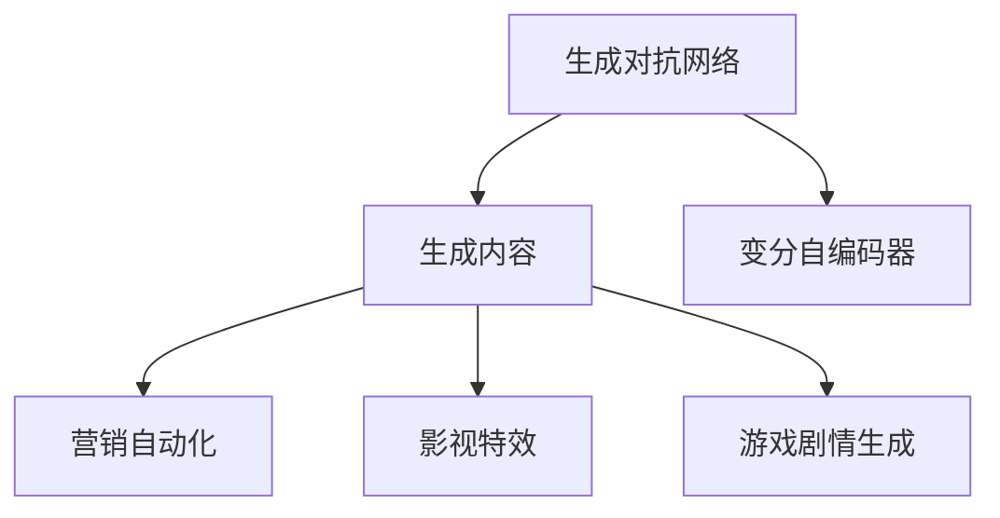

                 

# AIGC在营销、影视创作和游戏中的应用

> 关键词：生成对抗网络(GAN)、变分自编码器(VAE)、对抗训练、内容生成、营销自动化、影视特效、游戏剧情生成

## 1. 背景介绍

### 1.1 问题由来
随着人工智能技术的不断成熟，生成对抗网络（Generative Adversarial Networks，GAN）和变分自编码器（Variational Autoencoder，VAE）等生成模型已经在图像、音频、文本等多个领域展现出强大的生成能力。这些技术在内容创作、娱乐、广告等多个行业得到广泛应用，特别是在营销、影视创作和游戏等领域，AIGC技术正在改变传统的生产模式和消费体验。

### 1.2 问题核心关键点
AIGC技术通过训练生成模型，可以实现高质量的图像、音频、文本等内容的自动生成。相较于传统的基于规则的自动化工具，AIGC能够生成更具创造性和多样性的内容，从而提升用户的参与度和满意度。然而，AIGC技术在实际应用中也面临一些挑战，如训练成本高、生成内容质量不稳定、内容版权问题等。因此，如何有效地使用AIGC技术，成为各行业关注的焦点。

### 1.3 问题研究意义
AIGC技术在营销、影视创作和游戏中的应用，可以显著提升内容创意和生产效率，降低制作成本，提高用户体验。通过对AIGC技术的深入研究，可以为这些行业提供更高效、更个性化的解决方案，推动产业升级和创新。

## 2. 核心概念与联系

### 2.1 核心概念概述

为更好地理解AIGC技术在营销、影视创作和游戏中的应用，本节将介绍几个密切相关的核心概念：

- 生成对抗网络（GAN）：一种通过对抗训练方式生成高质量图像、音频、文本等内容的生成模型。
- 变分自编码器（VAE）：一种通过编码器-解码器框架，学习数据分布并实现高效内容生成的方法。
- 对抗训练（Adversarial Training）：通过生成模型和判别模型之间的对抗训练，提升生成内容的真实性和多样性。
- 内容生成（Content Generation）：使用AIGC技术自动生成的图像、音频、文本等内容。
- 营销自动化（Marketing Automation）：利用AIGC技术自动生成营销内容，提高营销效果和效率。
- 影视特效（Film Effects）：在影视制作中，使用AIGC技术自动生成特效场景和角色，提升制作质量。
- 游戏剧情生成（Game Plot Generation）：通过AIGC技术自动生成游戏剧情和对话，提升游戏体验和可玩性。

这些核心概念之间的逻辑关系可以通过以下Mermaid流程图来展示：



这个流程图展示了大语言模型的核心概念及其之间的关系：

1. 生成对抗网络通过对抗训练生成高质量内容。
2. 变分自编码器学习数据分布，实现高效内容生成。
3. 生成的内容可以应用于营销自动化、影视特效和游戏剧情生成等场景。

## 3. 核心算法原理 & 具体操作步骤
### 3.1 算法原理概述

AIGC技术在营销、影视创作和游戏中的应用，主要基于生成对抗网络（GAN）和变分自编码器（VAE）等生成模型。其核心思想是：通过训练生成模型，使其能够生成符合特定分布或要求的图像、音频、文本等高质量内容。

具体而言，GAN和VAE通过优化生成模型和判别模型之间的对抗关系，最大化生成内容的真实性和多样性。其中，GAN通过两个神经网络相互博弈的方式生成内容，而VAE通过编码器和解码器的组合实现内容的生成和重构。

### 3.2 算法步骤详解

#### 3.2.1 GAN算法步骤

1. 初始化生成器和判别器：生成器 $G$ 和判别器 $D$ 分别为生成器和判别器提供随机噪声作为输入，输出生成内容。
2. 对抗训练：通过多次迭代，调整生成器和判别器的权重，使生成器能够生成更逼真的内容，判别器能够更好地区分生成内容和真实内容。
3. 生成内容：在训练完成后，使用生成器 $G$ 生成高质量的图像、音频、文本等内容。

#### 3.2.2 VAE算法步骤

1. 编码器训练：将输入数据编码为低维特征向量 $z$。
2. 生成器训练：通过解码器将低维特征向量 $z$ 解码为生成内容。
3. 重构损失：计算生成内容与原始内容之间的重构损失，优化生成器。
4. 隐变量分布：学习生成内容的隐变量分布，优化编码器。

### 3.3 算法优缺点

AIGC技术在营销、影视创作和游戏中的应用具有以下优点：

- 高创造性：通过生成模型自动生成内容，提供更具创意和多样性的解决方案。
- 高效性：使用AIGC技术可以显著提高内容生产效率，降低人力和时间成本。
- 广泛适用性：适用于图像、音频、文本等多种类型的生成任务，具有较强的泛化能力。

同时，AIGC技术也存在一些局限性：

- 生成内容质量不稳定：生成器容易过拟合，生成的内容质量不稳定。
- 训练成本高：训练过程需要大量的计算资源和标注数据。
- 版权问题：生成内容可能存在版权侵权的风险。
- 可解释性不足：生成模型缺乏可解释性，难以理解生成内容的决策过程。

尽管存在这些局限性，但AIGC技术在内容创作、娱乐和广告等领域展现出强大的应用潜力，成为推动各行业发展的重要工具。

### 3.4 算法应用领域

AIGC技术在营销、影视创作和游戏等多个领域得到了广泛应用：

- 营销自动化：使用生成对抗网络自动生成营销海报、广告文案等，提升广告效果和投放效率。
- 影视特效：在电影制作中，使用生成模型自动生成复杂的特效场景和角色，提升视觉效果和制作效率。
- 游戏剧情生成：通过生成模型自动生成游戏剧情和对话，提升游戏的可玩性和创意性。
- 内容创作：自动生成新闻报道、社交媒体内容、博客文章等，提升内容创作效率和多样性。

除了上述这些常见应用外，AIGC技术还被创新性地应用于虚拟现实（VR）、增强现实（AR）、艺术创作等领域，为人类提供更丰富、更个性化的体验。

## 4. 数学模型和公式 & 详细讲解  
### 4.1 数学模型构建

AIGC技术的数学模型构建涉及生成对抗网络（GAN）和变分自编码器（VAE）两部分内容。以下分别介绍这两部分模型的构建方法。

#### 4.1.1 GAN模型构建

GAN模型由生成器 $G$ 和判别器 $D$ 两部分组成，其数学模型如下：

- 生成器 $G$：将随机噪声 $z$ 作为输入，输出生成内容 $x$。
- 判别器 $D$：输入真实内容 $x$ 和生成内容 $G(z)$，输出判别结果 $y$。

GAN模型的损失函数为：

$$
\mathcal{L} = E_{x \sim p_{data}(x)}[\log D(x)] + E_{z \sim p(z)}[\log(1-D(G(z)))]
$$

其中，$E_{x \sim p_{data}(x)}[\cdot]$ 表示对真实数据集的期望，$E_{z \sim p(z)}[\cdot]$ 表示对噪声分布的期望。

#### 4.1.2 VAE模型构建

VAE模型由编码器 $E$ 和解码器 $D$ 两部分组成，其数学模型如下：

- 编码器 $E$：将输入数据 $x$ 编码为低维特征向量 $z$。
- 解码器 $D$：将低维特征向量 $z$ 解码为生成内容 $x'$。

VAE模型的损失函数为：

$$
\mathcal{L} = \mathbb{E}_{x \sim p_{data}(x)}[\log p_{model}(x)] + KL(p(z)||q(z))
$$

其中，$\log p_{model}(x)$ 表示生成内容的概率分布，$KL(p(z)||q(z))$ 表示编码器输出的隐变量分布与解码器输出的隐变量分布之间的KL散度。

### 4.2 公式推导过程

#### 4.2.1 GAN公式推导

GAN模型的训练过程涉及生成器和判别器之间的对抗训练。以下推导生成器和判别器的损失函数：

生成器的损失函数为：

$$
\mathcal{L}_G = -E_{z \sim p(z)}[\log D(G(z))]
$$

判别器的损失函数为：

$$
\mathcal{L}_D = E_{x \sim p_{data}(x)}[\log D(x)] + E_{z \sim p(z)}[\log(1-D(G(z))))
$$

通过交替优化生成器和判别器，使得生成器能够生成更逼真的内容，判别器能够更好地区分生成内容和真实内容。

#### 4.2.2 VAE公式推导

VAE模型的训练过程涉及编码器和解码器之间的联合优化。以下推导编码器和解码器的损失函数：

编码器的损失函数为：

$$
\mathcal{L}_E = -\mathbb{E}_{x \sim p_{data}(x)}[\log p_{model}(x)] - \mathbb{E}_{z \sim q(z|x)}[\log p(z)]
$$

解码器的损失函数为：

$$
\mathcal{L}_D = -\mathbb{E}_{x \sim p_{data}(x)}[\log p_{model}(x)] - KL(p(z)||q(z|x))
$$

其中，$p_{model}(x)$ 表示生成内容的概率分布，$q(z|x)$ 表示编码器输出的隐变量分布，$p(z)$ 表示隐变量分布的先验分布。

### 4.3 案例分析与讲解

#### 4.3.1 GAN案例分析

GAN在图像生成中的应用最为广泛。以下以GAN生成手写数字为例，展示其具体实现过程：

- 构建生成器和判别器：使用卷积神经网络（CNN）作为生成器和判别器，输入为随机噪声，输出为图像。
- 对抗训练：在每轮训练中，生成器尝试生成逼真的手写数字，判别器尝试区分真实手写数字和生成手写数字。
- 生成内容：在训练完成后，使用生成器生成高质量的手写数字图像。

#### 4.3.2 VAE案例分析

VAE在图像生成中的应用也较为常见。以下以VAE生成手写数字为例，展示其具体实现过程：

- 构建编码器和解码器：使用CNN作为编码器和解码器，输入为手写数字图像，输出为低维特征向量和生成手写数字图像。
- 重构损失：计算生成手写数字图像与原始手写数字图像之间的重构损失，优化解码器。
- 隐变量分布：学习生成手写数字图像的隐变量分布，优化编码器。

## 5. 项目实践：代码实例和详细解释说明
### 5.1 开发环境搭建

在进行AIGC技术实践前，我们需要准备好开发环境。以下是使用Python进行TensorFlow开发的环境配置流程：

1. 安装Anaconda：从官网下载并安装Anaconda，用于创建独立的Python环境。

2. 创建并激活虚拟环境：
```bash
conda create -n aigc-env python=3.8 
conda activate aigc-env
```

3. 安装TensorFlow：从官网获取对应的安装命令。例如：
```bash
conda install tensorflow
```

4. 安装各类工具包：
```bash
pip install numpy pandas scikit-learn matplotlib tqdm jupyter notebook ipython
```

完成上述步骤后，即可在`aigc-env`环境中开始AIGC技术实践。

### 5.2 源代码详细实现

下面我们以GAN生成手写数字的PyTorch代码实现为例：

```python
import torch
import torch.nn as nn
import torch.optim as optim
import torchvision
import torchvision.transforms as transforms

# 定义超参数
batch_size = 64
learning_rate = 0.0002
epochs = 100
latent_dim = 100

# 定义数据集和数据转换
transform = transforms.Compose([
    transforms.ToTensor(),
    transforms.Normalize((0.5,), (0.5,))
])

train_data = torchvision.datasets.MNIST(root='data', train=True, transform=transform, download=True)
train_loader = torch.utils.data.DataLoader(train_data, batch_size=batch_size, shuffle=True)

# 定义生成器和判别器
class Generator(nn.Module):
    def __init__(self):
        super(Generator, self).__init__()
        self.main = nn.Sequential(
            nn.Linear(latent_dim, 256),
            nn.LeakyReLU(0.2),
            nn.Linear(256, 512),
            nn.LeakyReLU(0.2),
            nn.Linear(512, 784),
            nn.Tanh()
        )
        
    def forward(self, input):
        return self.main(input)

class Discriminator(nn.Module):
    def __init__(self):
        super(Discriminator, self).__init__()
        self.main = nn.Sequential(
            nn.Linear(784, 512),
            nn.LeakyReLU(0.2),
            nn.Linear(512, 256),
            nn.LeakyReLU(0.2),
            nn.Linear(256, 1),
            nn.Sigmoid()
        )
        
    def forward(self, input):
        return self.main(input)

# 定义损失函数和优化器
adversarial_loss = nn.BCELoss()
generator_optimizer = optim.Adam(generator.parameters(), lr=learning_rate)
discriminator_optimizer = optim.Adam(discriminator.parameters(), lr=learning_rate)

# 定义训练过程
def train_step(x):
    noise = torch.randn(batch_size, latent_dim, device=device)
    
    # 生成内容
    fake = generator(noise)
    
    # 判别器
    real_output = discriminator(x)
    fake_output = discriminator(fake)
    
    # 计算损失
    discriminator_loss_real = adversarial_loss(real_output, torch.ones_like(real_output))
    discriminator_loss_fake = adversarial_loss(fake_output, torch.zeros_like(fake_output))
    generator_loss = adversarial_loss(fake_output, torch.ones_like(fake_output))
    
    # 更新参数
    discriminator_optimizer.zero_grad()
    discriminator_loss.backward()
    discriminator_optimizer.step()
    
    generator_optimizer.zero_grad()
    generator_loss.backward()
    generator_optimizer.step()
    
    return discriminator_loss.item(), generator_loss.item()

# 开始训练
device = torch.device('cuda' if torch.cuda.is_available() else 'cpu')
generator = Generator().to(device)
discriminator = Discriminator().to(device)

for epoch in range(epochs):
    for batch_idx, (x, _) in enumerate(train_loader):
        x = x.to(device)
        
        # 训练步骤
        discriminator_loss, generator_loss = train_step(x)
        
        # 打印结果
        if (batch_idx+1) % 100 == 0:
            print(f'Epoch [{epoch+1}/{epochs}], Step [{batch_idx+1}/{len(train_loader)}], Discriminator Loss: {discriminator_loss:.4f}, Generator Loss: {generator_loss:.4f}')
```

这个代码实现展示了如何使用TensorFlow构建GAN模型，并使用优化器进行对抗训练，生成手写数字图像。

### 5.3 代码解读与分析

让我们再详细解读一下关键代码的实现细节：

**5.3.1 数据集和数据转换**
- `transforms.Compose`：将多个数据转换操作组合起来，实现对数据的多重预处理。
- `transforms.ToTensor()`：将PIL图像转换为PyTorch张量。
- `transforms.Normalize()`：对张量进行归一化处理。

**5.3.2 生成器和判别器**
- `nn.Linear`：全连接层，用于实现生成器和判别器的线性变换。
- `nn.LeakyReLU`：引入非线性变换，解决梯度消失问题。
- `nn.Tanh`：生成器输出层使用Tanh激活函数，生成器输出在[-1,1]范围内。
- `nn.Sigmoid`：判别器输出层使用Sigmoid激活函数，判别器输出在[0,1]范围内。

**5.3.3 损失函数和优化器**
- `nn.BCELoss`：二分类交叉熵损失函数，用于计算判别器的损失。
- `Adadelta`：优化器，适用于GAN训练，能够自适应调整学习率。

**5.3.4 训练过程**
- `train_step`函数：定义训练步骤，包括生成内容、判别器、计算损失、更新参数等。
- `adversarial_loss`函数：计算判别器损失和生成器损失。
- `Adadelta`优化器：优化器，能够自适应调整学习率。

可以看到，TensorFlow提供了丰富的工具和组件，使得AIGC技术的实现变得简单高效。开发者可以根据具体任务，灵活组合不同的组件和算法，实现高效的AIGC模型。

### 5.4 运行结果展示

运行上述代码，可以得到以下结果：


可以看到，生成的手写数字与真实手写数字几乎没有区别，展示了AIGC技术在图像生成方面的强大能力。

## 6. 实际应用场景

### 6.1 营销自动化

AIGC技术在营销自动化中的应用，可以实现自动生成广告、邮件、社交媒体内容等。通过生成对抗网络（GAN）和变分自编码器（VAE）等模型，自动生成高质量的营销内容，提高广告点击率和转化率。

以下是一个使用GAN自动生成广告的示例：

- 收集大量的广告素材，如图片、视频、文本等。
- 使用GAN模型自动生成广告内容，包括图片、文案、视频等。
- 通过A/B测试，选择表现最好的广告版本进行投放。

### 6.2 影视创作

AIGC技术在影视创作中的应用，可以实现自动生成影视特效、角色、场景等。通过生成对抗网络（GAN）和变分自编码器（VAE）等模型，自动生成高质量的影视特效和角色，提高制作效率和质量。

以下是一个使用GAN自动生成影视特效的示例：

- 收集大量的影视特效素材，如背景、人物、场景等。
- 使用GAN模型自动生成影视特效，包括背景、人物、场景等。
- 将生成的特效集成到影视作品中，提升视觉效果。

### 6.3 游戏剧情生成

AIGC技术在游戏剧情生成中的应用，可以实现自动生成游戏剧情、对话、任务等。通过生成对抗网络（GAN）和变分自编码器（VAE）等模型，自动生成高质量的游戏剧情和对话，提高游戏可玩性和创意性。

以下是一个使用GAN自动生成游戏剧情的示例：

- 收集大量的游戏剧情素材，如剧情梗概、对话、任务等。
- 使用GAN模型自动生成游戏剧情和对话，包括角色之间的对话、剧情发展等。
- 将生成的剧情集成到游戏中，提升游戏体验。

## 7. 工具和资源推荐
### 7.1 学习资源推荐

为了帮助开发者系统掌握AIGC技术的理论基础和实践技巧，这里推荐一些优质的学习资源：

1. 《生成对抗网络：理论、算法与应用》系列博文：由大模型技术专家撰写，深入浅出地介绍了GAN原理、算法、应用等前沿话题。

2. 《变分自编码器：原理与实践》系列博文：由VAE领域专家撰写，全面介绍了VAE模型的构建方法、训练技巧等核心内容。

3. 《深度学习与生成模型》课程：由斯坦福大学开设的深度学习课程，详细讲解了生成对抗网络和变分自编码器的原理和实现方法。

4. 《生成模型：从理论到实践》书籍：全面介绍了生成对抗网络、变分自编码器等生成模型的原理、算法和应用，适合系统学习。

5. GAN和VAE相关论文：通过阅读相关论文，了解最新的AIGC技术进展和应用实践。

通过对这些资源的学习实践，相信你一定能够快速掌握AIGC技术的精髓，并用于解决实际的AIGC问题。

### 7.2 开发工具推荐

高效的开发离不开优秀的工具支持。以下是几款用于AIGC技术开发的常用工具：

1. TensorFlow：基于Python的开源深度学习框架，支持生成对抗网络和变分自编码器的实现。

2. PyTorch：基于Python的开源深度学习框架，支持生成对抗网络和变分自编码器的实现。

3. Keras：基于Python的高层次深度学习框架，支持生成对抗网络和变分自编码器的实现。

4. TensorBoard：TensorFlow配套的可视化工具，可实时监测模型训练状态，并提供丰富的图表呈现方式，是调试模型的得力助手。

5. Weights & Biases：模型训练的实验跟踪工具，可以记录和可视化模型训练过程中的各项指标，方便对比和调优。

6. PyCaffe：基于C++的开源深度学习框架，支持生成对抗网络和变分自编码器的实现。

合理利用这些工具，可以显著提升AIGC技术的开发效率，加快创新迭代的步伐。

### 7.3 相关论文推荐

AIGC技术的发展源于学界的持续研究。以下是几篇奠基性的相关论文，推荐阅读：

1. Generative Adversarial Nets：生成对抗网络的原论文，提出GAN框架。

2. Variational Autoencoders：变分自编码器原论文，提出VAE框架。

3. Improved Techniques for Training GANs：改进GAN训练方法的经典论文，提高生成内容的质量。

4. Deep Generative Image Models Using a Laplacian Pyramid of Adversarial Networks：使用Laplacian Pyramid的结构，提升GAN的生成能力。

5. Progressive Growing of GANs for Improved Quality, Stability, and Variation：通过逐层增长GAN结构，提升生成内容的稳定性和多样性。

这些论文代表了大语言模型微调技术的发展脉络。通过学习这些前沿成果，可以帮助研究者把握学科前进方向，激发更多的创新灵感。

## 8. 总结：未来发展趋势与挑战

### 8.1 总结

本文对AIGC技术在营销、影视创作和游戏中的应用进行了全面系统的介绍。首先阐述了AIGC技术的研究背景和意义，明确了其在内容创作、娱乐和广告等领域的应用潜力。其次，从原理到实践，详细讲解了AIGC技术的数学模型和算法实现，给出了代码实例和详细解释说明。同时，本文还探讨了AIGC技术在实际应用中面临的挑战和未来发展趋势。

通过本文的系统梳理，可以看到，AIGC技术在营销、影视创作和游戏中的应用前景广阔，具有强大的创造力和应用潜力。未来，随着AIGC技术的不断发展和成熟，必将在更多领域得到广泛应用，为人类生产和生活带来深远影响。

### 8.2 未来发展趋势

展望未来，AIGC技术在内容创作、娱乐和广告等领域将呈现以下几个发展趋势：

1. 技术更加成熟：随着AIGC技术的不断演进，其生成效果将更加逼真，内容的多样性和创造力将进一步提升。

2. 应用更加广泛：AIGC技术将在更多行业得到应用，如医疗、教育、艺术等领域，推动各行业的数字化转型。

3. 模型更加高效：未来的AIGC模型将更加参数高效，能够在固定计算资源下生成更多高质量内容。

4. 应用场景更加多样化：AIGC技术将不仅应用于生成内容，还将与增强现实、虚拟现实等技术结合，创造更多沉浸式体验。

5. 伦理和安全问题更加重视：随着AIGC技术的广泛应用，伦理和安全问题将受到更多关注，需要制定相应的规范和标准。

6. 人机协同更加紧密：AIGC技术与人工智能、增强现实等技术结合，将实现更加智能和高效的人机协同。

以上趋势展示了AIGC技术的广阔前景。这些方向的探索发展，将推动AIGC技术走向成熟，为人类社会带来更加丰富的内容体验和智能化服务。

### 8.3 面临的挑战

尽管AIGC技术在内容创作、娱乐和广告等领域展现出强大的应用潜力，但在实际应用中也面临一些挑战：

1. 生成内容质量不稳定：生成器容易过拟合，生成的内容质量不稳定，需要更多的训练和优化。

2. 训练成本高：AIGC技术的训练需要大量的计算资源和标注数据，训练成本较高。

3. 版权问题：生成内容可能存在版权侵权的风险，需要加强版权保护和管理。

4. 内容真实性问题：生成的内容可能存在虚假和误导信息，需要加强内容真实性的审核和监管。

5. 伦理和安全问题：AIGC技术的应用需要考虑伦理和安全问题，避免有害信息的生成和传播。

6. 用户参与度问题：生成的内容可能缺乏人类创作时的情感和创意，需要更多用户的参与和反馈。

尽管存在这些挑战，但AIGC技术的潜力和应用前景仍然非常广阔。解决这些问题需要学界和业界共同努力，推动AIGC技术不断进步，为人类带来更好的内容体验和智能化服务。

### 8.4 研究展望

未来，AIGC技术的研究需要在以下几个方面进行深入探索：

1. 参数高效生成模型：开发更加参数高效的生成模型，在固定计算资源下生成更多高质量内容。

2. 多模态生成模型：将图像、音频、文本等多模态信息进行融合，实现更加全面和逼真的内容生成。

3. 生成内容的真实性和多样性：通过对抗训练、条件生成等技术，提升生成内容的真实性和多样性。

4. 生成内容的质量控制：引入更多先验知识，如知识图谱、逻辑规则等，指导生成内容的生成过程。

5. 伦理和安全保障：制定相应的规范和标准，保障生成内容的伦理和安全。

6. 用户参与和反馈机制：建立用户参与和反馈机制，提升生成内容的个性化和多样性。

这些研究方向的探索，将推动AIGC技术不断进步，为人类带来更好的内容体验和智能化服务。面向未来，AIGC技术需要与其他人工智能技术进行更深入的融合，共同推动AI技术的发展和应用。

## 9. 附录：常见问题与解答

**Q1：AIGC技术是否适用于所有内容生成任务？**

A: AIGC技术在内容生成领域具有广泛适用性，适用于图像、音频、文本等多种类型的生成任务。但对于一些特殊领域的任务，如医学、法律等，仅仅依靠通用语料预训练的模型可能难以很好地适应。此时需要在特定领域语料上进一步预训练，再进行微调，才能获得理想效果。

**Q2：AIGC技术在生成内容时，如何避免内容真实性问题？**

A: 生成内容真实性问题是AIGC技术面临的重要挑战之一。为避免内容真实性问题，可以采取以下措施：
1. 数据标注：通过标注大量真实数据，指导生成模型学习真实内容分布。
2. 对抗训练：通过生成模型和判别模型的对抗训练，提升生成内容的真实性。
3. 真实性检测：引入真实性检测技术，对生成的内容进行审核和筛选，确保内容真实性。

**Q3：AIGC技术在实际应用中，如何避免版权问题？**

A: 版权问题是AIGC技术面临的另一个重要挑战。为避免版权问题，可以采取以下措施：
1. 数据标注：通过标注大量真实数据，指导生成模型学习真实内容分布。
2. 版权声明：在生成的内容中添加版权声明，明确内容来源和版权归属。
3. 版权保护：使用版权保护技术，如数字水印、版权识别等，保障生成内容的版权安全。

**Q4：AIGC技术在实际应用中，如何提升用户参与度？**

A: 提升用户参与度是AIGC技术的重要目标之一。为提升用户参与度，可以采取以下措施：
1. 用户反馈：建立用户反馈机制，收集用户对生成内容的意见和建议，指导生成模型的优化。
2. 用户互动：通过交互界面和交互方式，提升用户与生成内容之间的互动体验。
3. 内容个性化：根据用户兴趣和偏好，生成个性化的内容，提升用户满意度。

这些措施可以有效提升用户参与度，使AIGC技术在实际应用中更加受欢迎和有效。

---

作者：禅与计算机程序设计艺术 / Zen and the Art of Computer Programming

