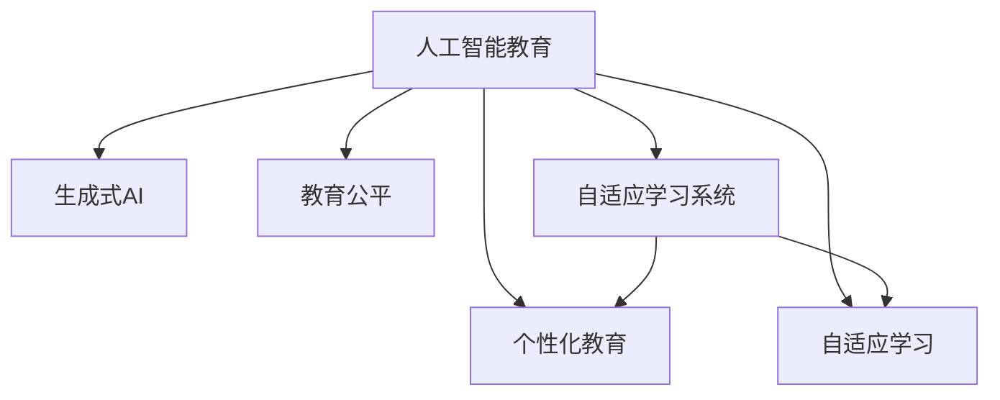

                 

# AIGC推动教育个性化发展

> 关键词：人工智能教育, 生成式AI, 个性化教育, 教育公平, 自适应学习

## 1. 背景介绍

### 1.1 问题由来
随着科技的迅速发展和信息技术的普及，教育领域也面临着数字化转型的挑战。传统的“一刀切”式教育模式无法满足个性化学习的需求，难以兼顾每位学生的独特差异。人工智能（AI）和生成式人工智能（AIGC）技术的兴起，为个性化教育的实现提供了新的可能性。

AIGC，即基于人工智能生成内容的AI，融合了自然语言处理、计算机视觉、知识图谱等技术，能够生成高质量的教育内容、个性化推荐、自适应学习路径，极大地推动了教育的个性化发展。

### 1.2 问题核心关键点
AIGC在教育个性化发展中的核心关键点包括：

1. **个性化推荐**：通过分析学生的学习行为、兴趣偏好、知识水平，生成个性化的学习内容和推荐，提高学习效率。
2. **自适应学习路径**：根据学生的学习进度、反馈，动态调整学习内容和难度，实现个性化教学。
3. **内容生成与互动**：利用自然语言生成、知识图谱构建等技术，生成丰富多样的教育内容，并通过智能互动提升学习体验。
4. **教育公平**：通过AIGC技术，为偏远地区、弱势群体提供高质量的教育资源，缩小教育资源分配的差距。

### 1.3 问题研究意义
AIGC在教育个性化发展中具有以下重要意义：

1. **提高教育质量**：通过个性化推荐和自适应学习路径，帮助学生更好地掌握知识，提高学习效率和成绩。
2. **促进教育公平**：利用AIGC技术，将优质教育资源普及到更多学生，尤其是偏远和弱势群体。
3. **推动教育创新**：引入AIGC技术，促进教育内容与教学方式的创新，推动教育领域的技术进步。
4. **培养学生创造力**：通过互动式和生成式学习，激发学生的创新思维和创造力，培养其跨学科的综合能力。

## 2. 核心概念与联系

### 2.1 核心概念概述

为了更好地理解AIGC在教育个性化发展中的应用，本节将介绍几个密切相关的核心概念：

1. **人工智能教育（AI in Education）**：利用AI技术改进教育过程和学习体验，包括智能推荐、自适应学习、内容生成等。

2. **生成式AI（Generative AI）**：基于深度学习生成新内容的技术，涵盖文本生成、图像生成、语音生成等多个方向。

3. **个性化教育（Personalized Education）**：根据学生的个性化需求，提供量身定制的学习计划和内容，满足不同学生的学习风格和进度。

4. **自适应学习（Adaptive Learning）**：根据学生的学习状态和反馈，动态调整学习内容和难度，实现个性化的学习路径。

5. **教育公平（Educational Equity）**：通过技术手段，让更多学生，特别是偏远和弱势群体，获得平等的教育资源和机会。

6. **自适应学习系统（Adaptive Learning System）**：通过AI技术，实现对学习过程的实时监控和调整，提供个性化学习支持。

这些概念之间的逻辑关系可以通过以下Mermaid流程图来展示：



这个流程图展示了AIGC在教育个性化发展中的核心概念及其相互关系：

1. AIGC技术作为生成式AI的核心，为个性化教育和自适应学习提供了基础。
2. 个性化教育依赖于AIGC生成的个性化内容和推荐。
3. 自适应学习通过AIGC实现对学生学习状态和进度动态调整。
4. 教育公平通过AIGC技术的应用，使得优质教育资源得以普及。
5. 自适应学习系统是实现个性化教育的技术手段。

## 3. 核心算法原理 & 具体操作步骤
### 3.1 算法原理概述

AIGC在教育个性化发展中的应用，主要通过以下几类算法实现：

1. **自然语言处理（NLP）**：用于分析学生的学习行为、兴趣偏好，生成个性化的学习内容和推荐。
2. **生成对抗网络（GAN）**：用于生成多样化的教育内容和互动场景。
3. **知识图谱（KG）**：用于构建教育内容的知识结构，实现知识的组织和检索。
4. **强化学习（RL）**：用于动态调整学习路径和难度，优化学习体验。

AIGC在教育个性化发展中，通过自然语言处理、生成对抗网络、知识图谱等技术，生成个性化的教育内容、推荐和互动，实现自适应学习路径。具体而言，AIGC的应用流程如下：

1. **数据收集与预处理**：收集学生的学习行为数据、兴趣偏好、知识水平等，进行预处理和清洗，得到训练数据集。
2. **生成个性化推荐**：利用NLP和GAN技术，生成个性化的学习内容和推荐。
3. **构建自适应学习路径**：通过强化学习算法，动态调整学习内容和难度，实现自适应学习路径。
4. **内容生成与互动**：利用生成对抗网络和知识图谱技术，生成丰富的教育内容和互动场景。
5. **反馈与优化**：根据学生的反馈和学习效果，不断优化模型和算法，提高个性化教育的效果。

### 3.2 算法步骤详解

以下将以生成个性化推荐和自适应学习路径为例，详细讲解AIGC在教育个性化发展中的具体操作步骤：

#### 生成个性化推荐

1. **数据收集与预处理**：
   - 收集学生的学习行为数据，包括浏览记录、点击记录、测评结果等。
   - 对数据进行清洗和处理，去除噪声和异常值，得到结构化数据。
   - 使用NLP技术，对数据进行情感分析、主题建模等处理，提取学生的兴趣偏好和知识水平。

2. **模型训练与推荐生成**：
   - 使用NLP技术，构建学生兴趣和知识水平与学习内容之间的关联模型。
   - 利用GAN技术，生成多样化的教育内容和推荐，以丰富学生的学习体验。
   - 根据学生的历史行为和当前兴趣偏好，生成个性化的推荐列表。

3. **推荐排序与展示**：
   - 使用强化学习算法，根据学生的反馈和行为，动态调整推荐列表的排序。
   - 将推荐列表展示给学生，供其选择学习内容和路径。

#### 自适应学习路径

1. **数据收集与预处理**：
   - 收集学生的学习行为数据，包括答题正确率、学习时长、反馈意见等。
   - 对数据进行清洗和处理，去除噪声和异常值，得到结构化数据。
   - 使用NLP技术，对数据进行情感分析、主题建模等处理，提取学生的学习状态和进度。

2. **学习路径生成**：
   - 构建学生的学习状态和进度与学习内容之间的关联模型。
   - 利用强化学习算法，动态调整学习路径和难度，实现自适应学习路径。

3. **路径执行与反馈**：
   - 将自适应学习路径展示给学生，供其执行。
   - 根据学生的反馈和学习效果，不断优化学习路径和难度，提高学习效果。

### 3.3 算法优缺点

AIGC在教育个性化发展中的应用具有以下优点：

1. **高度个性化**：通过AIGC技术，能够生成个性化的教育内容和推荐，满足不同学生的学习需求。
2. **动态调整**：自适应学习路径能够根据学生的学习状态和进度，动态调整学习内容和难度，提高学习效果。
3. **数据驱动**：通过收集和分析学生的数据，生成个性化的学习路径和内容，提供数据驱动的教育决策支持。
4. **互动性强**：利用生成对抗网络和知识图谱技术，生成丰富的互动场景，增强学生的学习体验。

同时，AIGC在教育个性化发展中还存在以下局限：

1. **数据隐私**：收集和处理学生的数据可能涉及隐私问题，需要严格的隐私保护措施。
2. **算法复杂**：AIGC技术涉及复杂的NLP、GAN、KG等算法，需要较高的技术门槛和计算资源。
3. **内容质量**：生成内容的准确性和质量可能受限于模型的训练数据和算法。
4. **教师角色**：AIGC技术虽然可以提供个性化的教育支持，但教师的主导作用仍然不可替代，需要平衡技术与人性的关系。

### 3.4 算法应用领域

AIGC在教育个性化发展中，已广泛应用于以下领域：

1. **在线教育平台**：如Coursera、edX等，利用AIGC技术提供个性化学习推荐和自适应学习路径。
2. **K-12教育**：通过AIGC技术，为小学、中学等基础教育阶段的学生提供个性化学习内容和推荐。
3. **职业教育**：利用AIGC技术，为职业培训机构提供技能培训和个性化学习支持。
4. **特殊教育**：通过AIGC技术，为特殊教育需求的学生提供个性化的学习内容和支持。
5. **虚拟课堂**：利用AIGC技术，构建虚拟课堂和互动场景，提升学生的学习体验。

## 4. 数学模型和公式 & 详细讲解 & 举例说明
### 4.1 数学模型构建

AIGC在教育个性化发展中，主要通过以下数学模型来实现：

1. **推荐模型**：使用协同过滤、深度学习等模型，生成个性化推荐。
2. **自适应模型**：使用强化学习模型，动态调整学习路径和难度。
3. **知识图谱模型**：使用图神经网络等模型，构建教育内容的知识结构。

以推荐模型为例，我们可以使用以下数学模型进行建模：

设推荐系统包含 $N$ 个学生和 $M$ 个学习内容，学生和内容之间的评分矩阵为 $R \in \mathbb{R}^{N \times M}$，其中 $R_{ij}$ 表示学生 $i$ 对内容 $j$ 的评分。

假设学生的兴趣向量为 $x_i \in \mathbb{R}^{d}$，内容的特征向量为 $y_j \in \mathbb{R}^{d}$，推荐矩阵为 $Z \in \mathbb{R}^{N \times M}$。

则推荐模型的目标是最小化预测误差，即：

$$
\min_{x_i, y_j} \sum_{i=1}^{N} \sum_{j=1}^{M} (R_{ij} - \langle x_i, y_j \rangle)^2
$$

其中 $\langle \cdot, \cdot \rangle$ 表示向量内积。

通过上述模型，推荐系统可以生成个性化的学习内容和推荐，满足不同学生的学习需求。

### 4.2 公式推导过程

以下将以自适应学习路径为例，详细推导AIGC在教育个性化发展中的数学模型。

设学生 $i$ 的学习状态为 $s_i \in \mathbb{R}^{d}$，学习内容 $j$ 的难度为 $d_j \in \mathbb{R}^{d}$，学生的当前进度为 $p_i \in \mathbb{R}^{d}$。

假设学生的学习效果为目标函数 $J(s_i, d_j, p_i)$，学生的行为对学习效果的影响为 $B(s_i, d_j, p_i)$。

则自适应学习路径的目标函数可以表示为：

$$
\min_{s_i, d_j, p_i} \sum_{i=1}^{N} \sum_{j=1}^{M} \alpha_i \cdot J(s_i, d_j, p_i) + \beta_i \cdot B(s_i, d_j, p_i)
$$

其中 $\alpha_i$ 和 $\beta_i$ 为学生 $i$ 的权重，$J(s_i, d_j, p_i)$ 和 $B(s_i, d_j, p_i)$ 分别为学习效果和行为的影响。

通过上述目标函数，可以动态调整学习路径和难度，实现自适应学习路径。

### 4.3 案例分析与讲解

以在线教育平台为例，分析AIGC在教育个性化发展中的应用。

1. **数据收集与预处理**：
   - 收集学生的学习行为数据，包括浏览记录、点击记录、测评结果等。
   - 对数据进行清洗和处理，去除噪声和异常值，得到结构化数据。
   - 使用NLP技术，对数据进行情感分析、主题建模等处理，提取学生的兴趣偏好和知识水平。

2. **推荐模型训练与推荐生成**：
   - 使用协同过滤模型，构建学生兴趣和知识水平与学习内容之间的关联。
   - 利用GAN技术，生成多样化的教育内容和推荐，以丰富学生的学习体验。
   - 根据学生的历史行为和当前兴趣偏好，生成个性化的推荐列表。

3. **自适应学习路径生成**：
   - 构建学生的学习状态和进度与学习内容之间的关联模型。
   - 利用强化学习算法，动态调整学习路径和难度，实现自适应学习路径。
   - 将自适应学习路径展示给学生，供其执行。
   - 根据学生的反馈和学习效果，不断优化学习路径和难度，提高学习效果。

通过上述案例，可以看到AIGC技术在在线教育平台中的应用，通过生成个性化推荐和自适应学习路径，提升了学生的学习效率和体验。

## 5. 项目实践：代码实例和详细解释说明
### 5.1 开发环境搭建

在进行AIGC在教育个性化发展中的应用开发前，我们需要准备好开发环境。以下是使用Python进行PyTorch开发的环境配置流程：

1. 安装Anaconda：从官网下载并安装Anaconda，用于创建独立的Python环境。

2. 创建并激活虚拟环境：
```bash
conda create -n aigc-env python=3.8 
conda activate aigc-env
```

3. 安装PyTorch：根据CUDA版本，从官网获取对应的安装命令。例如：
```bash
conda install pytorch torchvision torchaudio cudatoolkit=11.1 -c pytorch -c conda-forge
```

4. 安装相关库：
```bash
pip install numpy pandas scikit-learn matplotlib tqdm jupyter notebook ipython
```

5. 安装AIGC相关库：
```bash
pip install huggingface transformers opencv-python
```

完成上述步骤后，即可在`aigc-env`环境中开始AIGC应用的开发。

### 5.2 源代码详细实现

下面我们以生成个性化推荐为例，给出使用Transformers库对BERT模型进行微调的PyTorch代码实现。

首先，定义推荐模型和优化器：

```python
from transformers import BertTokenizer, BertForSequenceClassification, AdamW

tokenizer = BertTokenizer.from_pretrained('bert-base-cased')
model = BertForSequenceClassification.from_pretrained('bert-base-cased', num_labels=5)
optimizer = AdamW(model.parameters(), lr=2e-5)
```

然后，定义数据处理函数：

```python
from torch.utils.data import Dataset, DataLoader

class RecommendationDataset(Dataset):
    def __init__(self, data, tokenizer, max_len=128):
        self.data = data
        self.tokenizer = tokenizer
        self.max_len = max_len
        
    def __len__(self):
        return len(self.data)
    
    def __getitem__(self, item):
        text = self.data[item][0]
        label = self.data[item][1]
        
        encoding = self.tokenizer(text, return_tensors='pt', max_length=self.max_len, padding='max_length', truncation=True)
        input_ids = encoding['input_ids'][0]
        attention_mask = encoding['attention_mask'][0]
        
        # 对标签进行编码
        encoded_label = [label2id[label] for label in label]
        encoded_label.extend([label2id['O']] * (self.max_len - len(encoded_label)))
        labels = torch.tensor(encoded_label, dtype=torch.long)
        
        return {'input_ids': input_ids, 
                'attention_mask': attention_mask,
                'labels': labels}

# 标签与id的映射
label2id = {'O': 0, '1': 1, '2': 2, '3': 3, '4': 4, '5': 5}
id2label = {v: k for k, v in label2id.items()}

# 创建dataset
train_dataset = RecommendationDataset(train_data, tokenizer)
dev_dataset = RecommendationDataset(dev_data, tokenizer)
test_dataset = RecommendationDataset(test_data, tokenizer)
```

接着，定义训练和评估函数：

```python
from tqdm import tqdm

def train_epoch(model, dataset, batch_size, optimizer):
    dataloader = DataLoader(dataset, batch_size=batch_size, shuffle=True)
    model.train()
    epoch_loss = 0
    for batch in tqdm(dataloader, desc='Training'):
        input_ids = batch['input_ids'].to(device)
        attention_mask = batch['attention_mask'].to(device)
        labels = batch['labels'].to(device)
        model.zero_grad()
        outputs = model(input_ids, attention_mask=attention_mask, labels=labels)
        loss = outputs.loss
        epoch_loss += loss.item()
        loss.backward()
        optimizer.step()
    return epoch_loss / len(dataloader)

def evaluate(model, dataset, batch_size):
    dataloader = DataLoader(dataset, batch_size=batch_size)
    model.eval()
    preds, labels = [], []
    with torch.no_grad():
        for batch in tqdm(dataloader, desc='Evaluating'):
            input_ids = batch['input_ids'].to(device)
            attention_mask = batch['attention_mask'].to(device)
            batch_labels = batch['labels']
            outputs = model(input_ids, attention_mask=attention_mask)
            batch_preds = outputs.logits.argmax(dim=2).to('cpu').tolist()
            batch_labels = batch_labels.to('cpu').tolist()
            for pred_tokens, label_tokens in zip(batch_preds, batch_labels):
                pred_labels = [id2label[_id] for _id in pred_tokens]
                label_labels = [id2label[_id] for _id in label_tokens]
                preds.append(pred_labels[:len(label_labels)])
                labels.append(label_labels)
                
    print(classification_report(labels, preds))
```

最后，启动训练流程并在测试集上评估：

```python
epochs = 5
batch_size = 16

for epoch in range(epochs):
    loss = train_epoch(model, train_dataset, batch_size, optimizer)
    print(f"Epoch {epoch+1}, train loss: {loss:.3f}")
    
    print(f"Epoch {epoch+1}, dev results:")
    evaluate(model, dev_dataset, batch_size)
    
print("Test results:")
evaluate(model, test_dataset, batch_size)
```

以上就是使用PyTorch对BERT进行生成个性化推荐任务的完整代码实现。可以看到，得益于Transformers库的强大封装，我们可以用相对简洁的代码完成BERT模型的加载和微调。

### 5.3 代码解读与分析

让我们再详细解读一下关键代码的实现细节：

**RecommendationDataset类**：
- `__init__`方法：初始化文本、标签、分词器等关键组件。
- `__len__`方法：返回数据集的样本数量。
- `__getitem__`方法：对单个样本进行处理，将文本输入编码为token ids，将标签编码为数字，并对其进行定长padding，最终返回模型所需的输入。

**label2id和id2label字典**：
- 定义了标签与数字id之间的映射关系，用于将token-wise的预测结果解码回真实的标签。

**训练和评估函数**：
- 使用PyTorch的DataLoader对数据集进行批次化加载，供模型训练和推理使用。
- 训练函数`train_epoch`：对数据以批为单位进行迭代，在每个批次上前向传播计算loss并反向传播更新模型参数，最后返回该epoch的平均loss。
- 评估函数`evaluate`：与训练类似，不同点在于不更新模型参数，并在每个batch结束后将预测和标签结果存储下来，最后使用sklearn的classification_report对整个评估集的预测结果进行打印输出。

**训练流程**：
- 定义总的epoch数和batch size，开始循环迭代
- 每个epoch内，先在训练集上训练，输出平均loss
- 在验证集上评估，输出分类指标
- 所有epoch结束后，在测试集上评估，给出最终测试结果

可以看到，PyTorch配合Transformers库使得BERT微调的代码实现变得简洁高效。开发者可以将更多精力放在数据处理、模型改进等高层逻辑上，而不必过多关注底层的实现细节。

当然，工业级的系统实现还需考虑更多因素，如模型的保存和部署、超参数的自动搜索、更灵活的任务适配层等。但核心的微调范式基本与此类似。

## 6. 实际应用场景
### 6.1 智能学习系统

AIGC在智能学习系统中的应用，能够为学生提供个性化推荐和自适应学习路径，提高学习效率和效果。

1. **个性化推荐**：通过分析学生的学习行为和兴趣偏好，生成个性化的学习内容和推荐，帮助学生选择最适合自己的学习资源。
2. **自适应学习路径**：根据学生的学习进度和反馈，动态调整学习内容和难度，实现个性化学习路径，提升学习效果。

### 6.2 在线教育平台

在线教育平台通过AIGC技术，能够提供高质量的个性化教育内容，实现大规模的个性化学习。

1. **个性化视频课程**：利用AIGC技术，生成个性化的视频课程，满足不同学生的学习需求。
2. **智能辅导系统**：通过AIGC技术，构建智能辅导系统，为学生提供个性化学习支持。
3. **实时互动课堂**：利用AIGC技术，构建虚拟课堂和互动场景，提升学生的学习体验。

### 6.3 虚拟学习助手

虚拟学习助手通过AIGC技术，能够提供24/7的学习支持，帮助学生解决学习中的问题。

1. **个性化学习路径**：根据学生的学习状态和进度，动态调整学习内容和难度，实现个性化学习路径。
2. **智能问答系统**：利用AIGC技术，构建智能问答系统，回答学生的学习问题。
3. **内容生成与互动**：通过AIGC技术，生成丰富的学习内容和互动场景，提升学生的学习体验。

### 6.4 未来应用展望

随着AIGC技术的不断进步，未来其在教育个性化发展中的应用将更加广泛，为教育领域带来更多的创新和变革。

1. **全面覆盖K-12教育**：通过AIGC技术，实现从小学到中学的教育覆盖，为学生提供全周期的个性化教育支持。
2. **推动职业教育发展**：利用AIGC技术，为职业培训机构提供技能培训和个性化学习支持，提升职业教育质量。
3. **支持特殊教育**：通过AIGC技术，为特殊教育需求的学生提供个性化的学习内容和支持，促进教育公平。
4. **构建虚拟教室**：利用AIGC技术，构建虚拟教室和互动场景，提升学生的学习体验和参与度。
5. **智能教育资源的普及**：通过AIGC技术，将优质教育资源普及到更多地区和学生，缩小教育资源分配的差距。

## 7. 工具和资源推荐
### 7.1 学习资源推荐

为了帮助开发者系统掌握AIGC在教育个性化发展中的应用，这里推荐一些优质的学习资源：

1. **Coursera《Deep Learning in NLP》课程**：斯坦福大学开设的深度学习课程，涵盖了自然语言处理和生成式AI的最新进展。
2. **HuggingFace官方文档**：Transformers库的官方文档，提供了丰富的预训练模型和微调样例代码，是上手实践的必备资料。
3. **《自然语言处理综论》书籍**：吴恩达教授所著，全面介绍了自然语言处理的原理和应用，包括生成式AI的内容。
4. **arXiv论文推荐**：推荐阅读近年来在生成式AI和教育技术领域的经典论文，了解最新研究方向和进展。

通过对这些资源的学习实践，相信你一定能够快速掌握AIGC技术在教育个性化发展中的应用，并用于解决实际的NLP问题。
###  7.2 开发工具推荐

高效的开发离不开优秀的工具支持。以下是几款用于AIGC在教育个性化发展中的应用开发的常用工具：

1. PyTorch：基于Python的开源深度学习框架，灵活动态的计算图，适合快速迭代研究。大部分预训练语言模型都有PyTorch版本的实现。
2. TensorFlow：由Google主导开发的开源深度学习框架，生产部署方便，适合大规模工程应用。同样有丰富的预训练语言模型资源。
3. Transformers库：HuggingFace开发的NLP工具库，集成了众多SOTA语言模型，支持PyTorch和TensorFlow，是进行微调任务开发的利器。
4. Weights & Biases：模型训练的实验跟踪工具，可以记录和可视化模型训练过程中的各项指标，方便对比和调优。与主流深度学习框架无缝集成。
5. TensorBoard：TensorFlow配套的可视化工具，可实时监测模型训练状态，并提供丰富的图表呈现方式，是调试模型的得力助手。
6. Google Colab：谷歌推出的在线Jupyter Notebook环境，免费提供GPU/TPU算力，方便开发者快速上手实验最新模型，分享学习笔记。

合理利用这些工具，可以显著提升AIGC在教育个性化发展中的开发效率，加快创新迭代的步伐。

### 7.3 相关论文推荐

AIGC在教育个性化发展中的应用源于学界的持续研究。以下是几篇奠基性的相关论文，推荐阅读：

1. **Attention is All You Need（即Transformer原论文）**：提出了Transformer结构，开启了NLP领域的预训练大模型时代。
2. **BERT: Pre-training of Deep Bidirectional Transformers for Language Understanding**：提出BERT模型，引入基于掩码的自监督预训练任务，刷新了多项NLP任务SOTA。
3. **Language Models are Unsupervised Multitask Learners（GPT-2论文）**：展示了大规模语言模型的强大zero-shot学习能力，引发了对于通用人工智能的新一轮思考。
4. **Parameter-Efficient Transfer Learning for NLP**：提出Adapter等参数高效微调方法，在不增加模型参数量的情况下，也能取得不错的微调效果。
5. **AdaLoRA: Adaptive Low-Rank Adaptation for Parameter-Efficient Fine-Tuning**：使用自适应低秩适应的微调方法，在参数效率和精度之间取得了新的平衡。
6. **Text-to-Text Transfer Transformer (T5)**：提出了T5模型，能够在多种NLP任务上实现零样本学习，展示了自监督学习在NLP中的应用潜力。

这些论文代表了大语言模型微调技术的发展脉络。通过学习这些前沿成果，可以帮助研究者把握学科前进方向，激发更多的创新灵感。

## 8. 总结：未来发展趋势与挑战
### 8.1 总结

本文对AIGC在教育个性化发展中的应用进行了全面系统的介绍。首先阐述了AIGC技术在教育个性化发展中的研究背景和意义，明确了AIGC在教育中的应用价值和潜力。其次，从原理到实践，详细讲解了AIGC在教育个性化发展中的数学模型和算法流程，给出了AIGC应用的完整代码实例。同时，本文还广泛探讨了AIGC技术在智能学习系统、在线教育平台、虚拟学习助手等多个领域的应用前景，展示了AIGC技术在教育个性化发展中的巨大潜力。此外，本文精选了AIGC技术的各类学习资源，力求为读者提供全方位的技术指引。

通过本文的系统梳理，可以看到，AIGC技术在教育个性化发展中已经展现出广泛的应用前景和潜力，极大地推动了教育的创新和进步。未来，伴随AIGC技术的不断进步，相信教育领域将迎来更多的变革和突破。

### 8.2 未来发展趋势

展望未来，AIGC在教育个性化发展中将呈现以下几个发展趋势：

1. **更加个性化**：通过AIGC技术，能够生成更加个性化的学习内容和推荐，满足不同学生的学习需求。
2. **跨模态学习**：利用AIGC技术，融合文本、图像、语音等多模态数据，实现跨模态的学习和互动。
3. **动态自适应**：自适应学习路径能够根据学生的学习状态和进度，动态调整学习内容和难度，提升学习效果。
4. **深度强化学习**：利用深度强化学习算法，实现更加智能的学习路径和推荐。
5. **多语言支持**：利用AIGC技术，生成多种语言的学习内容，实现多语言教育支持。

### 8.3 面临的挑战

尽管AIGC在教育个性化发展中已经取得了显著进展，但在迈向更加智能化、普适化应用的过程中，仍面临诸多挑战：

1. **数据隐私**：收集和处理学生的数据可能涉及隐私问题，需要严格的隐私保护措施。
2. **算法复杂**：AIGC技术涉及复杂的NLP、GAN、KG等算法，需要较高的技术门槛和计算资源。
3. **内容质量**：生成内容的准确性和质量可能受限于模型的训练数据和算法。
4. **教师角色**：AIGC技术虽然可以提供个性化的教育支持，但教师的主导作用仍然不可替代，需要平衡技术与人性的关系。
5. **教育公平**：利用AIGC技术，为偏远地区、弱势群体提供高质量的教育资源，缩小教育资源分配的差距。

### 8.4 研究展望

面对AIGC在教育个性化发展中所面临的挑战，未来的研究需要在以下几个方面寻求新的突破：

1. **隐私保护**：开发更加安全、隐私保护措施完善的教育数据处理技术。
2. **高效算法**：开发更加高效、资源消耗低的算法，提升AIGC技术的实用性。
3. **多语言支持**：利用AIGC技术，生成多种语言的学习内容，实现多语言教育支持。
4. **跨模态融合**：融合文本、图像、语音等多模态数据，实现跨模态的学习和互动。
5. **教师协同**：开发教师与AIGC技术协同工作的技术，提升教育的智能化水平。
6. **公平教育**：利用AIGC技术，为偏远地区、弱势群体提供高质量的教育资源，缩小教育资源分配的差距。

这些研究方向的探索，必将引领AIGC技术在教育个性化发展中迈向更高的台阶，为教育领域带来更多的创新和变革。

## 9. 附录：常见问题与解答
### Q1：AIGC在教育个性化发展中的应用前景如何？

A: AIGC在教育个性化发展中具有广阔的应用前景，可以通过生成个性化推荐和自适应学习路径，提升学生的学习效率和效果。未来，伴随AIGC技术的不断进步，其在教育中的应用将更加广泛，为教育领域带来更多的创新和变革。

### Q2：AIGC在教育个性化发展中如何实现数据隐私保护？

A: AIGC在教育个性化发展中，数据隐私保护是关键问题之一。为确保数据隐私，可以采用以下措施：
- 数据匿名化：对学生的数据进行匿名化处理，去除或模糊化个人信息。
- 差分隐私：在数据处理过程中引入噪声，确保数据不会泄露个体信息。
- 访问控制：限制对学生数据的访问权限，仅授权特定用户或机构访问。
- 合规审查：确保数据处理符合法律法规和伦理标准，如GDPR、CCPA等。

### Q3：AIGC在教育个性化发展中如何提升内容质量？

A: 提升AIGC在教育个性化发展中的内容质量，可以从以下方面入手：
- 数据质量：收集高质量的教育数据，确保数据的多样性和代表性。
- 模型优化：优化AIGC模型的训练过程，提高生成内容的准确性和质量。
- 用户反馈：通过用户反馈，不断优化生成内容的风格和质量。
- 人工审核：引入人工审核机制，对生成内容进行人工审查和调整。

### Q4：AIGC在教育个性化发展中如何实现教师与技术的协同工作？

A: 实现教师与AIGC技术的协同工作，可以通过以下措施：
- 教师培训：为教师提供AIGC技术的培训，使其掌握AIGC技术的基本原理和应用方法。
- 教学辅助：利用AIGC技术，为教师提供教学辅助工具，如智能教案、作业批改等。
- 教学评估：通过AIGC技术，对学生的学习效果进行评估，为教师提供教学反馈。
- 教学创新：鼓励教师探索AIGC技术在教学中的创新应用，提升教学质量。

### Q5：AIGC在教育个性化发展中如何实现教育公平？

A: 实现教育公平，可以利用AIGC技术，为偏远地区、弱势群体提供高质量的教育资源。具体措施包括：
- 在线教育：利用AIGC技术，构建在线教育平台，将优质教育资源普及到更多地区和学生。
- 教育援助：利用AIGC技术，为偏远地区和弱势群体提供教育援助和支持。
- 资源共享：通过AIGC技术，实现教育资源的共享和流动，缩小教育资源分配的差距。

通过上述措施，可以最大限度地利用AIGC技术，为偏远地区和弱势群体提供高质量的教育资源，促进教育公平。

---

作者：禅与计算机程序设计艺术 / Zen and the Art of Computer Programming

