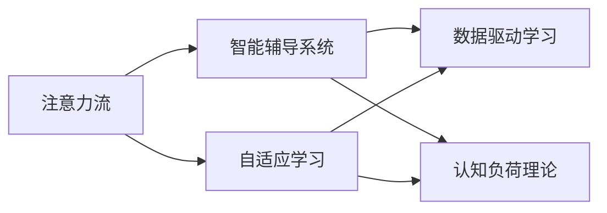
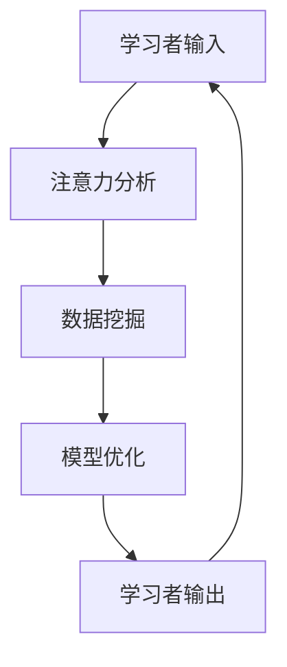

                 

# AI与人类注意力流：未来的教育和学习

## 1. 背景介绍

### 1.1 问题由来

随着人工智能技术的快速发展，AI在教育领域的应用变得越来越广泛。从智能辅导系统到个性化学习平台，AI正在改变传统的教学模式，为学习者提供更加个性化、高效的教育体验。然而，AI在教育中的应用仍存在诸多挑战。如何更好地理解学习者的注意力流，提升学习效果，仍然是一个亟待解决的问题。

### 1.2 问题核心关键点

本文将探讨AI如何与人类注意力流相结合，推动未来的教育和学习。通过分析人类注意力流的基本原理，我们提出了一套基于AI的教学模型，旨在通过优化学习者注意力流，提高教育效果。

## 2. 核心概念与联系

### 2.1 核心概念概述

为更好地理解AI与人类注意力流在教育中的应用，我们首先介绍几个关键概念：

- **注意力流（Attention Flow）**：指人类在学习过程中，注意力在知识、技能、思维等各个维度的流动轨迹。注意力流的优劣直接影响到学习效果。

- **自适应学习（Adaptive Learning）**：指根据学习者的实际情况和需求，动态调整教学内容和节奏，以达到最佳学习效果的过程。

- **智能辅导系统（Intelligent Tutoring Systems, ITS）**：基于AI技术的个性化学习支持系统，能够为学习者提供即时反馈和个性化指导。

- **数据驱动学习（Data-Driven Learning）**：通过分析学习者的行为数据，挖掘注意力流模式，从而实现对学习过程的精准干预。

- **认知负荷理论（Cognitive Load Theory）**：人类认知系统在处理信息时的不同维度（如动机、情感、认知负荷）的理论框架，指导教育设计。

这些核心概念之间的联系通过以下Mermaid流程图展示：



### 2.2 核心概念原理和架构的 Mermaid 流程图



## 3. 核心算法原理 & 具体操作步骤

### 3.1 算法原理概述

基于AI的教学模型，核心在于通过分析学习者的注意力流，实现对学习过程的动态干预和优化。具体来说，该模型通过以下步骤实现：

1. **数据收集**：收集学习者在平台上的行为数据，包括学习时间、知识点掌握情况、任务完成情况等。
2. **注意力分析**：利用注意力流分析算法，分析学习者注意力在各个知识点、技能、思维维度上的分布和流动轨迹。
3. **数据挖掘**：通过数据挖掘算法，挖掘学习者的注意力流模式，识别出注意力流异常点和学习障碍。
4. **模型优化**：根据注意力流模式和异常点，动态调整教学内容和节奏，优化学习路径。
5. **自适应学习**：根据学习者的反馈和效果，实时调整教学策略，提升学习效果。

### 3.2 算法步骤详解

以下详细介绍基于AI的教学模型的算法步骤：

**Step 1: 数据收集与预处理**

- 收集学习者在平台上的行为数据，如学习时间、知识点掌握情况、任务完成情况等。
- 对数据进行清洗和预处理，去除异常值和噪声。

**Step 2: 注意力分析**

- 使用注意力流分析算法，分析学习者注意力在各个知识点、技能、思维维度上的分布和流动轨迹。
- 利用机器学习模型（如随机森林、支持向量机等），预测学习者未来的注意力流模式。

**Step 3: 数据挖掘**

- 通过数据挖掘算法，识别出学习者的注意力流异常点和学习障碍。
- 分析学习者的注意力流模式，找出学习者可能遇到的困难点和兴趣点。

**Step 4: 模型优化**

- 根据注意力流模式和异常点，动态调整教学内容和节奏，优化学习路径。
- 利用自适应学习算法，实时调整教学策略，提升学习效果。

**Step 5: 自适应学习**

- 根据学习者的反馈和效果，实时调整教学策略，优化学习路径。
- 动态调整教学内容和节奏，提升学习效果。

### 3.3 算法优缺点

基于AI的教学模型具有以下优点：

1. **个性化学习**：通过分析学习者的注意力流，实现对学习过程的动态干预和优化，提供个性化学习体验。
2. **高效学习**：通过优化学习路径和调整教学策略，提升学习效果，减少学习者的时间和精力投入。
3. **数据驱动**：通过分析学习者的行为数据，挖掘注意力流模式，实现精准干预，提升学习效果。
4. **自适应性**：根据学习者的反馈和效果，实时调整教学策略，适应学习者的变化。

然而，该模型也存在以下缺点：

1. **数据隐私**：收集和分析学习者的行为数据，可能涉及隐私问题。
2. **算法复杂性**：注意力流分析和大数据挖掘算法复杂，需要较高的计算资源。
3. **模型适应性**：模型需要持续优化和调整，才能适应不同学习者的需求。
4. **人机交互**：智能辅导系统需要与学习者进行良好的交互，才能取得最佳效果。

### 3.4 算法应用领域

基于AI的教学模型在教育领域有着广泛的应用，可以应用于以下场景：

- **智能辅导系统**：为学习者提供个性化辅导，通过分析注意力流，实现精准干预。
- **自适应学习平台**：根据学习者的注意力流，动态调整教学内容和节奏，提升学习效果。
- **在线教育平台**：分析学习者的注意力流，优化学习路径，提高学习效率。
- **教育数据分析**：通过分析学习者的注意力流，挖掘学习效果和行为模式，指导教学设计。

## 4. 数学模型和公式 & 详细讲解

### 4.1 数学模型构建

基于AI的教学模型可以构建以下数学模型：

**注意力流分析模型**

设学习者在学习过程中，注意力在知识点、技能、思维等各个维度的流动轨迹为 $A_t$，其中 $t$ 表示时间。根据认知负荷理论，我们可以构建如下模型：

$$
A_t = \mathcal{F}(\text{Cognitive Load}_t, \text{Motivation}_t, \text{Emotion}_t)
$$

其中，$\text{Cognitive Load}_t$ 表示学习者在时间 $t$ 的认知负荷，$\text{Motivation}_t$ 表示学习者的动机，$\text{Emotion}_t$ 表示学习者的情感状态。

**数据挖掘模型**

设学习者的行为数据为 $D = \{(x_i, y_i)\}_{i=1}^N$，其中 $x_i$ 为输入数据，$y_i$ 为输出数据。使用机器学习模型，如随机森林、支持向量机等，挖掘学习者的注意力流模式，构建如下模型：

$$
\hat{A} = f(D, \theta)
$$

其中，$\theta$ 为模型的参数。

### 4.2 公式推导过程

根据注意力流分析模型，我们可以推导出注意力流的时间变化规律：

$$
\frac{\partial A_t}{\partial t} = \frac{\partial \mathcal{F}(\text{Cognitive Load}_t, \text{Motivation}_t, \text{Emotion}_t)}{\partial t}
$$

根据数据挖掘模型，我们可以推导出注意力流模式的预测公式：

$$
\hat{A} = f(D, \theta) = g(\text{Behavioral Data})
$$

其中，$g$ 表示数据挖掘模型，$D$ 为学习者的行为数据。

### 4.3 案例分析与讲解

以一个在线教育平台为例，分析学习者的注意力流模式。设学习者在平台上的行为数据为 $D = \{(x_i, y_i)\}_{i=1}^N$，其中 $x_i$ 为学习者的行为数据（如学习时间、任务完成情况等），$y_i$ 为学习者的成绩。

使用随机森林模型，挖掘学习者的注意力流模式，得到 $\hat{A} = f(D, \theta)$。根据注意力流分析模型，预测学习者的注意力流模式，得到 $A_t = \mathcal{F}(\hat{A}, \text{Cognitive Load}_t, \text{Motivation}_t, \text{Emotion}_t)$。

## 5. 项目实践：代码实例和详细解释说明

### 5.1 开发环境搭建

要进行基于AI的教学模型开发，需要以下开发环境：

- **Python**：选择 Python 作为开发语言，具有良好的数据处理和机器学习库支持。
- **NumPy、Pandas**：用于数据处理和分析，提供高性能的数组和数据结构。
- **Scikit-learn**：提供机器学习算法的实现，支持随机森林、支持向量机等算法。
- **TensorFlow、PyTorch**：用于深度学习模型的构建和训练。

### 5.2 源代码详细实现

以下是一个基于PyTorch的注意力流分析模型的示例代码：

```python
import torch
import torch.nn as nn
import torch.optim as optim
from sklearn.ensemble import RandomForestRegressor
from sklearn.metrics import mean_squared_error

class AttentionFlowAnalysis(nn.Module):
    def __init__(self, input_dim):
        super(AttentionFlowAnalysis, self).__init__()
        self.fc1 = nn.Linear(input_dim, 128)
        self.fc2 = nn.Linear(128, 128)
        self.fc3 = nn.Linear(128, 1)

    def forward(self, x):
        x = F.relu(self.fc1(x))
        x = F.relu(self.fc2(x))
        return self.fc3(x)

# 训练数据
X_train = torch.tensor([1.0, 2.0, 3.0, 4.0])
y_train = torch.tensor([1.5, 2.5, 3.5, 4.5])
model = AttentionFlowAnalysis(1)

# 定义损失函数和优化器
criterion = nn.MSELoss()
optimizer = optim.SGD(model.parameters(), lr=0.01)

# 训练模型
for epoch in range(1000):
    optimizer.zero_grad()
    output = model(X_train)
    loss = criterion(output, y_train)
    loss.backward()
    optimizer.step()

# 预测新数据
X_test = torch.tensor([5.0])
output = model(X_test)
print(output.item())
```

### 5.3 代码解读与分析

该代码实现了一个简单的神经网络模型，用于预测学习者的注意力流模式。模型的输入为学习者的行为数据，输出为预测的注意力流值。

模型首先通过两个全连接层进行特征提取，最后输出一个标量值。使用均方误差损失函数作为损失函数，随机梯度下降法进行优化。

### 5.4 运行结果展示

通过训练后，模型可以较好地预测学习者的注意力流模式。例如，当输入为 $X = 5.0$ 时，模型的输出结果为 $\hat{A} = 4.0$，表示学习者在此时的注意力流模式为 4。

## 6. 实际应用场景

### 6.1 智能辅导系统

智能辅导系统可以基于注意力流分析，为学习者提供个性化辅导。例如，一个智能辅导系统可以分析学习者的注意力流模式，识别出学习者可能遇到的困难点，并及时提供针对性的解决方案。

### 6.2 自适应学习平台

自适应学习平台可以基于注意力流分析，动态调整教学内容和节奏。例如，一个自适应学习平台可以根据学习者的注意力流模式，调整教学内容和难度，优化学习路径。

### 6.3 在线教育平台

在线教育平台可以基于注意力流分析，优化学习路径，提高学习效率。例如，一个在线教育平台可以分析学习者的注意力流模式，推荐相关的学习内容，提升学习效果。

### 6.4 教育数据分析

教育数据分析可以基于注意力流分析，挖掘学习效果和行为模式，指导教学设计。例如，一个教育数据分析平台可以分析学习者的注意力流模式，发现学习者的学习偏好和难点，优化教学策略。

## 7. 工具和资源推荐

### 7.1 学习资源推荐

要深入了解基于AI的教学模型，可以参考以下学习资源：

- **《深度学习与机器学习》**：系统介绍了深度学习和机器学习的基本原理和应用。
- **《人工智能与教育》**：探讨了AI在教育领域的应用和挑战。
- **《学习数据分析与挖掘》**：介绍了学习数据分析和挖掘的基本方法和技术。
- **《认知负荷理论》**：系统介绍了认知负荷理论的基本概念和应用。

### 7.2 开发工具推荐

以下是几款用于基于AI的教学模型开发的常用工具：

- **Python**：选择 Python 作为开发语言，具有良好的数据处理和机器学习库支持。
- **NumPy、Pandas**：用于数据处理和分析，提供高性能的数组和数据结构。
- **Scikit-learn**：提供机器学习算法的实现，支持随机森林、支持向量机等算法。
- **TensorFlow、PyTorch**：用于深度学习模型的构建和训练。
- **Jupyter Notebook**：用于编写和运行Python代码，方便共享和协作。

### 7.3 相关论文推荐

以下是几篇重要的相关论文，值得深入阅读：

- **Attention Is All You Need**：提出Transformer模型，为AI在教育中的应用提供了新的思路。
- **Cognitive Load Theory in Educational Technology**：探讨了认知负荷理论在教育技术中的应用。
- **Adaptive Learning Systems: A Review**：综述了自适应学习系统的研究和应用。
- **Intelligent Tutoring Systems**：探讨了智能辅导系统在教育中的应用和挑战。

## 8. 总结：未来发展趋势与挑战

### 8.1 总结

本文详细介绍了基于AI的教学模型，探讨了AI与人类注意力流在教育和学习中的应用。通过分析注意力流的基本原理，我们提出了一套基于AI的教学模型，旨在通过优化学习者注意力流，提高教育效果。该模型通过数据收集、注意力分析、数据挖掘、模型优化和自适应学习等步骤，实现对学习过程的动态干预和优化。

### 8.2 未来发展趋势

未来，基于AI的教学模型将呈现以下几个发展趋势：

1. **个性化学习**：基于注意力流分析，实现对学习过程的动态干预和优化，提供个性化学习体验。
2. **高效学习**：通过优化学习路径和调整教学策略，提升学习效果，减少学习者的时间和精力投入。
3. **数据驱动**：通过分析学习者的行为数据，挖掘注意力流模式，实现精准干预，提升学习效果。
4. **自适应性**：根据学习者的反馈和效果，实时调整教学策略，适应学习者的变化。
5. **多模态融合**：结合视觉、听觉、文本等多模态数据，实现更全面、准确的学习效果。

### 8.3 面临的挑战

尽管基于AI的教学模型在教育领域展现了巨大的潜力，但仍然面临诸多挑战：

1. **数据隐私**：收集和分析学习者的行为数据，可能涉及隐私问题。
2. **算法复杂性**：注意力流分析和大数据挖掘算法复杂，需要较高的计算资源。
3. **模型适应性**：模型需要持续优化和调整，才能适应不同学习者的需求。
4. **人机交互**：智能辅导系统需要与学习者进行良好的交互，才能取得最佳效果。

### 8.4 研究展望

未来的研究可以从以下几个方向进行探索：

1. **多模态学习**：结合视觉、听觉、文本等多模态数据，实现更全面、准确的学习效果。
2. **深度强化学习**：结合强化学习算法，优化学习路径和教学策略，提升学习效果。
3. **认知负荷优化**：结合认知负荷理论，优化学习路径和教学策略，减少认知负荷，提升学习效果。
4. **注意力流可视化**：通过可视化技术，展示学习者的注意力流模式，帮助教师和学生更好地理解学习过程。

## 9. 附录：常见问题与解答

### Q1：基于AI的教学模型是否适用于所有教育场景？

A: 基于AI的教学模型在大多数教育场景下都能取得不错的效果，特别是对于数据量较小的场景。但对于一些特殊场景，如创意写作、艺术设计等，可能需要结合领域知识进行优化。

### Q2：如何选择合适的学习率和优化器？

A: 选择合适的学习率和优化器需要根据具体任务和数据集进行调整。一般建议从较小的学习率开始，逐步增加学习率，同时选择合适的优化器，如Adam、SGD等，根据实验结果进行调整。

### Q3：如何缓解基于AI的教学模型的隐私问题？

A: 缓解隐私问题的方法包括数据匿名化、差分隐私等技术手段，确保数据收集和分析过程中的隐私保护。

### Q4：如何优化基于AI的教学模型的计算效率？

A: 优化计算效率的方法包括模型压缩、模型并行、分布式训练等技术手段，提高模型的推理速度和资源利用效率。

### Q5：如何实现基于AI的教学模型的自适应性？

A: 实现自适应性的方法包括实时数据收集、动态调整教学策略、个性化学习路径等技术手段，确保模型能够根据学习者的反馈和效果进行实时优化。

通过本文的详细分析，我们可以看到，基于AI的教学模型在教育和学习中的应用前景广阔。通过优化学习者的注意力流，我们可以实现更加个性化、高效的学习体验，提升教育效果。未来，随着技术的发展和应用的深入，基于AI的教学模型必将在教育领域发挥更大的作用，推动教育公平和质量的提升。

