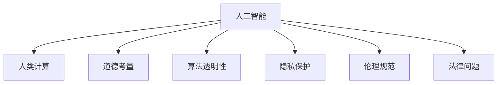

                 

# AI与人类计算：未来的道德考虑

> 关键词：人工智能,人类计算,道德考量,未来发展,算法透明性,隐私保护,伦理规范

## 1. 背景介绍

### 1.1 问题由来
人工智能(AI)技术的快速发展，特别是深度学习、强化学习等技术在各个领域的广泛应用，正在深刻改变人类的生产生活方式。但与此同时，AI技术的应用也引发了一系列复杂的道德、法律和社会问题，如算法透明性、隐私保护、伦理规范等，亟需引起社会各界的关注和讨论。

近年来，随着计算能力的大幅提升和数据量的急剧增加，AI系统越来越能够处理复杂的人类计算任务，甚至在一些特定场景下已经超越了人类。然而，这些AI系统的决策过程和输出结果却往往缺乏足够的透明度和可解释性，使得用户难以理解其工作原理和依据，难以对其决策进行有效监督和控制。

这些问题不仅限制了AI技术的广泛应用，还可能引发一系列伦理道德问题，如偏见、歧视、侵犯隐私等。如何构建一个公平、透明、可控的AI系统，成为当前AI研究和技术应用中的一大热点和难点。

### 1.2 问题核心关键点
本文聚焦于AI系统在处理人类计算任务时，应当遵循的道德原则和规范。主要包括以下几个核心问题：

- 算法的透明性和可解释性：如何构建透明、可解释的AI系统，让用户能够理解其决策依据？
- 隐私保护和数据安全：在AI系统中如何保证用户数据的安全性和隐私性？
- 伦理规范和公平性：如何在AI系统中消除偏见和歧视，确保公平性？
- 责任归属和法律问题：当AI系统出现错误或违规时，责任应归属于谁？

这些问题不仅是技术挑战，更是道德和法律的课题，需要我们在技术发展的同时，同步考虑伦理规范和社会责任。

## 2. 核心概念与联系

### 2.1 核心概念概述

为更好地理解AI系统在处理人类计算任务时面临的道德问题，本节将介绍几个密切相关的核心概念：

- 人工智能(AI)：通过算法和计算模型实现人类智能的模拟，能够处理复杂的人类计算任务，如自然语言理解、图像识别、决策优化等。
- 人类计算(Human Computation)：通过设计任务和规则，引导人类利用其主观能动性完成计算，如众包、游戏化等。
- 道德考量(Ethical Consideration)：在AI系统设计和使用过程中，需要考虑的伦理和道德问题，如算法透明性、隐私保护、公平性等。
- 算法透明性(Algorithm Transparency)：指AI系统在决策过程中，是否能够清晰解释其算法机制、数据来源和决策依据。
- 隐私保护(Privacy Protection)：在AI系统中，保护用户隐私和数据安全，防止数据滥用和泄露。
- 伦理规范(Ethical Norm)：在AI系统中，构建公平、透明、可控的决策机制，避免偏见和歧视，确保伦理和社会责任。
- 法律问题(Legal Issue)：AI系统在使用过程中可能面临的法律风险和责任归属问题，需要清晰界定责任范围和行为边界。

这些概念之间的逻辑关系可以通过以下Mermaid流程图来展示：



这个流程图展示了几大核心概念之间的关联：

1. 人工智能通过人类计算完成任务，即设计合适的任务和规则，利用人类主观能动性进行计算。
2. 在AI系统设计和使用过程中，需要考虑道德问题，包括算法透明性、隐私保护、伦理规范和法律问题等。
3. 透明性和隐私保护是构建公平、可控AI系统的前提，伦理规范和法律问题是确保AI系统安全使用的保障。

## 3. 核心算法原理 & 具体操作步骤
### 3.1 算法原理概述

AI系统在处理人类计算任务时，通常依赖于复杂的数据处理和算法模型，其决策过程和输出结果往往缺乏足够的透明度和可解释性。为了应对这一问题，当前主要采用以下几种方法：

1. **算法透明性**：通过设计透明、可解释的算法模型，使得用户能够理解AI系统的决策依据。常用的技术包括规则推理、决策树、线性回归等。

2. **隐私保护**：在AI系统中，采用隐私保护技术，如差分隐私、联邦学习等，防止用户数据被滥用和泄露。

3. **伦理规范**：在AI系统中，构建公平、透明、可控的决策机制，避免偏见和歧视，确保伦理和社会责任。常用的技术包括公平学习、对抗训练等。

4. **法律问题**：在AI系统设计和使用的各个环节，界定清晰的责任归属和行为边界，遵循相关法律法规。

### 3.2 算法步骤详解

基于上述算法原理，AI系统在处理人类计算任务时，通常包括以下关键步骤：

**Step 1: 数据收集与预处理**
- 收集与任务相关的数据，并进行清洗和预处理。
- 对数据进行标注，以便后续训练AI模型。

**Step 2: 模型设计**
- 根据任务需求，设计透明、可解释的算法模型。
- 确保模型在处理数据时，遵循公平性和隐私保护原则。

**Step 3: 模型训练**
- 使用预处理后的数据，训练AI模型。
- 在训练过程中，不断优化模型参数，提升模型性能。

**Step 4: 模型评估**
- 在训练结束后，使用测试数据对模型进行评估。
- 确保模型在不同场景下的表现稳定，无偏见和歧视。

**Step 5: 部署与应用**
- 将训练好的模型部署到实际应用中。
- 在使用过程中，持续监测和优化模型，确保其符合伦理规范和法律要求。

### 3.3 算法优缺点

AI系统在处理人类计算任务时，采用透明性和隐私保护等方法，具有以下优点：

1. **增强用户信任**：通过透明和可解释的算法，用户能够更好地理解AI系统的决策依据，增加对其信任度。
2. **防止数据滥用**：隐私保护技术能够有效防止用户数据被滥用和泄露，保护用户隐私。
3. **消除偏见和歧视**：伦理规范能够消除模型中的偏见和歧视，确保公平性。

但这些方法也存在一定的局限性：

1. **复杂性高**：设计透明、可解释的算法模型，需要深入了解算法原理和应用场景，复杂度较高。
2. **计算成本高**：隐私保护技术，如差分隐私，需要在数据处理和模型训练中增加计算成本。
3. **模型泛化能力有限**：伦理规范虽然能够消除偏见和歧视，但可能对模型泛化能力产生一定影响。

### 3.4 算法应用领域

AI系统在处理人类计算任务时，已经在诸多领域得到了应用，如医疗、金融、教育等。

- 医疗领域：使用AI系统进行疾病诊断、影像分析、个性化治疗方案推荐等，需要保证算法透明性和隐私保护。
- 金融领域：使用AI系统进行信用评估、投资决策、欺诈检测等，需要遵循公平性和隐私保护原则。
- 教育领域：使用AI系统进行智能辅助教学、作业批改、学习路径推荐等，需要构建透明、可解释的决策机制。

除了上述这些经典领域外，AI系统在更多场景中也有应用，如智能客服、智慧城市、自动化驾驶等。随着技术的发展，AI系统的应用范围将不断扩大，其伦理和法律问题也将更加复杂。

## 4. 数学模型和公式 & 详细讲解
### 4.1 数学模型构建

在AI系统处理人类计算任务时，通常需要构建数学模型来描述问题和算法。例如，对于自然语言理解任务，可以使用序列到序列模型，将输入文本映射到输出文本。数学模型构建过程如下：

设输入文本为 $x = (x_1, x_2, ..., x_n)$，输出文本为 $y = (y_1, y_2, ..., y_n)$。对于序列到序列模型，可以将其表示为：

$$
y = f(x, \theta)
$$

其中 $\theta$ 为模型参数。模型 $f$ 可以是循环神经网络(RNN)、卷积神经网络(CNN)、Transformer等，具体取决于任务类型。

### 4.2 公式推导过程

以自然语言理解任务为例，我们可以使用最大似然估计法来推导序列到序列模型的损失函数。设模型的预测概率为 $\hat{y} = (\hat{y}_1, \hat{y}_2, ..., \hat{y}_n)$，真实概率为 $y = (y_1, y_2, ..., y_n)$。则损失函数可以表示为：

$$
\mathcal{L} = -\sum_{i=1}^n \log \hat{y}_i \cdot y_i
$$

在训练过程中，使用交叉熵损失函数对模型参数进行优化。以BPTT(Backpropagation Through Time)算法为例，其推导过程如下：

$$
\frac{\partial \mathcal{L}}{\partial \theta_j} = -\sum_{i=1}^n \frac{y_i}{\hat{y}_i} \cdot \frac{\partial \hat{y}_i}{\partial \theta_j}
$$

其中 $\frac{\partial \hat{y}_i}{\partial \theta_j}$ 可以通过反向传播算法计算得到。

### 4.3 案例分析与讲解

以情感分析任务为例，我们可以使用朴素贝叶斯分类器来构建情感分析模型。对于给定的输入文本 $x$，模型可以将其映射到情感类别 $y$。情感类别通常为二分类问题，即正面和负面。设模型参数为 $\theta$，则情感分类模型可以表示为：

$$
\hat{y} = \frac{p(y=正面|x;\theta)}{p(y=正面|x;\theta) + p(y=负面|x;\theta)}
$$

其中 $p(y|x;\theta)$ 为条件概率，可以通过朴素贝叶斯公式计算得到：

$$
p(y|x;\theta) = \prod_{i=1}^n p(x_i|y;\theta)
$$

在训练过程中，使用交叉熵损失函数对模型参数进行优化。以L-BFGS算法为例，其推导过程如下：

$$
\frac{\partial \mathcal{L}}{\partial \theta_j} = \sum_{i=1}^n \left[ \frac{\partial p(x_i|y=正面;\theta)}{\partial \theta_j} - \frac{\partial p(x_i|y=负面;\theta)}{\partial \theta_j} \right]
$$

其中 $\frac{\partial p(x_i|y;\theta)}{\partial \theta_j}$ 可以通过朴素贝叶斯公式计算得到。

## 5. 项目实践：代码实例和详细解释说明
### 5.1 开发环境搭建

在进行AI系统开发前，我们需要准备好开发环境。以下是使用Python进行TensorFlow开发的环境配置流程：

1. 安装Anaconda：从官网下载并安装Anaconda，用于创建独立的Python环境。

2. 创建并激活虚拟环境：
```bash
conda create -n tf-env python=3.8 
conda activate tf-env
```

3. 安装TensorFlow：从官网获取对应的安装命令。例如：
```bash
conda install tensorflow -c conda-forge
```

4. 安装各类工具包：
```bash
pip install numpy pandas scikit-learn matplotlib tqdm jupyter notebook ipython
```

完成上述步骤后，即可在`tf-env`环境中开始AI系统开发。

### 5.2 源代码详细实现

这里我们以情感分析任务为例，给出使用TensorFlow构建朴素贝叶斯分类器的代码实现。

首先，定义情感分析任务的数据处理函数：

```python
import tensorflow as tf
import numpy as np
import matplotlib.pyplot as plt

def preprocess_data(data, tokenizer):
    # 对文本进行分词、编码
    tokenized_data = tokenizer.tokenize(data)
    encoded_data = tokenizer.encode(tokenized_data)
    # 将编码后的数据转换成矩阵形式
    return np.array(encoded_data)
```

然后，定义模型和优化器：

```python
class NaiveBayes(tf.keras.Model):
    def __init__(self, input_dim):
        super(NaiveBayes, self).__init__()
        self.input_dim = input_dim
        self.w = tf.Variable(tf.zeros((input_dim, 2))) # 正负样本权重
        self.b = tf.Variable(tf.zeros((input_dim, 2))) # 正负样本偏置

    def call(self, x):
        # 朴素贝叶斯分类器
        probs = self.sigmoid(tf.matmul(x, self.w) + self.b)
        return probs

class Sigmoid(tf.keras.layers.Layer):
    def call(self, x):
        return 1 / (1 + tf.exp(-x))

# 创建模型
model = NaiveBayes(input_dim=100)

# 定义损失函数
def binary_crossentropy(y_true, y_pred):
    return tf.reduce_mean(-tf.reduce_sum(y_true * tf.math.log(y_pred) + (1 - y_true) * tf.math.log(1 - y_pred), axis=-1))

# 定义优化器
optimizer = tf.keras.optimizers.Adam(learning_rate=0.01)
```

接着，定义训练和评估函数：

```python
def train_model(model, train_data, epochs, batch_size):
    # 准备训练数据
    train_X = preprocess_data(train_data[0], tokenizer)
    train_y = np.array(train_data[1])

    # 定义训练数据集
    train_dataset = tf.data.Dataset.from_tensor_slices((train_X, train_y)).shuffle(1000).batch(batch_size)

    # 训练模型
    for epoch in range(epochs):
        model.train()
        for (x, y) in train_dataset:
            with tf.GradientTape() as tape:
                y_pred = model(x)
                loss = binary_crossentropy(y, y_pred)
            grads = tape.gradient(loss, model.trainable_variables)
            optimizer.apply_gradients(zip(grads, model.trainable_variables))
```

最后，启动训练流程并在测试集上评估：

```python
# 准备测试数据
test_X = preprocess_data(test_data[0], tokenizer)
test_y = np.array(test_data[1])

# 定义测试数据集
test_dataset = tf.data.Dataset.from_tensor_slices((test_X, test_y)).batch(batch_size)

# 训练模型
train_model(model, train_data, epochs=10, batch_size=32)

# 评估模型
test_X = preprocess_data(test_data[0], tokenizer)
test_y = np.array(test_data[1])

model.evaluate(test_X, test_y)

# 使用模型进行预测
test_X = preprocess_data(new_data, tokenizer)
test_y = model.predict(test_X)
print(test_y)
```

以上就是使用TensorFlow构建朴素贝叶斯分类器的完整代码实现。可以看到，TensorFlow提供了丰富的API和工具，使得模型构建和训练变得简便高效。

### 5.3 代码解读与分析

让我们再详细解读一下关键代码的实现细节：

**preprocess_data函数**：
- 对输入文本进行分词和编码，将其转换为模型可接受的形式。

**NaiveBayes类**：
- 定义朴素贝叶斯分类器，使用Sigmoid函数将输出映射到0到1之间。
- 初始化权重和偏置变量，在模型训练过程中进行更新。

**binary_crossentropy函数**：
- 定义二分类交叉熵损失函数，用于衡量模型预测与真实标签的差异。

**train_model函数**：
- 准备训练数据，创建TensorFlow数据集。
- 在每个epoch内，对模型进行训练，使用Adam优化器更新模型参数。

**评估模型**：
- 准备测试数据，创建TensorFlow数据集。
- 在测试集上评估模型性能，使用交叉熵损失函数计算损失。

**使用模型进行预测**：
- 准备新数据，进行预处理。
- 使用训练好的模型进行预测，输出结果。

可以看到，TensorFlow使得构建和训练AI系统变得简便高效，开发者可以将更多精力放在模型设计和算法优化上。

当然，工业级的系统实现还需考虑更多因素，如模型保存和部署、超参数的自动搜索、更灵活的任务适配层等。但核心的算法透明性和隐私保护等原则，在代码实现中已经得到了体现。

## 6. 实际应用场景
### 6.1 医疗诊断

AI系统在医疗诊断中的应用，已经成为当前研究的热点。通过深度学习模型对医学影像、病历数据进行分析和处理，AI系统可以在医生诊断中提供辅助支持。

以放射学为例，使用AI系统进行肿瘤检测和分类，需要保证算法透明性和隐私保护。通过构建透明的诊断模型，医生可以理解AI系统的决策依据，增加对其信任度。同时，使用差分隐私等技术，保护患者隐私和数据安全，防止数据泄露和滥用。

### 6.2 金融风控

金融领域对风险控制和欺诈检测要求极高。使用AI系统进行信用评估和欺诈检测，需要遵循公平性和隐私保护原则。通过构建公平透明的信用评分模型，避免对某些人群的歧视，确保模型决策的公正性。同时，使用联邦学习等技术，防止敏感数据被集中存储和滥用。

### 6.3 教育个性化

教育领域对个性化学习需求日益增长。使用AI系统进行智能辅助教学、作业批改、学习路径推荐等，需要构建透明、可解释的决策机制。通过构建透明的推荐模型，教师和学生可以理解推荐依据，增加对其信任度。同时，使用隐私保护技术，保护学生的学习数据和隐私。

### 6.4 未来应用展望

随着AI技术的发展，其在处理人类计算任务中的应用将更加广泛。未来AI系统将在更多领域发挥重要作用，如智能制造、智慧城市、自动驾驶等。在应用过程中，算法透明性、隐私保护和伦理规范等问题将更加凸显。

在未来，AI系统将面临以下挑战：

1. **算法透明性**：构建更加透明、可解释的AI系统，增加用户信任度。
2. **隐私保护**：在数据处理和模型训练中，采用差分隐私、联邦学习等技术，保护用户隐私和数据安全。
3. **伦理规范**：消除模型中的偏见和歧视，确保公平性。
4. **法律问题**：在AI系统设计和使用的各个环节，界定清晰的责任归属和行为边界。

## 7. 工具和资源推荐
### 7.1 学习资源推荐

为了帮助开发者系统掌握AI系统处理人类计算任务的道德问题，这里推荐一些优质的学习资源：

1. 《AI与人类计算》系列博文：由大模型技术专家撰写，深入浅出地介绍了AI系统在处理人类计算任务时的道德问题。

2. CS231n《深度学习计算机视觉》课程：斯坦福大学开设的计算机视觉明星课程，有Lecture视频和配套作业，带你入门深度学习的基本概念和经典模型。

3. 《AI伦理》书籍：详细介绍了AI技术在各个领域的应用及其道德问题，适用于研究者和从业人员阅读。

4. AI伦理研究组织：如IEEE AI伦理工作组、AI伦理咨询委员会等，提供最新的AI伦理研究成果和行业指导。

5. GitHub开源项目：如OpenAI的AI伦理项目、Google的AI伦理指南等，提供丰富的案例和代码实现，助力AI伦理研究。

通过对这些资源的学习实践，相信你一定能够更好地理解AI系统在处理人类计算任务时的道德问题，并构建更公平、透明、可控的AI系统。

### 7.2 开发工具推荐

高效的开发离不开优秀的工具支持。以下是几款用于AI系统开发常用的工具：

1. TensorFlow：由Google主导开发的开源深度学习框架，生产部署方便，适合大规模工程应用。

2. PyTorch：基于Python的开源深度学习框架，灵活的计算图，适合快速迭代研究。

3. HuggingFace：NLP领域的主流工具库，集成了众多预训练语言模型，支持PyTorch和TensorFlow。

4. Weights & Biases：模型训练的实验跟踪工具，可以记录和可视化模型训练过程中的各项指标，方便对比和调优。

5. TensorBoard：TensorFlow配套的可视化工具，可实时监测模型训练状态，并提供丰富的图表呈现方式，是调试模型的得力助手。

6. Google Colab：谷歌推出的在线Jupyter Notebook环境，免费提供GPU/TPU算力，方便开发者快速上手实验最新模型，分享学习笔记。

合理利用这些工具，可以显著提升AI系统开发的效率，加速创新迭代的步伐。

### 7.3 相关论文推荐

AI系统在处理人类计算任务时，面临的道德和法律问题是一个重要的研究方向。以下是几篇奠基性的相关论文，推荐阅读：

1. 《Ethical AI: Principles for its Development》（IEEE）：提出了构建伦理AI系统的七大原则，指导AI系统设计和使用。

2. 《AI Fairness 360》（FAIR 360）：提供了多种算法和技术，用于消除AI系统中的偏见和歧视，确保公平性。

3. 《Privacy-Preserving Machine Learning》（SPbook）：详细介绍了差分隐私、联邦学习等隐私保护技术，适用于AI系统开发和应用。

4. 《Deep Learning and the Law》（CRC Press）：介绍了AI系统在各个领域的应用及其法律问题，适用于从业者和政策制定者阅读。

5. 《AI Ethics and Governance》（Cambridge University Press）：详细讨论了AI系统的伦理和治理问题，适用于学术界和业界研究人员阅读。

这些论文代表了大模型伦理问题的研究脉络。通过学习这些前沿成果，可以帮助研究者把握学科前进方向，激发更多的创新灵感。

## 8. 总结：未来发展趋势与挑战
### 8.1 总结

本文对AI系统在处理人类计算任务时面临的道德问题进行了全面系统的介绍。首先阐述了AI系统在处理复杂人类计算任务时的背景和意义，明确了算法透明性、隐私保护、伦理规范和法律问题等核心问题。

通过详细讲解算法原理和操作步骤，本文系统介绍了基于透明性和隐私保护等方法构建公平、可控AI系统的流程。同时，本文通过实际应用场景的探讨，展示了AI系统在医疗、金融、教育等领域的潜在价值和道德挑战。

通过推荐学习资源和开发工具，本文为开发者提供了系统掌握AI系统道德问题的参考路径。

### 8.2 未来发展趋势

展望未来，AI系统在处理人类计算任务时，将呈现以下几个发展趋势：

1. **算法透明性**：构建更加透明、可解释的AI系统，增强用户信任度。
2. **隐私保护**：在数据处理和模型训练中，采用差分隐私、联邦学习等技术，保护用户隐私和数据安全。
3. **伦理规范**：消除模型中的偏见和歧视，确保公平性。
4. **法律问题**：在AI系统设计和使用的各个环节，界定清晰的责任归属和行为边界。

### 8.3 面临的挑战

尽管AI系统在处理人类计算任务时取得了诸多进展，但在迈向更加智能化、普适化应用的过程中，仍面临诸多挑战：

1. **算法透明性**：构建透明、可解释的AI系统，需要深入了解算法原理和应用场景，复杂度较高。
2. **隐私保护**：在数据处理和模型训练中，采用隐私保护技术，需要在计算效率和数据安全之间寻找平衡。
3. **伦理规范**：消除模型中的偏见和歧视，确保公平性，仍需更多理论和实践的积累。
4. **法律问题**：在AI系统设计和使用的各个环节，界定清晰的责任归属和行为边界，需要法律和政策的支持。

### 8.4 研究展望

面对AI系统在处理人类计算任务时面临的挑战，未来的研究需要在以下几个方面寻求新的突破：

1. **透明性和可解释性**：开发更加透明、可解释的AI系统，增加用户信任度。
2. **隐私保护**：采用差分隐私、联邦学习等隐私保护技术，防止数据滥用和泄露。
3. **伦理规范**：消除模型中的偏见和歧视，确保公平性。
4. **法律问题**：界定清晰的责任归属和行为边界，遵循相关法律法规。

这些研究方向的探索，必将引领AI系统迈向更高的台阶，为构建安全、可靠、可解释、可控的智能系统铺平道路。面向未来，AI系统还需要与其他人工智能技术进行更深入的融合，如知识表示、因果推理、强化学习等，多路径协同发力，共同推动自然语言理解和智能交互系统的进步。只有勇于创新、敢于突破，才能不断拓展语言模型的边界，让智能技术更好地造福人类社会。

## 9. 附录：常见问题与解答
### Q1：什么是算法透明性和隐私保护？
A: 算法透明性指的是AI系统在决策过程中，是否能够清晰解释其算法机制、数据来源和决策依据。隐私保护则是在AI系统中，保护用户数据的安全性和隐私性，防止数据滥用和泄露。

### Q2：如何构建透明的AI系统？
A: 构建透明的AI系统，需要设计透明的算法模型，并在模型训练和应用过程中，提供清晰的决策依据。常用的方法包括规则推理、决策树、线性回归等。同时，使用可视化工具，如TensorBoard，实时监测模型训练状态，提供透明的训练过程。

### Q3：什么是差分隐私？
A: 差分隐私是一种隐私保护技术，在数据处理和模型训练过程中，通过加入噪声，使得单个数据样本对模型输出结果的影响很小，从而保护用户隐私。差分隐私通常采用Laplace噪声等方法，确保数据在提供预测结果的同时，不泄露个人隐私。

### Q4：如何消除AI系统中的偏见和歧视？
A: 消除AI系统中的偏见和歧视，需要构建公平透明的决策机制，并使用公平学习、对抗训练等技术，确保模型在处理不同人群数据时，无歧视地提供服务。同时，对模型进行定期的公平性检测和审核，及时发现和纠正偏见问题。

### Q5：在AI系统设计和使用的各个环节，如何界定责任归属和行为边界？
A: 在AI系统设计和使用的各个环节，需要清晰界定责任归属和行为边界，遵循相关法律法规。可以通过签署协议、数据使用声明等方式，明确数据使用范围和责任归属。同时，对AI系统进行定期评估和审核，确保其符合伦理规范和法律要求。

