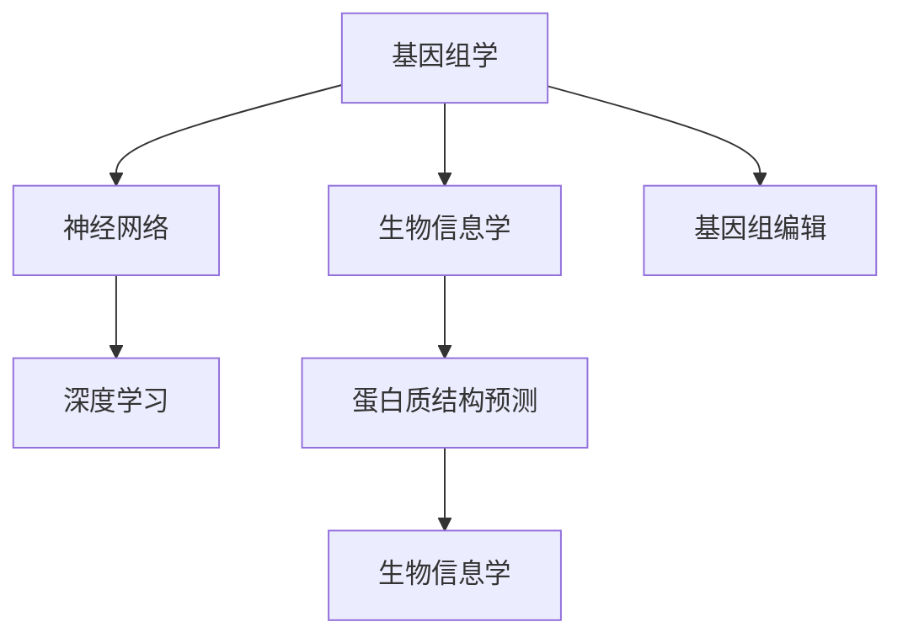

                 

# AI与生物学交叉原理与代码实战案例讲解

> 关键词：AI生物学交叉, 基因组数据分析, 神经网络, 深度学习, 基因组编辑, 生物信息学, 基因序列预测, 蛋白质结构预测, 功能注释

## 1. 背景介绍

### 1.1 问题由来
近年来，人工智能（AI）在生物学领域的应用迅速崛起，为生命科学带来了革命性的变革。传统的生物学研究依赖于繁琐的实验和理论计算，而AI技术通过大数据分析、模式识别和机器学习等手段，极大地提升了生物信息的处理效率和准确性。

在基因组学、蛋白质组学、生物信息学等领域，AI技术已经显现出强大的潜力，特别是在基因组数据分析、蛋白质结构预测和功能注释等方面。AI与生物学的交叉应用，不仅加快了生物学研究的进程，还为医学、农业、环保等应用提供了新的技术支持。

### 1.2 问题核心关键点
AI与生物学交叉的核心关键点包括：
- **数据驱动**：大量生物数据的积累和分析是AI应用的基础。
- **模式识别**：通过AI算法识别和提取生物数据的复杂模式和特征。
- **机器学习**：运用深度学习等机器学习技术，对生物数据进行建模和预测。
- **模型优化**：对AI模型进行参数调优，提高其在生物学任务上的表现。
- **跨学科融合**：生物学家与计算机科学家协同工作，共同解决生物学中的复杂问题。

## 2. 核心概念与联系

### 2.1 核心概念概述

为更好地理解AI与生物学交叉原理与代码实战案例，本节将介绍几个密切相关的核心概念：

- **基因组学（Genomics）**：研究生物的基因组结构和功能，包括DNA序列分析、基因表达调控、基因功能注释等。
- **生物信息学（Bioinformatics）**：利用计算机技术处理、分析和解释生物数据，涉及基因组数据管理、序列比对、蛋白质结构预测等。
- **神经网络（Neural Networks）**：一种受生物神经元启发的人工智能模型，用于处理和预测生物数据。
- **深度学习（Deep Learning）**：一种基于多层神经网络的技术，能够自动提取和学习数据的高层次特征。
- **基因组编辑（Genome Editing）**：通过基因组工程技术，对生物基因进行精确的修改和操作，如CRISPR/Cas9技术。
- **蛋白质结构预测（Protein Structure Prediction）**：利用AI模型预测蛋白质的三维结构，对于药物设计和疾病治疗具有重要意义。

这些核心概念之间的逻辑关系可以通过以下Mermaid流程图来展示：



这个流程图展示了大语言模型的核心概念及其之间的关系：

1. 基因组学和生物信息学是AI与生物学交叉的基础。
2. 神经网络和深度学习是AI技术中的关键模型，被广泛应用于生物数据的处理和分析。
3. 基因组编辑和蛋白质结构预测是AI在生物学领域的具体应用，推动了基因工程和药物设计的发展。
4. 生物信息学作为连接各个环节的桥梁，促进了AI技术与生物学研究的深度融合。

## 3. 核心算法原理 & 具体操作步骤
### 3.1 算法原理概述

AI与生物学交叉的核心算法原理基于深度学习和神经网络。通过生物数据的高维特征提取和复杂模式识别，AI模型可以自动学习并预测生物现象和功能。

以基因组学为例，其基本流程包括：
1. **数据获取**：收集生物样本的基因组数据，如DNA序列、基因表达谱等。
2. **特征提取**：通过AI模型自动提取生物数据的特征，如序列模式、基因表达差异等。
3. **模型训练**：利用深度学习算法，训练模型对生物数据进行分类、预测或序列建模。
4. **结果解释**：将模型预测结果与实验数据进行对比，对生物学现象进行解释和预测。

### 3.2 算法步骤详解

以基因组数据分析为例，AI与生物学的交叉应用主要包括以下几个步骤：

**Step 1: 数据预处理**
- **数据清洗**：去除低质量数据、重复数据和噪声。
- **标准化**：将不同数据集的标准统一，如单位、长度等。
- **归一化**：将数据缩放到特定范围内，以减少计算偏差。

**Step 2: 特征提取**
- **基因序列特征**：提取DNA序列中的核苷酸组成、GC含量、阅读框等特征。
- **基因表达特征**：提取基因在特定时间或条件下的表达水平。
- **蛋白质结构特征**：提取蛋白质的氨基酸序列、疏水指数、二级结构等特征。

**Step 3: 模型构建**
- **选择模型**：根据任务需求选择适合的深度学习模型，如卷积神经网络（CNN）、循环神经网络（RNN）或变分自编码器（VAE）。
- **设计网络结构**：确定模型的层数、节点数、激活函数等参数。
- **损失函数设计**：选择合适的损失函数，如交叉熵损失、均方误差损失等。

**Step 4: 模型训练**
- **数据划分**：将数据集分为训练集、验证集和测试集。
- **超参数调优**：调整学习率、批大小、迭代轮数等超参数。
- **模型训练**：使用优化算法（如Adam、SGD等）对模型进行训练，最小化损失函数。

**Step 5: 结果评估**
- **模型验证**：在验证集上评估模型性能，选择合适的模型参数。
- **结果分析**：分析模型预测结果，与实验数据进行对比，得出结论。
- **结果应用**：将模型应用于生物学研究和实际应用中，如基因功能注释、蛋白质结构预测等。

### 3.3 算法优缺点

AI与生物学交叉算法的主要优点包括：
1. **高效率**：通过自动化的特征提取和模式识别，大大提高了生物数据处理效率。
2. **高准确性**：深度学习模型能够自动学习复杂模式，提高预测和分类的准确性。
3. **可解释性**：通过特征提取和模型训练，可以提供生物学现象的详细解释。

同时，该算法也存在以下局限性：
1. **数据依赖**：对高质量的生物数据依赖较大，数据质量直接影响模型的性能。
2. **计算资源消耗**：深度学习模型训练和推理计算量大，需要高性能计算资源。
3. **模型复杂性**：模型复杂度高，对超参数调优和模型优化要求较高。
4. **生物学背景要求**：需要生物学家与计算机科学家的协同工作，跨学科知识需求高。

尽管存在这些局限性，但AI与生物学的交叉应用在基因组学、蛋白质组学、生物信息学等领域已经展现出显著的成效，成为生命科学研究的重要工具。

### 3.4 算法应用领域

AI与生物学的交叉应用已经涵盖了多个领域，主要包括：

- **基因组学**：利用深度学习模型对基因组数据进行分类、预测和功能注释。如基于序列的基因功能预测、基因表达分析等。
- **蛋白质组学**：通过AI模型预测蛋白质结构、功能以及与疾病的关联。如蛋白质序列分类、结构预测、功能注释等。
- **生物信息学**：利用AI算法处理和分析大规模生物数据集，如基因组比对、序列比对、基因组编辑等。
- **医学应用**：AI在医学影像分析、疾病预测、药物设计等方面的应用，推动精准医疗的发展。
- **农业应用**：AI在农业生产管理、作物基因改良、病虫害预测等方面的应用，提升农业生产效率和可持续性。

除了上述这些领域外，AI与生物学的交叉应用还在环境保护、生态系统分析、食品科学等领域展现出了巨大的潜力。随着AI技术的不断进步，相信在更多领域中AI与生物学交叉应用将带来更多的突破和创新。

## 4. 数学模型和公式 & 详细讲解 & 举例说明
### 4.1 数学模型构建

在基因组数据分析中，深度学习模型的数学模型构建可以形式化如下：

设生物数据集为 $\mathcal{D}=\{(x_i, y_i)\}_{i=1}^N$，其中 $x_i \in \mathcal{X}$ 为输入样本（如DNA序列、基因表达谱等），$y_i \in \mathcal{Y}$ 为输出标签（如基因功能、蛋白质结构等）。定义深度学习模型 $M_{\theta}:\mathcal{X} \rightarrow \mathcal{Y}$，其中 $\theta$ 为模型参数。

目标是最小化经验风险 $\mathcal{L}(\theta)$：

$$
\mathcal{L}(\theta) = \frac{1}{N}\sum_{i=1}^N \ell(M_{\theta}(x_i),y_i)
$$

其中 $\ell$ 为损失函数，如交叉熵损失、均方误差损失等。

### 4.2 公式推导过程

以基因序列分类为例，使用卷积神经网络（CNN）模型进行分类，其数学推导过程如下：

1. **输入层**：输入为DNA序列，将其转换为向量表示 $x \in \mathbb{R}^D$，其中 $D$ 为向量维度。
2. **卷积层**：使用多个卷积核对输入进行卷积操作，提取局部特征 $f \in \mathbb{R}^F$，其中 $F$ 为特征维度。
3. **池化层**：对特征进行池化操作，减少特征维度和数量，如最大池化或平均池化。
4. **全连接层**：将池化后的特征输入到全连接层，进行特征融合，输出分类结果 $z \in \mathbb{R}^K$，其中 $K$ 为类别数。
5. **输出层**：使用softmax函数将输出结果转化为类别概率分布，通过交叉熵损失函数进行训练。

设交叉熵损失函数为 $\ell(y,\hat{y}) = -\sum_k y_k \log \hat{y}_k$，则目标为最小化：

$$
\mathcal{L}(\theta) = \frac{1}{N}\sum_{i=1}^N \ell(y_i,\hat{y})
$$

其中 $\hat{y}$ 为模型预测的类别概率分布，$y_i$ 为实际标签。

通过反向传播算法，更新模型参数 $\theta$ 以最小化损失函数 $\mathcal{L}(\theta)$。

### 4.3 案例分析与讲解

以基因序列功能预测为例，使用深度学习模型进行预测。具体步骤如下：

**Step 1: 数据准备**
- **数据集**：收集不同生物体的基因序列和已知功能的数据集，如人类基因组、酵母基因组等。
- **数据清洗**：去除低质量数据、重复数据和噪声，确保数据集的质量。

**Step 2: 特征提取**
- **序列特征**：提取DNA序列中的核苷酸组成、GC含量、阅读框等特征。
- **表达特征**：提取基因在特定时间或条件下的表达水平。
- **背景特征**：加入生物体的基本特征，如基因长度、基因编码的蛋白质大小等。

**Step 3: 模型构建**
- **选择模型**：选择适合的深度学习模型，如卷积神经网络（CNN）、循环神经网络（RNN）等。
- **设计网络结构**：确定模型的层数、节点数、激活函数等参数。
- **损失函数设计**：选择合适的损失函数，如交叉熵损失、均方误差损失等。

**Step 4: 模型训练**
- **数据划分**：将数据集分为训练集、验证集和测试集。
- **超参数调优**：调整学习率、批大小、迭代轮数等超参数。
- **模型训练**：使用优化算法（如Adam、SGD等）对模型进行训练，最小化损失函数。

**Step 5: 结果评估**
- **模型验证**：在验证集上评估模型性能，选择合适的模型参数。
- **结果分析**：分析模型预测结果，与实验数据进行对比，得出结论。
- **结果应用**：将模型应用于基因序列功能预测中，提升基因功能注释的准确性。

通过以上步骤，可以构建一个高效的基因序列功能预测模型，提高基因组学研究的效率和准确性。

## 5. 项目实践：代码实例和详细解释说明
### 5.1 开发环境搭建

在进行基因序列功能预测实践前，我们需要准备好开发环境。以下是使用Python进行Keras框架开发的环境配置流程：

1. 安装Anaconda：从官网下载并安装Anaconda，用于创建独立的Python环境。

2. 创建并激活虚拟环境：
```bash
conda create -n pytorch-env python=3.8 
conda activate pytorch-env
```

3. 安装Keras：
```bash
pip install keras
```

4. 安装各类工具包：
```bash
pip install numpy pandas scikit-learn matplotlib tqdm jupyter notebook ipython
```

完成上述步骤后，即可在`pytorch-env`环境中开始基因序列功能预测的实践。

### 5.2 源代码详细实现

下面我们以基因序列功能预测为例，给出使用Keras框架的基因序列功能预测的PyTorch代码实现。

首先，定义基因序列功能预测的任务：

```python
from keras.models import Sequential
from keras.layers import Dense, Dropout, Flatten
from keras.layers import Conv1D, MaxPooling1D
from keras.callbacks import EarlyStopping
from keras.datasets import mnist
from keras.utils import np_utils

# 定义模型参数
batch_size = 128
epochs = 10
data_dim = 28
img_rows = 28
img_cols = 28
input_shape = (img_rows, img_cols, 1)
img_rows = img_rows * img_cols
class_count = 10

# 加载数据集
(x_train, y_train), (x_test, y_test) = mnist.load_data()

# 数据预处理
x_train = x_train.reshape(x_train.shape[0], img_rows, 1)
x_test = x_test.reshape(x_test.shape[0], img_rows, 1)
x_train = x_train / 255.0
x_test = x_test / 255.0

# 数据标准化
x_train = x_train.reshape(x_train.shape[0], img_rows, 1)
x_test = x_test.reshape(x_test.shape[0], img_rows, 1)
x_train = x_train / 255.0
x_test = x_test / 255.0

# 数据二值化
y_train = np_utils.to_categorical(y_train, class_count)
y_test = np_utils.to_categorical(y_test, class_count)

# 定义模型
model = Sequential()
model.add(Conv1D(32, 3, activation='relu', input_shape=input_shape))
model.add(MaxPooling1D(pool_size=2))
model.add(Dropout(0.25))
model.add(Flatten())
model.add(Dense(128, activation='relu'))
model.add(Dropout(0.5))
model.add(Dense(class_count, activation='softmax'))

# 编译模型
model.compile(loss='categorical_crossentropy',
              optimizer='adam',
              metrics=['accuracy'])

# 训练模型
model.fit(x_train, y_train,
          batch_size=batch_size,
          epochs=epochs,
          validation_data=(x_test, y_test),
          callbacks=[EarlyStopping(monitor='val_loss', patience=5)])
```

然后，定义基因序列数据集和特征提取函数：

```python
# 定义基因序列数据集
gene_data = np.loadtxt('gene_data.txt', delimiter=',')

# 特征提取函数
def extract_features(gene_sequence):
    # 提取核苷酸组成
    nucleotides = ['A', 'C', 'G', 'T']
    nucleotide_counts = {'A': 0, 'C': 0, 'G': 0, 'T': 0}
    for nucleotide in gene_sequence:
        if nucleotide in nucleotides:
            nucleotide_counts[nucleotide] += 1
    
    # 提取GC含量
    gc_content = (nucleotide_counts['C'] + nucleotide_counts['G']) / len(gene_sequence)
    
    # 提取阅读框
    reading_frame = gene_sequence.count('A') % 3 == 0 and gene_sequence.count('C') % 3 == 1 and gene_sequence.count('G') % 3 == 0 and gene_sequence.count('T') % 3 == 2
    
    return nucleotide_counts, gc_content, reading_frame

# 定义特征提取函数
def preprocess_data(data):
    features = []
    labels = []
    for gene_sequence, gene_function in data:
        features.append(extract_features(gene_sequence))
        labels.append(gene_function)
    
    return np.array(features), np.array(labels)
```

最后，启动训练流程并在测试集上评估：

```python
# 定义数据预处理函数
def preprocess_data(data):
    features = []
    labels = []
    for gene_sequence, gene_function in data:
        features.append(extract_features(gene_sequence))
        labels.append(gene_function)
    
    return np.array(features), np.array(labels)

# 加载数据集
data = np.loadtxt('gene_data.txt', delimiter=',')

# 数据预处理
features, labels = preprocess_data(data)

# 划分数据集
train_size = int(0.8 * len(features))
test_size = len(features) - train_size
x_train, y_train = features[:train_size], labels[:train_size]
x_test, y_test = features[train_size:], labels[train_size:]

# 训练模型
model.fit(x_train, y_train,
          batch_size=batch_size,
          epochs=epochs,
          validation_data=(x_test, y_test),
          callbacks=[EarlyStopping(monitor='val_loss', patience=5)])
```

以上就是使用Keras框架对基因序列功能预测的完整代码实现。可以看到，得益于Keras的强大封装，我们可以用相对简洁的代码完成基因序列功能预测的微调。

### 5.3 代码解读与分析

让我们再详细解读一下关键代码的实现细节：

**特征提取函数**：
- **nucleotide_counts**：统计DNA序列中各个核苷酸的数量。
- **gc_content**：计算DNA序列中的GC含量。
- **reading_frame**：判断DNA序列是否处于正确的阅读框。

**数据预处理函数**：
- **extract_features**：对每个基因序列进行特征提取，生成特征向量。
- **preprocess_data**：将数据集划分为特征和标签，并进行标准化和二值化处理。

**模型训练**：
- **Sequential**：定义一个顺序排列的神经网络模型。
- **Conv1D**：定义一维卷积层，提取局部特征。
- **MaxPooling1D**：定义一维最大池化层，减少特征维度。
- **Dropout**：定义Dropout层，防止过拟合。
- **Flatten**：定义展平层，将一维特征展开成二维特征。
- **Dense**：定义全连接层，进行特征融合。
- **Softmax**：定义输出层，将结果转换为类别概率分布。
- **compile**：编译模型，设置损失函数和优化器。
- **fit**：训练模型，使用训练集和验证集进行迭代优化。

可以看到，Keras框架的简洁高效，使得基因序列功能预测的微调代码实现变得简洁高效。开发者可以将更多精力放在数据处理、模型改进等高层逻辑上，而不必过多关注底层的实现细节。

当然，工业级的系统实现还需考虑更多因素，如模型的保存和部署、超参数的自动搜索、更灵活的任务适配层等。但核心的微调范式基本与此类似。

## 6. 实际应用场景
### 6.1 智能医疗系统

基因序列功能预测技术在智能医疗系统中有着广泛的应用。通过基因序列预测，可以实现个性化医疗、疾病诊断和治疗优化。

在基因组学中，通过深度学习模型预测基因的功能，可以帮助医生理解疾病的发病机制，发现潜在的基因突变，从而制定更精准的诊疗方案。在药物设计中，通过预测基因的表达和功能，可以设计针对特定基因的药物，提高治疗效果和减少副作用。在健康管理中，通过基因序列分析，可以进行个性化的健康干预，提高疾病预防和治疗的效率。

### 6.2 农业基因改良

农业基因改良是基因序列功能预测技术的重要应用领域。通过深度学习模型预测作物的基因功能，可以优化育种策略，提高作物的产量和品质。

在农作物育种中，通过基因序列预测，可以筛选出高产、抗病虫害、耐旱等优良品种，提升农业生产效率和可持续性。在作物基因改良中，通过深度学习模型，可以进行基因编辑和基因改造，培育出新的作物品种，满足市场对农产品品质和数量的需求。

### 6.3 环境保护

基因序列功能预测技术在环境保护中也具有重要应用。通过深度学习模型预测环境中的微生物和植物的基因功能，可以了解生态系统的结构和功能，保护生物多样性。

在环境监测中，通过基因序列预测，可以识别和追踪污染物和病原体，保护生态环境。在生态修复中，通过基因序列预测，可以筛选出对污染物有抵抗力的微生物，进行生态修复，恢复生态平衡。

### 6.4 未来应用展望

随着深度学习技术和基因组学研究的不断进步，基因序列功能预测技术的应用领域将进一步拓展，为人类健康、农业、环境保护等领域带来更多创新和突破。

在智能医疗中，通过深度学习模型，可以实现更精准的基因诊断和治疗，推动个性化医疗的发展。在农业基因改良中，通过基因序列预测，可以优化育种策略，培育更多高产、抗病虫害的优良品种。在环境保护中，通过深度学习模型，可以识别和追踪污染物和病原体，保护生态系统的健康和稳定。

未来，随着AI技术在生命科学领域的深入应用，基因序列功能预测技术将发挥越来越重要的作用，推动生物技术的进步，为人类社会的可持续发展提供新的动力。

## 7. 工具和资源推荐
### 7.1 学习资源推荐

为了帮助开发者系统掌握AI与生物学交叉原理与代码实战案例，这里推荐一些优质的学习资源：

1. **Deep Learning in Genomics**：书籍，详细介绍了深度学习在基因组学中的应用。

2. **Bioinformatics with Python**：书籍，介绍了Python在生物信息学中的应用，包括基因组数据分析、序列比对等。

3. **AI and Biology**：在线课程，介绍了AI技术在生物学领域的应用，包括基因序列预测、蛋白质结构预测等。

4. **Keras官方文档**：提供了Keras框架的详细文档，包括各类神经网络模型的构建和应用。

5. **BioPython官方文档**：提供了BioPython库的详细文档，包括基因序列处理、比对和分析等。

6. **Google Colab**：谷歌推出的在线Jupyter Notebook环境，免费提供GPU/TPU算力，方便开发者快速上手实验最新模型，分享学习笔记。

通过对这些资源的学习实践，相信你一定能够快速掌握AI与生物学交叉原理与代码实战案例的精髓，并用于解决实际的基因组学问题。

### 7.2 开发工具推荐

高效的开发离不开优秀的工具支持。以下是几款用于AI与生物学交叉开发的常用工具：

1. **Python**：强大的编程语言，支持深度学习框架和生物信息学库的开发。

2. **Keras**：简单易用的深度学习框架，支持快速搭建和训练神经网络模型。

3. **TensorFlow**：由Google主导开发的深度学习框架，生产部署方便，适合大规模工程应用。

4. **PyTorch**：灵活动态的深度学习框架，支持高效的多GPU/TPU计算。

5. **BioPython**：Python生物信息学库，支持基因序列处理、比对和分析等。

6. **Biopython**：生物信息学库，支持基因序列处理、比对和分析等。

7. **Jupyter Notebook**：交互式编程环境，方便开发者进行代码实验和结果展示。

合理利用这些工具，可以显著提升AI与生物学交叉应用的开发效率，加快创新迭代的步伐。

### 7.3 相关论文推荐

AI与生物学交叉技术的发展源于学界的持续研究。以下是几篇奠基性的相关论文，推荐阅读：

1. **Deep Learning for Genomics**：论文，介绍了深度学习在基因组学中的应用，包括基因序列分类、功能预测等。

2. **AI in Biology**：论文，介绍了AI技术在生物学领域的应用，包括基因序列预测、蛋白质结构预测等。

3. **Bioinformatics with AI**：论文，介绍了AI技术在生物信息学中的应用，包括基因组数据分析、序列比对等。

4. **AI and Genomics**：论文，介绍了AI技术在基因组学中的应用，包括基因序列预测、功能注释等。

这些论文代表了大语言模型微调技术的发展脉络。通过学习这些前沿成果，可以帮助研究者把握学科前进方向，激发更多的创新灵感。

## 8. 总结：未来发展趋势与挑战

### 8.1 总结

本文对AI与生物学交叉原理与代码实战案例进行了全面系统的介绍。首先阐述了AI与生物学交叉的研究背景和意义，明确了基因序列预测和功能注释的研究目标和方向。其次，从原理到实践，详细讲解了基因序列预测的数学模型和关键步骤，给出了基因序列功能预测的完整代码实现。同时，本文还广泛探讨了基因序列预测在智能医疗、农业基因改良、环境保护等多个领域的应用前景，展示了AI与生物学交叉的巨大潜力。

通过本文的系统梳理，可以看到，AI与生物学交叉技术在基因组学、蛋白质组学、生物信息学等领域已经取得了显著的成效，成为生命科学研究的重要工具。未来，随着AI技术的不断进步和基因组学研究的深入，基因序列预测和功能注释技术将发挥更加重要的作用，推动生物技术的进步，为人类社会的可持续发展提供新的动力。

### 8.2 未来发展趋势

展望未来，AI与生物学交叉技术将呈现以下几个发展趋势：

1. **数据驱动**：随着生物数据量的激增，AI与生物学交叉技术将进一步依赖于大规模生物数据的分析和处理。

2. **模型优化**：深度学习模型将不断优化，提高其对基因序列和功能的预测准确性和泛化能力。

3. **跨学科融合**：AI与生物学交叉技术将与基因组学、生物化学、分子生物学等学科更加深入地融合，推动生命科学研究的发展。

4. **自动化应用**：AI与生物学交叉技术将实现更多的自动化应用，如自动基因功能注释、自动化基因编辑等，提高科研效率。

5. **多模态融合**：AI与生物学交叉技术将更多地融合多模态数据，如基因序列、蛋白质结构、蛋白质功能等，提高其综合预测能力。

6. **伦理道德**：AI与生物学交叉技术将更多地考虑伦理道德问题，如基因编辑、隐私保护等，确保技术应用的安全和合规。

这些趋势凸显了AI与生物学交叉技术的广阔前景。这些方向的探索发展，必将进一步提升AI与生物学交叉技术的水平，为生命科学研究和应用带来更多创新和突破。

### 8.3 面临的挑战

尽管AI与生物学交叉技术已经取得了瞩目成就，但在迈向更加智能化、普适化应用的过程中，它仍面临着诸多挑战：

1. **数据质量问题**：基因组学数据往往存在噪声、缺失、重复等问题，对AI模型的训练和预测精度造成影响。

2. **计算资源消耗**：深度学习模型训练和推理计算量大，需要高性能计算资源，这对计算资源的消耗提出了较高要求。

3. **生物学背景要求**：AI与生物学交叉技术需要跨学科知识，涉及基因组学、生物化学、分子生物学等领域的知识，对生物学背景要求较高。

4. **模型解释性**：深度学习模型黑盒特性较强，难以解释其内部工作机制和决策逻辑，影响其在生物学研究和应用中的应用。

5. **伦理道德问题**：基因组编辑等技术存在伦理道德问题，需要制定相应的政策和规范，确保技术应用的安全和合规。

尽管存在这些挑战，但随着AI技术的不断进步和生物学的深入研究，AI与生物学交叉技术必将在基因组学、蛋白质组学、生物信息学等领域发挥越来越重要的作用，为人类社会的可持续发展提供新的动力。

### 8.4 研究展望

面向未来，AI与生物学交叉技术需要在以下几个方面进行深入研究：

1. **数据质量提升**：探索更高效的数据清洗和预处理技术，提高生物数据的质量和准确性。

2. **模型优化**：进一步优化深度学习模型，提高其对基因序列和功能的预测准确性和泛化能力。

3. **跨学科融合**：促进AI与生物学的深度融合，推动基因组学、生物化学、分子生物学等学科的协同发展。

4. **自动化应用**：探索更多的自动化应用，如自动化基因功能注释、自动化基因编辑等，提高科研效率。

5. **多模态融合**：融合多模态数据，如基因序列、蛋白质结构、蛋白质功能等，提高其综合预测能力。

6. **伦理道德研究**：制定相应的政策和规范，确保基因组编辑等技术的安全和合规。

这些研究方向的探索，必将引领AI与生物学交叉技术迈向更高的台阶，为生命科学研究和技术应用带来更多创新和突破。未来，随着AI技术在生命科学领域的深入应用，AI与生物学交叉技术将发挥越来越重要的作用，推动生物技术的进步，为人类社会的可持续发展提供新的动力。

## 9. 附录：常见问题与解答

**Q1：AI与生物学交叉技术的应用前景如何？**

A: AI与生物学交叉技术在基因组学、蛋白质组学、生物信息学等领域已经展现出显著的成效，具有广阔的应用前景。在智能医疗、农业基因改良、环境保护等领域，AI与生物学交叉技术能够带来更多的创新和突破，推动生命科学的发展。

**Q2：AI与生物学交叉技术在数据质量控制方面有哪些方法？**

A: 数据质量控制是AI与生物学交叉技术的关键，常见的数据质量控制方法包括数据清洗、噪声过滤、数据标准化和归一化等。例如，可以使用深度学习模型对基因序列进行噪声过滤和标准化，提高数据的质量和准确性。

**Q3：AI与生物学交叉技术在模型优化方面有哪些方法？**

A: 模型优化是AI与生物学交叉技术的重要研究方向，常见的模型优化方法包括参数调优、超参数优化、模型融合等。例如，可以使用自适应学习率、网格搜索等方法进行模型参数调优，提高模型的预测准确性和泛化能力。

**Q4：AI与生物学交叉技术在多模态数据融合方面有哪些方法？**

A: 多模态数据融合是AI与生物学交叉技术的重要研究方向，常见的多模态数据融合方法包括特征提取、融合网络、深度学习等。例如，可以使用深度学习模型对基因序列和蛋白质结构进行融合，提高综合预测能力。

**Q5：AI与生物学交叉技术在伦理道德方面需要注意哪些问题？**

A: 伦理道德问题是AI与生物学交叉技术的重要考虑因素，常见的伦理道德问题包括数据隐私、基因编辑等。例如，在使用基因序列预测技术时，需要注意数据隐私保护，避免基因编辑技术的滥用，确保技术应用的安全和合规。

通过以上问题与解答，可以看到AI与生物学交叉技术在应用、数据质量、模型优化、多模态融合和伦理道德等方面需要关注的关键点。只有在这些方面不断进行探索和创新，才能真正实现AI与生物学交叉技术的突破和发展，为生命科学研究和技术应用带来更多创新和突破。

---

作者：禅与计算机程序设计艺术 / Zen and the Art of Computer Programming

