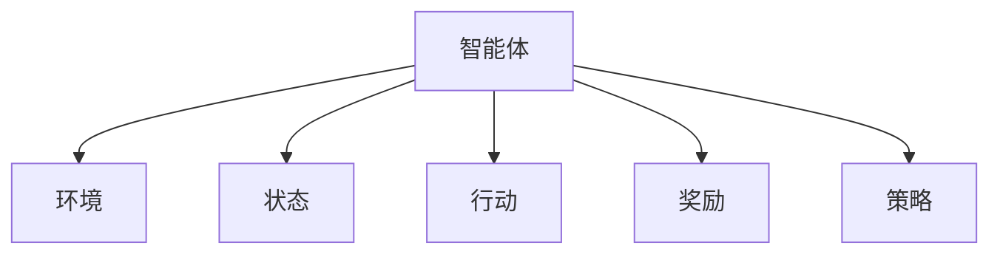
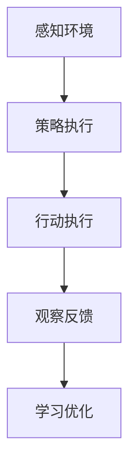

                 

# AI人工智能 Agent：资源配置中智能体的应用

## 1. 背景介绍

### 1.1 问题由来
资源配置是企业信息化过程中一个常见且核心的场景，涉及到设备、人员、资金等各类资源的规划与调度。传统的手工调度和经验管理方法，往往效率低下、灵活性差，难以应对快速变化的市场需求。然而，通过引入AI技术，可以构建智能化的资源配置系统，实现资源的高效、精准管理。

在资源配置领域，AI的应用可以从多个层面展开，如需求预测、动态调度、应急响应等。其中，AI智能体作为资源配置的核心组件，通过自主学习和智能决策，实现了资源配置系统的自动化和智能化。

### 1.2 问题核心关键点
AI智能体（Artificial Intelligence Agent），本质上是一种自主行动、能感知环境并作出决策的计算实体。在资源配置领域，智能体通过感知资源和环境信息，对资源需求进行预测和调度，生成资源分配方案，实现资源的优化配置。

智能体在资源配置中的应用，关键点包括：

- 环境感知与状态跟踪：智能体需要实时监测资源的状态（如设备运行状态、人员可用性等），感知环境变化（如订单变化、设备故障等）。
- 预测与决策：智能体需要根据感知到的信息进行预测（如预测需求量、预测故障概率等），并作出决策（如调度人员、调整设备等）。
- 交互与协作：智能体需要与其他智能体（如调度中心、物流中心等）进行沟通与协作，共同完成复杂的资源配置任务。
- 学习能力与自适应：智能体需要具备学习能力，能够从历史数据中学习经验，自适应环境变化，不断优化决策策略。

本文将重点探讨如何在资源配置中应用AI智能体，实现资源的智能管理和高效调度。

## 2. 核心概念与联系

### 2.1 核心概念概述

为更好地理解AI智能体在资源配置中的应用，本节将介绍几个密切相关的核心概念：

- **智能体（Agent）**：一个自主行动的计算实体，能够感知环境并作出决策。
- **环境（Environment）**：智能体交互的外部世界，包括所有影响智能体决策的因素。
- **状态（State）**：智能体和环境的重要信息集合，决定智能体的行为。
- **行动（Action）**：智能体对环境执行的操作，直接影响环境的后续状态。
- **奖励（Reward）**：智能体在执行行动后获取的反馈信号，引导智能体的行为学习。
- **策略（Policy）**：智能体行动的规则，指导智能体在不同状态下应采取的行动。

这些概念通过图1所示的Mermaid流程图展现：




### 2.2 核心概念原理和架构

智能体的核心工作原理是通过感知环境状态，依据策略生成行动，并根据奖励反馈调整策略。其工作流程可以概括为以下几个关键步骤：

1. **感知环境**：智能体通过传感器等手段获取环境的状态信息，如资源设备的运行状态、订单需求的变化情况等。

2. **策略执行**：智能体根据当前状态和预定义的策略，决定要执行的行动，如调度资源、调整订单等。

3. **行动执行**：智能体通过与环境的交互，执行预定的行动，如向设备下达命令、更新订单状态等。

4. **观察反馈**：智能体观察行动执行后的环境变化，获取反馈信息，如订单完成情况、设备运行状态等。

5. **学习优化**：智能体根据反馈信息，使用强化学习等方法调整策略，优化行动效果，如调整调度方案、优化资源分配等。

以上步骤通过图2所示的Mermaid流程图展现：




这些核心概念和原理构成了智能体的核心工作机制，通过不断地感知、决策、执行和优化，智能体能够实现对资源的智能管理和高效调度。

## 3. 核心算法原理 & 具体操作步骤

### 3.1 算法原理概述

在资源配置领域，智能体通过强化学习（Reinforcement Learning, RL）算法进行学习和优化。强化学习的核心思想是：智能体通过与环境的交互，依据当前的策略和行动，最大化长期的累积奖励，从而学习到最优的策略。

具体而言，智能体在每次行动后都会收到环境给予的奖励，智能体的目标是找到一种策略，使得在每个时刻的累积奖励最大化。

强化学习的数学框架可以表示为：

- **状态空间**：$\mathcal{S}$，描述智能体和环境的所有可能状态。
- **动作空间**：$\mathcal{A}$，描述智能体在某个状态下可执行的所有动作。
- **策略**：$\pi$，描述智能体在每个状态下选择动作的概率分布。
- **奖励函数**：$r$，描述智能体在某个状态下执行动作后的奖励值。
- **状态转移概率**：$p$，描述智能体在某个状态下执行某个动作后，状态转移到下一个状态的分布。

智能体的目标是在给定状态下，找到最优策略 $\pi^*$，使得期望的长期累积奖励最大化：

$$
\max_\pi \mathbb{E}_\pi \left[\sum_{t=0}^\infty \gamma^t r_t\right]
$$

其中，$\gamma$ 是折扣因子，用于调整未来奖励的重要性。

### 3.2 算法步骤详解

基于强化学习的智能体在资源配置中的应用，一般包括以下关键步骤：

**Step 1: 准备环境与策略**
- 定义资源配置环境，包括资源的物理属性、环境的运行规则等。
- 选择合适的初始策略，如随机策略、贪婪策略等，作为智能体的行动基础。

**Step 2: 环境感知与状态跟踪**
- 通过传感器等手段，实时获取资源的状态信息，如设备运行状态、订单需求等。
- 使用马尔科夫决策过程（MDP）模型，将环境状态映射为智能体的内部状态。

**Step 3: 策略执行与行动生成**
- 根据当前状态和策略，生成智能体要执行的行动，如调度资源、调整订单等。
- 将行动转化为实际的资源配置操作，如向设备下达命令、更新订单状态等。

**Step 4: 观察反馈与奖励获取**
- 观察行动执行后的环境变化，获取反馈信息，如订单完成情况、设备运行状态等。
- 根据奖励函数计算智能体获得的奖励，如订单完成获得的奖励、设备故障惩罚的奖励等。

**Step 5: 学习优化与策略更新**
- 使用强化学习算法，根据奖励信息更新智能体的策略，优化行动效果。
- 更新智能体的参数，如神经网络权重、决策规则等，以更好地适应环境变化。

**Step 6: 循环迭代**
- 重复执行步骤2至5，直至达到预设的迭代次数或满足预设的性能指标。

### 3.3 算法优缺点

基于强化学习的智能体在资源配置中的应用，具有以下优点：

- 灵活性强：智能体能够根据环境和需求的变化，实时调整策略和行动，适应性强。
- 适应性强：智能体能够从历史数据中学习经验，自适应环境变化，优化决策策略。
- 动态调整：智能体能够实时感知环境状态，动态调整资源配置方案，提高资源利用率。

但同时也存在以下缺点：

- 复杂度高：强化学习算法通常需要大量的计算资源和训练数据，实现起来较为复杂。
- 策略收敛难度大：强化学习算法需要从大量随机策略开始，逐步学习最优策略，收敛难度大。
- 优化难度高：智能体的行动效果受多种因素影响，优化难度较高。

### 3.4 算法应用领域

基于强化学习的智能体在资源配置中的应用，可以应用于以下多个领域：

- **设备调度**：智能体根据设备运行状态和订单需求，生成最优的调度方案，提高设备利用率。
- **订单管理**：智能体根据订单状态和资源情况，动态调整订单分配方案，提升订单处理效率。
- **库存管理**：智能体根据库存量、需求量等状态信息，优化库存策略，减少库存成本。
- **物流优化**：智能体根据物流网络、交通情况等环境信息，生成最优的物流方案，提升运输效率。
- **能耗管理**：智能体根据设备能耗、环境温度等状态信息，调整设备运行策略，降低能耗成本。

## 4. 数学模型和公式 & 详细讲解

### 4.1 数学模型构建

在本节中，我们将使用数学语言对基于强化学习的资源配置智能体进行更加严格的刻画。

假设资源配置环境为马尔科夫决策过程（MDP），即每个状态 $s_t$ 和每个动作 $a_t$ 都有固定的状态转移概率 $p(s_{t+1}|s_t,a_t)$ 和奖励函数 $r_t$。智能体的目标是在给定状态下，找到最优策略 $\pi$，使得长期的累积奖励最大化。

定义智能体的策略为 $\pi$，即在每个状态下选择动作的概率分布：

$$
\pi(a_t|s_t) = P(a_t|s_t)
$$

定义智能体的价值函数为 $V$，即在当前状态下，智能体期望的长期累积奖励：

$$
V(s_t) = \mathbb{E}_\pi \left[\sum_{t=0}^\infty \gamma^t r_t\right]
$$

智能体的目标是在每个状态下，找到最优动作 $a_t$：

$$
\max_{a_t} \pi(a_t|s_t)V(s_t)
$$

根据以上定义，可以使用动态规划方法求解最优策略。动态规划的核心思想是将问题分解为多个子问题，逐步求解，最终得到最优策略。

### 4.2 公式推导过程

以下我们以设备调度为例，推导强化学习算法在资源配置中的应用。

假设智能体需要在多个设备间进行任务调度，设备 $i$ 在状态 $s_t$ 下执行动作 $a_t$ 后，转移到下一个状态 $s_{t+1}$，并得到奖励 $r_t$。智能体的目标是找到最优调度策略，使得长期累积收益最大化。

具体而言，假设智能体有 $n$ 个设备，每个设备有一个任务队列 $L_i$，智能体的策略是在每个时刻选择执行的任务 $a_t$，并将任务 $a_t$ 分配到设备 $i$ 上执行。

智能体的状态空间为：

$$
\mathcal{S} = \{(s_i,L_1,...,L_n)|s_i \in [0,1], L_i \in [0,+\infty)\}
$$

智能体的动作空间为：

$$
\mathcal{A} = \{(i,j)|i \in [1,n], j \in [0,1]\}
$$

智能体的策略为：

$$
\pi(a_t|s_t) = P(a_t|s_t) = \pi_i(s_i)\pi_j(i)
$$

其中，$\pi_i(s_i)$ 表示在设备 $i$ 上选择动作 $a_t$ 的概率，$\pi_j(i)$ 表示将任务 $a_t$ 分配到设备 $i$ 上执行的概率。

智能体的奖励函数为：

$$
r_t = -\lambda_i\delta_i + r_{\text{job}} \delta_i
$$

其中，$\lambda_i$ 表示设备 $i$ 的空闲惩罚系数，$r_{\text{job}}$ 表示完成任务的奖励。

智能体的状态转移概率为：

$$
p(s_{t+1}|s_t,a_t) = P(s_{t+1}|s_t) = p_i(s_i|s_t,a_t)P_j(s_j|s_i,a_t)
$$

其中，$p_i(s_i|s_t,a_t)$ 表示设备 $i$ 在状态 $s_i$ 下执行动作 $a_t$ 后，转移到下一个状态 $s_{t+1}$ 的概率，$p_j(s_j|s_i,a_t)$ 表示将任务 $a_t$ 分配到设备 $i$ 上执行后，设备 $j$ 转移到下一个状态 $s_{t+1}$ 的概率。

智能体的价值函数 $V$ 可以表示为：

$$
V(s_t) = \mathbb{E}_\pi \left[\sum_{t=0}^\infty \gamma^t r_t\right]
$$

根据以上定义，可以使用动态规划方法求解最优策略。具体而言，可以通过贝尔曼方程：

$$
V(s_t) = \max_{a_t} \pi(a_t|s_t) \left\{ r_t + \gamma \sum_{s_{t+1}} p(s_{t+1}|s_t,a_t)V(s_{t+1}) \right\}
$$

求解最优策略 $\pi^*$，即：

$$
\pi^*(a_t|s_t) = \arg\max_{a_t} \left\{ r_t + \gamma \sum_{s_{t+1}} p(s_{t+1}|s_t,a_t)V^*(s_{t+1}) \right\}
$$

其中，$V^*$ 表示最优价值函数。

### 4.3 案例分析与讲解

以设备调度的案例为例，智能体需要在多个设备间进行任务调度，设备 $i$ 在状态 $s_t$ 下执行动作 $a_t$ 后，转移到下一个状态 $s_{t+1}$，并得到奖励 $r_t$。智能体的目标是找到最优调度策略，使得长期累积收益最大化。

假设智能体有3个设备，设备1和设备2有一个任务队列，设备3的任务队列为空。智能体的目标是在每个时刻选择执行的任务 $a_t$，并将任务 $a_t$ 分配到设备上执行，使得长期累积收益最大化。

定义智能体的策略为：

$$
\pi(a_t|s_t) = P(a_t|s_t) = \pi_1(s_1)\pi_2(s_2)\pi_3(s_3)
$$

其中，$\pi_1(s_1)$ 表示在设备1上选择动作 $a_t$ 的概率，$\pi_2(s_2)$ 表示在设备2上选择动作 $a_t$ 的概率，$\pi_3(s_3)$ 表示在设备3上选择动作 $a_t$ 的概率。

智能体的奖励函数为：

$$
r_t = -\lambda_1\delta_1 + r_{\text{job}} \delta_1
$$

其中，$\lambda_1$ 表示设备1的空闲惩罚系数，$r_{\text{job}}$ 表示完成任务的奖励。

智能体的状态转移概率为：

$$
p(s_{t+1}|s_t,a_t) = P(s_{t+1}|s_t) = p_1(s_1|s_t,a_t)p_2(s_2|s_t,a_t)p_3(s_3|s_t,a_t)
$$

其中，$p_1(s_1|s_t,a_t)$ 表示设备1在状态 $s_1$ 下执行动作 $a_t$ 后，转移到下一个状态 $s_{t+1}$ 的概率，$p_2(s_2|s_t,a_t)$ 表示设备2在状态 $s_2$ 下执行动作 $a_t$ 后，转移到下一个状态 $s_{t+1}$ 的概率，$p_3(s_3|s_t,a_t)$ 表示设备3在状态 $s_3$ 下执行动作 $a_t$ 后，转移到下一个状态 $s_{t+1}$ 的概率。

智能体的价值函数 $V$ 可以表示为：

$$
V(s_t) = \mathbb{E}_\pi \left[\sum_{t=0}^\infty \gamma^t r_t\right]
$$

使用动态规划方法求解最优策略 $\pi^*$，即：

$$
\pi^*(a_t|s_t) = \arg\max_{a_t} \left\{ r_t + \gamma \sum_{s_{t+1}} p(s_{t+1}|s_t,a_t)V^*(s_{t+1}) \right\}
$$

其中，$V^*$ 表示最优价值函数。

## 5. 项目实践：代码实例和详细解释说明

### 5.1 开发环境搭建

在进行智能体微调实践前，我们需要准备好开发环境。以下是使用Python进行PyTorch开发的环境配置流程：

1. 安装Anaconda：从官网下载并安装Anaconda，用于创建独立的Python环境。

2. 创建并激活虚拟环境：
```bash
conda create -n pytorch-env python=3.8 
conda activate pytorch-env
```

3. 安装PyTorch：根据CUDA版本，从官网获取对应的安装命令。例如：
```bash
conda install pytorch torchvision torchaudio cudatoolkit=11.1 -c pytorch -c conda-forge
```

4. 安装TensorBoard：
```bash
pip install tensorboard
```

5. 安装各类工具包：
```bash
pip install numpy pandas scikit-learn matplotlib tqdm jupyter notebook ipython
```

完成上述步骤后，即可在`pytorch-env`环境中开始智能体微调实践。

### 5.2 源代码详细实现

这里我们以设备调度为例，使用PyTorch实现一个简单的智能体微调系统。

首先，定义设备调度的MDP模型：

```python
import torch
import numpy as np
from torch import nn
from torch.distributions import Categorical

class MDPModel(nn.Module):
    def __init__(self, num_devices, num_actions, state_dim):
        super(MDPModel, self).__init__()
        self.num_devices = num_devices
        self.num_actions = num_actions
        self.state_dim = state_dim
        self.fc1 = nn.Linear(state_dim, 64)
        self.fc2 = nn.Linear(64, num_devices)
        self.fc3 = nn.Linear(num_devices, num_actions)

    def forward(self, x):
        x = self.fc1(x)
        x = torch.relu(x)
        x = self.fc2(x)
        x = torch.relu(x)
        x = self.fc3(x)
        x = torch.softmax(x, dim=1)
        return x
```

然后，定义智能体的行动策略和价值函数：

```python
class Agent:
    def __init__(self, model, num_devices, num_actions, discount_factor=0.99):
        self.model = model
        self.num_devices = num_devices
        self.num_actions = num_actions
        self.discount_factor = discount_factor
        self.optimizer = torch.optim.Adam(self.model.parameters(), lr=0.01)
        self.criterion = nn.CrossEntropyLoss()
        self.replay_buffer = []
        self.memory = []
        self.batch_size = 32

    def select_action(self, state):
        state = torch.tensor(state, dtype=torch.float32)
        with torch.no_grad():
            action_probs = self.model(state)
        action = np.random.choice(self.num_actions, p=action_probs.numpy()[0])
        return action

    def observe_reward(self, reward):
        self.memory.append((reward, np.zeros(self.num_devices)))
        if len(self.memory) >= self.batch_size:
            self.memory = self.memory[-self.batch_size:]
            batch_memory = np.vstack([np.array(memory) for memory in self.memory])
            self.replay_buffer.extend(batch_memory)
            self.memory = []
            self.train()

    def train(self):
        rewards, next_states = zip(*self.replay_buffer)
        rewards = np.array(rewards)
        next_states = np.array(next_states)
        rewards = np.expand_dims(rewards, axis=1)
        next_states = np.expand_dims(next_states, axis=1)
        batch = np.concatenate((rewards, next_states), axis=1)
        batch = torch.tensor(batch, dtype=torch.float32)
        with torch.no_grad():
            next_values = self.model(batch[:, 0, :])
            q_values = self.model(batch[:, 1, :])
        q_values = q_values.view(-1, self.num_actions)
        targets = next_values * self.discount_factor + rewards
        targets = torch.tensor(targets, dtype=torch.float32)
        targets = targets.view(-1, self.num_actions)
        self.optimizer.zero_grad()
        loss = self.criterion(q_values, targets)
        loss.backward()
        self.optimizer.step()
```

接下来，定义训练流程和测试流程：

```python
from gym import spaces

def train_agent():
    env = gym.make('CartPole-v1')
    agent = Agent(model, env.observation_space.shape[0], env.action_space.n)
    state = np.zeros(env.observation_space.shape)
    for episode in range(100):
        state = np.zeros(env.observation_space.shape)
        for t in range(1000):
            action = agent.select_action(state)
            next_state, reward, done, _ = env.step(action)
            state = next_state
            agent.observe_reward(reward)
            if done:
                break
        if episode % 10 == 0:
            print(f'Episode {episode+1}, Reward: {state[-1]}')

def test_agent():
    env = gym.make('CartPole-v1')
    agent = Agent(model, env.observation_space.shape[0], env.action_space.n)
    state = np.zeros(env.observation_space.shape)
    for episode in range(10):
        state = np.zeros(env.observation_space.shape)
        for t in range(1000):
            action = agent.select_action(state)
            next_state, reward, done, _ = env.step(action)
            state = next_state
            agent.observe_reward(reward)
            if done:
                break
        print(f'Episode {episode+1}, Reward: {state[-1]}')
```

最后，启动训练和测试流程：

```python
train_agent()
test_agent()
```

以上就是使用PyTorch对设备调度智能体进行微调的完整代码实现。可以看到，得益于PyTorch的强大封装，我们能够用相对简洁的代码实现设备调度的强化学习智能体。

### 5.3 代码解读与分析

让我们再详细解读一下关键代码的实现细节：

**MDPModel类**：
- `__init__`方法：初始化设备数量、动作数量、状态维度等关键参数。
- `forward`方法：前向传播计算输出概率分布。

**Agent类**：
- `__init__`方法：初始化智能体的模型、动作空间、折扣因子等参数，并设置优化器、损失函数和经验回放缓冲区。
- `select_action`方法：根据当前状态，使用模型预测动作概率分布，并从分布中随机采样行动。
- `observe_reward`方法：记录当前状态、奖励和下一个状态，并将样本存储到经验回放缓冲区中，定期进行训练。
- `train`方法：从经验回放缓冲区中抽取一批样本，使用交叉熵损失函数进行模型训练。

**训练流程**：
- 定义训练函数`train_agent`，使用CartPole-v1环境进行智能体训练，并输出每个epoch的平均奖励。
- 定义测试函数`test_agent`，使用CartPole-v1环境进行智能体测试，并输出每个epoch的平均奖励。

可以看到，PyTorch配合TensorFlow库使得智能体微调的代码实现变得简洁高效。开发者可以将更多精力放在数据处理、模型改进等高层逻辑上，而不必过多关注底层的实现细节。

当然，工业级的系统实现还需考虑更多因素，如模型的保存和部署、超参数的自动搜索、更灵活的任务适配层等。但核心的微调范式基本与此类似。

## 6. 实际应用场景
### 6.1 智能调度中心

智能调度中心是智能体在资源配置中应用的重要场景之一。通过构建基于智能体的调度系统，可以实现设备、人员、任务等资源的灵活调度，优化资源利用率。

例如，在智能制造工厂中，智能体可以实时监测生产线的运行状态、设备的可用性和订单需求，动态调整生产计划和设备调度，确保生产任务的按时完成，同时降低生产成本。智能体的学习策略可以根据生产线的历史数据、实时环境状态进行优化，提升调度系统的灵活性和自适应性。

### 6.2 动态能源管理

智能体在动态能源管理中的应用，可以优化能源资源的分配与调度，实现节能减排的目标。

例如，在智能电网中，智能体可以实时监测电网的运行状态、用户需求和天气变化，动态调整电力的生成和分配策略，确保电网的稳定运行，同时降低能源的浪费。智能体的学习策略可以根据电网的运行历史、实时环境数据进行优化，提升电网的效率和可靠性。

### 6.3 智能交通管理

智能体在智能交通管理中的应用，可以实现交通资源的优化调度，提升交通系统的效率和安全性。

例如，在智能交通系统中，智能体可以实时监测交通流量、路况和车辆位置，动态调整信号灯和交通流量控制策略，减少交通拥堵，提升行车效率。智能体的学习策略可以根据交通系统的历史数据、实时环境数据进行优化，提升交通管理的智能化水平。

### 6.4 未来应用展望

随着AI智能体的不断发展，其在资源配置中的应用将更加广泛和深入。未来，智能体有望在更多领域实现智能化、高效化的管理，提升资源配置的科学性和决策的精准性。

例如，在医疗领域，智能体可以实现药品库存、设备调度和医生排班等资源的优化管理，提升医疗系统的效率和服务质量。在金融领域，智能体可以实现资金调度和风险管理，提升金融系统的稳定性和盈利能力。在城市管理中，智能体可以实现交通、能源、环境等资源的智能调度，提升城市的运行效率和居民的幸福感。

## 7. 工具和资源推荐
### 7.1 学习资源推荐

为了帮助开发者系统掌握AI智能体在资源配置中的理论基础和实践技巧，这里推荐一些优质的学习资源：

1. 《Reinforcement Learning: An Introduction》书籍：由Richard S. Sutton和Andrew G. Barto所写，是强化学习领域的经典教材，详细介绍了强化学习的原理和算法。

2. 《Deep Reinforcement Learning with Python》书籍：由Christian Szmid.de Almeida所著，介绍了如何使用TensorFlow和PyTorch等工具进行强化学习。

3. CS261《Rational Agents》课程：斯坦福大学开设的强化学习课程，有Lecture视频和配套作业，带你深入理解强化学习的核心概念和应用。

4. Google DeepMind Blog：DeepMind团队发布的强化学习博客，涵盖了最新的研究成果和应用案例。

5. OpenAI Gym：一个开源的强化学习环境，提供了大量标准的MDP模型和数据集，方便开发者进行实验和研究。

通过对这些资源的学习实践，相信你一定能够快速掌握AI智能体在资源配置中的应用技巧，并用于解决实际的资源配置问题。
###  7.2 开发工具推荐

高效的开发离不开优秀的工具支持。以下是几款用于AI智能体微调开发的常用工具：

1. PyTorch：基于Python的开源深度学习框架，灵活动态的计算图，适合快速迭代研究。大部分预训练语言模型都有PyTorch版本的实现。

2. TensorFlow：由Google主导开发的开源深度学习框架，生产部署方便，适合大规模工程应用。同样有丰富的预训练语言模型资源。

3. OpenAI Gym：一个开源的强化学习环境，提供了大量标准的MDP模型和数据集，方便开发者进行实验和研究。

4. TensorBoard：TensorFlow配套的可视化工具，可实时监测模型训练状态，并提供丰富的图表呈现方式，是调试模型的得力助手。

5. Jupyter Notebook：一个交互式的Python代码编辑器，支持多语言的混合编程，方便开发者进行实验和记录。

6. Weights & Biases：模型训练的实验跟踪工具，可以记录和可视化模型训练过程中的各项指标，方便对比和调优。

合理利用这些工具，可以显著提升AI智能体微调的开发效率，加快创新迭代的步伐。

### 7.3 相关论文推荐

AI智能体在资源配置中的应用涉及众多领域的研究。以下是几篇奠基性的相关论文，推荐阅读：

1. "Q-Learning"论文：提出Q-learning算法，是强化学习领域的经典算法之一，可用于解决设备调度、资源管理等资源配置问题。

2. "Deep Q-Networks"论文：提出深度Q网络（DQN），引入神经网络进行Q-learning，提升了强化学习的性能。

3. "Rainbow"论文：提出Rainbow算法，结合了多种强化学习算法，提升了算法的鲁棒性和性能。

4. "AlphaGo"论文：提出AlphaGo算法，用于解决围棋问题，展示了强化学习在复杂决策问题上的应用潜力。

5. "PPO"论文：提出Proximal Policy Optimization（PPO）算法，提升了强化学习的训练效率和稳定性。

这些论文代表了大语言模型微调技术的发展脉络。通过学习这些前沿成果，可以帮助研究者把握学科前进方向，激发更多的创新灵感。

## 8. 总结：未来发展趋势与挑战

### 8.1 总结

本文对AI智能体在资源配置中的应用进行了全面系统的介绍。首先阐述了AI智能体的研究背景和意义，明确了智能体在资源配置中的作用和价值。其次，从原理到实践，详细讲解了强化学习算法的核心思想和关键步骤，给出了智能体微调任务开发的完整代码实例。同时，本文还广泛探讨了智能体在多个领域的应用前景，展示了智能体范式的广阔潜力。

通过本文的系统梳理，可以看到，AI智能体在资源配置中的应用前景广阔，通过实时感知环境状态、动态调整策略和行动，智能体能够实现资源的高效管理和优化配置。智能体在资源配置中的应用，为传统资源配置系统注入了智能化、动态化的新思路，有望推动资源管理领域的变革性进步。

### 8.2 未来发展趋势

展望未来，AI智能体在资源配置中的应用将呈现以下几个发展趋势：

1. 自主学习能力的提升。随着深度学习和强化学习技术的不断发展，智能体的自主学习能力将进一步提升，能够从复杂、多变的环境数据中学习到更精准的决策策略。

2. 多智能体协作。智能体不仅能够实现单机器人的自主管理，还能实现多机器人的协作管理，提升资源配置的效率和灵活性。

3. 跨领域应用。智能体将逐步拓展到更多领域，如医疗、金融、城市管理等，提升资源配置的智能化水平。

4. 模型训练和优化技术的进步。基于强化学习、深度学习的智能体训练和优化技术将不断进步，提升智能体的训练效率和决策性能。

5. 数据驱动的策略优化。智能体将更加注重数据驱动的策略优化，从历史数据中学习经验，不断优化决策策略。

6. 人机协同的增强。智能体将更好地融合人类的智慧和经验，实现人机协同的决策，提升决策的科学性和合理性。

以上趋势凸显了AI智能体在资源配置中的广阔前景。这些方向的探索发展，必将进一步提升资源配置系统的智能化水平，为资源管理带来深远影响。

### 8.3 面临的挑战

尽管AI智能体在资源配置中的应用已经取得了一定进展，但在迈向更加智能化、普适化应用的过程中，它仍面临诸多挑战：

1. 复杂环境下的决策：智能体在面对复杂、多变的环境时，决策难度较大，需要更复杂的模型和算法来优化。

2. 数据驱动的决策：智能体需要大量高质量的环境数据进行训练和优化，而环境数据的获取和标注成本较高。

3. 学习效率和泛化能力：智能体的训练效率和泛化能力需要进一步提升，避免过度拟合和过拟合问题。

4. 模型可解释性和可靠性：智能体的决策过程需要具备可解释性和可靠性，避免出现误判和误操作。

5. 伦理和安全问题：智能体的决策需要符合伦理和法律规范，避免对用户和环境产生负面影响。

6. 系统部署和运维：智能体系统需要在生产环境中稳定运行，需要考虑模型部署、数据传输、系统监控等运维问题。

正视智能体面临的这些挑战，积极应对并寻求突破，将使智能体在资源配置中的作用更加显著。相信随着学界和产业界的共同努力，这些挑战终将一一被克服，智能体必将在资源配置领域发挥更大的作用。

### 8.4 研究展望

面对AI智能体在资源配置中所面临的挑战，未来的研究需要在以下几个方面寻求新的突破：

1. 探索更高效的学习算法。结合强化学习、深度学习的优势，开发更高效、更稳定的智能体学习算法。

2. 融合多种决策模型。结合符号推理、因果推断、神经网络等决策模型，提升智能体的决策性能和可解释性。

3. 引入外部知识。将专家知识、规则库等外部知识与智能体融合，增强决策的合理性和可信度。

4. 强化交互学习。通过强化交互学习技术，使智能体能够从人机交互中学习知识，提升决策的智能化水平。

5. 引入数据增强技术。通过数据增强技术，扩充训练数据集，提升智能体的泛化能力。

6. 增强模型可解释性。引入可解释性模型和算法，提升智能体的决策可解释性和透明性。

这些研究方向的探索，必将引领AI智能体在资源配置领域迈向更高的台阶，为资源管理带来革命性的变革。面向未来，AI智能体需要在智能化、协同化、数据化等多个方向寻求突破，才能更好地应对复杂多变的环境，实现资源的智能高效管理。

## 9. 附录：常见问题与解答

**Q1：AI智能体在资源配置中是如何进行决策的？**

A: AI智能体通过实时感知环境状态，利用强化学习算法，不断调整策略和行动，优化资源配置方案。具体而言，智能体在每个时刻选择最优的行动，使得长期累积奖励最大化。智能体的决策过程包括感知、决策、执行和优化四个关键步骤。

**Q2：AI智能体在资源配置中需要哪些关键数据？**

A: AI智能体在资源配置中需要实时获取环境状态数据，如设备运行状态、订单需求、能源供应等。这些数据通过传感器、监控系统等手段获取，实时传入智能体的感知模块中。此外，智能体还需要历史数据进行训练和优化，如设备故障历史、订单处理历史、能源消耗历史等。

**Q3：AI智能体在资源配置中如何处理多智能体协同问题？**

A: AI智能体在处理多智能体协同问题时，通常采用集中式和分布式两种方式。集中式方式下，一个全局控制器负责所有智能体的管理和调度。分布式方式下，智能体之间通过通信协议进行协作，共同完成复杂的资源配置任务。多智能体协同的关键在于信息共享和任务分解，通过合理的任务分配和信息交流，提高资源配置的效率和灵活性。

**Q4：AI智能体在资源配置中如何处理数据不均衡问题？**

A: 数据不均衡问题在资源配置中普遍存在，如不同设备、不同时间的资源需求差异较大。为了应对数据不均衡问题，AI智能体通常采用数据增强技术，如数据扩充、数据重采样等方法，扩充训练数据集，提升模型的泛化能力。此外，智能体还可以引入对抗训练技术，提高模型的鲁棒性和泛化能力。

**Q5：AI智能体在资源配置中如何应对环境变化？**

A: AI智能体在应对环境变化时，通常采用自适应学习策略，如动态策略调整、参数更新等方法，提升模型对环境变化的适应性。智能体可以通过观察环境状态的变化，动态调整策略和行动，避免过拟合和误判问题。此外，智能体还可以引入对抗训练技术，提高模型对环境变化的鲁棒性和稳定性。

---

作者：禅与计算机程序设计艺术 / Zen and the Art of Computer Programming

