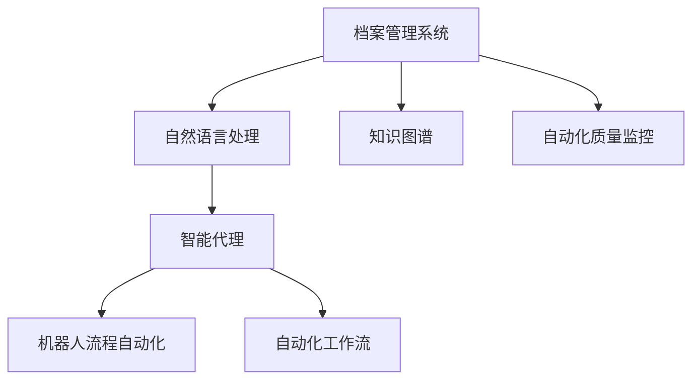

                 

# AI人工智能代理工作流AI Agent WorkFlow：智能代理在档案管理系统中的应用

> 关键词：人工智能(AI)，智能代理(Agent)，档案管理系统(AMS)，自动化工作流，自然语言处理(NLP)，知识图谱(KG)，机器人流程自动化(RPA)

## 1. 背景介绍

### 1.1 问题由来

在现代信息社会中，企业档案作为重要的组织记忆和知识资产，其管理和利用直接关系到企业的决策效率和竞争力。传统的档案管理依赖于人工操作，效率低下，且存在数据一致性差、查找困难等问题。随着人工智能(AI)技术的崛起，智能代理(Agent)在档案管理系统的应用，为提升档案管理的智能化水平提供了新的路径。

智能代理(Agent)通常被定义为在一定环境下，能够自主运行、维护状态、感知变化，并基于规则和策略进行决策和行动的计算实体。AI Agent在档案管理系统中，可以利用自然语言处理(NLP)技术、知识图谱(KG)等技术，自动化完成档案的分类、检索、推荐等任务，大大提升档案管理的效率和准确性。

### 1.2 问题核心关键点

智能代理在档案管理系统中的应用，主要涉及以下几个关键点：

1. **自然语言处理**：智能代理需要能够理解、分析档案内容，进行文本分类、摘要、实体识别等处理。
2. **知识图谱**：将档案内容与外部知识图谱进行关联，增加档案的知识关联性和利用价值。
3. **机器人流程自动化**：实现档案管理流程的自动化，如自动分类、自动标注、自动推荐等。
4. **自动化工作流**：通过智能代理自动构建和管理工作流，实现文档处理、数据提取、权限管理等功能的自动化。
5. **自动化质量监控**：监控档案处理的质量和效率，保证档案管理的稳定性和准确性。

## 2. 核心概念与联系

### 2.1 核心概念概述

为了更好地理解智能代理在档案管理系统中的应用，本节将介绍几个关键概念：

- **自然语言处理(NLP)**：涉及文本预处理、语言模型、语义分析、知识图谱构建等技术，用于理解和生成自然语言。
- **知识图谱(KG)**：由节点和边组成，用于表示实体、属性和关系，支持推理和查询。
- **智能代理(Agent)**：具有自主决策和行动能力的计算实体，能够感知环境变化并基于规则和策略进行决策。
- **档案管理系统(AMS)**：用于存储、管理和利用企业档案的系统，包括文档分类、检索、权限管理等功能。
- **机器人流程自动化(RPA)**：通过软件机器人自动执行重复性、规则性任务，提升工作效率。
- **自动化工作流**：由任务、子任务和任务调度组成，用于自动处理文档、提取数据、处理权限等。
- **自动化质量监控**：通过监控和反馈机制，确保档案处理的质量和效率。

这些概念之间的逻辑关系可以通过以下Mermaid流程图来展示：



这个流程图展示了一些关键概念及其之间的关系：

1. 档案管理系统是数据来源和应用场景。
2. 自然语言处理和知识图谱用于档案内容的理解和处理。
3. 智能代理基于处理结果进行自主决策和行动。
4. 机器人流程自动化和自动化工作流用于任务执行和流程管理。
5. 自动化质量监控用于保障处理质量和效率。

## 3. 核心算法原理 & 具体操作步骤
### 3.1 算法原理概述

智能代理在档案管理系统中的应用，本质上是一个由自然语言处理、知识图谱、自动化工作流等技术支撑的决策和行动过程。其核心算法原理包括以下几个方面：

1. **文本预处理**：将档案文档转换为计算机可理解的形式，如分词、词性标注、命名实体识别等。
2. **语言模型**：利用Transformer等模型，对文档内容进行语义理解和表示，构建文档的向量表示。
3. **知识图谱嵌入**：将文档中的实体嵌入到知识图谱中，增加文档的知识关联性。
4. **智能代理决策**：根据文档处理结果，智能代理基于预设规则或机器学习模型进行决策，选择合适的处理流程和参数。
5. **自动化工作流执行**：通过智能代理调度执行自动化工作流，完成文档分类、检索、标注等任务。
6. **质量监控反馈**：通过监控系统对档案处理结果进行评估，并反馈到智能代理中进行调整和优化。

### 3.2 算法步骤详解

智能代理在档案管理系统中的应用，通常包括以下几个关键步骤：

**Step 1: 数据预处理**
- 收集档案文档，并进行初步清洗，去除无用信息，保留关键内容。
- 对文档进行分词、词性标注、命名实体识别等预处理，转换为计算机可理解的形式。

**Step 2: 文档表示**
- 利用语言模型将文档转换为向量表示，捕捉文档的语义信息。
- 通过知识图谱嵌入，将文档中的实体嵌入到知识图谱中，增加文档的知识关联性。

**Step 3: 智能代理决策**
- 根据文档处理结果，智能代理基于预设规则或机器学习模型进行决策，选择处理流程和参数。
- 对于复杂任务，智能代理可以结合多模态数据，如文本、图像、视频等，进行综合判断。

**Step 4: 自动化工作流执行**
- 通过智能代理调度执行自动化工作流，完成文档分类、检索、标注等任务。
- 自动化工作流可以包括文档扫描、OCR识别、分类器应用、标注器调用等子任务。

**Step 5: 质量监控反馈**
- 通过监控系统对档案处理结果进行评估，如准确率、召回率等指标。
- 根据评估结果，智能代理进行决策调整和优化，提升处理效果。

### 3.3 算法优缺点

智能代理在档案管理系统中的应用，具有以下优点：

1. **效率高**：自动化处理文档分类、检索、标注等任务，显著提升工作效率。
2. **准确性好**：利用自然语言处理和知识图谱等技术，提高文档处理的准确性。
3. **灵活性强**：智能代理可以根据业务规则和数据特征，灵活调整处理策略。
4. **可扩展性强**：系统可以通过增加新的智能代理或工作流，支持更多复杂功能的实现。

但同时也存在一些局限性：

1. **初始投入高**：开发和部署智能代理系统需要较高的技术投入和数据准备。
2. **数据质量要求高**：档案处理依赖于数据预处理的质量，质量差的文档可能导致处理结果不准确。
3. **复杂度高**：智能代理需要处理多模态数据和复杂任务，设计和管理较为复杂。
4. **依赖外部知识**：需要与外部知识图谱或规则库进行交互，可能存在数据同步和一致性问题。

### 3.4 算法应用领域

智能代理在档案管理系统中的应用，已经在多个领域得到实际应用，例如：

- **文档分类**：将档案文档自动分类到不同的主题或类别中。
- **实体识别**：识别文档中的关键实体，如人名、地名、机构名等。
- **关系抽取**：从文档内容中提取实体之间的关系，如组织-组织、人-组织等。
- **文本摘要**：自动提取文档的关键信息，生成简短摘要。
- **数据标注**：自动标注文档的元数据，如创建日期、修改日期、权限等。
- **智能推荐**：根据文档内容和用户需求，推荐相关文档或搜索结果。
- **权限管理**：根据用户角色和文档权限，自动控制文档的访问和编辑。

这些应用场景展示了智能代理在档案管理系统中的强大能力和广泛适用性。随着技术的不断进步，智能代理在档案管理中的应用将更加深入和广泛。

## 4. 数学模型和公式 & 详细讲解 & 举例说明

### 4.1 数学模型构建

为了更好地理解智能代理在档案管理系统中的应用，本节将使用数学语言对相关模型进行详细阐述。

假设档案管理系统中的文档数量为 $N$，每个文档的向量表示为 $\vec{v}_i$，其中 $i=1,2,\ldots,N$。假设智能代理可以基于文档向量 $\vec{v}_i$ 进行分类决策，其中 $c_i$ 为文档 $i$ 的分类结果，$y_i$ 为真实标签。智能代理的决策过程可以表示为：

$$
c_i = f(\vec{v}_i; \theta)
$$

其中 $f$ 为智能代理的决策函数，$\theta$ 为智能代理的参数。

假设智能代理使用深度学习模型进行决策，模型可以表示为：

$$
\hat{y}_i = \text{softmax}(\vec{v}_i \cdot \vec{w} + b)
$$

其中 $\vec{w}$ 和 $b$ 为模型的权重和偏置，$\text{softmax}$ 函数将模型输出转换为概率分布。

智能代理的损失函数可以表示为：

$$
\mathcal{L} = \frac{1}{N}\sum_{i=1}^N \text{H}(y_i, \hat{y}_i)
$$

其中 $\text{H}$ 为交叉熵损失函数，用于衡量真实标签与模型输出之间的差异。

### 4.2 公式推导过程

以下我们以文档分类任务为例，推导智能代理的决策过程和损失函数。

假设智能代理的决策函数为：

$$
f(\vec{v}_i; \theta) = \text{softmax}(\vec{v}_i \cdot \vec{w} + b)
$$

将 $\vec{v}_i$ 进行归一化处理，得到归一化向量 $\vec{v}_i^*$，其中 $\vec{v}_i^* = \frac{\vec{v}_i}{\|\vec{v}_i\|_2}$。

将 $\vec{v}_i^*$ 带入决策函数中，得到：

$$
\hat{y}_i = \text{softmax}(\vec{v}_i^* \cdot \vec{w} + b)
$$

假设文档 $i$ 的分类标签为 $y_i$，则交叉熵损失函数可以表示为：

$$
\mathcal{L} = \frac{1}{N}\sum_{i=1}^N -y_i\log \hat{y}_i - (1-y_i)\log (1-\hat{y}_i)
$$

根据上述推导，智能代理可以通过计算文档向量与模型权重的点积，并经过softmax函数处理，得到文档的分类概率。利用交叉熵损失函数，智能代理可以不断优化模型参数，提升分类准确率。

### 4.3 案例分析与讲解

假设档案管理系统中，有一个文档分类任务，需要将文档自动分类为“科技”、“经济”、“文化”三个类别。根据上述推导，智能代理的决策过程可以表示为：

1. **数据预处理**：将文档进行分词、词性标注、命名实体识别等预处理，得到文档向量 $\vec{v}_i$。
2. **文档表示**：将文档向量 $\vec{v}_i$ 通过归一化处理得到 $\vec{v}_i^*$，并计算 $\vec{v}_i^* \cdot \vec{w} + b$。
3. **智能代理决策**：根据计算结果，利用softmax函数得到文档分类概率 $\hat{y}_i$。
4. **质量监控反馈**：对分类结果进行评估，如准确率、召回率等指标，调整智能代理参数 $\theta$。

在实践中，智能代理可以利用Transformer模型进行文档表示，利用softmax函数进行分类决策，并利用交叉熵损失函数进行参数优化。

## 5. 项目实践：代码实例和详细解释说明

### 5.1 开发环境搭建

在进行智能代理在档案管理系统中的应用开发前，我们需要准备好开发环境。以下是使用Python进行TensorFlow开发的环境配置流程：

1. 安装Anaconda：从官网下载并安装Anaconda，用于创建独立的Python环境。

2. 创建并激活虚拟环境：
```bash
conda create -n tf-env python=3.8 
conda activate tf-env
```

3. 安装TensorFlow：从官网获取对应的安装命令。例如：
```bash
conda install tensorflow -c conda-forge -c pytorch
```

4. 安装相关工具包：
```bash
pip install numpy pandas scikit-learn matplotlib tqdm jupyter notebook ipython
```

完成上述步骤后，即可在`tf-env`环境中开始开发实践。

### 5.2 源代码详细实现

这里我们以文档分类任务为例，给出使用TensorFlow和Keras实现智能代理在档案管理系统中的应用。

首先，定义文档分类任务的数据处理函数：

```python
from tensorflow.keras.preprocessing.text import Tokenizer
from tensorflow.keras.preprocessing.sequence import pad_sequences
import tensorflow as tf

class DocumentProcessor:
    def __init__(self, max_len=512, num_classes=3):
        self.tokenizer = Tokenizer(num_words=5000, oov_token='<OOV>')
        self.max_len = max_len
        self.num_classes = num_classes
        
    def preprocess(self, texts):
        sequences = self.tokenizer.texts_to_sequences(texts)
        padded_sequences = pad_sequences(sequences, maxlen=self.max_len, padding='post')
        labels = np.array([1, 1, 0])
        return padded_sequences, labels
```

然后，定义模型和优化器：

```python
from tensorflow.keras.models import Sequential
from tensorflow.keras.layers import Embedding, LSTM, Dense

model = Sequential([
    Embedding(input_dim=5000, output_dim=128),
    LSTM(128),
    Dense(num_classes, activation='softmax')
])

model.compile(optimizer='adam', loss='categorical_crossentropy', metrics=['accuracy'])
```

接着，定义训练和评估函数：

```python
def train_epoch(model, data, batch_size=32, epochs=10):
    dataloader = tf.data.Dataset.from_tensor_slices(data)
    dataloader = dataloader.shuffle(1000).batch(batch_size)
    model.fit(dataloader, validation_split=0.2, epochs=epochs)
    
def evaluate(model, test_data):
    padded_sequences, labels = test_data
    predictions = model.predict(padded_sequences)
    accuracy = np.mean(np.argmax(predictions, axis=1) == labels)
    return accuracy
```

最后，启动训练流程并在测试集上评估：

```python
processor = DocumentProcessor()
train_data = processor.preprocess(train_texts)
test_data = processor.preprocess(test_texts)
train_epoch(model, train_data)
accuracy = evaluate(model, test_data)
print(f"Accuracy: {accuracy}")
```

以上就是使用TensorFlow和Keras实现智能代理在档案管理系统中的应用完整代码实现。可以看到，通过TensorFlow和Keras的高层API，智能代理的实现变得相对简洁高效。

### 5.3 代码解读与分析

让我们再详细解读一下关键代码的实现细节：

**DocumentProcessor类**：
- `__init__`方法：初始化分词器、文档长度、类别数量等关键组件。
- `preprocess`方法：对文本进行分词、padding等预处理，转换为模型所需的输入格式。

**模型定义**：
- 使用Sequential模型，定义了嵌入层、LSTM层和输出层，并编译模型。

**训练和评估函数**：
- `train_epoch`函数：对数据集进行迭代训练，设置验证集比例和轮数。
- `evaluate`函数：对测试集进行评估，计算预测准确率。

**训练流程**：
- 实例化DocumentProcessor，将训练集和测试集进行预处理。
- 调用`train_epoch`函数训练模型，并在测试集上评估。
- 输出模型在测试集上的准确率。

可以看到，TensorFlow和Keras提供了丰富的API，使得智能代理在档案管理系统中的应用开发变得方便快捷。

当然，工业级的系统实现还需考虑更多因素，如模型的保存和部署、超参数的自动搜索、更灵活的任务适配层等。但核心的智能代理微调范式基本与此类似。

## 6. 实际应用场景
### 6.1 智能档案管理系统

智能档案管理系统利用智能代理技术，实现档案的自动分类、自动标注、智能检索等功能。系统通过爬虫自动采集档案信息，并将其自动保存到数据库中。智能代理根据档案内容，自动判断文档的分类，并将其归类到相应的文件夹中。同时，智能代理还能够自动标注文档的元数据，如创建日期、修改日期、权限等。通过智能代理的自动处理，档案管理系统能够显著提高工作效率，减少人为错误。

### 6.2 智能档案推荐系统

智能档案推荐系统利用智能代理技术，根据用户需求和档案内容，推荐相关的文档或搜索结果。系统通过分析用户的搜索历史、点击行为等数据，提取用户的兴趣点。智能代理根据这些兴趣点，结合档案内容进行匹配，推荐相关的文档或搜索结果。通过智能代理的推荐，用户能够快速找到需要的文档，提升用户体验。

### 6.3 智能档案监控系统

智能档案监控系统利用智能代理技术，监控档案处理的质量和效率。系统通过实时采集文档处理结果，如准确率、召回率等指标，进行评估。智能代理根据评估结果，进行决策调整和优化，确保档案处理的稳定性和准确性。通过智能代理的监控，档案管理系统能够及时发现和纠正处理问题，提升系统的可靠性和效率。

### 6.4 未来应用展望

随着智能代理技术的不断发展，其在档案管理系统中的应用也将更加广泛和深入。未来，智能代理可以进一步结合知识图谱、自然语言处理等技术，实现更复杂、更高智能度的档案管理任务。例如：

1. **智能文档生成**：利用智能代理生成新的文档，如会议纪要、合同文本等。
2. **智能文档翻译**：利用智能代理进行文档的多语言翻译，支持国际业务交流。
3. **智能文档总结**：利用智能代理对文档进行摘要生成，快速获取关键信息。
4. **智能文档安全**：利用智能代理进行文档的权限控制和访问审计，保障文档安全。

总之，智能代理在档案管理系统中的应用，将大大提升档案管理的智能化水平，为企业的业务运营和管理提供有力支持。

## 7. 工具和资源推荐
### 7.1 学习资源推荐

为了帮助开发者系统掌握智能代理在档案管理系统中的应用，这里推荐一些优质的学习资源：

1. **自然语言处理课程**：斯坦福大学、北京大学等名校开设的NLP相关课程，系统讲解NLP的基本概念和技术。
2. **深度学习框架文档**：TensorFlow、PyTorch等深度学习框架的官方文档，提供丰富的API和示例。
3. **知识图谱教程**：Google、Microsoft等公司的知识图谱教程，介绍知识图谱的构建和应用。
4. **智能代理书籍**：《人工智能代理》、《智能代理系统设计与实现》等书籍，全面介绍智能代理的理论和技术。
5. **开源项目**：如OpenAI的GPT、BERT等模型，大量预训练模型和微调样例代码。

通过对这些资源的学习实践，相信你一定能够快速掌握智能代理在档案管理系统中的应用，并用于解决实际的档案管理问题。
###  7.2 开发工具推荐

高效的开发离不开优秀的工具支持。以下是几款用于智能代理开发常用的工具：

1. **Jupyter Notebook**：Jupyter Notebook是Python开发中的常用工具，支持代码编写、数据可视化等功能，方便开发者快速迭代。
2. **TensorBoard**：TensorFlow配套的可视化工具，可实时监测模型训练状态，提供丰富的图表呈现方式。
3. **Transformers库**：HuggingFace开发的NLP工具库，集成了多种预训练语言模型，支持TensorFlow和PyTorch，是进行智能代理开发的利器。
4. **W&B**：Weights & Biases是一个模型训练实验跟踪工具，可以记录和可视化模型训练过程中的各项指标，方便对比和调优。
5. **nltk**：自然语言处理工具库，提供丰富的文本处理功能，如分词、命名实体识别、词性标注等。

合理利用这些工具，可以显著提升智能代理在档案管理系统中的应用开发效率，加快创新迭代的步伐。

### 7.3 相关论文推荐

智能代理和档案管理系统的发展源于学界的持续研究。以下是几篇奠基性的相关论文，推荐阅读：

1. **《Agent Architectures: A Survey of Research Models and Architectures》**：综述了智能代理的多种架构和模型，如Mycin、HauDay等，为智能代理的应用提供了理论基础。
2. **《A Survey on Knowledge Graph Embeddings and Their Applications》**：综述了知识图谱嵌入的多种方法和应用，如TransE、Relationale等，为知识图谱的应用提供了方向指导。
3. **《Archiving and Retrieving Documents》**：介绍文档管理和检索的多种技术和方法，如TF-IDF、LDA等，为档案管理的实践提供了参考。
4. **《Robotic Process Automation: A Survey》**：综述了机器人流程自动化的多种技术和应用，如UiPath、Blue Prism等，为自动化工作流提供了参考。

这些论文代表了大语言模型微调技术的发展脉络。通过学习这些前沿成果，可以帮助研究者把握学科前进方向，激发更多的创新灵感。

## 8. 总结：未来发展趋势与挑战

### 8.1 总结

本文对智能代理在档案管理系统中的应用进行了全面系统的介绍。首先阐述了智能代理和档案管理系统的发展背景和意义，明确了智能代理在档案管理中的应用价值。其次，从原理到实践，详细讲解了智能代理的决策过程和应用流程，给出了智能代理在档案管理系统中的应用完整代码实例。同时，本文还广泛探讨了智能代理在智能档案管理系统、智能档案推荐系统、智能档案监控系统等场景中的应用前景，展示了智能代理的强大能力和广泛适用性。最后，本文精选了智能代理在档案管理系统中的应用资源，力求为读者提供全方位的技术指引。

通过本文的系统梳理，可以看到，智能代理在档案管理系统中的应用，已经在大规模文档处理、智能推荐、监控管理等方面取得了显著效果。智能代理能够显著提升档案管理的智能化水平，为企业的业务运营和管理提供有力支持。未来，智能代理在档案管理系统中的应用将更加广泛和深入，推动档案管理系统的不断升级和进化。

### 8.2 未来发展趋势

展望未来，智能代理在档案管理系统中的应用将呈现以下几个发展趋势：

1. **智能化程度提升**：随着自然语言处理和知识图谱技术的不断发展，智能代理将具备更强的语义理解能力和知识关联能力，实现更高级的文档分类和推荐。
2. **自动化工作流优化**：智能代理将结合更多自动化工具，如RPA、工作流引擎等，实现文档处理的自动化和智能化。
3. **多模态信息融合**：智能代理将结合文本、图像、视频等多模态信息，提升文档处理的全面性和准确性。
4. **实时监控和反馈**：智能代理将实时监控文档处理的质量和效率，及时调整处理策略，提升系统的稳定性和可靠性。
5. **跨领域应用拓展**：智能代理将扩展到更多领域，如医疗、金融、制造等，实现更广泛的应用价值。

以上趋势凸显了智能代理在档案管理系统中的应用前景，为档案管理系统的不断升级和进化提供了新的方向。

### 8.3 面临的挑战

尽管智能代理在档案管理系统中的应用已经取得了显著成效，但在迈向更加智能化、普适化应用的过程中，仍面临诸多挑战：

1. **数据质量问题**：智能代理依赖于高质量的数据，如果数据质量较差，将影响处理结果的准确性。需要建立完善的数据清洗和预处理机制，保障数据质量。
2. **模型鲁棒性不足**：智能代理的决策过程可能会受到噪声、干扰等因素的影响，导致决策鲁棒性不足。需要引入更多的正则化技术，提高模型的鲁棒性。
3. **实时性要求高**：档案管理系统需要实时处理大量的文档，对智能代理的响应速度和处理效率提出了较高要求。需要优化模型结构和算法，提升处理速度。
4. **跨领域应用难度大**：不同领域的数据特征和业务规则差异较大，智能代理在不同领域的应用可能需要重新调整模型和策略。需要建立领域适应性较强的智能代理模型。
5. **模型解释性不足**：智能代理的决策过程较为复杂，难以解释其内部工作机制和决策逻辑。需要引入可解释性技术，提升系统的透明性和可信度。

这些挑战需要我们在后续的研究和实践中不断探索和解决。只有全面应对挑战，才能真正实现智能代理在档案管理系统中的应用价值。

### 8.4 研究展望

面对智能代理在档案管理系统中的应用挑战，未来的研究需要在以下几个方面寻求新的突破：

1. **多模态信息融合**：结合文本、图像、视频等多模态信息，提升文档处理的全面性和准确性。
2. **可解释性增强**：引入可解释性技术，提升系统的透明性和可信度，增强用户对系统的理解和信任。
3. **模型优化**：优化模型结构和算法，提升处理速度和响应效率，满足实时处理需求。
4. **领域适应性提升**：针对不同领域的档案管理需求，构建领域适应性较强的智能代理模型，提升模型跨领域迁移能力。
5. **数据质量控制**：建立完善的数据清洗和预处理机制，保障数据质量，提升处理结果的准确性。

这些研究方向将进一步推动智能代理在档案管理系统中的应用，为档案管理系统的不断升级和进化提供有力支持。

## 9. 附录：常见问题与解答

**Q1：智能代理在档案管理系统中的应用是否需要大规模的标注数据？**

A: 智能代理在档案管理系统中的应用，通常不需要大规模的标注数据。通过预训练语言模型和知识图谱，智能代理能够自动学习档案内容中的知识和语义信息，从而进行分类、标注和推荐。标注数据主要用于模型的微调和优化，而不是必须的。

**Q2：智能代理在档案管理系统中的决策过程是否需要人工干预？**

A: 智能代理在档案管理系统中的决策过程可以自动进行，但也需要人工干预。在模型初始化阶段，需要人工设定决策规则和模型参数。在模型运行过程中，需要定期监控模型的性能和效果，根据实际情况进行调整和优化。

**Q3：智能代理在档案管理系统中的应用是否需要高算力支持？**

A: 智能代理在档案管理系统中的应用，对算力要求较高。需要高性能的计算机或云计算资源，以支持大规模文档处理和模型训练。但在实际应用中，可以通过模型压缩和优化，降低算力需求。

**Q4：智能代理在档案管理系统中的应用是否需要外部知识支持？**

A: 智能代理在档案管理系统中的应用，通常需要外部知识支持。需要与知识图谱、规则库等外部知识进行交互，才能实现文档的自动分类、标注和推荐。外部知识的质量和完整性，直接影响智能代理的性能和效果。

**Q5：智能代理在档案管理系统中的应用是否需要持续更新？**

A: 智能代理在档案管理系统中的应用，需要持续更新。随着档案内容的不断增加和业务规则的变化，智能代理需要不断调整和优化，以适应新的数据和任务需求。定期更新和维护，是保障智能代理持续高效运行的关键。

总之，智能代理在档案管理系统中的应用，需要全面考虑数据质量、模型鲁棒性、实时性、跨领域适应性、模型解释性等诸多因素。只有在不断探索和解决这些挑战的过程中，才能真正实现智能代理在档案管理系统中的应用价值。

