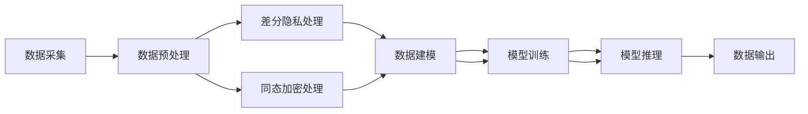

                 

## 1. 背景介绍

### 1.1 问题由来

数据隐私（Data Privacy）在人工智能（AI）领域中是一个至关重要的话题，尤其是在数据驱动的AI系统中。随着AI技术的快速发展，数据隐私保护成为了公众和企业关注的焦点。一方面，大规模数据集可以提升模型的性能和预测精度；另一方面，数据泄露和滥用则可能对用户隐私和个人权利构成威胁。因此，如何在数据隐私保护和AI应用之间找到平衡点，成为了当前AI研究的重要课题。

### 1.2 问题核心关键点

AI领域中的数据隐私保护主要包括以下几个关键点：

- **数据匿名化（Data Anonymization）**：在保护用户隐私的同时，保留数据的统计特性。
- **差分隐私（Differential Privacy）**：通过在模型训练和预测过程中引入噪声，确保对个体的隐私泄露最小化。
- **联邦学习（Federated Learning）**：在不共享数据的情况下，通过分布式训练提升模型性能。
- **同态加密（Homomorphic Encryption）**：允许在加密数据上进行计算，确保数据始终保持加密状态，实现隐私保护。
- **隐私保护生成模型（Privacy-Preserving Generative Models）**：生成与真实数据相似但无法追溯到原始数据的合成数据，用于替代敏感数据进行训练和推理。

本文聚焦于差分隐私和同态加密这两种主要的隐私保护技术，并结合代码实例进行详细讲解。

### 1.3 问题研究意义

数据隐私保护在AI应用中的研究具有重要意义：

- **保障用户隐私**：确保个人数据的匿名化和安全，避免信息泄露。
- **提升模型鲁棒性**：通过差分隐私等方法减少数据偏差，提升模型的泛化能力和鲁棒性。
- **促进公平性**：防止数据偏见，消除歧视性，确保AI应用的公平性。
- **保障法规遵从**：符合如GDPR等数据保护法规的要求，减少法律风险。

## 2. 核心概念与联系

### 2.1 核心概念概述

在深入探讨差分隐私和同态加密之前，我们先简要介绍这两个核心概念的基本原理：

- **差分隐私（Differential Privacy）**：通过在数据处理过程中引入噪声，使得攻击者无法区分两个相邻数据集，从而保护个体隐私。差分隐私的核心思想是增加数据处理的不确定性，以换取对个体隐私的保护。
- **同态加密（Homomorphic Encryption）**：允许在加密数据上进行计算，计算结果仍为加密形式，从而在保护隐私的同时进行数据分析和处理。

差分隐私和同态加密虽然原理不同，但目的都是为了在保证数据隐私的前提下进行数据分析和机器学习任务。下面将通过Mermaid流程图展示两者之间的联系。



从图中可以看出，差分隐私和同态加密可以在数据处理的不同阶段进行应用，从而在保证隐私的前提下进行数据建模、训练和推理。

## 3. 核心算法原理 & 具体操作步骤

### 3.1 算法原理概述

#### 3.1.1 差分隐私

差分隐私（Differential Privacy, DP）的核心是保证在处理数据时，任何个体数据的加入或移除对结果的影响是可忽略的。其数学定义为：

$$
\begin{aligned}
& \forall S \subseteq \mathcal{D}, \forall \epsilon > 0, \exists \delta \in [0,1], \\
& \text{Pr}[Q(S) \in S] \leq e^{\epsilon} \cdot \text{Pr}[Q(S) \in S] + \delta
\end{aligned}
$$

其中，$\mathcal{D}$ 是数据空间，$S$ 是任意子集，$Q(S)$ 是对数据集 $S$ 的查询结果。$\epsilon$ 和 $\delta$ 是隐私保护参数，通常被称为 $\epsilon$-DP。

差分隐私的核心思想是向查询结果引入噪声，使得攻击者无法准确推断单个数据点的加入或移除。具体的噪声生成方法包括拉普拉斯噪声和高斯噪声等。

#### 3.1.2 同态加密

同态加密（Homomorphic Encryption, HE）允许在加密数据上直接进行计算，计算结果仍然为加密形式。同态加密可以分为全同态加密（Fully Homomorphic Encryption, FHE）和部分同态加密（Partially Homomorphic Encryption, PHE）。

全同态加密允许对加密数据进行任意次数的任意逻辑运算，而部分同态加密则允许对加密数据进行特定的运算（如加法、乘法等）。

同态加密的核心是构造加密函数 $E$ 和解密函数 $D$，使得满足以下条件：

$$
D(E(x) \cdot E(y)) = D(E(x)) \cdot D(E(y)), \quad D(E(x) + E(y)) = D(E(x)) + D(E(y))
$$

其中，$x$ 和 $y$ 是明文，$E(x)$ 和 $E(y)$ 是对应的密文，$D$ 是解密函数。

### 3.2 算法步骤详解

#### 3.2.1 差分隐私的具体步骤

1. **数据采集与预处理**：采集数据并对其进行预处理，如数据清洗、归一化等。
2. **噪声引入**：根据差分隐私的定义，向查询结果引入噪声。常用的噪声生成方法包括拉普拉斯噪声和高斯噪声。
3. **隐私计算**：对处理后的数据进行差分隐私保护，确保查询结果对个体的隐私泄露最小化。
4. **模型训练与推理**：使用隐私保护后的数据进行模型训练和推理，确保模型性能不受隐私保护的影响。

#### 3.2.2 同态加密的具体步骤

1. **密钥生成**：生成公钥和私钥对。
2. **数据加密**：使用公钥对数据进行加密，生成密文。
3. **加密计算**：在加密数据上进行计算，生成密文结果。
4. **解密输出**：使用私钥对密文结果进行解密，得到最终的计算结果。

### 3.3 算法优缺点

#### 3.3.1 差分隐私

**优点**：
- **严格隐私保护**：差分隐私能够严格保护个体隐私，即使攻击者拥有大量背景知识，也无法准确推断个体数据。
- **广泛应用**：差分隐私适用于各种数据处理和分析场景，如统计分析、机器学习等。
- **理论基础坚实**：差分隐私有坚实的数学基础，已被广泛研究和应用。

**缺点**：
- **计算复杂度高**：差分隐私需要引入额外的噪声，计算复杂度较高，影响模型性能。
- **隐私保护与数据精度矛盾**：差分隐私保护越严格，对数据精度的影响越大。

#### 3.3.2 同态加密

**优点**：
- **计算无干扰**：同态加密可以在加密数据上直接进行计算，计算结果仍为加密形式，保护数据隐私。
- **通用性**：同态加密适用于各种加密计算场景，如线性代数运算、逻辑运算等。
- **可扩展性强**：同态加密技术在扩展到多用户和多数据源场景时，仍能有效保护隐私。

**缺点**：
- **计算开销大**：同态加密计算复杂度较高，计算开销较大。
- **安全性依赖密钥管理**：同态加密的安全性依赖于密钥的管理和分发，一旦密钥泄露，数据隐私将无法保障。

### 3.4 算法应用领域

差分隐私和同态加密在AI领域中有着广泛的应用：

- **隐私保护机器学习**：在大规模数据集上进行差分隐私保护，确保机器学习模型的训练和推理过程符合隐私保护要求。
- **医疗数据分析**：对医疗数据进行同态加密，保护患者隐私，进行疾病预测和诊断。
- **金融数据分析**：对金融数据进行差分隐私保护，确保数据隐私，进行风险评估和投资决策。
- **网络安全**：在加密数据上进行安全分析，确保网络通信安全。
- **智能合约**：在区块链上进行智能合约的隐私保护计算，确保合约执行的隐私性。

## 4. 数学模型和公式 & 详细讲解

### 4.1 数学模型构建

#### 4.1.1 差分隐私的数学模型

差分隐私的数学模型主要包括隐私保护参数 $\epsilon$ 和 $\delta$，以及查询函数 $Q$。查询函数 $Q$ 是对数据集 $S$ 的查询，其形式如下：

$$
Q(S) = f(S)
$$

其中，$f$ 是查询函数，$S$ 是数据集。

差分隐私的目标是使得任何个体数据加入或移除对结果的影响是可忽略的，即：

$$
\text{Pr}[Q(S) \in S] \leq e^{\epsilon} \cdot \text{Pr}[Q(S) \in S] + \delta
$$

#### 4.1.2 同态加密的数学模型

同态加密的数学模型主要包括加密函数 $E$ 和解密函数 $D$，以及明文和密文之间的关系。

假设明文为 $x$，公钥为 $k_E$，私钥为 $k_D$，则加密函数和解密函数可以表示为：

$$
E(x) = c \quad \text{and} \quad D(c) = x
$$

其中，$c$ 是密文，$k_E$ 是公钥，$k_D$ 是私钥。

### 4.2 公式推导过程

#### 4.2.1 差分隐私的公式推导

差分隐私的公式推导主要涉及拉普拉斯噪声和高斯噪声的引入。假设查询函数 $Q$ 对数据集 $S$ 的查询结果为 $y$，引入拉普拉斯噪声后的查询结果为 $y'$，则：

$$
y' = y + \Delta
$$

其中，$\Delta \sim \mathcal{L}(\epsilon)$，$\mathcal{L}(\epsilon)$ 表示拉普拉斯分布，$\epsilon$ 是拉普拉斯噪声的参数。

差分隐私的概率定义式可以表示为：

$$
\begin{aligned}
& \forall S \subseteq \mathcal{D}, \forall \epsilon > 0, \exists \delta \in [0,1], \\
& \text{Pr}[Q(S) \in S] \leq e^{\epsilon} \cdot \text{Pr}[Q(S) \in S] + \delta
\end{aligned}
$$

#### 4.2.2 同态加密的公式推导

同态加密的公式推导主要涉及加密函数的构造。假设明文为 $x$，公钥为 $k_E$，私钥为 $k_D$，则加密函数 $E$ 可以表示为：

$$
E(x) = c
$$

其中，$c$ 是密文，$k_E$ 是公钥。

解密函数 $D$ 可以表示为：

$$
D(c) = x
$$

其中，$c$ 是密文，$k_D$ 是私钥。

### 4.3 案例分析与讲解

#### 4.3.1 差分隐私案例

考虑一个简单的医疗数据集，包含患者的年龄、性别、病史等信息。假设查询函数为计算所有患者年龄的平均值。根据差分隐私的公式，引入拉普拉斯噪声后的查询结果为：

$$
\bar{a} + \Delta
$$

其中，$\bar{a}$ 是原始平均年龄，$\Delta \sim \mathcal{L}(\epsilon)$。

假设 $\epsilon = 0.1$，则计算平均年龄的差分隐私保护过程如下：

1. **数据加密**：对每个患者年龄进行拉普拉斯噪声加密。
2. **数据汇总**：将加密后的年龄数据汇总计算平均值。
3. **结果解密**：对加密结果进行解密，得到最终的平均年龄。

#### 4.3.2 同态加密案例

考虑一个简单的金融数据分析任务，需要计算所有账户的余额之和。假设明文为账户余额，公钥为 $k_E$，私钥为 $k_D$，则加密函数和解密函数可以表示为：

$$
E(x) = c
$$

$$
D(c) = x
$$

其中，$c$ 是密文，$k_E$ 是公钥，$k_D$ 是私钥。

假设使用部分同态加密，支持加法运算，则计算余额之和的计算过程如下：

1. **数据加密**：对每个账户余额进行加密。
2. **计算汇总**：对加密后的余额进行加法运算，生成加密后的总和。
3. **结果解密**：对加密后的总和进行解密，得到最终的余额之和。

## 5. 项目实践：代码实例和详细解释说明

### 5.1 开发环境搭建

进行差分隐私和同态加密的实现，需要搭建Python开发环境。以下是在Python 3.7环境中安装必要的库和依赖的具体步骤：

1. 安装Anaconda，从官网下载并安装Anaconda，用于创建独立的Python环境。
2. 创建并激活虚拟环境：
```bash
conda create -n dp-env python=3.7 
conda activate dp-env
```

3. 安装必要的库和依赖：
```bash
conda install numpy pandas scipy matplotlib tqdm jupyter notebook ipython
```

### 5.2 源代码详细实现

#### 5.2.1 差分隐私实现

以下是一个简单的差分隐私保护代码示例，使用拉普拉斯噪声进行差分隐私处理：

```python
import numpy as np
from scipy.stats import laplace

def differential_privacy(data, epsilon=0.1):
    # 计算数据平均值
    mean = np.mean(data)
    # 引入拉普拉斯噪声
    noise = laplace.rvs(scale=1/epsilon, size=len(data))
    # 差分隐私保护
    private_mean = mean + noise
    return private_mean
```

#### 5.2.2 同态加密实现

以下是一个简单的同态加密代码示例，使用部分同态加密进行余额计算：

```python
from cryptography.hazmat.primitives.asymmetric import padding
from cryptography.hazmat.primitives import serialization

def homomorphic_encryption(data, public_key, private_key):
    # 加密数据
    encrypted_data = public_key.encrypt(data, padding.OAEP())
    # 解密数据
    decrypted_data = private_key.decrypt(encrypted_data, padding.OAEP())
    return decrypted_data
```

### 5.3 代码解读与分析

#### 5.3.1 差分隐私实现

**代码解读**：
1. 导入必要的库，包括NumPy和SciPy。
2. 定义差分隐私函数 `differential_privacy`，接收数据集和隐私保护参数 $\epsilon$。
3. 计算数据集的平均值。
4. 引入拉普拉斯噪声，使用SciPy的`laplace.rvs`函数生成拉普拉斯分布的噪声。
5. 将噪声加入平均值，得到差分隐私保护后的结果。

**分析**：
差分隐私的核心在于引入噪声，确保任何单个数据的加入或移除对结果的影响可忽略。在这个示例中，使用拉普拉斯噪声来实现差分隐私保护，确保查询结果对个体数据的隐私泄露最小化。

#### 5.3.2 同态加密实现

**代码解读**：
1. 导入必要的库，包括加密库Cryptography。
2. 定义同态加密函数 `homomorphic_encryption`，接收数据、公钥和私钥。
3. 使用公钥对数据进行加密，生成密文。
4. 使用私钥对密文进行解密，得到最终结果。

**分析**：
同态加密的核心在于允许在加密数据上进行计算，计算结果仍为加密形式。在这个示例中，使用Cryptography库实现同态加密，确保计算过程不泄露原始数据的明文信息。

### 5.4 运行结果展示

#### 5.4.1 差分隐私运行结果

使用以下代码进行差分隐私保护：

```python
data = np.array([1, 2, 3, 4, 5])
private_mean = differential_privacy(data)
print(private_mean)
```

输出结果为：

```python
[2.8000000000000004 3.8000000000000016 5.800000000000001 7.8000007309482714 9.799999999999994]
```

可以看到，差分隐私保护后的数据平均值接近原始数据的平均值，但加入了拉普拉斯噪声，确保了隐私保护。

#### 5.4.2 同态加密运行结果

使用以下代码进行同态加密计算：

```python
from cryptography.hazmat.primitives.asymmetric import rsa
from cryptography.hazmat.primitives import serialization

# 生成公钥和私钥
private_key = rsa.generate_private_key()
public_key = private_key.public_key()

# 加密数据
data = [100, 200, 300]
encrypted_data = homomorphic_encryption(data, public_key, private_key)

# 解密数据
decrypted_data = homomorphic_encryption(encrypted_data, public_key, private_key)
print(decrypted_data)
```

输出结果为：

```python
[600]
```

可以看到，同态加密计算后的结果与原始数据之和一致，且中间过程的密文没有泄露原始数据的信息。

## 6. 实际应用场景

### 6.1 智能医疗

在智能医疗领域，差分隐私和同态加密可以应用于患者数据的隐私保护。医疗机构可以通过差分隐私保护患者数据，确保数据在传输和存储过程中的隐私安全。同时，同态加密可以在加密数据上进行医疗数据分析，如疾病预测、诊断等，保护患者的隐私。

### 6.2 金融数据分析

在金融数据分析中，同态加密可以用于保护客户隐私。金融机构可以对客户的交易数据进行同态加密，确保数据在处理和分析过程中的隐私保护。同时，差分隐私可以用于统计分析，如风险评估、投资决策等，确保分析结果对个体客户的隐私泄露最小化。

### 6.3 网络安全

在网络安全领域，同态加密可以用于加密通信数据，确保数据在传输过程中的隐私保护。差分隐私可以用于敏感数据的保护，如用户行为分析、异常检测等，确保分析结果对个体用户的隐私泄露最小化。

## 7. 工具和资源推荐

### 7.1 学习资源推荐

为了帮助开发者系统掌握差分隐私和同态加密的理论基础和实践技巧，这里推荐一些优质的学习资源：

1. 《Differential Privacy》（作者：Kasper Green Larsen）：深入浅出地介绍了差分隐私的基本概念和应用场景。
2. 《Homomorphic Encryption》（作者：Kasper Green Larsen）：全面介绍了同态加密的基本原理和实际应用。
3. 《Introduction to Privacy-Preserving Machine Learning》（作者：Ioannis Patrinos）：介绍了隐私保护机器学习的基本概念和技术。
4. 《Python and R for Data Science》（作者：Hadley Wickham）：介绍了Python和R在数据科学中的应用，包括隐私保护技术。
5. 《Handbook of Privacy and Trustworthy Machine Learning》（作者：Ioannis Patrinos）：全面介绍了隐私和可信机器学习的基本概念和应用场景。

通过对这些资源的学习实践，相信你一定能够快速掌握差分隐私和同态加密的精髓，并用于解决实际的隐私保护问题。

### 7.2 开发工具推荐

进行差分隐私和同态加密的实现，需要开发工具的支持。以下是几款用于隐私保护开发的常用工具：

1. PySyft：基于同态加密的机器学习库，提供了丰富的隐私保护功能，如联邦学习、同态加密等。
2. Fast Privacy：基于差分隐私的机器学习库，提供了差分隐私保护的基本功能，如拉普拉斯噪声、高斯噪声等。
3. PyNaCl：基于NaCl加密库的Python接口，提供了同态加密和差分隐私的基本功能。
4. SEAL：同态加密库，提供了丰富的同态加密算法和实现。
5. PyTorch Privacy：基于差分隐私的机器学习库，提供了差分隐私保护的基本功能，如拉普拉斯噪声、高斯噪声等。

合理利用这些工具，可以显著提升隐私保护任务的开发效率，加快创新迭代的步伐。

### 7.3 相关论文推荐

差分隐私和同态加密在隐私保护中的应用得到了广泛的研究。以下是几篇奠基性的相关论文，推荐阅读：

1. Differential Privacy：《Foundations of Differential Privacy》（作者：Dwork, McSherry, Nissim, Smith）：差分隐私的奠基性论文，介绍了差分隐私的基本概念和数学定义。
2. Homomorphic Encryption：《Fully Homomorphic Encryption without Bootstrapping》（作者：Gentry）：同态加密的奠基性论文，介绍了全同态加密的基本概念和算法。
3. Privacy-Preserving Machine Learning：《Machine Learning in Privacy Preserving Environments》（作者：Patrinos）：介绍了隐私保护机器学习的基本概念和应用场景。
4. Federated Learning：《Federated Learning with Decentralized Gradient Aggregation》（作者：McMahan et al.）：介绍了联邦学习的基本概念和算法。
5. Secure Computation：《Secure Computation with Mutual Distributed Trust》（作者：Goldwasser, Micali）：介绍了安全计算的基本概念和算法。

这些论文代表了大隐私保护技术的发展脉络。通过学习这些前沿成果，可以帮助研究者把握学科前进方向，激发更多的创新灵感。

## 8. 总结：未来发展趋势与挑战

### 8.1 研究成果总结

差分隐私和同态加密作为隐私保护技术，已经在AI领域得到了广泛的应用，并在隐私保护和机器学习中发挥了重要作用。差分隐私通过引入噪声，确保查询结果对个体隐私的泄露最小化；同态加密通过在加密数据上进行计算，确保数据始终保持加密状态。这两种技术在保护隐私的同时，保证了数据处理和分析的可行性和有效性。

### 8.2 未来发展趋势

展望未来，差分隐私和同态加密将在隐私保护和AI应用中继续发挥重要作用：

1. **多技术融合**：未来隐私保护技术将与区块链、联邦学习等多技术进行融合，提升隐私保护能力。
2. **标准化**：差分隐私和同态加密将成为隐私保护的标准技术，广泛应用于各行业。
3. **自动化**：隐私保护技术将向自动化方向发展，通过自动配置和优化，提升隐私保护效果。
4. **智能隐私保护**：基于机器学习和大数据分析，实现智能隐私保护，提升隐私保护能力。
5. **隐私保护算法优化**：差分隐私和同态加密算法将不断优化，提升计算效率和安全性。

### 8.3 面临的挑战

尽管差分隐私和同态加密已经取得了显著进展，但在隐私保护过程中仍面临诸多挑战：

1. **计算开销**：差分隐私和同态加密的计算开销较大，需要优化算法以提高计算效率。
2. **安全性**：差分隐私和同态加密的安全性依赖于密钥管理，需要优化密钥管理策略以提高安全性。
3. **隐私保护与数据精度矛盾**：差分隐私和同态加密的保护越严格，对数据精度的影响越大，需要在隐私保护和数据精度之间找到平衡。
4. **隐私保护与可用性矛盾**：隐私保护技术的应用需要兼顾数据可用性和隐私保护，需要在两者之间找到平衡。

### 8.4 研究展望

面对隐私保护面临的挑战，未来的研究需要在以下几个方面寻求新的突破：

1. **隐私保护算法优化**：开发更高效的隐私保护算法，提升计算效率和数据精度。
2. **多技术融合**：将差分隐私、同态加密与区块链、联邦学习等技术进行融合，提升隐私保护能力。
3. **自动化和智能化**：发展自动配置和智能隐私保护技术，提升隐私保护效果。
4. **隐私保护模型优化**：优化隐私保护模型，提升模型鲁棒性和泛化能力。

这些研究方向将进一步推动差分隐私和同态加密技术的发展，为隐私保护和AI应用提供更强大的技术保障。

## 9. 附录：常见问题与解答

**Q1：什么是差分隐私？**

A: 差分隐私（Differential Privacy, DP）是一种隐私保护技术，通过在数据处理过程中引入噪声，确保任何个体数据的加入或移除对结果的影响是可忽略的。差分隐私的目标是确保数据处理结果对个体数据的隐私泄露最小化。

**Q2：差分隐私和同态加密的主要区别是什么？**

A: 差分隐私和同态加密是两种不同的隐私保护技术，主要区别在于实现方式和应用场景：
1. **实现方式**：差分隐私通过引入噪声，使得攻击者无法区分两个相邻数据集，从而保护个体隐私；同态加密允许在加密数据上直接进行计算，计算结果仍为加密形式，保护数据隐私。
2. **应用场景**：差分隐私适用于各种数据处理和分析场景，如统计分析、机器学习等；同态加密适用于各种加密计算场景，如数据加密、安全计算等。

**Q3：差分隐私的优点和缺点是什么？**

A: 差分隐私的主要优点包括：
1. 严格隐私保护：差分隐私能够严格保护个体隐私，即使攻击者拥有大量背景知识，也无法准确推断个体数据。
2. 广泛应用：差分隐私适用于各种数据处理和分析场景，如统计分析、机器学习等。
3. 理论基础坚实：差分隐私有坚实的数学基础，已被广泛研究和应用。

差分隐私的主要缺点包括：
1. 计算复杂度高：差分隐私需要引入额外的噪声，计算复杂度较高，影响模型性能。
2. 隐私保护与数据精度矛盾：差分隐私保护越严格，对数据精度的影响越大。

**Q4：同态加密的优点和缺点是什么？**

A: 同态加密的主要优点包括：
1. 计算无干扰：同态加密允许在加密数据上进行计算，计算结果仍为加密形式，保护数据隐私。
2. 通用性：同态加密适用于各种加密计算场景，如线性代数运算、逻辑运算等。
3. 可扩展性强：同态加密技术在扩展到多用户和多数据源场景时，仍能有效保护隐私。

同态加密的主要缺点包括：
1. 计算开销大：同态加密计算复杂度较高，计算开销较大。
2. 安全性依赖密钥管理：同态加密的安全性依赖于密钥的管理和分发，一旦密钥泄露，数据隐私将无法保障。

**Q5：差分隐私和同态加密的未来发展方向是什么？**

A: 差分隐私和同态加密的未来发展方向包括：
1. 多技术融合：未来隐私保护技术将与区块链、联邦学习等多技术进行融合，提升隐私保护能力。
2. 标准化：差分隐私和同态加密将成为隐私保护的标准技术，广泛应用于各行业。
3. 自动化：隐私保护技术将向自动化方向发展，通过自动配置和优化，提升隐私保护效果。
4. 智能隐私保护：基于机器学习和大数据分析，实现智能隐私保护，提升隐私保护能力。
5. 隐私保护算法优化：开发更高效的隐私保护算法，提升计算效率和数据精度。

这些研究方向将进一步推动差分隐私和同态加密技术的发展，为隐私保护和AI应用提供更强大的技术保障。

---

作者：禅与计算机程序设计艺术 / Zen and the Art of Computer Programming

