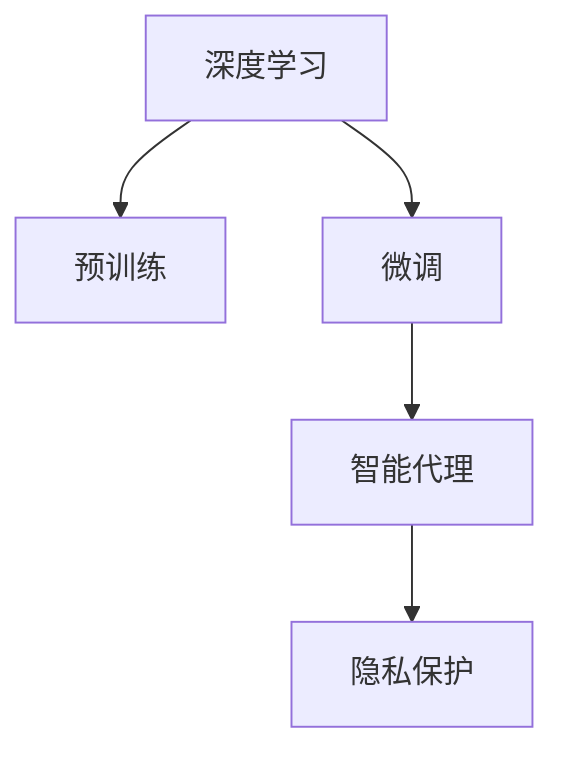

                 

## 1. 背景介绍

### 1.1 问题由来
近年来，人工智能(AI)在医疗健康领域的应用引起了广泛关注。由于大数据和计算资源的快速发展，深度学习(Deep Learning)技术在医疗影像分析、病理学、药物研发等领域展示了巨大的潜力和价值。AI技术可以通过对海量医疗数据的学习，辅助医生进行诊断、治疗决策、药物研发等工作，大大提升了医疗效率和准确性。

然而，AI技术在医疗领域的应用也面临着诸多挑战：
1. **数据隐私**：医疗数据包含大量敏感信息，数据隐私和安全问题凸显。
2. **数据标注成本高**：高质量的标注数据往往需要大量人力物力，标注成本高昂。
3. **模型可解释性不足**：深度学习模型通常是“黑盒”模型，难以解释其决策过程，影响医疗应用的信任度。
4. **模型泛化能力有限**：由于医疗数据分布广泛，单一模型的泛化能力往往受到限制，难以覆盖所有医疗场景。

智能深度学习代理通过预训练-微调策略，在有效缓解上述问题的同时，还能充分利用大模型的知识积累，提升医疗AI系统的性能。本文章将全面介绍智能深度学习代理在健康医疗领域的应用，详细探讨其原理、实现步骤、优缺点和未来发展方向。

### 1.2 问题核心关键点
智能深度学习代理通过在大规模无标签医疗数据上进行预训练，学习通用的医疗知识表示，再通过小规模有标签医疗数据进行微调，适应特定医疗任务，提升模型的准确性和泛化能力。具体来说：
1. **预训练**：在大规模医疗数据集上，通过自监督学习任务训练通用医疗语言模型。
2. **微调**：利用小规模医疗数据集，通过有监督学习优化模型在特定医疗任务上的性能。
3. **代理**：通过在模型设计和训练过程中引入代理变量，增强模型的可解释性和可控性。
4. **隐私保护**：在模型设计和训练中引入隐私保护技术，确保医疗数据的隐私和安全。

本文将围绕这些关键点，全面阐述智能深度学习代理在健康医疗领域的原理和应用。

## 2. 核心概念与联系

### 2.1 核心概念概述

为更好地理解智能深度学习代理在健康医疗领域的应用，本节将介绍几个密切相关的核心概念：

- **深度学习**：一种机器学习技术，通过多层神经网络学习数据的抽象表示。在医疗领域，深度学习模型可用于图像识别、语音识别、自然语言处理等任务。
- **预训练**：指在大规模无标签数据上训练通用模型，使其学习到丰富的知识表示，提升模型的泛化能力。
- **微调**：指在预训练模型的基础上，使用下游任务的少量标注数据进行有监督优化，使其适应特定任务。
- **智能代理**：指利用智能算法和模型，代理人进行智能决策和执行，减少人工干预，提升系统效率和准确性。
- **隐私保护**：指在处理敏感数据时，采取措施保护数据隐私和安全，如差分隐私、联邦学习等技术。

这些核心概念之间的逻辑关系可以通过以下Mermaid流程图来展示：



这个流程图展示了几大核心概念之间的联系：

1. 深度学习模型通过预训练学习通用知识表示。
2. 预训练后的模型通过微调适应特定医疗任务。
3. 微调后的模型通过智能代理技术，提升系统效率和可控性。
4. 代理过程中引入隐私保护技术，确保数据隐私和安全。

## 3. 核心算法原理 & 具体操作步骤
### 3.1 算法原理概述

智能深度学习代理在健康医疗领域的应用，本质上是一个预训练-微调的迁移学习过程。其核心思想是：

1. 在大量无标签的医疗数据上，通过自监督学习任务预训练通用医疗语言模型。
2. 利用少量有标签的医疗数据，通过有监督学习微调模型，使其适应特定医疗任务。
3. 在微调过程中引入智能代理技术，提升模型的可解释性和可控性。
4. 在模型设计和训练中引入隐私保护技术，确保医疗数据的隐私和安全。

形式化地，假设医疗预训练模型为 $M_{\theta}$，其中 $\theta$ 为预训练得到的模型参数。给定特定医疗任务 $T$ 的标注数据集 $D=\{(x_i, y_i)\}_{i=1}^N$，智能深度学习代理的微调目标是最小化经验风险，即找到新的模型参数 $\hat{\theta}$，使得：

$$
\hat{\theta}=\mathop{\arg\min}_{\theta} \mathcal{L}(M_{\theta},D)
$$

其中 $\mathcal{L}$ 为针对任务 $T$ 设计的损失函数，用于衡量模型预测输出与真实标签之间的差异。常见的损失函数包括交叉熵损失、均方误差损失等。

通过梯度下降等优化算法，微调过程不断更新模型参数 $\theta$，最小化损失函数 $\mathcal{L}$，使得模型输出逼近真实标签。由于 $\theta$ 已经通过预训练获得了较好的初始化，因此即便在少量标注数据集 $D$ 上进行微调，也能较快收敛到理想的模型参数 $\hat{\theta}$。

### 3.2 算法步骤详解

智能深度学习代理在健康医疗领域的应用，一般包括以下几个关键步骤：

**Step 1: 准备预训练模型和数据集**
- 选择合适的预训练模型 $M_{\theta}$ 作为初始化参数，如BERT、GPT等。
- 准备医疗任务 $T$ 的标注数据集 $D$，划分为训练集、验证集和测试集。一般要求标注数据与预训练数据的分布不要差异过大。

**Step 2: 添加任务适配层**
- 根据任务类型，在预训练模型顶层设计合适的输出层和损失函数。
- 对于分类任务，通常在顶层添加线性分类器和交叉熵损失函数。
- 对于生成任务，通常使用语言模型的解码器输出概率分布，并以负对数似然为损失函数。

**Step 3: 设置微调超参数**
- 选择合适的优化算法及其参数，如 AdamW、SGD 等，设置学习率、批大小、迭代轮数等。
- 设置正则化技术及强度，包括权重衰减、Dropout、Early Stopping等。
- 确定冻结预训练参数的策略，如仅微调顶层，或全部参数都参与微调。

**Step 4: 执行梯度训练**
- 将训练集数据分批次输入模型，前向传播计算损失函数。
- 反向传播计算参数梯度，根据设定的优化算法和学习率更新模型参数。
- 周期性在验证集上评估模型性能，根据性能指标决定是否触发 Early Stopping。
- 重复上述步骤直到满足预设的迭代轮数或 Early Stopping 条件。

**Step 5: 测试和部署**
- 在测试集上评估微调后模型 $M_{\hat{\theta}}$ 的性能，对比微调前后的精度提升。
- 使用微调后的模型对新样本进行推理预测，集成到实际的应用系统中。
- 持续收集新的数据，定期重新微调模型，以适应数据分布的变化。

以上是智能深度学习代理在健康医疗领域的一般流程。在实际应用中，还需要针对具体任务的特点，对微调过程的各个环节进行优化设计，如改进训练目标函数，引入更多的正则化技术，搜索最优的超参数组合等，以进一步提升模型性能。

### 3.3 算法优缺点

智能深度学习代理在健康医疗领域的应用，具有以下优点：
1. **提升医疗效率**：通过预训练-微调策略，AI可以辅助医生进行高效诊断和治疗决策，提升医疗效率。
2. **改善医疗质量**：AI模型可以处理海量医疗数据，提高诊断准确性，减少误诊和漏诊。
3. **降低成本**：AI技术可以替代部分人工操作，减少医疗成本和人力资源投入。
4. **支持个性化医疗**：通过深度学习模型，AI可以学习患者个体的独特信息，提供个性化的治疗方案。

同时，该方法也存在一定的局限性：
1. **数据隐私和安全**：医疗数据包含敏感信息，数据隐私和安全问题突出，需要引入隐私保护技术。
2. **标注数据需求高**：尽管微调方法降低了标注需求，但对于特定医疗任务，高质量的标注数据仍必不可少。
3. **可解释性不足**：深度学习模型通常是“黑盒”模型，难以解释其决策过程，影响医疗应用的信任度。
4. **泛化能力有限**：医疗数据分布广泛，单一模型的泛化能力往往受到限制，难以覆盖所有医疗场景。

尽管存在这些局限性，但就目前而言，智能深度学习代理在健康医疗领域的应用仍是大有前途的。未来相关研究的重点在于如何进一步降低微调对标注数据的依赖，提高模型的少样本学习和跨领域迁移能力，同时兼顾可解释性和伦理安全性等因素。

### 3.4 算法应用领域

智能深度学习代理在健康医疗领域的应用，已经涵盖了诸多领域，例如：

- **医疗影像分析**：如肺结节检测、肿瘤分类、病理切片分析等。通过深度学习模型，AI可以自动识别和分析医学影像中的病变区域。
- **药物研发**：通过深度学习模型，AI可以加速药物分子设计、筛选和验证，提升新药研发效率。
- **电子病历分析**：通过深度学习模型，AI可以自动整理和分析电子病历数据，辅助医生进行诊疗决策。
- **健康管理**：通过深度学习模型，AI可以实时监测患者健康状况，提供个性化的健康建议和治疗方案。
- **虚拟问诊**：通过深度学习模型，AI可以模拟医生进行智能问诊，解答患者常见问题，提供初步诊断建议。

除了上述这些经典应用外，智能深度学习代理还被创新性地应用于更多场景中，如医疗推荐系统、疾病预测、智能手术辅助等，为医疗健康领域带来了全新的突破。

## 4. 数学模型和公式 & 详细讲解  
### 4.1 数学模型构建

本节将使用数学语言对智能深度学习代理在健康医疗领域的应用进行更加严格的刻画。

记预训练医疗模型为 $M_{\theta}$，其中 $\theta$ 为模型参数。假设微调任务的训练集为 $D=\{(x_i,y_i)\}_{i=1}^N, x_i \in \mathcal{X}, y_i \in \mathcal{Y}$。

定义模型 $M_{\theta}$ 在数据样本 $(x,y)$ 上的损失函数为 $\ell(M_{\theta}(x),y)$，则在数据集 $D$ 上的经验风险为：

$$
\mathcal{L}(\theta) = \frac{1}{N} \sum_{i=1}^N \ell(M_{\theta}(x_i),y_i)
$$

微调的优化目标是最小化经验风险，即找到最优参数：

$$
\theta^* = \mathop{\arg\min}_{\theta} \mathcal{L}(\theta)
$$

在实践中，我们通常使用基于梯度的优化算法（如SGD、Adam等）来近似求解上述最优化问题。设 $\eta$ 为学习率，$\lambda$ 为正则化系数，则参数的更新公式为：

$$
\theta \leftarrow \theta - \eta \nabla_{\theta}\mathcal{L}(\theta) - \eta\lambda\theta
$$

其中 $\nabla_{\theta}\mathcal{L}(\theta)$ 为损失函数对参数 $\theta$ 的梯度，可通过反向传播算法高效计算。

### 4.2 公式推导过程

以下我们以肺结节检测为例，推导交叉熵损失函数及其梯度的计算公式。

假设模型 $M_{\theta}$ 在输入 $x$ 上的输出为 $\hat{y}=M_{\theta}(x) \in [0,1]$，表示样本属于正类的概率。真实标签 $y \in \{0,1\}$。则二分类交叉熵损失函数定义为：

$$
\ell(M_{\theta}(x),y) = -[y\log \hat{y} + (1-y)\log (1-\hat{y})]
$$

将其代入经验风险公式，得：

$$
\mathcal{L}(\theta) = -\frac{1}{N}\sum_{i=1}^N [y_i\log M_{\theta}(x_i)+(1-y_i)\log(1-M_{\theta}(x_i))]
$$

根据链式法则，损失函数对参数 $\theta_k$ 的梯度为：

$$
\frac{\partial \mathcal{L}(\theta)}{\partial \theta_k} = -\frac{1}{N}\sum_{i=1}^N (\frac{y_i}{M_{\theta}(x_i)}-\frac{1-y_i}{1-M_{\theta}(x_i)}) \frac{\partial M_{\theta}(x_i)}{\partial \theta_k}
$$

其中 $\frac{\partial M_{\theta}(x_i)}{\partial \theta_k}$ 可进一步递归展开，利用自动微分技术完成计算。

在得到损失函数的梯度后，即可带入参数更新公式，完成模型的迭代优化。重复上述过程直至收敛，最终得到适应下游任务的最优模型参数 $\theta^*$。

## 5. 项目实践：代码实例和详细解释说明
### 5.1 开发环境搭建

在进行智能深度学习代理在健康医疗领域的应用实践前，我们需要准备好开发环境。以下是使用Python进行PyTorch开发的环境配置流程：

1. 安装Anaconda：从官网下载并安装Anaconda，用于创建独立的Python环境。

2. 创建并激活虚拟环境：
```bash
conda create -n pytorch-env python=3.8 
conda activate pytorch-env
```

3. 安装PyTorch：根据CUDA版本，从官网获取对应的安装命令。例如：
```bash
conda install pytorch torchvision torchaudio cudatoolkit=11.1 -c pytorch -c conda-forge
```

4. 安装Transformers库：
```bash
pip install transformers
```

5. 安装各类工具包：
```bash
pip install numpy pandas scikit-learn matplotlib tqdm jupyter notebook ipython
```

完成上述步骤后，即可在`pytorch-env`环境中开始智能深度学习代理在健康医疗领域的应用实践。

### 5.2 源代码详细实现

下面我们以肺结节检测任务为例，给出使用Transformers库对BERT模型进行微调的PyTorch代码实现。

首先，定义肺结节检测任务的数据处理函数：

```python
from transformers import BertTokenizer
from torch.utils.data import Dataset
import torch

class LungNoduleDataset(Dataset):
    def __init__(self, images, tags, tokenizer, max_len=128):
        self.images = images
        self.tags = tags
        self.tokenizer = tokenizer
        self.max_len = max_len
        
    def __len__(self):
        return len(self.images)
    
    def __getitem__(self, item):
        image = self.images[item]
        tag = self.tags[item]
        
        # 将图像转换为token ids
        image_tokens = self.tokenizer(image, return_tensors='pt', max_length=self.max_len, padding='max_length', truncation=True)
        input_ids = image_tokens['input_ids'][0]
        attention_mask = image_tokens['attention_mask'][0]
        
        # 对标签进行编码
        encoded_tags = [tag2id[tag] for tag in tag2id] 
        encoded_tags.extend([tag2id['O']] * (self.max_len - len(encoded_tags)))
        labels = torch.tensor(encoded_tags, dtype=torch.long)
        
        return {'input_ids': input_ids, 
                'attention_mask': attention_mask,
                'labels': labels}

# 标签与id的映射
tag2id = {'0': 0, '1': 1}
id2tag = {v: k for k, v in tag2id.items()}

# 创建dataset
tokenizer = BertTokenizer.from_pretrained('bert-base-cased')

train_dataset = LungNoduleDataset(train_images, train_tags, tokenizer)
dev_dataset = LungNoduleDataset(dev_images, dev_tags, tokenizer)
test_dataset = LungNoduleDataset(test_images, test_tags, tokenizer)
```

然后，定义模型和优化器：

```python
from transformers import BertForTokenClassification, AdamW

model = BertForTokenClassification.from_pretrained('bert-base-cased', num_labels=len(tag2id))

optimizer = AdamW(model.parameters(), lr=2e-5)
```

接着，定义训练和评估函数：

```python
from torch.utils.data import DataLoader
from tqdm import tqdm
from sklearn.metrics import classification_report

device = torch.device('cuda') if torch.cuda.is_available() else torch.device('cpu')
model.to(device)

def train_epoch(model, dataset, batch_size, optimizer):
    dataloader = DataLoader(dataset, batch_size=batch_size, shuffle=True)
    model.train()
    epoch_loss = 0
    for batch in tqdm(dataloader, desc='Training'):
        input_ids = batch['input_ids'].to(device)
        attention_mask = batch['attention_mask'].to(device)
        labels = batch['labels'].to(device)
        model.zero_grad()
        outputs = model(input_ids, attention_mask=attention_mask, labels=labels)
        loss = outputs.loss
        epoch_loss += loss.item()
        loss.backward()
        optimizer.step()
    return epoch_loss / len(dataloader)

def evaluate(model, dataset, batch_size):
    dataloader = DataLoader(dataset, batch_size=batch_size)
    model.eval()
    preds, labels = [], []
    with torch.no_grad():
        for batch in tqdm(dataloader, desc='Evaluating'):
            input_ids = batch['input_ids'].to(device)
            attention_mask = batch['attention_mask'].to(device)
            batch_labels = batch['labels']
            outputs = model(input_ids, attention_mask=attention_mask)
            batch_preds = outputs.logits.argmax(dim=2).to('cpu').tolist()
            batch_labels = batch_labels.to('cpu').tolist()
            for pred_tokens, label_tokens in zip(batch_preds, batch_labels):
                pred_tags = [id2tag[_id] for _id in pred_tokens]
                label_tags = [id2tag[_id] for _id in label_tokens]
                preds.append(pred_tags[:len(label_tags)])
                labels.append(label_tags)
                
    print(classification_report(labels, preds))
```

最后，启动训练流程并在测试集上评估：

```python
epochs = 5
batch_size = 16

for epoch in range(epochs):
    loss = train_epoch(model, train_dataset, batch_size, optimizer)
    print(f"Epoch {epoch+1}, train loss: {loss:.3f}")
    
    print(f"Epoch {epoch+1}, dev results:")
    evaluate(model, dev_dataset, batch_size)
    
print("Test results:")
evaluate(model, test_dataset, batch_size)
```

以上就是使用PyTorch对BERT进行肺结节检测任务微调的完整代码实现。可以看到，得益于Transformers库的强大封装，我们可以用相对简洁的代码完成BERT模型的加载和微调。

### 5.3 代码解读与分析

让我们再详细解读一下关键代码的实现细节：

**LungNoduleDataset类**：
- `__init__`方法：初始化图像、标签、分词器等关键组件。
- `__len__`方法：返回数据集的样本数量。
- `__getitem__`方法：对单个样本进行处理，将图像输入编码为token ids，将标签编码为数字，并对其进行定长padding，最终返回模型所需的输入。

**tag2id和id2tag字典**：
- 定义了标签与数字id之间的映射关系，用于将token-wise的预测结果解码回真实的标签。

**训练和评估函数**：
- 使用PyTorch的DataLoader对数据集进行批次化加载，供模型训练和推理使用。
- 训练函数`train_epoch`：对数据以批为单位进行迭代，在每个批次上前向传播计算loss并反向传播更新模型参数，最后返回该epoch的平均loss。
- 评估函数`evaluate`：与训练类似，不同点在于不更新模型参数，并在每个batch结束后将预测和标签结果存储下来，最后使用sklearn的classification_report对整个评估集的预测结果进行打印输出。

**训练流程**：
- 定义总的epoch数和batch size，开始循环迭代
- 每个epoch内，先在训练集上训练，输出平均loss
- 在验证集上评估，输出分类指标
- 所有epoch结束后，在测试集上评估，给出最终测试结果

可以看到，PyTorch配合Transformers库使得BERT微调的代码实现变得简洁高效。开发者可以将更多精力放在数据处理、模型改进等高层逻辑上，而不必过多关注底层的实现细节。

当然，工业级的系统实现还需考虑更多因素，如模型的保存和部署、超参数的自动搜索、更灵活的任务适配层等。但核心的微调范式基本与此类似。

## 6. 实际应用场景
### 6.1 智能医疗影像分析

智能深度学习代理在健康医疗领域的重要应用之一是医疗影像分析。传统医疗影像分析需要大量人工标注，且结果受医生主观判断影响较大。通过智能深度学习代理，AI可以自动处理和分析大量医疗影像数据，提升诊断准确性和效率。

在技术实现上，可以收集各医院的历史影像数据，并对其进行标注。在此基础上对预训练的图像分类模型进行微调，使其能够自动识别和分类不同疾病的影像。微调后的模型可以实时处理新接收的影像数据，提供初步诊断结果。

### 6.2 个性化医疗推荐

当前的医疗推荐系统往往只依赖于患者的历史行为数据进行推荐，难以捕捉患者个性化的需求和偏好。通过智能深度学习代理，AI可以综合考虑患者的病历数据、基因数据等多样化的信息，提供个性化的治疗方案和推荐。

在实践中，可以收集患者的电子病历、基因组数据、生活习惯等多样化的信息，并作为模型的输入。通过微调后的模型，AI可以学习患者个体的独特信息，提供个性化的治疗建议和药物推荐。

### 6.3 电子病历自动整理

现有的电子病历往往格式杂乱，难以直接用于分析。通过智能深度学习代理，AI可以自动识别和整理电子病历中的关键信息，提取结构化数据，辅助医生进行诊疗决策。

在技术实现上，可以收集各医院的电子病历数据，并对其进行标注。在此基础上对预训练的语言处理模型进行微调，使其能够自动识别和提取病历中的关键信息，如病史、诊断结果、治疗方案等。微调后的模型可以实时处理新接收的电子病历数据，自动生成结构化的信息，提升医生的诊疗效率。

### 6.4 未来应用展望

随着智能深度学习代理在健康医疗领域的应用不断发展，未来有望在更多领域实现突破，为医疗健康带来深远影响。

在智慧医疗领域，智能深度学习代理可以用于医疗影像分析、个性化推荐、电子病历整理等环节，提升医疗服务的智能化水平，辅助医生进行高效诊疗。

在智慧健康领域，智能深度学习代理可以用于健康监测、智能问诊、疾病预测等环节，提升患者健康管理水平，提供个性化的健康建议和治疗方案。

在智慧药物研发领域，智能深度学习代理可以用于药物分子设计、筛选、验证等环节，提升新药研发效率，加速药物上市进程。

此外，在健康管理、智能手术、疾病预测等众多领域，智能深度学习代理也将不断涌现，为医疗健康领域带来新的突破。相信随着技术的不断进步，智能深度学习代理必将在构建智能医疗生态中扮演越来越重要的角色。

## 7. 工具和资源推荐
### 7.1 学习资源推荐

为了帮助开发者系统掌握智能深度学习代理在健康医疗领域的应用，这里推荐一些优质的学习资源：

1. 《深度学习在医疗健康领域的应用》系列博文：由深度学习专家撰写，全面介绍了深度学习在医疗影像分析、疾病预测、电子病历整理等领域的经典案例和最新进展。

2. 《人工智能与医疗健康》课程：斯坦福大学开设的跨学科课程，涵盖人工智能在医疗健康领域的广泛应用，包括深度学习、自然语言处理、计算机视觉等技术。

3. 《深度学习在医疗影像中的应用》书籍：深度学习技术在医疗影像分析中的应用指南，涵盖医学影像识别、分割、分类等经典任务。

4. 《人工智能在医疗健康领域的应用》论文集：精选了近五年来人工智能在医疗健康领域的研究论文，涵盖图像处理、自然语言处理、个性化推荐等方向。

通过对这些资源的学习实践，相信你一定能够快速掌握智能深度学习代理在健康医疗领域的精髓，并用于解决实际的医疗问题。
###  7.2 开发工具推荐

高效的开发离不开优秀的工具支持。以下是几款用于智能深度学习代理在健康医疗领域开发的常用工具：

1. PyTorch：基于Python的开源深度学习框架，灵活动态的计算图，适合快速迭代研究。大部分预训练语言模型都有PyTorch版本的实现。

2. TensorFlow：由Google主导开发的开源深度学习框架，生产部署方便，适合大规模工程应用。同样有丰富的预训练语言模型资源。

3. Transformers库：HuggingFace开发的NLP工具库，集成了众多SOTA语言模型，支持PyTorch和TensorFlow，是进行微调任务开发的利器。

4. Weights & Biases：模型训练的实验跟踪工具，可以记录和可视化模型训练过程中的各项指标，方便对比和调优。与主流深度学习框架无缝集成。

5. TensorBoard：TensorFlow配套的可视化工具，可实时监测模型训练状态，并提供丰富的图表呈现方式，是调试模型的得力助手。

6. Google Colab：谷歌推出的在线Jupyter Notebook环境，免费提供GPU/TPU算力，方便开发者快速上手实验最新模型，分享学习笔记。

合理利用这些工具，可以显著提升智能深度学习代理在健康医疗领域的开发效率，加快创新迭代的步伐。

### 7.3 相关论文推荐

智能深度学习代理在健康医疗领域的应用源于学界的持续研究。以下是几篇奠基性的相关论文，推荐阅读：

1. Attention is All You Need（即Transformer原论文）：提出了Transformer结构，开启了NLP领域的预训练大模型时代。

2. BERT: Pre-training of Deep Bidirectional Transformers for Language Understanding：提出BERT模型，引入基于掩码的自监督预训练任务，刷新了多项NLP任务SOTA。

3. Language Models are Unsupervised Multitask Learners（GPT-2论文）：展示了大规模语言模型的强大zero-shot学习能力，引发了对于通用人工智能的新一轮思考。

4. Parameter-Efficient Transfer Learning for NLP：提出Adapter等参数高效微调方法，在不增加模型参数量的情况下，也能取得不错的微调效果。

5. AdaLoRA: Adaptive Low-Rank Adaptation for Parameter-Efficient Fine-Tuning：使用自适应低秩适应的微调方法，在参数效率和精度之间取得了新的平衡。

6. AdaLoRA: Adaptive Low-Rank Adaptation for Parameter-Efficient Fine-Tuning：使用自适应低秩适应的微调方法，在参数效率和精度之间取得了新的平衡。

这些论文代表了大语言模型微调技术的发展脉络。通过学习这些前沿成果，可以帮助研究者把握学科前进方向，激发更多的创新灵感。

## 8. 总结：未来发展趋势与挑战

### 8.1 总结

本文对智能深度学习代理在健康医疗领域的应用进行了全面系统的介绍。首先阐述了智能深度学习代理在医疗健康领域的应用背景和意义，明确了其在提升医疗效率、改善医疗质量、降低成本等方面的独特价值。其次，从原理到实践，详细讲解了智能深度学习代理的预训练-微调策略，给出了微调任务开发的完整代码实例。同时，本文还广泛探讨了智能深度学习代理在医疗影像分析、个性化医疗推荐、电子病历自动整理等多个医疗领域的应用前景，展示了其在提升医疗服务智能化水平方面的巨大潜力。此外，本文精选了智能深度学习代理在健康医疗领域的学习资源、开发工具和相关论文，力求为读者提供全方位的技术指引。

通过本文的系统梳理，可以看到，智能深度学习代理在健康医疗领域的应用，正逐步从研究走向产业化，展现出广阔的应用前景。

### 8.2 未来发展趋势

展望未来，智能深度学习代理在健康医疗领域的应用将呈现以下几个发展趋势：

1. **数据隐私保护技术的发展**：随着数据隐私保护技术（如差分隐私、联邦学习）的不断进步，智能深度学习代理在医疗数据处理中的应用将更加安全和可靠。

2. **泛化能力的提升**：未来的智能深度学习代理将更加注重泛化能力的提升，通过更广泛的数据分布和多种微调方法，确保模型在不同医疗场景下的适应性和鲁棒性。

3. **个性化医疗的普及**：通过深度学习模型，AI可以学习患者个体的独特信息，提供个性化的治疗方案和推荐，推动个性化医疗的普及和普及。

4. **多模态融合的深化**：未来的智能深度学习代理将更加注重多模态信息的融合，结合图像、语音、文本等多种模态数据，提升诊断和治疗决策的全面性和准确性。

5. **智能问诊和健康管理**：智能深度学习代理将更多地应用于智能问诊和健康管理领域，通过实时监测和智能建议，提升患者健康管理水平。

6. **医疗影像分析的升级**：未来的智能深度学习代理将更多地应用于医疗影像分析领域，通过高精度的图像识别和分类，提升诊断准确性和效率。

以上趋势凸显了智能深度学习代理在健康医疗领域的应用前景。这些方向的探索发展，必将进一步提升智能深度学习代理在医疗健康领域的性能和应用范围，为人类健康事业带来深远影响。

### 8.3 面临的挑战

尽管智能深度学习代理在健康医疗领域的应用取得了显著进展，但在迈向更加智能化、普适化应用的过程中，仍面临诸多挑战：

1. **数据隐私和安全**：医疗数据包含大量敏感信息，数据隐私和安全问题凸显，需要引入隐私保护技术。
2. **标注数据需求高**：尽管微调方法降低了标注需求，但对于特定医疗任务，高质量的标注数据仍必不可少。
3. **模型可解释性不足**：深度学习模型通常是“黑盒”模型，难以解释其决策过程，影响医疗应用的信任度。
4. **泛化能力有限**：医疗数据分布广泛，单一模型的泛化能力往往受到限制，难以覆盖所有医疗场景。
5. **计算资源需求高**：大规模医疗数据集的预训练和微调，对计算资源的需求较高，需要高性能的计算平台支持。

尽管存在这些挑战，但随着技术的不断进步和应用场景的拓展，智能深度学习代理必将在健康医疗领域大放异彩。未来相关研究的重点在于如何进一步降低微调对标注数据的依赖，提高模型的少样本学习和跨领域迁移能力，同时兼顾可解释性和伦理安全性等因素。

### 8.4 研究展望

面对智能深度学习代理在健康医疗领域面临的诸多挑战，未来的研究需要在以下几个方面寻求新的突破：

1. **数据隐私保护技术**：探索更加安全和高效的隐私保护技术，如差分隐私、联邦学习等，确保医疗数据隐私和安全。

2. **少样本学习和跨领域迁移**：研究如何在大规模医疗数据集上进行少样本学习和跨领域迁移，降低对标注数据的依赖，提升模型泛化能力。

3. **模型可解释性**：开发更具可解释性的深度学习模型，引入因果推断、模型融合等技术，提高模型的透明性和可解释性。

4. **多模态融合技术**：探索多模态信息融合技术，提升诊断和治疗决策的全面性和准确性。

5. **个性化医疗推荐**：研究如何结合患者基因数据、生活习惯等多样化信息，提供更加个性化的治疗方案和推荐。

6. **智能问诊和健康管理**：开发智能问诊和健康管理系统，通过实时监测和智能建议，提升患者健康管理水平。

7. **医疗影像分析**：研究高精度的图像识别和分类技术，提升诊断准确性和效率。

这些研究方向的探索，必将引领智能深度学习代理在健康医疗领域的应用向更加智能化、普适化方向发展，为人类健康事业带来新的突破。面向未来，智能深度学习代理需要与其他人工智能技术进行更深入的融合，如知识表示、因果推理、强化学习等，多路径协同发力，共同推动自然语言理解和智能交互系统的进步。只有勇于创新、敢于突破，才能不断拓展智能深度学习代理的边界，让智能技术更好地造福人类社会。

## 9. 附录：常见问题与解答

**Q1：智能深度学习代理在健康医疗领域的主要应用场景有哪些？**

A: 智能深度学习代理在健康医疗领域的主要应用场景包括：
1. **医疗影像分析**：如肺结节检测、肿瘤分类、病理切片分析等。通过深度学习模型，AI可以自动识别和分析医学影像中的病变区域。
2. **个性化医疗推荐**：通过深度学习模型，AI可以综合考虑患者的病历数据、基因数据等多样化的信息，提供个性化的治疗方案和推荐。
3. **电子病历自动整理**：通过深度学习模型，AI可以自动识别和整理电子病历中的关键信息，提取结构化数据，辅助医生进行诊疗决策。

**Q2：智能深度学习代理在健康医疗领域面临哪些挑战？**

A: 智能深度学习代理在健康医疗领域面临的挑战主要包括：
1. **数据隐私和安全**：医疗数据包含大量敏感信息，数据隐私和安全问题凸显。
2. **标注数据需求高**：尽管微调方法降低了标注需求，但对于特定医疗任务，高质量的标注数据仍必不可少。
3. **模型可解释性不足**：深度学习模型通常是“黑盒”模型，难以解释其决策过程，影响医疗应用的信任度。
4. **泛化能力有限**：医疗数据分布广泛，单一模型的泛化能力往往受到限制，难以覆盖所有医疗场景。
5. **计算资源需求高**：大规模医疗数据集的预训练和微调，对计算资源的需求较高，需要高性能的计算平台支持。

**Q3：智能深度学习代理在健康医疗领域如何进行隐私保护？**

A: 智能深度学习代理在健康医疗领域进行隐私保护，主要通过以下方式：
1. **差分隐私**：在数据处理过程中，通过加入随机噪声，使得单个数据点的隐私泄露风险降低。
2. **联邦学习**：将数据分布式存储在多个节点上，模型在本地进行训练，只传输模型参数，不传输原始数据。
3. **数据加密**：在数据传输和存储过程中，使用加密技术保护数据隐私。
4. **模型压缩**：通过模型压缩技术，减少模型参数和计算资源的消耗，降低隐私泄露风险。

**Q4：智能深度学习代理在健康医疗领域如何提升泛化能力？**

A: 智能深度学习代理在健康医疗领域提升泛化能力，主要通过以下方式：
1. **多样化的数据集**：收集多样化的医疗数据集，覆盖不同的医疗场景和任务。
2. **跨领域迁移学习**：利用预训练模型在不同领域间的迁移学习能力，提升模型的泛化能力。
3. **对抗样本训练**：通过引入对抗样本，提高模型鲁棒性，减少过拟合风险。
4. **多模态融合**：结合图像、语音、文本等多种模态数据，提升诊断和治疗决策的全面性和准确性。
5. **模型正则化**：引入L2正则化、Dropout等正则化技术，防止模型过拟合，提升泛化能力。

**Q5：智能深度学习代理在健康医疗领域如何提高模型的可解释性？**

A: 智能深度学习代理在健康医疗领域提高模型的可解释性，主要通过以下方式：
1. **可解释性模型**：开发可解释性更高的深度学习模型，如LIME、SHAP等模型，解释模型的预测过程。
2. **因果推断**：引入因果推断技术，解释模型决策的关键特征，增强输出的因果性和逻辑性。
3. **符号化规则**：结合符号化的先验知识，如知识图谱、逻辑规则等，增强模型的可解释性。
4. **模型融合**：通过模型融合技术，将多个模型的预测结果进行集成，提高模型的可解释性和鲁棒性。

---

作者：禅与计算机程序设计艺术 / Zen and the Art of Computer Programming

