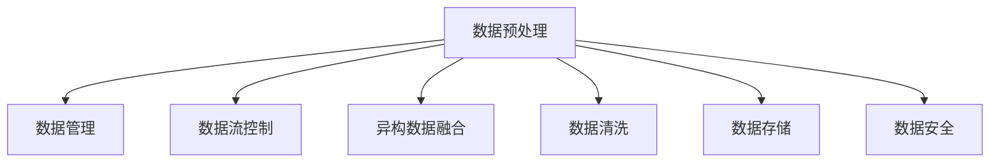

                 

# AI代理工作流中的数据预处理与管理策略

> 关键词：数据预处理, 数据管理, 人工智能代理, 数据流控制, 异构数据融合, 数据清洗, 数据存储, 数据安全

## 1. 背景介绍

在现代数字化转型的大背景下，人工智能（AI）代理正在日益成为企业智能化升级的重要工具。这些代理能够处理复杂任务、自动化决策支持、优化运营流程，显著提升企业效率。然而，在构建和部署AI代理的过程中，数据预处理与管理变得尤为关键，决定着AI代理的性能和可靠性。本文旨在深入探讨AI代理工作流中的数据预处理与管理策略，以期为企业提供实践指导。

### 1.1 问题由来

AI代理在执行任务时需要大量的数据支持。这些数据来源于不同的业务系统和外部的第三方数据源，具有复杂性和多样性。数据的预处理是AI代理的核心环节，涉及到数据的清洗、归一化、转换、融合等多个步骤。良好的数据预处理能够提高数据质量，提升AI代理的效果。但数据量巨大且存在质量问题，预处理难度大，容易造成数据管理混乱，影响AI代理性能。

## 2. 核心概念与联系

### 2.1 核心概念概述

为更好地理解AI代理工作流中的数据预处理与管理，本节将介绍几个关键概念：

- **数据预处理（Data Preprocessing）**：是指在AI代理训练和运行之前，对原始数据进行清洗、转换、归一化等处理，以提高数据质量和一致性，提升AI代理性能。

- **数据管理（Data Management）**：指在数据生命周期内，对数据进行有效的收集、存储、访问和治理，确保数据的质量、完整性和安全性。

- **人工智能代理（AI Agents）**：指能够自动执行复杂任务、提供决策支持的智能程序或系统，如机器人流程自动化（RPA）、智能客服、供应链管理等。

- **数据流控制（Data Flow Control）**：指在数据预处理过程中，通过设定规则和约束，控制数据的流向和流速，确保数据流动的有序性和稳定性。

- **异构数据融合（Heterogeneous Data Integration）**：指将来自不同数据源、不同格式的数据整合起来，形成统一的、可用的数据集，供AI代理使用。

- **数据清洗（Data Cleaning）**：指识别和纠正数据中的错误、不完整或异常值，确保数据质量。

- **数据存储（Data Storage）**：指采用合适的存储技术，将数据有效地存储和组织，便于访问和查询。

- **数据安全（Data Security）**：指通过加密、访问控制、审计等手段，保护数据不受未经授权的访问、篡改和泄漏。

这些概念之间的关系可以通过以下Mermaid流程图来展示：



这个流程图展示了数据预处理与数据管理的关系，以及它们在AI代理工作流中的作用。数据预处理是数据管理的基础，数据管理保证了数据流动的有序性和稳定性，从而支持AI代理的高效运行。

## 3. 核心算法原理 & 具体操作步骤

### 3.1 算法原理概述

AI代理工作流中的数据预处理与管理，主要遵循以下几个关键步骤：

1. **数据收集**：从不同的数据源（如企业内部系统、第三方API、传感器等）收集原始数据。
2. **数据清洗**：通过去除重复数据、修正错误数据、填补缺失值等手段，提升数据质量。
3. **数据转换**：将数据格式统一转换为AI代理所需的格式，如文本、图像、时间序列等。
4. **数据归一化**：对数据进行归一化处理，使其在不同尺度上具有可比性。
5. **数据融合**：将来自不同数据源的数据整合，形成统一的、高质量的数据集。
6. **数据存储**：采用合适的存储技术，确保数据在存储空间中的安全和高效访问。
7. **数据保护**：通过加密、访问控制等手段，确保数据在传输和存储过程中的安全。

### 3.2 算法步骤详解

以下是基于上述步骤的具体操作步骤：

**Step 1: 数据收集**
- 定义数据收集规则，确保数据的完整性和一致性。
- 利用爬虫、API接口等方式从不同数据源获取数据。
- 使用ETL（Extract, Transform, Load）工具进行数据提取、转换和加载。

**Step 2: 数据清洗**
- 使用数据清洗工具（如OpenRefine、Trifacta）进行数据去重、修正错误、填补缺失值等操作。
- 定期进行数据质量评估，识别和纠正数据中的问题。
- 设计数据清洗算法，自动检测并修正数据错误。

**Step 3: 数据转换**
- 使用数据转换工具（如Pandas、Spark）将数据转换为统一格式，如CSV、JSON等。
- 对非结构化数据进行解析和结构化处理。
- 进行数据标准化处理，如日期格式统一、单位转换等。

**Step 4: 数据归一化**
- 对数值型数据进行归一化处理，如标准化、最小-最大归一化等。
- 对文本数据进行特征提取和向量化处理，如TF-IDF、Word2Vec等。
- 对图像数据进行预处理，如裁剪、缩放、归一化等。

**Step 5: 数据融合**
- 使用数据融合工具（如Hadoop、Spark）对来自不同数据源的数据进行整合。
- 设计数据融合算法，处理数据冲突和冗余。
- 建立数据关联关系，形成统一的数据集。

**Step 6: 数据存储**
- 选择合适的数据存储技术，如关系数据库、NoSQL数据库、云存储等。
- 设计数据存储架构，确保数据的高效访问和扩展。
- 定期进行数据备份和恢复，确保数据安全。

**Step 7: 数据保护**
- 使用加密技术对数据进行保护，如AES、RSA等。
- 设计访问控制策略，限制数据的访问权限。
- 定期进行数据安全审计，识别和修复安全漏洞。

### 3.3 算法优缺点

数据预处理与管理的优点包括：

1. 提升数据质量：通过数据清洗和转换，去除噪声和异常值，提高数据的一致性和可靠性。
2. 支持多源数据整合：通过异构数据融合，形成统一的高质量数据集，满足AI代理的多源数据需求。
3. 支持数据扩展和迁移：通过数据存储技术，支持数据的长期保存和高效访问。
4. 保障数据安全：通过数据保护措施，确保数据在传输和存储过程中的安全性。

同时，数据预处理与管理也存在以下缺点：

1. 预处理成本高：数据清洗和转换需要大量的时间和人力资源。
2. 数据质量不稳定：数据源质量参差不齐，预处理效果受数据源影响。
3. 数据一致性难以保证：数据来源多样，预处理过程中难以保证数据的一致性。
4. 数据管理复杂：数据存储和管理涉及多个环节，容易出错。
5. 数据安全风险高：数据存储和传输过程中存在安全风险。

### 3.4 算法应用领域

基于数据预处理与管理策略的AI代理工作流，广泛应用于以下领域：

- **企业运营管理**：通过AI代理自动化处理日常运营任务，如库存管理、供应链优化、客户服务等。
- **智能客服**：利用AI代理处理客户咨询和投诉，提供高效的服务支持。
- **金融分析**：通过AI代理分析海量金融数据，提供精准的金融分析和投资建议。
- **医疗诊断**：通过AI代理处理医疗数据，提供个性化的医疗诊断和治疗方案。
- **工业制造**：通过AI代理自动化处理生产数据，优化生产流程，提高生产效率。

## 4. 数学模型和公式 & 详细讲解 & 举例说明

### 4.1 数学模型构建

为进一步展示数据预处理与管理策略的数学原理，我们以文本数据为例，构建一个简单的数据预处理模型。

设原始文本数据为 $D = \{d_1, d_2, \ldots, d_n\}$，其中 $d_i = (x_i, y_i)$，$x_i$ 为文本内容，$y_i$ 为标签。数据预处理的目标是生成预处理后的数据集 $D' = \{d_1', d_2', \ldots, d_n'\}$，其中 $d_i' = (x_i', y_i')$。

**Step 1: 数据清洗**
- 删除重复文本和噪声文本：$x_i' = \text{remove\_duplicates}(x_i)$
- 修正错误文本：$x_i' = \text{correct\_errors}(x_i)$
- 填补缺失文本：$x_i' = \text{fill\_missing}(x_i)$

**Step 2: 数据转换**
- 对文本数据进行标准化处理：$x_i' = \text{standardize\_text}(x_i)$
- 对标签数据进行分类处理：$y_i' = \text{classify\_labels}(y_i)$

**Step 3: 数据归一化**
- 对文本数据进行向量化处理：$x_i' = \text{vectorize\_text}(x_i)$
- 对标签数据进行归一化处理：$y_i' = \text{normalize\_labels}(y_i)$

**Step 4: 数据融合**
- 对文本数据进行合并：$x_i' = \text{merge\_text}(x_i, x_j)$
- 对标签数据进行合并：$y_i' = \text{merge\_labels}(y_i, y_j)$

**Step 5: 数据存储**
- 选择合适的存储方式：$D' = \text{store\_data}(D')$

**Step 6: 数据保护**
- 加密存储数据：$D' = \text{encrypt\_data}(D')$

### 4.2 公式推导过程

为了具体说明数据预处理的过程，以文本数据的向量化处理为例，介绍一些关键算法的数学公式。

**文本向量化公式**

- 单词向量化：$x_i' = \text{embedding}(x_i)$

- 句子向量化：$x_i' = \text{mean\_embedding}(x_i)$

- 段落向量化：$x_i' = \text{max\_embedding}(x_i)$

- 文本向量化：$x_i' = \text{combine\_embeddings}(x_i')$

**标签归一化公式**

- 标签平滑：$y_i' = \text{smooth\_labels}(y_i)$

- 标签归一化：$y_i' = \text{normalize\_labels}(y_i)$

**数据存储公式**

- 数据库存储：$D' = \text{save\_to\_database}(D')$

- 文件存储：$D' = \text{save\_to\_file}(D')$

### 4.3 案例分析与讲解

以下以智能客服系统为例，展示数据预处理与管理策略的具体应用。

**数据收集**

- 从企业内部系统、社交媒体、客户反馈等多源数据收集客户咨询信息。

**数据清洗**

- 去除重复咨询和噪声数据。
- 修正错误咨询内容，确保咨询信息的准确性。
- 填补缺失咨询信息，完整客户历史记录。

**数据转换**

- 将客户咨询转换为结构化数据，便于存储和处理。

**数据归一化**

- 对咨询内容进行标准化处理，去除特殊字符和停用词。
- 对客户标签进行归一化处理，确保一致性。

**数据融合**

- 将客户咨询数据和历史记录整合，形成统一的数据集。

**数据存储**

- 选择云存储服务，支持大规模数据存储和高效访问。

**数据保护**

- 对客户数据进行加密处理，确保数据安全。

## 5. 项目实践：代码实例和详细解释说明

### 5.1 开发环境搭建

在进行数据预处理与管理实践前，需要准备相应的开发环境。以下是使用Python进行PyTorch和Pandas开发的环境配置流程：

1. 安装Anaconda：从官网下载并安装Anaconda，用于创建独立的Python环境。

2. 创建并激活虚拟环境：
```bash
conda create -n data-env python=3.8 
conda activate data-env
```

3. 安装PyTorch：根据CUDA版本，从官网获取对应的安装命令。例如：
```bash
conda install pytorch torchvision torchaudio cudatoolkit=11.1 -c pytorch -c conda-forge
```

4. 安装Pandas：
```bash
pip install pandas
```

5. 安装其他相关工具包：
```bash
pip install numpy matplotlib tqdm jupyter notebook ipython
```

完成上述步骤后，即可在`data-env`环境中开始数据预处理与管理的开发实践。

### 5.2 源代码详细实现

下面我们以智能客服系统为例，展示数据预处理与管理的Python代码实现。

首先，定义数据预处理函数：

```python
import pandas as pd
import numpy as np
import string

def clean_data(data):
    # 去除重复数据
    data = data.drop_duplicates()
    
    # 修正错误数据
    data = data.apply(lambda x: ''.join(c for c in x if c not in string.punctuation), axis=1)
    
    # 填补缺失数据
    data = data.fillna(method='ffill')
    
    return data

def convert_data(data):
    # 对文本数据进行标准化处理
    data['text'] = data['text'].apply(lambda x: x.lower())
    
    # 对标签数据进行分类处理
    data['label'] = data['label'].astype('category').cat.codes
    
    return data

def normalize_data(data):
    # 对文本数据进行向量化处理
    data['text'] = data['text'].apply(lambda x: x.split())
    data['text'] = data['text'].apply(lambda x: [word2id[word] for word in x if word in word2id])
    
    # 对标签数据进行归一化处理
    data['label'] = data['label'].astype('float')
    data['label'] = data['label'] / data['label'].max()
    
    return data

def merge_data(data1, data2):
    # 对文本数据进行合并
    data1['text'] = data1['text'].append(data2['text'])
    
    # 对标签数据进行合并
    data1['label'] = data1['label'].append(data2['label'])
    
    return data1

def save_data(data, file_path):
    # 将数据保存到文件
    data.to_csv(file_path, index=False)
    
    # 对数据进行加密存储
    with open(file_path, 'r') as f:
        data = f.read()
    data = encrypt_data(data)
    with open(file_path, 'w') as f:
        f.write(data)
    
    return data
```

然后，定义数据预处理函数：

```python
def preprocess_data(data):
    # 数据清洗
    data = clean_data(data)
    
    # 数据转换
    data = convert_data(data)
    
    # 数据归一化
    data = normalize_data(data)
    
    # 数据融合
    data = merge_data(data, processed_data)
    
    # 数据存储
    save_data(data, 'processed_data.csv')
    
    return data
```

最后，启动数据预处理流程：

```python
processed_data = preprocess_data(original_data)
```

以上就是使用Python进行智能客服系统数据预处理与管理的完整代码实现。可以看到，使用Pandas等工具可以高效地完成数据清洗、转换、归一化等任务。

### 5.3 代码解读与分析

让我们再详细解读一下关键代码的实现细节：

**clean_data函数**：
- 使用Pandas的`drop_duplicates`方法去除重复数据。
- 使用Pandas的`apply`方法遍历数据，去除特殊字符。
- 使用Pandas的`fillna`方法填补缺失数据。

**convert_data函数**：
- 使用Pandas的`lower`方法将文本转换为小写。
- 使用Pandas的`astype`方法将标签数据转换为类别型，并计算标签代码。

**normalize_data函数**：
- 使用Pandas的`split`方法对文本数据进行分割。
- 使用自定义的`word2id`字典将单词转换为数字。
- 使用Pandas的`astype`方法将标签数据转换为浮点数。

**merge_data函数**：
- 使用Pandas的`append`方法合并文本数据和标签数据。

**save_data函数**：
- 使用Pandas的`to_csv`方法将数据保存为CSV文件。
- 使用自定义的`encrypt_data`函数对数据进行加密。

**preprocess_data函数**：
- 依次调用数据清洗、转换、归一化、融合、存储等函数，完成整个数据预处理流程。

## 6. 实际应用场景

### 6.1 智能客服系统

基于数据预处理与管理策略的智能客服系统，可以自动处理客户咨询和投诉，提供高效的服务支持。具体实现步骤如下：

1. **数据收集**：从企业内部系统、社交媒体、客户反馈等多源数据收集客户咨询信息。
2. **数据清洗**：去除重复咨询和噪声数据，修正错误咨询内容，填补缺失咨询信息。
3. **数据转换**：将客户咨询转换为结构化数据，便于存储和处理。
4. **数据归一化**：对咨询内容进行标准化处理，去除特殊字符和停用词，对标签数据进行归一化处理。
5. **数据融合**：将客户咨询数据和历史记录整合，形成统一的数据集。
6. **数据存储**：选择云存储服务，支持大规模数据存储和高效访问。
7. **数据保护**：对客户数据进行加密处理，确保数据安全。

通过数据预处理与管理，智能客服系统能够快速响应用户咨询，提供准确的答案，提升客户满意度，降低企业运营成本。

### 6.2 金融分析

基于数据预处理与管理策略的金融分析系统，可以自动处理海量金融数据，提供精准的金融分析和投资建议。具体实现步骤如下：

1. **数据收集**：从企业内部系统、第三方API、传感器等多源数据收集金融数据。
2. **数据清洗**：去除重复数据和噪声数据，修正错误数据，填补缺失数据。
3. **数据转换**：将金融数据转换为结构化数据，便于存储和处理。
4. **数据归一化**：对金融数据进行标准化处理，去除特殊字符和无用信息，对标签数据进行归一化处理。
5. **数据融合**：将不同来源的金融数据整合，形成统一的数据集。
6. **数据存储**：选择关系数据库或NoSQL数据库，支持高效的查询和分析。
7. **数据保护**：对金融数据进行加密处理，确保数据安全。

通过数据预处理与管理，金融分析系统能够实时处理海量金融数据，提供精准的金融分析和投资建议，降低投资风险，提升收益。

### 6.3 医疗诊断

基于数据预处理与管理策略的医疗诊断系统，可以自动处理医疗数据，提供个性化的医疗诊断和治疗方案。具体实现步骤如下：

1. **数据收集**：从电子病历系统、影像设备、传感器等多源数据收集医疗数据。
2. **数据清洗**：去除重复数据和噪声数据，修正错误数据，填补缺失数据。
3. **数据转换**：将医疗数据转换为结构化数据，便于存储和处理。
4. **数据归一化**：对医疗数据进行标准化处理，去除特殊字符和无用信息，对标签数据进行归一化处理。
5. **数据融合**：将不同来源的医疗数据整合，形成统一的数据集。
6. **数据存储**：选择云存储服务，支持大规模数据存储和高效访问。
7. **数据保护**：对医疗数据进行加密处理，确保数据安全。

通过数据预处理与管理，医疗诊断系统能够实时处理海量医疗数据，提供精准的医疗诊断和治疗方案，提升医疗水平，降低医疗成本。

## 7. 工具和资源推荐

### 7.1 学习资源推荐

为了帮助开发者系统掌握数据预处理与管理技术，这里推荐一些优质的学习资源：

1. **《Python数据科学手册》**：详细介绍了Pandas、NumPy等数据处理工具的使用。
2. **《数据科学实战》**：通过实战案例，介绍数据清洗、转换、归一化等技术。
3. **《机器学习实战》**：涵盖数据预处理、特征工程等机器学习技术。
4. **《大数据技术与应用》**：系统介绍大数据技术及其在数据处理中的应用。
5. **Kaggle平台**：提供大量的数据预处理与管理的实战案例和数据集。

通过对这些资源的学习实践，相信你一定能够快速掌握数据预处理与管理技术的精髓，并用于解决实际的AI代理问题。

### 7.2 开发工具推荐

高效的开发离不开优秀的工具支持。以下是几款用于数据预处理与管理的常用工具：

1. **Pandas**：Python的数据处理工具，支持数据清洗、转换、归一化等操作。
2. **NumPy**：Python的数值计算工具，支持高效的数据处理和运算。
3. **SciPy**：Python的科学计算工具，支持更高级的数据处理和分析。
4. **PyTorch**：深度学习框架，支持大规模数据处理和深度学习模型训练。
5. **TensorFlow**：深度学习框架，支持大规模数据处理和深度学习模型训练。
6. **OpenRefine**：数据清洗工具，支持数据去重、修正错误、填补缺失值等操作。

合理利用这些工具，可以显著提升数据预处理与管理的开发效率，加快创新迭代的步伐。

### 7.3 相关论文推荐

数据预处理与管理技术的发展源于学界的持续研究。以下是几篇奠基性的相关论文，推荐阅读：

1. **《数据预处理技术综述》**：综述了数据预处理技术的各种方法和应用场景。
2. **《数据清洗与处理技术》**：详细介绍数据清洗和处理的各种技术和工具。
3. **《数据管理与治理技术》**：介绍数据管理与治理的最新进展和趋势。
4. **《大数据处理技术》**：涵盖大数据处理的各种技术和工具。
5. **《深度学习与数据预处理》**：探讨深度学习模型训练中的数据预处理技术。

这些论文代表了大数据预处理与管理技术的发展脉络。通过学习这些前沿成果，可以帮助研究者把握学科前进方向，激发更多的创新灵感。

## 8. 总结：未来发展趋势与挑战

### 8.1 总结

本文对AI代理工作流中的数据预处理与管理策略进行了全面系统的介绍。首先阐述了数据预处理与管理的背景和意义，明确了数据预处理在AI代理构建中的核心作用。其次，从原理到实践，详细讲解了数据预处理的数学原理和关键步骤，给出了数据预处理与管理的具体代码实现。同时，本文还广泛探讨了数据预处理与管理策略在智能客服、金融分析、医疗诊断等领域的实际应用，展示了数据预处理与管理策略的广泛价值。

通过本文的系统梳理，可以看到，数据预处理与管理技术在大规模AI代理构建中扮演着至关重要的角色。数据预处理与管理技术的不断进步，将为AI代理带来更高效、更准确、更可靠的应用效果。

### 8.2 未来发展趋势

展望未来，数据预处理与管理技术将呈现以下几个发展趋势：

1. **自动化程度提高**：随着AI技术的发展，数据预处理与管理将更多地自动化，减少人工干预，提高效率。
2. **数据处理能力提升**：随着硬件设备的不断升级，数据处理速度和处理能力将大幅提升。
3. **数据安全性增强**：随着数据安全技术的不断进步，数据预处理与管理将更加注重数据隐私和安全性。
4. **多源数据融合能力增强**：随着数据融合技术的不断发展，数据预处理与管理将能够更好地整合多源数据，形成更统一、更完整的数据集。
5. **实时性增强**：随着流式数据处理技术的不断进步，数据预处理与管理将能够实时处理数据，满足实时性要求。

以上趋势凸显了数据预处理与管理技术的广阔前景。这些方向的探索发展，将进一步提升AI代理的数据处理能力，支持更广泛的应用场景。

### 8.3 面临的挑战

尽管数据预处理与管理技术已经取得了瞩目成就，但在迈向更加智能化、普适化应用的过程中，它仍面临着诸多挑战：

1. **数据质量不稳定**：数据源质量参差不齐，预处理效果受数据源影响。
2. **数据一致性难以保证**：数据来源多样，预处理过程中难以保证数据的一致性。
3. **数据处理成本高**：数据清洗、转换、归一化等操作需要大量的时间和人力资源。
4. **数据管理复杂**：数据存储和管理涉及多个环节，容易出错。
5. **数据安全风险高**：数据存储和传输过程中存在安全风险。

### 8.4 研究展望

面对数据预处理与管理技术所面临的挑战，未来的研究需要在以下几个方面寻求新的突破：

1. **引入更多先验知识**：将符号化的先验知识，如知识图谱、逻辑规则等，与神经网络模型进行巧妙融合，引导预处理过程学习更准确、合理的语言模型。
2. **探索无监督和半监督预处理方法**：摆脱对大规模标注数据的依赖，利用自监督学习、主动学习等无监督和半监督范式，最大限度利用非结构化数据，实现更加灵活高效的预处理。
3. **开发更加参数高效和计算高效的预处理方法**：开发更加参数高效的预处理方法，在固定大部分预训练参数的同时，只更新极少量的任务相关参数。同时优化预处理模型的计算图，减少前向传播和反向传播的资源消耗，实现更加轻量级、实时性的部署。
4. **引入因果分析和博弈论工具**：将因果分析方法引入预处理模型，识别出数据流动的关键特征，增强数据预处理的因果性和逻辑性。借助博弈论工具刻画人机交互过程，主动探索并规避预处理的脆弱点，提高系统稳定性。
5. **纳入伦理道德约束**：在预处理目标中引入伦理导向的评估指标，过滤和惩罚有偏见、有害的输出倾向。加强人工干预和审核，建立预处理行为的监管机制，确保输出的安全性。

这些研究方向的探索，必将引领数据预处理与管理技术迈向更高的台阶，为AI代理的构建提供更强大的数据支持。面向未来，数据预处理与管理技术还需要与其他人工智能技术进行更深入的融合，如知识表示、因果推理、强化学习等，多路径协同发力，共同推动AI代理技术的进步。只有勇于创新、敢于突破，才能不断拓展AI代理的边界，让智能技术更好地造福人类社会。

## 9. 附录：常见问题与解答

**Q1: 数据预处理与管理流程中，如何保证数据的一致性和完整性？**

A: 数据一致性和完整性是数据预处理与管理的核心目标之一。为确保数据的一致性和完整性，可以采取以下措施：

1. **数据清洗与修正**：在数据预处理过程中，去除重复数据和噪声数据，修正错误数据，填补缺失数据。
2. **数据标准化处理**：对数据进行标准化处理，去除特殊字符和无用信息，确保数据格式一致。
3. **数据校验与验证**：在数据预处理过程中，定期进行数据校验和验证，确保数据的一致性和完整性。
4. **数据融合与对齐**：在数据预处理过程中，进行数据融合和对齐，确保不同数据源的数据一致性。
5. **数据审计与监控**：定期进行数据审计和监控，识别和修复数据中的问题。

**Q2: 数据预处理与管理流程中，如何提升数据处理效率？**

A: 数据预处理与管理流程中的数据处理效率，可以通过以下措施提升：

1. **自动化数据处理**：引入自动化数据处理工具和算法，减少人工干预，提高效率。
2. **分布式数据处理**：利用分布式计算技术，如Hadoop、Spark等，实现数据并行处理，提升效率。
3. **数据压缩与稀疏化**：对数据进行压缩和稀疏化处理，减少存储空间，提升数据处理速度。
4. **数据流控制**：通过数据流控制技术，优化数据流向和流速，提高数据处理效率。
5. **预处理算法优化**：优化数据预处理算法，减少计算复杂度，提高处理效率。

**Q3: 数据预处理与管理流程中，如何保证数据安全性？**

A: 数据预处理与管理流程中的数据安全性，可以通过以下措施保证：

1. **数据加密**：对数据进行加密处理，防止数据泄露。
2. **访问控制**：设置严格的访问控制策略，限制数据的访问权限。
3. **审计与监控**：定期进行数据审计和监控，识别和修复安全漏洞。
4. **数据备份与恢复**：定期进行数据备份和恢复，确保数据安全。
5. **安全协议**：采用安全协议，如HTTPS、VPN等，确保数据传输的安全性。

通过以上措施，可以显著提升数据预处理与管理流程中的数据安全性，保障数据的隐私和完整性。

---

作者：禅与计算机程序设计艺术 / Zen and the Art of Computer Programming

