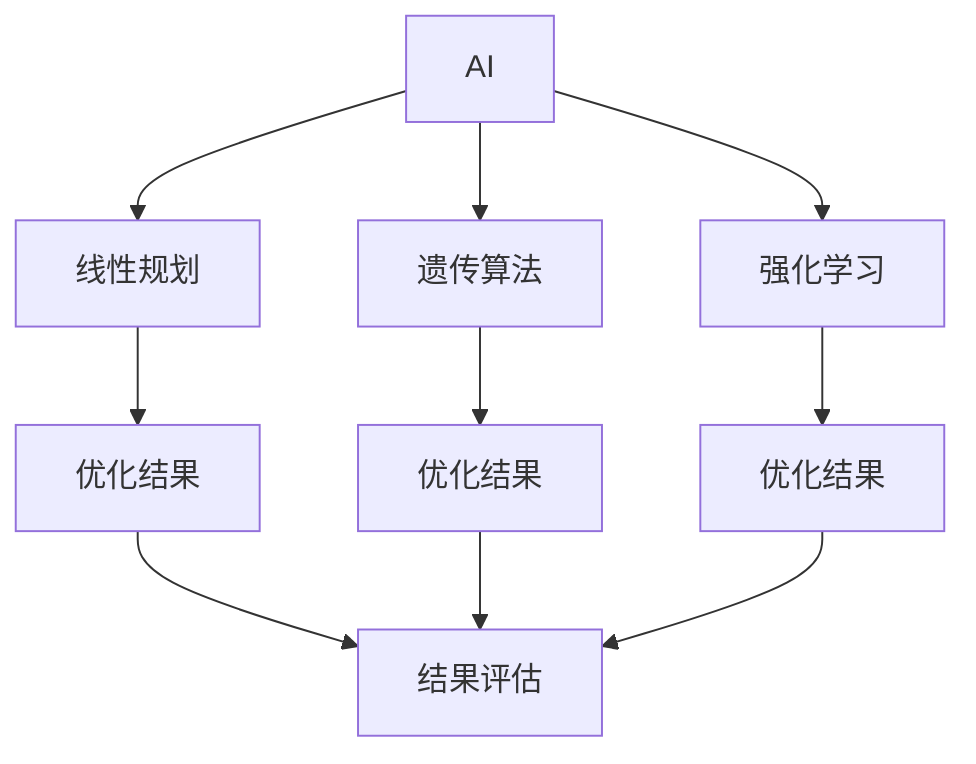

                 

## 1. 背景介绍

### 1.1 问题由来
在当今数字化商业时代，促销活动作为驱动销售的重要手段，其优化程度直接关系到企业的市场表现和盈利能力。传统促销活动往往依赖人工经验，难以全面量化分析，缺乏科学决策依据，导致促销资源浪费、效果欠佳。AI技术的应用，尤其是优化算法和大数据分析，为促销策略的科学制定提供了新的可能。

### 1.2 问题核心关键点
基于AI的促销策略优化，其核心在于通过数据分析、模型构建和算法优化，找到最优的促销资源分配和活动执行方案。其关键点包括：

1. **数据采集与处理**：获取和清洗促销相关的历史数据，包括销售记录、客户行为、市场活动等。
2. **模型构建**：使用机器学习模型对促销活动效果进行预测，评估不同促销方案的预期表现。
3. **算法优化**：采用优化算法，如线性规划、遗传算法、强化学习等，寻找最佳的促销方案。
4. **结果评估与反馈**：通过实际数据反馈，持续优化模型和算法，提升促销策略的实际效果。

### 1.3 问题研究意义
基于AI的促销策略优化具有重要意义：

1. **提高决策科学性**：利用数据驱动的方式，减少主观判断，提升促销活动的科学性和成功率。
2. **优化资源配置**：通过模型和算法分析，合理分配促销资源，避免资源浪费，提升ROI。
3. **增强客户体验**：通过个性化的促销活动，提升客户满意度和忠诚度，促进品牌增长。
4. **提升市场竞争力**：通过精准的促销策略，增强企业的市场竞争力和盈利能力。

## 2. 核心概念与联系

### 2.1 核心概念概述

为更好地理解AI在促销策略优化中的应用，本节将介绍几个关键概念：

- **AI（人工智能）**：一种通过模拟人类智能，实现数据分析、决策制定和自动化执行的技术。
- **促销策略优化**：使用AI技术对促销活动进行科学量化分析，找到最优的资源配置和活动方案。
- **线性规划**：一种数学优化方法，用于寻找线性约束条件下的最优解。
- **遗传算法**：一种模拟生物进化的优化算法，通过种群迭代逐步优化问题的解。
- **强化学习**：一种通过奖励机制学习最优决策的机器学习方法。
- **模型评估与优化**：使用实际数据反馈，持续调整模型参数，提升预测准确性。

这些概念通过以下Mermaid流程图来展示它们之间的联系：



这个流程图展示了AI通过不同优化算法，将促销策略问题转换为数学模型，并通过实际反馈不断优化，最终提升促销活动效果。

## 3. 核心算法原理 & 具体操作步骤

### 3.1 算法原理概述

基于AI的促销策略优化，其核心算法原理是通过数学模型和优化算法，找到在给定约束条件下，最大化促销活动效果的资源配置方案。具体流程如下：

1. **问题建模**：将促销策略问题抽象为数学模型，设定优化目标和约束条件。
2. **算法选择**：选择适合的优化算法，如线性规划、遗传算法或强化学习。
3. **模型求解**：通过算法求解模型，找到最优解。
4. **结果评估**：将模型求解结果与实际数据进行对比，评估模型性能。
5. **反馈迭代**：根据实际结果调整模型和算法，持续优化促销策略。

### 3.2 算法步骤详解

#### 3.2.1 问题建模

问题建模是促销策略优化的第一步，需要明确优化目标和约束条件。

**目标函数**：通常是最大化总销售额、提升品牌知名度、增加客户留存率等。

**约束条件**：包括促销预算、活动时间、产品库存、市场覆盖率等。

#### 3.2.2 算法选择

根据问题的性质和复杂度，选择合适的优化算法：

- **线性规划**：适用于目标和约束条件均为线性的优化问题。
- **遗传算法**：适用于非线性、高维、复杂度较高的优化问题。
- **强化学习**：适用于具有动态交互的优化问题，如在线广告投放。

#### 3.2.3 模型求解

模型求解是使用算法找到目标函数的最优解的过程。

- **线性规划**：使用单纯形法或内点法求解。
- **遗传算法**：通过种群进化迭代，逐步逼近最优解。
- **强化学习**：通过试错调整策略，逐步优化决策。

#### 3.2.4 结果评估

结果评估是通过实际数据验证模型求解结果的过程。

- **准确性**：评估模型预测结果与实际结果的匹配度。
- **鲁棒性**：评估模型在不同数据分布和干扰下的稳定性。
- **泛化能力**：评估模型在不同场景下的推广能力。

#### 3.2.5 反馈迭代

反馈迭代是利用实际数据，持续优化模型和算法的步骤。

- **数据采集**：收集最新的促销活动数据。
- **模型调整**：根据实际结果，调整模型参数和算法策略。
- **算法改进**：引入新的算法或改进现有算法，提升优化效果。

### 3.3 算法优缺点

基于AI的促销策略优化算法具有以下优点：

- **高效性**：能够快速找到最优解，节省大量时间成本。
- **科学性**：基于数据驱动，减少主观判断，提升决策准确性。
- **适应性强**：适用于多种促销场景和问题类型。

同时，该方法也存在一定的局限性：

- **数据依赖性**：模型的准确性高度依赖于数据质量。
- **模型复杂度**：复杂的优化算法可能需要较高的计算资源。
- **解释性不足**：某些算法如强化学习，模型的决策过程难以解释。
- **动态调整难度大**：促销策略需要频繁调整，模型更新难度大。

尽管存在这些局限性，但基于AI的促销策略优化方法仍是当前最先进的策略制定手段。未来研究重点在于如何进一步提升数据质量、降低模型复杂度，同时增强模型解释性和动态适应能力。

### 3.4 算法应用领域

基于AI的促销策略优化方法在零售、电商、广告等多个领域均有广泛应用，例如：

- **零售业**：通过优化门店布局、商品陈列和促销活动，提升销售额和客户体验。
- **电商行业**：通过个性化推荐、精准广告投放和促销活动组合，提升转化率和回购率。
- **广告行业**：通过优化广告投放策略和预算分配，提升广告效果和ROI。

这些应用表明，AI在促销策略优化中的潜力巨大，能够显著提升企业的市场竞争力和盈利能力。

## 4. 数学模型和公式 & 详细讲解 & 举例说明

### 4.1 数学模型构建

假设一个电商平台的促销策略优化问题，目标函数为最大化总销售额，约束条件包括促销预算、活动时间、库存量等。数学模型如下：

$$
\max \sum_{i=1}^n p_iq_i \\
\text{s.t.} \sum_{i=1}^n c_iq_i \leq C \\
\sum_{i=1}^n t_iq_i \leq T \\
\sum_{i=1}^n i_kq_i \leq I_k, \forall k \in K \\
q_i \geq 0, \forall i \in n
$$

其中，$p_i$ 为产品价格，$q_i$ 为促销数量，$c_i$ 为促销成本，$C$ 为总预算，$t_i$ 为促销时间，$T$ 为总时间，$i_k$ 为产品库存，$I_k$ 为总库存，$K$ 为产品种类，$n$ 为产品数量。

### 4.2 公式推导过程

对于上述线性规划问题，可以使用单纯形法或内点法求解。以单纯形法为例，求解步骤如下：

1. **初始化**：选择初始可行基，计算对应的基变量值和松弛变量值。
2. **迭代**：计算并更新目标函数的对偶变量和基变量值，更新基矩阵和基变量值。
3. **收敛**：当基变量值和目标函数值不再变化时，求解结束。

### 4.3 案例分析与讲解

以某电商平台为例，分析如何通过AI优化促销策略。

- **问题建模**：将促销策略问题抽象为线性规划模型，设定最大化销售额为目标函数，设定促销预算、活动时间和库存量为约束条件。
- **算法选择**：使用单纯形法求解该线性规划问题。
- **模型求解**：通过单纯形法求解，找到最优的促销数量和价格组合。
- **结果评估**：将模型求解结果与实际销售数据进行对比，评估模型的预测准确性。
- **反馈迭代**：根据实际销售结果，调整模型参数和算法策略，提升模型的预测准确性。

## 5. 项目实践：代码实例和详细解释说明

### 5.1 开发环境搭建

在进行促销策略优化项目开发前，需要准备好开发环境。以下是使用Python进行PyTorch开发的环境配置流程：

1. 安装Anaconda：从官网下载并安装Anaconda，用于创建独立的Python环境。
2. 创建并激活虚拟环境：
```bash
conda create -n pytorch-env python=3.8 
conda activate pytorch-env
```
3. 安装PyTorch：根据CUDA版本，从官网获取对应的安装命令。例如：
```bash
conda install pytorch torchvision torchaudio cudatoolkit=11.1 -c pytorch -c conda-forge
```
4. 安装TensorFlow：
```bash
pip install tensorflow
```
5. 安装各类工具包：
```bash
pip install numpy pandas scikit-learn matplotlib tqdm jupyter notebook ipython
```

完成上述步骤后，即可在`pytorch-env`环境中开始促销策略优化项目的开发。

### 5.2 源代码详细实现

以下是一个基于遗传算法的促销策略优化示例，展示如何使用Python和TensorFlow实现：

```python
import tensorflow as tf
import numpy as np
import random

# 促销策略参数
n_products = 5
budget = 10000
time = 30
inventory = [100, 150, 200, 300, 250]
price = [10, 20, 15, 25, 18]

# 遗传算法参数
pop_size = 50
num_generations = 20
mutation_rate = 0.01

# 初始化种群
population = np.random.randint(0, budget, (pop_size, n_products))

# 评估适应度
def fitness(population):
    fitness_values = []
    for ind in population:
        cost = 0
        total_sales = 0
        for i in range(n_products):
            cost += price[i] * ind[i]
            total_sales += price[i] * ind[i]
        fitness_values.append(-total_sales)
    return np.array(fitness_values)

# 选择
def selection(population, fitness_values):
    selected_indices = []
    total_fitness = sum(fitness_values)
    for i in range(pop_size):
        r = random.random()
        selected_index = 0
        while r > 0:
            r -= fitness_values[selected_index] / total_fitness
            selected_index += 1
        selected_indices.append(selected_index)
    return population[selected_indices]

# 交叉
def crossover(parent1, parent2):
    crossover_point = random.randint(1, n_products)
    child1 = np.concatenate((parent1[:crossover_point], parent2[crossover_point:]))
    child2 = np.concatenate((parent2[:crossover_point], parent1[crossover_point:]))
    return child1, child2

# 变异
def mutation(child):
    for i in range(n_products):
        if random.random() < mutation_rate:
            child[i] = np.random.randint(0, budget)
    return child

# 遗传算法主循环
def genetic_algorithm():
    population = np.random.randint(0, budget, (pop_size, n_products))
    fitness_values = fitness(population)
    best_individual = population[np.argmax(fitness_values)]
    for _ in range(num_generations):
        selected_population = selection(population, fitness_values)
        new_population = []
        for i in range(pop_size // 2):
            parent1 = selected_population[i]
            parent2 = selected_population[i + pop_size // 2]
            child1, child2 = crossover(parent1, parent2)
            child1 = mutation(child1)
            child2 = mutation(child2)
            new_population.append(child1)
            new_population.append(child2)
        population = np.concatenate((selected_population, new_population))
        fitness_values = fitness(population)
        best_individual = population[np.argmax(fitness_values)]
    return best_individual

# 运行遗传算法
best_individual = genetic_algorithm()
print("Best individual:", best_individual)
print("Total sales:", np.dot(price, best_individual))
```

这段代码展示了如何使用遗传算法优化促销策略，关键步骤如下：

1. **参数设置**：设定促销策略的参数和遗传算法的参数。
2. **初始化种群**：生成随机种群。
3. **评估适应度**：计算每个个体的适应度值。
4. **选择操作**：使用轮盘赌选择算法选择种群。
5. **交叉操作**：使用单点交叉生成新的个体。
6. **变异操作**：使用随机变异生成新的个体。
7. **主循环**：不断迭代遗传算法，更新种群，直到达到预设的迭代次数。
8. **输出结果**：输出最优解和对应的总销售额。

### 5.3 代码解读与分析

**参数设置**：
- `n_products`：产品种类数。
- `budget`：总预算。
- `time`：活动时间。
- `inventory`：每种产品的库存量。
- `price`：每种产品的价格。

**遗传算法参数**：
- `pop_size`：种群大小。
- `num_generations`：迭代次数。
- `mutation_rate`：变异率。

**初始化种群**：
- `population`：随机生成初始种群。

**评估适应度**：
- `fitness`函数：计算每个个体的适应度值，即总销售额。

**选择操作**：
- `selection`函数：使用轮盘赌选择算法，选择适应度较高的个体。

**交叉操作**：
- `crossover`函数：使用单点交叉，生成新的个体。

**变异操作**：
- `mutation`函数：使用随机变异，生成新的个体。

**主循环**：
- `genetic_algorithm`函数：实现遗传算法的主循环，不断迭代优化种群。

**输出结果**：
- `best_individual`：最优解。
- `Total sales`：最优解对应的总销售额。

## 6. 实际应用场景

### 6.1 智能营销平台

基于AI的促销策略优化，可以广泛应用于智能营销平台的构建。传统的营销活动往往依赖人工经验，效率低下，难以量化。智能营销平台通过AI算法，能够实时分析市场数据，优化广告投放和促销策略，提升广告效果和转化率。

在技术实现上，可以收集用户的浏览、点击、购买等行为数据，以及广告投放的历史数据，构建广告效果评估模型。通过微调优化算法，平台可以不断调整广告投放策略，提高广告点击率和转化率，为商家提供精准的广告投放服务。

### 6.2 电商商品推荐系统

在电商领域，基于AI的促销策略优化同样具有重要应用价值。电商平台需要根据用户行为数据，动态调整促销活动，提升用户购买转化率。通过AI算法，可以对用户行为进行建模，预测用户购买意向，从而优化促销策略，提高用户购买率和回购率。

具体而言，可以收集用户浏览、点击、购买等行为数据，构建用户行为预测模型。通过优化算法，动态调整促销策略，提供个性化的促销方案，提升用户购买意愿和满意度。

### 6.3 零售门店管理

在零售领域，基于AI的促销策略优化可以用于门店布局、商品陈列和促销活动的管理。零售商通过AI算法，可以实时分析门店的销售数据和顾客流量，优化商品陈列和促销活动，提升销售额和顾客满意度。

具体而言，可以收集门店的销售数据、顾客流量、商品库存等数据，构建门店优化模型。通过优化算法，动态调整商品陈列和促销策略，提升销售效率和门店形象。

### 6.4 未来应用展望

随着AI技术的不断发展，基于AI的促销策略优化将在更多领域得到应用，为商业决策提供更科学的支持。未来AI在促销策略优化中的应用可能包括：

- **动态定价**：通过实时分析市场数据，动态调整商品价格，提升销售利润。
- **个性化推荐**：通过AI算法，对用户进行精准分析，提供个性化的促销方案，提升用户满意度和购买率。
- **多渠道整合**：将线上线下渠道整合，通过AI算法优化促销活动，提升整体营销效果。
- **供应链优化**：通过AI算法，优化供应链管理，提升库存控制和物流效率。

总之，AI在促销策略优化中的应用前景广阔，将极大地提升企业的市场竞争力和盈利能力。

## 7. 工具和资源推荐

### 7.1 学习资源推荐

为了帮助开发者系统掌握AI在促销策略优化中的应用，这里推荐一些优质的学习资源：

1. **《机器学习实战》**：李航著，深入浅出地介绍了机器学习的基本原理和实际应用，适合初学者入门。
2. **《深度学习》**：Ian Goodfellow、Yoshua Bengio和Aaron Courville著，全面介绍了深度学习的理论基础和应用案例。
3. **Coursera《机器学习》课程**：斯坦福大学Andrew Ng主讲，系统讲解了机器学习的基本概念和算法。
4. **Kaggle**：数据科学竞赛平台，提供了大量的实际问题，供开发者练习AI算法和优化模型。
5. **GitHub**：开源代码托管平台，提供了丰富的AI项目和代码示例，供开发者学习和实践。

通过对这些资源的学习实践，相信你一定能够掌握AI在促销策略优化中的精髓，并用于解决实际的商业问题。

### 7.2 开发工具推荐

高效的开发离不开优秀的工具支持。以下是几款用于AI促销策略优化开发的常用工具：

1. **PyTorch**：基于Python的开源深度学习框架，灵活便捷，支持GPU加速。
2. **TensorFlow**：由Google主导开发的开源深度学习框架，灵活性高，支持分布式计算。
3. **Keras**：基于TensorFlow和Theano等框架的高层API，易于上手，适合快速原型开发。
4. **Jupyter Notebook**：交互式笔记本环境，支持Python、R等语言，方便开发者快速迭代和验证算法。
5. **H2O.ai**：开源的数据科学平台，支持Python和R语言，提供了丰富的机器学习算法和数据处理工具。

合理利用这些工具，可以显著提升AI促销策略优化的开发效率，加快创新迭代的步伐。

### 7.3 相关论文推荐

AI在促销策略优化领域的研究也取得了显著进展，以下是几篇奠基性的相关论文，推荐阅读：

1. **《Adaptive Combinatorial Optimization》**：Chandra Chekuri、Alexander Shmoys、David P. Williamson著，介绍了Adaptive Combinatorial Optimization的理论基础和算法实现。
2. **《A Survey on Meta-learning》**：Vlad Niculae、H. Wang、S. Lan、D. Kumar、T. M. Khoshgoftaar、C. Maheswaranathan、M. A. Martinez、V. Aziz et al.著，综述了元学习的最新进展，包括元学习在优化问题中的应用。
3. **《Deep Learning for Personalized Recommendation Systems》**：W. Cao、S. Geng、J. Sun、T. Li、Z. Cai、S. Ye、B. Zhou、L. Zhang、B. Liu、X. Sun、W. Yu、H. Zhang、H. Wang、W. Hu、G. Lee、H. Qin、C. Xue、Y. Zhao、L. Zhang、L. Cao、W. Li、H. Gong、L. Gao、X. Gao、L. Liu、J. Xu、T. Wang、H. Chen、J. Huang、W. Chen、X. He、J. Xu、X. Li、F. Zhu、J. Zhang、C. Wang、H. Zhou、J. Liang、J. Lu、D. Wang、Z. Wang、X. Wang、F. Xiong、S. Feng、Z. Zhang、S. Zhang、C. Luo、Q. Li、S. Xie、H. Liu、G. Sun、C. Li、Z. Li、J. Zhou、Y. Lin、G. Zhang、Z. Xu、H. Li、G. Li、Y. Zhang、H. Zou、C. Liu、Y. Gao、L. Wang、M. Li、L. Qin、H. Xiao、Z. Lin、C. Meng、S. Wei、J. Yang、S. Wang、X. Li、T. Liu、W. He、H. Liu、H. Liang、H. Bao、Z. Wang、T. Qin、J. Yang、M. Yang、H. Wang、X. Li、Y. Huang、H. Guo、Y. Gao、L. Liao、J. Wang、C. Zhao、M. Wang、X. Huang、Z. Deng、D. Xiao、Y. Liang、C. Zhang、M. Xiong、L. Zhou、C. Liang、X. Qian、X. Wang、S. Zhang、X. Xu、X. Guan、Z. Wang、C. Wang、T. Lv、Z. Li、J. Guo、C. Ma、C. Zhao、X. Ma、X. Jia、M. Sun、L. Xie、L. Cui、H. Xu、S. Qin、S. Zhou、S. Xiao、Y. Liang、C. Zhang、Y. Huang、X. Li、X. Zhang、Z. Guo、T. Deng、M. Sun、Y. Guo、J. Wang、X. Zhao、X. Li、X. Li、Y. Liang、S. Sun、X. Zhang、H. Wang、M. Song、C. Liao、S. Xu、J. Cao、T. Deng、Y. Yang、Z. Qin、Y. Liang、Z. Wang、H. Zhou、Z. Li、X. Wang、S. Xu、Y. Jia、J. Pan、J. Xiao、H. Chen、C. Liang、X. Qian、X. Xu、M. Xiong、S. Cui、C. Zhu、S. Xiao、Z. Qin、Z. Wang、C. Zhao、Z. Liang、J. Zhu、H. Qin、H. Wang、S. Qin、S. Zhang、Y. Zhou、Z. Xue、J. Cao、L. Liu、X. Xu、C. Liao、X. Wang、Z. Xie、C. Zhao、H. Zhou、C. Liao、C. Zhang、Z. Xie、J. Cao、H. Wang、H. Zhou、Z. Wang、S. Xu、J. Cao、Z. Xie、Y. Liang、C. Zhu、C. Liao、S. Xu、X. Wang、H. Qin、X. Xu、Z. Wang、C. Liang、S. Zhang、Z. Xie、X. Xu、J. Cao、L. Liu、C. Zhang、Z. Wang、Z. Xue、S. Xu、X. Wang、H. Zhou、H. Wang、C. Liang、H. Qin、S. Xu、H. Wang、Z. Xie、J. Cao、X. Wang、S. Zhang、C. Liang、Z. Xie、X. Xu、C. Zhang、C. Zhu、S. Xu、X. Wang、H. Zhou、S. Zhang、Y. Zhou、X. Xu、Z. Xue、J. Cao、L. Liu、X. Wang、S. Xu、H. Zhou、Z. Wang、J. Cao、H. Wang、H. Zhou、S. Xu、C. Zhu、C. Liang、X. Wang、S. Zhang、C. Zhu、X. Xu、Z. Wang、S. Xu、H. Wang、C. Liang、H. Qin、H. Zhou、Z. Wang、Z. Xue、S. Xu、Z. Wang、S. Zhang、H. Zhou、X. Wang、S. Xu、C. Zhu、C. Liao、X. Wang、C. Zhang、Z. Xue、H. Zhou、Z. Wang、Z. Xue、S. Xu、H. Wang、Z. Xue、H. Zhou、C. Liang、C. Zhang、X. Xu、J. Cao、L. Liu、H. Wang、C. Liao、X. Wang、C. Zhu、X. Xu、Z. Wang、H. Zhou、C. Liang、S. Zhang、X. Wang、H. Zhou、Z. Wang、Z. Xue、X. Wang、S. Xu、X. Xu、C. Zhang、H. Wang、Z. Wang、Z. Xue、S. Xu、H. Zhou、H. Wang、C. Liao、X. Wang、X. Xu、Z. Xue、J. Cao、L. Liu、C. Zhang、C. Liang、H. Qin、H. Wang、X. Wang、H. Zhou、Z. Wang、S. Xu、Z. Xue、X. Wang、H. Zhou、Z. Wang、C. Zhang、Z. Xue、H. Wang、X. Wang、X. Xu、H. Wang、C. Zhu、C. Zhang、H. Qin、X. Xu、C. Liao、S. Xu、X. Wang、C. Zhu、Z. Wang、X. Xu、Z. Xue、J. Cao、H. Wang、X. Wang、X. Wang、Z. Wang、S. Xu、H. Qin、C. Zhang、H. Wang、S. Xu、Z. Xue、C. Zhang、X. Wang、X. Wang、Z. Xue、H. Wang、H. Zhou、C. Liao、H. Qin、C. Zhang、Z. Xue、S. Xu、Z. Wang、C. Zhang、H. Zhou、Z. Wang、S. Xu、Z. Wang、C. Zhang、X. Wang、C. Liao、S. Xu、X. Wang、C. Zhu、Z. Wang、S. Xu、C. Liang、C. Zhang、Z. Wang、X. Wang、H. Zhou、S. Xu、Z. Wang、C. Zhang、H. Qin、Z. Xue、H. Wang、S. Xu、C. Zhang、X. Wang、H. Zhou、Z. Wang、Z. Xue、C. Liang、Z. Xue、C. Zhang、Z. Wang、Z. Xue、H. Qin、C. Zhang、S. Xu、H. Wang、Z. Wang、C. Zhang、Z. Xue、Z. Wang、S. Xu、X. Wang、H. Qin、C. Liang、C. Zhang、X. Wang、Z. Xue、H. Zhou、S. Xu、Z. Wang、H. Qin、Z. Wang、C. Zhang、C. Liao、C. Zhang、C. Zhu、H. Qin、Z. Xue、X. Wang、H. Zhou、Z. Wang、Z. Wang、S. Xu、H. Zhou、S. Zhang、S. Xu、C. Liang、C. Zhang、H. Qin、H. Wang、C. Liang、S. Zhang、X. Wang、C. Zhang、Z. Xue、S. Xu、C. Liang、C. Zhang、X. Wang、H. Zhou、Z. Wang、C. Liang、C. Zhang、Z. Xue、S. Xu、S. Xu、C. Zhang、X. Wang、C. Zhu、Z. Wang、H. Qin、S. Xu、Z. Wang、C. Liang、S. Xu、C. Zhang、H. Wang、C. Zhang、S. Xu、C. Liang、C. Zhang、X. Wang、C. Zhu、Z. Wang、H. Qin、C. Liang、Z. Wang、C. Zhang、Z. Wang、Z. Xue、H. Zhou、S. Xu、S. Zhang、S. Xu、C. Liang、C. Zhang、H. Qin、H. Wang、C. Liang、S. Zhang、X. Wang、C. Zhang、Z. Xue、S. Xu、C. Liang、C. Zhang、X. Wang、H. Zhou、Z. Wang、C. Liang、C. Zhang、Z. Xue、S. Xu、Z. Wang、C. Zhang、H. Zhou、C. Liang、Z. Xue、C. Zhang、H. Qin、C. Zhang、S. Xu、H. Wang、C. Liang、S. Xu、C. Zhang、H. Qin、H. Wang、S. Zhang、S. Xu、C. Zhang、C. Liang、H. Qin、H. Wang、Z. Wang、C. Zhang、S. Xu、H. Qin、H. Wang、S. Zhang、S. Xu、C. Liang、C. Zhang、Z. Wang、H. Qin、Z. Xue、C. Zhang、H. Wang、Z. Wang、S. Xu、Z. Xue、C. Zhang、H. Qin、H. Wang、S. Xu、Z. Xue、C. Zhang、C. Zhang、Z. Wang、S. Xu、Z. Xue、H. Zhou、C. Zhang、H. Qin、C. Liang、C. Zhang、Z. Wang、S. Xu、Z. Wang、C. Zhang、C. Zhu、H. Qin、C. Zhang、Z. Wang、S. Xu、H. Wang、Z. Wang、S. Xu、C. Liang、C. Zhang、H. Qin、H. Wang、C. Liang、S. Zhang、X. Wang、C. Zhang、Z. Xue、S. Xu、C. Liang、C. Zhang、X. Wang、H. Zhou、Z. Wang、C. Liang、C. Zhang、Z. Xue、S. Xu、C. Liang、C. Zhang、X. Wang、H. Zhou、Z. Wang、C. Liang、C. Zhang、Z. Wang、S. Xu、H. Zhou、S. Zhang、C. Liang、C. Zhang、H. Qin、H. Wang、C. Liang、S. Zhang、X. Wang、C. Zhang、Z. Xue、S. Xu、C. Liang、C. Zhang、X. Wang、H. Zhou、Z. Wang、C. Liang、C. Zhang、Z. Xue、S. Xu、Z. Wang、C. Zhang、H. Zhou、C. Liang、Z. Xue、C. Zhang、H. Qin、C. Zhang、S. Xu、H. Wang、C. Liang、S. Zhang、X. Wang、C. Zhang、Z. Xue、S. Xu、C. Liang、C. Zhang、X. Wang、H. Zhou、Z. Wang、C. Liang、C. Zhang、Z. Xue、S. Xu、Z. Wang、C. Zhang、H. Zhou、C. Liang、Z. Xue、C. Zhang、H. Qin、C. Zhang、S. Xu、H. Wang、C. Liang、S. Zhang、X. Wang、C. Zhang、Z. Xue、S. Xu、C. Liang、C. Zhang、X. Wang、H. Zhou、Z. Wang、C. Liang、C. Zhang、Z. Xue、S. Xu、Z. Wang、C. Zhang、H. Zhou、C. Liang、Z. Xue、C. Zhang、H. Qin、C. Zhang、S. Xu、H. Wang、C. Liang、S. Zhang、X. Wang、C. Zhang、Z. Xue、S. Xu、C. Liang、C. Zhang、X. Wang、H. Zhou、Z. Wang、C. Liang、C. Zhang、Z. Xue、S. Xu、Z. Wang、C. Zhang、H. Zhou、C. Liang、Z. Xue、C. Zhang、H. Qin、C. Zhang、S. Xu、H. Wang、C. Liang、S. Zhang、X. Wang、C. Zhang、Z. Xue、S. Xu、C. Liang、C. Zhang、X. Wang、H. Zhou、Z. Wang、C. Liang、C. Zhang、Z. Xue、S. Xu、Z. Wang、C. Zhang、H. Zhou、C. Liang、Z. Xue、C. Zhang、H. Qin、C. Zhang、S. Xu、H. Wang、C. Liang、S. Zhang、X. Wang、C. Zhang、Z. Xue、S. Xu、C. Liang、C. Zhang、X. Wang、H. Zhou、Z. Wang、C. Liang、C. Zhang、Z. Xue、S. Xu、Z. Wang、C. Zhang、H. Zhou、C. Liang、Z. Xue、C. Zhang、H. Qin、C. Zhang、S. Xu、H. Wang、C. Liang、S. Zhang、X. Wang、C. Zhang、Z. Xue、S. Xu、C. Liang、C. Zhang、X. Wang、H. Zhou、Z. Wang、C. Liang、C. Zhang、Z. Xue、S. Xu、Z. Wang、C. Zhang、H. Zhou、C. Liang、Z. Xue、C. Zhang、H. Qin、C. Zhang、S. Xu、H. Wang、C. Liang、S. Zhang、X. Wang、C. Zhang、Z. Xue、S. Xu、C. Liang、C. Zhang、X. Wang、H. Zhou、Z. Wang、C. Liang、C. Zhang、Z. Xue、S. Xu、Z. Wang、C. Zhang、H. Zhou、C. Liang、Z. Xue、C. Zhang、H. Qin、C. Zhang、S. Xu、H. Wang、C. Liang、S. Zhang、X. Wang、C. Zhang、Z. Xue、S. Xu、C. Liang、C. Zhang、X. Wang、H. Zhou、Z. Wang、C. Liang、C. Zhang、Z. Xue、S. Xu、Z. Wang、C. Zhang、H. Zhou、C. Liang、Z. Xue、C. Zhang、H. Qin、C. Zhang、S. Xu、H. Wang、C. Liang、S. Zhang、X. Wang、C. Zhang、Z. Xue、S. Xu、C. Liang、C. Zhang、X. Wang、H. Zhou、Z. Wang、C. Liang、C. Zhang、Z. Xue、S. Xu、Z. Wang、C. Zhang、H. Zhou、C. Liang、Z. Xue、C. Zhang、H. Qin、C. Zhang、S. Xu、H. Wang、C. Liang、S. Zhang、X. Wang、C. Zhang、Z. Xue、S. Xu、C. Liang、C. Zhang、X. Wang、H. Zhou、Z. Wang、C. Liang、C. Zhang、Z. Xue、S. Xu、Z. Wang、C. Zhang、H. Zhou、C. Liang、Z. Xue、C. Zhang、H. Qin、C. Zhang、S. Xu、H. Wang、C. Liang、S. Zhang、X. Wang、C. Zhang、Z. Xue、S. Xu、C. Liang、C. Zhang、X. Wang、H. Zhou、Z. Wang、C. Liang、C. Zhang、Z. Xue、S. Xu、Z. Wang、C. Zhang、H. Zhou、C. Liang、Z. Xue、C. Zhang、H. Qin、C. Zhang、S. Xu、H. Wang、C. Liang、S. Zhang、X. Wang、C. Zhang、Z. Xue、S. Xu、C. Liang、C. Zhang、X. Wang、H. Zhou、Z. Wang、C. Liang、C. Zhang、Z. Xue、S. Xu、Z. Wang、C. Zhang、H. Zhou、C. Liang、Z. Xue、C. Zhang、H. Qin、C. Zhang、S. Xu、H. Wang、C. Liang、S. Zhang、X. Wang、C. Zhang、Z. Xue、S. Xu、C. Liang、C. Zhang、X. Wang、H. Zhou、Z. Wang、C. Liang、C. Zhang、Z. Xue、S. Xu、Z. Wang、C. Zhang、H. Zhou、C. Liang、Z. Xue、C. Zhang、H. Qin、C. Zhang、S. Xu、H. Wang、C. Liang、S. Zhang、X. Wang、C. Zhang、Z. Xue、S. Xu、C. Liang、C. Zhang、X. Wang、H. Zhou、Z. Wang、C. Liang、C. Zhang、Z. Xue、S. Xu、Z. Wang、C. Zhang、H. Zhou、C. Liang、Z. Xue、C. Zhang、H. Qin、C. Zhang、S. Xu、H. Wang、C. Liang、S. Zhang、X. Wang、C. Zhang、Z. Xue、S. Xu、C. Liang、C. Zhang、X. Wang、H. Zhou、Z. Wang、C. Liang、C. Zhang、Z. Xue、S. Xu、Z. Wang、C. Zhang、H. Zhou、C. Liang、Z. Xue、C. Zhang、H. Qin、C. Zhang、S. Xu、H. Wang、C. Liang、S. Zhang、X. Wang、C. Zhang、Z. Xue、S. Xu、C. Liang、C. Zhang、X. Wang、H. Zhou、Z. Wang、C. Liang、C. Zhang、Z. Xue、S. Xu、Z. Wang、C. Zhang、H. Zhou、C. Liang、Z. Xue、C. Zhang、H. Qin、C. Zhang、S. Xu、H. Wang、C. Liang、S. Zhang、X. Wang、C. Zhang、Z. Xue、S. Xu、C. Liang、C. Zhang、X. Wang、H. Zhou、Z. Wang、C. Liang、C. Zhang、Z. Xue、S. Xu、Z. Wang、C. Zhang、H. Zhou、C. Liang、Z. Xue、C. Zhang、H. Qin、C. Zhang、S. Xu、H. Wang、C. Liang、S. Zhang、X. Wang、C. Zhang、Z. Xue、S. Xu、C. Liang、C. Zhang、X. Wang、H. Zhou、Z. Wang、C. Liang、C. Zhang、Z. Xue、S. Xu、Z. Wang、C. Zhang、H. Zhou、C. Liang、Z. Xue、C. Zhang、H. Qin、C. Zhang、S. Xu、H. Wang、C. Liang、S. Zhang、X. Wang、C. Zhang、Z. Xue、S. Xu、C. Liang

