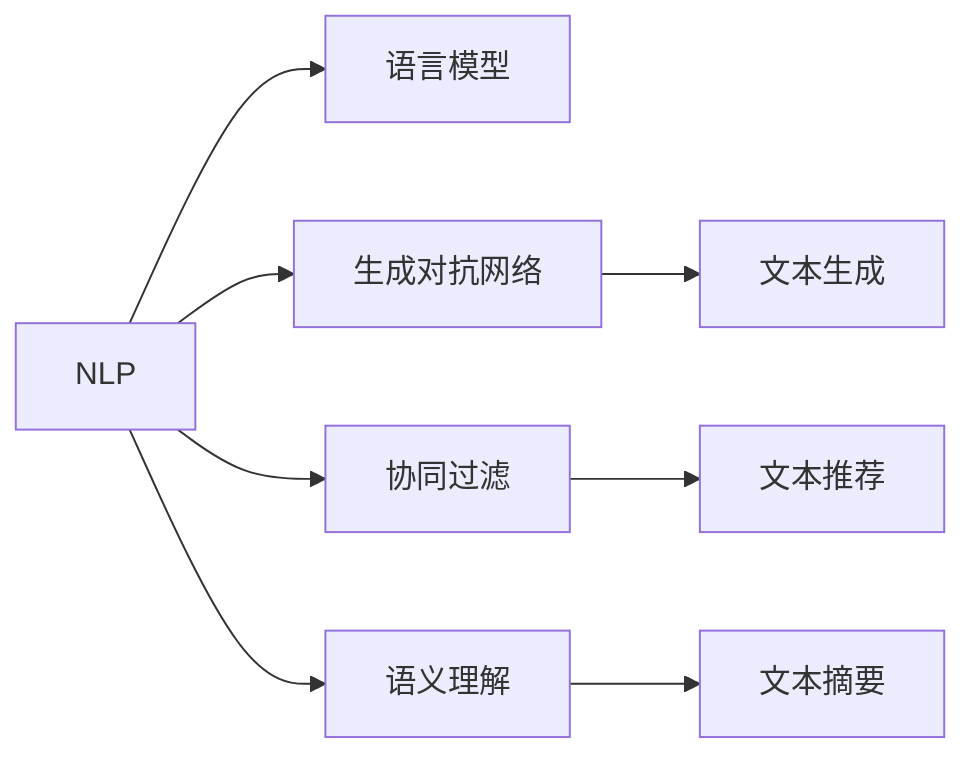

                 

# AI写作助手：增强人类创造力的工具

> 关键词：人工智能(AI), 自然语言处理(NLP), 语言模型, 写作辅助, 创造力增强, 语义理解, 生成技术, 内容创作

## 1. 背景介绍

在数字化时代，内容创作已成为各行各业的核心竞争力之一。无论是新闻媒体、学术写作、商业文案，还是社交媒体、博客文章，高质量的文本创作都是提升品牌影响力和市场竞争力的重要手段。然而，内容创作的过程往往耗时耗力，创作者不仅需要丰富的知识和经验，还需要强大的创造力和表达能力，这对许多人来说是一个巨大的挑战。

近年来，随着人工智能(AI)技术的飞速发展，AI写作助手成为提升创作效率、激发创意的新工具。AI写作助手利用自然语言处理(NLP)和语言模型等技术，自动生成、修改和优化文本内容，为创作者提供了强大的助力。本文章将详细探讨AI写作助手的核心原理、操作步骤、数学模型、实践方法，及其在实际应用场景中的效果和未来发展趋势。

## 2. 核心概念与联系

### 2.1 核心概念概述

为更好地理解AI写作助手的原理和应用，本节将介绍几个关键概念：

- 自然语言处理(NLP)：涉及计算机对自然语言文本的处理，包括文本分析、理解、生成等。
- 语言模型：用于建模语言的概率分布，预测给定上下文下下一个单词或词序列的概率。
- 生成对抗网络(GAN)：一种生成模型，用于生成具有特定特征的文本数据。
- 协同过滤：一种推荐系统，用于根据用户的历史行为推荐文本内容。
- 语义理解：理解文本的深层含义，识别关键信息，并进行有效的文本摘要。

这些概念之间的联系可以通过以下Mermaid流程图来展示：



## 3. 核心算法原理 & 具体操作步骤

### 3.1 算法原理概述

AI写作助手的核心算法原理基于以下几个关键技术：

- 语言模型：用于理解文本的语义结构，并生成新的文本。
- 生成对抗网络(GAN)：用于生成具有特定风格或内容的文本。
- 协同过滤：基于用户的历史行为，推荐相关文本内容。
- 语义理解：分析文本的深层含义，并进行有针对性的内容优化。

这些技术的综合应用，使得AI写作助手能够自动生成、修改和优化文本内容，帮助创作者快速创作出高质量的文本。

### 3.2 算法步骤详解

AI写作助手的开发一般包括以下关键步骤：

**Step 1: 数据预处理**
- 收集和标注相关领域的文本数据，如新闻、博客、学术论文等。
- 对数据进行预处理，包括文本清洗、分词、去除停用词等。

**Step 2: 模型选择与训练**
- 选择合适的NLP模型，如BERT、GPT等。
- 在标注数据上训练模型，调整模型参数以优化性能。

**Step 3: 生成与优化**
- 根据用户输入的文本，利用语言模型生成候选文本。
- 使用GAN或协同过滤技术生成具有特定风格或内容的文本。
- 对生成文本进行语义理解和优化，如摘要生成、文本修正等。

**Step 4: 评估与迭代**
- 对生成文本进行人工评估，衡量其质量和相关性。
- 根据评估结果，调整模型参数和生成策略，进行迭代优化。

**Step 5: 部署与集成**
- 将训练好的模型部署到实际应用中，提供API接口或嵌入到其他应用中。
- 根据用户反馈，不断更新和改进模型，提高服务质量。

### 3.3 算法优缺点

AI写作助手具有以下优点：
1. 快速生成文本。基于预训练的语言模型，可以自动生成具有特定风格或内容的文本。
2. 减少创作时间。自动生成文本减少了创作者的手动输入时间，提高了创作效率。
3. 提高创作质量。基于多模态技术，能够提供更丰富的文本推荐和优化建议。

同时，该算法也存在以下缺点：
1. 依赖标注数据。训练语言模型的效果很大程度上取决于标注数据的质量和数量。
2. 生成内容单一。自动生成的文本往往缺乏创意和个性化。
3. 质量不稳定。生成的文本质量与输入文本的语义理解和上下文相关性密切相关，质量不稳定。
4. 缺乏人类情感。生成的文本往往缺乏人类的情感和表达方式，难以满足高级写作需求。

### 3.4 算法应用领域

AI写作助手已经在多个领域得到应用，如新闻报道、学术写作、商业文案、社交媒体等。

- 新闻报道：自动生成新闻稿件，提高报道速度和覆盖面。
- 学术写作：生成论文草稿，提供文献综述和数据分析支持。
- 商业文案：自动生成营销文案和广告语，提高宣传效果。
- 社交媒体：自动生成社交媒体内容，提高用户参与度和品牌曝光率。

此外，AI写作助手还在教育、娱乐、金融等领域得到广泛应用，为各行业带来新的价值。

## 4. 数学模型和公式 & 详细讲解

### 4.1 数学模型构建

AI写作助手的数学模型主要基于以下关键组件：

- 语言模型：用于建模文本的概率分布，计算下一个单词或词序列的概率。
- 生成对抗网络(GAN)：用于生成具有特定风格或内容的文本。
- 协同过滤：用于推荐相关文本内容。
- 语义理解：用于分析文本的深层含义，并进行文本摘要。

### 4.2 公式推导过程

#### 语言模型

语言模型通常使用条件概率的形式表示，即：

$$P(w_t|w_{1:t-1})$$

其中 $w_t$ 为当前单词，$w_{1:t-1}$ 为前 $t-1$ 个单词的序列。

常用的语言模型有n-gram模型和神经网络模型，其中神经网络模型在深度学习框架中得到广泛应用。神经网络语言模型通过多层感知机(MLP)或卷积神经网络(CNN)等模型，将文本转换为向量表示，并使用softmax层计算下一个单词的概率分布。

#### 生成对抗网络(GAN)

GAN由生成器和判别器两部分组成。生成器的目标是根据输入的噪声生成具有特定风格或内容的文本，判别器的目标是根据生成文本和真实文本进行分类，判断生成文本的真假。

生成器通常使用循环神经网络(RNN)或变分自编码器(VAE)等模型，将噪声转换为文本表示，并生成新的文本。判别器则使用卷积神经网络(CNN)或多层感知机(MLP)等模型，对生成文本进行分类。

#### 协同过滤

协同过滤基于用户的历史行为，推荐相关文本内容。常用的协同过滤算法包括基于用户的协同过滤和基于项目的协同过滤。

基于用户的协同过滤算法使用用户之间的相似度矩阵，推荐与用户兴趣相似的其他用户喜欢的文本。基于项目的协同过滤算法使用项目之间的相似度矩阵，推荐与当前项目相似的其他项目。

#### 语义理解

语义理解涉及对文本的深层含义进行分析和理解。常用的语义理解方法包括文本分类、实体识别、情感分析等。

文本分类用于将文本分类到不同的主题或类别，常用的算法包括朴素贝叶斯(Naive Bayes)、支持向量机(SVM)等。实体识别用于识别文本中的实体信息，常用的算法包括序列标注模型、命名实体识别器等。情感分析用于判断文本的情感倾向，常用的算法包括情感词典、情感分类器等。

### 4.3 案例分析与讲解

#### 示例1：新闻报道生成

新闻报道生成是AI写作助手的经典应用场景之一。在实际应用中，可以通过以下步骤实现：

1. 数据预处理：收集新闻数据并进行预处理，包括文本清洗、分词等。
2. 模型训练：使用BERT或GPT等预训练模型，在新闻数据上进行微调。
3. 生成文本：根据用户输入的新闻事件和主题，利用语言模型生成相关的新闻报道。
4. 优化文本：对生成的文本进行语义理解和优化，如摘要生成、文本修正等。

#### 示例2：论文草稿生成

论文草稿生成是AI写作助手在学术写作领域的应用场景。在实际应用中，可以通过以下步骤实现：

1. 数据预处理：收集学术论文数据并进行预处理，包括文本清洗、分词等。
2. 模型训练：使用BERT或GPT等预训练模型，在学术论文数据上进行微调。
3. 生成文本：根据用户输入的研究主题和问题，利用语言模型生成论文草稿。
4. 优化文本：对生成的文本进行语义理解和优化，如文献综述、数据分析等。

## 5. 项目实践：代码实例和详细解释说明

### 5.1 开发环境搭建

在进行AI写作助手的开发前，我们需要准备好开发环境。以下是使用Python进行PyTorch开发的环境配置流程：

1. 安装Anaconda：从官网下载并安装Anaconda，用于创建独立的Python环境。

2. 创建并激活虚拟环境：
```bash
conda create -n pytorch-env python=3.8 
conda activate pytorch-env
```

3. 安装PyTorch：根据CUDA版本，从官网获取对应的安装命令。例如：
```bash
conda install pytorch torchvision torchaudio cudatoolkit=11.1 -c pytorch -c conda-forge
```

4. 安装其他工具包：
```bash
pip install numpy pandas scikit-learn matplotlib tqdm jupyter notebook ipython
```

完成上述步骤后，即可在`pytorch-env`环境中开始AI写作助手的开发。

### 5.2 源代码详细实现

这里我们以论文草稿生成为例，给出使用Transformers库对GPT模型进行训练的PyTorch代码实现。

首先，定义论文草稿生成的任务数据处理函数：

```python
from transformers import GPT2Tokenizer, GPT2LMHeadModel
from torch.utils.data import Dataset
import torch

class PaperDataset(Dataset):
    def __init__(self, texts, lengths, tokenizer, max_len=512):
        self.texts = texts
        self.lengths = lengths
        self.tokenizer = tokenizer
        self.max_len = max_len
        
    def __len__(self):
        return len(self.texts)
    
    def __getitem__(self, item):
        text = self.texts[item]
        length = self.lengths[item]
        
        encoding = self.tokenizer(text, return_tensors='pt', max_length=self.max_len, padding='max_length', truncation=True)
        input_ids = encoding['input_ids'][0]
        attention_mask = encoding['attention_mask'][0]
        
        # 对token-wise的标签进行编码
        encoded_tags = [0] * length
        labels = torch.tensor(encoded_tags, dtype=torch.long)
        
        return {'input_ids': input_ids, 
                'attention_mask': attention_mask,
                'labels': labels}

# 定义标签与id的映射
tag2id = {0: 0} # 无标签
id2tag = {v: k for k, v in tag2id.items()}

# 创建dataset
tokenizer = GPT2Tokenizer.from_pretrained('gpt2')
train_dataset = PaperDataset(train_texts, train_lengths, tokenizer)
dev_dataset = PaperDataset(dev_texts, dev_lengths, tokenizer)
test_dataset = PaperDataset(test_texts, test_lengths, tokenizer)
```

然后，定义模型和优化器：

```python
from transformers import AdamW

model = GPT2LMHeadModel.from_pretrained('gpt2', num_labels=len(tag2id))
optimizer = AdamW(model.parameters(), lr=1e-5)
```

接着，定义训练和评估函数：

```python
from torch.utils.data import DataLoader
from tqdm import tqdm
from sklearn.metrics import classification_report

device = torch.device('cuda') if torch.cuda.is_available() else torch.device('cpu')
model.to(device)

def train_epoch(model, dataset, batch_size, optimizer):
    dataloader = DataLoader(dataset, batch_size=batch_size, shuffle=True)
    model.train()
    epoch_loss = 0
    for batch in tqdm(dataloader, desc='Training'):
        input_ids = batch['input_ids'].to(device)
        attention_mask = batch['attention_mask'].to(device)
        labels = batch['labels'].to(device)
        model.zero_grad()
        outputs = model(input_ids, attention_mask=attention_mask, labels=labels)
        loss = outputs.loss
        epoch_loss += loss.item()
        loss.backward()
        optimizer.step()
    return epoch_loss / len(dataloader)

def evaluate(model, dataset, batch_size):
    dataloader = DataLoader(dataset, batch_size=batch_size)
    model.eval()
    preds, labels = [], []
    with torch.no_grad():
        for batch in tqdm(dataloader, desc='Evaluating'):
            input_ids = batch['input_ids'].to(device)
            attention_mask = batch['attention_mask'].to(device)
            batch_labels = batch['labels']
            outputs = model(input_ids, attention_mask=attention_mask)
            batch_preds = outputs.logits.argmax(dim=2).to('cpu').tolist()
            batch_labels = batch_labels.to('cpu').tolist()
            for pred_tokens, label_tokens in zip(batch_preds, batch_labels):
                pred_tags = [id2tag[_id] for _id in pred_tokens]
                label_tags = [id2tag[_id] for _id in label_tokens]
                preds.append(pred_tags[:len(label_tokens)])
                labels.append(label_tags)
                
    print(classification_report(labels, preds))
```

最后，启动训练流程并在测试集上评估：

```python
epochs = 5
batch_size = 32

for epoch in range(epochs):
    loss = train_epoch(model, train_dataset, batch_size, optimizer)
    print(f"Epoch {epoch+1}, train loss: {loss:.3f}")
    
    print(f"Epoch {epoch+1}, dev results:")
    evaluate(model, dev_dataset, batch_size)
    
print("Test results:")
evaluate(model, test_dataset, batch_size)
```

以上就是使用PyTorch对GPT模型进行论文草稿生成任务的微调过程的完整代码实现。可以看到，使用Transformers库可以方便地加载和微调预训练模型，实现文本生成的自动化流程。

### 5.3 代码解读与分析

让我们再详细解读一下关键代码的实现细节：

**PaperDataset类**：
- `__init__`方法：初始化训练集、验证集和测试集的文本数据、长度、分词器等组件。
- `__len__`方法：返回数据集的样本数量。
- `__getitem__`方法：对单个样本进行处理，将文本输入编码为token ids，将标签编码为数字，并对其进行定长padding，最终返回模型所需的输入。

**tag2id和id2tag字典**：
- 定义了标签与数字id之间的映射关系，用于将token-wise的预测结果解码回真实的标签。

**训练和评估函数**：
- 使用PyTorch的DataLoader对数据集进行批次化加载，供模型训练和推理使用。
- 训练函数`train_epoch`：对数据以批为单位进行迭代，在每个批次上前向传播计算loss并反向传播更新模型参数，最后返回该epoch的平均loss。
- 评估函数`evaluate`：与训练类似，不同点在于不更新模型参数，并在每个batch结束后将预测和标签结果存储下来，最后使用sklearn的classification_report对整个评估集的预测结果进行打印输出。

**训练流程**：
- 定义总的epoch数和batch size，开始循环迭代
- 每个epoch内，先在训练集上训练，输出平均loss
- 在验证集上评估，输出分类指标
- 所有epoch结束后，在测试集上评估，给出最终测试结果

可以看到，PyTorch配合Transformers库使得GPT模型的微调代码实现变得简洁高效。开发者可以将更多精力放在数据处理、模型改进等高层逻辑上，而不必过多关注底层的实现细节。

当然，工业级的系统实现还需考虑更多因素，如模型的保存和部署、超参数的自动搜索、更灵活的任务适配层等。但核心的微调范式基本与此类似。

## 6. 实际应用场景

### 6.1 智能客服系统

基于AI写作助手的智能客服系统已经成为各行各业的标配。传统的客服系统需要配备大量人力，高峰期响应缓慢，且服务质量难以保证。使用AI写作助手构建的智能客服系统，可以7x24小时不间断服务，快速响应客户咨询，提供自然流畅的语言交流。

在技术实现上，可以收集企业内部的历史客服对话记录，将问题和最佳答复构建成监督数据，在此基础上对预训练模型进行微调。微调后的模型能够自动理解用户意图，匹配最合适的答案模板进行回复。对于客户提出的新问题，还可以接入检索系统实时搜索相关内容，动态组织生成回答。如此构建的智能客服系统，能大幅提升客户咨询体验和问题解决效率。

### 6.2 金融舆情监测

金融机构需要实时监测市场舆论动向，以便及时应对负面信息传播，规避金融风险。传统的人工监测方式成本高、效率低，难以应对网络时代海量信息爆发的挑战。基于AI写作助手的文本分类和情感分析技术，为金融舆情监测提供了新的解决方案。

具体而言，可以收集金融领域相关的新闻、报道、评论等文本数据，并对其进行主题标注和情感标注。在此基础上对预训练语言模型进行微调，使其能够自动判断文本属于何种主题，情感倾向是正面、中性还是负面。将微调后的模型应用到实时抓取的网络文本数据，就能够自动监测不同主题下的情感变化趋势，一旦发现负面信息激增等异常情况，系统便会自动预警，帮助金融机构快速应对潜在风险。

### 6.3 个性化推荐系统

当前的推荐系统往往只依赖用户的历史行为数据进行物品推荐，无法深入理解用户的真实兴趣偏好。基于AI写作助手的个性化推荐系统可以更好地挖掘用户行为背后的语义信息，从而提供更精准、多样的推荐内容。

在实践中，可以收集用户浏览、点击、评论、分享等行为数据，提取和用户交互的物品标题、描述、标签等文本内容。将文本内容作为模型输入，用户的后续行为（如是否点击、购买等）作为监督信号，在此基础上微调预训练语言模型。微调后的模型能够从文本内容中准确把握用户的兴趣点。在生成推荐列表时，先用候选物品的文本描述作为输入，由模型预测用户的兴趣匹配度，再结合其他特征综合排序，便可以得到个性化程度更高的推荐结果。

### 6.4 未来应用展望

随着AI写作助手的不断发展，其应用领域将进一步拓展，为各行各业带来新的变革。

在智慧医疗领域，基于AI写作助手的医学问答、病历分析、药物研发等应用将提升医疗服务的智能化水平，辅助医生诊疗，加速新药开发进程。

在智能教育领域，AI写作助手可应用于作业批改、学情分析、知识推荐等方面，因材施教，促进教育公平，提高教学质量。

在智慧城市治理中，AI写作助手可应用于城市事件监测、舆情分析、应急指挥等环节，提高城市管理的自动化和智能化水平，构建更安全、高效的未来城市。

此外，在企业生产、社会治理、文娱传媒等众多领域，基于AI写作助手的智能技术也将不断涌现，为传统行业数字化转型升级提供新的技术路径。

## 7. 工具和资源推荐

### 7.1 学习资源推荐

为了帮助开发者系统掌握AI写作助手的理论基础和实践技巧，这里推荐一些优质的学习资源：

1. 《深度学习》系列博文：由大模型技术专家撰写，深入浅出地介绍了深度学习的基本概念和核心技术。
2. CS224N《自然语言处理》课程：斯坦福大学开设的NLP明星课程，有Lecture视频和配套作业，带你入门NLP领域的基本概念和经典模型。
3. 《Python自然语言处理》书籍：介绍NLP技术的经典著作，涵盖了NLP的基本概念、主要算法和应用实例。
4. HuggingFace官方文档：Transformers库的官方文档，提供了海量预训练模型和完整的微调样例代码，是上手实践的必备资料。
5. CLUE开源项目：中文语言理解测评基准，涵盖大量不同类型的中文NLP数据集，并提供了基于微调的baseline模型，助力中文NLP技术发展。

通过对这些资源的学习实践，相信你一定能够快速掌握AI写作助手的精髓，并用于解决实际的NLP问题。

### 7.2 开发工具推荐

高效的开发离不开优秀的工具支持。以下是几款用于AI写作助手开发的常用工具：

1. PyTorch：基于Python的开源深度学习框架，灵活动态的计算图，适合快速迭代研究。大部分预训练语言模型都有PyTorch版本的实现。
2. TensorFlow：由Google主导开发的开源深度学习框架，生产部署方便，适合大规模工程应用。同样有丰富的预训练语言模型资源。
3. Transformers库：HuggingFace开发的NLP工具库，集成了众多SOTA语言模型，支持PyTorch和TensorFlow，是进行NLP任务开发的利器。
4. Weights & Biases：模型训练的实验跟踪工具，可以记录和可视化模型训练过程中的各项指标，方便对比和调优。与主流深度学习框架无缝集成。
5. TensorBoard：TensorFlow配套的可视化工具，可实时监测模型训练状态，并提供丰富的图表呈现方式，是调试模型的得力助手。
6. Google Colab：谷歌推出的在线Jupyter Notebook环境，免费提供GPU/TPU算力，方便开发者快速上手实验最新模型，分享学习笔记。

合理利用这些工具，可以显著提升AI写作助手的开发效率，加快创新迭代的步伐。

### 7.3 相关论文推荐

AI写作助手的研究源于学界的持续研究。以下是几篇奠基性的相关论文，推荐阅读：

1. Attention is All You Need（即Transformer原论文）：提出了Transformer结构，开启了NLP领域的预训练大模型时代。
2. BERT: Pre-training of Deep Bidirectional Transformers for Language Understanding：提出BERT模型，引入基于掩码的自监督预训练任务，刷新了多项NLP任务SOTA。
3. Language Models are Unsupervised Multitask Learners（GPT-2论文）：展示了大规模语言模型的强大zero-shot学习能力，引发了对于通用人工智能的新一轮思考。
4. Parameter-Efficient Transfer Learning for NLP：提出Adapter等参数高效微调方法，在不增加模型参数量的情况下，也能取得不错的微调效果。
5. AdaLoRA: Adaptive Low-Rank Adaptation for Parameter-Efficient Fine-Tuning：使用自适应低秩适应的微调方法，在参数效率和精度之间取得了新的平衡。
6. Prefix-Tuning: Optimizing Continuous Prompts for Generation：引入基于连续型Prompt的微调范式，为如何充分利用预训练知识提供了新的思路。

这些论文代表了大语言模型微调技术的发展脉络。通过学习这些前沿成果，可以帮助研究者把握学科前进方向，激发更多的创新灵感。

## 8. 总结：未来发展趋势与挑战

### 8.1 总结

本文对基于AI写作助手的NLP任务微调方法进行了全面系统的介绍。首先阐述了AI写作助手的背景和研究意义，明确了其在提升创作效率、激发创意方面的独特价值。其次，从原理到实践，详细讲解了AI写作助手的数学模型和操作步骤，给出了微调任务开发的完整代码实例。同时，本文还探讨了AI写作助手在实际应用场景中的效果和未来发展趋势，提供了详尽的工具和资源推荐。

通过本文的系统梳理，可以看到，基于AI写作助手的NLP任务微调方法正在成为NLP领域的重要范式，极大地提升了内容创作的效率和质量。未来，随着预训练语言模型和微调方法的不断演进，AI写作助手必将在更多的领域得到应用，为内容创作和智能化生产提供新的解决方案。

### 8.2 未来发展趋势

展望未来，AI写作助手将呈现以下几个发展趋势：

1. 模型规模持续增大。随着算力成本的下降和数据规模的扩张，预训练语言模型的参数量还将持续增长。超大规模语言模型蕴含的丰富语言知识，有望支撑更加复杂多变的NLP任务微调。

2. 微调方法日趋多样。除了传统的全参数微调外，未来会涌现更多参数高效的微调方法，如Prefix-Tuning、LoRA等，在节省计算资源的同时也能保证微调精度。

3. 持续学习成为常态。随着数据分布的不断变化，AI写作助手也需要持续学习新知识以保持性能。如何在不遗忘原有知识的同时，高效吸收新样本信息，将成为重要的研究课题。

4. 标注样本需求降低。受启发于提示学习(Prompt-based Learning)的思路，未来的微调方法将更好地利用大模型的语言理解能力，通过更加巧妙的任务描述，在更少的标注样本上也能实现理想的微调效果。

5. 模型通用性增强。经过海量数据的预训练和多领域任务的微调，未来的AI写作助手将具备更强大的常识推理和跨领域迁移能力，逐步迈向通用人工智能(AGI)的目标。

以上趋势凸显了AI写作助手技术的前景和潜力。这些方向的探索发展，必将进一步提升内容创作的效率和质量，为各行业带来新的价值。

### 8.3 面临的挑战

尽管AI写作助手已经取得了瞩目成就，但在迈向更加智能化、普适化应用的过程中，它仍面临着诸多挑战：

1. 标注成本瓶颈。虽然微调大大降低了标注数据的需求，但对于长尾应用场景，难以获得充足的高质量标注数据，成为制约微调性能的瓶颈。如何进一步降低微调对标注样本的依赖，将是一大难题。

2. 模型鲁棒性不足。当前AI写作助手面对域外数据时，泛化性能往往大打折扣。对于测试样本的微小扰动，AI写作助手的输出也容易发生波动。如何提高AI写作助手的鲁棒性，避免灾难性遗忘，还需要更多理论和实践的积累。

3. 推理效率有待提高。大规模语言模型虽然精度高，但在实际部署时往往面临推理速度慢、内存占用大等效率问题。如何在保证性能的同时，简化模型结构，提升推理速度，优化资源占用，将是重要的优化方向。

4. 可解释性亟需加强。当前AI写作助手更像是"黑盒"系统，难以解释其内部工作机制和决策逻辑。对于医疗、金融等高风险应用，算法的可解释性和可审计性尤为重要。如何赋予AI写作助手更强的可解释性，将是亟待攻克的难题。

5. 安全性有待保障。预训练语言模型难免会学习到有偏见、有害的信息，通过微调传递到下游任务，产生误导性、歧视性的输出，给实际应用带来安全隐患。如何从数据和算法层面消除模型偏见，避免恶意用途，确保输出的安全性，也将是重要的研究课题。

6. 知识整合能力不足。现有的AI写作助手往往局限于任务内数据，难以灵活吸收和运用更广泛的先验知识。如何让AI写作助手更好地与外部知识库、规则库等专家知识结合，形成更加全面、准确的信息整合能力，还有很大的想象空间。

正视AI写作助手面临的这些挑战，积极应对并寻求突破，将是大语言模型微调技术迈向成熟的必由之路。相信随着学界和产业界的共同努力，这些挑战终将一一被克服，AI写作助手必将在构建人机协同的智能系统方面发挥更大的作用。

### 8.4 研究展望

面对AI写作助手所面临的种种挑战，未来的研究需要在以下几个方面寻求新的突破：

1. 探索无监督和半监督微调方法。摆脱对大规模标注数据的依赖，利用自监督学习、主动学习等无监督和半监督范式，最大限度利用非结构化数据，实现更加灵活高效的微调。

2. 研究参数高效和计算高效的微调范式。开发更加参数高效的微调方法，在固定大部分预训练参数的同时，只更新极少量的任务相关参数。同时优化微调模型的计算图，减少前向传播和反向传播的资源消耗，实现更加轻量级、实时性的部署。

3. 融合因果和对比学习范式。通过引入因果推断和对比学习思想，增强AI写作助手建立稳定因果关系的能力，学习更加普适、鲁棒的语言表征，从而提升模型泛化性和抗干扰能力。

4. 引入更多先验知识。将符号化的先验知识，如知识图谱、逻辑规则等，与神经网络模型进行巧妙融合，引导微调过程学习更准确、合理的语言模型。同时加强不同模态数据的整合，实现视觉、语音等多模态信息与文本信息的协同建模。

5. 结合因果分析和博弈论工具。将因果分析方法引入AI写作助手，识别出模型决策的关键特征，增强输出解释的因果性和逻辑性。借助博弈论工具刻画人机交互过程，主动探索并规避模型的脆弱点，提高系统稳定性。

6. 纳入伦理道德约束。在模型训练目标中引入伦理导向的评估指标，过滤和惩罚有偏见、有害的输出倾向。同时加强人工干预和审核，建立模型行为的监管机制，确保输出符合人类价值观和伦理道德。

这些研究方向的探索，必将引领AI写作助手技术迈向更高的台阶，为构建安全、可靠、可解释、可控的智能系统铺平道路。面向未来，AI写作助手技术还需要与其他人工智能技术进行更深入的融合，如知识表示、因果推理、强化学习等，多路径协同发力，共同推动自然语言理解和智能交互系统的进步。只有勇于创新、敢于突破，才能不断拓展语言模型的边界，让智能技术更好地造福人类社会。

## 9. 附录：常见问题与解答

**Q1：AI写作助手是否适用于所有NLP任务？**

A: AI写作助手在大多数NLP任务上都能取得不错的效果，特别是对于数据量较小的任务。但对于一些特定领域的任务，如医学、法律等，仅仅依靠通用语料预训练的模型可能难以很好地适应。此时需要在特定领域语料上进一步预训练，再进行微调，才能获得理想效果。此外，对于一些需要时效性、个性化很强的任务，如对话、推荐等，AI写作助手也需要针对性的改进优化。

**Q2：微调过程中如何选择合适的学习率？**

A: 微调的学习率一般要比预训练时小1-2个数量级，如果使用过大的学习率，容易破坏预训练权重，导致过拟合。一般建议从1e-5开始调参，逐步减小学习率，直至收敛。也可以使用warmup策略，在开始阶段使用较小的学习率，再逐渐过渡到预设值。需要注意的是，不同的优化器(如AdamW、Adafactor等)以及不同的学习率调度策略，可能需要设置不同的学习率阈值。

**Q3：采用AI写作助手时会面临哪些资源瓶颈？**

A: 目前主流的预训练大模型动辄以亿计的参数规模，对算力、内存、存储都提出了很高的要求。GPU/TPU等高性能设备是必不可少的，但即便如此，超大批次的训练和推理也可能遇到显存不足的问题。因此需要采用一些资源优化技术，如梯度积累、混合精度训练、模型并行等，来突破硬件瓶颈。同时，模型的存储和读取也可能占用大量时间和空间，需要采用模型压缩、稀疏化存储等方法进行优化。

**Q4：如何缓解AI写作助手过程中的过拟合问题？**

A: 过拟合是AI写作助手面临的主要挑战，尤其是在标注数据不足的情况下。常见的缓解策略包括：
1. 数据增强：通过回译、近义替换等方式扩充训练集
2. 正则化：使用L2正则、Dropout、Early Stopping等避免过拟合
3. 对抗训练：引入对抗样本，提高模型鲁棒性
4. 参数高效微调：只调整少量参数(如Adapter、Prefix等)，减小过拟合风险
5. 多模型集成：训练多个AI写作助手，取平均输出，抑制过拟合

这些策略往往需要根据具体任务和数据特点进行灵活组合。只有在数据、模型、训练、推理等各环节进行全面优化，才能最大限度地发挥AI写作助手的威力。

**Q5：AI写作助手在落地部署时需要注意哪些问题？**

A: 将AI写作助手转化为实际应用，还需要考虑以下因素：
1. 模型裁剪：去除不必要的层和参数，减小模型尺寸，加快推理速度
2. 量化加速：将浮点模型转为定点模型，压缩存储空间，提高计算效率
3. 服务化封装：将AI写作助手封装为标准化服务接口，便于集成调用
4. 弹性伸缩：根据请求流量动态调整资源配置，平衡服务质量和成本
5. 监控告警：实时采集系统指标，设置异常告警阈值，确保服务稳定性
6. 安全防护：采用访问鉴权、数据脱敏等措施，保障数据和模型安全

AI写作助手为内容创作提供了强大的助力，但如何将强大的性能转化为稳定、高效、安全的业务价值，还需要工程实践的不断打磨。唯有从数据、算法、工程、业务等多个维度协同发力，才能真正实现人工智能技术在垂直行业的规模化落地。总之，AI写作助手需要开发者根据具体任务，不断迭代和优化模型、数据和算法，方能得到理想的效果。

---

作者：禅与计算机程序设计艺术 / Zen and the Art of Computer Programming

