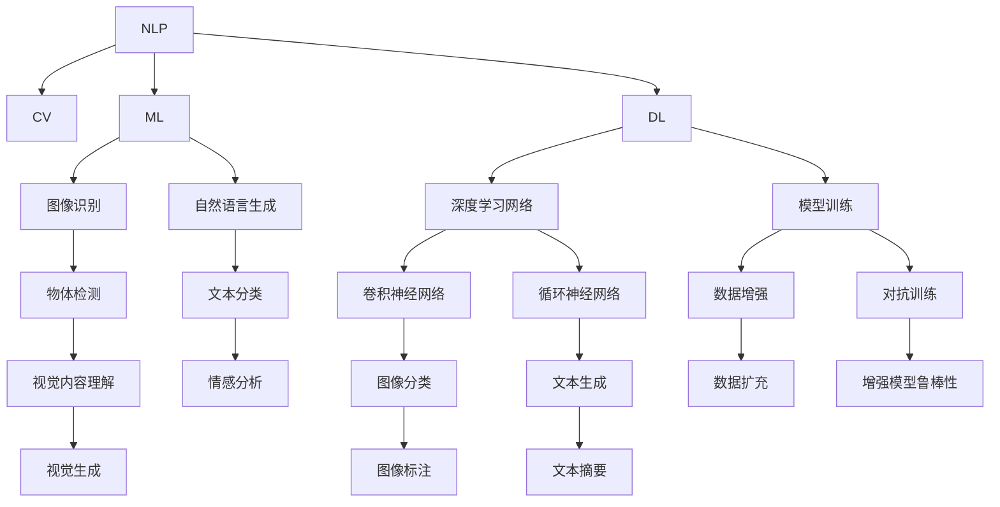

                 

# AI出版业动态：场景驱动的技术更新

## 1. 背景介绍

### 1.1 问题由来

随着人工智能（AI）技术的迅猛发展，AI在出版业的应用逐渐增多。AI技术不仅能提升内容创作、编辑、校对等环节的效率，还能为出版商提供更精准的市场洞察和读者需求分析。出版业本身也是一个数据密集型行业，与AI技术的结合有着天然的优势。

然而，由于出版业涉及的内容多、领域广、规模庞大，AI技术在出版业的落地应用还面临着诸多挑战。数据获取、模型训练、版权保护等问题，都对AI出版业的快速发展构成了阻碍。因此，针对出版业的AI应用场景进行更深入的技术研究和探索，成为出版业和AI技术研究的共同目标。

### 1.2 问题核心关键点

当前，AI出版业的技术发展主要聚焦于以下几个方面：

1. **内容生成与编辑**：利用自然语言处理（NLP）和图像识别等技术，自动生成内容或辅助编辑。例如，通过AI写作助手生成初稿，使用OCR技术识别手写笔记，使用图像识别技术对纸质书籍进行内容挖掘。

2. **版权保护与追踪**：利用区块链技术记录版权信息，确保版权所有人的利益。通过内容指纹（content fingerprint）识别技术，实现对版权内容的追踪和溯源。

3. **个性化推荐**：利用机器学习算法分析用户行为数据，推荐符合用户兴趣的内容。例如，根据用户的历史阅读记录和评分数据，推荐书籍或文章。

4. **市场分析与洞察**：通过分析海量数据，洞察市场趋势，预测书籍的销售潜力。例如，分析社交媒体数据、搜索结果、评论等，预测书籍的潜在受众和市场反响。

5. **智能营销**：利用AI技术提升营销效果，如智能客服、广告投放优化、营销活动策划等。例如，通过分析用户反馈，自动调整广告投放策略。

这些技术点构成了AI出版业的核心，通过在实际出版环节中的应用，可以极大地提升出版业的整体效率和效果。

## 2. 核心概念与联系

### 2.1 核心概念概述

为更好地理解AI出版业的技术动态，本节将介绍几个密切相关的核心概念：

- **自然语言处理（NLP）**：通过计算机理解和处理人类语言的技术，涉及文本分析、语义理解、情感分析等。
- **计算机视觉（CV）**：涉及图像和视频内容的理解和处理，如图像识别、物体检测、图像生成等。
- **机器学习（ML）**：基于数据和算法，让计算机通过学习不断提高性能。
- **深度学习（DL）**：一种特殊的机器学习技术，通过多层次的神经网络模型进行复杂数据分析。
- **区块链（Blockchain）**：一种分布式账本技术，具有去中心化、不可篡改等特性。
- **内容指纹（Content Fingerprinting）**：通过生成内容独特标识，用于版权保护和内容追踪。

这些核心概念之间的逻辑关系可以通过以下Mermaid流程图来展示：



这个流程图展示了大语言模型的工作原理和各个技术点之间的联系：

1. **NLP和CV**：AI出版业中常用的两大技术，分别处理文本和图像内容。
2. **ML和DL**：基于数据和算法，通过学习提高模型性能。
3. **深度学习网络**：用于处理复杂的非线性关系，提高模型的准确性。
4. **机器学习模型训练**：通过数据集训练模型，优化模型性能。
5. **内容生成和分类**：利用NLP和DL技术，自动生成或分类内容。
6. **视觉内容理解**：通过CV和DL技术，识别和理解图像内容。
7. **对抗训练**：提高模型鲁棒性，避免过拟合。
8. **数据增强**：扩充数据集，提高模型泛化能力。

这些核心概念共同构成了AI出版业的技术框架，使其能够在各种出版场景下发挥强大的信息处理能力。通过理解这些核心概念，我们可以更好地把握AI出版业的工作原理和优化方向。

## 3. 核心算法原理 & 具体操作步骤

### 3.1 算法原理概述

AI出版业中的算法原理主要基于以下几个核心技术：

- **自然语言处理（NLP）**：包括文本分析、情感分析、命名实体识别等技术，用于理解和处理出版内容。
- **计算机视觉（CV）**：涉及图像识别、物体检测、图像生成等技术，用于处理出版物中的视觉内容。
- **机器学习（ML）**：通过分析用户行为数据，预测用户需求和市场趋势，用于个性化推荐和营销优化。
- **深度学习（DL）**：利用神经网络模型，处理复杂的非线性关系，提高模型的准确性。
- **区块链技术（Blockchain）**：用于版权保护和内容追踪，确保内容的安全性和真实性。

### 3.2 算法步骤详解

AI出版业的技术流程通常包括以下几个步骤：

**Step 1: 数据准备与预处理**
- 收集出版物的数据，包括文本、图像、用户行为数据等。
- 对数据进行清洗、标注、分词、归一化等预处理操作。

**Step 2: 模型选择与训练**
- 根据具体的出版场景，选择合适的NLP、CV或ML模型。
- 使用已准备好的数据集，对模型进行训练，调整超参数以优化模型性能。

**Step 3: 模型部署与应用**
- 将训练好的模型部署到生产环境，如Web应用、API接口等。
- 利用部署的模型进行内容生成、版权保护、个性化推荐、市场分析等应用。

**Step 4: 监控与优化**
- 对模型在生产环境中的表现进行监控，收集用户反馈和系统日志。
- 根据监控结果和用户反馈，对模型进行优化和调整。

### 3.3 算法优缺点

AI出版业中的算法具有以下优点：

- **提升效率**：利用AI技术自动处理大量内容，提升出版物制作和编辑的效率。
- **增强准确性**：通过深度学习和机器学习技术，提高内容生成和分类的准确性。
- **改善用户体验**：通过个性化推荐和智能营销，提升用户的阅读体验和满意度。

同时，这些算法也存在一些局限性：

- **数据依赖**：AI出版业的效果很大程度上取决于数据的质量和数量，数据获取和处理成本较高。
- **技术复杂性**：需要较高的技术门槛，对模型的训练、部署和优化要求较高。
- **版权保护**：涉及版权问题，需要解决法律和技术层面的挑战。
- **内容安全**：AI模型可能学习到有害信息，需要进行内容审查和安全过滤。

### 3.4 算法应用领域

AI出版业的技术已经广泛应用于以下几个领域：

- **内容生成**：利用NLP和DL技术，自动生成出版物内容，如新闻、文章、广告等。
- **版权保护**：通过区块链和内容指纹技术，确保出版内容的版权和安全。
- **个性化推荐**：利用机器学习算法，根据用户行为数据，推荐符合用户兴趣的出版物。
- **市场分析**：通过分析海量数据，洞察市场趋势，预测书籍的销售潜力。
- **智能营销**：利用AI技术提升营销效果，如智能客服、广告投放优化、营销活动策划等。

此外，AI出版业的技术还在不断地扩展，如利用虚拟现实（VR）和增强现实（AR）技术，为出版物提供更加沉浸式的阅读体验。这些前沿技术的应用，为出版业带来了更多的创新可能。

## 4. 数学模型和公式 & 详细讲解 & 举例说明

### 4.1 数学模型构建

AI出版业中的模型构建通常基于以下几个数学模型：

- **文本分类模型**：如支持向量机（SVM）、朴素贝叶斯（Naive Bayes）、神经网络等，用于将文本分为不同的类别。
- **图像识别模型**：如卷积神经网络（CNN）、循环神经网络（RNN）、注意力机制（Attention）等，用于识别和分类图像内容。
- **用户行为分析模型**：如协同过滤（Collaborative Filtering）、决策树（Decision Tree）、随机森林（Random Forest）等，用于预测用户行为和推荐内容。

### 4.2 公式推导过程

以文本分类模型为例，其基本流程如下：

1. **输入表示**：将文本转换为向量表示，如通过TF-IDF、Word2Vec等方法进行词向量化。
2. **特征提取**：使用卷积神经网络（CNN）或循环神经网络（RNN）等模型，提取文本特征。
3. **分类决策**：使用softmax函数计算各个类别的概率，选择概率最大的类别作为预测结果。

假设文本分类模型为 $M$，输入文本为 $x$，标签为 $y$。则分类损失函数 $\ell$ 可以表示为：

$$
\ell(M(x), y) = -\log P(y|x; M)
$$

其中 $P(y|x; M)$ 表示模型 $M$ 在输入 $x$ 下预测标签 $y$ 的概率。通过最小化损失函数，可以优化模型参数，提高分类准确率。

### 4.3 案例分析与讲解

假设有一个出版商想要利用AI技术优化其网站的用户体验，具体步骤如下：

1. **数据收集与预处理**：收集用户的历史访问数据、阅读数据和购买数据，并进行清洗、标注等预处理操作。
2. **模型选择与训练**：选择适合的推荐模型，如协同过滤、矩阵分解等，使用用户行为数据进行训练。
3. **模型部署与应用**：将训练好的模型部署到网站，实现个性化推荐功能。
4. **监控与优化**：对推荐系统的表现进行监控，收集用户反馈，对模型进行优化和调整。

通过以上步骤，出版商可以实现对用户阅读行为的智能分析，从而推荐更符合用户兴趣的内容，提升用户黏性和满意度。

## 5. 项目实践：代码实例和详细解释说明

### 5.1 开发环境搭建

在进行AI出版业的技术实践前，我们需要准备好开发环境。以下是使用Python进行TensorFlow开发的常见环境配置流程：

1. 安装Anaconda：从官网下载并安装Anaconda，用于创建独立的Python环境。

2. 创建并激活虚拟环境：
```bash
conda create -n tf-env python=3.8 
conda activate tf-env
```

3. 安装TensorFlow：根据CUDA版本，从官网获取对应的安装命令。例如：
```bash
conda install tensorflow -c pytorch -c conda-forge
```

4. 安装TensorBoard：
```bash
pip install tensorboard
```

5. 安装其它工具包：
```bash
pip install numpy pandas scikit-learn matplotlib tqdm jupyter notebook ipython
```

完成上述步骤后，即可在`tf-env`环境中开始AI出版业的技术实践。

### 5.2 源代码详细实现

这里我们以出版物的图像识别和版权保护为例，给出使用TensorFlow实现Python代码的实现。

**图像识别示例**

```python
import tensorflow as tf
from tensorflow.keras.preprocessing.image import ImageDataGenerator
from tensorflow.keras.applications import VGG16

# 加载预训练的VGG16模型
base_model = VGG16(weights='imagenet', include_top=False)

# 添加新的全连接层
x = base_model.output
x = tf.keras.layers.Flatten()(x)
x = tf.keras.layers.Dense(1024, activation='relu')(x)
predictions = tf.keras.layers.Dense(1, activation='sigmoid')(x)

# 构建新的分类器模型
model = tf.keras.Model(inputs=base_model.input, outputs=predictions)

# 编译模型
model.compile(optimizer='adam', loss='binary_crossentropy', metrics=['accuracy'])

# 加载数据集
train_datagen = ImageDataGenerator(rescale=1./255)
test_datagen = ImageDataGenerator(rescale=1./255)
train_generator = train_datagen.flow_from_directory(train_dir, target_size=(224, 224), batch_size=32, class_mode='binary')
test_generator = test_datagen.flow_from_directory(test_dir, target_size=(224, 224), batch_size=32, class_mode='binary')

# 训练模型
model.fit(train_generator, steps_per_epoch=train_generator.n // 32, epochs=10, validation_data=test_generator, validation_steps=test_generator.n // 32)

# 保存模型
model.save('image_recognition_model.h5')
```

**版权保护示例**

```python
import hashlib
from tensorflow.keras.layers import Input, Dense
from tensorflow.keras.models import Model

# 定义内容指纹函数
def content_fingerprinting(text):
    # 对文本进行哈希处理
    hash_value = hashlib.sha256(text.encode('utf-8')).hexdigest()
    return hash_value

# 构建内容指纹识别模型
input_layer = Input(shape=(1,), name='input')
hash_layer = Dense(512, activation='relu')(input_layer)
output_layer = Dense(1, activation='sigmoid', name='output')(hash_layer)

model = Model(inputs=input_layer, outputs=output_layer)

# 编译模型
model.compile(optimizer='adam', loss='binary_crossentropy', metrics=['accuracy'])

# 训练模型
model.fit(train_hash_values, train_labels, epochs=10, validation_data=(val_hash_values, val_labels))

# 保存模型
model.save('content_fingerprinting_model.h5')
```

这些示例代码展示了如何使用TensorFlow实现图像识别和版权保护的基本流程。开发者可以根据实际需求，选择不同的模型和算法进行优化和扩展。

### 5.3 代码解读与分析

让我们再详细解读一下关键代码的实现细节：

**图像识别示例代码**

- `VGG16`：预训练的VGG16模型，作为基础模型。
- `Flatten`：将三维张量展平，便于输入全连接层。
- `Dense`：全连接层，用于特征提取和分类。
- `sigmoid`：激活函数，用于二分类任务的输出。
- `ImageDataGenerator`：数据增强工具，用于扩充训练集。
- `flow_from_directory`：读取数据集的方法。
- `fit`：训练模型的函数。

**版权保护示例代码**

- `hashlib.sha256`：哈希函数，用于生成文本内容的哈希值。
- `Dense`：全连接层，用于哈希值的表示和输出。
- `binary_crossentropy`：二分类任务的损失函数。
- `adam`：优化器。

这些代码片段展示了图像识别和版权保护的基本实现流程，开发者可以基于此构建更复杂的模型和应用。

## 6. 实际应用场景

### 6.1 智能出版物推荐

智能出版物推荐是AI出版业的重要应用之一。通过分析用户的阅读行为和偏好，智能推荐系统能够实时推送符合用户兴趣的内容，提升用户的阅读体验和满意度。

具体而言，智能推荐系统可以集成在出版商的在线平台上，如电子书阅读器、图书推荐网站等。系统通过分析用户的历史阅读记录、评分、评论等数据，生成用户的兴趣模型，然后利用协同过滤、矩阵分解等算法，推荐符合用户兴趣的出版物。通过持续优化推荐模型，智能推荐系统能够不断提升推荐精度，满足用户的个性化需求。

### 6.2 版权保护与追踪

版权保护是出版业中的重要问题。随着数字出版的普及，内容被盗用和非法传播的风险也在增加。AI出版业通过区块链和内容指纹技术，为出版物的版权保护和追踪提供了新的解决方案。

具体而言，出版商可以在发布内容时，将其哈希值存储在区块链上，形成数字版权证书。当发现内容被非法传播时，可以通过区块链记录的哈希值，追踪到原始发布者，保护其版权利益。内容指纹技术可以进一步增强版权保护的精度和安全性，防止盗用和篡改。

### 6.3 智能广告投放

智能广告投放是AI出版业的另一个重要应用场景。通过分析用户的行为数据和兴趣模型，智能广告系统能够实现精准投放，提升广告的点击率和转化率。

具体而言，智能广告系统可以根据用户的浏览行为、购买记录、搜索历史等数据，生成用户的兴趣模型。然后，系统利用机器学习算法，预测用户可能感兴趣的广告内容，并实现精准投放。通过不断优化算法和调整投放策略，智能广告系统能够实现更高的广告效果和用户满意度。

## 7. 工具和资源推荐

### 7.1 学习资源推荐

为了帮助开发者系统掌握AI出版业的技术基础和实践技巧，这里推荐一些优质的学习资源：

1. **TensorFlow官方文档**：详细的API文档和示例代码，是TensorFlow学习的最佳资源。
2. **Keras官方文档**：Keras作为TensorFlow的高层API，提供了丰富的深度学习模型和应用案例。
3. **PyTorch官方文档**：PyTorch作为另一大深度学习框架，提供了丰富的NLP和CV模型库。
4. **机器学习与深度学习课程**：如Coursera上的《深度学习专项课程》，提供了系统的深度学习知识体系。
5. **出版业AI应用书籍**：如《出版业人工智能：技术和应用》，系统介绍了AI在出版业中的应用。

通过对这些资源的学习实践，相信你一定能够快速掌握AI出版业的技术框架，并应用于实际的出版场景中。

### 7.2 开发工具推荐

高效的开发离不开优秀的工具支持。以下是几款用于AI出版业开发的常用工具：

1. **Jupyter Notebook**：Python代码的交互式开发环境，支持代码片段的实时运行和调试。
2. **TensorBoard**：TensorFlow的可视化工具，可实时监测模型训练状态，并提供丰富的图表呈现方式。
3. **PyCharm**：专业的Python开发工具，提供了代码高亮、调试、自动补全等功能。
4. **Git**：版本控制系统，支持团队协作和代码版本管理。
5. **GitHub**：代码托管平台，方便代码的共享和发布。

合理利用这些工具，可以显著提升AI出版业的开发效率，加快创新迭代的步伐。

### 7.3 相关论文推荐

AI出版业的技术发展得益于学界的持续研究。以下是几篇奠基性的相关论文，推荐阅读：

1. **《内容推荐系统的协同过滤》**：介绍了协同过滤的基本原理和算法实现。
2. **《基于区块链的数字版权保护》**：探讨了区块链技术在版权保护中的应用。
3. **《深度学习在出版物分类中的应用》**：展示了深度学习在出版物分类中的强大表现。
4. **《智能广告投放的机器学习算法》**：介绍了机器学习在智能广告投放中的应用。
5. **《内容指纹识别与版权保护》**：探讨了内容指纹识别技术在版权保护中的应用。

这些论文代表了大语言模型微调技术的发展脉络。通过学习这些前沿成果，可以帮助研究者把握学科前进方向，激发更多的创新灵感。

## 8. 总结：未来发展趋势与挑战

### 8.1 总结

本文对AI出版业的技术动态进行了全面系统的介绍。首先阐述了AI技术在出版业中的应用场景和关键技术点，明确了智能出版、版权保护、市场分析等技术的应用方向。其次，从原理到实践，详细讲解了AI出版业的数学模型和关键步骤，给出了具体的应用代码实现。同时，本文还广泛探讨了AI出版业在出版、版权、广告等领域的实际应用，展示了AI技术的广阔前景。最后，本文精选了AI出版业的学习资源和开发工具，力求为读者提供全方位的技术指引。

通过本文的系统梳理，可以看到，AI出版业的技术发展正在不断突破传统出版业的界限，为出版业带来新的增长点和发展机遇。出版商可以利用AI技术提升内容的生成、编辑、版权保护和市场分析能力，实现更高的运营效率和用户满意度。未来，AI出版业将在更多领域得到应用，为传统出版业带来全新的变革。

### 8.2 未来发展趋势

展望未来，AI出版业的技术将呈现以下几个发展趋势：

1. **内容生成与编辑**：利用AI技术自动生成高质量的内容，提升出版效率和质量。未来将有更多AI写作助手、内容生成模型出现。
2. **版权保护**：利用区块链和内容指纹技术，实现更安全的版权保护和追踪。区块链技术的应用将越来越广泛。
3. **个性化推荐**：利用机器学习算法，实现更精准的用户推荐。个性化推荐系统将成为出版业的重要工具。
4. **市场分析与洞察**：利用大数据和AI技术，实现更深入的市场分析和趋势预测。AI技术将帮助出版商更好地理解市场。
5. **智能营销**：利用AI技术提升营销效果，实现精准投放和广告优化。智能营销将成为出版商的重要策略。

以上趋势凸显了AI出版业技术的广阔前景。这些方向的探索发展，必将进一步提升出版业的整体效率和效果，为出版业带来更多的创新可能。

### 8.3 面临的挑战

尽管AI出版业的技术已经取得了显著进展，但在迈向更加智能化、普适化应用的过程中，它仍面临着诸多挑战：

1. **数据获取**：出版业涉及的数据类型多样，获取高质量数据成本较高，数据治理和清洗工作量大。
2. **模型鲁棒性**：出版物内容复杂多样，模型在面对复杂内容时容易出现泛化不足或过拟合等问题。
3. **版权问题**：版权保护涉及法律和技术层面的挑战，需要多方协同解决。
4. **内容安全**：AI模型可能学习到有害信息，需要进行内容审查和安全过滤。
5. **用户隐私**：出版商需要平衡用户隐私保护和数据利用的关系，确保用户数据的安全。

这些挑战需要在技术、法律、伦理等多个层面进行协同解决，才能确保AI出版业的健康发展。

### 8.4 研究展望

面对AI出版业面临的挑战，未来的研究需要在以下几个方面寻求新的突破：

1. **数据治理与质量提升**：开发更高效的数据治理工具，提升数据获取和清洗的效率。
2. **模型优化与鲁棒性提升**：设计更鲁棒的内容生成和分类模型，增强模型的泛化能力和鲁棒性。
3. **版权保护技术创新**：利用最新的区块链技术和内容指纹技术，提升版权保护的精度和安全性。
4. **内容安全与伦理审查**：开发内容安全和伦理审查机制，确保AI模型的输出符合价值观和伦理规范。
5. **用户隐私保护与数据利用**：设计隐私保护机制，确保用户数据的安全和合理利用。

这些研究方向的探索，必将引领AI出版业技术迈向更高的台阶，为出版业带来更多的创新可能。总之，AI出版业需要在技术、法律、伦理等多个层面进行协同创新，才能实现健康、可持续的发展。未来，AI出版业将更加智能化、普适化，为出版业带来更多的变革和机遇。

## 9. 附录：常见问题与解答

**Q1: 出版商如何利用AI技术提升内容生成和编辑效率？**

A: 出版商可以利用AI技术自动生成内容，如利用自然语言生成（NLG）技术生成初稿，或利用图像生成技术自动生成封面和插图。AI技术还可以用于文本的编辑和校对，如自动纠错和拼写检查等，提升编辑效率和质量。

**Q2: 出版商如何确保版权保护的安全性？**

A: 出版商可以结合区块链和内容指纹技术，为每篇出版物生成唯一的哈希值，存储在区块链上。当发现内容被非法传播时，可以通过哈希值追踪到原始发布者，保护其版权利益。同时，出版商还可以定期更新区块链上的版权信息，确保最新的版权数据。

**Q3: 出版商如何利用AI技术提升个性化推荐效果？**

A: 出版商可以收集用户的阅读记录、评分和评论数据，构建用户的兴趣模型。然后利用协同过滤、矩阵分解等算法，生成推荐列表，并实时推送给用户。通过不断优化算法和调整推荐策略，出版商可以实现更精准的用户推荐，提升用户满意度和黏性。

**Q4: 出版商如何利用AI技术提升市场分析能力？**

A: 出版商可以利用大数据和AI技术，分析用户的行为数据和市场趋势。例如，通过分析社交媒体数据、搜索结果、评论等，预测书籍的销售潜力。出版商还可以利用机器学习算法，分析市场数据，洞察市场变化，制定更科学的出版策略。

**Q5: 出版商如何利用AI技术提升智能营销效果？**

A: 出版商可以分析用户的阅读记录和行为数据，生成用户画像和兴趣模型。然后利用AI技术，实现精准广告投放和营销优化。例如，根据用户的兴趣和行为数据，自动调整广告投放策略，提升广告的点击率和转化率。通过持续优化AI模型和调整营销策略，出版商可以实现更高的营销效果和用户满意度。

---

作者：禅与计算机程序设计艺术 / Zen and the Art of Computer Programming

