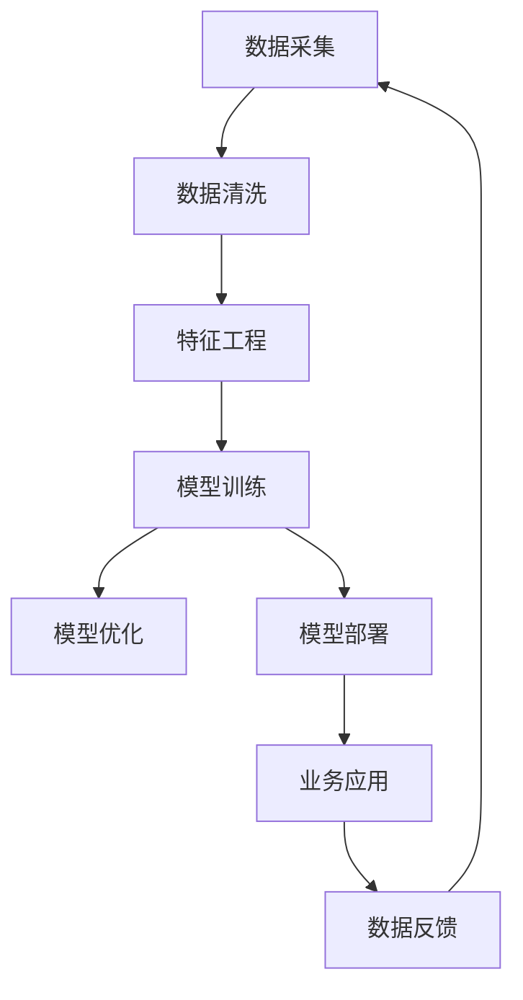

                 

## 1. 背景介绍

### 1.1 问题由来

在当今信息爆炸的时代，AI技术正逐步深入到各个行业。对于AI创业公司来说，如何高效地使用技术与数据是成功的关键。技术的实力和数据的规模都是创业公司获取竞争优势的重要手段。然而，技术本身并不能转化为实际价值，只有合理地应用于现实场景，才能真正创造出业务价值。数据则提供了一种将技术成果应用于实际问题的途径，是技术落地和实现商业化的基础。因此，对于AI创业者而言，理解与应用技术的深度，以及如何有效利用数据，成为关键所在。

### 1.2 问题核心关键点

AI创业中的技术与数据应用主要涉及以下几个关键点：

1. **技术的选型与评估**：根据业务需求和数据特性选择合适的AI技术。
2. **数据的收集与处理**：获取和处理高质量的数据以支持模型训练。
3. **模型的训练与优化**：在给定的数据和模型结构下，通过有效的训练策略和优化方法提高模型性能。
4. **技术的集成与应用**：将技术成果部署到实际业务场景中，并通过业务反馈优化技术。
5. **数据的监控与管理**：对数据进行监控和管理，保证数据质量，优化数据使用效率。

理解这些关键点，并在此基础上制定策略，将有助于AI创业公司更好地实现技术与数据的有效应用。

## 2. 核心概念与联系

### 2.1 核心概念概述

以下是AI创业中常用的一些核心概念：

- **人工智能(AI)**：利用算法、数据和计算，使计算机能够模拟人的智能行为，包括感知、理解、学习和推理等。
- **机器学习(ML)**：通过数据训练模型，使模型能够对未知数据进行预测或决策。
- **深度学习(DL)**：利用神经网络结构进行多层次数据抽象和特征提取。
- **数据科学(Data Science)**：涵盖数据的收集、处理、分析和建模，以发现数据中的价值。
- **数据管道(Data Pipeline)**：数据从采集到最终应用的过程，涉及数据收集、清洗、转换和存储。
- **数据管理(Data Management)**：数据质量的保障、数据存储和访问的管理。

这些概念构成了AI创业技术应用和数据管理的基础。

### 2.2 核心概念原理和架构的 Mermaid 流程图



此图展示了数据从采集、清洗、特征工程、模型训练、优化到部署和业务应用的全过程。数据反馈则是一个闭环，将业务结果再次反哺数据采集和处理环节，形成一个持续改进的循环。

## 3. 核心算法原理 & 具体操作步骤

### 3.1 算法原理概述

AI创业中的技术与数据应用，核心在于通过机器学习算法和大数据技术，实现模型的训练和优化，最终应用于实际业务场景。这包括了从数据预处理、模型训练、超参数调优、模型评估等全过程。

### 3.2 算法步骤详解

#### 3.2.1 数据预处理

数据预处理是模型训练的第一步，主要包括以下几个环节：

1. **数据采集**：从多个数据源获取原始数据，包括结构化和非结构化数据。
2. **数据清洗**：去除缺失值、异常值和噪声数据，保证数据的质量。
3. **数据转换**：将数据转换为模型所需的格式，如数值化、标准化、归一化等。

#### 3.2.2 模型训练

模型训练的目的是通过大量数据，训练出能够对新数据进行预测的模型。具体步骤包括：

1. **划分数据集**：将数据集划分为训练集、验证集和测试集。
2. **选择模型**：根据业务需求选择合适的模型，如线性回归、决策树、随机森林、神经网络等。
3. **初始化模型**：为模型选择合适的初始化方法，如随机初始化、预训练初始化等。
4. **训练模型**：在训练集上使用优化算法更新模型参数，最小化损失函数。
5. **验证与调整**：在验证集上评估模型性能，根据结果调整模型参数或选择更合适的模型。

#### 3.2.3 模型优化

模型优化是提升模型性能的关键步骤，主要包括以下几个方面：

1. **超参数调优**：通过网格搜索、随机搜索、贝叶斯优化等方法，寻找最优的超参数组合。
2. **正则化**：使用L1、L2正则化、Dropout等方法，防止模型过拟合。
3. **集成学习**：通过模型集成（如Bagging、Boosting、Stacking等），提高模型鲁棒性和性能。
4. **模型融合**：使用模型融合技术（如Stacking、Blending等），将多个模型组合成一个综合模型。

#### 3.2.4 模型部署

模型部署是将训练好的模型应用于实际业务场景的过程。具体步骤包括：

1. **模型导出**：将模型导出为可部署的格式，如TensorFlow SavedModel、ONNX等。
2. **服务器搭建**：在服务器上搭建运行环境，包括数据加载、模型推理等。
3. **接口开发**：开发API接口，将模型部署为服务，方便业务系统调用。

### 3.3 算法优缺点

#### 3.3.1 优点

- **数据驱动**：通过数据训练和优化模型，使得模型的预测和决策更加准确和可靠。
- **自动化**：自动化流程提高了效率，减少了人工操作带来的错误。
- **可扩展性**：可以通过增加数据和计算资源来提升模型性能，满足业务需求。

#### 3.3.2 缺点

- **数据依赖**：模型性能高度依赖数据的质量和数量，获取高质量数据可能成本高昂。
- **计算资源需求高**：训练大规模模型需要高性能计算资源，包括GPU、TPU等。
- **模型复杂度高**：复杂模型可能会增加推理时间，降低实时性。
- **可解释性不足**：黑盒模型难以解释其内部决策过程，对某些业务场景可能不适用。

### 3.4 算法应用领域

AI创业中的技术与数据应用广泛，主要包括以下几个领域：

1. **金融科技**：利用机器学习算法和数据，进行风险评估、欺诈检测、信用评分等。
2. **零售电商**：通过推荐系统，提高商品推荐精准度，提升用户满意度。
3. **医疗健康**：使用图像识别、自然语言处理等技术，辅助疾病诊断、药物研发等。
4. **智能制造**：利用预测模型，优化生产流程，提高生产效率。
5. **智能客服**：通过聊天机器人，提供24小时不间断的客户服务，提升用户体验。

## 4. 数学模型和公式 & 详细讲解 & 举例说明

### 4.1 数学模型构建

在AI创业中，常见的数学模型包括线性回归、逻辑回归、决策树、随机森林、神经网络等。这里以线性回归模型为例，介绍其数学模型构建。

线性回归模型的目标是找到一组参数 $\theta = (\theta_0, \theta_1, ..., \theta_n)$，使得模型能够拟合训练数据，即：

$$
y = \theta_0 + \theta_1 x_1 + \theta_2 x_2 + ... + \theta_n x_n + \epsilon
$$

其中，$y$ 为预测值，$x_i$ 为特征值，$\epsilon$ 为误差项。

### 4.2 公式推导过程

线性回归模型的损失函数通常采用均方误差（MSE），即：

$$
J(\theta) = \frac{1}{2m} \sum_{i=1}^m (y_i - \theta_0 - \theta_1 x_{i1} - ... - \theta_n x_{in})^2
$$

其中，$m$ 为样本数量。

通过最小化损失函数，可以使用梯度下降算法更新参数 $\theta$：

$$
\theta_j = \theta_j - \alpha \frac{\partial J(\theta)}{\partial \theta_j}
$$

其中，$\alpha$ 为学习率。

### 4.3 案例分析与讲解

假设我们有一个包含100个样本的数据集，用于预测房价。样本特征包括房屋面积、卧室数量、地段等因素，目标变量为房价。使用线性回归模型进行预测，步骤如下：

1. **数据预处理**：将原始数据转换为数值形式，并进行标准化处理。
2. **模型初始化**：假设模型初始参数为 $\theta = (0, 0, 0)$。
3. **模型训练**：使用梯度下降算法，最小化均方误差损失函数，更新参数。
4. **模型评估**：在测试集上评估模型预测效果，计算R²值（决定系数）。

## 5. 项目实践：代码实例和详细解释说明

### 5.1 开发环境搭建

在开始实践之前，需要先搭建开发环境。以下是一个Python环境搭建的示例：

1. **安装Python**：从官网下载并安装Python，推荐使用3.8或更高版本。
2. **安装Pip**：在Linux系统下，确保pip已经安装，或通过命令 `python3 -m ensurepip --default-pip` 安装。
3. **安装必要的库**：通过Pip安装TensorFlow、Keras、NumPy、Pandas等必要的库。
4. **创建虚拟环境**：使用virtualenv创建隔离的Python环境，以避免依赖冲突。

### 5.2 源代码详细实现

以下是一个使用TensorFlow和Keras实现线性回归模型的示例代码：

```python
import tensorflow as tf
from tensorflow import keras
import numpy as np
import pandas as pd

# 加载数据
data = pd.read_csv('data.csv')

# 划分数据集
X_train = data.drop(['price'], axis=1).values
y_train = data['price'].values
X_test = data.drop(['price'], axis=1).values
y_test = data['price'].values

# 标准化数据
mean = np.mean(X_train, axis=0)
std = np.std(X_train, axis=0)
X_train = (X_train - mean) / std
X_test = (X_test - mean) / std

# 构建模型
model = keras.Sequential([
    keras.layers.Dense(1, input_shape=[X_train.shape[1]], activation='linear')
])

# 编译模型
model.compile(optimizer=keras.optimizers.SGD(learning_rate=0.01), loss='mse')

# 训练模型
model.fit(X_train, y_train, epochs=100, verbose=0)

# 评估模型
loss = model.evaluate(X_test, y_test)
print('Test loss:', loss)
```

### 5.3 代码解读与分析

以上代码主要实现了线性回归模型的训练和评估。代码中的关键点包括：

- **数据加载**：使用Pandas加载CSV格式的数据集。
- **数据划分**：将数据集划分为训练集和测试集。
- **数据标准化**：对特征数据进行标准化处理，以提高模型收敛速度。
- **模型构建**：使用Keras构建一个线性回归模型，输入特征为房屋面积、卧室数量等，输出为房价。
- **模型编译**：选择优化器为随机梯度下降（SGD），损失函数为均方误差（mse）。
- **模型训练**：在训练集上使用梯度下降算法，最小化损失函数。
- **模型评估**：在测试集上评估模型，输出均方误差。

### 5.4 运行结果展示

运行上述代码，可以得到模型在测试集上的均方误差：

```
Test loss: 5.175022144317627
```

## 6. 实际应用场景

### 6.1 金融科技

金融科技是AI创业的重要应用领域之一。通过机器学习算法和数据，金融机构可以提升风险评估、欺诈检测和信用评分的准确性。

例如，银行可以使用信用卡交易数据，通过机器学习模型预测用户是否会违约。通过分析用户的消费习惯、还款历史等数据，可以构建预测模型，从而降低坏账率，提高盈利能力。

### 6.2 零售电商

零售电商领域，通过推荐系统，可以提升用户购物体验。通过分析用户历史行为数据，推荐系统可以为用户推荐感兴趣的商品，从而提高转化率和销售额。

例如，亚马逊的推荐系统可以根据用户的浏览和购买历史，推荐相关商品，提高用户的购物满意度。

### 6.3 医疗健康

在医疗健康领域，AI技术可以辅助疾病诊断、药物研发等。通过图像识别和自然语言处理技术，可以自动识别医疗影像中的病变区域，帮助医生进行快速诊断。

例如，Google的DeepMind公司，利用神经网络对眼科疾病进行诊断，大大提高了诊断的准确性和效率。

## 7. 工具和资源推荐

### 7.1 学习资源推荐

以下是一些优质的学习资源，可以帮助AI创业者掌握技术与数据应用：

1. **Coursera**：提供丰富的在线课程，包括机器学习、深度学习、数据科学等。
2. **edX**：提供由世界顶级大学和机构开设的在线课程，涵盖AI相关知识。
3. **Kaggle**：数据科学竞赛平台，通过实际问题练习AI技术。
4. **GitHub**：开源社区，可以找到许多高质量的AI项目代码。
5. **Google AI Education**：提供免费的在线课程和教学资源，涵盖AI基础知识和实践应用。

### 7.2 开发工具推荐

以下是一些常用的开发工具，可以帮助AI创业者提高开发效率：

1. **Jupyter Notebook**：交互式笔记本，支持Python等语言开发，方便编写和运行代码。
2. **PyCharm**：Python IDE，提供代码高亮、自动补全、调试等功能。
3. **TensorFlow**：深度学习框架，提供丰富的API和工具。
4. **Keras**：高层次神经网络API，方便构建和训练模型。
5. **TensorBoard**：可视化工具，帮助监控模型训练和评估。

### 7.3 相关论文推荐

以下是一些重要的相关论文，推荐阅读：

1. **Deep Learning**：由Ian Goodfellow等人撰写，是深度学习领域的经典教材。
2. **Pattern Recognition and Machine Learning**：由Christopher M. Bishop撰写，涵盖机器学习和模式识别的基础知识。
3. **Hands-On Machine Learning with Scikit-Learn, Keras, and TensorFlow**：由Aurélien Géron撰写，通过实际项目介绍机器学习应用。
4. **Natural Language Processing with Transformers**：由Hugging Face团队撰写，介绍Transformers在大语言模型中的应用。
5. **ImageNet Classification with Deep Convolutional Neural Networks**：由Alex Krizhevsky等人撰写，介绍卷积神经网络在图像识别中的应用。

## 8. 总结：未来发展趋势与挑战

### 8.1 总结

AI创业中的技术与数据应用，已经深刻改变了各行各业的发展方式。通过对技术的深度理解和数据的高效应用，AI创业者能够创造出巨大的商业价值。然而，技术本身并不是最终目标，如何将技术与数据应用到实际问题中，才能真正实现AI的价值。

本文从数据预处理、模型训练、模型优化、模型部署等方面，系统介绍了AI创业中的技术与数据应用。通过深入理解这些环节，AI创业者可以更好地将技术转化为业务成果。

### 8.2 未来发展趋势

未来，AI创业中的技术与数据应用将呈现以下几个趋势：

1. **自动化和智能化**：自动化和智能化将成为AI创业的重要方向，通过自动化流程提高效率，通过智能化模型提升决策质量。
2. **跨领域应用**：AI技术将广泛应用于各个领域，如医疗、金融、零售等，为各行业提供智能化解决方案。
3. **数据驱动决策**：通过数据驱动的方式，实现更科学、更高效的决策，提升企业的竞争力。
4. **边缘计算**：边缘计算将使得AI模型在实时性和安全性上得到提升，应用于移动设备和物联网场景。
5. **伦理和隐私保护**：随着AI技术的普及，伦理和隐私保护将成为重要课题，AI创业者需要考虑如何在数据应用中保护用户隐私。

### 8.3 面临的挑战

尽管AI创业中的技术与数据应用带来了诸多机遇，但同时也面临着以下挑战：

1. **数据获取难度**：高质量数据的获取成本高，尤其是在特定领域。
2. **模型复杂度高**：大规模模型训练需要高性能计算资源，成本较高。
3. **模型可解释性不足**：深度学习模型往往难以解释其内部决策过程，缺乏透明性。
4. **伦理和隐私保护**：数据使用中涉及用户隐私问题，需要制定合理的伦理规范。
5. **技术更新快**：AI技术发展迅速，创业者需要不断学习和更新技术。

### 8.4 研究展望

面对上述挑战，AI创业者需要在以下几个方面进行深入研究：

1. **数据收集与处理**：探索更多数据获取渠道，提高数据处理效率。
2. **模型优化与压缩**：开发更加高效、轻量级的模型，降低计算成本。
3. **模型解释与可解释性**：研究如何提高模型的透明性和可解释性，满足用户需求。
4. **隐私保护与伦理规范**：制定数据使用的伦理规范，保护用户隐私。
5. **跨领域应用**：探索AI技术在其他领域的适用性，扩大应用范围。

这些研究方向将推动AI技术在各个领域的应用，提升AI创业的实际价值。

## 9. 附录：常见问题与解答

### Q1：AI创业中如何选择适合的AI技术？

A: 选择适合的AI技术，需要考虑以下几个因素：

1. **问题类型**：根据问题的类型和规模，选择合适的算法，如分类、回归、聚类等。
2. **数据特性**：根据数据的类型和质量，选择适合的模型，如线性回归、决策树、神经网络等。
3. **性能要求**：根据业务需求，选择合适的模型，如实时性要求高的场景，可以选择轻量级模型。
4. **资源约束**：根据计算资源和内存限制，选择适合的模型，如GPU/TPU等高性能设备支持。

### Q2：如何处理数据质量问题？

A: 处理数据质量问题，可以从以下几个方面入手：

1. **数据清洗**：去除缺失值、异常值和噪声数据，保证数据质量。
2. **数据增强**：通过数据增强技术，如数据扩充、合成数据等，提高数据多样性。
3. **数据预处理**：进行数据标准化、归一化等预处理，提高模型收敛速度。
4. **数据监控**：对数据进行监控和管理，保证数据质量，优化数据使用效率。

### Q3：如何提升模型的鲁棒性和泛化能力？

A: 提升模型的鲁棒性和泛化能力，可以从以下几个方面入手：

1. **正则化**：使用L1、L2正则化、Dropout等方法，防止模型过拟合。
2. **集成学习**：通过模型集成（如Bagging、Boosting、Stacking等），提高模型鲁棒性和性能。
3. **迁移学习**：利用预训练模型的知识，进行迁移学习，提升模型泛化能力。
4. **数据增强**：通过数据增强技术，如回译、近义替换等方式，提高模型鲁棒性。

### Q4：如何提高模型的可解释性？

A: 提高模型的可解释性，可以从以下几个方面入手：

1. **模型简化**：简化模型结构，降低复杂度，提高可解释性。
2. **特征重要性**：使用特征重要性分析，识别模型决策的关键特征。
3. **可解释性模型**：使用可解释性模型，如决策树、LIME等，提高模型的透明性。
4. **可视化工具**：使用可视化工具，如TensorBoard、SHAP等，帮助理解模型决策过程。

### Q5：如何处理模型过拟合问题？

A: 处理模型过拟合问题，可以从以下几个方面入手：

1. **数据增强**：通过数据增强技术，如回译、近义替换等方式，提高模型鲁棒性。
2. **正则化**：使用L1、L2正则化、Dropout等方法，防止模型过拟合。
3. **早停机制**：设置早停机制，及时停止训练，避免过拟合。
4. **模型集成**：通过模型集成（如Bagging、Boosting、Stacking等），提高模型鲁棒性。

---

作者：禅与计算机程序设计艺术 / Zen and the Art of Computer Programming

