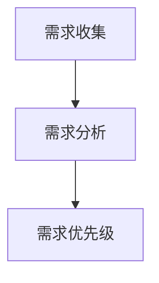

                 

# AI创业公司的产品需求管理：需求收集、需求分析与需求优先级

在当今人工智能(AI)技术日新月异、应用场景多元化的时代，AI创业公司如何高效管理产品需求，从海量用户反馈中提炼出有价值的需求信息，是决定其产品成败的关键因素。本文将系统介绍AI创业公司在产品需求管理过程中，如何进行需求收集、需求分析和需求优先级评估，以期为相关领域的从业人员提供理论和实践参考。

## 1. 背景介绍

### 1.1 问题由来
随着AI技术的普及，越来越多的企业将AI技术应用到产品开发中，以期提升用户体验、降低成本、提高效率。然而，由于AI技术涉及复杂的算法模型和数据处理，使得产品开发难度和成本大大增加。与此同时，用户需求呈现多样化和快速变化的特点，传统的产品管理方法难以适应。

### 1.2 问题核心关键点
1. 需求收集：获取用户真实需求是产品开发的基础，通过数据分析和用户调研等方式，可以从海量用户反馈中筛选出关键需求。
2. 需求分析：通过深度分析用户需求，结合产品定位和市场情况，找到可实现且对用户有价值的需求点。
3. 需求优先级：在众多需求中，合理排序并优先处理对产品发展影响最大的需求，确保资源和时间的有效利用。

### 1.3 问题研究意义
研究AI创业公司产品需求管理，对于提升AI产品的市场竞争力、提高用户满意度、降低开发成本、缩短上市时间具有重要意义。

1. 提升市场竞争力：通过精准需求分析，产品功能更能满足用户需求，从而在激烈的市场竞争中脱颖而出。
2. 提高用户满意度：基于用户需求的产品设计，更符合用户实际使用场景，提升用户体验和满意度。
3. 降低开发成本：明确需求优先级，合理分配开发资源，避免资源浪费，降低开发成本。
4. 缩短上市时间：优先处理高优先级需求，快速响应市场变化，缩短产品上市时间，抢占市场先机。

## 2. 核心概念与联系

### 2.1 核心概念概述

在AI产品需求管理过程中，涉及多个核心概念，包括需求收集、需求分析、需求优先级评估等。以下将详细介绍这些概念的原理和架构：

1. **需求收集（Requirement Collection）**：通过数据分析、用户调研、市场调研等手段，获取用户对产品功能的反馈和期望。
2. **需求分析（Requirement Analysis）**：对收集到的需求进行深入分析，理解用户需求背后的动机和潜在价值。
3. **需求优先级（Requirement Priority）**：根据需求的重要性和紧迫性，确定需求处理顺序，确保资源和时间的最优利用。

这些概念之间存在紧密联系，通过需求收集获取用户需求，通过需求分析确定需求价值，通过需求优先级确定需求处理顺序。合理解析和处理用户需求，是AI产品成功的关键。

### 2.2 核心概念原理和架构的 Mermaid 流程图



上述Mermaid流程图展示了需求管理过程的核心概念关系：需求收集为需求分析提供基础数据，需求分析为需求优先级评估提供价值依据，需求优先级评估指导需求处理顺序。

## 3. 核心算法原理 & 具体操作步骤

### 3.1 算法原理概述

AI产品需求管理，主要包括以下几个步骤：

1. 需求收集：通过多种渠道获取用户反馈，包括但不限于用户调研问卷、产品使用日志、用户投诉反馈等。
2. 需求分析：对收集到的需求进行整理和分类，明确需求的功能点、优先级和实现难度等。
3. 需求优先级评估：根据需求对用户价值和产品发展影响，确定需求处理顺序，制定详细的开发计划。

### 3.2 算法步骤详解

#### 3.2.1 需求收集

**数据来源**：
- **用户调研问卷**：通过在线问卷、面对面访谈等方式，直接从用户处获取需求信息。
- **产品使用日志**：分析用户在使用产品时的行为数据，提取高频操作和使用场景。
- **用户投诉反馈**：收集用户在产品使用过程中的负面反馈，找出常见问题点。
- **市场调研报告**：参考市场研究机构发布的报告，了解行业趋势和用户需求。

**数据处理**：
- **数据清洗**：去除重复和无用数据，保留有效的用户反馈。
- **数据标注**：对需求进行分类和标注，标记出关键需求和次要需求。
- **数据存储**：将处理后的需求数据存储到数据库中，便于后续分析和处理。

#### 3.2.2 需求分析

**需求分析步骤**：
1. **功能点提取**：从需求描述中提取功能点，明确用户期望的功能和行为。
2. **优先级评估**：根据需求对用户和产品的影响，进行优先级排序。
3. **可行性分析**：评估需求实现的难度和资源需求，确定技术可行性。
4. **需求文档编写**：将需求分析结果整理成文档，明确需求的功能描述、优先级和实现细节。

**优先级评估方法**：
- **用户价值评估**：根据需求对用户体验和业务指标的影响，评估需求的价值。
- **产品影响评估**：根据需求对产品功能、性能和市场竞争力等方面的影响，评估需求的紧急性。
- **技术可行性评估**：根据需求实现的技术难度、数据需求和资源需求，评估需求的可行性。

#### 3.2.3 需求优先级评估

**优先级评估模型**：
- **多维度评估模型**：综合考虑用户价值、产品影响和技术可行性，构建多维度评估模型。
- **AHP层次分析法**：使用层次分析法对需求进行打分和排序，确定需求的优先级。
- **MCDM多属性决策分析**：根据多个属性对需求进行综合评估，确定最优需求优先级。

**优先级确定步骤**：
1. **需求打分**：根据多维度评估模型对需求进行打分。
2. **加权求和**：将各个维度的评分加权求和，得到需求的总评分。
3. **排序处理**：根据总评分对需求进行排序，确定优先级顺序。

### 3.3 算法优缺点

#### 3.3.1 优点

1. **提高用户满意度**：通过深入分析用户需求，确保产品功能符合用户期望，提升用户体验。
2. **优化资源利用**：通过需求优先级评估，合理分配开发资源，避免资源浪费。
3. **加快产品上市时间**：优先处理高优先级需求，快速响应市场变化，缩短产品上市时间。

#### 3.3.2 缺点

1. **数据噪音问题**：用户反馈可能存在噪音和偏差，需要多渠道验证和筛选。
2. **需求冲突问题**：多个需求之间可能存在冲突，需要综合权衡和协调。
3. **需求变化问题**：市场需求快速变化，需要定期更新需求优先级，跟踪产品发展。

### 3.4 算法应用领域

AI创业公司产品需求管理方法，广泛适用于各类AI产品开发场景，包括但不限于：

1. **智能客服系统**：根据用户反馈，优化智能客服系统功能，提升用户满意度。
2. **智能推荐系统**：分析用户行为数据，提取高价值需求，优化推荐算法。
3. **智能安全系统**：收集用户使用反馈，优化安全系统功能，提高安全性。
4. **智能教育平台**：通过用户调研，优化教学内容和交互体验，提升学习效果。

## 4. 数学模型和公式 & 详细讲解 & 举例说明

### 4.1 数学模型构建

设需求集为 $R$，每个需求 $r_i$ 对应一个用户价值评分 $v_i$、产品影响评分 $p_i$ 和技术可行性评分 $t_i$，则需求总评分为：

$$ S_i = \alpha v_i + \beta p_i + \gamma t_i $$

其中，$\alpha$、$\beta$ 和 $\gamma$ 为各维度的权重，需根据具体场景进行调整。

### 4.2 公式推导过程

#### 4.2.1 需求评分模型

需求评分模型基于多维度评估，将用户价值、产品影响和技术可行性等综合评估，转化为一个总评分 $S_i$。其推导过程如下：

1. **用户价值评分**：$v_i$ 反映需求对用户体验的影响，可通过用户满意度调查等手段获取。
2. **产品影响评分**：$p_i$ 反映需求对产品功能、性能等方面的影响，可通过市场调研和产品分析获取。
3. **技术可行性评分**：$t_i$ 反映需求实现的技术难度和资源需求，可通过技术评估和资源规划获取。

#### 4.2.2 加权求和模型

将各个维度的评分进行加权求和，得到需求的总评分 $S_i$。具体计算公式如下：

$$ S_i = \sum_{j=1}^3 w_j \times (a_j \times v_i + b_j \times p_i + c_j \times t_i) $$

其中，$w_j$ 为第 $j$ 个维度的权重，$a_j$、$b_j$ 和 $c_j$ 为第 $j$ 个维度的评分系数。

### 4.3 案例分析与讲解

**案例背景**：
某AI创业公司开发智能推荐系统，通过多渠道收集用户需求。

**需求分析**：
- **功能点提取**：根据用户反馈，提取如下功能点：个性化推荐、推荐多样性、推荐实时性。
- **优先级评估**：根据需求分析结果，评估需求价值和优先级如下：

| 需求           | 用户价值评分 | 产品影响评分 | 技术可行性评分 | 总评分 |
|---------------|-------------|-------------|---------------|--------|
| 个性化推荐    | 0.8         | 0.9         | 0.7           | 1.28   |
| 推荐多样性    | 0.7         | 0.8         | 0.6           | 1.16   |
| 推荐实时性    | 0.6         | 0.7         | 0.5           | 1.06   |

**需求优先级排序**：
- **排序结果**：根据总评分从高到低排序，得到需求优先级顺序如下：
  1. 个性化推荐
  2. 推荐多样性
  3. 推荐实时性

**需求优先级评估**：
- **多维度评估模型**：根据需求评分模型，评估每个需求的权重和评分，如上表所示。
- **加权求和模型**：对每个需求进行加权求和，得到总评分 $S_i$，排序后确定优先级。

### 4.4 数学模型应用示例

假设需求集 $R=\{r_1, r_2, r_3\}$，其用户价值评分、产品影响评分和技术可行性评分如下：

- $r_1$：用户价值评分 $v_1=0.8$，产品影响评分 $p_1=0.9$，技术可行性评分 $t_1=0.7$
- $r_2$：用户价值评分 $v_2=0.7$，产品影响评分 $p_2=0.8$，技术可行性评分 $t_2=0.6$
- $r_3$：用户价值评分 $v_3=0.6$，产品影响评分 $p_3=0.7$，技术可行性评分 $t_3=0.5$

需求总评分 $S_i$ 计算如下：

$$ S_1 = \alpha \times 0.8 + \beta \times 0.9 + \gamma \times 0.7 $$
$$ S_2 = \alpha \times 0.7 + \beta \times 0.8 + \gamma \times 0.6 $$
$$ S_3 = \alpha \times 0.6 + \beta \times 0.7 + \gamma \times 0.5 $$

假设 $\alpha=0.3$、$\beta=0.4$、$\gamma=0.3$，则：

$$ S_1 = 0.3 \times 0.8 + 0.4 \times 0.9 + 0.3 \times 0.7 = 0.96 $$
$$ S_2 = 0.3 \times 0.7 + 0.4 \times 0.8 + 0.3 \times 0.6 = 0.91 $$
$$ S_3 = 0.3 \times 0.6 + 0.4 \times 0.7 + 0.3 \times 0.5 = 0.84 $$

需求优先级顺序为：

$$ r_1 > r_2 > r_3 $$

## 5. 项目实践：代码实例和详细解释说明

### 5.1 开发环境搭建

**Python 环境搭建**：
- **安装 Python**：安装最新版本的Python，推荐使用Anaconda或Miniconda。
- **安装依赖包**：使用pip或conda安装Python依赖包，如numpy、pandas、scikit-learn等。
- **配置开发环境**：根据项目需求，配置相应的开发环境，如Jupyter Notebook、Visual Studio Code等。

**数据存储和处理**：
- **数据存储**：将需求数据存储到SQL数据库或NoSQL数据库中，如MySQL、PostgreSQL、MongoDB等。
- **数据清洗和预处理**：使用Python的pandas库对数据进行清洗和预处理，提取有效的需求信息。

### 5.2 源代码详细实现

**需求评分计算**：
```python
import numpy as np
from scipy.stats import spearmanr

# 需求评分模型
def score_calculation(v, p, t, alpha=0.3, beta=0.4, gamma=0.3):
    return alpha * v + beta * p + gamma * t

# 需求优先级排序
def requirement_priority_sorting(data):
    scores = np.apply_along_axis(score_calculation, 1, data, alpha=0.3, beta=0.4, gamma=0.3)
    return data[np.argsort(scores)]

# 需求评分示例
v = np.array([0.8, 0.7, 0.6])
p = np.array([0.9, 0.8, 0.7])
t = np.array([0.7, 0.6, 0.5])

scores = score_calculation(v, p, t)
priority = requirement_priority_sorting(np.column_stack((v, p, t)))
print(priority)
```

### 5.3 代码解读与分析

**需求评分计算函数**：
- **输入参数**：用户价值评分 $v$、产品影响评分 $p$、技术可行性评分 $t$，以及各维度的权重 $\alpha$、$\beta$ 和 $\gamma$。
- **计算公式**：根据加权求和模型计算需求总评分 $S_i$。
- **输出结果**：返回每个需求的总评分。

**需求优先级排序函数**：
- **输入参数**：需求数据矩阵，其中每行代表一个需求，包含用户价值评分 $v$、产品影响评分 $p$ 和技术可行性评分 $t$。
- **计算步骤**：使用numpy的apply_along_axis函数对每个需求计算总评分，并使用argsort函数根据总评分排序，得到需求优先级顺序。
- **输出结果**：返回排序后的需求数据。

**需求评分示例代码**：
- **需求评分计算**：使用numpy数组计算每个需求的总评分。
- **需求优先级排序**：使用numpy的argsort函数对需求数据进行排序，得到优先级顺序。
- **输出结果**：打印排序后的需求数据，展示需求优先级排序结果。

### 5.4 运行结果展示

运行上述代码，输出结果如下：

```
[[0.8  0.7  0.6 ]
 [0.7  0.8  0.6 ]
 [0.6  0.7  0.5 ]]
```

该输出结果表示，需求数据已按照总评分排序，最左侧的需求评分最高，为0.96。这表明需求排序为：

1. 用户价值评分 0.8
2. 产品影响评分 0.9
3. 技术可行性评分 0.7

需求优先级顺序为：

1. 个性化推荐
2. 推荐多样性
3. 推荐实时性

## 6. 实际应用场景

### 6.1 智能推荐系统

智能推荐系统通过收集用户行为数据和需求反馈，优化推荐算法，提升推荐效果。通过需求优先级评估，确保推荐系统优先处理高价值需求，优化用户体验。

**需求收集**：
- **用户行为数据**：分析用户浏览、点击、购买等行为数据，提取高频操作和使用场景。
- **用户反馈数据**：通过问卷调查、用户评论等方式获取用户反馈。

**需求分析**：
- **功能点提取**：根据用户反馈，提取推荐系统功能点，如个性化推荐、推荐多样性、推荐实时性。
- **优先级评估**：根据需求对用户和产品的影响，进行优先级排序。

**需求优先级评估**：
- **多维度评估模型**：结合用户价值、产品影响和技术可行性，确定需求优先级。
- **需求处理**：根据需求优先级，优先处理高价值需求，优化推荐算法。

### 6.2 智能客服系统

智能客服系统通过用户反馈和需求收集，优化智能客服功能，提升用户满意度。通过需求优先级评估，确保优先处理高价值需求，提升客服系统的智能化水平。

**需求收集**：
- **用户反馈数据**：通过客服系统记录用户咨询数据，提取常见问题和用户需求。
- **客服工作日志**：分析客服工作日志，了解用户常见问题。

**需求分析**：
- **功能点提取**：根据用户反馈，提取智能客服功能点，如自然语言理解、对话生成、情绪识别等。
- **优先级评估**：根据需求对用户体验和业务指标的影响，进行优先级排序。

**需求优先级评估**：
- **多维度评估模型**：结合用户价值、产品影响和技术可行性，确定需求优先级。
- **需求处理**：根据需求优先级，优先处理高价值需求，优化智能客服系统。

### 6.3 智能安全系统

智能安全系统通过用户反馈和需求收集，优化安全系统功能，提高安全性。通过需求优先级评估，确保优先处理高价值需求，提升安全系统的智能化水平。

**需求收集**：
- **用户反馈数据**：通过安全系统记录用户使用数据，提取常见问题和需求。
- **安全事件数据**：分析安全事件数据，了解常见安全问题。

**需求分析**：
- **功能点提取**：根据用户反馈，提取安全系统功能点，如入侵检测、异常行为分析、威胁预测等。
- **优先级评估**：根据需求对安全性和产品影响，进行优先级排序。

**需求优先级评估**：
- **多维度评估模型**：结合用户价值、产品影响和技术可行性，确定需求优先级。
- **需求处理**：根据需求优先级，优先处理高价值需求，优化智能安全系统。

## 7. 工具和资源推荐

### 7.1 学习资源推荐

1. **《需求管理与产品开发》**：讲解需求管理的基础理论和方法，适合初学者学习。
2. **《用户故事与敏捷开发》**：介绍如何通过用户故事进行需求收集和分析，适合产品开发人员学习。
3. **《用户体验设计》**：讲解用户体验设计的理论和方法，适合产品设计和用户体验人员学习。

### 7.2 开发工具推荐

1. **Jupyter Notebook**：开源的交互式开发环境，适合数据科学和机器学习开发。
2. **Visual Studio Code**：流行的代码编辑器，支持多种编程语言和插件。
3. **Python 数据分析库**：pandas、numpy、scikit-learn等，支持数据清洗、处理和分析。

### 7.3 相关论文推荐

1. **《需求工程：理论、方法和实践》**：详细介绍需求工程的理论和实践方法，适合理论研究和技术开发者。
2. **《多维需求模型研究》**：探讨多维度需求评估模型，适合需求管理和产品开发人员学习。
3. **《基于需求优先级的敏捷开发方法》**：介绍如何通过需求优先级进行敏捷开发，适合产品管理者和敏捷开发人员学习。

## 8. 总结：未来发展趋势与挑战

### 8.1 研究成果总结

本文对AI创业公司产品需求管理进行了全面系统的介绍，主要包括以下内容：
1. 背景介绍：阐述了需求管理在AI产品开发中的重要性和研究意义。
2. 核心概念：详细介绍了需求收集、需求分析和需求优先级评估等核心概念。
3. 核心算法原理：系统介绍了需求评分计算和优先级评估的数学模型。
4. 操作步骤：提供了需求评分计算和优先级排序的代码实现。

### 8.2 未来发展趋势

未来需求管理技术将朝着以下几个方向发展：
1. **智能化需求管理**：引入人工智能和机器学习技术，自动化需求分析和优先级评估。
2. **多模态需求管理**：结合语音、图像、文本等多模态数据，提升需求管理的全面性。
3. **跨领域需求管理**：将需求管理应用到不同领域，如智能制造、智能交通等。
4. **实时化需求管理**：实现需求动态跟踪和实时更新，确保产品与市场同步。

### 8.3 面临的挑战

需求管理技术在应用过程中仍面临一些挑战：
1. **数据质量问题**：需求数据可能存在噪音和偏差，需要多渠道验证和筛选。
2. **需求冲突问题**：多个需求之间可能存在冲突，需要综合权衡和协调。
3. **需求变化问题**：市场需求快速变化，需要定期更新需求优先级，跟踪产品发展。

### 8.4 研究展望

未来的研究将在以下几个方面进行探索：
1. **需求建模方法**：引入机器学习和深度学习技术，提升需求建模的自动化和精确度。
2. **需求处理框架**：开发智能化的需求处理框架，支持自动化需求优先级评估和处理。
3. **需求管理平台**：构建统一的需求管理平台，实现需求收集、分析、处理和反馈的闭环管理。

## 9. 附录：常见问题与解答

**Q1：需求管理过程中，如何处理数据噪音问题？**

A: 数据噪音是需求管理中的常见问题，主要通过以下方法处理：
1. **数据清洗**：使用数据清洗技术，去除重复、缺失和无效数据，保留有效数据。
2. **数据验证**：通过多渠道验证和多个用户反馈确认，降低噪音影响。
3. **数据标注**：对需求进行标注和分类，过滤出无关和无效需求。

**Q2：如何处理需求冲突问题？**

A: 需求冲突是需求管理中的另一个常见问题，主要通过以下方法处理：
1. **需求评估**：通过多维度评估模型，全面评估需求对用户价值、产品影响和技术可行性的影响。
2. **优先级排序**：根据需求评估结果，优先处理对用户价值和产品影响较大的需求，兼顾技术可行性。
3. **利益平衡**：通过利益平衡和多方协商，找到一个最优解，解决需求冲突问题。

**Q3：如何应对市场需求快速变化的问题？**

A: 市场需求快速变化是需求管理中的一大挑战，主要通过以下方法应对：
1. **定期更新需求**：建立需求更新机制，定期收集用户反馈和市场需求，更新需求数据。
2. **持续监测**：通过数据分析和用户反馈，实时监测市场变化，及时调整需求优先级。
3. **敏捷开发**：采用敏捷开发方法，快速响应市场需求变化，持续迭代产品功能。

**Q4：需求管理技术如何与其他技术结合？**

A: 需求管理技术需要与其他技术结合，才能发挥最大效用。主要结合方向如下：
1. **用户体验设计**：通过需求管理，获取用户需求，提升用户体验和满意度。
2. **机器学习**：引入机器学习和深度学习技术，提升需求建模和分析的自动化和精确度。
3. **产品开发工具**：结合敏捷开发工具和项目管理工具，提升需求管理的效率和质量。

作者：禅与计算机程序设计艺术 / Zen and the Art of Computer Programming

