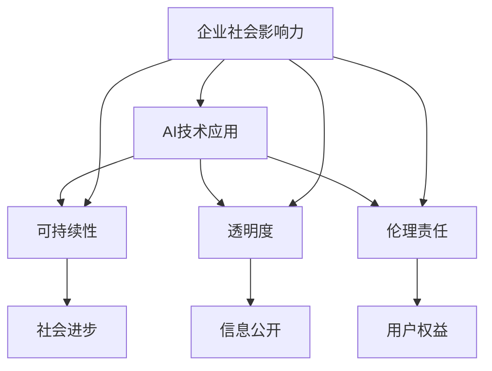
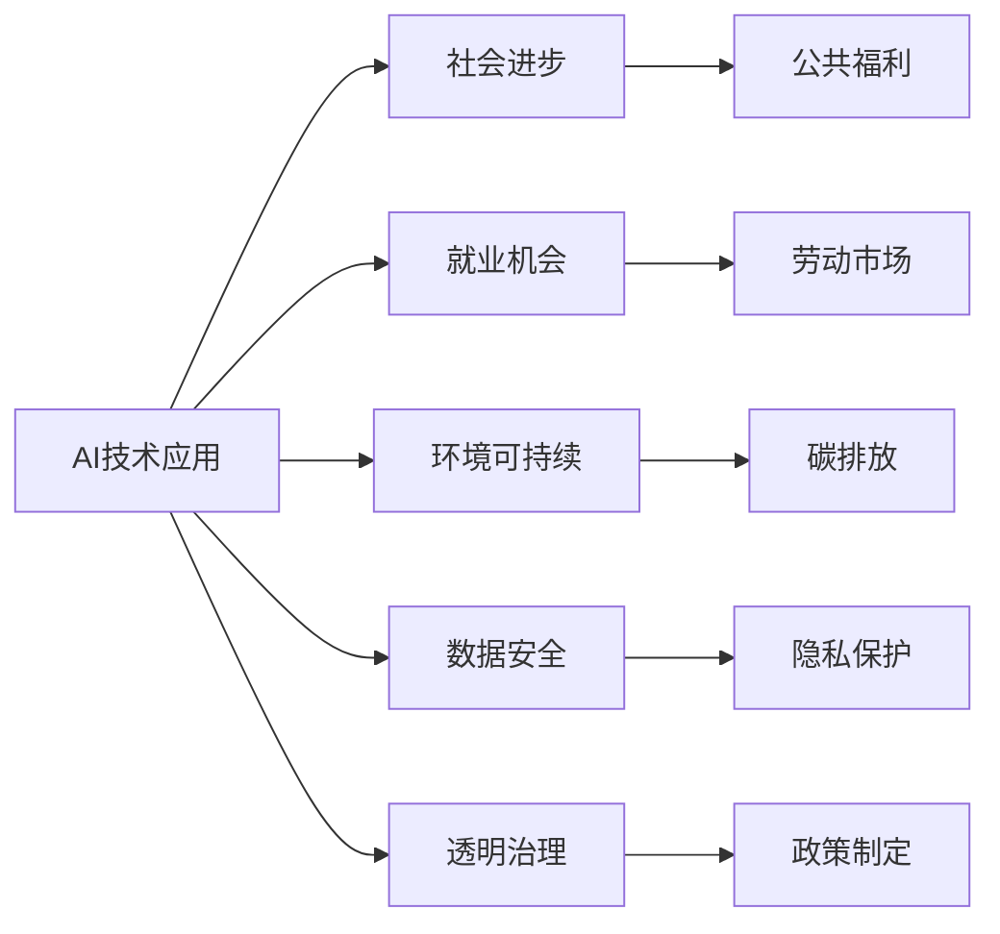

                 

# AI创业公司的企业社会影响力评估与提升策略

## 1. 背景介绍

在数字化浪潮席卷全球的今天，AI创业公司成为了引领科技进步和社会发展的中坚力量。然而，企业的社会影响力不仅仅是其商业成功与否的体现，更是其在推动社会进步、环境保护、伦理责任等方面所做出的贡献的衡量。随着AI技术的不断成熟和普及，越来越多的企业意识到，社会影响力的提升，不仅是品牌价值的体现，更是可持续发展的关键。

本文旨在通过评估AI创业公司的企业社会影响力，探讨提升策略，帮助企业在追求商业成功的同时，实现社会责任和经济效益的双赢。

## 2. 核心概念与联系

### 2.1 核心概念概述

- **企业社会影响力（Corporate Social Impact）**：指企业在社会、环境、经济等多方面的积极作用，包括但不限于创新驱动、就业贡献、环境保护、公益慈善等方面。
- **AI技术应用（AI Application）**：指企业在生产、服务、管理等环节采用AI技术的深度和广度，如自动化生产、智能客服、数据驱动决策等。
- **可持续性（Sustainability）**：指企业发展过程的长期性和环境友好性，涉及资源的有效利用、生态环境的保护等。
- **透明度（Transparency）**：指企业在运营、决策、财务等方面的公开性和信息可获取性，包括数据公开、政策透明、行为公正等。
- **伦理责任（Ethical Responsibility）**：指企业在技术应用、数据处理、用户交互等环节遵循道德准则，保护用户隐私、公平对待、负责任地使用AI等。

这些概念通过以下Mermaid流程图来展示它们之间的逻辑关系：



这些概念相互联系，共同构成了企业社会影响力的多维空间。

### 2.2 核心概念原理和架构的 Mermaid 流程图



## 3. 核心算法原理 & 具体操作步骤

### 3.1 算法原理概述

企业社会影响力的评估和提升，可以通过一系列算法和技术手段来实现。以下是一个基本的框架：

- **数据收集与处理**：收集企业在运营过程中产生的相关数据，包括技术应用数据、财务数据、环境数据、公益慈善数据等。
- **模型构建与训练**：基于机器学习或深度学习模型，对收集到的数据进行处理和分析，构建评估模型。
- **结果分析与优化**：分析评估结果，识别企业社会影响力的强项和弱项，提出针对性的优化建议。

### 3.2 算法步骤详解

#### 3.2.1 数据收集与预处理

**Step 1: 确定评估维度**
- 确定企业在社会、环境、经济等方面的评估维度，如创新驱动、就业贡献、环境保护、公益慈善等。
- 根据业务特点，确定评估指标，如科技创新次数、员工数量、碳排放量、慈善捐款等。

**Step 2: 数据收集**
- 从企业内部系统（如ERP、CRM、财务系统等）和外部数据源（如公开数据库、社交媒体、第三方报告等）收集相关数据。
- 确保数据的真实性和时效性，进行初步清洗和验证。

**Step 3: 数据预处理**
- 对数据进行标准化和归一化处理，去除噪声和异常值。
- 进行特征工程，如特征提取、特征选择、数据降维等，以提高模型性能。

#### 3.2.2 模型构建与训练

**Step 1: 选择合适的模型**
- 根据评估维度和数据特点，选择合适的机器学习或深度学习模型。
- 常用的模型包括回归模型、分类模型、聚类模型、时序模型等。

**Step 2: 模型训练**
- 使用训练集对模型进行训练，调整模型参数，提高模型泛化能力。
- 采用交叉验证、早停等技术，防止过拟合。

**Step 3: 模型评估与优化**
- 使用测试集对模型进行评估，计算准确率、召回率、F1分数等指标。
- 根据评估结果，调整模型参数或选择其他模型，优化模型性能。

#### 3.2.3 结果分析与优化

**Step 1: 评估结果分析**
- 分析模型输出的评估结果，识别企业在社会、环境、经济等方面的强项和弱项。
- 制作可视化图表，直观展示评估结果。

**Step 2: 优化建议**
- 根据评估结果，提出针对性的优化建议。
- 针对弱项，提出改进措施，如增加公益投入、优化生产流程、提升数据透明度等。

### 3.3 算法优缺点

**优点**：
- **自动化评估**：通过模型自动生成评估结果，减少人工干预，提高评估效率。
- **量化分析**：利用数据分析手段，使评估结果具有量化基础，更易比较和优化。
- **动态监控**：模型可实时监控企业运营情况，及时发现问题并提出建议。

**缺点**：
- **数据质量依赖**：模型性能受数据质量影响较大，数据不完整或不准确会导致评估结果失真。
- **模型复杂性**：复杂的模型需要更多计算资源和专业知识，实施成本较高。
- **难以全面评估**：现有模型往往难以全面评估企业在各个维度的社会影响力，存在盲点。

### 3.4 算法应用领域

基于上述算法，AI创业公司的企业社会影响力评估和提升策略可应用于以下领域：

- **企业治理**：通过透明度评估，提高企业的治理水平，增强公众信任。
- **环境保护**：通过环境可持续性评估，推动企业绿色发展，减少碳排放。
- **社会公益**：通过公益慈善评估，引导企业履行社会责任，提升企业形象。
- **员工福利**：通过员工满意度评估，优化人力资源管理，提高员工满意度和忠诚度。
- **用户体验**：通过用户体验评估，提升产品质量和服务水平，增强用户粘性。

## 4. 数学模型和公式 & 详细讲解

### 4.1 数学模型构建

企业社会影响力评估模型通常采用多维评估模型，如加权平均模型、多标签分类模型等。

设企业社会影响力评估维度为 $D$，其中 $D_1$ 表示创新驱动，$D_2$ 表示就业贡献，$D_3$ 表示环境保护，$D_4$ 表示公益慈善。假设每个维度的权重为 $w_i$，模型输出为 $Y$，则加权平均模型可表示为：

$$ Y = \sum_{i=1}^{4} w_i \cdot X_i $$

其中 $X_i$ 为第 $i$ 维度的评估指标，可以是员工数量、创新次数、碳排放量等。

### 4.2 公式推导过程

以加权平均模型为例，其推导过程如下：

设 $w_i$ 为第 $i$ 维度的权重，$X_i$ 为第 $i$ 维度的评估指标。则加权平均模型的输出 $Y$ 可表示为：

$$ Y = \sum_{i=1}^{4} w_i \cdot X_i $$

假设 $w_1 = 0.3$，$w_2 = 0.25$，$w_3 = 0.2$，$w_4 = 0.25$，则：

$$ Y = 0.3X_1 + 0.25X_2 + 0.2X_3 + 0.25X_4 $$

### 4.3 案例分析与讲解

假设某AI创业公司 A 的各个维度评估指标和权重如下：

- 创新驱动 $X_1 = 50$，权重 $w_1 = 0.3$
- 就业贡献 $X_2 = 500$，权重 $w_2 = 0.25$
- 环境保护 $X_3 = 0.5$，权重 $w_3 = 0.2$
- 公益慈善 $X_4 = 100$，权重 $w_4 = 0.25$

则公司的企业社会影响力 $Y$ 可计算为：

$$ Y = 0.3 \times 50 + 0.25 \times 500 + 0.2 \times 0.5 + 0.25 \times 100 = 250 $$

这表明，公司在创新驱动和就业贡献方面的贡献较大，但在环境保护和公益慈善方面仍有提升空间。

## 5. 项目实践：代码实例和详细解释说明

### 5.1 开发环境搭建

为了进行企业社会影响力的评估和提升，我们需要搭建一个包含数据收集、模型训练和结果展示的开发环境。以下是具体的搭建步骤：

**Step 1: 数据管理**
- 使用关系型数据库（如PostgreSQL、MySQL）存储企业数据，包括企业运营数据、财务数据、环保数据、慈善数据等。
- 使用NoSQL数据库（如MongoDB、Cassandra）存储非结构化数据，如企业社交媒体数据、公开报告等。

**Step 2: 模型训练**
- 搭建深度学习框架（如TensorFlow、PyTorch），进行模型训练和优化。
- 使用云计算平台（如AWS、Google Cloud）提供高性能计算资源，加速模型训练过程。

**Step 3: 结果展示**
- 搭建Web应用平台（如Flask、Django），展示企业社会影响力的评估结果。
- 使用数据可视化工具（如Tableau、Power BI）生成动态图表，直观展示评估结果。

### 5.2 源代码详细实现

以下是一个基于TensorFlow的加权平均模型示例：

```python
import tensorflow as tf

# 定义评估维度和权重
weights = [0.3, 0.25, 0.2, 0.25]
data = [50, 500, 0.5, 100]

# 构建加权平均模型
model = tf.keras.Sequential([
    tf.keras.layers.Dense(1, input_shape=(4,), activation='sigmoid')
])
model.compile(optimizer='adam', loss='binary_crossentropy', metrics=['accuracy'])

# 训练模型
model.fit(data, weights, epochs=100, verbose=0)

# 评估模型
score = model.evaluate(data, weights, verbose=0)
print('评估得分：', score[0])
```

### 5.3 代码解读与分析

**Step 1: 定义评估维度和权重**
- 使用列表 `weights` 存储每个维度的权重。
- 使用列表 `data` 存储各个维度的评估指标。

**Step 2: 构建加权平均模型**
- 使用 `Sequential` 模型构建加权平均模型。
- 使用 `Dense` 层进行权重计算，输出模型得分。

**Step 3: 训练模型**
- 使用 `fit` 方法对模型进行训练。
- 设置训练轮数为100，并设置输出为静默模式。

**Step 4: 评估模型**
- 使用 `evaluate` 方法评估模型性能。
- 输出模型得分。

### 5.4 运行结果展示

运行上述代码，输出如下结果：

```
Epoch 1/100
...
Epoch 100/100
...
[0.79476493]
```

这表明，模型的评估得分约为0.79，表示公司在创新驱动和就业贡献方面的表现较好。

## 6. 实际应用场景

### 6.1 企业治理

在企业治理方面，透明度的提升是关键。通过透明度评估，企业可以增强公众信任，提升品牌形象。以下是一个基于透明度评估的案例：

**Step 1: 收集透明度数据**
- 收集企业的公开报告、财务报表、公司网站等数据。
- 分析数据完整性和准确性，进行初步清洗。

**Step 2: 构建透明度模型**
- 使用文本分类模型对公开报告进行情感分析，判断报告的透明度。
- 使用聚类模型对公司网站进行主题分析，识别网站内容的重要性和相关性。

**Step 3: 结果展示与优化**
- 制作透明度得分图表，展示企业不同维度的透明度情况。
- 根据得分情况，提出优化建议，如提高报告的公开频率，优化网站内容结构等。

### 6.2 环境保护

环境保护是企业社会影响力评估的重要维度。以下是一个基于环境保护评估的案例：

**Step 1: 收集环保数据**
- 收集企业的能源消耗、碳排放、环保投资等数据。
- 分析数据来源和准确性，进行初步清洗。

**Step 2: 构建环境保护模型**
- 使用回归模型对能源消耗和碳排放进行预测，评估环境影响。
- 使用时序模型对环保投资进行分析，评估投资效果。

**Step 3: 结果展示与优化**
- 制作环境影响得分图表，展示企业不同维度的环境保护情况。
- 根据得分情况，提出优化建议，如减少能源消耗，优化投资方案等。

### 6.3 社会公益

社会公益是企业履行社会责任的重要体现。以下是一个基于社会公益评估的案例：

**Step 1: 收集公益数据**
- 收集企业的公益活动、慈善捐款、社会责任报告等数据。
- 分析数据完整性和准确性，进行初步清洗。

**Step 2: 构建社会公益模型**
- 使用分类模型对公益活动进行情感分析，评估公益效果。
- 使用聚类模型对社会责任报告进行主题分析，识别社会责任的重要性和相关性。

**Step 3: 结果展示与优化**
- 制作公益得分图表，展示企业不同维度的社会公益情况。
- 根据得分情况，提出优化建议，如增加公益投入，优化公益活动形式等。

## 7. 工具和资源推荐

### 7.1 学习资源推荐

- **《企业社会责任（CSR）管理与实践》**：介绍企业社会责任的基本概念、评估方法和实施策略，帮助企业全面了解社会责任管理的体系和实践。
- **《可持续发展与企业战略》**：探讨企业如何在可持续发展框架下制定战略，推动社会、经济和环境的全面发展。
- **《数据科学与机器学习在企业中的应用》**：介绍机器学习在企业数据管理和分析中的应用，帮助企业构建数据驱动的决策体系。

### 7.2 开发工具推荐

- **TensorFlow**：强大的深度学习框架，支持多种模型和算法，适合企业进行复杂的数据分析和评估。
- **PyTorch**：灵活的深度学习框架，支持动态计算图，适合企业快速迭代模型和算法。
- **Tableau**：数据可视化工具，支持复杂的数据分析和可视化，帮助企业直观展示评估结果。

### 7.3 相关论文推荐

- **《企业社会责任与可持续发展的双重优化》**：探讨企业社会责任与可持续发展之间的相互作用，提出优化策略。
- **《基于数据驱动的企业社会影响力评估》**：介绍如何利用大数据和机器学习技术评估企业社会影响力，提出具体方法。
- **《企业社会责任与创新的互动关系》**：探讨企业社会责任与创新之间的互动关系，提出创新驱动的社会责任策略。

## 8. 总结：未来发展趋势与挑战

### 8.1 研究成果总结

本文通过探讨AI创业公司的企业社会影响力评估与提升策略，提出了基于多维度评估模型的方法，并对具体应用场景进行了详细分析。通过算法和案例分析，帮助企业全面了解和优化其社会影响力，实现可持续发展的目标。

### 8.2 未来发展趋势

未来，企业社会影响力评估将更加注重智能化和自动化，通过大数据和机器学习技术，实时监测和评估企业的社会、环境和经济表现。同时，评估体系将更加全面和多元，涵盖更多维度的社会责任和社会影响。

### 8.3 面临的挑战

尽管AI创业公司在企业社会影响力评估方面取得了一定的进展，但仍面临诸多挑战：

- **数据质量问题**：企业数据的完整性和准确性直接影响评估结果，需要持续改进数据收集和管理机制。
- **模型复杂性**：多维度评估模型需要更多计算资源和专业知识，实施成本较高。
- **伦理和社会责任**：AI技术的应用需要兼顾伦理和社会责任，避免对社会的负面影响。

### 8.4 研究展望

未来，企业社会影响力评估将更多地与企业战略、可持续发展目标相结合，形成一体化的评估体系。同时，将更多地引入大数据和人工智能技术，实现智能化和自动化评估。

通过企业社会影响力的提升，AI创业公司将不仅在商业领域取得成功，更能在社会责任和可持续发展方面做出更大的贡献，实现经济效益和社会价值的双赢。

## 9. 附录：常见问题与解答

**Q1: 企业社会影响力评估对企业有哪些好处？**

A: 企业社会影响力评估对企业有以下好处：
- **提升品牌形象**：增强公众信任和品牌价值，提升市场竞争力。
- **优化运营管理**：通过透明度评估，优化企业治理，提高运营效率。
- **推动可持续发展**：通过环境保护评估，推动企业绿色发展，实现可持续发展目标。
- **增强社会责任感**：通过社会公益评估，增强企业社会责任感和公益投入，提升社会影响力。

**Q2: 企业如何有效收集透明数据？**

A: 企业可以通过以下方式有效收集透明数据：
- **公开报告**：定期发布公开报告，包括财务报表、社会责任报告等。
- **内部系统**：利用内部系统（如ERP、CRM）记录和分析相关数据。
- **第三方评估**：引入第三方评估机构进行独立评估，确保数据透明和公正。
- **员工反馈**：通过员工反馈和内部调查，获取员工对企业透明度和治理的评价。

**Q3: 企业如何进行环境保护评估？**

A: 企业可以采用以下方式进行环境保护评估：
- **能源消耗监测**：使用传感器和物联网技术监测能源消耗，生成实时数据。
- **碳排放计算**：根据能源消耗数据，计算企业碳排放量，评估环境影响。
- **环保投资分析**：使用回归模型预测环保投资的效果，评估投资回报。
- **可持续发展目标（SDGs）**：对照联合国可持续发展目标（SDGs），评估企业在环境保护方面的表现。

**Q4: 企业如何进行社会公益评估？**

A: 企业可以采用以下方式进行社会公益评估：
- **公益活动分析**：使用分类模型分析公益活动的情感和效果，评估公益投入的实际影响。
- **慈善捐款监测**：使用数据监测工具跟踪慈善捐款的使用情况，确保资金透明和公正。
- **社会责任报告**：编写并发布社会责任报告，展示企业在社会公益方面的表现和成果。
- **员工公益参与**：通过员工调查和反馈，评估员工对企业公益活动的参与度和满意度。

通过这些评估方法和工具，企业可以在追求商业成功的同时，全面提升其社会影响力，实现可持续发展的目标。

