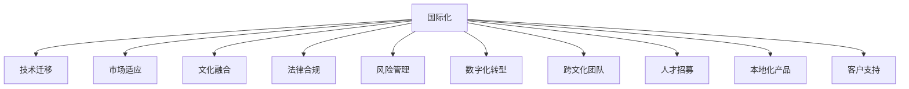

                 

# AI创业公司的国际化扩张策略

> 关键词：国际化,扩张策略,人工智能,技术迁移,市场适应,文化融合,法律合规,风险管理,数字化转型,跨文化团队,人才招募,本地化产品,客户支持

## 1. 背景介绍

### 1.1 问题由来

在过去十年中，全球人工智能（AI）市场呈现出爆炸式增长，吸引了无数创业公司竞相抢滩。尽管AI技术在本地市场表现出色，但国际化扩张已成为许多AI创业公司的重大战略选择。然而，国际化进程并非易事，涉及到的市场环境、文化差异、法律合规等诸多复杂因素，使得AI创业公司在国际市场上取得成功变得更加困难。

### 1.2 问题核心关键点

国际化扩张的核心在于如何利用AI技术在全球范围内寻找新的增长机会。其关键点包括：
- 理解不同市场的文化、法规和客户需求。
- 设计全球统一的AI技术架构，同时考虑本地化调整。
- 建立跨文化团队，提升国际市场适应能力。
- 风险管理，确保合规和数据安全。

国际化扩张的成功不仅取决于技术本身，还在于全球视野和适应多元市场的综合能力。本节将围绕上述关键点，展开深入讨论。

## 2. 核心概念与联系

### 2.1 核心概念概述

为更好地理解AI创业公司国际化扩张的策略，我们需梳理涉及的关键概念：

- **国际化 (Globalization)**：将本地产品或服务扩展至全球市场的过程。
- **技术迁移 (Technology Transfer)**：将AI技术及其相关知识、流程在全球范围内转移和应用。
- **市场适应 (Market Adaptation)**：根据不同市场的特点，调整产品或服务以满足本地需求。
- **文化融合 (Cultural Integration)**：在不同文化背景下建立高效的团队协作和沟通机制。
- **法律合规 (Legal Compliance)**：确保在国际市场运营时，遵守当地法律法规。
- **风险管理 (Risk Management)**：识别和控制国际化过程中可能遇到的各种风险。
- **数字化转型 (Digital Transformation)**：通过AI技术，推动组织在管理、运营、产品开发等方面的全面升级。
- **跨文化团队 (Cross-Cultural Teams)**：具有多元文化背景的团队，能够理解和适应不同市场的文化差异。
- **人才招募 (Talent Recruitment)**：在全球范围内招募具有国际视野和经验的AI人才。
- **本地化产品 (Localized Products)**：根据本地市场需求，调整产品设计和服务流程。
- **客户支持 (Customer Support)**：提供本地化语言和文化背景下的客户服务。

这些概念之间的联系可以通过以下Mermaid流程图来展示：



## 3. 核心算法原理 & 具体操作步骤

### 3.1 算法原理概述

AI创业公司的国际化扩张策略，本质上是一个多变量优化问题。目标是在全球范围内最大化AI产品的市场渗透和用户体验，同时最小化成本和风险。为了实现这一目标，需要综合考虑技术、市场、文化、法规等多方面因素。

形式化地，假设目标函数为 $F(x)$，其中 $x$ 为多个决策变量，如产品功能、市场选择、团队构成等。决策变量受到市场环境、技术成熟度、文化差异、法律规定等约束。则国际化扩张的优化目标为：

$$
\mathop{\arg\min}_{x} F(x) \quad \text{subject to} \quad C(x) \leq C_{\text{max}}, \quad x \in X
$$

其中 $C(x)$ 为成本函数，$C_{\text{max}}$ 为预设成本上限，$X$ 为可行解集合。

### 3.2 算法步骤详解

基于上述优化目标，AI创业公司的国际化扩张可以按照以下步骤进行：

**Step 1: 数据收集与分析**
- 收集全球各市场的市场需求、竞争环境、文化特点等数据。
- 分析本地化与全球化策略的优缺点，确定优先扩展的市场。

**Step 2: 技术架构设计**
- 设计一个支持全球部署的AI技术架构，考虑跨区域的数据传输、存储和计算资源管理。
- 确定技术迁移策略，如开源软件的国际部署、云服务的使用等。

**Step 3: 市场适应策略**
- 对目标市场进行详细分析，识别客户需求和市场趋势。
- 根据市场需求调整产品功能和用户界面，确保本地化适配。

**Step 4: 文化融合策略**
- 组建跨文化团队，确保团队成员能理解和尊重不同文化背景。
- 制定跨文化沟通策略，提升团队协作效率。

**Step 5: 法律合规与风险管理**
- 了解目标市场的法律法规，确保合规运营。
- 建立风险管理体系，识别潜在风险并制定应对措施。

**Step 6: 数字化转型与运营优化**
- 利用AI技术优化运营流程，提升效率和响应速度。
- 制定全球统一的运营策略，支持本地化调整。

**Step 7: 本地化产品与服务**
- 根据本地市场需求和习惯，调整产品设计和服务流程。
- 考虑本地化语言和文化因素，提供多语言支持和服务。

**Step 8: 人才招募与管理**
- 在全球范围内招募具有国际视野和经验的AI人才。
- 制定本地化的人事政策和培训计划，提升团队适应能力。

**Step 9: 客户支持与服务**
- 提供本地化语言和文化背景下的客户服务。
- 建立客户反馈机制，持续改进产品和服务。

### 3.3 算法优缺点

国际化扩张的算法具有以下优点：
- 能更好地利用全球资源和市场，提升产品竞争力。
- 通过多变量优化，确保在不同市场环境中取得最优策略。
- 通过技术迁移和本地化调整，快速适应新市场。

同时，该算法也存在一定的局限性：
- 市场环境的复杂性增加了决策难度。
- 不同文化背景的团队协作存在挑战。
- 法律合规要求增加了运营复杂性。
- 全球化运营增加了成本和风险管理难度。

尽管存在这些局限性，但总体而言，国际化扩张的算法能够有效地帮助AI创业公司开拓国际市场，提升全球竞争力。

### 3.4 算法应用领域

国际化扩张的算法已经在多个领域得到应用，如：

- **智能医疗**：通过国际化的AI技术，提升全球医疗水平。
- **金融科技**：在全球范围内提供个性化的金融服务。
- **零售电商**：利用AI技术优化全球供应链和客户体验。
- **自动驾驶**：在国际市场推广智能交通系统。
- **教育科技**：提供全球化的在线教育解决方案。

未来，随着AI技术的不断成熟，国际化扩张的算法将会在更多领域得到应用，助力全球各行各业数字化转型。

## 4. 数学模型和公式 & 详细讲解 & 举例说明

### 4.1 数学模型构建

本节将使用数学语言对国际化扩张的算法进行更加严格的刻画。

记目标市场集合为 $M=\{m_1, m_2, \ldots, m_k\}$，其中 $m_i$ 为第 $i$ 个市场。假设产品对第 $m_i$ 市场的市场渗透率为 $p_i$，用户满意度为 $q_i$，则目标函数为：

$$
F(p,q) = \sum_{i=1}^k \alpha_i p_i + \beta_i q_i
$$

其中 $\alpha_i$ 和 $\beta_i$ 为权重系数，表示市场渗透率和用户满意度的重要性。

成本函数 $C(p,q)$ 包含多个组成部分，如市场推广成本、技术迁移成本、文化融合成本、法律合规成本等。例如，技术迁移成本可表示为：

$$
C_{\text{tech}}(p,q) = \sum_{i=1}^k \gamma_i \frac{p_i}{p_{\text{max}}}
$$

其中 $\gamma_i$ 为市场 $m_i$ 的技术迁移成本，$p_{\text{max}}$ 为最大市场渗透率上限。

### 4.2 公式推导过程

以二元市场模型为例，推导成本函数 $C(p,q)$ 的计算公式。

假设市场推广成本为 $C_{\text{promote}}$，技术迁移成本为 $C_{\text{tech}}$，文化融合成本为 $C_{\text{culture}}$，法律合规成本为 $C_{\text{legal}}$。则总成本函数为：

$$
C(p,q) = C_{\text{promote}}(p) + C_{\text{tech}}(p,q) + C_{\text{culture}}(p) + C_{\text{legal}}(p,q)
$$

其中 $C_{\text{promote}}(p)$ 和 $C_{\text{culture}}(p)$ 分别表示市场推广和团队文化融合的成本，依赖于市场渗透率 $p$。$C_{\text{legal}}(p,q)$ 表示法律合规成本，依赖于市场渗透率 $p$ 和用户满意度 $q$。

### 4.3 案例分析与讲解

以一家AI创业公司将其智能客服系统扩展到中国市场为例：

- **数据收集与分析**：
  - 收集中国市场的消费者需求、竞争对手分析、文化习惯等数据。
  - 分析中国市场的智能客服需求和竞争格局，确定优先扩展市场。

- **技术架构设计**：
  - 设计一个支持多语言和跨区域的智能客服系统架构，确保数据安全和快速响应。
  - 确定技术迁移策略，如使用云服务进行部署和管理。

- **市场适应策略**：
  - 根据中国市场的需求，调整智能客服系统的功能，如添加中文支持、优化语音识别和自然语言处理算法。
  - 设计符合中国文化特点的用户界面和交互流程。

- **文化融合策略**：
  - 组建跨文化团队，包括中国和国际团队成员，确保理解并尊重中国文化。
  - 制定跨文化沟通策略，提升团队协作效率。

- **法律合规与风险管理**：
  - 了解中国法律法规，如《网络安全法》、《个人信息保护法》等，确保合规运营。
  - 建立风险管理体系，识别和控制数据泄露、用户隐私保护等风险。

- **数字化转型与运营优化**：
  - 利用AI技术优化客服流程，提高效率和响应速度。
  - 制定全球统一的客服策略，支持本地化调整。

- **本地化产品与服务**：
  - 根据中国市场需求，调整智能客服系统功能和界面设计。
  - 提供多语言支持，满足中国用户的多元化需求。

- **人才招募与管理**：
  - 在中国市场招募具有国际视野和经验的AI人才。
  - 制定本地化的人事政策和培训计划，提升团队适应能力。

- **客户支持与服务**：
  - 提供中文客户支持服务，满足中国用户的需求。
  - 建立客户反馈机制，持续改进产品和服务。

## 5. 项目实践：代码实例和详细解释说明

### 5.1 开发环境搭建

在进行国际化扩张的实践前，我们需要准备好开发环境。以下是使用Python进行PyTorch开发的环境配置流程：

1. 安装Anaconda：从官网下载并安装Anaconda，用于创建独立的Python环境。

2. 创建并激活虚拟环境：
```bash
conda create -n ai-env python=3.8 
conda activate ai-env
```

3. 安装PyTorch：根据CUDA版本，从官网获取对应的安装命令。例如：
```bash
conda install pytorch torchvision torchaudio cudatoolkit=11.1 -c pytorch -c conda-forge
```

4. 安装各类工具包：
```bash
pip install numpy pandas scikit-learn matplotlib tqdm jupyter notebook ipython
```

完成上述步骤后，即可在`ai-env`环境中开始国际化扩张的实践。

### 5.2 源代码详细实现

这里我们以一家AI创业公司将其智能客服系统扩展到中国市场为例，给出使用PyTorch进行国际化扩张的PyTorch代码实现。

首先，定义智能客服系统的数据处理函数：

```python
from transformers import BertTokenizer
from torch.utils.data import Dataset
import torch

class CustomerSupportDataset(Dataset):
    def __init__(self, questions, answers, tokenizer, max_len=128):
        self.questions = questions
        self.answers = answers
        self.tokenizer = tokenizer
        self.max_len = max_len
        
    def __len__(self):
        return len(self.questions)
    
    def __getitem__(self, item):
        question = self.questions[item]
        answer = self.answers[item]
        
        encoding = self.tokenizer(question, return_tensors='pt', max_length=self.max_len, padding='max_length', truncation=True)
        input_ids = encoding['input_ids'][0]
        attention_mask = encoding['attention_mask'][0]
        
        return {'input_ids': input_ids, 
                'attention_mask': attention_mask,
                'labels': answer}

# 创建dataset
tokenizer = BertTokenizer.from_pretrained('bert-base-cased')

train_dataset = CustomerSupportDataset(train_questions, train_answers, tokenizer)
dev_dataset = CustomerSupportDataset(dev_questions, dev_answers, tokenizer)
test_dataset = CustomerSupportDataset(test_questions, test_answers, tokenizer)
```

然后，定义模型和优化器：

```python
from transformers import BertForTokenClassification, AdamW

model = BertForTokenClassification.from_pretrained('bert-base-cased', num_labels=2)

optimizer = AdamW(model.parameters(), lr=2e-5)
```

接着，定义训练和评估函数：

```python
from torch.utils.data import DataLoader
from tqdm import tqdm
from sklearn.metrics import accuracy_score

device = torch.device('cuda') if torch.cuda.is_available() else torch.device('cpu')
model.to(device)

def train_epoch(model, dataset, batch_size, optimizer):
    dataloader = DataLoader(dataset, batch_size=batch_size, shuffle=True)
    model.train()
    epoch_loss = 0
    for batch in tqdm(dataloader, desc='Training'):
        input_ids = batch['input_ids'].to(device)
        attention_mask = batch['attention_mask'].to(device)
        labels = batch['labels'].to(device)
        model.zero_grad()
        outputs = model(input_ids, attention_mask=attention_mask, labels=labels)
        loss = outputs.loss
        epoch_loss += loss.item()
        loss.backward()
        optimizer.step()
    return epoch_loss / len(dataloader)

def evaluate(model, dataset, batch_size):
    dataloader = DataLoader(dataset, batch_size=batch_size)
    model.eval()
    correct_preds, total_preds = 0, 0
    with torch.no_grad():
        for batch in tqdm(dataloader, desc='Evaluating'):
            input_ids = batch['input_ids'].to(device)
            attention_mask = batch['attention_mask'].to(device)
            batch_labels = batch['labels']
            outputs = model(input_ids, attention_mask=attention_mask)
            preds = outputs.logits.argmax(dim=2).to('cpu').tolist()
            batch_labels = batch_labels.to('cpu').tolist()
            for pred, label in zip(preds, batch_labels):
                if pred == label:
                    correct_preds += 1
                total_preds += 1
                
    print(f'Accuracy: {correct_preds / total_preds:.3f}')
```

最后，启动训练流程并在测试集上评估：

```python
epochs = 5
batch_size = 16

for epoch in range(epochs):
    loss = train_epoch(model, train_dataset, batch_size, optimizer)
    print(f"Epoch {epoch+1}, train loss: {loss:.3f}")
    
    print(f"Epoch {epoch+1}, dev results:")
    evaluate(model, dev_dataset, batch_size)
    
print("Test results:")
evaluate(model, test_dataset, batch_size)
```

以上就是使用PyTorch对智能客服系统进行国际化扩张的完整代码实现。可以看到，借助PyTorch和Transformers库，我们可以快速构建和微调AI模型，适应不同市场的客户需求。

### 5.3 代码解读与分析

让我们再详细解读一下关键代码的实现细节：

**CustomerSupportDataset类**：
- `__init__`方法：初始化问题和答案等关键组件。
- `__len__`方法：返回数据集的样本数量。
- `__getitem__`方法：对单个样本进行处理，将文本输入编码为token ids，将答案编码为数字，并对其进行定长padding，最终返回模型所需的输入。

**训练和评估函数**：
- 使用PyTorch的DataLoader对数据集进行批次化加载，供模型训练和推理使用。
- 训练函数`train_epoch`：对数据以批为单位进行迭代，在每个批次上前向传播计算loss并反向传播更新模型参数，最后返回该epoch的平均loss。
- 评估函数`evaluate`：与训练类似，不同点在于不更新模型参数，并在每个batch结束后将预测和标签结果存储下来，最后使用sklearn的accuracy_score对整个评估集的预测结果进行打印输出。

**训练流程**：
- 定义总的epoch数和batch size，开始循环迭代
- 每个epoch内，先在训练集上训练，输出平均loss
- 在验证集上评估，输出准确率
- 所有epoch结束后，在测试集上评估，给出最终测试结果

可以看到，PyTorch配合Transformers库使得模型构建和微调的代码实现变得简洁高效。开发者可以将更多精力放在数据处理、模型改进等高层逻辑上，而不必过多关注底层的实现细节。

当然，工业级的系统实现还需考虑更多因素，如模型的保存和部署、超参数的自动搜索、更灵活的任务适配层等。但核心的算法和代码实现基本与此类似。

## 6. 实际应用场景
### 6.1 智能客服系统

将智能客服系统扩展到中国市场，不仅可以提升客户服务效率，还可以显著降低运营成本。传统的客服系统需要大量人工介入，而智能客服则可以通过自然语言处理技术，实现自动理解和响应客户查询，从而提供24/7不间断服务。

具体而言，可以通过以下步骤：
1. 收集中国市场的历史客服数据和客户反馈，构建数据集。
2. 使用预训练的BERT模型，在数据集上进行微调，学习中国市场的语言特征和客服场景。
3. 根据微调后的模型，构建智能客服系统，支持多语言和多渠道服务。
4. 部署智能客服系统，进行持续监控和优化，确保系统稳定运行。

### 6.2 金融科技

在全球金融市场上，AI技术可以用于智能投顾、风险管理、客户服务等多个领域。通过国际化扩张，AI创业公司可以提供更精准、高效、个性化的金融服务。

具体而言，可以通过以下步骤：
1. 收集不同市场的历史金融数据和客户需求，构建数据集。
2. 使用预训练的GPT模型，在数据集上进行微调，学习不同市场的金融知识和客户偏好。
3. 根据微调后的模型，构建智能投顾系统和风险管理系统，支持多币种和多种语言的服务。
4. 部署智能金融系统，进行持续监控和优化，确保系统稳定运行。

### 6.3 自动驾驶

自动驾驶技术需要在全球范围内推广，以实现全球交通系统的智能化升级。通过国际化扩张，AI创业公司可以提供更安全、高效、环保的自动驾驶服务。

具体而言，可以通过以下步骤：
1. 收集不同市场的道路数据和交通规则，构建数据集。
2. 使用预训练的BERT模型，在数据集上进行微调，学习不同市场的驾驶习惯和交通规则。
3. 根据微调后的模型，构建自动驾驶系统，支持多语言和多种交通环境。
4. 部署自动驾驶系统，进行持续监控和优化，确保系统稳定运行。

### 6.4 未来应用展望

随着AI技术的不断成熟和国际化需求的增长，基于AI创业公司的国际化扩张策略将呈现出更多新的应用场景。未来，AI技术将在更多领域得到应用，为各行各业带来变革性影响。

在智慧城市治理中，AI技术可以用于智能交通、公共安全、环保监测等多个方面，构建更安全、高效、智能的城市管理体系。

在智慧医疗领域，AI技术可以用于智能诊断、个性化治疗、远程医疗等多个方向，提升医疗服务的质量和效率。

在智能制造领域，AI技术可以用于生产优化、设备维护、质量控制等多个环节，提升制造业的智能化水平。

总之，AI技术的应用领域将不断拓展，为全球各行各业带来深远的变革。国际化扩张策略将成为AI创业公司拓展市场、提升竞争力的重要手段。

## 7. 工具和资源推荐
### 7.1 学习资源推荐

为了帮助开发者系统掌握国际化扩张的理论基础和实践技巧，这里推荐一些优质的学习资源：

1. 《深入浅出自然语言处理》：介绍NLP领域的核心算法和应用，适合初学者和进阶学习者。
2. 《自然语言处理综述》：综述NLP领域的最新研究成果，适合了解前沿动态。
3. 《机器学习实战》：实战项目驱动，涵盖数据处理、模型训练、模型部署等多个环节。
4. 《深度学习入门》：系统介绍深度学习原理和应用，适合初学者。
5. 《Python数据科学手册》：介绍Python在数据科学和机器学习中的应用，适合实战练习。

通过对这些资源的学习实践，相信你一定能够快速掌握国际化扩张的理论基础和实践技巧，并在实际应用中游刃有余。
###  7.2 开发工具推荐

高效的开发离不开优秀的工具支持。以下是几款用于国际化扩张开发的常用工具：

1. PyTorch：基于Python的开源深度学习框架，灵活性高，适合快速迭代研究。大部分预训练语言模型都有PyTorch版本的实现。

2. TensorFlow：由Google主导开发的开源深度学习框架，生产部署方便，适合大规模工程应用。同样有丰富的预训练语言模型资源。

3. Transformers库：HuggingFace开发的NLP工具库，集成了众多SOTA语言模型，支持PyTorch和TensorFlow，是进行国际化扩张开发的利器。

4. Weights & Biases：模型训练的实验跟踪工具，可以记录和可视化模型训练过程中的各项指标，方便对比和调优。与主流深度学习框架无缝集成。

5. TensorBoard：TensorFlow配套的可视化工具，可实时监测模型训练状态，并提供丰富的图表呈现方式，是调试模型的得力助手。

6. Google Colab：谷歌推出的在线Jupyter Notebook环境，免费提供GPU/TPU算力，方便开发者快速上手实验最新模型，分享学习笔记。

合理利用这些工具，可以显著提升国际化扩张的开发效率，加快创新迭代的步伐。

### 7.3 相关论文推荐

国际化扩张的研究源于学界的持续研究。以下是几篇奠基性的相关论文，推荐阅读：

1. Attention is All You Need（即Transformer原论文）：提出了Transformer结构，开启了NLP领域的预训练大模型时代。

2. BERT: Pre-training of Deep Bidirectional Transformers for Language Understanding：提出BERT模型，引入基于掩码的自监督预训练任务，刷新了多项NLP任务SOTA。

3. Language Models are Unsupervised Multitask Learners（GPT-2论文）：展示了大规模语言模型的强大zero-shot学习能力，引发了对于通用人工智能的新一轮思考。

4. Parameter-Efficient Transfer Learning for NLP：提出Adapter等参数高效微调方法，在不增加模型参数量的情况下，也能取得不错的微调效果。

5. Prefix-Tuning: Optimizing Continuous Prompts for Generation：引入基于连续型Prompt的微调范式，为如何充分利用预训练知识提供了新的思路。

6. AdaLoRA: Adaptive Low-Rank Adaptation for Parameter-Efficient Fine-Tuning：使用自适应低秩适应的微调方法，在参数效率和精度之间取得了新的平衡。

这些论文代表了大语言模型微调技术的发展脉络。通过学习这些前沿成果，可以帮助研究者把握学科前进方向，激发更多的创新灵感。

## 8. 总结：未来发展趋势与挑战

### 8.1 总结

本文对AI创业公司国际化扩张的策略进行了全面系统的介绍。首先阐述了国际化扩张的重要性，明确了国际化扩张的目标函数和约束条件。其次，从原理到实践，详细讲解了国际化扩张的数学模型和关键步骤，给出了完整的代码实例。同时，本文还广泛探讨了国际化扩张在智能客服、金融科技、自动驾驶等多个领域的应用前景，展示了国际化扩张范式的广泛适用性。此外，本文精选了国际化扩张技术的各类学习资源，力求为读者提供全方位的技术指引。

通过本文的系统梳理，可以看到，AI创业公司的国际化扩张策略正在成为AI技术全球化的重要范式，极大地拓展了AI产品的市场应用，推动了全球各行各业的数字化转型。未来，随着AI技术的不断进步和国际市场的进一步开放，国际化扩张将呈现出更多新的应用场景，为全球经济的数字化、智能化升级提供新的动力。

### 8.2 未来发展趋势

展望未来，AI创业公司的国际化扩张将呈现以下几个发展趋势：

1. **技术演进加速**：随着AI技术的不断成熟，新的算法和模型将不断涌现，推动国际化扩张的效率和效果提升。

2. **市场多样化**：全球不同市场的文化、法规、需求差异将进一步细化，促使AI创业公司针对不同市场制定更精细化的国际化策略。

3. **本地化适配**：随着全球市场竞争加剧，本地化适配将成为AI创业公司提升国际竞争力的关键。

4. **跨文化协作**：跨文化团队将成为国际化扩张的重要基础，提升团队的多元文化协作能力将有助于应对复杂多变的市场环境。

5. **合规和伦理**：随着各国法律法规的不断完善，合规和伦理将成为国际化扩张的重要考量，提升全球视野和伦理素养将成为AI创业公司的核心竞争力。

6. **数据和隐私保护**：数据安全和隐私保护将成为国际化扩张的重要挑战，如何在全球范围内实现数据合规和隐私保护，将是未来的重点研究方向。

### 8.3 面临的挑战

尽管AI创业公司的国际化扩张已经取得显著进展，但在迈向更加智能化、普适化应用的过程中，仍面临诸多挑战：

1. **语言和文化差异**：不同市场有不同的语言和文化背景，如何在全球范围内推广AI产品，提升用户体验，是一个巨大的挑战。

2. **法律法规复杂性**：全球各国的法律法规复杂多变，如何在全球范围内遵守当地法律法规，确保合规运营，是一个重要的挑战。

3. **数据和隐私保护**：不同市场对数据和隐私保护的要求不同，如何在全球范围内保护用户数据隐私，是一个重要的挑战。

4. **技术实现难度**：大模型的本地化适配、跨文化协作、跨语言处理等技术实现难度大，需要持续投入研究和优化。

5. **人才短缺问题**：全球范围内的AI人才分布不均，如何在不同市场招募和培养高素质人才，是一个重要的挑战。

6. **用户体验一致性**：如何在全球范围内保持AI产品的用户体验一致性，是一个重要的挑战。

尽管存在这些挑战，但通过持续的技术创新和全球视野，AI创业公司有望克服这些困难，实现全球市场的成功扩展。

### 8.4 研究展望

未来，面对国际化扩张所面临的种种挑战，AI创业公司需要在以下几个方面寻求新的突破：

1. **多语言模型的开发**：开发支持多语言处理的AI模型，提升模型在不同语言环境下的表现。

2. **本地化适应的研究**：研究本地化适配的优化策略，提升模型在不同文化背景下的适应能力。

3. **跨文化团队建设**：建立具有多元文化背景的团队，提升团队协作效率和文化适应能力。

4. **合规和伦理的提升**：提升全球视野和伦理素养，确保国际化扩张过程中遵守当地法律法规和伦理标准。

5. **数据和隐私保护**：研究数据和隐私保护的新技术和新方法，确保全球范围内的数据安全和用户隐私。

6. **用户体验优化**：优化全球范围内的用户体验，提升用户满意度，增强品牌影响力。

通过在这些方向上的持续努力，AI创业公司有望在全球范围内实现成功扩展，为全球各行各业带来深远的变革。

## 9. 附录：常见问题与解答

**Q1：如何选择合适的国际化市场？**

A: 选择国际化市场需要考虑多个因素，包括市场规模、经济水平、文化背景、法律法规等。一般来说，可以从以下几个方面入手：
- 目标市场是否与本地市场有高度相关性。
- 目标市场的增长潜力是否大。
- 目标市场的法律法规是否友好。
- 目标市场的竞争环境是否适宜。

**Q2：国际化扩张中如何平衡成本和收益？**

A: 平衡成本和收益是国际化扩张的核心问题。一般来说，可以从以下几个方面入手：
- 优化本地化适配策略，减少本地化成本。
- 利用技术迁移策略，降低市场推广成本。
- 建立全球化的成本管理体系，提高运营效率。
- 制定全球化的定价策略，优化收益。

**Q3：国际化扩张过程中如何应对文化差异？**

A: 应对文化差异需要从多个方面入手：
- 组建跨文化团队，提升团队的多元文化协作能力。
- 制定跨文化沟通策略，提升团队的文化适应能力。
- 进行本地化市场调研，了解目标市场的文化特点和需求。
- 设计本地化的产品和服务，提升用户体验。

**Q4：国际化扩张过程中如何确保合规运营？**

A: 确保合规运营需要从以下几个方面入手：
- 深入了解目标市场的法律法规，建立合规管理体系。
- 制定合规政策，确保业务运营符合当地法律法规。
- 建立合规培训体系，提升员工合规意识。
- 进行合规风险评估，及时发现和解决合规问题。

**Q5：国际化扩张中如何提升品牌影响力？**

A: 提升品牌影响力需要从以下几个方面入手：
- 在目标市场进行品牌宣传，提高品牌知名度。
- 设计本地化的品牌策略，适应目标市场的文化特点。
- 建立本地化的客户服务体系，提升客户满意度。
- 积极参与本地市场活动，增强品牌曝光度。

通过对这些常见问题的深入解答，相信你一定能够更好地理解和应对国际化扩张的挑战，推动AI创业公司的全球化发展。

---

作者：禅与计算机程序设计艺术 / Zen and the Art of Computer Programming

