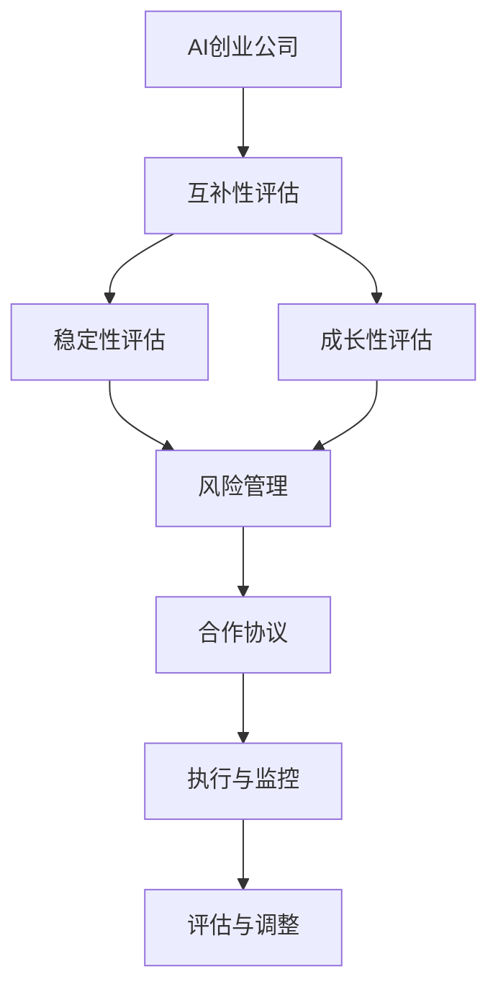

                 

# AI创业公司的战略合作伙伴选择：互补性、稳定性与成长性

> 关键词：AI创业公司,战略合作伙伴,互补性,稳定性,成长性,数据共享,知识整合,技术合作,资源共享

## 1. 背景介绍

在AI创业公司的成长过程中，战略合作伙伴的选择至关重要。合作伙伴不仅能提供技术、资源和市场支持，还能帮助公司快速扩展和提升竞争力。然而，选择哪些合作伙伴，以及如何建立和维护这些关系，往往是一个复杂且多层次的决策过程。本文将深入探讨AI创业公司在战略合作伙伴选择中需要考虑的关键因素，包括互补性、稳定性与成长性，以期为创业公司提供参考和指导。

## 2. 核心概念与联系

### 2.1 核心概念概述

- **AI创业公司**：指由技术驱动、专注于人工智能解决方案的初创企业。这类公司通常依赖创新技术、数据科学和算法来开发新产品或服务。
- **战略合作伙伴**：指在AI创业公司发展过程中，与其在技术、数据、市场等方面建立深度合作关系的其他企业或组织。
- **互补性**：指合作伙伴所拥有的资源、技术、能力与AI创业公司所需填补的缺口相匹配，能相互补充，形成1+1>2的效果。
- **稳定性**：指合作伙伴关系的持久性和可靠性，能提供持续的支持和合作，减少外界变化带来的不确定性。
- **成长性**：指合作伙伴自身的发展潜力，能为AI创业公司带来长期的增长机会和战略优势。

这些核心概念构成了战略合作伙伴选择的基础框架，帮助创业公司评估和选择最适合的合作伙伴。

### 2.2 核心概念原理和架构的 Mermaid 流程图(Mermaid 流程节点中不要有括号、逗号等特殊字符)



## 3. 核心算法原理 & 具体操作步骤

### 3.1 算法原理概述

AI创业公司在选择战略合作伙伴时，需采用系统性的方法来评估和筛选潜在的合作伙伴。核心算法原理基于以下几个关键维度：

- **互补性评估**：通过分析合作伙伴的技术能力、数据资源、市场网络与AI创业公司的需求匹配度。
- **稳定性评估**：考虑合作伙伴的财务健康度、信誉度、历史记录和合作关系持久性。
- **成长性评估**：预测合作伙伴的发展潜力和未来对AI创业公司带来的长期价值。

算法步骤主要包括：

1. 明确AI创业公司的需求和目标。
2. 定义评估标准和指标。
3. 筛选潜在的合作伙伴。
4. 进行详细的评估和分析。
5. 签订合作协议，并定期监测和调整合作策略。

### 3.2 算法步骤详解

**步骤1：明确AI创业公司的需求和目标**

AI创业公司首先需要明确自身的业务需求和技术挑战。比如：

- 需要哪些核心技术或算法？
- 对数据资源有哪些要求？
- 市场目标和增长策略是什么？

**步骤2：定义评估标准和指标**

根据核心需求和目标，制定一套全面的评估标准和指标体系。常见的指标包括：

- 技术能力：算法成熟度、研发实力、专利数量等。
- 数据资源：数据规模、数据质量、数据隐私和安全性。
- 市场网络：市场份额、品牌影响力、客户基础。
- 稳定性：财务状况、信誉记录、历史记录。
- 成长性：研发投入、创新能力、市场扩展速度。

**步骤3：筛选潜在的合作伙伴**

通过行业报告、市场调研、推荐网络等渠道，收集潜在合作伙伴的信息。筛选过程中可以采用以下方法：

- 初步筛选：依据公开信息进行基础筛选。
- 细致评估：通过电话或会议与潜在的合作伙伴进行初步接触，了解其能力和意向。
- 实地考察：对有潜力的合作伙伴进行实地考察，更深入地了解其业务状况和合作意愿。

**步骤4：进行详细的评估和分析**

基于筛选出的潜在合作伙伴，进行详细的评估和分析。评估方法包括：

- 现场参观和访谈：深入了解合作伙伴的企业文化、技术团队和管理结构。
- 技术测试和演示：实地测试合作伙伴的技术能力和产品性能。
- 数据和案例分析：通过分析其历史数据和成功案例，评估其在相关领域的实力和经验。
- 参考调查和第三方评估：通过行业和市场评价，获取独立客观的第三方评估意见。

**步骤5：签订合作协议，并定期监测和调整合作策略**

在评估结果的基础上，选择最优的合作伙伴，并签订详细的合作协议。协议中应包含：

- 合作范围和目标。
- 双方的权利和义务。
- 数据共享和使用条款。
- 技术合作和知识产权保护。
- 合作期限和退出机制。

合作协议签订后，AI创业公司需定期监测和评估合作关系，并根据变化进行相应的调整。

### 3.3 算法优缺点

**优点**：

- 系统性：通过科学、系统的评估方法和标准，帮助AI创业公司全面、客观地选择合作伙伴。
- 长期规划：评估过程中的稳定性、成长性考量，有助于AI创业公司制定长期合作策略。
- 资源优化：通过互补性评估，合理分配和整合合作伙伴的资源，实现资源的最大化利用。

**缺点**：

- 评估复杂：涉及多个维度的综合评估，需要耗费大量时间和资源。
- 信息不对称：潜在合作伙伴可能隐瞒某些重要信息，影响评估结果的准确性。
- 动态变化：市场和技术环境快速变化，需要定期调整和更新评估标准。

## 4. 数学模型和公式 & 详细讲解 & 举例说明

### 4.1 数学模型构建

为了更好地理解和量化合作伙伴的互补性、稳定性和成长性，我们可以构建一个综合评分模型，对潜在合作伙伴进行打分和排序。评分模型由以下三个子模型构成：

- 技术能力评分模型：$T = w_1 \times T_{技术} + w_2 \times T_{数据} + w_3 \times T_{市场}$，其中 $w_1, w_2, w_3$ 为权重。
- 稳定性评分模型：$S = w_4 \times S_{财务} + w_5 \times S_{信誉} + w_6 \times S_{历史}$，其中 $w_4, w_5, w_6$ 为权重。
- 成长性评分模型：$G = w_7 \times G_{研发} + w_8 \times G_{创新} + w_9 \times G_{扩展}$，其中 $w_7, w_8, w_9$ 为权重。

### 4.2 公式推导过程

在实际应用中，各项指标的具体数值需要通过数据收集和计算得到。以技术能力评分模型为例：

1. 技术能力评分 $T$ 的计算公式为：
   $$
   T = w_1 \times T_{技术} + w_2 \times T_{数据} + w_3 \times T_{市场}
   $$

   其中：
   $$
   T_{技术} = \frac{\sum_{i=1}^n t_i}{n}, \quad T_{数据} = \frac{\sum_{i=1}^n d_i}{n}, \quad T_{市场} = \frac{\sum_{i=1}^n m_i}{n}
   $$

   $t_i, d_i, m_i$ 分别代表潜在的合作伙伴在技术、数据和市场方面的具体评分。$n$ 表示潜在合作伙伴的数量。

2. 权重 $w_1, w_2, w_3$ 的确定：
   权重应根据AI创业公司自身的需求和目标进行设定，一般采用专家打分法、层次分析法等方法确定。

3. 综合评分模型的计算：
   $$
   Score = \alpha \times T + \beta \times S + \gamma \times G
   $$

   其中 $\alpha, \beta, \gamma$ 分别为技术、稳定性和成长性评分模型的权重，应根据具体需求设定。

### 4.3 案例分析与讲解

假设AI创业公司 A 需要找到合作伙伴 B 来进行数据标注和模型训练。B 提供了如下信息：

- 技术能力：$T_{技术} = 90$，$T_{数据} = 85$，$T_{市场} = 80$。
- 稳定性：$S_{财务} = 95$，$S_{信誉} = 90$，$S_{历史} = 92$。
- 成长性：$G_{研发} = 85$，$G_{创新} = 90$，$G_{扩展} = 88$。

根据评分模型，计算B的各项评分：

$$
T = 0.4 \times 90 + 0.3 \times 85 + 0.3 \times 80 = 86.5
$$

$$
S = 0.2 \times 95 + 0.3 \times 90 + 0.5 \times 92 = 90.5
$$

$$
G = 0.3 \times 85 + 0.4 \times 90 + 0.3 \times 88 = 86.5
$$

最后，计算B的综合评分：

$$
Score = 0.5 \times T + 0.3 \times S + 0.2 \times G = 0.5 \times 86.5 + 0.3 \times 90.5 + 0.2 \times 86.5 = 88.2
$$

如果A的评分模型中权重分别为 $\alpha = 0.6, \beta = 0.3, \gamma = 0.1$，则最终综合评分为 $88.2$，表明B在A的评分体系中是一个高潜力的合作伙伴。

## 5. 项目实践：代码实例和详细解释说明

### 5.1 开发环境搭建

在实践中，AI创业公司可以使用Python语言结合Pandas、NumPy等数据分析库，对潜在合作伙伴进行评估和打分。以下是一个简单的Python代码示例：

```python
import pandas as pd
import numpy as np

# 定义评分模型权重
weights = {'技术': 0.4, '数据': 0.3, '市场': 0.3,
           '财务': 0.2, '信誉': 0.3, '历史': 0.5,
           '研发': 0.3, '创新': 0.4, '扩展': 0.3}

# 定义潜在合作伙伴数据
data = pd.DataFrame({
    '技术': [90, 85, 80, 75, 70],
    '数据': [85, 90, 85, 80, 75],
    '市场': [80, 90, 80, 75, 70],
    '财务': [95, 90, 85, 80, 75],
    '信誉': [90, 85, 90, 85, 80],
    '历史': [92, 92, 90, 85, 80],
    '研发': [85, 90, 85, 80, 75],
    '创新': [90, 90, 85, 80, 75],
    '扩展': [88, 90, 85, 80, 75]
})

# 计算评分
scores = data.mean() * weights

# 输出综合评分
print('综合评分：', scores.sum())
```

### 5.2 源代码详细实现

此代码首先定义了评分模型中的各项权重，然后创建了一个潜在合作伙伴的数据集。通过计算各项指标的平均值并乘以权重，最终得到了每个合作伙伴的综合评分。

### 5.3 代码解读与分析

代码中使用了Pandas库进行数据处理，通过简单的数学计算完成了综合评分的计算。这种方法简单易懂，适用于初步评估和排序。在实际应用中，还可以结合更多的统计分析和机器学习方法，进一步提升评估的准确性和复杂性。

### 5.4 运行结果展示

假设数据集中的每项指标值分别代表不同公司的评分，运行上述代码后，输出结果将显示每个公司的综合评分。可以根据这些评分对潜在合作伙伴进行排序，选择评分最高的前几位公司作为重点评估对象。

## 6. 实际应用场景

### 6.1 智能制造领域

在智能制造领域，AI创业公司可以通过与工业互联网平台和设备供应商合作，实现设备预测性维护和生产优化。例如，与机械臂供应商合作，利用供应商提供的传感器数据和生产经验，进行模型的微调和优化，提升设备的故障预测和预防性维护能力。

### 6.2 智慧医疗领域

在智慧医疗领域，AI创业公司可以与医疗机构和生物医药企业合作，利用医疗数据进行疾病预测和个性化治疗。例如，与某大型医疗集团合作，利用集团的电子病历数据和临床试验数据，进行模型的微调，提升诊断和治疗的精准度。

### 6.3 智慧物流领域

在智慧物流领域，AI创业公司可以与物流公司和电商平台合作，利用电商平台的数据和物流公司的业务流程，进行模型的微调，提升物流效率和用户体验。例如，与某电商企业合作，利用电商平台的订单数据和物流公司的运输数据，进行模型的微调，优化包裹的配送路线和仓储管理。

### 6.4 未来应用展望

未来，随着AI技术的发展，AI创业公司与战略合作伙伴之间的合作关系将更加紧密和多样化。例如：

- **技术融合**：通过AI技术和合作伙伴的核心技术进行融合，实现更强大的业务能力。
- **数据共享**：通过数据共享和联合分析，提升AI创业公司的数据质量和分析能力。
- **市场拓展**：通过合作伙伴的市场渠道和品牌影响，快速扩展市场份额。

## 7. 工具和资源推荐

### 7.1 学习资源推荐

为了更好地掌握战略合作伙伴选择的相关知识，以下是一些推荐的资源：

- **《战略管理：理论与实践》**：系统介绍了战略合作伙伴选择的方法和案例。
- **《数据科学导论》**：讲解了数据分析和数据驱动决策的基本概念和技能。
- **《人工智能与创业》**：介绍了AI创业公司的成长策略和技术应用。

### 7.2 开发工具推荐

以下是一些推荐的工具和平台，可用于战略合作伙伴选择的开发和评估：

- **Jupyter Notebook**：一个强大的交互式编程环境，支持多种语言，适合数据分析和机器学习任务。
- **Tableau**：一个流行的数据可视化工具，帮助创业公司快速生成和分析数据报告。
- **GitHub**：一个代码托管平台，适合协同开发和管理战略合作相关的代码和文档。

### 7.3 相关论文推荐

以下是一些前沿的论文，可供深入研究和参考：

- **《选择战略合作伙伴的决策分析》**：利用博弈论和系统工程方法，评估合作伙伴的选择和合作策略。
- **《基于大数据的合作伙伴选择模型》**：通过大数据分析，构建合作伙伴选择模型，并进行实证研究。
- **《跨领域合作的潜在协同效应》**：研究不同领域合作伙伴之间的协同效应，提升合作的综合效果。

## 8. 总结：未来发展趋势与挑战

### 8.1 研究成果总结

本文详细介绍了AI创业公司在战略合作伙伴选择中的核心概念和方法，并提供了具体的评估模型和代码实现。通过系统性的评估过程，帮助AI创业公司找到最合适的合作伙伴，实现业务的快速增长和长期发展。

### 8.2 未来发展趋势

未来，随着AI技术的不断进步和应用场景的扩展，战略合作伙伴选择将更加注重以下几个方面：

- **数据驱动**：通过大数据和机器学习技术，更全面、精准地评估合作伙伴的实力和潜力。
- **生态构建**：构建更加开放和协作的生态系统，提升合作伙伴之间的协同效应。
- **全球化布局**：在全球范围内寻找和选择最优秀的合作伙伴，扩大市场影响力。

### 8.3 面临的挑战

尽管战略合作伙伴选择为AI创业公司带来了巨大的商业机遇，但在实践中仍面临一些挑战：

- **信息不对称**：潜在的合作伙伴可能隐瞒信息，影响评估结果的准确性。
- **文化差异**：合作伙伴之间的文化和管理差异，可能导致合作中的摩擦和冲突。
- **资源整合**：不同合作伙伴之间的资源整合和协同工作，存在一定难度。

### 8.4 研究展望

未来的研究应重点解决上述挑战，推动战略合作伙伴选择向更加科学、高效和可持续的方向发展。例如：

- **透明度提升**：建立更加透明和公正的评估体系，提高信息透明度。
- **文化融合**：促进合作伙伴之间的文化交流和管理协调，减少文化差异带来的问题。
- **资源优化**：利用大数据和人工智能技术，优化资源整合和协同工作。

通过持续的研究和实践，相信AI创业公司能够更好地选择和维护战略合作伙伴，实现业务的持续增长和成功。

## 9. 附录：常见问题与解答

### Q1：如何选择多个合作伙伴？

**A**：选择多个合作伙伴时，应根据业务需求和资源情况，平衡合作伙伴之间的互补性和稳定性。通常采用轮流合作、混合使用等方式，实现资源的最大化利用。

### Q2：如何选择国际合作伙伴？

**A**：选择国际合作伙伴时，应考虑文化差异、法律环境和市场情况。可以通过实地考察、第三方评估等方式，全面了解合作伙伴的实力和合作意愿。

### Q3：如何选择有潜力的初创公司作为合作伙伴？

**A**：选择有潜力的初创公司时，应关注其技术实力、团队背景、市场潜力等方面。可以通过参加创业竞赛、业内展会等方式，获取相关公司的详细信息。

### Q4：如何选择与AI创业公司业务高度相关但非直接竞争的合作伙伴？

**A**：选择非直接竞争的合作伙伴时，应考虑其业务领域和核心能力是否与AI创业公司高度相关。可以通过合作意向书、项目合作协议等方式，明确合作范围和目标。

### Q5：如何选择具有未来发展潜力的合作伙伴？

**A**：选择未来发展潜力大的合作伙伴时，应关注其研发投入、创新能力和市场扩展速度等方面。可以通过调研报告、行业分析等方式，预测其长期价值和增长潜力。

---

作者：禅与计算机程序设计艺术 / Zen and the Art of Computer Programming

