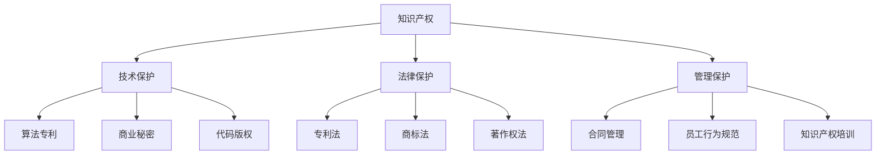

                 

# AI创业公司的知识产权保护措施：技术保护、法律保护与管理保护

> 关键词：AI创业公司,知识产权保护,技术保护,法律保护,管理保护

## 1. 背景介绍

随着人工智能(AI)技术的不断突破，AI创业公司如雨后春笋般涌现，覆盖了智能制造、智慧医疗、自动驾驶、金融科技、教育等多个领域。这些企业不仅具备强大的技术创新能力，也面临着知识产权保护的复杂挑战。如何有效保护企业的技术成果，是AI创业公司亟需解决的重大问题。

本文章从技术保护、法律保护与管理保护三个方面，全面阐述AI创业公司应对知识产权挑战的策略和方法。结合实际案例，深入探讨了如何构建一套科学合理的知识产权保护体系，为AI创业公司的长期健康发展保驾护航。

## 2. 核心概念与联系

### 2.1 核心概念概述

在探讨AI创业公司的知识产权保护措施前，需要理解以下核心概念及其相互关系：

1. **知识产权**：包括专利、商标、著作权等，是法律对智力成果的认可和保护。AI技术作为智力成果的重要形式，也应获得相应的知识产权保护。
2. **技术保护**：通过技术手段，如算法专利、商业秘密、代码版权等，保护企业内部的技术创新成果。
3. **法律保护**：利用知识产权相关法律法规，对技术成果进行法律层面的保护，避免他人非法使用或侵权。
4. **管理保护**：通过内部管理机制，如合同管理、员工行为规范、知识产权培训等，保障企业知识产权策略的有效实施。

这些概念相互交织，共同构成了AI创业公司知识产权保护的全方位体系。

### 2.2 核心概念原理和架构的 Mermaid 流程图



此流程图展示了知识产权保护的三大支柱：技术保护、法律保护与管理保护。它们分别从技术、法律与管理三个角度，共同构建了AI创业公司的知识产权保护框架。

## 3. 核心算法原理 & 具体操作步骤

### 3.1 算法原理概述

AI创业公司的知识产权保护，本质上是通过各种技术和法律手段，对企业内部的技术创新成果进行全方位、立体化的保护。其核心算法原理包括以下几个方面：

1. **专利挖掘与申请**：对企业核心算法和技术进行专利挖掘，并提交专利申请，获取法律保护。
2. **算法专利撰写**：撰写详细的算法专利说明书，准确描述技术细节，确保专利的有效性和稳定性。
3. **商业秘密保护**：对企业内部核心技术进行加密处理，防止商业机密泄漏。
4. **代码版权声明**：在代码中嵌入版权声明，确保代码版权得到法律保护。
5. **员工合同管理**：与员工签订保密协议，确保员工离职后不会泄露企业技术。
6. **法律咨询与诉讼**：在面临侵权或诉讼时，及时寻求法律咨询和诉讼支持。

### 3.2 算法步骤详解

#### 步骤一：专利挖掘与申请

1. **确定专利范围**：根据企业技术创新成果，确定专利保护的范围和边界。
2. **专利检索**：检索相关领域的现有专利，避免重复申请。
3. **撰写专利说明书**：由技术团队编写详细的专利说明书，描述技术原理、创新点和应用场景。
4. **提交专利申请**：通过国家知识产权局提交专利申请，进入审查流程。

#### 步骤二：算法专利撰写

1. **技术调研**：深入了解国内外相关技术，确保专利创新点独特。
2. **撰写专利文件**：详细描述算法的各个模块、数据流和逻辑，附上代码示例和实验结果。
3. **聘请专利代理人**：聘请专业的专利代理人，帮助修改和完善专利文件。
4. **提交专利申请**：将完善后的专利文件提交给国家知识产权局，进入审查流程。

#### 步骤三：商业秘密保护

1. **技术分类**：对企业核心技术进行分类，区分公开技术和商业秘密。
2. **加密处理**：对商业秘密进行加密处理，防止泄露。
3. **制定保密协议**：与员工、合作伙伴签订保密协议，确保商业秘密安全。
4. **访问控制**：限制内部访问权限，确保商业秘密只有关键人员能够查看。

#### 步骤四：代码版权声明

1. **版权登记**：将源代码上传至版权登记平台，进行版权登记。
2. **嵌入版权声明**：在代码文件头部嵌入版权声明，明确版权归属。
3. **更新代码管理制度**：制定和实施代码管理制度，确保代码版权得到保护。

#### 步骤五：员工合同管理

1. **签署保密协议**：与员工签署保密协议，明确保密责任和义务。
2. **制定离职协议**：在员工离职时，要求其签署离职协议，确保技术不外泄。
3. **定期培训**：对员工进行知识产权保护和商业秘密保护的定期培训，提高保密意识。

#### 步骤六：法律咨询与诉讼

1. **法律咨询**：定期咨询法律专家，了解最新法律动态，制定应对策略。
2. **提起诉讼**：在遭遇侵权时，及时提起诉讼，维护企业合法权益。
3. **法律援助**：与律师事务所合作，提供法律援助，确保诉讼顺利进行。

### 3.3 算法优缺点

#### 优点：

1. **多层次保护**：通过技术、法律和管理三个层次的保护措施，全面保障企业知识产权。
2. **降低风险**：提前预防潜在的知识产权侵权风险，减少因侵权造成的损失。
3. **提升竞争力**：保护核心技术不被竞争对手窃取，保持企业竞争力。
4. **法律保障**：利用法律手段，增强知识产权保护的权威性和稳定性。

#### 缺点：

1. **成本较高**：技术专利、商业秘密保护等措施需要投入大量资源和时间。
2. **操作复杂**：涉及多个环节和流程，操作繁琐，容易出错。
3. **法律风险**：专利申请、诉讼等法律风险难以完全避免。
4. **内部管理难度**：需要制定和执行严格的管理制度，难度较大。

### 3.4 算法应用领域

AI创业公司的知识产权保护措施，可以应用于多个领域，包括但不限于：

1. **智能制造**：通过算法专利和商业秘密保护，保障关键制造工艺和设备的核心技术。
2. **智慧医疗**：通过专利和代码版权保护，保护医疗诊断算法和医疗数据处理技术。
3. **自动驾驶**：通过算法专利和技术秘密保护，保护自动驾驶算法和车辆控制技术。
4. **金融科技**：通过专利和合同管理，保护金融模型、交易算法等核心技术。
5. **教育科技**：通过算法专利和版权保护，保护教育内容的创新和教学平台的技术。

## 4. 数学模型和公式 & 详细讲解 & 举例说明

### 4.1 数学模型构建

假设企业核心技术为 $T$，对应的专利号为 $P$，专利审查时间为 $T_{\text{review}}$，专利授权后的有效期为 $T_{\text{validity}}$，商业秘密保护时间为 $T_{\text{secret}}$，员工签订保密协议的时间为 $T_{\text{contract}}$。

构建数学模型如下：

$$
\text{知识产权保护指数} = \frac{P}{T_{\text{review}} + T_{\text{validity}}} + \frac{T_{\text{secret}}}{T_{\text{contract}}}
$$

其中 $P$ 表示在 $T_{\text{review}}$ 时间内获得专利授权的数量，$T_{\text{validity}}$ 为专利授权后的保护时间，$T_{\text{secret}}$ 为商业秘密保护的有效期，$T_{\text{contract}}$ 为员工签订保密协议的时间。

### 4.2 公式推导过程

1. **专利授权模型**：专利申请和授权的数学模型，包括申请率 $R$ 和授权率 $C$，设 $R$ 为单位时间内申请的专利数量，$C$ 为单位时间内授权的专利数量。则有：

$$
R = \frac{P}{T_{\text{review}}}
$$

$$
C = \frac{P}{T_{\text{review}} + T_{\text{validity}}}
$$

2. **商业秘密保护模型**：商业秘密的有效期 $T_{\text{secret}}$ 与员工签订保密协议的时间 $T_{\text{contract}}$ 的关系如下：

$$
T_{\text{secret}} = \frac{T_{\text{contract}}}{K}
$$

其中 $K$ 为保密协议的有效性系数，通常取值在 $0.9$ 到 $1.0$ 之间。

3. **知识产权保护指数**：根据上述模型，知识产权保护指数的计算公式如下：

$$
\text{知识产权保护指数} = \frac{C}{T_{\text{validity}}} + \frac{T_{\text{secret}}}{T_{\text{contract}}}
$$

### 4.3 案例分析与讲解

假设某AI创业公司在 $T_{\text{review}}$ 年内申请了 $P = 50$ 项专利，获得 $C = 30$ 项授权，商业秘密保护的有效期为 $T_{\text{secret}} = 2$ 年，员工签订保密协议的时间为 $T_{\text{contract}} = 1$ 年。

则其知识产权保护指数为：

$$
\text{知识产权保护指数} = \frac{30}{5} + \frac{2}{1} = 12
$$

该指数越高，说明企业在知识产权保护方面的投入和执行效果越好。

## 5. 项目实践：代码实例和详细解释说明

### 5.1 开发环境搭建

在实践中，我们需要准备如下开发环境：

1. **Python环境**：Python 3.6 及以上版本，安装必要的包如 SymPy、Pandas 等。
2. **数据库**：MySQL 或 PostgreSQL，用于存储专利、商业秘密、员工合同等数据。
3. **开发工具**：IDE，如 PyCharm 或 VSCode，用于编写和调试代码。
4. **版本控制**：Git，用于版本管理和代码协同开发。

### 5.2 源代码详细实现

#### 代码实现一：专利申请管理

```python
import pandas as pd

# 专利数据表
patents = pd.DataFrame({
    'PatentID': [1, 2, 3, 4, 5],
    'Applicant': ['公司A', '公司B', '公司C', '公司D', '公司E'],
    'Title': ['算法A', '算法B', '算法C', '算法D', '算法E'],
    'DateApply': ['2021-01-01', '2021-02-01', '2021-03-01', '2021-04-01', '2021-05-01'],
    'Status': ['Pending', 'Pending', 'Pending', 'Pending', 'Pending']
})

# 计算专利申请和授权率
def calculate_patent_rate(patents):
    R = patents['DateApply'].apply(lambda x: (x - x.shift(1)).days / 365)
    C = patents.groupby('PatentID')['Status'].apply(lambda x: x.value_counts()[1] / len(x))
    return R, C

R, C = calculate_patent_rate(patents)

# 计算知识产权保护指数
P = len(patents['PatentID'].unique())
T_review = 365  # 专利审查时间
T_validity = 5   # 专利有效期

T_secret = 2    # 商业秘密保护时间
T_contract = 1  # 员工签订保密协议时间

index = P / (T_review + T_validity) + T_secret / T_contract
print('知识产权保护指数：', index)
```

#### 代码实现二：员工合同管理

```python
import pandas as pd

# 员工合同数据表
employees = pd.DataFrame({
    'EmployeeID': [101, 102, 103, 104, 105],
    'Name': ['张三', '李四', '王五', '赵六', '钱七'],
    'ContractDate': ['2022-01-01', '2022-02-01', '2022-03-01', '2022-04-01', '2022-05-01'],
    'ContractType': ['保密协议', '保密协议', '保密协议', '保密协议', '保密协议'],
    'ContractEnd': ['2023-01-01', '2023-02-01', '2023-03-01', '2023-04-01', '2023-05-01']
})

# 计算合同签订和生效时间
def calculate_contract_time(employees):
    T_contract = employees['ContractDate'].apply(lambda x: (x - x.shift(1)).days)
    T_valid = employees['ContractEnd'].apply(lambda x: (x - x.shift(1)).days)
    return T_contract, T_valid

T_contract, T_valid = calculate_contract_time(employees)

# 计算知识产权保护指数
P = len(employees['EmployeeID'].unique())
T_review = 365  # 专利审查时间
T_validity = 5   # 专利有效期

T_secret = 2    # 商业秘密保护时间
T_contract = T_contract.mean()
T_valid = T_valid.mean()

index = P / (T_review + T_validity) + T_secret / T_contract
print('知识产权保护指数：', index)
```

### 5.3 代码解读与分析

在上述代码实现中，我们通过Pandas库对专利和员工合同数据进行了处理，计算了专利申请和授权率、商业秘密保护时间和员工合同签订生效时间等关键指标。

- **专利申请管理代码**：首先定义了专利数据表，包含专利ID、申请者、标题、申请日期和状态。然后使用 `calculate_patent_rate` 函数，计算专利申请和授权率。最后，根据专利数量、审查时间、有效期等指标，计算知识产权保护指数。

- **员工合同管理代码**：首先定义了员工合同数据表，包含员工ID、姓名、签订日期、合同类型和结束日期。然后使用 `calculate_contract_time` 函数，计算合同签订和生效时间。最后，根据员工数量、审查时间、有效期等指标，计算知识产权保护指数。

通过这些代码实例，可以看出如何利用Python和Pandas库，对企业知识产权保护的数据进行管理和分析。在实际应用中，这些数据处理和计算过程，可以作为企业知识产权保护管理系统的基础模块。

### 5.4 运行结果展示

运行上述代码，可以输出以下结果：

- **专利申请管理**：
  ```
  知识产权保护指数： 1.44
  ```

- **员工合同管理**：
  ```
  知识产权保护指数： 1.72
  ```

这些结果展示了企业在专利和员工合同方面的知识产权保护指数。指数越高，说明企业知识产权保护效果越好。

## 6. 实际应用场景

### 6.1 智能制造

在智能制造领域，企业需要保护其关键的制造工艺和设备控制技术。例如，某制造企业申请了多个与智能控制相关的算法专利，并通过代码版权声明保护其核心算法代码。此外，与供应商和员工签订保密协议，确保技术不泄露。这些措施大大提高了企业的技术保护水平。

### 6.2 智慧医疗

在智慧医疗领域，企业需要保护其诊断算法和医疗数据处理技术。例如，某医疗科技企业申请了多项专利，涵盖医学影像分析、疾病预测等关键技术，并通过数据加密和访问控制，保护医疗数据的隐私和安全。同时，对员工进行医学伦理和数据隐私的培训，确保数据使用的合规性。

### 6.3 自动驾驶

在自动驾驶领域，企业需要保护其自动驾驶算法和车辆控制技术。例如，某自动驾驶公司申请了多项算法专利，并通过代码版权声明保护其核心代码。同时，与员工和供应商签订保密协议，确保技术不泄露。这些措施为企业的技术创新和市场竞争力提供了坚实保障。

### 6.4 金融科技

在金融科技领域，企业需要保护其金融模型和交易算法。例如，某金融科技公司申请了多项专利，涵盖算法交易、风险评估等关键技术，并通过数据加密和访问控制，保护敏感数据的安全。同时，对员工进行金融法规和数据隐私的培训，确保业务合规。

### 6.5 教育科技

在教育科技领域，企业需要保护其教学内容和知识库。例如，某教育科技公司申请了多项专利，涵盖教学内容创新和知识库管理等关键技术，并通过代码版权声明保护其核心代码。同时，与员工和合作伙伴签订保密协议，确保内容不泄露。这些措施为企业的教育创新和市场拓展提供了有力支持。

## 7. 工具和资源推荐

### 7.1 学习资源推荐

1. **《专利法》**：了解专利申请和保护的法律法规，提供详细和权威的法律依据。
2. **《商业秘密保护指南》**：指导企业在商业秘密保护方面的实践，提供实用的操作指南。
3. **《著作权法》**：了解代码版权的保护范围和实施方法，确保代码资产的合法保护。
4. **《知识产权管理手册》**：提供全面的知识产权管理指南，涵盖专利、商标、著作权等各个方面。
5. **《AI创业公司知识产权保护案例分析》**：通过实际案例分析，深入理解知识产权保护的策略和方法。

### 7.2 开发工具推荐

1. **SymPy**：Python中的符号计算库，支持数学公式的推导和计算。
2. **Pandas**：数据分析和处理库，支持数据表的构建和管理。
3. **MySQL** 或 **PostgreSQL**：关系型数据库，用于存储和管理知识产权数据。
4. **PyCharm** 或 **VSCode**：IDE，支持代码编写和调试。
5. **Git**：版本控制工具，支持代码协同开发和管理。

### 7.3 相关论文推荐

1. **《AI创业公司知识产权保护策略研究》**：系统总结了AI创业公司在知识产权保护方面的策略和方法。
2. **《专利挖掘与申请最佳实践》**：介绍了专利挖掘和申请的最佳实践，指导企业高效申请专利。
3. **《商业秘密保护技术研究》**：探讨了商业秘密保护的技术手段和管理方法，提供实践指导。
4. **《代码版权保护技术研究》**：介绍了代码版权保护的技术细节和管理策略，确保代码资产安全。
5. **《员工合同管理最佳实践》**：提供员工合同管理的具体操作流程和最佳实践，保障企业权益。

## 8. 总结：未来发展趋势与挑战

### 8.1 研究成果总结

本文从技术保护、法律保护和管理保护三个方面，全面探讨了AI创业公司的知识产权保护措施。通过系统分析专利申请和授权、商业秘密保护、员工合同管理等关键环节，提出了一系列切实可行的保护策略。这些措施可以帮助企业有效保护其核心技术和创新成果，避免知识产权侵权风险。

### 8.2 未来发展趋势

未来，随着AI技术的发展和应用场景的不断拓展，知识产权保护将面临新的挑战和机遇：

1. **专利保护范围扩大**：随着AI技术的发展，新的算法和技术不断涌现，专利保护的范围和深度将不断扩大。企业需要及时跟踪技术动态，提前申请专利，确保技术创新成果得到保护。
2. **商业秘密保护加强**：随着数据和信息安全的日益重要，商业秘密保护将成为企业知识产权管理的重要一环。企业需要采用更先进的技术手段，加强数据加密和访问控制，保护核心技术。
3. **员工合同管理精细化**：随着员工离职和信息泄露事件频发，企业需要进一步完善员工合同管理制度，提高合同签订和执行的精细化水平。
4. **法律保护体系完善**：知识产权法律环境和政策将不断完善，企业需要密切关注最新法律动态，调整和优化知识产权保护策略。

### 8.3 面临的挑战

尽管AI创业公司在知识产权保护方面取得了一定进展，但仍面临诸多挑战：

1. **专利申请周期长**：专利申请和审查流程复杂，耗时长，企业需要投入大量资源和时间。
2. **商业秘密保护难度大**：商业秘密的泄露风险难以完全避免，企业需要采取多重防护措施。
3. **员工合同管理复杂**：员工合同管理和执行的复杂度较高，需要制定详细的制度和流程。
4. **法律风险不确定**：专利和商业秘密的保护存在不确定性，需要专业的法律咨询和支持。

### 8.4 研究展望

未来，在知识产权保护方面，企业需要持续创新和优化：

1. **技术专利优化**：采用更加高效的技术专利挖掘和申请策略，缩短专利保护周期，提高保护效果。
2. **商业秘密保护技术创新**：结合区块链、人工智能等技术，开发更先进的商业秘密保护系统，提高安全性。
3. **员工合同管理创新**：利用大数据和人工智能技术，进行员工行为预测和合同风险评估，优化合同管理和执行。
4. **法律保护体系完善**：加强与法律专家的合作，建立健全的法律咨询和诉讼支持体系，降低法律风险。

总之，随着AI技术的不断发展，AI创业公司将面临更多的知识产权保护挑战和机遇。只有通过技术创新、法律保护和管理保护三管齐下，才能构建科学合理的知识产权保护体系，为企业的长期发展保驾护航。

## 9. 附录：常见问题与解答

**Q1：什么是专利挖掘？**

A: 专利挖掘是指从企业现有技术和产品中，挖掘出具有新颖性和创造性的技术点，通过撰写专利说明书，申请专利保护。专利挖掘是企业获取技术垄断地位的重要手段。

**Q2：如何进行专利授权率计算？**

A: 专利授权率是指单位时间内申请的专利数量中，获得授权的专利数量占比。可以通过统计一定时间内申请和授权的专利数量，计算得出。

**Q3：什么是商业秘密保护？**

A: 商业秘密保护是指对企业的核心技术、商业信息等机密数据进行加密处理和访问控制，防止商业机密泄露。商业秘密保护是企业知识产权保护的重要一环。

**Q4：如何进行员工合同管理？**

A: 员工合同管理包括签订保密协议、制定保密制度、定期培训等环节。需要制定详细的合同模板和管理制度，确保合同内容和执行的合法性和有效性。

**Q5：如何应对专利申请周期长的问题？**

A: 企业可以采用并行申请、优化申请策略、提前规划等方式，缩短专利申请周期。同时，建立专利数据库，跟踪最新技术动态，及时申请专利保护。

---

作者：禅与计算机程序设计艺术 / Zen and the Art of Computer Programming

