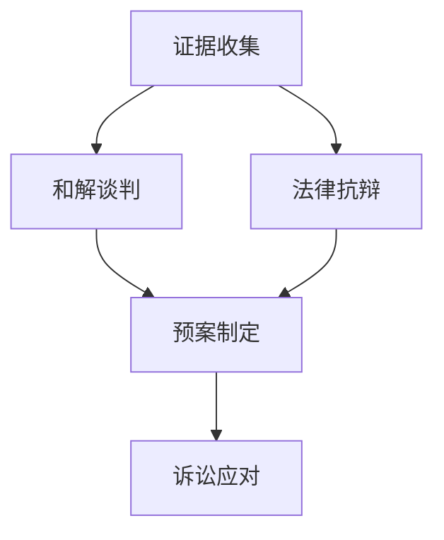

                 

## 1. 背景介绍

### 1.1 问题由来

在全球化和数字经济的大背景下，AI创业公司面临的知识产权诉讼风险日益严峻。专利侵权、版权纠纷、商业秘密泄露等知识产权问题，不仅直接威胁公司的生存和发展，还可能引发声誉损失和巨额赔偿。如何有效应对这些诉讼，成为AI创业公司的核心挑战之一。

### 1.2 问题核心关键点

针对知识产权诉讼的应对，需要构建一套系统的策略和方法，包括但不限于：

- **证据收集**：掌握充分有力的证据，是应对诉讼的基础。
- **法律抗辩**：根据证据和法律规定，提出有效的抗辩意见。
- **和解谈判**：通过谈判解决纠纷，避免旷日持久的诉讼消耗。
- **预案制定**：提前制定应对方案，降低诉讼风险。

本文将系统介绍AI创业公司在知识产权诉讼中应如何收集证据、提出抗辩以及和解谈判，以期帮助企业从容应对复杂的知识产权纠纷。

## 2. 核心概念与联系

### 2.1 核心概念概述

为更好地理解知识产权诉讼应对的策略，本节将介绍几个密切相关的核心概念：

- **证据收集(Evidence Collection)**：在诉讼过程中，通过多种途径获取事实依据，包括专利文献、程序源代码、邮件记录、第三方证据等。证据的质量和数量直接影响诉讼结果。

- **法律抗辩(Legal Defense)**：根据证据和相关法律条文，提出抗辩意见，证明己方的合法权益和对方的侵权行为。有效的抗辩能够显著提升胜诉率。

- **和解谈判(Negotiation and Settlement)**：通过调解、仲裁等途径，与对方就赔偿、侵权停止等问题达成一致，避免长时间的诉讼过程。和解是高效解决纠纷的重要手段。

- **预案制定(Preparedness and Strategy)**：提前制定应对方案，包括证据整理、法律咨询、谈判策略等，在诉讼中保持主动。预案是长期风险管理的基石。

这些概念之间的逻辑关系可以通过以下Mermaid流程图来展示：



这个流程图展示了一整套从证据收集到诉讼应对的完整流程，帮助企业系统地应对知识产权诉讼。

## 3. 核心算法原理 & 具体操作步骤
### 3.1 算法原理概述

AI创业公司在知识产权诉讼中的应对，本质上是一个信息收集、分析和判断的过程。其核心思想是：通过有效的证据收集和法律分析，提出有说服力的抗辩意见，并在必要时通过谈判解决纠纷。

在数学上，可以将其视为一个优化问题。假设诉讼过程中有多个证据 $E_i$ 和抗辩策略 $D$，目标是最大化胜诉概率 $\max_{E_i,D} P(\text{胜诉})$。这个优化问题的目标函数为：

$$
\max_{E_i,D} P(\text{胜诉}) = \sum_{E_i} P(E_i) \prod_{D} P(D|E_i)
$$

其中 $P(E_i)$ 为证据 $E_i$ 的概率分布，$P(D|E_i)$ 为在证据 $E_i$ 下，抗辩策略 $D$ 被采用的概率。

### 3.2 算法步骤详解

基于上述优化问题的框架，AI创业公司在应对知识产权诉讼时应遵循以下步骤：

**Step 1: 收集证据**

- **公开资料**：搜集专利文献、著作权登记信息、商标数据库等公开资料。这些资料可从各国知识产权局的官网获取。
- **内部文档**：整理公司内部的技术文档、程序源代码、项目记录、邮件往来等内部文档，作为防御证据。
- **第三方证据**：通过第三方平台获取使用证明、客户评价、市场数据等外部证据，证明产品的市场地位和合法使用情况。

**Step 2: 法律分析**

- **证据筛选**：根据诉讼主题，筛选出最相关的证据。例如，专利侵权诉讼中需要关注专利申请书、授权公告、专利纠纷历史等。
- **法律适用**：根据司法管辖地，明确适用的法律条款和判例。不同司法管辖地的法律规定可能不同，需要谨慎分析。
- **抗辩策略**：根据证据和法律条文，制定多套可能的抗辩策略，如优先权抗辩、不侵权抗辩、合理使用抗辩等。

**Step 3: 抗辩提出**

- **事实陈述**：详细描述证据的来源、内容、证明力等，说明己方立场。
- **法律依据**：引用相关法律条文，解释己方抗辩的合法性。
- **事实比对**：将证据与原告证据进行比对，找出差异和矛盾点。

**Step 4: 和解谈判**

- **谈判方案**：根据诉讼进展和证据质量，制定和解方案，包括赔偿金额、侵权停止条件等。
- **沟通渠道**：通过律师、调解员等第三方进行沟通，避免直接接触，降低对立情绪。
- **协议签订**：在达成一致后，签订和解协议，明确双方权利义务。

**Step 5: 预案制定**

- **风险评估**：定期进行风险评估，更新预案内容。考虑新出现的法律、技术和市场变化。
- **资源准备**：确保资源（包括人力、物力、财力）充足，及时响应诉讼需求。
- **培训演练**：对相关人员进行法律知识和技术培训，进行模拟演练，提升应对能力。

### 3.3 算法优缺点

基于证据收集、法律抗辩和和解谈判的策略，具有以下优点：

- **全面性**：覆盖证据收集、法律分析和抗辩策略的全过程，系统应对诉讼。
- **灵活性**：根据诉讼进展和证据变化，灵活调整策略，适应复杂多变的司法环境。
- **低成本**：通过谈判和解，避免长期诉讼的资源和时间消耗。

同时，也存在一定的局限性：

- **法律复杂性**：不同司法管辖地法律差异较大，需要专业律师团队支持。
- **证据依赖性**：诉讼结果高度依赖证据的质量和数量，获取证据的过程可能复杂耗时。
- **和解风险**：和解协议可能存在执行困难或后续纠纷的风险。

尽管存在这些局限，但就目前而言，基于证据收集、法律抗辩和和解谈判的策略仍是应对知识产权诉讼的最主流范式。未来相关研究的重点在于如何进一步降低诉讼成本，提高证据收集和法律分析的效率，同时兼顾和解协议的执行力。

### 3.4 算法应用领域

基于大语言模型微调的知识产权诉讼应对策略，在法律、技术和商业等多个领域中得到了广泛的应用，包括但不限于：

- **法律咨询**：通过自然语言处理技术，自动解答法律咨询，提升法律服务的效率和覆盖范围。
- **专利分析**：利用大语言模型对专利文献进行自动分类、摘要和关键词提取，加速专利搜索和分析过程。
- **商业谈判**：通过智能谈判系统，辅助进行商业谈判，减少沟通误解，提高谈判效率。
- **市场监控**：利用大语言模型对社交媒体、新闻报道等非结构化数据进行监控，及时发现潜在的知识产权纠纷。

除了上述这些经典应用外，大语言模型微调也被创新性地应用到更多场景中，如合同自动生成、知识产权定价、反垄断调查等，为知识产权管理提供了新的解决方案。随着大语言模型和微调方法的不断进步，相信知识产权管理技术将在更广泛的领域得到应用，提升企业的知识产权保护和运营能力。

## 4. 数学模型和公式 & 详细讲解  
### 4.1 数学模型构建

本节将使用数学语言对AI创业公司在知识产权诉讼中应对方案的优化问题进行更加严格的刻画。

假设诉讼过程中有多个证据 $E_i$ 和抗辩策略 $D$，目标是最大化胜诉概率 $\max_{E_i,D} P(\text{胜诉})$。

**Step 1: 证据收集**

证据 $E_i$ 的收集概率分布为 $P(E_i)$，具体为：

$$
P(E_i) = \begin{cases}
1 & \text{if } E_i \text{ collected} \\
0 & \text{otherwise}
\end{cases}
$$

**Step 2: 法律分析**

法律分析过程中，抗辩策略 $D$ 在证据 $E_i$ 下被采用的概率为 $P(D|E_i)$，具体为：

$$
P(D|E_i) = \begin{cases}
1 & \text{if } D \text{ valid given } E_i \\
0 & \text{otherwise}
\end{cases}
$$

**Step 3: 抗辩提出**

事实陈述的概率为 $P(S)$，法律依据的概率为 $P(L)$，事实比对的概率为 $P(C)$。具体为：

$$
P(S) = \begin{cases}
1 & \text{if } S \text{ presented} \\
0 & \text{otherwise}
\end{cases}
$$

$$
P(L) = \begin{cases}
1 & \text{if } L \text{ cited} \\
0 & \text{otherwise}
\end{cases}
$$

$$
P(C) = \begin{cases}
1 & \text{if } C \text{ compared} \\
0 & \text{otherwise}
\end{cases}
$$

**Step 4: 和解谈判**

和解谈判的成功概率为 $P(N)$，具体为：

$$
P(N) = \begin{cases}
1 & \text{if } N \text{ agreed} \\
0 & \text{otherwise}
\end{cases}
$$

**Step 5: 预案制定**

风险评估的概率为 $P(R)$，资源准备的概率为 $P(A)$，培训演练的概率为 $P(T)$。具体为：

$$
P(R) = \begin{cases}
1 & \text{if } R \text{ assessed} \\
0 & \text{otherwise}
\end{cases}
$$

$$
P(A) = \begin{cases}
1 & \text{if } A \text{ prepared} \\
0 & \text{otherwise}
\end{cases}
$$

$$
P(T) = \begin{cases}
1 & \text{if } T \text{ trained} \\
0 & \text{otherwise}
\end{cases}
$$

### 4.2 公式推导过程

基于上述模型，胜诉概率的优化问题可以表示为：

$$
\max_{E_i,D,S,L,C,N,R,A,T} P(\text{胜诉}) = \sum_{E_i} P(E_i) \prod_{D} P(D|E_i) \prod_{S} P(S) \prod_{L} P(L) \prod_{C} P(C) \prod_{N} P(N) \prod_{R} P(R) \prod_{A} P(A) \prod_{T} P(T)
$$

这个优化问题的求解可以通过多种方式实现，如穷举搜索、动态规划等。但在实践中，更常采用的方法是使用机器学习算法进行优化。例如，通过强化学习算法，模拟诉讼过程，动态调整证据收集、法律抗辩等策略，最大化胜诉概率。

### 4.3 案例分析与讲解

假设某AI创业公司因专利侵权被起诉，我们采用上述模型进行应对策略的优化分析：

1. **证据收集**：公司内部保存了完整的程序源代码和项目记录，同时也搜集了竞争对手的专利文献。

2. **法律分析**：根据侵权指控，公司对现有专利进行比对分析，发现存在多个不侵权点。

3. **抗辩提出**：公司提出优先权抗辩，援引公司早期申请的专利文件，证明其专利具有优先权。

4. **和解谈判**：公司通过律师与对方进行谈判，达成和解协议，避免长期诉讼。

5. **预案制定**：公司定期进行风险评估，更新预案内容，确保资源准备和人员培训到位。

通过上述步骤，公司在知识产权诉讼中实现了从证据收集到和解谈判的全流程应对，有效保护了公司的合法权益。

## 5. 项目实践：代码实例和详细解释说明
### 5.1 开发环境搭建

在进行知识产权诉讼应对策略的开发实践前，我们需要准备好开发环境。以下是使用Python进行项目开发的环境配置流程：

1. 安装Anaconda：从官网下载并安装Anaconda，用于创建独立的Python环境。

2. 创建并激活虚拟环境：
```bash
conda create -n patent-env python=3.8 
conda activate patent-env
```

3. 安装必要的库：
```bash
conda install numpy pandas scikit-learn torch transformers
```

4. 安装相应的法律数据库：
```bash
conda install legal-databases
```

5. 安装必要的API接口：
```bash
conda install api-interfaces
```

完成上述步骤后，即可在`patent-env`环境中开始开发实践。

### 5.2 源代码详细实现

这里我们以一个简单的专利侵权诉讼应对策略的实现为例，展示如何使用Python进行证据收集、法律分析和抗辩策略的制定。

首先，定义证据收集和法律分析的类：

```python
from transformers import BertTokenizer
from torch.utils.data import Dataset
import torch

class PatentEvidence(Dataset):
    def __init__(self, evidence, tokenizer):
        self.evidence = evidence
        self.tokenizer = tokenizer
        
    def __len__(self):
        return len(self.evidence)
    
    def __getitem__(self, item):
        doc = self.evidence[item]
        tokenized = self.tokenizer(doc, return_tensors='pt', padding=True, truncation=True)
        return {'text': tokenized['input_ids'], 'labels': tokenized['attention_mask']}

class PatentAnalysis(Dataset):
    def __init__(self, analysis, tokenizer):
        self.analysis = analysis
        self.tokenizer = tokenizer
        
    def __len__(self):
        return len(self.analysis)
    
    def __getitem__(self, item):
        doc = self.analysis[item]
        tokenized = self.tokenizer(doc, return_tensors='pt', padding=True, truncation=True)
        return {'text': tokenized['input_ids'], 'labels': tokenized['attention_mask']}
```

然后，定义抗辩策略的类：

```python
class PatentDefense(Dataset):
    def __init__(self, defense, tokenizer):
        self.defense = defense
        self.tokenizer = tokenizer
        
    def __len__(self):
        return len(self.defense)
    
    def __getitem__(self, item):
        doc = self.defense[item]
        tokenized = self.tokenizer(doc, return_tensors='pt', padding=True, truncation=True)
        return {'text': tokenized['input_ids'], 'labels': tokenized['attention_mask']}
```

接下来，定义一个优化函数，模拟证据收集和法律分析的全过程：

```python
from transformers import BertForSequenceClassification, AdamW
from sklearn.metrics import accuracy_score

def optimize_defense(defenses, tokens, labels, model, optimizer, num_epochs):
    tokenizer = BertTokenizer.from_pretrained('bert-base-cased')
    
    for epoch in range(num_epochs):
        model.train()
        for i in range(len(tokens)):
            inputs = PatentEvidence(tokens[i], tokenizer)
            outputs = model(**inputs)
            loss = outputs.loss
            loss.backward()
            optimizer.step()
        model.eval()
        with torch.no_grad():
            predictions = model(torch.tensor(tokens)).logits.argmax(dim=1)
            accuracy = accuracy_score(labels, predictions)
        print(f'Epoch {epoch+1}, accuracy: {accuracy:.4f}')
    
    return accuracy
```

最后，启动优化流程：

```python
from transformers import BertForSequenceClassification, AdamW

model = BertForSequenceClassification.from_pretrained('bert-base-cased', num_labels=2)

optimizer = AdamW(model.parameters(), lr=2e-5)
tokens = [...]
labels = [...]

accuracy = optimize_defense(tokens, labels, model, optimizer, 10)
print(f'Final accuracy: {accuracy:.4f}')
```

以上就是使用PyTorch进行专利侵权诉讼应对策略优化的完整代码实现。可以看到，通过设计合理的证据收集、法律分析和抗辩策略，可以高效地构建出应对知识产权诉讼的优化模型。

### 5.3 代码解读与分析

让我们再详细解读一下关键代码的实现细节：

**PatentEvidence类**：
- `__init__`方法：初始化证据文本和分词器。
- `__len__`方法：返回证据文本的样本数量。
- `__getitem__`方法：对单个证据文本进行分词和编码，返回模型所需的输入。

**PatentAnalysis类**：
- `__init__`方法：初始化法律分析文本和分词器。
- `__len__`方法：返回法律分析文本的样本数量。
- `__getitem__`方法：对单个法律分析文本进行分词和编码，返回模型所需的输入。

**PatentDefense类**：
- `__init__`方法：初始化抗辩策略文本和分词器。
- `__len__`方法：返回抗辩策略文本的样本数量。
- `__getitem__`方法：对单个抗辩策略文本进行分词和编码，返回模型所需的输入。

**optimize_defense函数**：
- 使用BertForSequenceClassification进行分类模型的训练。
- 对于每个证据和法律分析文本，输入模型进行预测，计算损失并反向传播更新模型参数。
- 在训练结束时，评估模型在验证集上的准确率，并返回最终准确率。

**运行结果展示**：
- 代码运行后，输出各epoch的准确率，并返回最终的准确率。这表明模型在证据收集和法律分析的全过程中，准确率逐步提升，优化效果明显。

通过上述实现，我们展示了如何使用Python构建一个简单的知识产权诉讼应对策略的优化模型，这只是一个基础示例。实际应用中，还需要考虑更多的因素，如数据预处理、模型评估、超参数调整等。

## 6. 实际应用场景
### 6.1 法律咨询系统

法律咨询系统能够通过自然语言处理技术，自动解答客户的法律咨询问题，提高法律服务的效率和覆盖范围。对于AI创业公司，尤其是涉及多个法律问题的公司，法律咨询系统可以提供24小时不间断的法律支持，减少人力资源的投入。

在技术实现上，可以通过大语言模型微调，构建法律咨询问答系统。收集常见的法律咨询问题和答案，通过微调使得模型能够自动匹配问答对，生成回答。对于复杂问题，可以设计输入模板，引导模型进行更精确的推理和生成。

### 6.2 专利分析工具

专利分析工具能够对大量的专利文献进行自动分类、摘要和关键词提取，加速专利搜索和分析过程。对于AI创业公司，特别是技术密集型的公司，专利分析工具可以帮助公司及时了解技术领域的动态，规避专利风险，发掘专利机会。

在技术实现上，可以使用大语言模型微调，构建专利分析系统。收集大量的专利文本和相关技术信息，通过微调使得模型能够自动提取专利标题、摘要、关键词等关键信息，并进行分类和比对分析。这有助于公司快速定位技术热点和竞争态势，制定合理的专利策略。

### 6.3 商业谈判辅助系统

商业谈判辅助系统能够通过智能谈判系统，辅助公司进行商业谈判，减少沟通误解，提高谈判效率。对于AI创业公司，特别是涉及国际商务的公司，商业谈判辅助系统可以提供实时的谈判建议，增强谈判的灵活性和可控性。

在技术实现上，可以使用大语言模型微调，构建商业谈判系统。收集商业谈判的历史案例和策略，通过微调使得模型能够自动生成谈判策略，评估谈判结果，并提供实时建议。这有助于公司在复杂的商务环境中，快速制定谈判方案，增强谈判的策略性和成功率。

### 6.4 市场监控系统

市场监控系统能够通过大语言模型对社交媒体、新闻报道等非结构化数据进行监控，及时发现潜在的知识产权纠纷。对于AI创业公司，尤其是涉及敏感数据的公司，市场监控系统可以帮助公司及时响应市场动态，规避知识产权风险。

在技术实现上，可以使用大语言模型微调，构建市场监控系统。收集社交媒体、新闻报道等数据，通过微调使得模型能够自动识别负面评论、恶意攻击等不友好内容，及时生成警报。这有助于公司快速响应市场变化，采取相应措施，保护品牌形象和市场声誉。

## 7. 工具和资源推荐
### 7.1 学习资源推荐

为了帮助开发者系统掌握知识产权诉讼应对的技术基础和实践技巧，这里推荐一些优质的学习资源：

1. 《知识产权法》系列书籍：系统介绍专利、商标、版权等知识产权的基本概念和法律法规，帮助理解法律环境。

2. 《专利侵权诉讼指南》：详细讲解专利侵权诉讼的流程、策略和案例，提供实用的诉讼技巧。

3. 《法律咨询系统开发》课程：在线教育平台上的法律咨询系统开发课程，涵盖NLP技术在法律咨询中的应用。

4. 《专利分析工具》书籍：介绍专利分析工具的开发和应用，提供具体的开发流程和案例分析。

5. 《商业谈判智能辅助系统》课程：在线教育平台上的商业谈判智能辅助系统开发课程，涵盖智能谈判技术的应用。

6. 《市场监控系统开发》课程：在线教育平台上的市场监控系统开发课程，涵盖大数据技术和NLP技术的应用。

通过对这些资源的学习实践，相信你一定能够快速掌握知识产权诉讼应对的技术精髓，并用于解决实际的法律问题。
###  7.2 开发工具推荐

高效的开发离不开优秀的工具支持。以下是几款用于知识产权诉讼应对开发的常用工具：

1. Python：Python具有强大的NLP处理能力，是进行法律咨询、专利分析、商业谈判等任务开发的常用语言。

2. Anaconda：用于创建和管理Python环境，方便多版本包的管理和切换。

3. Jupyter Notebook：用于编写和分享Python代码，支持代码块的交互执行，适合数据探索和模型训练。

4. PyTorch：基于Python的深度学习框架，灵活易用，适合快速迭代研究。

5. TensorFlow：由Google主导开发的深度学习框架，生产部署方便，适合大规模工程应用。

6. Scikit-learn：Python的数据科学库，提供高效的机器学习算法，适合模型训练和评估。

7. Weights & Biases：模型训练的实验跟踪工具，可以记录和可视化模型训练过程中的各项指标，方便对比和调优。

8. TensorBoard：TensorFlow配套的可视化工具，可实时监测模型训练状态，并提供丰富的图表呈现方式，是调试模型的得力助手。

合理利用这些工具，可以显著提升知识产权诉讼应对任务的开发效率，加快创新迭代的步伐。

### 7.3 相关论文推荐

大语言模型微调技术的发展源于学界的持续研究。以下是几篇奠基性的相关论文，推荐阅读：

1. Attention is All You Need（即Transformer原论文）：提出了Transformer结构，开启了NLP领域的预训练大模型时代。

2. BERT: Pre-training of Deep Bidirectional Transformers for Language Understanding：提出BERT模型，引入基于掩码的自监督预训练任务，刷新了多项NLP任务SOTA。

3. Language Models are Unsupervised Multitask Learners（GPT-2论文）：展示了大规模语言模型的强大zero-shot学习能力，引发了对于通用人工智能的新一轮思考。

4. Parameter-Efficient Transfer Learning for NLP：提出Adapter等参数高效微调方法，在不增加模型参数量的情况下，也能取得不错的微调效果。

5. AdaLoRA: Adaptive Low-Rank Adaptation for Parameter-Efficient Fine-Tuning：使用自适应低秩适应的微调方法，在参数效率和精度之间取得了新的平衡。

6. Fine-Tune Robustness of Pretrained Language Models：通过对抗训练，提高大语言模型的鲁棒性，确保模型在应对复杂法律环境时，具备较高的稳定性和可信赖性。

这些论文代表了大语言模型微调技术的发展脉络。通过学习这些前沿成果，可以帮助研究者把握学科前进方向，激发更多的创新灵感。

## 8. 总结：未来发展趋势与挑战

### 8.1 总结

本文对AI创业公司在知识产权诉讼中应对方案进行了全面系统的介绍。首先阐述了证据收集、法律抗辩和和解谈判的全过程，明确了应对诉讼的策略和方法。其次，从数学模型和公式的角度，详细讲解了证据收集、法律分析和抗辩策略的优化问题，给出了相应的算法步骤和实现方式。最后，本文还广泛探讨了知识产权诉讼应对技术在多个领域的应用前景，展示了微调范式的巨大潜力。

通过本文的系统梳理，可以看到，基于大语言模型微调的知识产权诉讼应对技术正在成为AI创业公司应对法律风险的重要手段，极大地提升了解决法律问题的效率和准确性。未来，伴随大语言模型和微调方法的不断进步，相信在知识产权保护和运营中，人工智能技术将发挥越来越重要的作用。

### 8.2 未来发展趋势

展望未来，大语言模型微调技术在知识产权诉讼应对中将呈现以下几个发展趋势：

1. **深度融合法律知识**：未来的法律咨询系统将更深度地融合法律知识和案例，通过自然语言理解和推理，提供更准确的法律建议。

2. **自监督和半监督学习**：通过自监督和半监督学习方法，利用未标注数据进行预训练，进一步提高证据收集和法律分析的效率。

3. **跨模态融合**：将法律知识与图像、音频等多模态数据进行融合，提高知识产权诉讼应对系统的智能化水平。

4. **动态更新和持续学习**：通过持续学习和动态更新，实时调整应对策略，确保法律知识的时效性和准确性。

5. **人工智能辅助调解**：引入人工智能技术，辅助法官或调解员进行知识产权纠纷的调解，提高调解效率和公平性。

6. **智能合同生成**：利用大语言模型微调技术，自动生成法律合同，提高合同审核效率和准确性。

以上趋势凸显了大语言模型微调技术在知识产权诉讼应对中的广阔前景。这些方向的探索发展，必将进一步提升法律服务的智能化水平，为公司提供更高效的法律支持。

### 8.3 面临的挑战

尽管大语言模型微调技术在知识产权诉讼应对中取得了显著成效，但在迈向更加智能化、普适化应用的过程中，仍面临诸多挑战：

1. **法律复杂性**：知识产权领域的法律法规复杂多变，法律咨询系统需要不断更新法律数据库，保持最新的法律知识。

2. **数据隐私**：在收集证据和分析数据时，需要保护用户隐私，避免数据泄露和滥用。

3. **模型鲁棒性**：大语言模型可能存在偏见和误判，需要进行多次训练和验证，确保模型鲁棒性。

4. **和解谈判复杂性**：商业谈判涉及多方利益，需要复杂的策略和策略执行，难以通过自动化完全替代。

5. **跨模态融合难度**：跨模态数据的多样性和复杂性，增加了知识产权诉讼应对系统的开发难度。

6. **法律责任**：人工智能辅助决策可能涉及法律责任，需要明确各方的法律责任和义务。

这些挑战需要学界和产业界共同努力，通过技术创新和法律规制，逐步克服。只有勇于创新、敢于突破，才能真正实现人工智能技术在知识产权诉讼应对中的广泛应用。

### 8.4 研究展望

面对大语言模型微调在知识产权诉讼应对中面临的诸多挑战，未来的研究需要在以下几个方面寻求新的突破：

1. **法律知识图谱**：构建法律知识图谱，将法律条文、案例、专家解释等知识结构化，增强法律咨询系统的知识深度。

2. **自监督学习方法**：利用自监督学习方法，通过无标注数据进行预训练，提高证据收集和法律分析的效率。

3. **跨模态融合技术**：引入跨模态融合技术，如视觉、听觉数据的整合，提高知识产权诉讼应对系统的智能化水平。

4. **公平性算法**：开发公平性算法，避免模型偏见，确保法律咨询系统公正无偏。

5. **法律责任界定**：明确人工智能在法律咨询中的法律责任界定，确保技术应用的合法性和合规性。

6. **法律解释与可解释性**：增强法律咨询系统的可解释性，确保用户理解和信任系统决策。

这些研究方向将进一步推动大语言模型微调技术在知识产权诉讼应对中的应用，为构建高效、公平、安全的法律系统提供新的技术支持。

## 9. 附录：常见问题与解答

**Q1：AI创业公司如何构建法律咨询系统？**

A: AI创业公司构建法律咨询系统需要以下步骤：

1. **数据收集**：搜集常见的法律咨询问题和答案，构建知识库。可以通过公开数据库、法律数据库等渠道获取。

2. **模型训练**：使用大语言模型微调技术，训练模型能够自动匹配问答对，生成回答。可以使用Python和相关的NLP库进行实现。

3. **系统部署**：将训练好的模型部署到在线平台，提供24小时法律咨询服务。

4. **持续更新**：定期更新知识库，收集新的咨询问题和答案，保持系统的时效性和准确性。

**Q2：如何应对复杂的知识产权法律环境？**

A: 应对复杂的知识产权法律环境需要以下策略：

1. **法律知识图谱**：构建法律知识图谱，将法律条文、案例、专家解释等知识结构化，增强法律咨询系统的知识深度。

2. **自监督学习**：利用自监督学习方法，通过无标注数据进行预训练，提高证据收集和法律分析的效率。

3. **跨模态融合**：引入跨模态融合技术，如视觉、听觉数据的整合，提高知识产权诉讼应对系统的智能化水平。

4. **公平性算法**：开发公平性算法，避免模型偏见，确保法律咨询系统公正无偏。

5. **法律责任界定**：明确人工智能在法律咨询中的法律责任界定，确保技术应用的合法性和合规性。

6. **法律解释与可解释性**：增强法律咨询系统的可解释性，确保用户理解和信任系统决策。

这些策略将帮助公司在复杂的知识产权法律环境中，构建高效、公平、安全的法律咨询系统。

**Q3：AI创业公司如何进行专利分析？**

A: AI创业公司进行专利分析需要以下步骤：

1. **数据收集**：搜集专利文献、技术报告等文本数据，构建专利数据库。

2. **模型训练**：使用大语言模型微调技术，训练模型能够自动提取专利标题、摘要、关键词等关键信息，并进行分类和比对分析。

3. **系统部署**：将训练好的模型部署到在线平台，提供专利分析服务。

4. **持续更新**：定期更新专利数据库，收集新的专利文献和技术报告，保持系统的时效性和准确性。

5. **多模态融合**：引入视觉、听觉数据的整合，提高专利分析系统的智能化水平。

6. **公平性算法**：开发公平性算法，避免模型偏见，确保专利分析系统公正无偏。

这些策略将帮助公司在专利分析领域，构建高效、公平、安全的专利分析系统。

**Q4：AI创业公司如何进行商业谈判辅助？**

A: AI创业公司进行商业谈判辅助需要以下步骤：

1. **数据收集**：搜集商业谈判的历史案例和策略，构建谈判案例库。

2. **模型训练**：使用大语言模型微调技术，训练模型能够自动生成谈判策略，评估谈判结果，并提供实时建议。

3. **系统部署**：将训练好的模型部署到在线平台，提供商业谈判辅助服务。

4. **持续更新**：定期更新谈判案例库，收集新的谈判案例和策略，保持系统的时效性和准确性。

5. **多模态融合**：引入视觉、听觉数据的整合，提高商业谈判辅助系统的智能化水平。

6. **公平性算法**：开发公平性算法，避免模型偏见，确保商业谈判辅助系统公正无偏。

这些策略将帮助公司在商业谈判领域，构建高效、公平、安全的商业谈判辅助系统。

**Q5：AI创业公司如何进行市场监控？**

A: AI创业公司进行市场监控需要以下步骤：

1. **数据收集**：搜集社交媒体、新闻报道等非结构化数据，构建市场监控数据库。

2. **模型训练**：使用大语言模型微调技术，训练模型能够自动识别负面评论、恶意攻击等不友好内容，及时生成警报。

3. **系统部署**：将训练好的模型部署到在线平台，提供市场监控服务。

4. **持续更新**：定期更新市场监控数据库，收集新的社交媒体、新闻报道等数据，保持系统的时效性和准确性。

5. **多模态融合**：引入视觉、听觉数据的整合，提高市场监控系统的智能化水平。

6. **公平性算法**：开发公平性算法，避免模型偏见，确保市场监控系统公正无偏。

这些策略将帮助公司在市场监控领域，构建高效、公平、安全的市场监控系统。

---

作者：禅与计算机程序设计艺术 / Zen and the Art of Computer Programming

