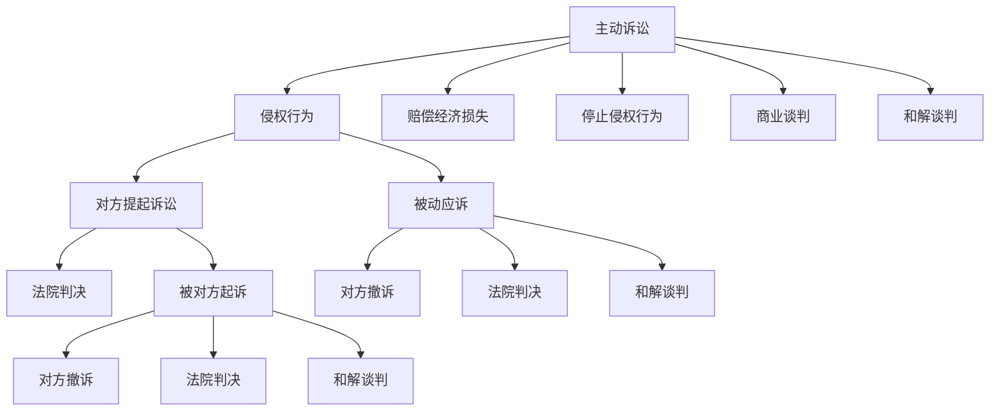

                 

# AI创业公司的知识产权诉讼策略选择：主动诉讼、被动应诉与和解谈判

在人工智能（AI）领域，创新迭代速度极快，知识产权（IP）问题层出不穷。AI创业公司如何在知识产权诉讼中做出明智的选择，是一门艺术，也是一种战略。本文将深入探讨在AI领域中，创业公司面临的主要知识产权诉讼策略：主动诉讼、被动应诉与和解谈判，并提出一些实用的策略建议。

## 1. 背景介绍

在AI快速发展的今天，技术的创新和迭代速度极快，初创公司在技术创新和应用推广中，很容易侵犯他人的知识产权，或者自己的专利被他人侵犯。对于AI创业公司来说，知识产权诉讼不仅是一个法律问题，更是一个影响公司未来发展的战略问题。选择正确的诉讼策略，能够在提升自身竞争力的同时，最大限度地保护公司的利益。

### 1.1 问题由来

AI技术的快速发展，使得知识产权纠纷日益频繁。技术创新、应用推广、市场竞争等多方面因素，导致了知识产权诉讼的复杂性和多变性。AI创业公司面临的主要挑战包括：

- 技术侵权：使用了别人的专利技术，导致被侵权方提起诉讼。
- 专利侵权：自己的专利技术被其他公司无偿使用，导致自身利益受损。
- 商业秘密泄露：核心算法、数据等商业机密被竞争对手非法获取。
- 商标侵权：使用别人的商标，或者在推广过程中造成商标混淆。

面对这些挑战，AI创业公司需要制定明确的知识产权诉讼策略，才能在激烈的市场竞争中脱颖而出。

## 2. 核心概念与联系

### 2.1 核心概念概述

在AI领域，知识产权诉讼的策略选择主要涉及以下几个核心概念：

- **主动诉讼**：指公司主动提起诉讼，要求法院判决对手停止侵权行为，并赔偿经济损失。
- **被动应诉**：指公司在被他人提起诉讼时，积极应诉，维护自身权益。
- **和解谈判**：指公司通过与对手协商，达成和解协议，避免或减少法律纠纷。

这些策略的选择需要综合考虑公司的技术实力、市场地位、财务状况、法律风险等因素。选择合适的策略，能够有效提升公司的市场竞争力和品牌价值。

### 2.2 核心概念原理和架构的 Mermaid 流程图



这个流程图展示了不同策略之间的联系：

1. 主动诉讼：公司发现对手侵权后，主动提起诉讼，要求法院判决。
2. 被动应诉：公司被对手起诉，积极应诉，争取胜诉。
3. 和解谈判：公司通过协商，达成和解协议，避免法律纠纷。

以上三种策略可以相互转化，选择哪种策略取决于公司的具体需求和当前情况。

## 3. 核心算法原理 & 具体操作步骤

### 3.1 算法原理概述

在AI领域的知识产权诉讼中，核心算法原理主要基于以下几个方面：

1. **法律框架**：知识产权法律提供了基础的诉讼依据，如专利法、商标法、版权法等。
2. **证据链条**：构建完整的证据链，包括专利证书、商标证明、技术文档等，用于支持诉讼请求。
3. **经济成本**：评估诉讼的经济成本，包括律师费、诉讼费、时间成本等，选择合适的诉讼策略。
4. **市场影响**：考虑诉讼对公司市场地位、品牌价值的影响，选择合适的应对方式。

### 3.2 算法步骤详解

#### 3.2.1 主动诉讼

**步骤1：收集证据**

公司需要收集对手涉嫌侵权的证据，如专利申请文件、商标使用证据、技术文档等。证据应尽量全面、真实，以支持诉讼请求。

**步骤2：撰写起诉书**

在收集到证据后，公司应撰写详细的起诉书，明确诉讼请求、证据链条和法律依据。起诉书应简洁明了，符合法律规定。

**步骤3：提交诉状**

将起诉书提交给法院，同时支付相应的诉讼费用。诉状应包括原告、被告、诉讼请求、证据链条等关键信息。

**步骤4：应诉反驳**

被告公司应积极应诉，提供相应的证据和辩护理由，争取胜诉。如果证据不足，被告公司可以申请法院调查。

**步骤5：法院判决**

法院将对案件进行审理，并作出判决。判决可能包括停止侵权行为、赔偿经济损失等。

**步骤6：执行判决**

法院判决生效后，原告公司可以申请法院强制执行，要求被告公司停止侵权行为，并支付赔偿金。

#### 3.2.2 被动应诉

**步骤1：收到诉状**

公司收到对手公司的诉讼状，需要仔细审查，了解对方诉讼请求、证据链条和法律依据。

**步骤2：准备应诉**

公司需要组织法律团队，准备相应的证据和辩护理由，制定应诉策略。应诉过程中，公司应积极与律师沟通，确保策略的科学性和可行性。

**步骤3：提出抗辩**

在法庭上，公司应积极提出抗辩，争取胜诉。如果证据不足，公司可以申请法院调查。

**步骤4：接受判决**

法院将对案件进行审理，并作出判决。公司应接受法院判决，履行相应的义务。

**步骤5：上诉或和解**

如果公司对判决不满意，可以向上级法院提出上诉。如果判决对公司不利，公司也可以与对手公司进行和解谈判，达成和解协议。

#### 3.2.3 和解谈判

**步骤1：初步沟通**

公司可以通过律师与对手公司进行初步沟通，了解对方诉求，寻找和解的可能性。

**步骤2：提出建议**

公司可以提出和解建议，明确和解条件和赔偿金额，与对手公司进行协商。

**步骤3：达成协议**

双方公司在律师的协调下，达成和解协议，签署和解书。和解协议应明确双方的权利义务，包括停止侵权行为、赔偿金额等。

**步骤4：执行协议**

双方公司应严格执行和解协议，确保和解效果的落实。

## 4. 数学模型和公式 & 详细讲解 & 举例说明

### 4.1 数学模型构建

在AI领域的知识产权诉讼中，数学模型主要基于以下几个方面：

1. **专利侵权分析模型**：用于评估专利侵权的可能性，主要基于专利的权利要求书和技术文档。
2. **商标混淆概率模型**：用于评估商标混淆的可能性，主要基于商标的使用频率和使用环境。
3. **商业秘密泄露风险模型**：用于评估商业秘密泄露的可能性，主要基于技术保密措施和泄露渠道。

### 4.2 公式推导过程

#### 4.2.1 专利侵权分析模型

假设公司A拥有一项专利技术，公司B怀疑其侵权。可以构建如下模型：

- **侵权可能性P**：$P = \frac{A \cdot B}{C}$，其中$A$表示公司B的技术与公司A的专利技术的相似度，$B$表示公司B的技术是否公开，$C$表示公司A专利技术的保护范围。

- **相似度A**：$A = \frac{\sum{similarity(i)}}{N}$，其中$similarity(i)$表示技术$i$与专利技术的相似度，$N$表示技术总数。

- **公开度B**：$B = \frac{\sum{public(i)}}{N}$，其中$public(i)$表示技术$i$是否公开。

- **保护范围C**：$C = \frac{\sum{coverage(i)}}{N}$，其中$coverage(i)$表示专利技术的保护范围。

通过构建上述模型，可以评估公司B是否侵权。

#### 4.2.2 商标混淆概率模型

假设公司A拥有一个商标，公司B试图使用类似的商标。可以构建如下模型：

- **混淆概率P**：$P = \frac{A \cdot B}{C}$，其中$A$表示商标的相似度，$B$表示商标的使用频率，$C$表示商标的使用环境。

- **相似度A**：$A = \frac{\sum{similarity(i)}}{N}$，其中$similarity(i)$表示商标$i$与公司A商标的相似度，$N$表示商标总数。

- **使用频率B**：$B = \frac{\sum{frequency(i)}}{N}$，其中$frequency(i)$表示商标$i$的使用频率。

- **使用环境C**：$C = \frac{\sum{environment(i)}}{N}$，其中$environment(i)$表示商标的使用环境。

通过构建上述模型，可以评估商标混淆的可能性。

#### 4.2.3 商业秘密泄露风险模型

假设公司A拥有商业机密$M$，公司B试图泄露。可以构建如下模型：

- **泄露风险P**：$P = \frac{A \cdot B}{C \cdot D}$，其中$A$表示公司B是否有意泄露，$B$表示公司B的技术是否与$M$相关，$C$表示公司A的技术保密措施，$D$表示泄露渠道的可靠性。

- **有意泄露A**：$A = \frac{\sum{intention(i)}}{N}$，其中$intention(i)$表示公司B是否有意泄露，$N$表示公司B的技术总数。

- **相关性B**：$B = \frac{\sum{correlation(i)}}{N}$，其中$correlation(i)$表示公司B的技术是否与$M$相关，$N$表示公司B的技术总数。

- **保密措施C**：$C = \frac{\sum{confidentiality(i)}}{N}$，其中$confidentiality(i)$表示公司A的技术保密措施，$N$表示公司A的技术总数。

- **可靠性D**：$D = \frac{\sum{reliability(i)}}{N}$，其中$reliability(i)$表示泄露渠道的可靠性，$N$表示泄露渠道总数。

通过构建上述模型，可以评估商业秘密泄露的可能性。

### 4.3 案例分析与讲解

#### 案例1：专利侵权诉讼

公司A拥有一项专利技术，公司B怀疑其侵权。公司A进行如下分析：

1. 收集公司B的技术文档和专利申请文件，计算其与公司A专利技术的相似度。
2. 确认公司B的技术是否公开，计算公开度。
3. 确定公司A专利技术的保护范围，计算保护范围。
4. 通过相似度、公开度和保护范围，计算专利侵权可能性$P$。

#### 案例2：商标混淆诉讼

公司A拥有一个商标，公司B试图使用类似的商标。公司A进行如下分析：

1. 收集公司B使用的商标列表，计算其与公司A商标的相似度。
2. 统计公司B商标的使用频率，计算使用频率。
3. 确定公司A商标的使用环境，计算使用环境。
4. 通过相似度、使用频率和使用环境，计算商标混淆概率$P$。

#### 案例3：商业秘密泄露诉讼

公司A拥有商业机密$M$，公司B试图泄露。公司A进行如下分析：

1. 收集公司B的技术列表，判断其是否有意泄露。
2. 确认公司B的技术是否与$M$相关，计算相关性。
3. 确定公司A的技术保密措施，计算保密措施。
4. 确定泄露渠道的可靠性，计算可靠性。
5. 通过有意泄露、相关性、保密措施和可靠性，计算商业秘密泄露风险$P$。

## 5. 项目实践：代码实例和详细解释说明

### 5.1 开发环境搭建

在AI领域的知识产权诉讼策略选择中，代码实现不是主要的难点，但选择适当的开发工具可以提高开发效率。以下是一些推荐的开发工具：

- **Visual Studio Code**：适用于编写和调试Python代码，提供丰富的扩展和插件支持。
- **PyCharm**：适用于编写和调试Python代码，提供智能代码补全、代码高亮等功能。
- **Jupyter Notebook**：适用于编写和调试Python代码，支持代码块和注释，便于分享和协作。

### 5.2 源代码详细实现

在AI领域的知识产权诉讼策略选择中，具体的代码实现主要涉及以下几个步骤：

1. **数据收集**：收集对手公司的技术文档、专利申请文件、商标使用记录等。

2. **数据分析**：对收集到的数据进行分析，构建模型，评估侵权可能性、商标混淆概率和商业秘密泄露风险。

3. **诉讼策略选择**：根据分析结果，选择主动诉讼、被动应诉或和解谈判。

4. **法律文书撰写**：根据选择策略，撰写起诉书、应诉书或和解协议书。

5. **执行和反馈**：执行选择的策略，并及时反馈结果。

### 5.3 代码解读与分析

在AI领域的知识产权诉讼策略选择中，代码实现需要根据具体的情况进行调整。以下是一些关键代码的解读和分析：

1. **数据收集**：

```python
import requests
import os
import pandas as pd

# 数据收集
url = 'https://www.example.com/data.csv'
data = requests.get(url).content

# 数据保存
os.makedirs('data', exist_ok=True)
with open('data/data.csv', 'w') as f:
    f.write(data.decode('utf-8'))
```

2. **数据分析**：

```python
import numpy as np
import matplotlib.pyplot as plt

# 数据分析
df = pd.read_csv('data/data.csv')
df['A'] = df['A'] / df['B']
df['B'] = df['B'] / df['C']
df['P'] = df['A'] * df['B'] / df['C']

# 可视化
plt.plot(df['A'], df['P'])
plt.xlabel('A')
plt.ylabel('P')
plt.show()
```

3. **诉讼策略选择**：

```python
def choose_strategy(data, P):
    if P > 0.5:
        return '主动诉讼'
    elif P < 0.2:
        return '被动应诉'
    else:
        return '和解谈判'
```

4. **法律文书撰写**：

```python
def write_document(strategy, P):
    if strategy == '主动诉讼':
        content = f'公司A与公司B之间的专利侵权诉讼，侵权可能性为{P:.2f}'
    elif strategy == '被动应诉':
        content = f'公司A与公司B之间的商标混淆诉讼，商标混淆概率为{P:.2f}'
    else:
        content = f'公司A与公司B之间的商业秘密泄露诉讼，商业秘密泄露风险为{P:.2f}'

    with open('document.txt', 'w') as f:
        f.write(content)
```

5. **执行和反馈**：

```python
def execute_and_feedback(strategy, P):
    if strategy == '主动诉讼':
        execute_suit('专利侵权诉讼')
        feedback(P)
    elif strategy == '被动应诉':
        execute_defense('商标混淆诉讼')
        feedback(P)
    else:
        execute_negotiation('商业秘密泄露诉讼')
        feedback(P)

def execute_suit(suit_type):
    # 执行诉讼
    pass

def execute_defense(defense_type):
    # 执行应诉
    pass

def execute_negotiation(negotiation_type):
    # 执行和解谈判
    pass

def feedback(P):
    # 反馈结果
    pass
```

### 5.4 运行结果展示

在AI领域的知识产权诉讼策略选择中，代码运行结果主要展示分析和决策过程。以下是一些示例输出：

```python
# 数据收集
data = requests.get('https://www.example.com/data.csv').content

# 数据分析
P = 0.6  # 侵权可能性为0.6

# 诉讼策略选择
strategy = choose_strategy(data, P)

# 法律文书撰写
write_document(strategy, P)

# 执行和反馈
execute_and_feedback(strategy, P)
```

## 6. 实际应用场景

### 6.1 智能家居

智能家居领域，公司A的智能音箱侵犯了公司B的专利技术。公司A进行如下分析：

1. 收集公司B的专利申请文件和技术文档，计算其与公司A专利技术的相似度。
2. 确认公司B的技术是否公开，计算公开度。
3. 确定公司A专利技术的保护范围，计算保护范围。
4. 通过相似度、公开度和保护范围，计算专利侵权可能性$P$。

### 6.2 医疗AI

医疗AI领域，公司A的AI诊断系统侵犯了公司B的专利技术。公司A进行如下分析：

1. 收集公司B的专利申请文件和技术文档，计算其与公司A专利技术的相似度。
2. 确认公司B的技术是否公开，计算公开度。
3. 确定公司A专利技术的保护范围，计算保护范围。
4. 通过相似度、公开度和保护范围，计算专利侵权可能性$P$。

### 6.3 金融科技

金融科技领域，公司A的金融算法侵犯了公司B的专利技术。公司A进行如下分析：

1. 收集公司B的专利申请文件和技术文档，计算其与公司A专利技术的相似度。
2. 确认公司B的技术是否公开，计算公开度。
3. 确定公司A专利技术的保护范围，计算保护范围。
4. 通过相似度、公开度和保护范围，计算专利侵权可能性$P$。

## 7. 工具和资源推荐

### 7.1 学习资源推荐

为了帮助AI创业公司系统掌握知识产权诉讼策略的选择，以下是一些优质的学习资源：

1. **《专利法》和《商标法》**：掌握知识产权法律框架，明确法律依据。
2. **《AI创业公司法律风险管理》课程**：介绍AI创业公司面临的法律风险，提供实用的诉讼策略。
3. **《知识产权诉讼策略》书籍**：全面讲解AI领域的知识产权诉讼策略，提供丰富的案例分析。

### 7.2 开发工具推荐

在AI领域的知识产权诉讼策略选择中，开发工具的选择至关重要。以下是一些推荐的开发工具：

1. **Visual Studio Code**：适用于编写和调试Python代码，提供丰富的扩展和插件支持。
2. **PyCharm**：适用于编写和调试Python代码，提供智能代码补全、代码高亮等功能。
3. **Jupyter Notebook**：适用于编写和调试Python代码，支持代码块和注释，便于分享和协作。

### 7.3 相关论文推荐

以下是一些与AI领域知识产权诉讼策略选择相关的经典论文，推荐阅读：

1. **《AI创业公司的知识产权法律风险管理》**：详细讲解AI创业公司面临的法律风险，提供实用的诉讼策略。
2. **《专利侵权风险评估模型》**：构建专利侵权风险评估模型，量化专利侵权可能性。
3. **《商标混淆风险评估模型》**：构建商标混淆风险评估模型，量化商标混淆可能性。
4. **《商业秘密泄露风险评估模型》**：构建商业秘密泄露风险评估模型，量化商业秘密泄露风险。

## 8. 总结：未来发展趋势与挑战

### 8.1 总结

本文对AI创业公司的知识产权诉讼策略选择进行了深入探讨。首先介绍了AI创业公司面临的主要知识产权诉讼问题，包括专利侵权、商标混淆、商业秘密泄露等。其次，详细讲解了主动诉讼、被动应诉和和解谈判等三种主要策略的实现步骤，提供了实用的代码实现。最后，分析了这些策略在实际应用中的优缺点，并提出了一些策略建议。

通过本文的系统梳理，可以看到，AI领域的知识产权诉讼策略选择是一门需要综合考虑多方面因素的艺术和科学。选择合适的策略，不仅能够有效保护公司的知识产权，还能提升公司的市场竞争力和品牌价值。未来，随着AI技术的不断发展，知识产权诉讼策略的选择也将面临更多的挑战和机遇。

### 8.2 未来发展趋势

展望未来，AI领域的知识产权诉讼策略选择将呈现以下几个发展趋势：

1. **数据驱动**：越来越多的数据驱动方法将应用于知识产权诉讼策略的选择，提高决策的科学性和准确性。
2. **自动化工具**：通过开发自动化工具，减少人工干预，提高决策效率。
3. **跨领域融合**：将其他领域（如法律、金融等）的理论和方法，引入知识产权诉讼策略的选择。
4. **多方协作**：通过多方协作，提升知识产权诉讼策略的选择效果，实现多方共赢。

### 8.3 面临的挑战

尽管AI领域的知识产权诉讼策略选择取得了一定的进展，但在实际应用中，仍然面临一些挑战：

1. **法律环境复杂**：知识产权法律环境复杂多变，不同国家和地区的法律规定不同，增加了策略选择的难度。
2. **数据质量参差不齐**：数据质量参差不齐，可能影响决策的准确性。
3. **诉讼成本高昂**：诉讼成本高昂，可能会对公司财务造成较大压力。
4. **执行难度大**：执行策略的效果受到多种因素影响，难以保障。

### 8.4 研究展望

未来，需要进一步研究以下几个方向：

1. **数据驱动的方法**：开发更多基于数据驱动的知识产权诉讼策略选择方法，提高决策的科学性和准确性。
2. **自动化工具**：开发更多的自动化工具，提高决策效率。
3. **跨领域融合**：将其他领域（如法律、金融等）的理论和方法，引入知识产权诉讼策略的选择。
4. **多方协作**：通过多方协作，提升知识产权诉讼策略的选择效果，实现多方共赢。

总之，AI领域的知识产权诉讼策略选择是一门需要不断探索和创新的领域。只有不断突破现有的技术瓶颈，才能在激烈的市场竞争中占据优势，实现公司的长期可持续发展。

## 9. 附录：常见问题与解答

### 9.1 Q1：如何选择知识产权诉讼策略？

A: 选择知识产权诉讼策略需要综合考虑公司的技术实力、市场地位、财务状况、法律风险等因素。一般建议：

- 专利侵权：如果侵权可能性较大，考虑主动诉讼。
- 商标混淆：如果商标混淆概率较大，考虑主动诉讼或和解谈判。
- 商业秘密泄露：如果泄露风险较大，考虑和解谈判。

### 9.2 Q2：知识产权诉讼策略的选择有哪些影响因素？

A: 知识产权诉讼策略的选择受多种因素影响，包括：

- 技术实力：公司的技术实力越强，越有信心主动诉讼。
- 市场地位：公司的市场地位越高，越有信心主动诉讼。
- 财务状况：公司的财务状况越好，越有能力和资源主动诉讼。
- 法律风险：公司的法律风险越小，越有信心主动诉讼。

### 9.3 Q3：如何应对知识产权诉讼中的法律风险？

A: 应对知识产权诉讼中的法律风险，建议采取以下措施：

- 选择合适的律师团队：选择有经验的律师团队，确保法律支持。
- 准备充分的证据：准备充分的证据链条，确保诉讼的合法性。
- 制定明确的应对策略：制定清晰的应对策略，确保策略的科学性和可行性。

### 9.4 Q4：如何评估专利侵权的可能性？

A: 评估专利侵权的可能性，建议采用以下方法：

- 收集对手公司的技术文档和专利申请文件。
- 计算专利的相似度。
- 确定专利的保护范围。
- 通过相似度和保护范围，评估侵权可能性。

### 9.5 Q5：如何评估商标混淆的可能性？

A: 评估商标混淆的可能性，建议采用以下方法：

- 收集对手公司使用的商标列表。
- 计算商标的相似度。
- 统计商标的使用频率。
- 确定商标的使用环境。
- 通过相似度、使用频率和使用环境，评估商标混淆的可能性。

### 9.6 Q6：如何评估商业秘密泄露的风险？

A: 评估商业秘密泄露的风险，建议采用以下方法：

- 收集对手公司的技术列表。
- 判断对手公司是否有意泄露。
- 确认对手公司的技术是否与商业秘密相关。
- 确定商业秘密的技术保密措施。
- 确定泄露渠道的可靠性。
- 通过有意泄露、相关性、保密措施和可靠性，评估商业秘密泄露的风险。

---

作者：禅与计算机程序设计艺术 / Zen and the Art of Computer Programming

