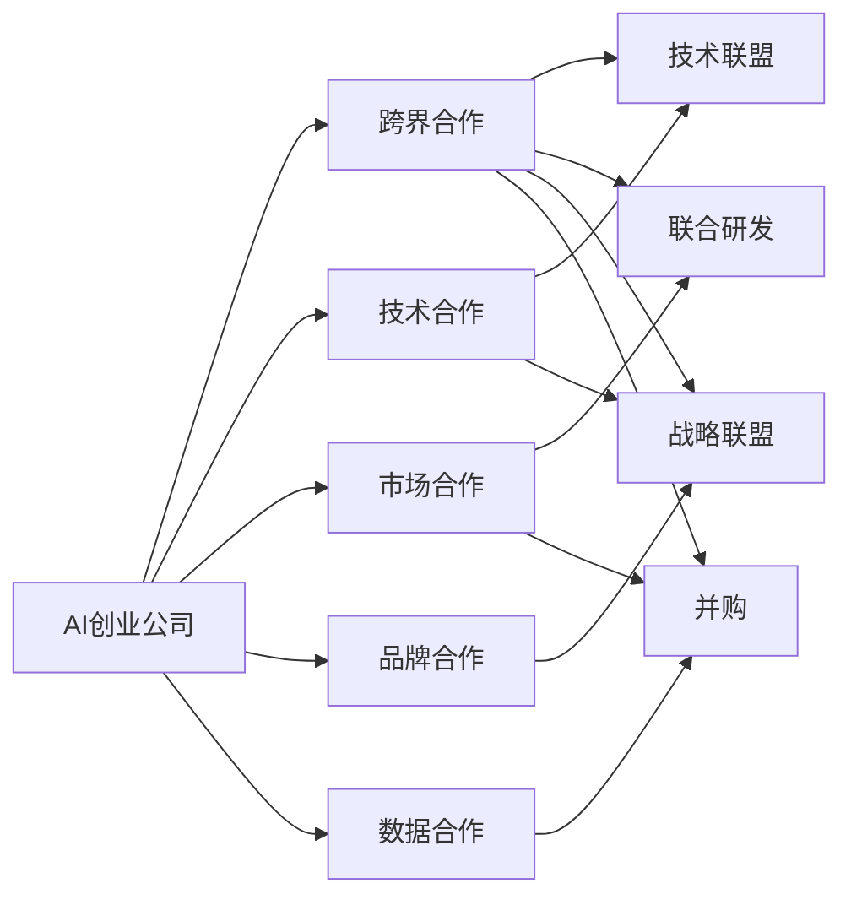

                 

# AI创业公司的跨界合作模式探索

## 1. 背景介绍

### 1.1 问题由来
在人工智能(AI)技术迅速发展的背景下，越来越多的AI创业公司涌现出来，他们凭借创新思维和前沿技术，在各自的领域取得了显著的成果。然而，随着市场竞争的加剧，单个公司难以满足日益增长的用户需求和行业变化。跨界合作成为了AI创业公司寻求进一步发展的重要策略。

跨界合作可以整合各公司的资源、技术优势，形成协同效应，最大化资源利用效率。这不仅有助于提升产品的创新性和竞争力，还能通过共享数据、平台等资源，降低开发成本和风险。但跨界合作也面临诸如利益冲突、数据隐私、安全等挑战。

### 1.2 问题核心关键点
1. **跨界合作的形式**：包括技术合作、市场合作、品牌合作、数据合作等。
2. **跨界合作的动机**：提升产品性能、拓展市场份额、降低研发成本、增强竞争优势等。
3. **跨界合作的难点**：利益分配、数据隐私保护、技术兼容、监管合规等。
4. **跨界合作的收益**：增强技术创新能力、实现资源共享、提升品牌影响力、加速产品迭代等。

## 2. 核心概念与联系

### 2.1 核心概念概述

为更好地理解AI创业公司的跨界合作模式，本节将介绍几个关键概念：

- **AI创业公司**：以AI技术为核心驱动，专注于开发和应用人工智能产品的企业。
- **跨界合作**：不同领域的创业公司之间，通过资源共享、技术合作等方式，实现互利共赢的合作关系。
- **合作模型**：跨界合作的方式和模式，如技术联盟、联合研发、战略联盟、并购等。
- **协同效应**：通过合作实现的资源整合和优势互补，产生1+1>2的效果。
- **数据隐私和安全**：跨界合作中必须考虑的数据管理和保护问题，确保用户数据的安全和隐私。

这些概念之间通过以下Mermaid流程图来展示其联系：



这个流程图展示了AI创业公司跨界合作的各种形式及其相互联系。

## 3. 核心算法原理 & 具体操作步骤
### 3.1 算法原理概述

AI创业公司的跨界合作，本质上是一种价值协同和资源整合的策略。其核心思想是：通过不同公司之间的优势互补，共同解决技术难题，提升产品性能，开拓市场空间。

形式化地，假设两个AI创业公司A和B，拥有各自的技术优势和资源。A拥有核心算法或数据，B具备市场渠道或用户需求。合作的目标是通过整合资源，最大化总价值V：

$$
V = V_A + V_B - C
$$

其中，$V_A$ 和 $V_B$ 分别代表A和B各自的价值贡献，$C$ 是合作过程中产生的成本。合作的目的是找到最优的资源配置方案，使得总价值最大化。

### 3.2 算法步骤详解

AI创业公司的跨界合作通常包括以下几个关键步骤：

**Step 1: 评估合作价值**
- 对双方资源、技术、市场、品牌等进行评估，确定各自的优劣势。
- 定义合作的KPI，如销售额、市场份额、技术突破等，作为衡量合作效果的关键指标。

**Step 2: 选择合作形式**
- 根据合作目标和资源情况，选择合适的合作形式，如技术联盟、联合研发、品牌联合等。
- 确定合作的组织结构、管理机制和参与方职责。

**Step 3: 明确合作内容**
- 列出具体的合作任务和目标，明确各方的职责和贡献。
- 制定详细的合作协议，包括知识产权、数据使用、收益分配等内容。

**Step 4: 实施合作**
- 按照合作协议，双方开展技术交流、数据共享、市场推广等活动。
- 定期评估合作效果，调整合作策略，确保合作目标的实现。

**Step 5: 评估合作效果**
- 通过数据分析和市场反馈，评估合作的总体效果，对比预期目标的达成情况。
- 对合作过程中的问题进行总结，积累经验，为未来的合作提供参考。

### 3.3 算法优缺点

AI创业公司的跨界合作具有以下优点：
1. **资源共享**：通过整合不同公司的优势资源，形成互补，提升技术创新能力和市场竞争力。
2. **风险分散**：合作各方共享成本和风险，降低单个公司的经营风险。
3. **市场扩展**：通过联合市场推广，拓展新的市场空间，提升品牌影响力。
4. **知识交流**：合作促进了技术交流和知识共享，促进了技术的快速迭代和创新。

同时，跨界合作也存在一些局限性：
1. **协调成本高**：不同公司之间的合作需要协调沟通，可能面临协调效率低下的问题。
2. **利益冲突**：合作各方利益不一致，可能导致利益分配不均，影响合作稳定性。
3. **数据隐私问题**：合作过程中涉及大量数据，如何保护数据隐私和确保数据安全是一大挑战。
4. **合规风险**：合作涉及的法律和监管问题复杂，需要谨慎处理。

尽管如此，跨界合作仍是AI创业公司寻求持续发展的重要途径，通过不断优化合作模式，可以有效应对这些挑战。

### 3.4 算法应用领域

AI创业公司的跨界合作广泛应用于以下几个领域：

- **技术研发**：联合开发新技术，解决单一公司难以克服的技术难题。
- **市场推广**：联合市场推广，提升品牌知名度和市场占有率。
- **数据共享**：数据共享和交叉验证，提高数据质量和模型精度。
- **人才交流**：人才交换和培训，提升团队技术和知识水平。
- **产品优化**：通过用户反馈和数据整合，优化产品功能和用户体验。

## 4. 数学模型和公式 & 详细讲解  
### 4.1 数学模型构建

本节将使用数学语言对AI创业公司跨界合作的价值最大化模型进行更加严格的刻画。

记AI创业公司A和B的资源分别为 $R_A$ 和 $R_B$，合作的目标是最大化合作价值 $V$。假设合作过程中的总成本为 $C$，且 $C$ 是合作的固定成本。则合作的价值最大化模型为：

$$
V = \max_{R_A, R_B} \{ V_A(R_A) + V_B(R_B) - C \}
$$

其中，$V_A(R_A)$ 和 $V_B(R_B)$ 分别代表公司A和B通过资源 $R_A$ 和 $R_B$ 产生的价值。

### 4.2 公式推导过程

对于公司A，其产生的价值 $V_A(R_A)$ 可以通过其核心算法或数据处理能力来表示，例如：

$$
V_A(R_A) = f_A(R_A)
$$

同理，公司B的价值 $V_B(R_B)$ 可以表示为：

$$
V_B(R_B) = f_B(R_B)
$$

将上述公式代入合作价值最大化模型，得到：

$$
V = \max_{R_A, R_B} \{ f_A(R_A) + f_B(R_B) - C \}
$$

为了求解上述优化问题，可以采用拉格朗日乘子法，将约束条件引入目标函数中：

$$
\mathcal{L}(R_A, R_B, \lambda) = f_A(R_A) + f_B(R_B) - C + \lambda (R_A + R_B - T)
$$

其中，$T$ 为合作的资源总量，$\lambda$ 为拉格朗日乘子。求解上述优化问题，可以得到最优资源分配方案 $R_A^*$ 和 $R_B^*$，从而实现合作价值最大化。

### 4.3 案例分析与讲解

假设公司A拥有先进的自然语言处理技术，公司B拥有大规模用户基础和市场渠道。两者决定进行跨界合作，共同开发AI辅助客服系统。公司A提供算法和模型，公司B提供市场推广和用户数据。合作的成本包括算法开发、市场推广和数据共享等。

可以定义公司A和B的收益函数，假设公司A的价值函数 $f_A(R_A)$ 为模型精度和应用效果，公司B的价值函数 $f_B(R_B)$ 为用户满意度和市场反馈。合作的总成本 $C$ 为固定费用和数据共享费用。

通过上述模型，可以求解最优资源分配，确定公司A和B各自应投入的资源量，使得总合作价值最大化。

## 5. 项目实践：代码实例和详细解释说明
### 5.1 开发环境搭建

在进行跨界合作项目实践前，我们需要准备好开发环境。以下是使用Python进行跨界合作开发的流程：

1. 安装Python：从官网下载并安装Python，适合于编写和管理跨界合作相关的代码。

2. 安装相关库：使用pip安装必要的Python库，如PyTorch、TensorFlow、Pandas、NumPy等，用于数据分析和模型开发。

3. 准备数据集：收集合作各方所需的数据，包括技术数据、市场数据、用户数据等。

4. 搭建服务器：在服务器上搭建跨界合作开发环境，安装必要的软件和工具，如Jupyter Notebook、Git、Docker等。

5. 搭建开发环境：在服务器上安装相应的开发环境，如Python虚拟环境，进行代码编写和调试。

完成上述步骤后，即可在跨界合作开发环境中进行具体的项目实践。

### 5.2 源代码详细实现

下面我们以AI辅助客服系统的开发为例，给出使用PyTorch进行跨界合作开发的PyTorch代码实现。

首先，定义合作的价值函数和成本函数：

```python
import torch
from torch import nn

class CooperationModel(nn.Module):
    def __init__(self, R_A, R_B, T, C):
        super(CooperationModel, self).__init__()
        self.R_A = R_A
        self.R_B = R_B
        self.T = T
        self.C = C
        
        self.f_A = nn.Sequential(
            nn.Linear(R_A, 128),
            nn.ReLU(),
            nn.Linear(128, 1)
        )
        self.f_B = nn.Sequential(
            nn.Linear(R_B, 128),
            nn.ReLU(),
            nn.Linear(128, 1)
        )
        
    def forward(self, R_A, R_B):
        value_A = self.f_A(R_A)
        value_B = self.f_B(R_B)
        total_value = value_A + value_B - self.C
        return total_value
    
    def cost_function(self, R_A, R_B):
        return torch.tensor(self.C)
```

然后，定义优化器和求解过程：

```python
from torch.optim import Adam
from scipy.optimize import minimize

optimizer = Adam(coop_model.parameters(), lr=0.001)
```

最后，启动求解过程并输出结果：

```python
R_A_opt, R_B_opt = minimize(coop_model.cost_function, (R_A, R_B), method='L-BFGS-B')
print(f"Optimal R_A: {R_A_opt}, Optimal R_B: {R_B_opt}")
```

以上就是使用PyTorch进行跨界合作开发的完整代码实现。可以看到，通过定义价值函数和成本函数，我们可以求解最优的资源分配方案，实现合作价值最大化。

### 5.3 代码解读与分析

让我们再详细解读一下关键代码的实现细节：

**CooperationModel类**：
- `__init__`方法：初始化合作双方的资源量、总资源量、总成本，以及各自的价值函数。
- `forward`方法：根据输入的资源量，计算合作的总价值。
- `cost_function`方法：定义合作的成本函数，用于求解最优资源分配。

**Adam优化器**：
- `Adam`优化器：用于最小化合作的成本函数，找到最优的资源分配方案。

**求解过程**：
- 使用`minimize`函数求解最优的资源分配方案，得到最优的资源量$R_A$和$R_B$。
- 最后，输出最优的资源分配方案。

以上代码展示了如何使用数学模型和优化算法进行跨界合作的资源分配求解。在实际应用中，可以根据具体场景，调整价值函数和成本函数的设计，以实现最优的资源配置。

## 6. 实际应用场景
### 6.1 智能医疗健康

在智能医疗健康领域，AI创业公司可以跨界合作，共同开发AI辅助诊疗系统。例如，影像公司A拥有先进的影像处理技术，医疗数据公司B拥有丰富的医疗数据资源，两者可以合作开发AI辅助影像诊断系统。A提供算法和模型，B提供数据和用户反馈。通过协同合作，可以大幅提升影像诊断的准确性和效率。

### 6.2 智慧城市治理

在智慧城市治理领域，AI创业公司可以跨界合作，共同开发智能城市管理平台。例如，城市大数据公司A拥有海量城市数据，智慧城市方案公司B提供先进的智能城市方案。两者可以合作开发城市安全、交通管理、公共服务等多项智能应用。A提供数据资源，B提供解决方案和应用接口，共同打造智能城市管理平台。

### 6.3 教育培训

在教育培训领域，AI创业公司可以跨界合作，共同开发智能教育平台。例如，教育公司A拥有丰富的教育资源和用户需求，AI技术公司B提供先进的AI教育技术。两者可以合作开发智能推荐系统、智能答疑系统、智能评估系统等。A提供教育资源和用户反馈，B提供AI技术，共同打造智能教育平台，提升教育质量和学习效果。

### 6.4 未来应用展望

随着AI技术的发展和跨界合作模式的演进，未来AI创业公司将会在更多领域展开合作，为社会和经济的发展带来更多价值。

在智能制造、智慧能源、金融科技等领域，AI创业公司可以通过跨界合作，开发智能应用，提升生产效率、能源利用效率和金融服务水平。在文化娱乐、农业农业、环境保护等领域，AI创业公司也可以通过跨界合作，探索AI技术在文化创新、农业智能化、生态保护等方向的应用，推动社会进步。

## 7. 工具和资源推荐
### 7.1 学习资源推荐

为了帮助AI创业公司系统掌握跨界合作模式，这里推荐一些优质的学习资源：

1. **《跨界合作之道》系列博文**：深入剖析跨界合作的原理和实践，提供丰富的案例分析和工具推荐。

2. **《跨界合作的成功与失败》课程**：国际顶尖商学院开设的跨界合作案例分析课程，涵盖案例研究和实战演练。

3. **《合作之道：跨界合作的艺术与科学》书籍**：全面介绍跨界合作的基本原理、实践策略和成功案例。

4. **HBR《哈佛商业评论》**：国际知名商业杂志，定期发布跨界合作相关的研究论文和案例分析。

5. **国际合作研究协会(IEC)网站**：提供跨界合作的学术研究和最新动态，提供丰富的学习资源和研究论文。

通过对这些资源的学习实践，相信AI创业公司能够更好地掌握跨界合作的知识和方法，提升企业的创新能力和竞争力。

### 7.2 开发工具推荐

高效的跨界合作开发离不开优秀的工具支持。以下是几款用于跨界合作开发的常用工具：

1. **Git**：版本控制系统，用于协同开发和版本管理。
2. **Docker**：容器化技术，用于构建和部署跨界合作系统。
3. **Jupyter Notebook**：数据科学和机器学习开发环境，支持跨界合作中的数据处理和模型开发。
4. **PyTorch**：深度学习框架，支持跨界合作中的模型开发和训练。
5. **TensorFlow**：深度学习框架，支持跨界合作中的模型开发和训练。
6. **Kubernetes**：容器编排系统，支持跨界合作中的系统部署和管理。

合理利用这些工具，可以显著提升跨界合作的开发效率，加快创新迭代的步伐。

### 7.3 相关论文推荐

跨界合作模式的研究源于学界的持续研究。以下是几篇奠基性的相关论文，推荐阅读：

1. **《跨界合作的竞争效应：文献综述与展望》**：系统总结了跨界合作的研究现状和未来方向。

2. **《跨界合作的创新与绩效：理论和实证研究》**：基于理论和实证研究，探讨跨界合作对企业创新和绩效的影响。

3. **《跨界合作的组织与管理：理论、实践与挑战》**：分析跨界合作中的组织和管理问题，提出优化策略。

4. **《跨界合作的价值创造与协同效应》**：通过案例分析，探讨跨界合作中的价值创造机制和协同效应。

5. **《跨界合作中的数据共享与保护》**：讨论跨界合作中数据共享和保护的重要性，提出相关技术和规范。

这些论文代表了大语言模型微调技术的发展脉络。通过学习这些前沿成果，可以帮助研究者把握学科前进方向，激发更多的创新灵感。

## 8. 总结：未来发展趋势与挑战
### 8.1 总结

本文对AI创业公司的跨界合作模式进行了全面系统的介绍。首先阐述了跨界合作的背景和意义，明确了跨界合作在提升技术创新能力和市场竞争力方面的重要价值。其次，从原理到实践，详细讲解了跨界合作的价值最大化模型，给出了跨界合作项目开发的完整代码实现。同时，本文还广泛探讨了跨界合作在智能医疗健康、智慧城市治理、教育培训等多个行业领域的应用前景，展示了跨界合作的广阔发展空间。

通过本文的系统梳理，可以看到，AI创业公司的跨界合作模式为技术创新和资源整合提供了新思路，有助于提升企业的市场竞争力和市场份额。未来，随着技术的进步和市场的拓展，跨界合作将发挥更大的作用，带来更多的价值和机遇。

### 8.2 未来发展趋势

展望未来，AI创业公司的跨界合作模式将呈现以下几个发展趋势：

1. **合作形式多样化**：跨界合作将不仅仅局限于技术合作和市场合作，还将延伸到品牌联合、数据共享、人才交流等多个层面。
2. **平台化协同**：通过建立统一的平台，实现各公司的资源共享和协同运作，提升合作效率和效果。
3. **开放生态建设**：跨界合作将更加开放，形成良性生态系统，促进技术和知识在各公司之间的自由流动。
4. **全球化发展**：跨界合作将拓展到全球市场，通过跨国合作，提升公司的国际竞争力。
5. **可持续化发展**：跨界合作将注重环境和社会责任，追求可持续发展，构建长期合作的良性循环。

以上趋势凸显了跨界合作模式的无限潜力和广阔前景。这些方向的探索发展，必将进一步提升AI创业公司的创新能力和市场竞争力，推动AI技术在全球范围内的广泛应用。

### 8.3 面临的挑战

尽管跨界合作在AI创业公司中得到了广泛应用，但在迈向更加智能化、普适化应用的过程中，它仍面临诸多挑战：

1. **协调复杂**：跨界合作需要协调多方资源和利益，协调效率低下可能导致合作失败。
2. **利益分配不均**：合作各方利益不一致，可能导致合作不稳定，甚至出现纠纷。
3. **数据隐私问题**：跨界合作涉及大量敏感数据，如何保护数据隐私和安全是一大挑战。
4. **监管合规**：跨界合作涉及的法律和监管问题复杂，需要谨慎处理。
5. **技术兼容**：不同公司的技术平台和系统可能存在兼容性问题，导致合作难以顺利进行。

尽管如此，跨界合作仍是AI创业公司寻求持续发展的重要途径，通过不断优化合作模式，可以有效应对这些挑战。

### 8.4 研究展望

未来研究需要在以下几个方面寻求新的突破：

1. **合作机制优化**：进一步研究跨界合作的机制和流程，设计更为灵活高效的合作模式。
2. **利益分配模型**：构建更加公平合理的利益分配模型，确保合作各方的利益均衡。
3. **数据隐私保护**：研究跨界合作中数据隐私保护的技术和方法，确保用户数据的安全和隐私。
4. **跨界合作平台**：研究跨界合作平台的建设和运营，实现资源的高效共享和协同运作。
5. **合作案例分析**：通过大量跨界合作案例的研究，总结经验教训，提供实践指导。

这些研究方向的探索，必将引领AI创业公司跨界合作模式向更高的台阶，为构建智能社会奠定坚实基础。

## 9. 附录：常见问题与解答

**Q1：跨界合作对AI创业公司的优势和劣势分别是什么？**

A: 跨界合作对AI创业公司的优势包括：资源共享、风险分散、市场扩展、技术互补、知识交流等。劣势可能包括：协调成本高、利益冲突、数据隐私问题、合规风险、技术兼容等。

**Q2：如何进行跨界合作的利益分配？**

A: 跨界合作的利益分配需要综合考虑各方的资源投入、技术贡献、市场表现等因素。可以采用成本-收益分析、协商谈判、按比例分配等方式进行利益分配。

**Q3：跨界合作中如何保护数据隐私和安全？**

A: 保护数据隐私和安全是跨界合作中的关键问题。可以采用数据加密、匿名化、访问控制、合规管理等技术手段，确保数据的安全和隐私。

**Q4：跨界合作中如何选择合作伙伴？**

A: 选择合作伙伴需要综合考虑其技术实力、市场资源、文化契合度等因素。可以进行初步的尽职调查，评估合作伙伴的信誉和能力，选择合适的合作对象。

**Q5：跨界合作中的技术兼容问题如何解决？**

A: 技术兼容是跨界合作中常见的难题。可以采用技术标准化、接口设计、平台集成等方式，提升各公司的技术兼容性，确保合作的顺利进行。

这些问题的解答，希望能为AI创业公司提供实用的指导，帮助他们在跨界合作中取得更好的成效。

---

作者：禅与计算机程序设计艺术 / Zen and the Art of Computer Programming

