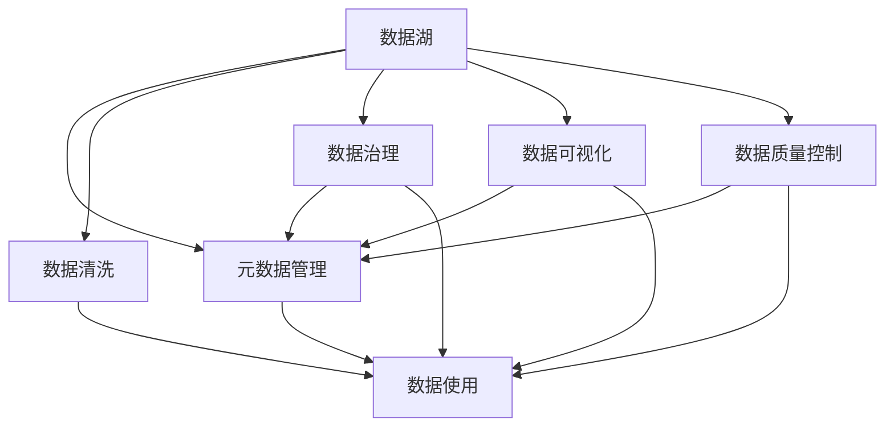

                 

# AI创业：数据管理流程优化

> 关键词：AI创业, 数据管理, 流程优化, 数据湖, 元数据管理, 数据清洗, 数据治理, 数据可视化, 数据质量控制

## 1. 背景介绍

### 1.1 问题由来
在AI创业领域，数据管理长期以来是创业公司面对的一个核心难题。对于依赖大量数据支持的AI项目而言，高质量、高效、可靠的数据管理流程，不仅是项目成功的前提，也是创业者实现商业价值的基础。然而，许多AI创业公司在数据管理方面缺乏系统的规划和执行，常常在数据准备、存储、治理、分析等环节遇到种种挑战。这些问题不仅影响项目的进展，还可能导致严重的商业风险。因此，本文将深入探讨AI创业公司在数据管理流程优化中的核心问题和解决方案，帮助创业者在数据管理的道路上走得更远。

### 1.2 问题核心关键点
数据管理流程优化在AI创业公司中尤为关键，主要体现在以下几个方面：

- **数据准备和清洗**：确保数据质量和一致性是所有AI项目的基础，但不同来源的数据往往存在格式、质量问题，需要进行预处理。
- **数据存储和治理**：数据量大且存储格式多样，如何高效、规范地存储和治理数据，成为创业公司面临的一个挑战。
- **数据可视化和分析**：数据可视化帮助理解数据特征和趋势，但数据量大且复杂，如何通过可视化工具进行高效分析，是创业公司必须掌握的能力。
- **数据质量控制**：数据质量直接影响模型训练和业务决策，如何建立数据质量控制流程，是确保AI项目成功的关键。

## 2. 核心概念与联系

### 2.1 核心概念概述

为更好地理解AI创业公司数据管理流程优化的核心概念，本节将介绍几个关键概念及其相互关系：

- **数据湖**：指的是存储海量的原始数据、数据集和处理后的数据结构，采用湖式存储结构，便于数据集中管理和快速访问。
- **元数据管理**：是指对数据仓库中的数据源、数据表、数据结构、数据流、数据质量等信息的组织、管理和监控。
- **数据清洗**：是指从原始数据中去除冗余、错误、无关信息，保证数据质量和一致性，是数据准备的重要步骤。
- **数据治理**：是对数据的创建、维护、使用、访问等进行规范和监管，保证数据的安全性、合规性和可用性。
- **数据可视化**：通过图表、报表等形式展示数据特征和趋势，帮助用户理解和分析数据，是数据管理的核心工具之一。
- **数据质量控制**：是对数据的完整性、一致性、准确性等进行监控和验证，确保数据满足业务需求和模型训练要求。

这些核心概念之间的逻辑关系可以通过以下Mermaid流程图来展示：



这个流程图展示了大数据管理中的核心概念及其之间的关系：

1. 数据湖是大规模数据存储的基础，元数据管理是对数据湖中数据的组织和监控。
2. 数据清洗是保证数据质量的重要环节，元数据管理和数据治理在数据清洗过程中发挥关键作用。
3. 数据可视化和数据质量控制在数据管理中用于辅助理解和监控，数据使用则是最终目的。

## 3. 核心算法原理 & 具体操作步骤

### 3.1 算法原理概述

AI创业公司数据管理流程优化主要通过以下两个步骤：

1. **数据治理流程优化**：通过建立数据治理框架，规范数据管理和使用流程，确保数据的安全性、合规性和可用性。
2. **数据准备流程优化**：通过数据清洗和数据转换，提高数据质量和一致性，为模型训练和业务决策提供可靠的数据支持。

数据治理和数据准备是数据管理的两大核心流程，两者相辅相成，共同构成高效的数据管理流程。

### 3.2 算法步骤详解

#### 数据治理流程优化

1. **建立数据治理框架**：
   - **定义数据治理目标**：明确数据治理的范围、目标、职责和流程。
   - **制定数据治理策略**：包括数据质量标准、安全策略、隐私保护等。
   - **选择数据治理工具**：如Data Quality Manager、Alation等，辅助执行数据治理任务。

2. **实施数据治理策略**：
   - **数据源管理**：定义数据源的接入标准和质量要求，确保数据源的可靠性和一致性。
   - **数据生命周期管理**：包括数据的创建、存储、更新、删除等生命周期环节的规范和监控。
   - **数据质量监控**：实时监控数据的完整性、一致性、准确性等指标，及时发现和解决数据质量问题。
   - **数据安全管理**：确保数据的安全性，防止数据泄露、篡改等风险。

#### 数据准备流程优化

1. **数据清洗**：
   - **数据预处理**：包括缺失值处理、异常值检测、数据类型转换等预处理步骤。
   - **数据转换**：将不同格式和类型的数据进行统一处理，方便后续分析和建模。

2. **数据转换**：
   - **数据集成**：将来自不同数据源的数据进行整合，形成统一的视图。
   - **数据转换**：通过ETL工具，将原始数据转换为分析和建模所需的数据格式。

### 3.3 算法优缺点

**数据治理流程优化的优点**：
- 提高数据质量：规范的数据治理流程确保数据的一致性和准确性，为模型训练和业务决策提供可靠的数据支持。
- 增强数据安全：数据治理策略保护数据隐私和安全，防止数据泄露和滥用。
- 提升数据合规性：符合行业数据合规要求，减少法律风险。

**数据治理流程的缺点**：
- 需要大量资源：数据治理流程需要投入大量的人力、物力和时间，初期投入成本较高。
- 流程复杂：数据治理流程涉及多个环节，实施过程中可能会遇到各种问题。

**数据准备流程优化的优点**：
- 提高数据质量：通过数据清洗和转换，确保数据的一致性和准确性。
- 降低数据复杂度：将不同来源的数据转换为统一的格式，方便后续分析和建模。

**数据准备流程的缺点**：
- 数据清洗复杂：数据清洗过程需要大量手工操作，效率低下。
- 数据转换难度大：不同数据源的数据格式和类型各异，数据转换难度大。

### 3.4 算法应用领域

基于数据治理和数据准备流程优化的技术，已经被广泛应用于以下领域：

- **金融科技**：通过数据治理和数据准备，金融机构能够更好地管理海量数据，提升风险管理和决策支持能力。
- **医疗健康**：通过数据治理和数据准备，医疗健康行业能够实现数据的高效管理和分析，提高诊疗水平和公共卫生决策能力。
- **智能制造**：通过数据治理和数据准备，智能制造企业能够提升生产效率，优化供应链管理，提升产品质量和市场竞争力。
- **零售电商**：通过数据治理和数据准备，零售电商企业能够更好地理解消费者需求，提升客户体验和业务决策能力。
- **公共服务**：通过数据治理和数据准备，政府和公共服务机构能够更好地管理社会数据，提升公共服务水平和决策支持能力。

## 4. 数学模型和公式 & 详细讲解 & 举例说明

### 4.1 数学模型构建

本节将使用数学语言对数据治理和数据准备流程进行更加严格的刻画。

设数据治理框架为 $\mathcal{G}$，数据源集为 $D$，数据清洗流程为 $\mathcal{C}$，数据转换流程为 $\mathcal{T}$，数据治理策略为 $S$，数据质量监控指标为 $Q$。

数据治理模型可以表示为：

$$
\mathcal{G} = \{D, \mathcal{C}, \mathcal{T}, S, Q\}
$$

数据治理框架 $\mathcal{G}$ 包含数据源 $D$，数据清洗流程 $\mathcal{C}$，数据转换流程 $\mathcal{T}$，数据治理策略 $S$ 和数据质量监控指标 $Q$。

### 4.2 公式推导过程

#### 数据治理框架的构建

数据治理框架 $\mathcal{G}$ 的构建过程如下：

1. **定义数据治理目标**：
   $$
   T = (T_1, T_2, ..., T_n)
   $$
   其中 $T_i$ 为第 $i$ 个治理目标。

2. **制定数据治理策略**：
   $$
   S = (S_1, S_2, ..., S_n)
   $$
   其中 $S_i$ 为第 $i$ 个治理策略。

3. **选择数据治理工具**：
   $$
   \mathcal{T} = \{\mathcal{T}_1, \mathcal{T}_2, ..., \mathcal{T}_n\}
   $$
   其中 $\mathcal{T}_i$ 为第 $i$ 个治理工具。

4. **实施数据治理策略**：
   $$
   \mathcal{A} = (A_1, A_2, ..., A_n)
   $$
   其中 $A_i$ 为第 $i$ 个治理活动。

数据治理流程可以表示为：
$$
\mathcal{G} = (T, S, \mathcal{T}, \mathcal{A})
$$

#### 数据清洗流程的实施

数据清洗流程 $\mathcal{C}$ 的实施过程如下：

1. **数据预处理**：
   $$
   P = (P_1, P_2, ..., P_m)
   $$
   其中 $P_i$ 为第 $i$ 个预处理步骤。

2. **数据转换**：
   $$
   C = (C_1, C_2, ..., C_k)
   $$
   其中 $C_i$ 为第 $i$ 个转换步骤。

数据清洗流程可以表示为：
$$
\mathcal{C} = (P, C)
$$

#### 数据转换流程的实施

数据转换流程 $\mathcal{T}$ 的实施过程如下：

1. **数据集成**：
   $$
   I = (I_1, I_2, ..., I_l)
   $$
   其中 $I_i$ 为第 $i$ 个集成步骤。

2. **数据转换**：
   $$
   T = (T_1, T_2, ..., T_o)
   $$
   其中 $T_i$ 为第 $i$ 个转换步骤。

数据转换流程可以表示为：
$$
\mathcal{T} = (I, T)
$$

### 4.3 案例分析与讲解

假设某AI创业公司需要在数据治理框架下，对来自不同数据源的数据进行清洗和转换，以支持公司的金融风险管理模型。

**案例场景**：
公司从银行、证券交易所等多个数据源获取金融数据，用于构建信用评分模型。不同数据源的数据格式和质量各异，需要进行清洗和转换，以形成统一的模型输入数据。

**案例分析**：

1. **数据治理框架的构建**：
   - **定义治理目标**：确保数据质量、安全性和合规性。
   - **制定治理策略**：建立数据质量标准、安全策略和隐私保护措施。
   - **选择治理工具**：使用Alation等工具，辅助执行数据治理任务。

2. **实施数据治理策略**：
   - **数据源管理**：定义数据源的接入标准和质量要求。
   - **数据生命周期管理**：规范数据的创建、存储、更新、删除等环节。
   - **数据质量监控**：实时监控数据完整性、一致性和准确性。

3. **数据清洗流程的实施**：
   - **数据预处理**：处理缺失值、异常值和数据类型转换。
   - **数据转换**：将不同格式的数据转换为统一的模型输入格式。

4. **数据转换流程的实施**：
   - **数据集成**：将不同数据源的数据整合，形成统一的视图。
   - **数据转换**：使用ETL工具，将原始数据转换为模型输入格式。

## 5. 项目实践：代码实例和详细解释说明

### 5.1 开发环境搭建

在进行数据治理和数据准备流程优化的项目实践前，我们需要准备好开发环境。以下是使用Python进行Pandas库开发的环境配置流程：

1. 安装Anaconda：从官网下载并安装Anaconda，用于创建独立的Python环境。

2. 创建并激活虚拟环境：
```bash
conda create -n pydata-env python=3.8 
conda activate pydata-env
```

3. 安装Pandas：
```bash
conda install pandas
```

4. 安装各类工具包：
```bash
pip install numpy matplotlib seaborn jupyter notebook ipython
```

完成上述步骤后，即可在`pydata-env`环境中开始项目实践。

### 5.2 源代码详细实现

下面我们以金融数据清洗和转换为例，给出使用Pandas库进行数据治理流程优化的PyTorch代码实现。

首先，定义金融数据集和数据清洗规则：

```python
import pandas as pd

# 定义数据集
data = pd.read_csv('financial_data.csv')

# 定义数据清洗规则
def clean_data(data):
    # 处理缺失值
    data = data.dropna()
    # 处理异常值
    data = data[data['value'] > 0]
    # 转换数据类型
    data['date'] = pd.to_datetime(data['date'])
    data['value'] = data['value'].astype('float')
    return data

# 清洗数据
cleaned_data = clean_data(data)
```

然后，定义数据转换流程：

```python
# 定义数据转换规则
def transform_data(data):
    # 数据集成
    data['total_value'] = data['value'].sum()
    # 数据转换
    data['value_rate'] = data['value'] / data['total_value']
    return data

# 转换数据
transformed_data = transform_data(cleaned_data)
```

最后，评估数据转换效果：

```python
# 可视化数据转换效果
import matplotlib.pyplot as plt

# 绘制直方图
plt.hist(transformed_data['value_rate'], bins=30, color='blue')
plt.xlabel('Value Rate')
plt.ylabel('Count')
plt.title('Value Rate Distribution')
plt.show()
```

以上就是使用Pandas库对金融数据进行清洗和转换的完整代码实现。可以看到，通过简单的数据清洗和转换规则，Pandas库可以轻松地帮助我们完成数据准备流程的优化。

### 5.3 代码解读与分析

让我们再详细解读一下关键代码的实现细节：

**数据清洗规则**：
- `dropna()`：去除包含缺失值的行。
- `data[data['value'] > 0]`：筛选出值为正的记录。
- `pd.to_datetime()`：将日期字符串转换为日期时间对象。
- `astype('float')`：将数据类型转换为浮点数。

**数据转换规则**：
- `data['total_value'] = data['value'].sum()`：计算数据集的总值。
- `data['value_rate'] = data['value'] / data['total_value']`：计算各记录的占比。

**可视化效果**：
- `plt.hist()`：绘制直方图，展示值率分布。
- `plt.xlabel()`、`plt.ylabel()` 和 `plt.title()`：设置图表的标题和坐标轴标签。

可以看到，通过Pandas库，数据清洗和转换变得简单高效。开发者可以将更多精力放在数据治理策略和业务需求上，而不必过多关注底层的实现细节。

## 6. 实际应用场景

### 6.1 智能制造

在智能制造领域，数据管理流程优化可以显著提升生产效率和产品质量。传统的制造业依赖人工操作，数据管理和分析的复杂性也较高。通过数据治理和数据准备流程优化，智能制造企业可以更好地管理生产数据，提升生产自动化和智能化水平。

具体而言，智能制造企业可以通过数据治理框架，规范生产数据的管理和使用流程，确保数据的安全性和合规性。通过数据清洗和转换，将不同来源的数据整合为统一的格式，为生产优化、设备维护和质量控制提供可靠的数据支持。

### 6.2 零售电商

在零售电商领域，数据管理流程优化可以提升客户体验和业务决策能力。传统的零售电商数据管理流程复杂，数据质量问题频发，数据利用率低。通过数据治理和数据准备流程优化，零售电商企业可以更好地管理客户数据，提升数据分析和预测能力。

具体而言，零售电商企业可以通过数据治理框架，规范客户数据的管理和使用流程，确保数据的安全性和合规性。通过数据清洗和转换，将不同来源的客户数据整合为统一的格式，为个性化推荐、库存管理和客户服务提供可靠的数据支持。

### 6.3 医疗健康

在医疗健康领域，数据管理流程优化可以提升诊疗水平和公共卫生决策能力。传统的医疗健康数据管理流程复杂，数据质量问题频发，数据利用率低。通过数据治理和数据准备流程优化，医疗健康机构可以更好地管理患者数据，提升医疗质量和公共卫生决策能力。

具体而言，医疗健康机构可以通过数据治理框架，规范患者数据的管理和使用流程，确保数据的安全性和合规性。通过数据清洗和转换，将不同来源的患者数据整合为统一的格式，为诊疗决策、公共卫生分析和疾病预防提供可靠的数据支持。

## 7. 工具和资源推荐

### 7.1 学习资源推荐

为了帮助开发者系统掌握数据治理和数据准备流程优化的理论基础和实践技巧，这里推荐一些优质的学习资源：

1. 《Python数据分析与可视化实战》系列博文：由Pandas库的作者撰写，深入浅出地介绍了Pandas库的基本用法和高级技巧。

2. 《数据科学与机器学习》课程：斯坦福大学开设的数据科学和机器学习课程，涵盖了数据清洗、数据转换和数据可视化等核心概念。

3. 《Python数据科学手册》书籍：详细介绍了Python在数据科学中的应用，包括数据清洗、数据转换和数据可视化等关键技术。

4. Kaggle学习资源：Kaggle平台提供了丰富的数据科学竞赛和教程，帮助开发者实践数据管理和分析的技能。

5. Towards Data Science网站：提供大量数据科学相关的博客和文章，涵盖了数据治理、数据准备和数据可视化等主题。

通过对这些资源的学习实践，相信你一定能够快速掌握数据治理和数据准备流程优化的精髓，并用于解决实际的数据管理问题。

### 7.2 开发工具推荐

高效的开发离不开优秀的工具支持。以下是几款用于数据治理和数据准备流程优化的常用工具：

1. Pandas：Python的数据分析库，提供了强大的数据清洗和转换功能，适用于大规模数据处理。

2. NumPy：Python的科学计算库，提供了高效的数组运算和矩阵操作，适用于数据转换和分析。

3. Matplotlib：Python的绘图库，提供了丰富的绘图功能，适用于数据可视化和报告制作。

4. Seaborn：基于Matplotlib的高级绘图库，提供了美观的统计图形和数据可视化功能。

5. Apache Airflow：开源的工作流管理平台，适用于数据清洗和数据转换的自动化管理。

6. Apache Spark：开源的大数据处理框架，适用于大规模数据清洗和转换。

合理利用这些工具，可以显著提升数据治理和数据准备流程的开发效率，加快创新迭代的步伐。

### 7.3 相关论文推荐

数据治理和数据准备流程优化的研究源于学界的持续研究。以下是几篇奠基性的相关论文，推荐阅读：

1. "Data Governance: A Survey and Taxonomy"：系统回顾了数据治理的最新研究，涵盖了数据治理的目标、策略和工具。

2. "Data Quality and Data Quality Management: A Survey"：系统回顾了数据质量的最新研究，包括数据质量的评估、监控和改进。

3. "Data Preprocessing and Transformation in Data Science"：详细介绍了数据预处理和转换的技术和工具，适用于数据清洗和转换的实际应用。

4. "Data Visualization: A Survey"：系统回顾了数据可视化的最新研究，涵盖了数据可视化的技术和方法。

5. "Data Governance Best Practices"：介绍了数据治理的最佳实践，包括数据治理框架、数据治理策略和数据治理工具。

这些论文代表了大数据管理的研究方向，通过学习这些前沿成果，可以帮助研究者把握学科前进方向，激发更多的创新灵感。

## 8. 总结：未来发展趋势与挑战

### 8.1 总结

本文对AI创业公司数据管理流程优化进行了全面系统的介绍。首先阐述了数据治理和数据准备流程优化在AI创业公司中的核心问题和解决方案，明确了数据管理流程优化对AI项目成功的重要性。其次，从原理到实践，详细讲解了数据治理和数据准备流程优化的数学原理和关键步骤，给出了数据治理和数据准备流程优化的完整代码实例。同时，本文还广泛探讨了数据治理和数据准备流程优化的实际应用场景，展示了数据治理和数据准备流程优化的巨大潜力。最后，本文精选了数据治理和数据准备流程优化的各类学习资源，力求为开发者提供全方位的技术指引。

通过本文的系统梳理，可以看到，数据治理和数据准备流程优化是大数据管理的核心，对于AI创业公司而言，其成功与否直接影响项目的进展和商业价值。未来，随着大数据技术的不断发展，数据治理和数据准备流程优化将更加系统和高效，助力AI创业公司在数据管理的道路上走得更远。

### 8.2 未来发展趋势

展望未来，数据治理和数据准备流程优化将呈现以下几个发展趋势：

1. **自动化和智能化**：数据治理和数据准备流程将更加自动化和智能化，通过机器学习和人工智能技术，实现数据质量自动评估和数据转换自动化。

2. **数据治理平台的普及**：数据治理平台将成为数据管理的重要工具，集数据治理、数据清洗和数据可视化于一体，提升数据管理的效率和效果。

3. **数据可视化能力的增强**：数据可视化工具将更加强大和灵活，支持更加复杂的数据分析和数据可视化需求，帮助用户更好地理解和利用数据。

4. **数据治理标准的制定**：随着数据治理的重要性日益凸显，数据治理标准将逐渐成熟，成为企业和行业规范的一部分。

5. **数据安全与隐私保护**：数据治理和数据准备流程将更加注重数据安全与隐私保护，防止数据泄露和滥用。

以上趋势凸显了数据治理和数据准备流程优化的广阔前景，这些方向的探索发展，必将进一步提升数据管理的效率和效果，为AI创业公司提供更加可靠的数据支持。

### 8.3 面临的挑战

尽管数据治理和数据准备流程优化在AI创业公司中取得了显著进展，但在迈向更加智能化、普适化应用的过程中，仍面临诸多挑战：

1. **数据质量瓶颈**：数据质量问题是数据管理的核心，但数据来源复杂、数据量大、数据类型多样，数据质量问题难以彻底解决。

2. **技术复杂度**：数据治理和数据准备流程涉及多个环节，实施过程中可能会遇到各种问题，技术复杂度高。

3. **数据安全风险**：数据治理和数据准备流程中，数据安全问题不容忽视，如何确保数据安全和隐私保护，成为关键挑战。

4. **工具和平台不足**：现有的数据治理工具和平台不足，难以满足大规模数据管理的需求，工具和平台的开发和普及成为重要任务。

5. **数据治理成本高**：数据治理需要大量人力、物力和时间，初期投入成本高，如何平衡成本和效果，成为重要挑战。

正视数据治理和数据准备流程优化面临的这些挑战，积极应对并寻求突破，将是大数据管理走向成熟的必由之路。相信随着学界和产业界的共同努力，这些挑战终将一一被克服，数据治理和数据准备流程优化必将在构建人机协同的智能时代中扮演越来越重要的角色。

### 8.4 研究展望

面向未来，数据治理和数据准备流程优化需要在以下几个方面寻求新的突破：

1. **引入智能技术**：引入机器学习、人工智能等智能技术，实现数据质量自动评估和数据转换自动化。

2. **优化数据治理框架**：优化数据治理框架，使其更加灵活、可扩展，适用于不同的业务场景。

3. **发展数据治理标准**：制定和推广数据治理标准，规范数据治理和数据准备流程，提升数据管理的标准化水平。

4. **提升数据可视化能力**：提升数据可视化工具的能力，支持更加复杂的数据分析和数据可视化需求。

5. **加强数据安全与隐私保护**：加强数据治理和数据准备流程中数据安全与隐私保护，防止数据泄露和滥用。

6. **降低数据治理成本**：通过工具自动化、流程优化等手段，降低数据治理和数据准备流程的初期投入成本。

这些研究方向和技术的探索，必将引领数据治理和数据准备流程优化技术迈向更高的台阶，为AI创业公司提供更加可靠的数据支持。面向未来，数据治理和数据准备流程优化技术还需要与其他人工智能技术进行更深入的融合，如知识表示、因果推理、强化学习等，多路径协同发力，共同推动自然语言理解和智能交互系统的进步。只有勇于创新、敢于突破，才能不断拓展数据管理的边界，让智能技术更好地造福人类社会。

## 9. 附录：常见问题与解答

**Q1：数据治理和数据准备流程优化的关键点是什么？**

A: 数据治理和数据准备流程优化的关键点包括：
- 建立数据治理框架，规范数据管理和使用流程。
- 实施数据治理策略，确保数据的安全性、合规性和可用性。
- 通过数据清洗和数据转换，提高数据质量和一致性。
- 引入智能技术，实现数据质量自动评估和数据转换自动化。

**Q2：如何提升数据治理和数据准备流程的效率？**

A: 提升数据治理和数据准备流程的效率可以从以下几个方面入手：
- 引入自动化工具，如ETL工具、数据治理平台等，自动化数据清洗和转换。
- 优化数据治理策略，建立数据治理标准，提升数据治理的规范化水平。
- 采用智能技术，如机器学习和人工智能，实现数据质量自动评估和数据转换自动化。
- 采用混合数据源，利用数据湖和数据仓库的协同管理，提升数据管理的效率。

**Q3：数据治理和数据准备流程优化的难点是什么？**

A: 数据治理和数据准备流程优化的难点主要包括：
- 数据质量问题复杂，数据来源多样，数据量大，数据质量难以保证。
- 数据治理和数据准备流程涉及多个环节，实施过程中可能会遇到各种问题。
- 数据安全与隐私保护问题，防止数据泄露和滥用。
- 数据治理和数据准备流程的初期投入成本高，需要大量人力、物力和时间。

**Q4：数据治理和数据准备流程优化的未来趋势是什么？**

A: 数据治理和数据准备流程优化的未来趋势包括：
- 自动化和智能化，引入机器学习和人工智能技术，实现数据质量自动评估和数据转换自动化。
- 数据治理平台的普及，集数据治理、数据清洗和数据可视化于一体。
- 数据可视化能力的增强，支持更加复杂的数据分析和数据可视化需求。
- 数据治理标准的制定，规范数据治理和数据准备流程。
- 数据安全与隐私保护，防止数据泄露和滥用。

正视数据治理和数据准备流程优化面临的这些挑战，积极应对并寻求突破，将是大数据管理走向成熟的必由之路。相信随着学界和产业界的共同努力，这些挑战终将一一被克服，数据治理和数据准备流程优化必将在构建人机协同的智能时代中扮演越来越重要的角色。

---

作者：禅与计算机程序设计艺术 / Zen and the Art of Computer Programming

